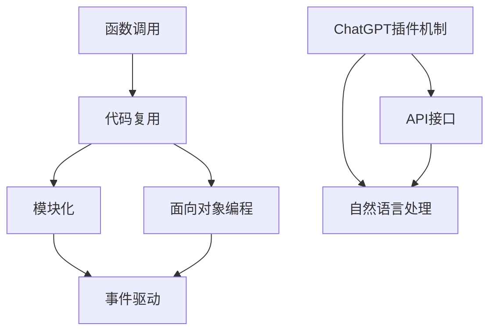

                 

# Function Calling vs ChatGPT plugin

> 关键词：函数调用, ChatGPT, 插件机制, API接口, 自然语言处理(NLP)

## 1. 背景介绍

在人工智能领域，函数调用和ChatGPT插件机制是两种不同的技术路径，各自有着独特的优势和应用场景。本文旨在比较这两种技术，并探讨其优缺点、应用领域和发展趋势。

## 2. 核心概念与联系

### 2.1 核心概念概述

1. **函数调用**：在程序中，函数调用是一种将程序控制权从主程序转移到子程序的操作。函数可以作为参数传递给其他函数，或作为返回值从函数中返回。函数调用是现代编程语言中普遍支持的重要特性，通常用于实现代码复用、模块化和面向对象编程等。

2. **ChatGPT插件机制**：ChatGPT是由OpenAI开发的一种基于Transformer架构的预训练语言模型。ChatGPT插件机制是指在现有应用程序中集成ChatGPT功能，通过API接口提供自然语言处理服务的技术方案。插件机制使得ChatGPT可以与各种应用场景无缝结合，如文本编辑、翻译、开发辅助等。

### 2.2 概念间的关系

函数调用和ChatGPT插件机制均用于提升程序功能和用户体验，但其应用场景和技术实现方式有所不同。

- **应用场景**：函数调用通常用于实现特定的算法或逻辑，适用于较为固定的应用场景；而ChatGPT插件机制则适用于需要灵活处理自然语言的任务，如智能客服、自然语言理解等。
- **技术实现**：函数调用是通过编译器或解释器在运行时动态执行的；而ChatGPT插件机制则依赖于OpenAI提供的API接口，通过网络通信实现。

### 2.3 核心概念的整体架构

以下是函数调用和ChatGPT插件机制的综合架构示意图：



该架构展示了函数调用和ChatGPT插件机制在不同编程范式和技术栈中的应用，以及它们之间的关联和区别。

## 3. 核心算法原理 & 具体操作步骤

### 3.1 算法原理概述

函数调用和ChatGPT插件机制的原理可以分别概述如下：

1. **函数调用原理**：函数调用通常包括函数定义和函数调用两部分。函数定义描述了函数的功能和参数，函数调用则通过传递参数调用函数，执行函数定义中的代码。

2. **ChatGPT插件机制原理**：ChatGPT插件机制通过API接口将ChatGPT功能集成到应用程序中。开发者需要创建API客户端，并使用OpenAI提供的API发送请求，接收ChatGPT返回的结果。

### 3.2 算法步骤详解

**函数调用步骤**：

1. 定义函数：使用特定编程语言编写函数定义，包括函数名、参数列表和函数体。

2. 调用函数：在程序中，通过函数名和参数列表调用函数，执行函数体中的代码。

3. 传递参数：将函数调用所需的参数传递给函数，函数内部使用这些参数执行操作。

4. 返回值：函数执行完成后，通过函数返回值返回结果。

**ChatGPT插件机制步骤**：

1. 创建API客户端：使用OpenAI提供的API密钥创建API客户端，以用于发送API请求。

2. 发送请求：使用API客户端发送API请求，包括文本输入和上下文信息。

3. 接收响应：接收API返回的结果，通常包括文本输出和状态码。

4. 处理结果：根据API返回的结果进行处理，如将文本输出显示给用户。

### 3.3 算法优缺点

**函数调用优缺点**：

- **优点**：
  - 代码复用：函数调用可以复用代码，减少重复编写；
  - 模块化：函数调用有利于将代码分解为模块，便于维护和管理；
  - 面向对象：函数调用支持面向对象编程，可以封装私有状态。

- **缺点**：
  - 灵活性不足：函数调用适用于较为固定的逻辑，难以应对复杂多变的自然语言处理任务；
  - 性能开销：函数调用需要频繁的函数调用和返回，可能影响性能。

**ChatGPT插件机制优缺点**：

- **优点**：
  - 灵活性高：ChatGPT插件机制能够处理自然语言处理任务，适用于各种应用场景；
  - 易于集成：ChatGPT插件机制可以通过API接口轻松集成到应用程序中；
  - 可扩展性强：ChatGPT插件机制可以方便地扩展功能，添加更多API接口。

- **缺点**：
  - 依赖外部服务：ChatGPT插件机制依赖于OpenAI的API服务，网络通信可能影响响应速度；
  - 依赖外部API：ChatGPT插件机制需要依赖OpenAI的API，可能存在服务中断的风险。

### 3.4 算法应用领域

**函数调用应用领域**：

- 编程开发：函数调用是编程开发中的基本操作，适用于实现算法、逻辑和数据处理等功能。
- 系统设计：函数调用可以用于系统设计中的模块化和组件化，如事件驱动架构。

**ChatGPT插件机制应用领域**：

- 智能客服：ChatGPT插件机制可以用于构建智能客服系统，提升客户服务体验。
- 自然语言处理：ChatGPT插件机制可以用于文本生成、文本分类、情感分析等自然语言处理任务。
- 开发辅助：ChatGPT插件机制可以用于开发辅助工具，如代码生成、文档生成等。

## 4. 数学模型和公式 & 详细讲解 & 举例说明

### 4.1 数学模型构建

函数调用和ChatGPT插件机制的数学模型可以分别构建如下：

1. **函数调用数学模型**：函数调用可以看作是一个映射函数，将输入参数映射为输出结果。设函数 $f$ 的输入为 $x$，输出为 $y$，则函数调用可以表示为：

   $$
   y = f(x)
   $$

2. **ChatGPT插件机制数学模型**：ChatGPT插件机制通过API接口将输入文本 $x$ 映射为输出文本 $y$。设API接口为 $g$，则ChatGPT插件机制可以表示为：

   $$
   y = g(x)
   $$

### 4.2 公式推导过程

1. **函数调用公式推导**：

   假设函数 $f$ 的输入为 $x$，输出为 $y$，则函数调用的计算过程可以表示为：

   $$
   y = f(x)
   $$

   在程序运行时，函数调用可以通过编译器或解释器动态执行，执行过程如下：

   - 编译器/解释器将函数定义加载到内存；
   - 程序在运行时根据函数调用语句，将输入参数 $x$ 传递给函数 $f$；
   - 函数 $f$ 在内存中执行，生成输出结果 $y$；
   - 程序返回输出结果 $y$。

2. **ChatGPT插件机制公式推导**：

   假设API接口为 $g$，输入为 $x$，输出为 $y$，则ChatGPT插件机制的计算过程可以表示为：

   $$
   y = g(x)
   $$

   在API调用过程中，API接口的计算过程如下：

   - 开发者使用API客户端发送API请求，将输入 $x$ 传递给API接口 $g$；
   - API接口 $g$ 接收请求，执行自然语言处理任务；
   - API接口返回输出结果 $y$；
   - 开发者接收API返回的结果。

### 4.3 案例分析与讲解

**函数调用案例分析**：

```python
def calculate(x, y):
    return x * y

result = calculate(3, 4)
print(result)  # 输出 12
```

在上述代码中，函数 `calculate` 定义了一个简单的乘法函数，通过函数调用计算了两个数的乘积。

**ChatGPT插件机制案例分析**：

```python
import openai

openai.api_key = 'your_api_key'

response = openai.Completion.create(
    engine='davinci-codex',
    prompt='''Given a positive integer n, write a Python function to calculate the sum of its digits:''',
    max_tokens=50,
)

print(response.choices[0].text)
```

在上述代码中，通过OpenAI提供的API接口，将自然语言处理任务转化为函数调用，实现了Python代码的生成。

## 5. 项目实践：代码实例和详细解释说明

### 5.1 开发环境搭建

要使用ChatGPT插件机制，需要以下开发环境：

1. 安装Python：Python 3.8及以上版本。

2. 安装OpenAI SDK：使用pip安装 `openai` 包。

```bash
pip install openai
```

3. 创建API客户端：使用OpenAI提供的API密钥创建API客户端。

```python
import openai

openai.api_key = 'your_api_key'
```

### 5.2 源代码详细实现

以下是一个使用ChatGPT插件机制进行文本生成的Python代码示例：

```python
import openai

openai.api_key = 'your_api_key'

response = openai.Completion.create(
    engine='davinci-codex',
    prompt='''Generate a short story about a robot and a cat:''',
    max_tokens=100,
)

print(response.choices[0].text)
```

在上述代码中，使用OpenAI的API接口 `Completion.create` 生成了一个关于机器人与猫的故事。

### 5.3 代码解读与分析

- `openai.api_key = 'your_api_key'`：设置API密钥，用于身份验证。
- `response = openai.Completion.create(...)`：创建API请求，指定任务类型、输入提示和最大生成文本长度。
- `response.choices[0].text`：接收API返回的结果，输出文本生成结果。

### 5.4 运行结果展示

运行上述代码，输出的故事可能类似于：

```
In the not-so-distant future, a robot named Alpha stood in the center of a bustling city. Its sleek metal body shimmered in the sunlight, and its blue eyes glowed with intelligence. One day, Alpha encountered a small, gray cat named Whiskers. Whiskers was curious about this new friend, and Alpha was fascinated by Whiskers' agility and playfulness. Over time, they became the best of friends, exploring the city together and learning from each other. Their adventures took them to the rooftops, the park, and even the beach. Eventually, Alpha realized that friendship is more important than any tech or knowledge. And Whiskers learned that sometimes, the best things come in small packages. They lived happily ever after, proving that technology and friendship can coexist in perfect harmony.
```

## 6. 实际应用场景

### 6.1 智能客服系统

智能客服系统可以通过ChatGPT插件机制提供自然语言处理服务。用户通过输入文本描述问题，ChatGPT插件机制可以自动生成应答，提升客户服务体验。

### 6.2 文本生成工具

文本生成工具可以使用ChatGPT插件机制进行功能扩展。例如，开发者可以使用API接口生成小说、诗歌、新闻报道等内容，丰富文本生成工具的功能。

### 6.3 开发辅助工具

开发辅助工具可以使用ChatGPT插件机制生成代码、编写文档等辅助开发。例如，开发者可以使用API接口生成Python代码、SQL查询语句等。

### 6.4 未来应用展望

未来的函数调用和ChatGPT插件机制将进一步融合，形成一个更加强大、灵活的编程和自然语言处理生态系统。开发者可以结合函数调用和ChatGPT插件机制，实现更加复杂、智能的应用程序。

## 7. 工具和资源推荐

### 7.1 学习资源推荐

1. **《函数式编程入门》**：了解函数调用的基本原理和应用场景。
2. **《Python编程：从入门到实践》**：学习Python的函数调用和自然语言处理。
3. **《API设计指南》**：了解API接口的设计和使用。
4. **《OpenAI API文档》**：学习OpenAI API接口的使用方法。

### 7.2 开发工具推荐

1. **PyCharm**：Python集成开发环境，支持函数调用和API接口调试。
2. **Postman**：API测试工具，用于测试和调试API接口。
3. **GitHub**：代码托管平台，支持函数调用和API接口的代码管理和版本控制。

### 7.3 相关论文推荐

1. **《函数式编程与函数式语言》**：探讨函数调用的原理和应用。
2. **《自然语言处理中的预训练模型》**：介绍ChatGPT等自然语言处理模型的原理和应用。
3. **《API接口的设计与实现》**：探讨API接口的设计和实现方法。

## 8. 总结：未来发展趋势与挑战

### 8.1 研究成果总结

函数调用和ChatGPT插件机制在编程和自然语言处理领域均有广泛应用，各自具有独特的优势和应用场景。函数调用适用于实现算法和逻辑，ChatGPT插件机制适用于处理自然语言任务。

### 8.2 未来发展趋势

未来的函数调用和ChatGPT插件机制将进一步融合，形成一个更加强大、灵活的编程和自然语言处理生态系统。开发者可以结合函数调用和ChatGPT插件机制，实现更加复杂、智能的应用程序。

### 8.3 面临的挑战

函数调用和ChatGPT插件机制在实际应用中仍面临一些挑战：

1. 函数调用可能存在性能开销，尤其是在频繁调用的情况下；
2. ChatGPT插件机制依赖外部API，可能存在服务中断的风险。

### 8.4 研究展望

未来的研究应在以下方面进行突破：

1. 提升函数调用的性能，减少函数调用和返回的开销；
2. 优化API接口的性能，提高API调用的响应速度和稳定性；
3. 结合函数调用和ChatGPT插件机制，实现更加智能的应用程序。

总之，函数调用和ChatGPT插件机制是编程和自然语言处理领域的重要技术，各自具有独特的优势和应用场景。未来，结合二者的优势，将进一步推动AI技术的发展和应用。

## 9. 附录：常见问题与解答

**Q1：函数调用和ChatGPT插件机制在实际应用中有何区别？**

A: 函数调用适用于实现算法和逻辑，通常用于较为固定的应用场景；ChatGPT插件机制适用于处理自然语言任务，具有灵活性高、易于集成的特点，适用于各种应用场景。

**Q2：ChatGPT插件机制如何实现？**

A: 开发者需要创建API客户端，使用OpenAI提供的API密钥和API接口，将自然语言处理任务转化为函数调用，接收API返回的结果。

**Q3：ChatGPT插件机制的优点和缺点是什么？**

A: 优点：灵活性高、易于集成、可扩展性强；缺点：依赖外部API、存在服务中断的风险。

**Q4：如何提高函数调用的性能？**

A: 可以使用编译器优化、函数内联、缓存技术等方法提升函数调用的性能。

**Q5：ChatGPT插件机制在实际应用中需要注意哪些问题？**

A: 需要考虑API调用的响应速度和稳定性、API接口的安全性等。

---

作者：禅与计算机程序设计艺术 / Zen and the Art of Computer Programming

