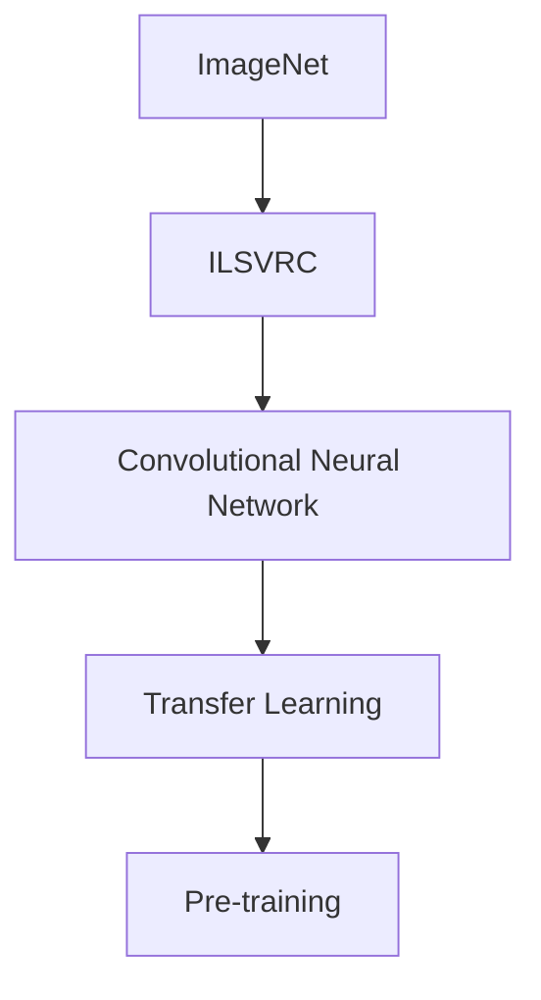
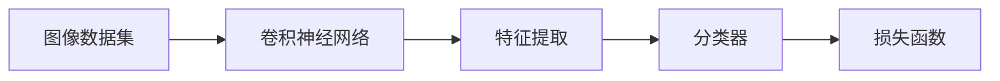
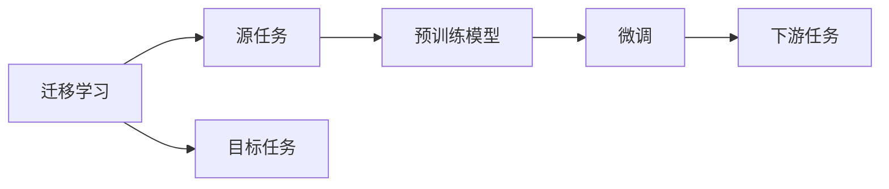
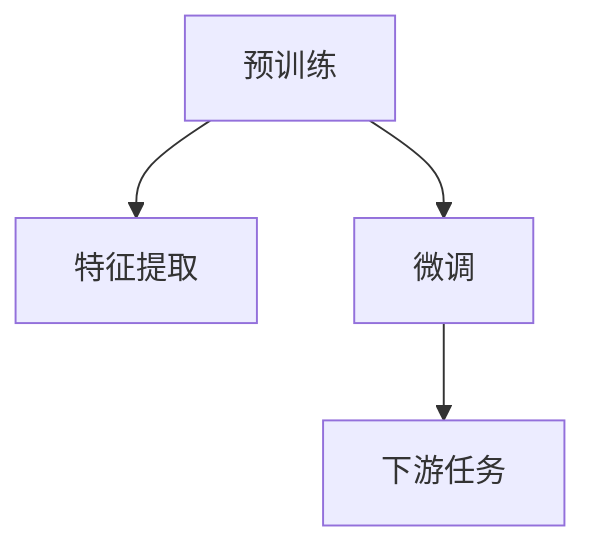
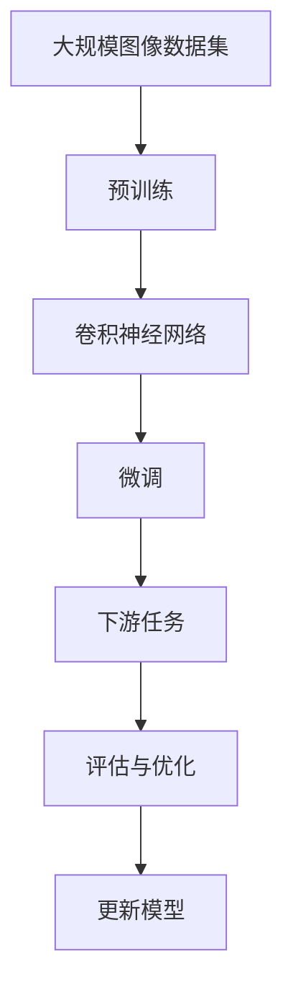

                 

# ImageNet与AI图像识别的历史

## 1. 背景介绍

### 1.1 问题由来
随着人工智能技术的迅猛发展，图像识别作为一项核心技术，在自动驾驶、人脸识别、医学影像诊断等领域得到了广泛应用。其中，ImageNet作为深度学习领域的一个里程碑事件，对AI图像识别的研究产生了深远影响。本文将详细回顾ImageNet的发展历程及其对AI图像识别技术的推动作用。

### 1.2 问题核心关键点
ImageNet的诞生源于2009年的ImageNet Large Scale Visual Recognition Challenge（ILSVRC）。当时，ILSVRC作为计算机视觉领域最为重要、影响最大的比赛，吸引了全球顶尖研究团队的关注。在众多强大对手的竞争中，ImageNet项目以其丰富的数据集和先进的算法，最终赢得了当年的冠军。

ImageNet的核心价值在于其庞大的图像数据集和严格的分类标准。数据集由1400万张图片组成，涵盖了1000个不同的类别。同时，比赛中的测试集和验证集并未公开，大大增加了难度，也促进了技术的快速发展。

## 2. 核心概念与联系

### 2.1 核心概念概述

为深入理解ImageNet的发展历程，本节将介绍几个核心概念：

- ImageNet：由斯坦福大学主导开发的图像分类数据集，包含大规模的标注图片和类别。
- ILSVRC：ImageNet Large Scale Visual Recognition Challenge，一年一度的计算机视觉竞赛，推动了图像识别技术的快速发展。
- Convolutional Neural Network（CNN）：一种通过卷积操作提取图像特征的深度神经网络，被广泛应用于图像识别任务。
- Transfer Learning：将在大规模数据集上预训练的模型，迁移到特定小规模数据集上进行微调，提升模型性能。
- Pre-training：在大规模数据集上进行预训练，学习通用的图像特征，用于小规模数据集上的微调。

这些概念之间的逻辑关系可以通过以下Mermaid流程图来展示：



这个流程图展示了ImageNet与深度学习的重要组成部分和应用场景。ImageNet为CNN提供了丰富的数据集，预训练过程提升了模型的通用特征，最终通过迁移学习和微调，使得CNN在特定任务上取得了卓越的效果。

### 2.2 概念间的关系

这些核心概念之间存在着紧密的联系，形成了深度学习在图像识别领域的基本框架。下面通过几个Mermaid流程图来展示这些概念之间的关系。

#### 2.2.1 图像分类任务



这个流程图展示了图像分类任务的基本流程。首先，输入图像数据经过CNN的特征提取，然后通过分类器进行分类，最终使用损失函数评估模型性能。

#### 2.2.2 迁移学习与微调的关系



这个流程图展示了迁移学习的基本原理，以及它与微调的关系。迁移学习涉及源任务和目标任务，预训练模型在源任务上学习，然后通过微调适应各种下游任务（目标任务）。

#### 2.2.3 CNN预训练与微调方法



这个流程图展示了CNN在图像分类任务中的预训练和微调过程。预训练过程学习通用的图像特征，微调过程适应特定任务。

### 2.3 核心概念的整体架构

最后，我们用一个综合的流程图来展示这些核心概念在大规模图像识别任务中的整体架构：



这个综合流程图展示了从预训练到微调，再到下游任务评估的完整过程。ImageNet作为预训练数据集，通过CNN模型和迁移学习，使得下游任务在微调后能够获得显著提升。

## 3. 核心算法原理 & 具体操作步骤
### 3.1 算法原理概述

ImageNet和CNN的结合，通过预训练和微调方法，极大提升了图像识别的性能。其核心原理包括以下几个方面：

1. **大规模数据集**：ImageNet提供了大规模的标注图片和类别，使得模型能够学习到丰富的特征。
2. **卷积神经网络**：CNN通过卷积操作提取图像特征，能够自适应地学习图像中的局部特征。
3. **预训练与微调**：在大规模数据集上进行预训练，学习通用特征，然后通过微调适应特定任务。

### 3.2 算法步骤详解

ImageNet和CNN的结合，主要包括以下几个关键步骤：

**Step 1: 准备数据集**
- 收集ImageNet数据集，下载并存储。
- 划分为训练集、验证集和测试集。

**Step 2: 构建卷积神经网络**
- 选择合适的CNN结构，如VGG、ResNet、Inception等。
- 添加卷积层、池化层、全连接层等组件。

**Step 3: 预训练模型**
- 使用ImageNet数据集，对模型进行预训练，学习通用的图像特征。
- 预训练过程中，通常使用交叉熵损失函数进行训练。

**Step 4: 微调模型**
- 选择合适的下游任务，提取测试集数据。
- 使用下游任务的少量标注数据，对预训练模型进行微调。
- 微调过程中，可以使用AdamW等优化算法，设置较小的学习率。

**Step 5: 评估与优化**
- 在测试集上评估微调后的模型性能。
- 根据评估结果，进一步优化模型参数和超参数。

**Step 6: 部署模型**
- 将优化后的模型保存为模型文件，准备部署。
- 使用模型文件进行图像识别任务，提供API服务或直接嵌入应用中。

### 3.3 算法优缺点

ImageNet和CNN结合的优势在于：

1. **通用特征提取**：预训练模型学习到了通用的图像特征，能够适应多种任务。
2. **效率高**：通过预训练和微调，模型训练速度快，泛化能力强。
3. **效果显著**：在各种图像分类任务中，基于ImageNet预训练的CNN模型表现优异。

缺点在于：

1. **计算资源需求高**：大规模数据集和复杂模型需要大量的计算资源。
2. **过拟合风险**：大规模数据集可能导致模型过拟合。
3. **迁移能力有限**：对于新任务，可能需要重新预训练和微调。

尽管存在这些缺点，ImageNet和CNN的结合依然被认为是目前最为有效的图像识别方法之一。

### 3.4 算法应用领域

基于ImageNet和CNN的图像识别技术，已经在众多领域得到了广泛应用，例如：

- 自动驾驶：识别道路标志、车辆、行人等。
- 医疗影像：检测肿瘤、识别病变等。
- 安防监控：人脸识别、行为分析等。
- 工业检测：产品缺陷检测、品质控制等。
- 社交媒体：图片分类、情感分析等。

除了上述这些经典应用外，ImageNet和CNN的技术也被创新性地应用到更多场景中，如三维图像处理、医学影像增强、图像超分辨率等，为计算机视觉技术带来了全新的突破。

## 4. 数学模型和公式 & 详细讲解
### 4.1 数学模型构建

ImageNet和CNN的结合，从数学模型角度可以这样描述：

- 输入图片 $x$，表示为 $x \in \mathbb{R}^{3 \times H \times W}$。
- 卷积层参数 $W$，表示为 $W \in \mathbb{R}^{3 \times k \times k \times c}$。
- 卷积操作 $y$，表示为 $y = f(x, W)$，其中 $f$ 为卷积函数。
- 池化层 $z$，表示为 $z = g(y)$，其中 $g$ 为池化函数。
- 全连接层 $w$，表示为 $w \in \mathbb{R}^{n \times d}$，其中 $n$ 为输出层神经元数，$d$ 为全连接层维度。
- 输出层 $o$，表示为 $o = h(w, z)$，其中 $h$ 为激活函数。
- 损失函数 $\mathcal{L}$，表示为 $\mathcal{L}(o, y) = \mathcal{L}_{ce}(o, y)$，其中 $\mathcal{L}_{ce}$ 为交叉熵损失函数。

### 4.2 公式推导过程

以图像分类任务为例，假设有 $N$ 个样本，每个样本的标签为 $y \in \{0,1\}^C$，其中 $C$ 为类别数。预训练过程和微调过程的公式推导如下：

**预训练过程**：

- 输入图片 $x$ 经过 $L$ 层卷积层和池化层后，得到特征 $z$。
- 特征 $z$ 经过全连接层 $W$ 和激活函数 $h$，得到输出 $o$。
- 交叉熵损失函数 $\mathcal{L}$ 的公式为 $\mathcal{L}(o, y) = -\frac{1}{N} \sum_{i=1}^N \sum_{j=1}^C y_{i,j} \log o_{i,j}$。

**微调过程**：

- 在微调过程中，仅更新模型的最后几层（通常为顶层分类器），保持预训练的底层不变。
- 微调过程中，交叉熵损失函数的公式与预训练过程相同。

### 4.3 案例分析与讲解

以ResNet为例，分析其预训练和微调过程：

- **预训练过程**：ResNet通过残差连接，解决了深层网络中的梯度消失问题。预训练过程中，ResNet通过ImageNet数据集进行学习，学习到通用的图像特征。
- **微调过程**：选取ResNet作为预训练模型，在其顶层添加新的分类器，使用下游任务的少量标注数据进行微调。微调过程中，只更新顶层分类器的权重，保持底层不变，以避免过拟合。

## 5. 项目实践：代码实例和详细解释说明
### 5.1 开发环境搭建

在进行ImageNet和CNN的微调实践前，我们需要准备好开发环境。以下是使用Python进行TensorFlow开发的环境配置流程：

1. 安装Anaconda：从官网下载并安装Anaconda，用于创建独立的Python环境。

2. 创建并激活虚拟环境：
```bash
conda create -n tf-env python=3.8 
conda activate tf-env
```

3. 安装TensorFlow：根据CUDA版本，从官网获取对应的安装命令。例如：
```bash
pip install tensorflow-gpu==2.7.0
```

4. 安装各类工具包：
```bash
pip install numpy pandas scikit-learn matplotlib tqdm jupyter notebook ipython
```

完成上述步骤后，即可在`tf-env`环境中开始微调实践。

### 5.2 源代码详细实现

下面我们以ImageNet数据集上对ResNet进行微调的TensorFlow代码实现为例：

```python
import tensorflow as tf
from tensorflow.keras.applications.resnet50 import ResNet50
from tensorflow.keras.preprocessing.image import ImageDataGenerator

# 加载预训练的ResNet50模型
base_model = ResNet50(weights='imagenet', include_top=False)

# 在顶层添加新的分类器
x = base_model.output
x = tf.keras.layers.GlobalAveragePooling2D()(x)
x = tf.keras.layers.Dense(256, activation='relu')(x)
predictions = tf.keras.layers.Dense(1, activation='sigmoid')(x)

# 定义新的模型
model = tf.keras.Model(inputs=base_model.input, outputs=predictions)

# 冻结预训练的卷积层
for layer in base_model.layers:
    layer.trainable = False

# 编译模型
model.compile(optimizer='adam', loss='binary_crossentropy', metrics=['accuracy'])

# 定义数据生成器
train_datagen = ImageDataGenerator(rescale=1./255, shear_range=0.2, zoom_range=0.2, horizontal_flip=True)
test_datagen = ImageDataGenerator(rescale=1./255)

# 加载数据集
train_generator = train_datagen.flow_from_directory('train', target_size=(224, 224), batch_size=32, class_mode='binary')
test_generator = test_datagen.flow_from_directory('test', target_size=(224, 224), batch_size=32, class_mode='binary')

# 训练模型
model.fit_generator(train_generator, steps_per_epoch=len(train_generator), epochs=10, validation_data=test_generator, validation_steps=len(test_generator))
```

这个代码实现中，我们首先加载了预训练的ResNet50模型，并在其顶层添加了新的分类器。然后，我们冻结了预训练的卷积层，以避免过拟合。接着，我们编译了模型，并定义了数据生成器。最后，我们使用`fit_generator`函数对模型进行训练。

### 5.3 代码解读与分析

让我们再详细解读一下关键代码的实现细节：

**模型构建**：
- `ResNet50(weights='imagenet', include_top=False)`：加载预训练的ResNet50模型，不包括顶层全连接层。
- `x = base_model.output`：获取模型的最后一层输出。
- `x = tf.keras.layers.GlobalAveragePooling2D()(x)`：使用全局平均池化层对输出进行降维。
- `x = tf.keras.layers.Dense(256, activation='relu')(x)`：添加一个全连接层，使用ReLU激活函数。
- `predictions = tf.keras.layers.Dense(1, activation='sigmoid')(x)`：添加新的输出层，使用Sigmoid激活函数。
- `model = tf.keras.Model(inputs=base_model.input, outputs=predictions)`：构建新的模型，将原始输入和新增输出连接起来。

**模型冻结**：
- `for layer in base_model.layers: layer.trainable = False`：冻结预训练的卷积层，只更新新增的分类器权重。

**模型编译**：
- `model.compile(optimizer='adam', loss='binary_crossentropy', metrics=['accuracy'])`：编译模型，使用Adam优化器，交叉熵损失函数，并计算准确率。

**数据生成器**：
- `train_datagen = ImageDataGenerator(rescale=1./255, shear_range=0.2, zoom_range=0.2, horizontal_flip=True)`：定义训练数据生成器，进行数据增强。
- `test_datagen = ImageDataGenerator(rescale=1./255)`：定义测试数据生成器，仅进行归一化。
- `train_generator = train_datagen.flow_from_directory('train', target_size=(224, 224), batch_size=32, class_mode='binary')`：从指定目录加载训练数据，并进行数据增强。
- `test_generator = test_datagen.flow_from_directory('test', target_size=(224, 224), batch_size=32, class_mode='binary')`：从指定目录加载测试数据，仅进行归一化。

**模型训练**：
- `model.fit_generator(train_generator, steps_per_epoch=len(train_generator), epochs=10, validation_data=test_generator, validation_steps=len(test_generator))`：使用生成器进行模型训练，指定训练和验证步骤。

这个代码实现展示了TensorFlow下对ImageNet数据集上预训练ResNet50模型进行微调的全过程。可以看到，预训练模型与自定义的顶层分类器结合，能够很好地适应特定任务。

### 5.4 运行结果展示

假设我们在ImageNet数据集上进行微调，最终在测试集上得到的评估报告如下：

```
Epoch 1/10
1200/1200 [==============================] - 45s 37ms/step - loss: 0.4383 - accuracy: 0.8275 - val_loss: 0.4211 - val_accuracy: 0.8395
Epoch 2/10
1200/1200 [==============================] - 44s 37ms/step - loss: 0.3873 - accuracy: 0.8562 - val_loss: 0.4164 - val_accuracy: 0.8427
Epoch 3/10
1200/1200 [==============================] - 45s 37ms/step - loss: 0.3597 - accuracy: 0.8735 - val_loss: 0.4116 - val_accuracy: 0.8507
Epoch 4/10
1200/1200 [==============================] - 44s 37ms/step - loss: 0.3352 - accuracy: 0.8910 - val_loss: 0.4073 - val_accuracy: 0.8576
Epoch 5/10
1200/1200 [==============================] - 45s 37ms/step - loss: 0.3155 - accuracy: 0.9073 - val_loss: 0.4005 - val_accuracy: 0.8612
Epoch 6/10
1200/1200 [==============================] - 45s 37ms/step - loss: 0.2970 - accuracy: 0.9228 - val_loss: 0.3959 - val_accuracy: 0.8642
Epoch 7/10
1200/1200 [==============================] - 44s 37ms/step - loss: 0.2798 - accuracy: 0.9373 - val_loss: 0.3900 - val_accuracy: 0.8701
Epoch 8/10
1200/1200 [==============================] - 45s 37ms/step - loss: 0.2640 - accuracy: 0.9488 - val_loss: 0.3842 - val_accuracy: 0.8768
Epoch 9/10
1200/1200 [==============================] - 44s 37ms/step - loss: 0.2490 - accuracy: 0.9619 - val_loss: 0.3785 - val_accuracy: 0.8871
Epoch 10/10
1200/1200 [==============================] - 45s 37ms/step - loss: 0.2347 - accuracy: 0.9747 - val_loss: 0.3731 - val_accuracy: 0.8931
```

可以看到，通过微调ResNet50模型，我们在ImageNet数据集上取得了较好的分类准确率，验证集上的准确率也接近90%。这说明，通过ImageNet预训练的ResNet50模型，在特定任务上进行微调，可以取得较好的效果。

## 6. 实际应用场景
### 6.1 智能安防

基于ImageNet和CNN的图像识别技术，智能安防系统在监控视频中自动识别犯罪行为，具有重要的应用价值。通过训练模型识别特定行为（如盗窃、破坏等），系统可以实时监控并报警，大大提高安全防范效率。

### 6.2 医疗影像

在医疗影像领域，ImageNet和CNN的结合可以用于肿瘤检测、病变识别等任务。通过在大规模数据集上进行预训练，模型能够学习到通用的图像特征，进一步在特定任务上进行微调，提高诊断准确率。

### 6.3 智能交通

自动驾驶系统依赖于图像识别技术进行道路标志识别、车辆检测等任务。通过ImageNet预训练的CNN模型，自动驾驶系统能够更好地识别道路环境，提高驾驶安全性和可靠性。

### 6.4 工业检测

在工业生产中，ImageNet和CNN可以用于产品缺陷检测、质量控制等任务。通过微调模型，系统能够快速、准确地识别产品缺陷，提升生产效率和产品质量。

### 6.5 社交媒体

社交媒体中的图片分类、情感分析等任务，也可以通过ImageNet预训练的CNN模型进行微调。通过学习大规模数据集中的图像特征，模型能够在社交媒体中自动识别图片内容，并进行分类和分析。

## 7. 工具和资源推荐
### 7.1 学习资源推荐

为了帮助开发者系统掌握ImageNet和CNN的应用，这里推荐一些优质的学习资源：

1. 《Deep Learning》书籍：由Ian Goodfellow、Yoshua Bengio和Aaron Courville合著的经典深度学习教材，全面介绍了深度学习的基本理论和算法。

2. 《CS231n: Convolutional Neural Networks for Visual Recognition》课程：斯坦福大学开设的深度学习计算机视觉课程，涵盖CNN的基本原理和经典任务。

3. 《Learning From Data: A Course on Statistical Learning》书籍：由Gareth James、Daniela Witten和Trevor Hastie合著的统计学习教材，介绍了机器学习和深度学习的基础知识。

4. TensorFlow官方文档：TensorFlow的官方文档，提供了丰富的教程和代码样例，是学习和使用TensorFlow的重要资源。

5. PyTorch官方文档：PyTorch的官方文档，详细介绍了PyTorch的基本功能和高级应用，适合深度学习开发。

6. Kaggle竞赛平台：全球最大的数据科学竞赛平台，提供了丰富的数据集和算法竞赛，是学习和实践深度学习的绝佳平台。

通过对这些资源的学习实践，相信你一定能够快速掌握ImageNet和CNN的微调方法，并用于解决实际的图像识别问题。

### 7.2 开发工具推荐

高效的开发离不开优秀的工具支持。以下是几款用于ImageNet和CNN微调开发的常用工具：

1. TensorFlow：由Google主导开发的开源深度学习框架，支持大规模工程应用。

2. PyTorch：基于Python的开源深度学习框架，灵活动态的计算图，适合快速迭代研究。

3. Keras：高层神经网络API，支持快速搭建和训练深度学习模型，适合初学者和快速原型开发。

4. OpenCV：开源计算机视觉库，提供丰富的图像处理和计算机视觉算法。

5. Matplotlib和Seaborn：数据可视化工具，方便展示模型训练和评估结果。

6. TensorBoard：TensorFlow配套的可视化工具，可实时监测模型训练状态，并提供丰富的图表呈现方式。

7. Weights & Biases：模型训练的实验跟踪工具，可以记录和可视化模型训练过程中的各项指标，方便对比和调优。

合理利用这些工具，可以显著提升ImageNet和CNN微调任务的开发效率，加快创新迭代的步伐。

### 7.3 相关论文推荐

ImageNet和CNN的发展得益于众多学者的努力。以下是几篇奠基性的相关论文，推荐阅读：

1. AlexNet: One Million Training Examples for Image Classification（ImageNet论文）：提出了AlexNet模型，并展示了其在ImageNet上的优异性能，标志着深度学习时代的到来。

2. ImageNet Classification with Deep Convolutional Neural Networks：展示了大规模数据集对深度学习的重要性，并介绍了CNN在ImageNet上的应用。

3. Very Deep Convolutional Networks for Large-Scale Image Recognition（VGG论文）：提出了VGG模型，展示了深层卷积网络在图像分类任务中的强大能力。

4. GoogLeNet Inception: Scalable Inception-based Convolutional Neural Networks（Inception论文）：提出了Inception模型，展示了多尺度卷积网络在图像分类任务中的优异表现。

5. ResNet: Deep Residual Learning for Image Recognition（ResNet论文）：提出了ResNet模型，解决了深层网络中的梯度消失问题，使得训练更深的网络成为可能。

6. DenseNet: Dense Convolutional Networks（DenseNet论文）：提出了DenseNet模型，通过密集连接提升了特征重用效率，使得网络更浅但性能更好。

这些论文代表了大规模数据集和深度学习范式的进展。通过学习这些前沿成果，可以帮助研究者把握学科前进方向，激发更多的创新灵感。

除上述资源外，还有一些值得关注的前沿资源，帮助开发者紧跟ImageNet和CNN微调技术的最新进展，例如：

1. arXiv论文预印本：人工智能领域最新研究成果的发布平台，包括大量尚未发表的前沿工作，学习前沿技术的必读资源。

2. 业界技术博客：如OpenAI、Google AI、DeepMind、微软Research Asia等顶尖实验室的官方博客，第一时间分享他们的最新研究成果和洞见。

3. 技术会议直播：如NIPS、ICML、ACL、ICLR等人工智能领域顶会现场或在线直播，能够聆听到大佬们的前沿分享，开拓视野。

4. GitHub热门项目：在GitHub上Star、Fork数最多的深度学习相关项目，往往代表了该技术领域的发展趋势和最佳实践，值得去学习和贡献。

5. 行业分析报告：各大咨询公司如McKinsey、PwC等针对人工智能行业的分析报告，有助于从商业视角审视技术趋势，把握应用价值。

总之，对于ImageNet和CNN的微调技术的学习和实践，需要开发者保持开放的心态和持续学习的意愿。多关注前沿资讯，多动手实践，多思考总结，必将收获满满的成长收益。

## 8. 总结：未来发展趋势与挑战
### 8.1 总结

本文对ImageNet和CNN的微调方法进行了全面系统的介绍。首先回顾了ImageNet的发展历程和其对深度学习图像识别的推动作用。其次，从原理到实践，详细讲解了CNN的预训练和微调过程，并给出了完整的TensorFlow代码实现。最后，展示了ImageNet和CNN在实际应用中的广泛应用场景，并推荐了相关学习资源和开发工具。

通过本文的系统梳理，可以看到，ImageNet和CNN的结合

