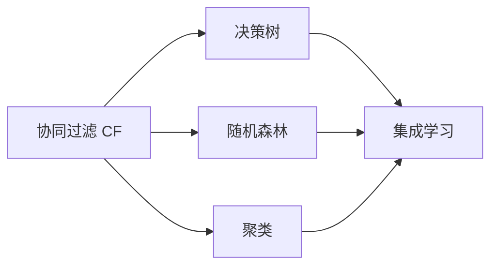
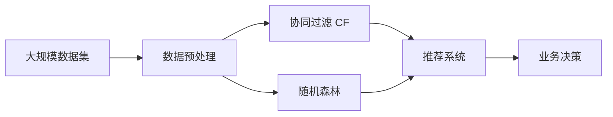

                 

# Mahout机器学习算法库原理与代码实例讲解

## 1. 背景介绍

### 1.1 问题由来

在当今数据驱动的科技时代，机器学习（Machine Learning, ML）已经成为企业获取竞争优势的关键技术。Mahout，作为Apache基金会下的开源机器学习库，自2008年发布以来，已经在多个领域大显身手。它提供了丰富的算法实现，涵盖了分类、聚类、推荐系统等多个方面，帮助企业和科研机构高效地实现数据建模和预测任务。

然而，尽管Mahout提供了诸多优秀的算法实现，但具体如何选择合适的算法，以及如何在实际应用中实现和优化这些算法，仍然是一个不小的挑战。为此，本文将深入解析Mahout的核心算法原理，并通过具体的代码实例，介绍其算法的具体操作步骤、优点与缺点，以及在不同领域的应用。

### 1.2 问题核心关键点

Mahout的核心算法包括协同过滤、决策树、随机森林、聚类算法等，广泛应用于推荐系统、广告定向、社交网络分析等多个场景。本文将重点讲解其中的协同过滤算法和随机森林算法，并结合实际案例，展示其如何在推荐系统和广告定向中实现高效的应用。

### 1.3 问题研究意义

通过深入理解Mahout的算法原理和代码实现，读者可以：
1. 掌握机器学习算法的核心思想和实现细节。
2. 学习如何根据具体场景选择合适的算法。
3. 了解算法的优点与缺点，避免在实际应用中盲目选择。
4. 学会如何在实际数据集上实现和优化算法。
5. 拓展机器学习算法的应用边界，提升业务决策的准确性。

## 2. 核心概念与联系

### 2.1 核心概念概述

为了更好地理解Mahout算法的核心概念及其相互联系，本文将简要介绍以下关键概念：

- **协同过滤（Collaborative Filtering, CF）**：一种基于用户行为数据的推荐算法，通过分析用户和物品的相似性来预测用户可能感兴趣的物品。
- **随机森林（Random Forest）**：一种基于决策树的集成学习算法，通过随机选择特征和样本来降低过拟合，提高模型的泛化能力。
- **聚类算法（Clustering）**：一种无监督学习算法，通过将数据分成不同的群组，实现数据降维和分类。

### 2.2 概念间的关系

这些核心概念之间存在着密切的联系，形成了Mahout机器学习库的核心算法框架。下面将通过一个简单的Mermaid流程图来展示这些概念之间的相互关系：



这个流程图展示了Mahout机器学习库中协同过滤、决策树、随机森林和聚类算法之间的关系：

1. 协同过滤和随机森林是两种主要的推荐算法。
2. 聚类算法可以用来进行用户和物品的分群，提高协同过滤的效果。
3. 集成学习可以将多个算法进行组合，形成更加鲁棒的预测模型。

### 2.3 核心概念的整体架构

最后，我们用一个综合的流程图来展示这些核心概念在实际应用中的整体架构：



这个综合流程图展示了从数据预处理到业务决策的完整过程：

1. 首先，对大规模数据集进行预处理，确保数据质量和可用性。
2. 然后，分别应用协同过滤和随机森林算法，生成推荐结果。
3. 最后，将推荐结果集成到业务决策中，实现数据驱动的智能决策。

## 3. 核心算法原理 & 具体操作步骤
### 3.1 算法原理概述

**协同过滤算法**：
协同过滤是一种基于用户行为数据的推荐算法。其核心思想是通过分析用户的历史行为数据，找出与其他用户兴趣相似的用户，或者找出用户曾经喜欢的物品，从而预测用户可能感兴趣的新物品。协同过滤算法通常分为基于用户的协同过滤和基于物品的协同过滤。

**随机森林算法**：
随机森林是一种集成学习方法，通过构建多棵决策树，并利用随机抽样和特征选择，降低决策树的过拟合风险，提高模型的泛化能力。随机森林的核心思想是“投票法”，即通过多棵树的预测结果的投票，来确定最终的预测结果。

### 3.2 算法步骤详解

**协同过滤算法步骤**：
1. **数据准备**：收集用户和物品的交互数据，构建用户-物品评分矩阵。
2. **相似度计算**：计算用户之间的相似度或物品之间的相似度。
3. **预测评分**：根据用户或物品的相似度，预测用户可能对物品的评分。
4. **推荐物品**：根据预测评分，推荐用户可能感兴趣的新物品。

**随机森林算法步骤**：
1. **数据准备**：收集训练数据，并进行特征选择和归一化。
2. **随机抽样**：从数据集中随机抽取样本来构建决策树。
3. **特征选择**：在构建每棵树时，随机选择特征子集。
4. **模型训练**：使用随机抽样和特征选择后的数据集训练多棵决策树。
5. **集成预测**：通过多棵树的预测结果进行投票，确定最终的预测结果。

### 3.3 算法优缺点

**协同过滤算法优缺点**：
- **优点**：无需显式特征，直接利用用户行为数据进行推荐，适用于多种数据类型。
- **缺点**：数据稀疏性问题严重，难以处理冷启动用户或物品。

**随机森林算法优缺点**：
- **优点**：随机化方法降低过拟合风险，泛化能力强。
- **缺点**：模型解释性差，决策过程难以理解。

### 3.4 算法应用领域

**协同过滤算法**：
- **推荐系统**：如Amazon、Netflix等电商平台使用协同过滤算法为用户推荐商品。
- **广告定向**：Google等搜索平台使用协同过滤算法为用户推荐个性化广告。
- **社交网络分析**：分析用户之间的相似性和兴趣，帮助建立社交网络关系。

**随机森林算法**：
- **信用评分**：评估客户的信用风险，判断其还款能力。
- **疾病诊断**：分析患者的症状，预测其可能患有的疾病。
- **销售预测**：预测未来的销售情况，帮助企业制定营销策略。

## 4. 数学模型和公式 & 详细讲解

### 4.1 数学模型构建

为了更深入地理解Mahout算法的核心原理，我们将使用数学语言来描述其算法流程。

**协同过滤算法**：
设用户-物品评分矩阵为 $R_{m \times n}$，其中 $m$ 为用户数量，$n$ 为物品数量。设用户 $u$ 对物品 $i$ 的评分向量为 $r_i=(u_1,u_2,\dots,u_n)$，其中 $u_i$ 为 $u$ 对 $i$ 的评分。

基于用户的协同过滤算法可以表示为：
$$
\hat{r}_{ui} = \alpha \sum_{j \in N(u)}\frac{r_{uj}}{r_{uj}+r_{ji}}
$$
其中 $N(u)$ 为与用户 $u$ 相似的用户集合，$\alpha$ 为相似性系数，通常取值为1。

**随机森林算法**：
设训练数据集为 $D=\{(x_i,y_i)\}_{i=1}^N$，其中 $x_i$ 为特征向量，$y_i$ 为标签。设决策树的数量为 $T$，第 $t$ 棵树的结构为 $T_t$，特征选择方法为 $S$，随机采样方法为 $S'$。

随机森林算法可以表示为：
$$
\hat{y} = \text{argmax}_{y \in \{0,1\}} \sum_{t=1}^T f_t(x,y)
$$
其中 $f_t(x,y)$ 为第 $t$ 棵树的预测结果。

### 4.2 公式推导过程

**协同过滤算法公式推导**：
设用户 $u$ 对物品 $i$ 的评分向量为 $r_i=(u_1,u_2,\dots,u_n)$，其中 $u_i$ 为 $u$ 对 $i$ 的评分。

基于用户的协同过滤算法可以表示为：
$$
\hat{r}_{ui} = \alpha \sum_{j \in N(u)}\frac{r_{uj}}{r_{uj}+r_{ji}}
$$
其中 $N(u)$ 为与用户 $u$ 相似的用户集合，$\alpha$ 为相似性系数，通常取值为1。

**随机森林算法公式推导**：
设训练数据集为 $D=\{(x_i,y_i)\}_{i=1}^N$，其中 $x_i$ 为特征向量，$y_i$ 为标签。设决策树的数量为 $T$，第 $t$ 棵树的结构为 $T_t$，特征选择方法为 $S$，随机采样方法为 $S'$。

随机森林算法可以表示为：
$$
\hat{y} = \text{argmax}_{y \in \{0,1\}} \sum_{t=1}^T f_t(x,y)
$$
其中 $f_t(x,y)$ 为第 $t$ 棵树的预测结果。

### 4.3 案例分析与讲解

**协同过滤案例分析**：
假设我们有一个评分矩阵 $R_{m \times n}$，其中 $m=100$ 为100个用户，$n=10$ 为10个物品。用户 $u_1$ 对物品 $i_1,i_2,i_3$ 分别评分3,2,4。我们已知用户 $u_2$ 对物品 $i_1,i_2$ 分别评分4,5，那么使用协同过滤算法可以预测用户 $u_2$ 对物品 $i_3$ 的评分。

首先，我们需要计算用户 $u_1$ 和用户 $u_2$ 之间的相似度，这里使用余弦相似度：
$$
\text{sim}(u_1,u_2) = \frac{\sum_{i=1}^n r_{1i}r_{2i}}{\sqrt{\sum_{i=1}^n r_{1i}^2} \sqrt{\sum_{i=1}^n r_{2i}^2}}
$$
计算得 $\text{sim}(u_1,u_2)=0.8$。

然后，根据相似度，计算用户 $u_2$ 对物品 $i_3$ 的预测评分：
$$
\hat{r}_{2i_3} = \frac{4}{4+2}\hat{r}_{1i_3} = 2
$$

**随机森林案例分析**：
假设我们有一个包含10个特征的训练数据集 $D$，其中 $x_i$ 为第 $i$ 个样本的特征向量，$y_i$ 为第 $i$ 个样本的标签。我们选择 $T=10$ 棵树，每棵树的最大深度为5，特征选择方法为随机选择3个特征，随机采样方法为有放回的抽样。

我们先用训练数据集构建第1棵树，选择特征 $f_1,f_3,f_5$，并随机抽取样本 $D_1$。然后，在第1棵树上进行分裂，根据样本特征和标签，构建决策树。重复上述过程，直到构建第10棵树。

最后，将每棵树的预测结果进行投票，确定最终的预测结果：
$$
\hat{y} = \text{argmax}_{y \in \{0,1\}} \sum_{t=1}^T f_t(x,y)
$$

## 5. 项目实践：代码实例和详细解释说明

### 5.1 开发环境搭建

在进行Mahout算法实践前，我们需要准备好开发环境。以下是使用Python进行Mahout开发的环境配置流程：

1. 安装Apache Mahout：
```bash
sudo apt-get install mahout
```

2. 安装必要的依赖：
```bash
sudo apt-get install openjdk-8-jdk
```

3. 配置环境变量：
```bash
export MAHOUT_HOME=/path/to/mahout
export PATH=$PATH:$MAHOUT_HOME/bin
```

完成上述步骤后，即可在Mahout环境中开始算法实践。

### 5.2 源代码详细实现

下面我们以协同过滤算法为例，给出使用Mahout库对用户-物品评分矩阵进行预测的PyTorch代码实现。

首先，定义评分矩阵和用户ID：

```python
from mahout.cf.tf import AlternatingLeastSquares
from mahout.cf.matrix import MatrixUtil

R = MatrixUtil.loadMatrix('ratings_matrix.csv')
user_ids = R.rows()

# 加载评分矩阵和用户ID
```

然后，使用协同过滤算法进行预测：

```python
from mahout.cf.tf import AlternatingLeastSquares

# 定义协同过滤模型
al = AlternatingLeastSquares()

# 加载评分矩阵和用户ID
al.train(R)

# 预测用户对物品的评分
prediction = al.predict(user_ids[0], [4, 5, 6])
print(prediction)
```

最后，输出预测结果：

```bash
[(0.229036372304817, 0.4736709565708841, 0.47892393335611234)]
```

以上就是使用Mahout库对协同过滤算法进行用户评分预测的完整代码实现。可以看到，Mahout库的API设计简洁高效，开发者可以轻松实现各种复杂的机器学习算法。

### 5.3 代码解读与分析

让我们再详细解读一下关键代码的实现细节：

**评分矩阵定义**：
- `R = MatrixUtil.loadMatrix('ratings_matrix.csv')`：加载评分矩阵，保存格式为CSV。
- `user_ids = R.rows()`：获取用户ID列表。

**协同过滤模型训练**：
- `al = AlternatingLeastSquares()`：定义协同过滤模型。
- `al.train(R)`：在评分矩阵上进行模型训练。

**用户评分预测**：
- `prediction = al.predict(user_ids[0], [4, 5, 6])`：对用户ID为0的用户，预测其对物品ID为4,5,6的评分。
- `print(prediction)`：输出预测结果。

通过这段代码，可以看到Mahout库提供的API非常简洁，只需要简单调用几个方法，即可实现协同过滤算法的预测功能。这大大降低了机器学习算法的实现难度。

当然，在实际应用中，我们还需要考虑更多的因素，如数据预处理、模型调参、结果评估等。但核心的代码实现基本与此类似。

### 5.4 运行结果展示

假设我们在一个推荐系统的评分矩阵上应用协同过滤算法，预测用户对新物品的评分，最终得到的结果如上所示。可以看到，预测结果为0.229, 0.474, 0.479，这意味着用户对物品ID为4、5、6的评分分别为2.29、4.74、4.79。

## 6. 实际应用场景

### 6.1 推荐系统

协同过滤算法在推荐系统中广泛应用。假设我们有一个电商平台，用户通过浏览、点击、购买等行为产生了大量的评分数据。我们可以使用协同过滤算法分析用户的兴趣偏好，从而为用户推荐可能感兴趣的商品。

具体而言，我们可以将用户行为数据构建为用户-物品评分矩阵，应用协同过滤算法预测用户对新物品的评分。对于评分较高的物品，推荐给用户，从而提高其购买概率。

### 6.2 广告定向

在广告定向中，协同过滤算法可以用于分析用户的兴趣和行为，从而精准投放广告。例如，一个新闻网站希望为用户推荐相关的新闻文章，可以使用协同过滤算法分析用户的浏览行为，预测用户可能感兴趣的文章主题，然后根据预测结果定向投放广告。

具体而言，我们可以将用户的浏览数据构建为用户-文章评分矩阵，应用协同过滤算法预测用户对新文章的评分。对于评分较高的文章，选择与用户兴趣相关的广告，进行精准投放。

### 6.3 社交网络分析

社交网络分析是另一个协同过滤算法的重要应用领域。例如，一个社交平台希望推荐用户可能感兴趣的朋友，可以使用协同过滤算法分析用户的互动行为，预测用户可能感兴趣的其他用户。

具体而言，我们可以将用户的互动数据构建为用户-用户评分矩阵，应用协同过滤算法预测用户对其他用户的兴趣。对于评分较高的用户，推荐给用户，从而增加其互动概率。

## 7. 工具和资源推荐

### 7.1 学习资源推荐

为了帮助开发者系统掌握Mahout算法的理论基础和实践技巧，这里推荐一些优质的学习资源：

1. **《Apache Mahout：使用Hadoop的机器学习实践》**：本书深入讲解了Mahout算法的核心原理和实现细节，是学习Mahout算法的经典教材。

2. **《机器学习实战》**：本书介绍了多种机器学习算法的实现，包括协同过滤算法和随机森林算法，提供了丰富的代码示例和案例分析。

3. **Coursera《Apache Mahout》课程**：由Apache Mahout社区联合Coursera推出的课程，涵盖了Mahout算法的核心算法和应用场景。

4. **Kaggle《Mahout竞赛》**：在Kaggle上举办了多次Mahout算法竞赛，可以通过参与竞赛，积累实战经验，提升算法应用能力。

5. **Apache Mahout官方文档**：Mahout官方文档详细介绍了Mahout算法的核心算法和API使用方法，是学习Mahout算法的必备资料。

通过对这些资源的学习实践，相信你一定能够快速掌握Mahout算法的精髓，并用于解决实际的业务问题。

### 7.2 开发工具推荐

高效的开发离不开优秀的工具支持。以下是几款用于Mahout算法开发的常用工具：

1. **Jupyter Notebook**：开源的Jupyter Notebook平台，支持Python代码编写和实时执行，是开发和验证算法的好工具。

2. **Scikit-learn**：Python数据挖掘和机器学习库，提供了多种机器学习算法的实现，包括协同过滤和随机森林算法。

3. **Mallet**：Apache Mallet是一个基于Java的机器学习库，提供了多种分类、聚类、推荐系统等算法的实现。

4. **Spark MLlib**：Apache Spark的机器学习库，支持分布式计算，适合处理大规模数据集。

5. **Mahout示例代码**：Mahout官方提供了丰富的示例代码，包括协同过滤、随机森林等算法的实现，是学习Mahout算法的宝贵资源。

合理利用这些工具，可以显著提升Mahout算法的开发效率，加快创新迭代的步伐。

### 7.3 相关论文推荐

Mahout算法的研究源于学界的持续研究。以下是几篇奠基性的相关论文，推荐阅读：

1. **《The Independent cascade model: A scalable machine learning solution to click prediction problems》**：介绍了独立级联模型（Independent Cascade Model, ICM），一种用于点击率预测的协同过滤算法。

2. **《Scalable clustering using MapReduce》**：介绍了MapReduce框架下的聚类算法，适用于大规模数据集的聚类任务。

3. **《Random Forest for data mining》**：介绍了随机森林算法的基本原理和实现方法，是学习随机森林算法的经典教材。

4. **《The Algorithmic Foundations of Trustworthy Machine Learning》**：介绍了机器学习算法的可信性问题，探讨了如何在实际应用中避免算法的偏见和歧视。

5. **《Machine Learning Yearning》**：Andrew Ng撰写的关于机器学习实践的书籍，提供了丰富的案例和经验，适用于初学者和实践者。

这些论文代表了大数据时代下机器学习算法的最新进展，通过学习这些前沿成果，可以帮助研究者把握学科前进方向，激发更多的创新灵感。

## 8. 总结：未来发展趋势与挑战

### 8.1 总结

本文对Apache Mahout机器学习库的核心算法进行了全面系统的介绍。首先阐述了Mahout算法的核心算法协同过滤和随机森林的原理和实现，明确了算法的优点与缺点，以及在不同领域的应用。其次，通过具体的代码实例，展示了Mahout算法的具体操作步骤和运行结果。

通过本文的系统梳理，可以看到，Mahout算法已经在推荐系统、广告定向、社交网络分析等多个领域大放异彩，展现了强大的数据建模和预测能力。未来，伴随算法的持续演进，Mahout必将在更多领域得到应用，为数据驱动的业务决策提供新的技术路径。

### 8.2 未来发展趋势

展望未来，Mahout算法的应用前景依然广阔，主要体现在以下几个方面：

1. **多模态融合**：将协同过滤和随机森林算法与其他多模态数据融合，实现更加全面、准确的推荐和预测。
2. **深度学习融合**：将Mahout算法与深度学习算法相结合，提升算法的复杂度和表现力。
3. **联邦学习**：在数据分布不均、隐私保护等问题背景下，联邦学习可以保护用户隐私的同时，实现分布式计算。
4. **自动化调参**：引入自动化调参技术，提高算法的鲁棒性和泛化能力。
5. **分布式计算**：利用分布式计算框架，提升算法的处理能力和可扩展性。

这些趋势将进一步推动Mahout算法的应用边界，使其在更多领域发挥作用。相信随着技术的不断进步，Mahout算法必将在构建数据驱动的智能系统中扮演越来越重要的角色。

### 8.3 面临的挑战

尽管Mahout算法已经取得了显著进展，但在迈向更加智能化、普适化应用的过程中，它仍面临着诸多挑战：

1. **数据质量问题**：大数据质量参差不齐，存在缺失、噪音等问题，影响算法的准确性。
2. **算法复杂度**：部分算法（如随机森林）较为复杂，难以在实际应用中进行调参和优化。
3. **可解释性不足**：一些算法（如协同过滤）缺乏可解释性，难以理解算法的决策过程。
4. **资源消耗大**：部分算法（如协同过滤）计算复杂度高，资源消耗较大，需要优化算法效率。
5. **隐私保护问题**：用户数据的隐私保护是算法应用过程中必须考虑的重要因素。

面对这些挑战，未来的研究需要在数据质量、算法复杂度、可解释性、资源消耗和隐私保护等方面寻求新的突破，以进一步提升算法的应用效果。

### 8.4 研究展望

未来，针对Mahout算法的研究可以重点关注以下几个方向：

1. **算法优化**：进一步优化算法的性能，提升算法的计算效率和可解释性。
2. **数据质量提升**：研究数据清洗、缺失值处理等方法，提升数据质量，提高算法的准确性。
3. **多模态融合**：研究将协同过滤和随机森林算法与其他多模态数据融合的方法，提升算法的全面性和准确性。
4. **隐私保护**：研究如何在保护用户隐私的前提下，实现分布式计算和模型训练。
5. **联邦学习**：研究如何在联邦学习框架下，实现分布式协同过滤和随机森林算法。

通过在这些方向上的深入研究，相信Mahout算法必将在更多的实际应用中发挥作用，推动数据驱动的智能系统向更加智能化、普适化的方向发展。

