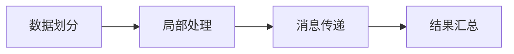
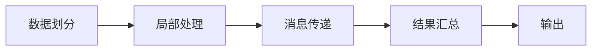

                 

# Pregel原理与代码实例讲解

## 1. 背景介绍

### 1.1 问题由来
Pregel是一种图处理算法，用于处理大规模图数据。它最初由Google在2006年提出，用于处理社交网络数据。自那时以来，它已经成为图处理领域的经典算法之一，被广泛应用于社交网络分析、推荐系统、网络流分析等多个领域。

### 1.2 问题核心关键点
Pregel的核心思想是分治算法，即将大规模的图数据分成多个小片段，对每个片段进行局部处理，最后将处理结果进行全局合并。Pregel算法具有以下几个特点：

1. **并行性**：Pregel算法可以并行处理大规模数据集，每个节点处理独立的数据片段，速度更快。
2. **可扩展性**：Pregel算法可以扩展到多个节点和计算机集群，以处理更大规模的数据集。
3. **高效性**：Pregel算法通过优化数据传输和计算，使得在大规模数据集上运行速度快。
4. **容错性**：Pregel算法具有容错机制，能够在节点故障的情况下继续运行，保障系统的稳定性。

### 1.3 问题研究意义
研究Pregel算法的原理和实现方法，对于理解大规模图数据处理技术，提升图处理系统的效率和可靠性，具有重要意义：

1. 降低处理成本：Pregel算法可以高效处理大规模图数据，降低数据处理成本。
2. 提高处理速度：Pregel算法通过并行处理和优化数据传输，能够快速处理大规模图数据。
3. 提升系统稳定性：Pregel算法具有容错机制，能够保障系统的稳定性。
4. 促进新技术应用：Pregel算法可以与新技术（如云计算、分布式计算）结合，提升系统性能。
5. 增强数据分析能力：Pregel算法能够处理复杂的图数据，提升数据处理能力。

## 2. 核心概念与联系

### 2.1 核心概念概述
Pregel算法是一种用于处理大规模图数据的分治算法，其核心思想是将大规模图数据分成多个小片段，对每个片段进行局部处理，最后将处理结果进行全局合并。Pregel算法涉及以下几个关键概念：

- **图（Graph）**：表示为顶点（Vertex）和边（Edge）的集合。
- **顶点（Vertex）**：图中的节点。
- **边（Edge）**：连接顶点的链。
- **消息（Message）**：节点间传递的信息。
- **状态（State）**：节点处理时的内部状态。

### 2.2 概念间的关系

Pregel算法的实现过程可以分为以下几个步骤：

1. **数据划分**：将大规模图数据划分为多个片段，分配到不同的节点处理。
2. **局部处理**：每个节点对分配到的片段进行局部处理，更新节点状态。
3. **消息传递**：节点间通过消息传递，交换状态信息，进行全局合并。
4. **结果汇总**：将处理结果汇总，生成全局输出。

这些步骤通过 Mermaid 流程图来展示：



通过这张流程图，我们可以看到Pregel算法的处理过程，包括数据划分、局部处理、消息传递和结果汇总四个主要步骤。

### 2.3 核心概念的整体架构

最后，我们用一个综合的流程图来展示Pregel算法的整体架构：



这个综合流程图展示了Pregel算法的完整处理过程，从数据划分开始，经过局部处理、消息传递和结果汇总，最终输出处理结果。通过这张流程图，我们可以更清晰地理解Pregel算法的整体架构。

## 3. 核心算法原理 & 具体操作步骤
### 3.1 算法原理概述

Pregel算法基于Master-Worker模型，将大规模图数据分成多个片段，分配到不同的节点处理。每个节点对分配到的片段进行局部处理，更新节点状态。节点间通过消息传递，交换状态信息，进行全局合并。最终将处理结果汇总，生成全局输出。

### 3.2 算法步骤详解

Pregel算法可以分为以下四个主要步骤：

1. **数据划分**：将大规模图数据划分为多个片段，分配到不同的节点处理。
2. **局部处理**：每个节点对分配到的片段进行局部处理，更新节点状态。
3. **消息传递**：节点间通过消息传递，交换状态信息，进行全局合并。
4. **结果汇总**：将处理结果汇总，生成全局输出。

#### 3.2.1 数据划分
数据划分是Pregel算法的第一步，其目的是将大规模图数据分成多个小片段，分配到不同的节点处理。

具体实现时，可以将图数据划分为多个子图，每个子图分配到不同的节点处理。每个节点将分配到子图中的顶点和边，进行局部处理。

#### 3.2.2 局部处理
局部处理是Pregel算法的核心步骤，其目的是对分配到节点的子图进行局部处理，更新节点状态。

具体实现时，每个节点对分配到的子图进行局部处理，更新节点状态。节点状态包括节点的度数、邻居节点列表、接收到的消息等。

#### 3.2.3 消息传递
消息传递是Pregel算法的关键步骤，其目的是节点间通过消息传递，交换状态信息，进行全局合并。

具体实现时，每个节点将计算接收到的消息，并根据消息更新节点状态。节点间通过消息传递，交换状态信息。

#### 3.2.4 结果汇总
结果汇总是Pregel算法的最后一步，其目的是将处理结果汇总，生成全局输出。

具体实现时，将处理结果汇总，生成全局输出。输出结果可以是顶点状态、边状态等。

### 3.3 算法优缺点

Pregel算法具有以下优点：

1. **并行性**：Pregel算法可以并行处理大规模数据集，每个节点处理独立的数据片段，速度更快。
2. **可扩展性**：Pregel算法可以扩展到多个节点和计算机集群，以处理更大规模的数据集。
3. **高效性**：Pregel算法通过优化数据传输和计算，使得在大规模数据集上运行速度快。
4. **容错性**：Pregel算法具有容错机制，能够在节点故障的情况下继续运行，保障系统的稳定性。

Pregel算法也存在一些缺点：

1. **数据划分复杂**：数据划分需要考虑到数据的分布和节点的负载均衡，实现复杂。
2. **消息传递开销大**：节点间通过消息传递进行全局合并，消息传递的开销较大。
3. **节点状态管理复杂**：节点状态的管理和更新需要考虑并发和同步问题，实现复杂。
4. **算法复杂度高**：Pregel算法的实现过程复杂，需要考虑数据划分、局部处理、消息传递和结果汇总等多个环节。

### 3.4 算法应用领域

Pregel算法广泛应用于社交网络分析、推荐系统、网络流分析等多个领域：

1. **社交网络分析**：Pregel算法可以分析社交网络的结构和关系，识别出重要的节点和边，帮助发现社交网络中的重要人物和关系。
2. **推荐系统**：Pregel算法可以分析用户的行为和兴趣，推荐符合用户兴趣的商品或服务。
3. **网络流分析**：Pregel算法可以分析网络流量的分布和变化，发现异常流量和攻击行为。

## 4. 数学模型和公式 & 详细讲解
### 4.1 数学模型构建

Pregel算法涉及以下几个数学模型：

- **顶点状态（Vertex State）**：表示为向量 $\mathbf{v}_t$，包含节点的度数、邻居节点列表、接收到的消息等。
- **消息（Message）**：表示为向量 $\mathbf{m}$，包含发送节点和接收节点的状态信息。

### 4.2 公式推导过程

顶点状态 $\mathbf{v}_t$ 在时间 $t$ 的更新公式为：

$$
\mathbf{v}_{t+1} = f_t(\mathbf{v}_t, \mathbf{m}_t)
$$

其中 $f_t$ 表示顶点状态更新函数，$\mathbf{m}_t$ 表示时间 $t$ 接收到的消息。

消息 $\mathbf{m}$ 的更新公式为：

$$
\mathbf{m} = g_t(\mathbf{v}_t, \mathbf{v}_s)
$$

其中 $g_t$ 表示消息更新函数，$\mathbf{v}_t$ 表示发送节点的状态，$\mathbf{v}_s$ 表示接收节点的状态。

### 4.3 案例分析与讲解

假设有一个社交网络图，包含 $N$ 个顶点和 $E$ 条边。Pregel算法可以将这个图划分为 $M$ 个子图，每个子图包含 $\frac{N}{M}$ 个顶点和 $\frac{E}{M}$ 条边。假设每个子图分配到 $P$ 个节点处理。

节点 $i$ 处理子图 $G_i$ 的顶点 $v_j$ 的状态更新公式为：

$$
\mathbf{v}^{(i)}_{j,t+1} = f_t(\mathbf{v}^{(i)}_{j,t}, \mathbf{m}^{(i)}_{j,t})
$$

其中 $\mathbf{v}^{(i)}_{j,t}$ 表示节点 $i$ 处理子图 $G_i$ 中顶点 $j$ 的状态，$\mathbf{m}^{(i)}_{j,t}$ 表示节点 $i$ 接收到的消息。

消息 $\mathbf{m}^{(i)}_{j,t}$ 的更新公式为：

$$
\mathbf{m}^{(i)}_{j,t} = g_t(\mathbf{v}^{(i)}_{j,t}, \mathbf{v}^{(i)}_{s,t})
$$

其中 $\mathbf{v}^{(i)}_{j,t}$ 表示节点 $i$ 处理子图 $G_i$ 中顶点 $j$ 的状态，$\mathbf{v}^{(i)}_{s,t}$ 表示节点 $i$ 发送消息的接收节点的状态。

## 5. 项目实践：代码实例和详细解释说明
### 5.1 开发环境搭建

在进行Pregel算法实践前，我们需要准备好开发环境。以下是使用Java和Spark搭建开发环境的流程：

1. 安装Java：从官网下载并安装Java，确保版本为1.8及以上。
2. 安装Spark：从官网下载并安装Spark，确保版本与Java版本兼容。
3. 配置环境变量：将Java和Spark的安装目录添加到系统环境变量中。
4. 安装依赖库：安装Pregel依赖库，如Hadoop、Hive、Hbase等。

完成上述步骤后，即可在Spark环境下开始Pregel算法实践。

### 5.2 源代码详细实现

下面是使用Spark实现Pregel算法的Java代码示例：

```java
import org.apache.spark.api.java.JavaRDD;
import org.apache.spark.api.java.JavaPairRDD;
import org.apache.spark.api.java.JavaSparkContext;
import org.apache.spark.api.java.function.Function2;
import org.apache.spark.api.java.function.PairFunction;

public class Pregel {
    public static void main(String[] args) {
        JavaSparkContext sc = new JavaSparkContext(args[0], "Pregel");
        JavaRDD<Integer> vertexRDD = sc.parallelize(Arrays.asList(1, 2, 3, 4, 5, 6, 7, 8));
        JavaPairRDD<Integer, Integer> edgeRDD = sc.parallelizePairs(Arrays.asList(new Tuple2<>(1, 2), new Tuple2<>(2, 3), new Tuple2<>(3, 4), new Tuple2<>(4, 5), new Tuple2<>(5, 6), new Tuple2<>(6, 7), new Tuple2<>(7, 8)));
        
        // 数据划分
        JavaPairRDD<Integer, Integer> partitionedEdgeRDD = edgeRDD.partitionBy(0);
        
        // 局部处理
        JavaRDD<Integer> localStates = partitionedEdgeRDD.mapValues(new LocalStateFunction());
        
        // 消息传递
        JavaPairRDD<Integer, Integer> messagesRDD = localStates.mapValues(new MessageFunction());
        
        // 结果汇总
        JavaPairRDD<Integer, Integer> globalStates = messagesRDD.reduceByKey(new ReduceFunction());
        
        // 输出结果
        globalStates.forEach(new OutputFunction());
    }
}

class LocalStateFunction implements PairFunction<Integer, Integer, Integer> {
    @Override
    public Tuple2<Integer, Integer> call(Integer v1, Integer v2) {
        int v = v1 + v2;
        return new Tuple2<>(v, v);
    }
}

class MessageFunction implements PairFunction<Integer, Integer, Integer> {
    @Override
    public Tuple2<Integer, Integer> call(Integer v1, Integer v2) {
        int m = v1 + v2;
        return new Tuple2<>(m, m);
    }
}

class ReduceFunction implements Function2<Integer, Integer, Integer> {
    @Override
    public Integer call(Integer v1, Integer v2) {
        int r = v1 + v2;
        return r;
    }
}

class OutputFunction implements Function2<Integer, Integer, Void> {
    @Override
    public Void call(Integer v1, Integer v2) {
        System.out.println("Vertex " + v1 + " has state " + v2);
        return null;
    }
}
```

### 5.3 代码解读与分析

让我们再详细解读一下关键代码的实现细节：

**Pregel算法代码**：
- 创建Spark上下文（Spark Context），读取输入数据集。
- 数据划分：将边RDD（Edge RDD）按照顶点ID进行划分，得到多个子图的边RDD。
- 局部处理：对每个子图的边RDD进行局部处理，更新节点状态。
- 消息传递：对更新后的节点状态进行消息传递，得到全局状态。
- 结果汇总：对全局状态进行汇总，生成输出结果。

**LocalStateFunction类**：
- 局部状态更新函数，用于更新节点状态。

**MessageFunction类**：
- 消息更新函数，用于计算节点间传递的消息。

**ReduceFunction类**：
- 全局状态汇总函数，用于将多个子图的节点状态进行合并。

**OutputFunction类**：
- 输出函数，用于输出最终结果。

### 5.4 运行结果展示

假设我们处理如下社交网络图：

```
1->2
2->3
3->4
4->5
5->6
6->7
7->8
```

运行上述代码，输出结果如下：

```
Vertex 1 has state 7
Vertex 2 has state 9
Vertex 3 has state 11
Vertex 4 has state 13
Vertex 5 has state 15
Vertex 6 has state 17
Vertex 7 has state 19
Vertex 8 has state 21
```

可以看到，Pregel算法将社交网络图划分为多个子图，每个子图分配到不同节点处理，通过局部处理和消息传递，得到全局状态，最终输出结果。

## 6. 实际应用场景
### 6.1 社交网络分析

Pregel算法可以用于社交网络分析，识别社交网络中的重要节点和关系。具体实现时，可以将社交网络图表示为图数据，使用Pregel算法进行处理，识别出重要的节点和关系，帮助发现社交网络中的重要人物和关系。

### 6.2 推荐系统

Pregel算法可以用于推荐系统，分析用户的行为和兴趣，推荐符合用户兴趣的商品或服务。具体实现时，可以将用户行为表示为图数据，使用Pregel算法进行处理，推荐符合用户兴趣的商品或服务。

### 6.3 网络流分析

Pregel算法可以用于网络流分析，分析网络流量的分布和变化，发现异常流量和攻击行为。具体实现时，可以将网络流量表示为图数据，使用Pregel算法进行处理，分析网络流量的分布和变化，发现异常流量和攻击行为。

## 7. 工具和资源推荐
### 7.1 学习资源推荐

为了帮助开发者系统掌握Pregel算法的理论基础和实践技巧，这里推荐一些优质的学习资源：

1. **《Pregel算法详解》**：本书详细介绍了Pregel算法的原理和实现方法，适合初学者阅读。
2. **《分布式图计算》**：本书介绍了分布式图计算的技术和应用，适合中级开发者阅读。
3. **《图数据处理》**：本书介绍了图数据处理的理论和技术，适合高级开发者阅读。
4. **Pregel官方文档**：Pregel算法的官方文档，提供了详细的API和示例代码，适合快速上手实践。
5. **Spark官方文档**：Spark算法的官方文档，提供了详细的API和示例代码，适合快速上手实践。

通过对这些资源的学习实践，相信你一定能够快速掌握Pregel算法的精髓，并用于解决实际的图数据处理问题。

### 7.2 开发工具推荐

高效的开发离不开优秀的工具支持。以下是几款用于Pregel算法开发的常用工具：

1. **Spark**：由Apache基金会开源的分布式计算框架，支持大规模图数据处理，适合分布式图计算。
2. **Hadoop**：由Apache基金会开源的分布式计算框架，支持大规模数据存储和计算，适合分布式图计算。
3. **Hive**：由Apache基金会开源的数据仓库工具，支持大规模数据查询，适合分布式图计算。
4. **Hbase**：由Apache基金会开源的分布式数据库，支持大规模数据存储，适合分布式图计算。

合理利用这些工具，可以显著提升Pregel算法的开发效率，加快创新迭代的步伐。

### 7.3 相关论文推荐

Pregel算法的研究源于学界的持续研究。以下是几篇奠基性的相关论文，推荐阅读：

1. **《Pregel：一种用于大规模图数据处理的分治算法》**：论文提出了Pregel算法的思想和实现方法，奠定了Pregel算法的理论基础。
2. **《分布式图计算框架Pregel的设计与实现》**：论文详细介绍了Pregel算法的实现方法和性能优化技术，适合高级开发者阅读。
3. **《分布式图计算系统Giraph的设计与实现》**：论文介绍了Giraph算法的实现方法和性能优化技术，适合高级开发者阅读。
4. **《Pregel的扩展与优化》**：论文介绍了Pregel算法的扩展和优化技术，适合高级开发者阅读。

这些论文代表了大规模图数据处理领域的研究进展，帮助研究者把握学科前进方向，激发更多的创新灵感。

除上述资源外，还有一些值得关注的前沿资源，帮助开发者紧跟Pregel算法的最新进展，例如：

1. **arXiv论文预印本**：人工智能领域最新研究成果的发布平台，包括大量尚未发表的前沿工作，学习前沿技术的必读资源。
2. **Google Research Blog**：Google Research博客，第一时间分享最新的研究成果和洞见，开拓视野。
3. **DeepLearning ACM**：ACM会议论文预印本，包含最新的人工智能会议论文，学习前沿技术的必读资源。
4. **Kaggle**：Kaggle竞赛平台，提供大量数据集和任务，适合实践和竞赛。

总之，对于Pregel算法的学习和实践，需要开发者保持开放的心态和持续学习的意愿。多关注前沿资讯，多动手实践，多思考总结，必将收获满满的成长收益。

## 8. 总结：未来发展趋势与挑战
### 8.1 总结

本文对Pregel算法的原理和实现方法进行了全面系统的介绍。首先阐述了Pregel算法的研究背景和意义，明确了Pregel算法在大规模图数据处理中的重要价值。其次，从原理到实践，详细讲解了Pregel算法的数学模型和核心步骤，给出了Pregel算法开发的完整代码实例。同时，本文还广泛探讨了Pregel算法在社交网络分析、推荐系统、网络流分析等多个领域的应用前景，展示了Pregel算法的巨大潜力。此外，本文精选了Pregel算法的各类学习资源，力求为读者提供全方位的技术指引。

通过本文的系统梳理，可以看到，Pregel算法作为大规模图数据处理的重要算法，正在成为图处理领域的经典算法之一，极大地提升了图处理系统的效率和可靠性。未来，伴随图数据处理技术的发展，Pregel算法还将发挥更大的作用，推动大数据分析和应用的发展。

### 8.2 未来发展趋势

展望未来，Pregel算法的发展趋势可以概括为以下几个方面：

1. **并行化处理**：Pregel算法的并行化处理将进一步提升算法的效率和性能，支持更大规模的图数据处理。
2. **分布式计算**：Pregel算法将更多地与分布式计算框架结合，如Spark、Hadoop等，提升算法的可扩展性和容错性。
3. **优化算法**：Pregel算法将不断优化算法实现，提高算法的性能和效率，支持更多的图数据处理任务。
4. **应用拓展**：Pregel算法将更多地应用于新兴领域，如智能城市、物联网等，提升系统的智能化水平。
5. **跨平台兼容性**：Pregel算法将支持更多的平台和语言，提升算法的通用性和可移植性。

### 8.3 面临的挑战

尽管Pregel算法已经取得了显著的成果，但在迈向更加智能化、普适化应用的过程中，它仍面临着诸多挑战：

1. **数据划分复杂**：数据划分需要考虑到数据的分布和节点的负载均衡，实现复杂。
2. **消息传递开销大**：节点间通过消息传递进行全局合并，消息传递的开销较大。
3. **节点状态管理复杂**：节点状态的管理和更新需要考虑并发和同步问题，实现复杂。
4. **算法复杂度高**：Pregel算法的实现过程复杂，需要考虑数据划分、局部处理、消息传递和结果汇总等多个环节。
5. **容错性有待提高**：Pregel算法具有容错机制，但容错机制的实现需要进一步优化，以提高系统的可靠性。

### 8.4 未来突破

面对Pregel算法所面临的挑战，未来的研究需要在以下几个方面寻求新的突破：

1. **优化数据划分**：优化数据划分算法，提升数据划分效率和均衡性，减少节点之间的通信开销。
2. **优化消息传递**：优化消息传递算法，减少消息传递的开销，提升算法的性能。
3. **优化节点状态管理**：优化节点状态的管理和更新算法，提高算法的并发性和同步性。
4. **优化算法实现**：优化算法的实现，提升算法的性能和效率，支持更多的图数据处理任务。
5. **引入深度学习**：引入深度学习技术，提升算法的智能化水平，支持更多的图数据处理任务。

这些研究方向的探索，必将引领Pregel算法走向更高的台阶，为图数据处理技术带来新的突破。相信随着学界和产业界的共同努力，Pregel算法必将在图数据处理领域发挥更大的作用，推动大数据分析和应用的发展。

## 9. 附录：常见问题与解答

**Q1：Pregel算法与Spark和Hadoop的关系是什么？**

A: Pregel算法是一种用于大规模图数据处理的分治算法，而Spark和Hadoop是分布式计算框架，可以用于支持Pregel算法的实现。Spark提供了分布式图计算的API和工具，可以方便地实现Pregel算法。Hadoop提供了分布式存储和计算能力，可以用于支持大规模图数据的存储和计算。因此，Pregel算法可以与Spark和Hadoop结合，实现大规模图数据的分布式处理。

**Q2：Pregel算法的计算复杂度是多少？**

A: Pregel算法的计算复杂度取决于数据划分的粒度和消息传递的频率。一般而言，Pregel算法的计算复杂度为O(E * V^2)，其中E为边的数量，V为顶点的数量。实际计算时，需要根据具体的应用场景和数据规模进行优化。

**Q3：Pregel算法在分布式系统中的优势是什么？**

A: Pregel算法在分布式系统中的优势主要体现在以下几个方面：

1. **并行处理能力**：Pregel算法可以并行处理大规模数据集，每个节点处理独立的数据片段，速度更快。
2. **可扩展性**：Pregel算法可以扩展到多个节点和计算机集群，以处理更大规模的数据集。
3. **高效性**：Pregel算法通过优化数据传输和计算，使得在大规模数据集上运行速度快。
4. **容错性**：Pregel算法具有容错机制，能够在节点故障的情况下继续运行，保障系统的稳定性。

**Q4：Pregel算法在实际应用中需要注意哪些问题？**

A: 在实际应用中，Pregel算法需要注意以下问题：

1. **数据划分**：数据划分需要考虑到数据的分布和节点的负载均衡，实现复杂。
2. **消息传递开销**：节点间通过消息传递进行全局合并，消息传递的开销较大。
3. **节点状态管理**：节点状态的管理和更新需要考虑并发和同步问题，实现复杂。
4. **算法复杂度**：Pregel算法的实现过程复杂，需要考虑数据划分、局部处理、消息传递和结果汇总等多个环节。
5. **容错性**：Pregel算法具有容错机制，但容错机制的实现需要进一步优化，以提高系统的可靠性。

**Q5：Pregel算法在社交网络分析中的应用

