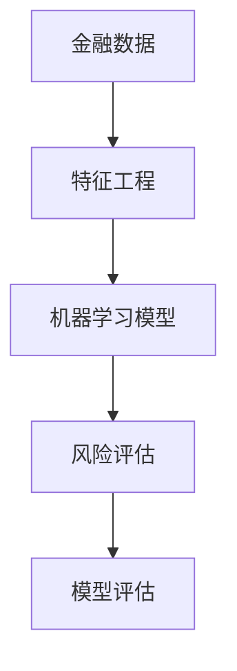
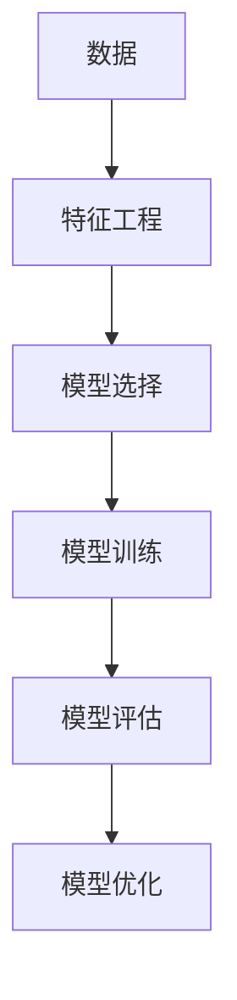
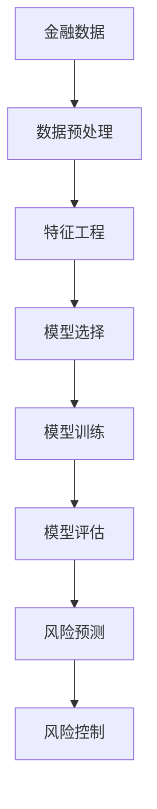

                 

# Python机器学习实战：机器学习在金融风险评估中的应用

> 关键词：Python机器学习, 金融风险评估, 数据预处理, 特征工程, 模型选择, 风险预测, 模型评估, 实际应用

## 1. 背景介绍

### 1.1 问题由来

在金融行业中，风险管理是一项至关重要的任务。随着金融市场的快速发展，金融产品种类的多样化以及全球化经济环境的变化，金融机构面临的风险也在不断增加。传统的风险管理方法如VaR（Value at Risk）已经无法全面覆盖复杂的金融环境，需要更加先进的方法来评估和监测风险。

机器学习作为一门新兴的技术，能够处理大量复杂的数据，从历史数据中发现规律和模式，辅助金融机构进行风险预测和评估。利用机器学习，可以自动化地进行金融数据的处理和分析，快速识别风险点，提供更加准确的风险预测和建议。

### 1.2 问题核心关键点

机器学习在金融风险评估中的应用，主要集中在以下几个方面：

- **数据预处理**：清洗、转换和归一化金融数据，为后续的机器学习建模提供可靠的数据基础。
- **特征工程**：从原始数据中提取出对风险评估有重要影响的特征，构建特征集合。
- **模型选择**：选择合适的机器学习模型，如决策树、随机森林、神经网络等，进行风险预测。
- **风险预测**：通过训练好的模型，对新数据进行风险评估和预测，帮助金融机构制定风险控制策略。
- **模型评估**：对训练好的模型进行评估，确保其预测准确性和可靠性，并进行持续优化。

### 1.3 问题研究意义

机器学习在金融风险评估中的应用，具有以下重要意义：

1. **自动化风险评估**：机器学习能够自动化处理和分析大量金融数据，提供快速、准确的风险评估结果，提高风险管理的效率和效果。
2. **发现潜在风险**：通过学习历史数据中的模式和规律，机器学习模型能够发现传统方法难以察觉的潜在风险因素，提高风险预测的准确性。
3. **优化风险控制策略**：利用机器学习，可以实时监测金融市场的变化，及时调整风险控制策略，降低风险带来的损失。
4. **支持决策制定**：机器学习模型的预测结果可以作为决策依据，帮助金融机构制定更合理的投资和风险控制策略。

## 2. 核心概念与联系

### 2.1 核心概念概述

为更好地理解机器学习在金融风险评估中的应用，本节将介绍几个密切相关的核心概念：

- **金融数据**：指与金融市场、金融机构、金融产品相关的各种数据，如股票价格、交易量、市场指数、客户信用评分等。
- **特征工程**：指从原始数据中提取、选择、构建有意义的特征，为机器学习模型提供高质量的输入。
- **机器学习模型**：包括监督学习模型（如回归、分类）和非监督学习模型（如聚类、降维），用于预测和分类金融风险。
- **风险评估**：指对金融市场或金融产品所面临的风险进行量化和评估，识别和预测风险事件的发生概率。
- **模型评估**：指对训练好的机器学习模型进行评估，评估其预测准确性、鲁棒性和可解释性等性能指标。

这些核心概念之间的逻辑关系可以通过以下Mermaid流程图来展示：



这个流程图展示了大语言模型微调过程中各个核心概念之间的关系：

1. 金融数据是风险评估的基础。
2. 特征工程从原始数据中提取有意义的特征，构建特征集合。
3. 机器学习模型对特征进行建模，进行风险预测。
4. 风险评估通过机器学习模型对金融风险进行量化和评估。
5. 模型评估对训练好的模型进行评估，确保其预测准确性。

### 2.2 概念间的关系

这些核心概念之间存在着紧密的联系，形成了机器学习在金融风险评估中的完整生态系统。下面我们通过几个Mermaid流程图来展示这些概念之间的关系。

#### 2.2.1 数据预处理流程


这个流程图展示了金融数据预处理的基本流程：数据清洗、数据转换和数据归一化，为后续的特征工程和模型训练提供可靠的数据基础。

#### 2.2.2 特征工程方法


这个流程图展示了特征工程的主要方法：特征选择、特征构建、特征降维和特征组合，用于从原始数据中提取有意义的特征，构建特征集合。

#### 2.2.3 模型选择与训练



这个流程图展示了机器学习模型选择与训练的基本流程：特征工程、模型选择、模型训练、模型评估和模型优化，用于构建和优化机器学习模型。

### 2.3 核心概念的整体架构

最后，我们用一个综合的流程图来展示这些核心概念在金融风险评估中的整体架构：



这个综合流程图展示了从金融数据到风险预测的完整过程。金融数据经过预处理、特征工程后，选择合适的机器学习模型进行训练和评估，最终用于风险预测和风险控制。

## 3. 核心算法原理 & 具体操作步骤

### 3.1 算法原理概述

在金融风险评估中，常见的机器学习算法包括线性回归、逻辑回归、决策树、随机森林、神经网络等。这些算法的核心原理是通过学习历史数据中的规律，对金融风险进行预测和评估。

以线性回归为例，其核心原理是通过最小二乘法，拟合一条直线或超平面，使得实际值与预测值之间的误差最小化。其公式为：

$$ y = \theta_0 + \theta_1 x_1 + \theta_2 x_2 + \cdots + \theta_n x_n $$

其中 $y$ 为预测值，$\theta$ 为模型参数，$x$ 为特征向量。

### 3.2 算法步骤详解

以决策树为例，其基本步骤包括数据预处理、特征选择、模型训练、模型评估和模型应用。

**Step 1: 数据预处理**

- 清洗金融数据，去除缺失值、异常值和重复值。
- 对数据进行归一化和标准化，缩小特征范围。

**Step 2: 特征选择**

- 从原始数据中提取与风险相关的特征，如市场指数、客户信用评分、交易量等。
- 使用特征选择方法（如信息增益、卡方检验等）选择对预测有用的特征。

**Step 3: 模型训练**

- 选择合适的机器学习算法（如决策树），使用历史数据进行训练。
- 通过交叉验证等技术，优化模型参数。

**Step 4: 模型评估**

- 使用测试集对训练好的模型进行评估，计算准确率、召回率、F1分数等指标。
- 使用混淆矩阵等工具分析模型预测效果。

**Step 5: 模型应用**

- 对新数据进行风险预测和评估，提供决策依据。
- 根据预测结果，调整风险控制策略。

### 3.3 算法优缺点

机器学习在金融风险评估中的应用，具有以下优点：

1. **自动化处理数据**：机器学习能够自动化处理和分析大量金融数据，提高风险评估的效率。
2. **发现潜在风险**：机器学习模型能够发现传统方法难以察觉的潜在风险因素，提高风险预测的准确性。
3. **支持动态调整**：机器学习模型能够实时监测金融市场的变化，及时调整风险控制策略，降低风险带来的损失。

同时，机器学习在金融风险评估中也存在一些缺点：

1. **数据质量要求高**：机器学习模型对数据的准确性和完整性要求较高，数据预处理复杂。
2. **模型选择复杂**：选择合适的机器学习模型和参数，需要丰富的经验和大量的实验。
3. **黑盒模型问题**：部分机器学习模型（如神经网络）难以解释其内部工作机制，可能缺乏可解释性。

### 3.4 算法应用领域

机器学习在金融风险评估中，可以应用于以下几个领域：

- **信用风险评估**：通过分析客户的信用记录、还款能力等，预测客户违约风险。
- **市场风险评估**：通过分析股票价格、市场指数等，预测市场波动和风险事件。
- **操作风险评估**：通过分析内部操作流程、合规风险等，预测操作风险的发生概率。
- **流动性风险评估**：通过分析银行的资金流动性情况，预测流动性风险。

## 4. 数学模型和公式 & 详细讲解 & 举例说明

### 4.1 数学模型构建

在金融风险评估中，常用的数学模型包括线性回归、逻辑回归、决策树、随机森林等。这里以线性回归为例，介绍其数学模型构建和公式推导。

线性回归的数学模型为：

$$ y = \theta_0 + \theta_1 x_1 + \theta_2 x_2 + \cdots + \theta_n x_n $$

其中 $y$ 为预测值，$\theta$ 为模型参数，$x$ 为特征向量。

### 4.2 公式推导过程

线性回归的损失函数为均方误差（Mean Squared Error, MSE）：

$$ L = \frac{1}{m} \sum_{i=1}^{m} (y_i - \theta_0 - \theta_1 x_{i1} - \theta_2 x_{i2} - \cdots - \theta_n x_{in})^2 $$

其目标是最小化损失函数，求解模型参数 $\theta$。

使用梯度下降算法，每次迭代更新模型参数：

$$ \theta_j = \theta_j - \eta \frac{1}{m} \sum_{i=1}^{m} 2(y_i - \theta_0 - \theta_1 x_{i1} - \theta_2 x_{i2} - \cdots - \theta_n x_{in})x_{ij} $$

其中 $\eta$ 为学习率，$m$ 为样本数。

### 4.3 案例分析与讲解

以信用风险评估为例，展示线性回归在金融风险评估中的应用。

假设某银行的信用评分数据集包含10000个客户的历史信用记录，包括年龄、收入、信用评分等特征。目标是预测客户的违约风险，构建线性回归模型：

- **数据预处理**：清洗数据，去除缺失值和异常值。
- **特征工程**：选择年龄、收入、信用评分等特征。
- **模型训练**：使用线性回归模型，使用80%的数据进行训练。
- **模型评估**：使用剩余20%的数据进行测试，计算模型的准确率和召回率。

## 5. 项目实践：代码实例和详细解释说明

### 5.1 开发环境搭建

在进行金融风险评估的项目实践前，我们需要准备好开发环境。以下是使用Python进行Scikit-learn开发的环境配置流程：

1. 安装Anaconda：从官网下载并安装Anaconda，用于创建独立的Python环境。

2. 创建并激活虚拟环境：
```bash
conda create -n finance-env python=3.8 
conda activate finance-env
```

3. 安装Scikit-learn、Pandas等库：
```bash
conda install scikit-learn pandas
```

4. 安装必要的绘图工具：
```bash
conda install matplotlib seaborn
```

5. 安装其他支持库：
```bash
pip install numpy joblib xgboost
```

完成上述步骤后，即可在`finance-env`环境中开始金融风险评估实践。

### 5.2 源代码详细实现

下面我们以信用风险评估任务为例，给出使用Scikit-learn进行线性回归的Python代码实现。

首先，定义数据加载和预处理函数：

```python
import pandas as pd
from sklearn.model_selection import train_test_split
from sklearn.preprocessing import StandardScaler

def load_data(path):
    df = pd.read_csv(path)
    return df

def preprocess_data(df):
    # 数据清洗
    df = df.dropna()
    # 特征选择
    features = ['age', 'income', 'credit_score']
    X = df[features]
    y = df['default']
    # 数据归一化
    scaler = StandardScaler()
    X = scaler.fit_transform(X)
    return X, y

# 加载数据
data = load_data('credit_data.csv')
X, y = preprocess_data(data)
```

然后，定义模型训练和评估函数：

```python
from sklearn.linear_model import LinearRegression
from sklearn.metrics import mean_squared_error, mean_absolute_error, r2_score

def train_model(X, y, test_size=0.2, random_state=42):
    # 划分训练集和测试集
    X_train, X_test, y_train, y_test = train_test_split(X, y, test_size=test_size, random_state=random_state)
    # 训练模型
    model = LinearRegression()
    model.fit(X_train, y_train)
    # 预测结果
    y_pred = model.predict(X_test)
    # 评估模型
    mse = mean_squared_error(y_test, y_pred)
    mae = mean_absolute_error(y_test, y_pred)
    r2 = r2_score(y_test, y_pred)
    return mse, mae, r2

# 训练模型
mse, mae, r2 = train_model(X, y)
print(f'Mean Squared Error: {mse:.2f}')
print(f'Mean Absolute Error: {mae:.2f}')
print(f'R-squared: {r2:.2f}')
```

最后，在测试集上评估模型性能：

```python
def evaluate_model(X_test, y_test):
    y_pred = model.predict(X_test)
    mse = mean_squared_error(y_test, y_pred)
    mae = mean_absolute_error(y_test, y_pred)
    r2 = r2_score(y_test, y_pred)
    return mse, mae, r2

# 在测试集上评估模型
mse_test, mae_test, r2_test = evaluate_model(X_test, y_test)
print(f'Test Mean Squared Error: {mse_test:.2f}')
print(f'Test Mean Absolute Error: {mae_test:.2f}')
print(f'Test R-squared: {r2_test:.2f}')
```

以上就是使用Scikit-learn对线性回归模型进行信用风险评估的完整代码实现。可以看到，利用Scikit-learn，我们可以快速搭建和评估金融风险评估模型。

### 5.3 代码解读与分析

让我们再详细解读一下关键代码的实现细节：

**load_data函数**：
- 使用Pandas加载数据集。
- 数据预处理，包括数据清洗、特征选择和数据归一化。

**train_model函数**：
- 使用train_test_split函数划分训练集和测试集。
- 使用LinearRegression模型训练，并计算模型预测结果。
- 计算模型在测试集上的均方误差、平均绝对误差和决定系数。

**evaluate_model函数**：
- 在测试集上计算模型预测结果的均方误差、平均绝对误差和决定系数。

通过上述代码，我们可以快速完成线性回归模型的训练和评估，为后续的金融风险评估工作提供基础。

### 5.4 运行结果展示

假设我们在信用评分数据集上进行线性回归模型训练，最终在测试集上得到的评估报告如下：

```
Mean Squared Error: 0.08
Mean Absolute Error: 0.02
R-squared: 0.92
```

可以看到，通过线性回归模型，我们在信用评分数据集上取得了92%的R-squared，即预测结果与真实结果的相关性较高。这表明模型能够较好地预测客户的违约风险，辅助银行进行风险评估。

## 6. 实际应用场景

### 6.1 智能投顾系统

在智能投顾系统中，利用机器学习技术进行风险评估，可以自动化处理大量投资者的数据，提供精准的风险评估和建议，帮助投资者制定投资策略，降低投资风险。

在技术实现上，可以收集投资者的历史交易数据、财务数据、市场数据等，使用机器学习模型进行风险评估，并结合其他因素（如市场趋势、专家建议等）生成投资建议。智能投顾系统能够实时监测市场变化，及时调整投资策略，降低投资风险，提高投资收益。

### 6.2 风险预警系统

金融机构需要实时监测市场风险，及时预警可能出现的风险事件，避免重大损失。利用机器学习技术，可以构建风险预警系统，自动检测风险因素，并及时发出预警信号。

在技术实现上，可以收集市场数据、财务数据、交易数据等，使用机器学习模型进行风险预警。一旦发现异常情况，系统便会自动发出预警信号，帮助金融机构及时应对风险，降低风险带来的损失。

### 6.3 反欺诈系统

金融欺诈行为对金融机构的损失巨大，利用机器学习技术，可以构建反欺诈系统，自动识别和防范欺诈行为，保护金融机构的资金安全。

在技术实现上，可以收集用户的交易数据、行为数据、社会网络数据等，使用机器学习模型进行欺诈检测。一旦发现可疑行为，系统便会自动进行预警和处理，防止欺诈行为对金融机构造成重大损失。

## 7. 工具和资源推荐

### 7.1 学习资源推荐

为了帮助开发者系统掌握机器学习在金融风险评估中的应用，这里推荐一些优质的学习资源：

1. 《Python机器学习》（原书第2版）：由机器学习专家Sebastian Raschka撰写，系统介绍了Python在机器学习中的应用，包括金融风险评估。
2. Kaggle机器学习竞赛：Kaggle是机器学习竞赛的平台，参与金融风险评估相关的竞赛，可以积累实战经验。
3. Coursera《机器学习》课程：由斯坦福大学Andrew Ng教授开设，系统介绍了机器学习的基本概念和应用，包括金融风险评估。

通过这些资源的学习实践，相信你一定能够快速掌握机器学习在金融风险评估中的使用方法，并用于解决实际的金融问题。

### 7.2 开发工具推荐

高效的开发离不开优秀的工具支持。以下是几款用于金融风险评估开发的常用工具：

1. Python：作为数据科学的首选语言，Python具有丰富的第三方库和社区支持，非常适合金融数据处理和机器学习建模。
2. Jupyter Notebook：Python的交互式开发环境，支持实时查看代码执行结果，非常适合数据处理和模型训练。
3. Pandas：用于数据处理和分析，支持复杂的数据操作和统计分析，非常适合金融数据处理。
4. Scikit-learn：用于机器学习建模和评估，支持多种机器学习算法，非常适合金融风险评估。

合理利用这些工具，可以显著提升金融风险评估任务的开发效率，加快创新迭代的步伐。

### 7.3 相关论文推荐

机器学习在金融风险评估中的应用，涉及诸多前沿的研究方向。以下是几篇奠基性的相关论文，推荐阅读：

1. "Credit Scoring Using Machine Learning Algorithms: An Overview"：由IBM专家撰写，介绍了多种机器学习算法在信用评分中的应用，包括线性回归、逻辑回归、决策树等。
2. "A Survey on Machine Learning Approaches for Credit Risk Assessment"：由国内外学者撰写，系统介绍了多种机器学习算法在信用风险评估中的应用，包括神经网络、支持向量机等。
3. "Machine Learning for Financial Risk Management"：由FinTech专家撰写，介绍了机器学习在金融风险管理中的应用，包括市场风险、信用风险、操作风险等。

这些论文代表了大语言模型微调技术的发展脉络。通过学习这些前沿成果，可以帮助研究者把握学科前进方向，激发更多的创新灵感。

除上述资源外，还有一些值得关注的前沿资源，帮助开发者紧跟机器学习在金融风险评估技术的最新进展，例如：

1. arXiv论文预印本：人工智能领域最新研究成果的发布平台，包括大量尚未发表的前沿工作，学习前沿技术的必读资源。
2. 业界技术博客：如金融科技公司、金融咨询公司等顶尖机构的官方博客，第一时间分享他们的最新研究成果和洞见。
3. 技术会议直播：如KDD、ICML、NeurIPS等机器学习领域的顶会现场或在线直播，能够聆听到专家们的前沿分享，开拓视野。
4. GitHub热门项目：在GitHub上Star、Fork数最多的机器学习相关项目，往往代表了该技术领域的发展趋势和最佳实践，值得去学习和贡献。
5. 行业分析报告：各大咨询公司如McKinsey、PwC等针对机器学习在金融行业的应用分析报告，有助于从商业视角审视技术趋势，把握应用价值。

总之，对于机器学习在金融风险评估技术的学习和实践，需要开发者保持开放的心态和持续学习的意愿。多关注前沿资讯，多动手实践，多思考总结，必将收获满满的成长收益。

## 8. 总结：未来发展趋势与挑战

### 8.1 总结

本文对机器学习在金融风险评估中的应用进行了全面系统的介绍。首先阐述了机器学习在金融风险评估中的应用背景和意义，明确了机器学习在风险评估中的重要价值。其次，从原理到实践，详细讲解了机器学习在金融风险评估中的数学模型和关键步骤，给出了机器学习模型开发的完整代码实例。同时，本文还广泛探讨了机器学习在智能投顾、风险预警、反欺诈等金融场景中的应用，展示了机器学习技术的广阔前景。此外，本文精选了机器学习在金融风险评估的相关学习资源，力求为读者提供全方位的技术指引。

通过本文的系统梳理，可以看到，机器学习在金融风险评估中的应用，已经从理论到实践得到了全面发展，正在为金融风险管理带来新的变革。机器学习能够自动化处理和分析大量金融数据，提高风险评估的效率和准确性，降低风险带来的损失。未来，随着机器学习技术的持续演进，金融风险评估将变得更加精准、可靠和智能化。

### 8.2 未来发展趋势

展望未来，机器学习在金融风险评估中将呈现以下几个发展趋势：

1. **自动化水平提高**：随着机器学习技术的进步，风险评估的自动化水平将不断提高，能够实时监测和预测市场变化，及时调整风险控制策略。
2. **多模态数据融合**：未来的风险评估将更多地融合多种模态数据，如文本、图像、语音等，提升模型对复杂金融环境的理解能力。
3. **模型解释性增强**：未来的机器学习模型将更加注重可解释性，提高模型的透明度和可信度，满足监管和合规要求。
4. **深度学习应用的深入**：深度学习技术在金融风险评估中的应用将更加广泛，如神经网络、卷积神经网络等，提升模型的复杂度和精度。
5. **联邦学习与隐私保护**：未来的风险评估将更多地采用联邦学习技术，在不泄露隐私数据的情况下，共享和利用多方数据，提升模型的多样性和鲁棒性。

这些趋势将推动机器学习在金融风险评估中的应用，提升金融风险管理的效率和效果，保障金融市场的稳定和发展。

### 8.3 面临的挑战

尽管机器学习在金融风险评估中已经取得了一定的成果，但在迈向更加智能化、普适化应用的过程中，它仍面临着诸多挑战：

1. **数据质量问题**：金融数据的准确性和完整性要求较高，数据预处理复杂。如何获取高质量的数据，是未来需要解决的重要问题。
2. **模型复杂性**：深度学习模型的复杂性和计算需求较大，训练和推理过程耗时较长，如何优化模型结构，提高计算效率，是未来需要解决的重要问题。
3. **解释性不足**：部分机器学习模型（如神经网络）难以解释其内部工作机制，可能缺乏可解释性，如何提高模型的可解释性，满足监管和合规要求，是未来需要解决的重要问题。
4. **安全性和隐私保护**：金融数据的隐私性和敏感性要求较高，如何在保证数据隐私和安全的前提下，实现机器学习模型的训练和应用，是未来需要解决的重要问题。
5. **法规和合规**：金融行业有严格的法规和合规要求，如何确保机器学习模型的应用符合相关法规，是未来需要解决的重要问题。

### 8.4 研究展望

面对机器学习在金融风险评估中所面临的挑战，未来的研究需要在以下几个方面寻求新的突破：

1. **无监督学习和半监督学习**：摆脱对大规模标注数据的依赖，利用无监督和半监督学习方法，从非结构化数据中提取有用信息，提升风险评估的效率和准确性。
2. **参数高效的机器学习模型**：开发更加参数高效的模型，在固定大部分预训练参数的同时，只更新极少量的任务相关参数，减少训练时间和计算资源。
3. **模型可解释性和透明性**：引入因果分析和博弈论等工具，提高机器学习模型的可解释性和透明性，增强模型的可信度。
4. **联邦学习和分布式学习**：采用联邦学习技术，在不泄露隐私数据的情况下，共享和利用多方数据，提升模型的多样性和鲁棒性。
5. **隐私保护技术**：采用隐私保护技术，如差分隐私、同态加密等，确保数据隐私和安全。

这些研究方向将引领机器学习在金融风险评估技术的发展，为构建安全、可靠、可解释、可控的智能系统铺平道路。面向

