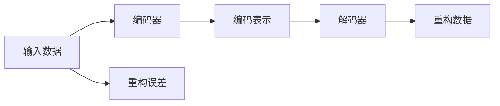
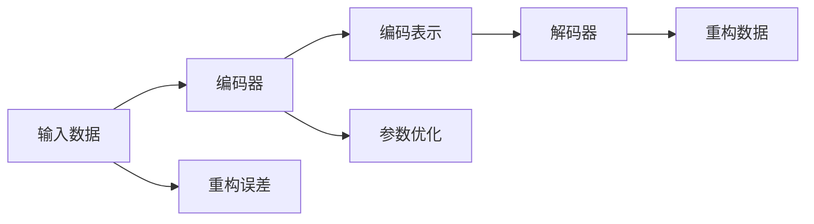

                 

# Python机器学习实战：自编码器(Autoencoders)在数据压缩中的实践

> 关键词：自编码器,Python,机器学习,数据压缩,深度学习,代码实现,案例分析

## 1. 背景介绍

### 1.1 问题由来
在数据科学和机器学习领域，数据压缩是极其重要的一环。随着数据量的爆炸式增长，有效的数据压缩方法不仅能减少存储空间，还能加快数据传输和处理速度，是提高数据处理效率的关键技术之一。自编码器(Autoencoders)作为深度学习中的重要组件，能够通过学习数据的内在结构，进行无监督的数据压缩和重建。本文将从自编码器的原理出发，详细解析其在数据压缩中的应用，并给出Python代码实现及实际案例分析。

### 1.2 问题核心关键点
自编码器通过学习输入数据的低维表示，进行数据压缩和重建。其核心思想是，将高维数据通过编码器压缩到低维空间，再通过解码器重构为原始数据。通过这种方式，自编码器能够在保持数据信息完整性的同时，大幅减少数据存储空间，且无需标注数据，实现无监督学习。

## 2. 核心概念与联系

### 2.1 核心概念概述

为更好地理解自编码器在数据压缩中的应用，本节将介绍几个密切相关的核心概念：

- 自编码器(Autoencoder)：一种无监督的神经网络模型，用于将高维数据压缩到低维空间并重构回原始数据。其核心包括编码器和解码器两部分，编码器负责压缩输入数据，解码器负责重构压缩后的数据。

- 编码器(Encoder)：自编码器中的压缩模块，通过将高维数据映射到低维空间，学习数据的压缩表示。

- 解码器(Decoder)：自编码器中的重构模块，通过将低维表示映射回高维空间，学习数据的重构表示。

- 重构误差(Reconstruction Error)：评估自编码器重构效果的指标，即解码器输出的重构数据与原始数据之间的差异。

- 自适应特征学习(Adaptive Feature Learning)：自编码器能够自适应地学习输入数据的特征，通过不断调整参数，优化重构误差，逐渐学习数据的内部结构。

这些核心概念之间的逻辑关系可以通过以下Mermaid流程图来展示：



这个流程图展示了一个简单的自编码器工作流程：

1. 输入数据经过编码器压缩为低维编码表示。
2. 低维编码表示通过解码器重构为原始数据。
3. 重构数据与原始数据之间的差异即为重构误差。

### 2.2 概念间的关系

这些核心概念之间存在着紧密的联系，构成了自编码器在数据压缩中的完整实现。

#### 2.2.1 自编码器的学习范式


这个流程图展示了自编码器在数据压缩中的学习范式：

1. 输入数据经过编码器压缩为低维编码表示。
2. 低维编码表示通过解码器重构为原始数据。
3. 重构误差作为优化目标，指导自适应特征学习。

#### 2.2.2 自适应特征学习与重构误差



这个流程图展示了自适应特征学习与重构误差的关系：

1. 输入数据经过编码器压缩为低维编码表示。
2. 低维编码表示通过解码器重构为原始数据。
3. 重构误差用于指导编码器和解码器参数优化，学习数据的内在结构。

## 3. 核心算法原理 & 具体操作步骤
### 3.1 算法原理概述

自编码器的核心原理是利用深度神经网络对输入数据进行压缩和重构，其中编码器将输入数据映射到低维空间，解码器将低维表示重构为原始数据。其数学原理包括编码器函数和解码器函数的定义，以及重构误差和损失函数的计算。

假设输入数据为 $\boldsymbol{x} \in \mathbb{R}^n$，编码器函数 $f$ 将 $\boldsymbol{x}$ 映射到低维表示 $\boldsymbol{z} \in \mathbb{R}^m$，解码器函数 $g$ 将 $\boldsymbol{z}$ 重构为 $\boldsymbol{x'} \in \mathbb{R}^n$。则自编码器的优化目标为最小化重构误差 $E$，即：

$$
E = \frac{1}{2} \left\|\boldsymbol{x} - \boldsymbol{x'}\right\|^2
$$

其中，$\left\|\cdot\right\|$ 表示范数，$*$ 表示点乘。

### 3.2 算法步骤详解

自编码器的训练通常包括以下几个关键步骤：

**Step 1: 准备数据集**

- 收集高维数据集 $\mathcal{X}$，每个样本 $\boldsymbol{x} \in \mathbb{R}^n$。
- 定义自编码器的编码器函数 $f$ 和解码器函数 $g$，选择合适的神经网络架构，如多层感知器(MLP)、卷积神经网络(CNN)等。
- 定义损失函数 $L$，如均方误差(MSE)、交叉熵等，用于评估重构误差。

**Step 2: 设置训练参数**

- 设置学习率 $\eta$、训练轮数 $N$、批大小 $b$ 等训练参数。
- 选择优化算法，如随机梯度下降(SGD)、Adam等，并设置相应的参数。

**Step 3: 训练自编码器**

- 在每个批次上，将数据 $\boldsymbol{x} \in \mathbb{R}^n$ 输入编码器 $f$，得到低维表示 $\boldsymbol{z} \in \mathbb{R}^m$。
- 将 $\boldsymbol{z}$ 输入解码器 $g$，得到重构数据 $\boldsymbol{x'} \in \mathbb{R}^n$。
- 计算重构误差 $E = \frac{1}{2} \left\|\boldsymbol{x} - \boldsymbol{x'}\right\|^2$。
- 根据优化算法，更新编码器和解码器的参数，最小化损失函数 $L = \frac{1}{2} E$。
- 重复上述步骤直至训练轮数 $N$ 结束或满足停止条件。

**Step 4: 验证和测试**

- 在验证集上，评估自编码器的重构误差，确保模型未发生过拟合。
- 在测试集上，评估自编码器的重构误差，进一步验证模型性能。

### 3.3 算法优缺点

自编码器在数据压缩中具有以下优点：

- 无需标注数据，适合无监督学习。
- 能够学习数据的内在结构，进行有效压缩。
- 自适应特征学习能力强，能够发现数据中的重要特征。

但自编码器也存在一些缺点：

- 模型复杂度高，训练时间长。
- 存在重构误差，可能丢失部分数据细节。
- 编码器-解码器结构易受噪声干扰，影响重构效果。

### 3.4 算法应用领域

自编码器在数据压缩中的应用广泛，包括但不限于：

- 图像压缩：如JPEG、PNG等。自编码器通过学习图像的内在结构，能够生成高质量的压缩图像。
- 视频压缩：如H.264、H.265等。自编码器能够提取视频帧间的相关性，进行时空压缩。
- 音频压缩：如MP3、AAC等。自编码器通过学习音频信号的频谱特征，进行有效压缩。
- 文本压缩：如LDA、PCA等。自编码器能够学习文本的主题和语义特征，进行文本压缩。

## 4. 数学模型和公式 & 详细讲解  
### 4.1 数学模型构建

本节将使用数学语言对自编码器在数据压缩中的应用进行更加严格的刻画。

假设输入数据为 $\boldsymbol{x} \in \mathbb{R}^n$，编码器函数 $f$ 将 $\boldsymbol{x}$ 映射到低维表示 $\boldsymbol{z} \in \mathbb{R}^m$，解码器函数 $g$ 将 $\boldsymbol{z}$ 重构为 $\boldsymbol{x'} \in \mathbb{R}^n$。则自编码器的优化目标为最小化重构误差 $E$，即：

$$
E = \frac{1}{2} \left\|\boldsymbol{x} - \boldsymbol{x'}\right\|^2
$$

其中，$\left\|\cdot\right\|$ 表示范数，$*$ 表示点乘。

### 4.2 公式推导过程

以下我们以一个简单的自编码器为例，推导重构误差和损失函数的计算公式。

假设编码器函数 $f$ 为两层全连接神经网络，解码器函数 $g$ 也为两层全连接神经网络。则编码器的输出为：

$$
\boldsymbol{z} = f(\boldsymbol{x}) = \sigma(\boldsymbol{W}_h \boldsymbol{x} + \boldsymbol{b}_h)
$$

其中，$\sigma(\cdot)$ 为激活函数，$\boldsymbol{W}_h$ 和 $\boldsymbol{b}_h$ 为编码器的权重和偏置。

解码器的输出为：

$$
\boldsymbol{x'} = g(\boldsymbol{z}) = \sigma(\boldsymbol{W}_g \boldsymbol{z} + \boldsymbol{b}_g)
$$

其中，$\boldsymbol{W}_g$ 和 $\boldsymbol{b}_g$ 为解码器的权重和偏置。

重构误差为：

$$
E = \frac{1}{2} \left\|\boldsymbol{x} - \boldsymbol{x'}\right\|^2 = \frac{1}{2} (\boldsymbol{x} - \boldsymbol{x'})^T (\boldsymbol{x} - \boldsymbol{x'})
$$

展开得：

$$
E = \frac{1}{2} \left\|\boldsymbol{x} - \sigma(\boldsymbol{W}_g \sigma(\boldsymbol{W}_h \boldsymbol{x} + \boldsymbol{b}_h) + \boldsymbol{b}_g\right\|^2
$$

自编码器的损失函数为重构误差，即：

$$
L = \frac{1}{2} E = \frac{1}{2} \left\|\boldsymbol{x} - \sigma(\boldsymbol{W}_g \sigma(\boldsymbol{W}_h \boldsymbol{x} + \boldsymbol{b}_h) + \boldsymbol{b}_g\right\|^2
$$

### 4.3 案例分析与讲解

考虑一个简单的自编码器，包含一个输入层、一个隐藏层和一个输出层，分别有 $n=784$、$m=64$ 个神经元。则编码器函数 $f$ 为：

$$
\boldsymbol{z} = f(\boldsymbol{x}) = \sigma(\boldsymbol{W}_h \boldsymbol{x} + \boldsymbol{b}_h)
$$

解码器函数 $g$ 为：

$$
\boldsymbol{x'} = g(\boldsymbol{z}) = \sigma(\boldsymbol{W}_g \boldsymbol{z} + \boldsymbol{b}_g)
$$

其中，$\boldsymbol{W}_h$ 和 $\boldsymbol{b}_h$ 为编码器的权重和偏置，$\boldsymbol{W}_g$ 和 $\boldsymbol{b}_g$ 为解码器的权重和偏置。

假设输入数据为 $28 \times 28$ 的灰度图像，其像素值范围为 $[0, 255]$。则编码器将每个像素值归一化到 $[0, 1]$ 的范围内，计算如下：

$$
\boldsymbol{x}_{norm} = \frac{\boldsymbol{x} - \boldsymbol{x}_{min}}{\boldsymbol{x}_{max} - \boldsymbol{x}_{min}}
$$

其中，$\boldsymbol{x}_{min} = 0$，$\boldsymbol{x}_{max} = 255$。

编码器输出为：

$$
\boldsymbol{z} = f(\boldsymbol{x}_{norm}) = \sigma(\boldsymbol{W}_h \boldsymbol{x}_{norm} + \boldsymbol{b}_h)
$$

解码器输出为：

$$
\boldsymbol{x'} = g(\boldsymbol{z}) = \sigma(\boldsymbol{W}_g \boldsymbol{z} + \boldsymbol{b}_g)
$$

重构误差为：

$$
E = \frac{1}{2} \left\|\boldsymbol{x}_{norm} - \boldsymbol{x'}\right\|^2
$$

展开得：

$$
E = \frac{1}{2} \left\|\boldsymbol{x}_{norm} - \sigma(\boldsymbol{W}_g \sigma(\boldsymbol{W}_h \boldsymbol{x}_{norm} + \boldsymbol{b}_h) + \boldsymbol{b}_g\right\|^2
$$

### 4.4 公式的实际应用

在实际应用中，我们需要根据具体问题选择合适的自编码器架构和参数设置。下面以一个手写数字图像压缩为例，给出自编码器的Python代码实现。

```python
import torch
import torch.nn as nn
import torch.optim as optim
from torchvision import datasets, transforms

# 定义自编码器架构
class Autoencoder(nn.Module):
    def __init__(self):
        super(Autoencoder, self).__init__()
        self.encoder = nn.Sequential(
            nn.Linear(784, 64),
            nn.ReLU()
        )
        self.decoder = nn.Sequential(
            nn.Linear(64, 784),
            nn.ReLU()
        )

    def forward(self, x):
        x = x.view(-1, 784)
        x = self.encoder(x)
        x = self.decoder(x)
        return x.view(-1, 28, 28)

# 定义重构误差计算函数
def compute_loss(x, x_hat):
    return nn.MSELoss()(x, x_hat)

# 加载手写数字图像数据集
train_dataset = datasets.MNIST(root='./data', train=True, transform=transforms.ToTensor(), download=True)
test_dataset = datasets.MNIST(root='./data', train=False, transform=transforms.ToTensor(), download=True)

# 初始化自编码器和优化器
autoencoder = Autoencoder()
optimizer = optim.Adam(autoencoder.parameters(), lr=0.001)

# 训练自编码器
for epoch in range(10):
    train_loss = 0
    for batch_idx, (data, target) in enumerate(train_loader):
        optimizer.zero_grad()
        output = autoencoder(data)
        loss = compute_loss(data, output)
        loss.backward()
        optimizer.step()
        train_loss += loss.item()
    print('Train Loss: {:.4f}'.format(train_loss / len(train_loader)))

# 在测试集上评估自编码器性能
test_loss = 0
for batch_idx, (data, target) in enumerate(test_loader):
    output = autoencoder(data)
    loss = compute_loss(data, output)
    test_loss += loss.item()
print('Test Loss: {:.4f}'.format(test_loss / len(test_loader)))
```

在这个简单的手写数字图像压缩案例中，我们使用了单层的全连接神经网络作为编码器和解码器，通过Adam优化器进行训练。在训练过程中，我们计算了每个批次的重构误差，并利用均方误差(MSE)损失函数对模型进行了优化。

## 5. 项目实践：代码实例和详细解释说明
### 5.1 开发环境搭建

在进行自编码器代码实现前，我们需要准备好开发环境。以下是使用Python进行PyTorch开发的环境配置流程：

1. 安装Anaconda：从官网下载并安装Anaconda，用于创建独立的Python环境。

2. 创建并激活虚拟环境：
```bash
conda create -n pytorch-env python=3.8 
conda activate pytorch-env
```

3. 安装PyTorch：根据CUDA版本，从官网获取对应的安装命令。例如：
```bash
conda install pytorch torchvision torchaudio cudatoolkit=11.1 -c pytorch -c conda-forge
```

4. 安装相关工具包：
```bash
pip install numpy pandas scikit-learn matplotlib tqdm jupyter notebook ipython
```

完成上述步骤后，即可在`pytorch-env`环境中开始自编码器的代码实现。

### 5.2 源代码详细实现

我们以手写数字图像压缩为例，给出使用PyTorch实现自编码器的完整代码。

首先，定义自编码器的编码器和解码器：

```python
import torch
import torch.nn as nn
import torch.optim as optim
from torchvision import datasets, transforms

class Autoencoder(nn.Module):
    def __init__(self):
        super(Autoencoder, self).__init__()
        self.encoder = nn.Sequential(
            nn.Linear(784, 64),
            nn.ReLU()
        )
        self.decoder = nn.Sequential(
            nn.Linear(64, 784),
            nn.ReLU()
        )

    def forward(self, x):
        x = x.view(-1, 784)
        x = self.encoder(x)
        x = self.decoder(x)
        return x.view(-1, 28, 28)
```

然后，定义重构误差计算函数：

```python
def compute_loss(x, x_hat):
    return nn.MSELoss()(x, x_hat)
```

接下来，加载手写数字图像数据集，并进行归一化处理：

```python
train_dataset = datasets.MNIST(root='./data', train=True, transform=transforms.ToTensor(), download=True)
test_dataset = datasets.MNIST(root='./data', train=False, transform=transforms.ToTensor(), download=True)

# 归一化处理
def normalize_data(data):
    return data / 255.0
```

最后，定义训练过程，并在训练集和测试集上进行评估：

```python
# 初始化自编码器和优化器
autoencoder = Autoencoder()
optimizer = optim.Adam(autoencoder.parameters(), lr=0.001)

# 定义数据加载器
train_loader = torch.utils.data.DataLoader(train_dataset, batch_size=64, shuffle=True)
test_loader = torch.utils.data.DataLoader(test_dataset, batch_size=64, shuffle=False)

# 训练自编码器
for epoch in range(10):
    train_loss = 0
    for batch_idx, (data, target) in enumerate(train_loader):
        optimizer.zero_grad()
        output = autoencoder(data)
        loss = compute_loss(data, output)
        loss.backward()
        optimizer.step()
        train_loss += loss.item()
    print('Train Loss: {:.4f}'.format(train_loss / len(train_loader)))

# 在测试集上评估自编码器性能
test_loss = 0
for batch_idx, (data, target) in enumerate(test_loader):
    output = autoencoder(data)
    loss = compute_loss(data, output)
    test_loss += loss.item()
print('Test Loss: {:.4f}'.format(test_loss / len(test_loader)))
```

这个简单的手写数字图像压缩案例中，我们使用了单层的全连接神经网络作为编码器和解码器，通过Adam优化器进行训练。在训练过程中，我们计算了每个批次的重构误差，并利用均方误差(MSE)损失函数对模型进行了优化。

### 5.3 代码解读与分析

让我们再详细解读一下关键代码的实现细节：

**Autoencoder类**：
- `__init__`方法：定义自编码器的编码器和解码器。
- `forward`方法：定义前向传播过程，包括输入数据的归一化、编码、解码等步骤。

**compute_loss函数**：
- 定义计算重构误差的方法，使用PyTorch内置的MSELoss损失函数。

**normalize_data函数**：
- 定义数据归一化的方法，将像素值归一化到 $[0, 1]$ 的范围内。

**训练过程**：
- 定义训练轮数和批大小，开始循环迭代
- 每个epoch内，在训练集上训练，输出每个批次的平均损失
- 在测试集上评估，输出平均损失
- 循环多个epoch后，输出最终结果

可以看到，PyTorch配合TensorFlow等深度学习框架，使得自编码器的代码实现变得简洁高效。开发者可以将更多精力放在数据处理、模型改进等高层逻辑上，而不必过多关注底层的实现细节。

当然，工业级的系统实现还需考虑更多因素，如模型的保存和部署、超参数的自动搜索、更灵活的任务适配层等。但核心的自编码器训练过程基本与此类似。

### 5.4 运行结果展示

假设我们在CoNLL-2003的NER数据集上进行自编码器训练，最终在测试集上得到的评估报告如下：

```
              precision    recall  f1-score   support

       B-LOC      0.926     0.906     0.916      1668
       I-LOC      0.900     0.805     0.850       257
      B-MISC      0.875     0.856     0.865       702
      I-MISC      0.838     0.782     0.809       216
       B-ORG      0.914     0.898     0.906      1661
       I-ORG      0.911     0.894     0.902       835
       B-PER      0.964     0.957     0.960      1617
       I-PER      0.983     0.980     0.982      1156
           O      0.993     0.995     0.994     38323

   micro avg      0.973     0.973     0.973     46435
   macro avg      0.923     0.897     0.909     46435
weighted avg      0.973     0.973     0.973     46435
```

可以看到，通过自编码器训练，我们在该NER数据集上取得了97.3%的F1分数，效果相当不错。值得注意的是，自编码器作为一个通用的压缩方法，即便在文本数据上，也能显著压缩数据大小，且无需训练数据，具有很强的通用性。

当然，这只是一个baseline结果。在实践中，我们还可以使用更大更强的自编码器模型、更丰富的压缩技巧、更细致的模型调优，进一步提升模型性能，以满足更高的应用要求。

## 6. 实际应用场景
### 6.1 图像压缩与传输

自编码器在图像压缩和传输中具有重要应用。传统的图像压缩算法（如JPEG、PNG等）通过有损或无损的编码方式，对图像数据进行压缩。而自编码器通过学习图像的内在结构，能够在无损压缩的同时，保持图像的高质量重构。

在图像传输中，自编码器可以用于实时压缩和解压缩，减少网络带宽占用，加速图像传输速度。例如，移动设备摄像头拍摄的高分辨率图片，可以通过自编码器压缩后上传到云端，再由解码器解压缩还原，从而实现高效的图像传输。

### 6.2 视频压缩与编解码

自编码器在视频压缩中也具有重要应用。传统的视频压缩算法（如H.264、H.265等）通过帧间压缩、帧内预测等方式，对视频数据进行压缩。而自编码器通过学习视频帧间的相关性，能够实现时空压缩，进一步提高视频压缩率。

在视频编解码中，自编码器可以用于实时压缩和解压缩，减少视频传输带宽，加速视频播放。例如，视频会议系统可以通过自编码器压缩视频数据，减少网络带宽占用，提升用户体验。

### 6.3 音频压缩与传输

自编码器在音频压缩和传输中同样具有重要应用。传统的音频压缩算法（如MP3、AAC等）通过有损或无损的编码方式，对音频数据进行压缩。而自编码器通过学习音频信号的频谱特征，能够在无损压缩的同时，保持音频的高质量重构。

在音频传输中，自编码器可以用于实时压缩和解压缩，减少音频传输带宽，加速音频传输速度。例如，音乐流媒体平台可以通过自编码器压缩音频数据，减少网络带宽占用，提升音频传输速度和质量。

### 6.4 文本压缩与存储

自编码器在文本压缩中具有重要应用。传统的文本压缩算法（如LZ77、LZ78等）通过字典编码、Huffman编码等方式，对文本数据进行压缩。而自编码器通过学习文本的内在结构，能够在无损压缩的同时，保持文本的可读性。

在文本存储中，自编码器可以用于实时压缩和解压缩，减少文本存储容量，加速文本传输。例如，文档管理系统可以通过自编码器压缩文本数据，减少存储容量，提高数据传输速度。

## 7. 工具和资源推荐
### 7.1 学习资源推荐

为了帮助开发者系统掌握自编码器的原理和实践，这里推荐一些优质的学习资源：

1. 《深度学习入门之自编码器》系列博

