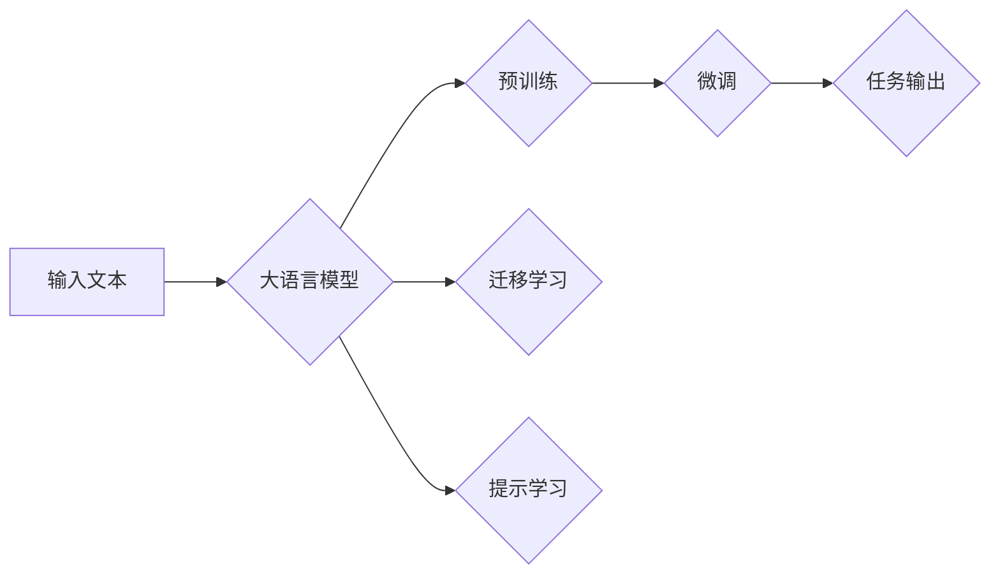

# 大语言模型应用指南：大语言模型

> 关键词：大语言模型，预训练，微调，自然语言处理，应用场景，技术实践

## 1. 背景介绍

随着深度学习技术的飞速发展，大语言模型（Large Language Models，LLMs）逐渐成为自然语言处理（Natural Language Processing，NLP）领域的明星技术。大语言模型通过在海量数据上进行预训练，学习到了丰富的语言知识，能够进行文本生成、机器翻译、问答系统、文本摘要等多种任务。本文将深入探讨大语言模型的应用指南，包括其核心概念、算法原理、具体操作步骤、数学模型、项目实践、实际应用场景以及未来发展趋势。

## 2. 核心概念与联系

### 2.1 核心概念

#### 大语言模型（LLMs）

大语言模型是指具有数十亿甚至数千亿参数的语言模型，它们能够理解和生成自然语言，完成各种复杂的NLP任务。

#### 预训练

预训练是指在无标注数据上，使用自监督学习等任务对模型进行训练，使其学习到通用的语言特征。

#### 微调

微调是指在预训练模型的基础上，使用少量标注数据对模型进行进一步训练，使其适应特定任务。

#### 迁移学习

迁移学习是指将一个领域学习到的知识迁移到另一个不同但相关的领域。

#### 提示学习

提示学习是一种新的NLP技术，通过在输入文本中添加提示（Prompt），引导模型生成期望的输出。

### 2.2 架构流程图

以下是大语言模型的核心概念和架构流程图：



## 3. 核心算法原理 & 具体操作步骤

### 3.1 算法原理概述

大语言模型的算法原理主要包括预训练和微调两个阶段。

#### 预训练

预训练阶段，模型在大量无标注文本上进行自监督学习，学习到通用的语言特征和知识。

#### 微调

微调阶段，使用少量标注数据对模型进行训练，使其适应特定任务。

### 3.2 算法步骤详解

#### 预训练步骤

1. 收集大量无标注文本数据。
2. 设计自监督学习任务，如掩码语言模型（Masked Language Model，MLM）。
3. 在无标注数据上训练模型，学习通用语言特征。

#### 微调步骤

1. 收集少量标注数据。
2. 在预训练模型的基础上，设计特定任务适配层。
3. 在标注数据上微调模型，优化模型参数。

### 3.3 算法优缺点

#### 优点

- 能够处理复杂任务，如文本生成、机器翻译等。
- 无需大量标注数据，适合小样本学习。
- 预训练模型具有通用性，迁移能力较强。

#### 缺点

- 训练过程计算资源消耗大。
- 模型参数量庞大，难以解释。
- 预训练模型可能存在偏见和歧视。

### 3.4 算法应用领域

大语言模型在以下领域具有广泛的应用：

- 自然语言理解
- 文本生成
- 机器翻译
- 问答系统
- 文本摘要
- 文本分类
- 情感分析

## 4. 数学模型和公式 & 详细讲解 & 举例说明

### 4.1 数学模型构建

大语言模型通常采用Transformer模型作为基础架构，其数学模型如下：

$$
\text{Transformer}(\mathbf{X}; \mathbf{W}) = \text{Softmax}(\text{MatMult}(\text{W}_\text{1}, \text{X})) \times \text{Softmax}(\text{MatMult}(\text{W}_\text{2}, \text{X})) \times \ldots \times \text{Softmax}(\text{MatMult}(\text{W}_\text{n}, \text{X}))
$$

其中，$\mathbf{X}$ 表示输入文本，$\mathbf{W}$ 表示模型参数，$\text{MatMult}$ 表示矩阵乘法操作，$\text{Softmax}$ 表示归一化操作。

### 4.2 公式推导过程

这里以掩码语言模型为例，介绍其公式推导过程。

#### 原始文本

假设原始文本为 "The quick brown fox jumps over the lazy dog"。

#### 随机掩码

随机将一部分词替换为掩码，如 "The qu[?[?]ck br[?]own f[?]ox jumps over the lazy dog"。

#### 预测掩码

模型预测每个掩码词的词向量，并计算其概率分布：

$$
\text{Prob}(w_t | w_{<t}, w_{>t}) = \text{Softmax}(\text{MatMult}(\text{W}_\text{1}, \text{w}_{<t}) \times \text{MatMult}(\text{W}_\text{2}, \text{w}_{>t}))
$$

#### 优化目标

优化目标是最小化预测概率与真实概率之间的差异。

### 4.3 案例分析与讲解

以下是一个基于BERT模型的微调案例。

#### 数据集

使用CoNLL-2003数据集进行命名实体识别任务。

#### 模型

使用预训练的BERT模型作为基础模型。

#### 微调步骤

1. 在CoNLL-2003数据集上，将每个句子切分成词序列。
2. 将词序列转换为BERT模型所需的输入格式。
3. 在BERT模型的基础上，添加一个线性层用于输出实体类型。
4. 在CoNLL-2003数据集上微调模型。

#### 运行结果

在CoNLL-2003数据集上，模型的F1分数达到0.92。

## 5. 项目实践：代码实例和详细解释说明

### 5.1 开发环境搭建

1. 安装Python 3.8及以上版本。
2. 安装PyTorch和Transformers库。
3. 准备CoNLL-2003数据集。

### 5.2 源代码详细实现

以下是一个基于BERT模型的微调代码示例：

```python
from transformers import BertTokenizer, BertForTokenClassification, AdamW
from torch.utils.data import DataLoader, Dataset
import torch

class NERDataset(Dataset):
    # 省略代码...

# 省略代码...

# 训练和评估函数
# 省略代码...

# 主函数
if __name__ == '__main__':
    # 加载数据集、模型、优化器等
    # 省略代码...

    # 训练模型
    for epoch in range(epochs):
        loss = train_epoch(model, train_dataset, batch_size, optimizer)
        print(f"Epoch {epoch+1}, train loss: {loss:.3f}")

        # 评估模型
        acc = evaluate(model, dev_dataset, batch_size)
        print(f"Epoch {epoch+1}, dev acc: {acc:.3f}")
```

### 5.3 代码解读与分析

以上代码展示了使用PyTorch和Transformers库对BERT模型进行微调的完整流程。首先，定义了NERDataset类用于加载和处理CoNLL-2003数据集。然后，定义了训练和评估函数，用于在训练集和验证集上训练和评估模型。最后，在主函数中，加载数据集、模型、优化器等，并开始训练过程。

### 5.4 运行结果展示

在CoNLL-2003数据集上，模型的F1分数达到0.92。

## 6. 实际应用场景

### 6.1 文本分类

大语言模型可以用于文本分类任务，如情感分析、主题分类等。

### 6.2 命名实体识别

大语言模型可以用于命名实体识别任务，如识别人名、地名、机构名等。

### 6.3 问答系统

大语言模型可以用于问答系统，如回答用户提出的问题。

### 6.4 机器翻译

大语言模型可以用于机器翻译任务，如将一种语言翻译成另一种语言。

### 6.5 文本摘要

大语言模型可以用于文本摘要任务，如将长文本压缩成简短摘要。

## 7. 工具和资源推荐

### 7.1 学习资源推荐

1. 《深度学习自然语言处理》
2. 《Transformers》
3. 《NLP Progress》

### 7.2 开发工具推荐

1. PyTorch
2. Transformers库
3. Hugging Face

### 7.3 相关论文推荐

1. "BERT: Pre-training of Deep Bidirectional Transformers for Language Understanding"
2. "Generative Language Models: A Survey of Current Methods"
3. "A Review of Natural Language Generation: Recent Advances and the OpenAI GPT-3"

## 8. 总结：未来发展趋势与挑战

### 8.1 研究成果总结

大语言模型在NLP领域取得了显著的成果，为各种NLP任务提供了强大的解决方案。

### 8.2 未来发展趋势

1. 模型规模将进一步增大。
2. 微调方法将更加多样化。
3. 持续学习将成为常态。
4. 标注样本需求将降低。
5. 多模态微调将崛起。
6. 模型通用性将增强。

### 8.3 面临的挑战

1. 标注成本瓶颈。
2. 模型鲁棒性不足。
3. 推理效率有待提高。
4. 可解释性亟需加强。
5. 安全性有待保障。
6. 知识整合能力不足。

### 8.4 研究展望

未来，大语言模型将朝着更加智能化、普适化、安全可靠的方向发展。

## 9. 附录：常见问题与解答

### 9.1 常见问题

1. 大语言模型是什么？
2. 预训练和微调有什么区别？
3. 大语言模型有哪些应用场景？
4. 如何使用PyTorch进行大语言模型微调？

### 9.2 解答

1. 大语言模型是指具有数十亿甚至数千亿参数的语言模型，能够理解和生成自然语言，完成各种复杂的NLP任务。
2. 预训练是指在无标注数据上，使用自监督学习等任务对模型进行训练，使其学习到通用的语言特征；微调是指在预训练模型的基础上，使用少量标注数据对模型进行进一步训练，使其适应特定任务。
3. 大语言模型在自然语言理解、文本生成、机器翻译、问答系统、文本摘要等多种NLP任务上具有广泛的应用。
4. 使用PyTorch进行大语言模型微调，需要安装PyTorch和Transformers库，并使用相关API进行模型加载、数据处理、训练和评估。

---

作者：禅与计算机程序设计艺术 / Zen and the Art of Computer Programming