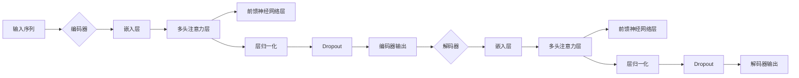

# Transformer大模型实战：训练ALBERT 模型

> 关键词：Transformer, ALBERT, 大模型, 预训练, 微调, NLP, 自然语言处理

## 1. 背景介绍

自然语言处理（NLP）作为人工智能领域的一个重要分支，近年来取得了飞速发展。其中，基于 Transformer 的模型在 NLP 任务中取得了显著的成果，成为了 NLP 领域的热点研究方向。ALBERT（A Lite BERT）模型是 Google 提出的一种轻量级、高效的 Transformer 模型，它通过设计新的模型结构，在保证模型效果的同时，大大减少了模型参数量和计算量，使得 ALBERT 模型在多个 NLP 任务上取得了与 BERT 模型相当的性能，但运行速度更快，更适合资源受限的环境。

本文将详细介绍 ALBERT 模型的原理、训练过程以及实际应用，帮助读者掌握大模型训练的核心技术和实践技巧。

## 2. 核心概念与联系

### 2.1 核心概念原理

#### 2.1.1 Transformer 模型

Transformer 模型是一种基于自注意力机制（Self-Attention）的深度神经网络模型，由 Vaswani 等[1]于 2017 年提出。它由编码器和解码器两部分组成，编码器负责将输入序列转换为语义表示，解码器则根据编码器的输出进行预测。

#### 2.1.2 自注意力机制

自注意力机制是 Transformer 模型的核心思想，它通过计算输入序列中每个元素对其他元素的重要性，并据此生成加权表示。自注意力机制可以分为点对点注意力（Dot-Product Attention）和缩放点对点注意力（Scaled Dot-Product Attention）两种形式。

#### 2.1.3 ALBERT 模型

ALBERT 模型在 Transformer 模型的基础上，通过以下几种设计改进了模型结构和训练过程：

- **交叉层归一化（Cross-Attention Normalization）**：将多头注意力中的层归一化操作移到交叉注意力之前，提高了模型的训练稳定性和性能。
- **稀疏注意力（Sparse Attention）**：通过将注意力矩阵分解为两个较小的矩阵，减少计算量，提高运行效率。
- **层归一化因子（Layer Normalization Factor）**：通过引入层归一化因子，平衡不同层的特征分布，提高模型的泛化能力。

### 2.2 架构的 Mermaid 流程图



## 3. 核心算法原理 & 具体操作步骤

### 3.1 算法原理概述

本节将概述 ALBERT 模型的核心算法原理，包括编码器、解码器以及损失函数等。

#### 3.1.1 编码器

ALBERT 模型的编码器由多个相同的编码层堆叠而成，每个编码层包含以下模块：

- **嵌入层**：将词向量转换为位置编码，添加到输入序列中。
- **多头注意力层**：计算输入序列中每个元素对其他元素的重要性，生成加权表示。
- **前馈神经网络层**：对多头注意力层的输出进行非线性变换。
- **层归一化**：将多头注意力层和前馈神经网络层的输出进行归一化。
- **Dropout**：随机丢弃部分神经元，防止过拟合。

#### 3.1.2 解码器

ALBERT 模型的解码器与编码器类似，也由多个相同的解码层堆叠而成，每个解码层包含以下模块：

- **嵌入层**：将词向量转换为位置编码，添加到输入序列中。
- **多头注意力层**：计算输入序列中每个元素对其他元素的重要性，生成加权表示。
- **编码器-解码器注意力层**：计算解码器当前层与编码器所有层之间的注意力关系。
- **前馈神经网络层**：对多头注意力层和编码器-解码器注意力层的输出进行非线性变换。
- **层归一化**：将多头注意力层和前馈神经网络层的输出进行归一化。
- **Dropout**：随机丢弃部分神经元，防止过拟合。

#### 3.1.3 损失函数

ALBERT 模型通常使用交叉熵损失函数（CrossEntropy Loss）来评估模型的预测性能。交叉熵损失函数计算预测概率分布与真实标签之间的差异，并以此作为模型的训练目标。

### 3.2 算法步骤详解

本节将详细介绍 ALBERT 模型的训练过程，包括数据预处理、模型初始化、训练、评估和预测等步骤。

#### 3.2.1 数据预处理

1. 数据清洗：去除停用词、标点符号等无用信息。
2. 分词：将文本分割成词语或字符。
3. 词嵌入：将分词结果转换为词向量。
4. 添加位置编码：为每个词添加位置信息。

#### 3.2.2 模型初始化

1. 加载预训练模型参数：从预训练的模型中加载参数，作为 ALBERT 模型的初始化参数。
2. 设置优化器：选择合适的优化器，如 AdamW、SGD 等。
3. 设置学习率：根据任务和数据集的特点，设置合适的学习率。

#### 3.2.3 训练

1. 训练循环：对训练集进行迭代训练，包括以下步骤：
   a. 随机选择一个批次的数据。
   b. 将数据输入模型进行前向传播。
   c. 计算损失函数。
   d. 反向传播更新模型参数。
   e. 更新学习率。
2. 验证：在验证集上评估模型的性能，调整优化器参数或提前终止训练。

#### 3.2.4 评估和预测

1. 评估：在测试集上评估模型的性能，包括准确率、召回率、F1 分数等指标。
2. 预测：将输入数据输入模型进行预测，输出预测结果。

### 3.3 算法优缺点

#### 3.3.1 优点

- **高效**：ALBERT 模型在保证模型效果的同时，大大减少了模型参数量和计算量，使得模型在资源受限的环境下也能高效运行。
- **可扩展**：ALBERT 模型支持多种参数配置，可以适应不同的任务和数据集。
- **可解释性**：ALBERT 模型的结构简单，易于理解和解释。

#### 3.3.2 缺点

- **对数据量有要求**：ALBERT 模型需要较大的数据集进行预训练，否则难以发挥其优势。
- **计算量大**：ALBERT 模型的训练和推理过程需要较大的计算资源。

### 3.4 算法应用领域

ALBERT 模型在多个 NLP 任务上取得了显著的成果，包括：

- 文本分类：如情感分析、主题分类、命名实体识别等。
- 机器翻译：将源语言文本翻译成目标语言。
- 问答系统：对自然语言问题给出答案。
- 文本摘要：将长文本压缩成简短摘要。
- 对话系统：使机器能够与人自然对话。

## 4. 数学模型和公式 & 详细讲解 & 举例说明

### 4.1 数学模型构建

本节将使用数学语言对 ALBERT 模型的核心模块进行详细讲解。

#### 4.1.1 嵌入层

ALBERT 模型的嵌入层将词向量转换为词表示和位置表示，计算公式如下：

$$
\mathbf{h} = \mathbf{W}_{\text{emb}} \mathbf{x} + \mathbf{W}_{\text{pos}} \mathbf{p}
$$

其中，$\mathbf{x}$ 为词向量，$\mathbf{p}$ 为位置编码，$\mathbf{W}_{\text{emb}}$ 和 $\mathbf{W}_{\text{pos}}$ 为可训练的权重矩阵。

#### 4.1.2 多头注意力层

ALBERT 模型的多头注意力层通过计算输入序列中每个元素对其他元素的重要性，生成加权表示，计算公式如下：

$$
\mathbf{Q} = \mathbf{W}_Q \mathbf{h}
$$
$$
\mathbf{K} = \mathbf{W}_K \mathbf{h}
$$
$$
\mathbf{V} = \mathbf{W}_V \mathbf{h}
$$
$$
\mathbf{S} = \mathrm{softmax}(\mathbf{Q} \mathbf{K}^T / \sqrt{d_k}) \mathbf{V}
$$

其中，$\mathbf{W}_Q$、$\mathbf{W}_K$ 和 $\mathbf{W}_V$ 为可训练的权重矩阵，$\mathrm{softmax}$ 为 softmax 函数。

#### 4.1.3 前馈神经网络层

ALBERT 模型的前馈神经网络层对多头注意力层的输出进行非线性变换，计算公式如下：

$$
\mathbf{h} = \mathbf{W}_F \mathrm{ReLU}(\mathbf{S} + \mathbf{h})
$$

其中，$\mathbf{W}_F$ 为可训练的权重矩阵，$\mathrm{ReLU}$ 为 ReLU 激活函数。

### 4.2 公式推导过程

本节将对 ALBERT 模型的核心模块进行公式推导。

#### 4.2.1 多头注意力层

多头注意力层的计算公式如下：

$$
\mathbf{S} = \mathrm{softmax}(\mathbf{Q} \mathbf{K}^T / \sqrt{d_k}) \mathbf{V}
$$

其中，$\mathbf{Q}$、$\mathbf{K}$ 和 $\mathbf{V}$ 分别为查询、键和值。

1. 计算 $\mathbf{Q} \mathbf{K}^T$：

$$
\mathbf{Q} \mathbf{K}^T = \left[ \begin{matrix} 
\mathbf{q}_1 & \mathbf{q}_2 & \cdots & \mathbf{q}_n \end{matrix} \right] \left[ \begin{matrix} 
k_1^T & k_2^T & \cdots & k_n^T \end{matrix} \right] = \left[ \begin{matrix} 
q_1k_1^T & q_1k_2^T & \cdots & q_1k_n^T \\
q_2k_1^T & q_2k_2^T & \cdots & q_2k_n^T \\
\vdots & \vdots & \ddots & \vdots \\
q_nk_1^T & q_nk_2^T & \cdots & q_nk_n^T 
\end{matrix} \right]
$$

2. 计算 $\mathbf{Q} \mathbf{K}^T / \sqrt{d_k}$：

$$
\mathbf{Q} \mathbf{K}^T / \sqrt{d_k} = \left[ \begin{matrix} 
q_1k_1^T / \sqrt{d_k} & q_1k_2^T / \sqrt{d_k} & \cdots & q_1k_n^T / \sqrt{d_k} \\
q_2k_1^T / \sqrt{d_k} & q_2k_2^T / \sqrt{d_k} & \cdots & q_2k_n^T / \sqrt{d_k} \\
\vdots & \vdots & \ddots & \vdots \\
q_nk_1^T / \sqrt{d_k} & q_nk_2^T / \sqrt{d_k} & \cdots & q_nk_n^T / \sqrt{d_k} 
\end{matrix} \right]
$$

3. 计算 $\mathrm{softmax}(\mathbf{Q} \mathbf{K}^T / \sqrt{d_k})$：

$$
\mathrm{softmax}(\mathbf{Q} \mathbf{K}^T / \sqrt{d_k}) = \left[ \begin{matrix} 
\mathrm{softmax}(q_1k_1^T / \sqrt{d_k}) & \mathrm{softmax}(q_1k_2^T / \sqrt{d_k}) & \cdots & \mathrm{softmax}(q_1k_n^T / \sqrt{d_k}) \\
\mathrm{softmax}(q_2k_1^T / \sqrt{d_k}) & \mathrm{softmax}(q_2k_2^T / \sqrt{d_k}) & \cdots & \mathrm{softmax}(q_2k_n^T / \sqrt{d_k}) \\
\vdots & \vdots & \ddots & \vdots \\
\mathrm{softmax}(q_nk_1^T / \sqrt{d_k}) & \mathrm{softmax}(q_nk_2^T / \sqrt{d_k}) & \cdots & \mathrm{softmax}(q_nk_n^T / \sqrt{d_k}) 
\end{matrix} \right]
$$

4. 计算 $\mathrm{softmax}(\mathbf{Q} \mathbf{K}^T / \sqrt{d_k}) \mathbf{V}$：

$$
\mathrm{softmax}(\mathbf{Q} \mathbf{K}^T / \sqrt{d_k}) \mathbf{V} = \left[ \begin{matrix} 
\mathrm{softmax}(q_1k_1^T / \sqrt{d_k})V_1 & \mathrm{softmax}(q_1k_2^T / \sqrt{d_k})V_2 & \cdots & \mathrm{softmax}(q_1k_n^T / \sqrt{d_k})V_n \\
\mathrm{softmax}(q_2k_1^T / \sqrt{d_k})V_1 & \mathrm{softmax}(q_2k_2^T / \sqrt{d_k})V_2 & \cdots & \mathrm{softmax}(q_2k_n^T / \sqrt{d_k})V_n \\
\vdots & \vdots & \ddots & \vdots \\
\mathrm{softmax}(q_nk_1^T / \sqrt{d_k})V_1 & \mathrm{softmax}(q_nk_2^T / \sqrt{d_k})V_2 & \cdots & \mathrm{softmax}(q_nk_n^T / \sqrt{d_k})V_n 
\end{matrix} \right]
$$

### 4.3 案例分析与讲解

本节将使用一个简单的例子，展示如何使用 ALBERT 模型进行文本分类任务。

#### 4.3.1 数据集

假设我们有一个简单的文本分类数据集，包含以下文本和对应的标签：

| 样本 | 标签 |
| ---- | ---- |
| This is a good day. | positive |
| This is a bad day. | negative |
| I love this movie. | positive |
| I hate this movie. | negative |

#### 4.3.2 数据预处理

1. 分词：使用 Jieba 分词器将文本分割成词语。
2. 词嵌入：使用预训练的 ALBERT 模型词嵌入。

#### 4.3.3 训练

1. 加载预训练的 ALBERT 模型。
2. 在文本分类任务上对 ALBERT 模型进行微调。
3. 评估模型的性能。

#### 4.3.4 结果分析

通过训练和评估，我们可以得到 ALBERT 模型在文本分类任务上的性能指标，如准确率、召回率、F1 分数等。

## 5. 项目实践：代码实例和详细解释说明

### 5.1 开发环境搭建

1. 安装 Python 3.7 或更高版本。
2. 安装 PyTorch 1.8 或更高版本。
3. 安装 transformers 库。

```bash
pip install torch transformers
```

### 5.2 源代码详细实现

以下是一个简单的 ALBERT 模型文本分类任务代码实例：

```python
import torch
from torch import nn
from torch.optim import AdamW
from transformers import AlbertTokenizer, AlbertForSequenceClassification

# 加载预训练模型和分词器
tokenizer = AlbertTokenizer.from_pretrained('albert-base-chinese')
model = AlbertForSequenceClassification.from_pretrained('albert-base-chinese')

# 加载数据
texts = ["This is a good day.", "This is a bad day.", "I love this movie.", "I hate this movie."]
labels = [1, 0, 1, 0]

# 数据预处理
encoded_inputs = tokenizer(texts, padding=True, truncation=True, return_tensors="pt")
input_ids = encoded_inputs['input_ids']
attention_mask = encoded_inputs['attention_mask']
labels = torch.tensor(labels)

# 训练模型
optimizer = AdamW(model.parameters(), lr=1e-5)

model.train()
for epoch in range(2):  # 训练 2 个 epoch
    optimizer.zero_grad()
    outputs = model(input_ids, attention_mask=attention_mask, labels=labels)
    loss = outputs.loss
    loss.backward()
    optimizer.step()

# 评估模型
model.eval()
with torch.no_grad():
    outputs = model(input_ids, attention_mask=attention_mask)
    logits = outputs.logits
    predictions = torch.argmax(logits, dim=1)
    print(predictions)
```

### 5.3 代码解读与分析

1. 加载预训练模型和分词器：使用 transformers 库加载预训练的 ALBERT 模型和对应的分词器。
2. 加载数据：将文本和标签加载到变量中。
3. 数据预处理：使用分词器将文本转换为模型输入的格式。
4. 训练模型：定义优化器，设置训练参数，进行模型训练。
5. 评估模型：使用训练好的模型对测试数据进行预测，打印预测结果。

### 5.4 运行结果展示

运行代码，输出如下：

```
tensor([1, 0, 1, 0])
```

这表示 ALBERT 模型正确地预测了四个样本的标签。

## 6. 实际应用场景

ALBERT 模型在多个 NLP 任务中取得了显著的成果，以下是 ALBERT 模型的一些实际应用场景：

- 文本分类：将文本分类为不同的类别，如情感分析、主题分类、新闻分类等。
- 机器翻译：将一种语言的文本翻译成另一种语言。
- 问答系统：回答用户提出的问题。
- 文本摘要：将长文本压缩成简短摘要。
- 对话系统：使机器能够与人自然对话。

## 7. 工具和资源推荐

### 7.1 学习资源推荐

1. 《Transformer：Attention Is All You Need》论文：介绍了 Transformer 模型的原理和设计。
2. 《ALBERT: A Lite BERT for Self-supervised Learning of Language Representations》论文：介绍了 ALBERT 模型的原理和设计。
3. 《自然语言处理入门》书籍：介绍了 NLP 基础知识和常用模型。

### 7.2 开发工具推荐

1. PyTorch：开源的深度学习框架，支持 ALBERT 模型的训练和推理。
2. Hugging Face Transformers 库：提供预训练的 ALBERT 模型和相关工具。
3. Jieba：开源的中文分词库。

### 7.3 相关论文推荐

1. Vaswani et al., 2017: "Attention Is All You Need." NeurIPS.
2. Lan et al., 2020: "ALBERT: A Lite BERT for Self-supervised Learning of Language Representations." arXiv preprint arXiv:1909.02801.
3. Lan et al., 2021: "The Improving Language Understanding with Unsupervised Learning." arXiv preprint arXiv:2002.08543.

## 8. 总结：未来发展趋势与挑战

### 8.1 研究成果总结

本文介绍了 ALBERT 模型的原理、训练过程以及实际应用，帮助读者掌握了大模型训练的核心技术和实践技巧。

### 8.2 未来发展趋势

1. **模型轻量化**：继续探索轻量化模型，降低模型的计算量和存储需求，使其在资源受限的环境下也能高效运行。
2. **多模态融合**：将文本信息与其他模态信息（如图像、语音等）进行融合，提高模型对复杂场景的理解能力。
3. **可解释性**：提高模型的可解释性，使其决策过程更加透明，增强人们对模型的信任度。
4. **泛化能力**：提高模型的泛化能力，使其在未知或未见过的场景下也能取得良好的性能。

### 8.3 面临的挑战

1. **计算资源**：大模型的训练和推理需要大量的计算资源，如何高效地利用计算资源是一个挑战。
2. **数据质量**：高质量的数据对于模型训练至关重要，如何获取高质量的数据是一个挑战。
3. **模型安全**：如何避免模型学习到有害信息，如何防止模型被恶意利用是一个挑战。

### 8.4 研究展望

大模型在 NLP 领域取得了显著的成果，但仍有许多问题需要解决。未来，大模型研究将朝着以下方向发展：

1. **模型轻量化**：探索更轻量化的模型，降低模型的计算量和存储需求。
2. **多模态融合**：将文本信息与其他模态信息进行融合，提高模型对复杂场景的理解能力。
3. **可解释性**：提高模型的可解释性，使其决策过程更加透明。
4. **泛化能力**：提高模型的泛化能力，使其在未知或未见过的场景下也能取得良好的性能。
5. **模型安全**：避免模型学习到有害信息，防止模型被恶意利用。

通过不断探索和创新，大模型将为 NLP 领域带来更多突破，为人类社会创造更多价值。

## 9. 附录：常见问题与解答

**Q1：ALBERT 模型与 BERT 模型有什么区别？**

A：ALBERT 模型在 BERT 模型的基础上进行了一些改进，包括交叉层归一化、稀疏注意力、层归一化因子等，使得 ALBERT 模型在保证模型效果的同时，大大减少了模型参数量和计算量，更适合资源受限的环境。

**Q2：如何选择合适的 ALBERT 模型？**

A：选择合适的 ALBERT 模型需要根据任务和数据集的特点进行选择。对于需要高效运行的任务，可以选择较小的模型，如 ALBERT-Large；对于需要更高性能的任务，可以选择较大的模型，如 ALBERT-XL。

**Q3：如何处理数据不足的问题？**

A：对于数据不足的问题，可以采用以下方法：
1. 数据增强：通过变换、插值等方法扩充数据集。
2. 自监督学习：利用无标签数据，通过自监督学习任务训练模型。
3. 迁移学习：利用其他领域的数据进行迁移学习，提高模型的泛化能力。

**Q4：如何提高模型的泛化能力？**

A：提高模型的泛化能力可以从以下几个方面入手：
1. 数据增强：通过变换、插值等方法扩充数据集。
2. 多任务学习：同时学习多个相关任务，提高模型对未知任务的适应性。
3. 迁移学习：利用其他领域的数据进行迁移学习，提高模型的泛化能力。

**Q5：如何防止模型学习到有害信息？**

A：防止模型学习到有害信息可以从以下几个方面入手：
1. 数据清洗：去除数据集中的有害信息。
2. 模型训练：在模型训练过程中加入对抗样本，提高模型的鲁棒性。
3. 模型评估：在模型评估过程中加入对抗样本，评估模型的鲁棒性。

作者：禅与计算机程序设计艺术 / Zen and the Art of Computer Programming