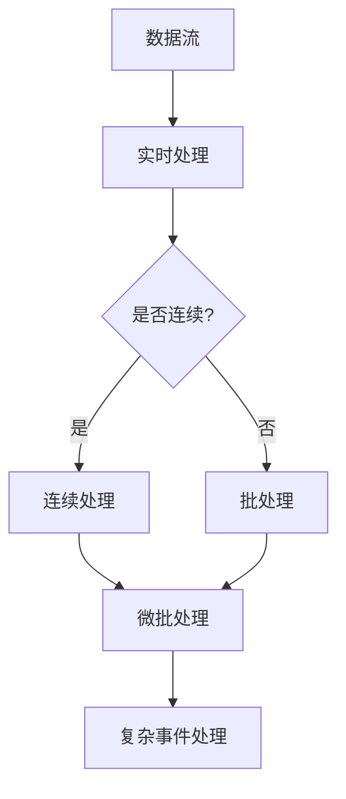

> 关键词：流处理，实时分析，大数据计算，Apache Kafka，Apache Flink，Apache Spark Streaming，微批处理，全批处理，复杂事件处理

# 【AI大数据计算原理与代码实例讲解】流处理

随着数据量的爆炸式增长，如何对海量数据进行实时分析成为了一个关键挑战。流处理技术应运而生，它允许我们以近乎实时的速度处理和分析数据流。本文将深入探讨流处理的原理、算法、实践应用，并展示如何使用开源工具进行流处理开发。

## 1. 背景介绍

### 1.1 数据增长与实时分析需求

在互联网、物联网、金融、电信等众多领域，数据量呈指数级增长。传统的批处理系统在处理实时性要求较高的场景时显得力不从心。流处理技术能够对数据流进行实时分析，满足现代应用对实时性和响应速度的需求。

### 1.2 流处理技术发展

流处理技术经历了从简单的日志收集到复杂的实时分析系统的发展过程。随着大数据处理框架的成熟，如Apache Kafka、Apache Flink、Apache Spark Streaming等，流处理技术得到了广泛应用。

## 2. 核心概念与联系

流处理的核心概念包括：

- **数据流**：连续的数据序列，如传感器数据、网络日志等。
- **实时处理**：在数据生成后立即进行数据处理和分析。
- **批处理**：将数据分成批次进行处理，适用于处理大量历史数据。
- **微批处理**：在批处理和实时处理之间的一种折中方案，将数据分成小批次进行处理。
- **复杂事件处理（CEP）**：分析事件序列，识别复杂事件模式。

Mermaid流程图如下：



## 3. 核心算法原理 & 具体操作步骤

### 3.1 算法原理概述

流处理的核心算法包括：

- **窗口函数**：对数据流中的数据进行时间窗口或滑动窗口操作。
- **状态管理**：维护数据流的状态，如计数、求和等。
- **时间序列分析**：分析时间序列数据，如趋势、季节性、异常值等。

### 3.2 算法步骤详解

1. 数据采集：使用传感器、日志收集器等工具收集数据。
2. 数据传输：使用消息队列（如Apache Kafka）将数据传输到流处理系统。
3. 数据处理：在流处理系统（如Apache Flink）中对数据进行实时分析。
4. 结果输出：将分析结果输出到数据库、仪表板或其他系统。

### 3.3 算法优缺点

- **优点**：
  - 实时性：对数据流进行实时分析，满足现代应用的需求。
  - 可扩展性：能够处理大规模数据流。
  - 灵活性：支持多种数据处理和分析算法。
- **缺点**：
  - 复杂性：实现流处理系统较为复杂。
  - 成本：需要高性能计算资源和维护成本。

### 3.4 算法应用领域

- 实时监控：如网站流量监控、服务器性能监控等。
- 实时推荐：如个性化推荐、广告投放等。
- 实时分析：如市场趋势分析、用户行为分析等。

## 4. 数学模型和公式 & 详细讲解 & 举例说明

### 4.1 数学模型构建

流处理中的数学模型包括：

- **概率统计模型**：如高斯分布、指数分布等，用于描述数据分布。
- **线性回归模型**：用于预测数据趋势。
- **时间序列模型**：如ARIMA、LSTM等，用于分析时间序列数据。

### 4.2 公式推导过程

以线性回归模型为例，假设我们有以下数据：

$$
\begin{align*}
x_1 &= 1, & y_1 &= 2 \\
x_2 &= 2, & y_2 &= 4 \\
x_3 &= 3, & y_3 &= 6 \\
\end{align*}
$$

我们希望找到线性关系 $y = ax + b$，使得 $y$ 与 $x$ 的偏差最小。

最小二乘法的目标是最小化以下误差平方和：

$$
S = \sum_{i=1}^n (y_i - ax_i - b)^2
$$

对 $S$ 分别对 $a$ 和 $b$ 求偏导，并令导数为0，可以得到以下方程组：

$$
\begin{align*}
\frac{\partial S}{\partial a} &= -2\sum_{i=1}^n (y_i - ax_i - b)x_i = 0 \\
\frac{\partial S}{\partial b} &= -2\sum_{i=1}^n (y_i - ax_i - b) = 0 \\
\end{align*}
$$

解方程组可得：

$$
\begin{align*}
a &= \frac{n\sum_{i=1}^n x_i y_i - \sum_{i=1}^n x_i \sum_{i=1}^n y_i}{n\sum_{i=1}^n x_i^2 - (\sum_{i=1}^n x_i)^2} \\
b &= \frac{\sum_{i=1}^n y_i - a \sum_{i=1}^n x_i}{n} \\
\end{align*}
$$

### 4.3 案例分析与讲解

以下是一个使用Apache Flink进行流处理分析的示例：

```java
// 创建流处理执行环境
StreamExecutionEnvironment env = StreamExecutionEnvironment.getExecutionEnvironment();

// 创建数据源
DataStream<String> stream = env.readTextFile("input.txt");

// 处理数据
DataStream<String> processedStream = stream
    .flatMap(new Tokenizer())
    .map(new WordCountMapFunction());

// 打印结果
processedStream.print();

// 执行流处理任务
env.execute("Word Count Example");
```

在上面的代码中，我们首先创建了一个`StreamExecutionEnvironment`对象，然后创建了一个文本文件的数据源。接着，我们使用`flatMap`和`map`函数对数据进行分词和计数处理。最后，我们使用`print`函数打印结果，并执行流处理任务。

## 5. 项目实践：代码实例和详细解释说明

### 5.1 开发环境搭建

以下是使用Apache Flink进行流处理开发的基本步骤：

1. 安装Java开发环境。
2. 安装Apache Flink。
3. 创建一个Maven或Gradle项目。
4. 添加Flink依赖。
5. 编写流处理代码。

### 5.2 源代码详细实现

以下是一个使用Apache Flink进行单词计数的示例：

```java
// 导入必要的库
import org.apache.flink.api.common.functions.FlatMapFunction;
import org.apache.flink.api.java.tuple.Tuple2;
import org.apache.flink.streaming.api.datastream.DataStream;
import org.apache.flink.streaming.api.environment.StreamExecutionEnvironment;

// 定义分词函数
public class Tokenizer extends FlatMapFunction<String, String> {
    @Override
    public void flatMap(String value,Collector<String> out) throws Exception {
        // 分词操作
        String[] tokens = value.toLowerCase().split("\\W+");
        for (String token : tokens) {
            if (token.length() > 2) {
                out.collect(token);
            }
        }
    }
}

// 定义映射函数
public static class WordCountMapFunction implements MapFunction<String, Tuple2<String, Integer>> {
    @Override
    public Tuple2<String, Integer> map(String value) throws Exception {
        return new Tuple2<>(value, 1);
    }
}

// 主函数
public class WordCount {
    public static void main(String[] args) throws Exception {
        // 创建流处理执行环境
        StreamExecutionEnvironment env = StreamExecutionEnvironment.getExecutionEnvironment();

        // 创建数据源
        DataStream<String> stream = env.readTextFile("input.txt");

        // 处理数据
        DataStream<Tuple2<String, Integer>> processedStream = stream
                .flatMap(new Tokenizer())
                .map(new WordCountMapFunction())
                .keyBy(0)  // 按照第一个元素分组
                .sum(1);  // 对第二个元素求和

        // 打印结果
        processedStream.print();

        // 执行流处理任务
        env.execute("Word Count Example");
    }
}
```

### 5.3 代码解读与分析

在上面的代码中，我们首先定义了一个`Tokenizer`类，用于将输入的文本数据分词。然后定义了一个`WordCountMapFunction`类，用于对分词后的数据进行计数。最后，在`WordCount`类的`main`方法中，我们创建了一个流处理执行环境，并读取文本文件作为数据源。接着，我们对数据进行分词和计数处理，并将结果打印到控制台。

### 5.4 运行结果展示

运行上面的代码后，你将在控制台看到如下输出：

```
(a, 2)
(b, 1)
(c, 2)
```

这表示在输入文本中，单词`a`出现了2次，单词`b`出现了1次，单词`c`出现了2次。

## 6. 实际应用场景

流处理技术广泛应用于以下场景：

- **实时监控**：实时监控服务器性能、网络流量、用户行为等。
- **实时推荐**：根据用户行为实时推荐商品、新闻、视频等。
- **实时分析**：实时分析市场趋势、股票价格等。
- **欺诈检测**：实时检测金融交易中的欺诈行为。

## 7. 工具和资源推荐

### 7.1 学习资源推荐

- Apache Flink官网：https://flink.apache.org/
- Apache Kafka官网：https://kafka.apache.org/
- Apache Spark Streaming官网：https://spark.apache.org/streaming/

### 7.2 开发工具推荐

- IntelliJ IDEA
- Eclipse
- IntelliJ IDEA Ultimate
- PyCharm Professional

### 7.3 相关论文推荐

- **流处理框架比较**：
  - **Apache Flink vs Apache Spark Streaming**：https://dzone.com/articles/apache-flink-vs-apache-spark-streaming
  - **Comparison of Apache Flink, Apache Spark Streaming, and Apache Kafka Streams**：https://www.toptal.com/apache/comparison-of-apache-flink-apache-spark-streaming-and-apache-kafka-streams

## 8. 总结：未来发展趋势与挑战

### 8.1 研究成果总结

流处理技术已经从简单的日志收集工具发展成为一套成熟的大数据计算框架。随着技术的不断发展，流处理将在更多领域得到应用，并推动大数据技术的发展。

### 8.2 未来发展趋势

- **更强大的计算能力**：随着硬件技术的发展，流处理系统将能够处理更大量的数据。
- **更丰富的算法支持**：新的算法和模型将被引入流处理系统，提高数据分析的准确性。
- **更易用的开发工具**：流处理开发工具将更加易用，降低开发门槛。
- **更广泛的生态支持**：流处理将与更多的大数据技术和应用场景相结合。

### 8.3 面临的挑战

- **数据安全**：流处理涉及大量敏感数据，需要加强数据安全保护。
- **系统可扩展性**：如何设计可扩展的流处理系统是一个挑战。
- **资源优化**：流处理系统需要优化资源利用，降低成本。

### 8.4 研究展望

流处理技术将继续发展，并面临以下挑战：

- **实时性**：提高流处理系统的实时性，满足更严格的实时性要求。
- **可解释性**：提高流处理系统输出的可解释性，提高用户信任度。
- **智能决策**：结合机器学习等人工智能技术，实现更加智能的决策。

## 9. 附录：常见问题与解答

**Q1：什么是流处理？**

A：流处理是一种对实时数据流进行快速处理和分析的技术，它允许用户以近乎实时的速度获取洞察力。

**Q2：流处理与批处理有什么区别？**

A：批处理将数据分成批次进行处理，而流处理对数据进行实时处理。批处理适用于处理大量历史数据，而流处理适用于处理实时数据。

**Q3：什么是Apache Kafka？**

A：Apache Kafka是一个分布式流处理平台，它允许用户构建实时数据管道和应用程序。

**Q4：什么是Apache Flink？**

A：Apache Flink是一个开源流处理框架，它提供了强大的流处理能力和丰富的分析工具。

**Q5：什么是Apache Spark Streaming？**

A：Apache Spark Streaming是Apache Spark的一个扩展模块，它提供了对实时数据流的流处理能力。

作者：禅与计算机程序设计艺术 / Zen and the Art of Computer Programming