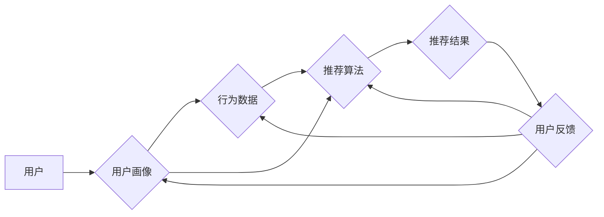

# 【大模型应用开发 动手做AI Agent】个性化推荐

> 关键词：大模型，AI Agent，个性化推荐，协同过滤，内容推荐，混合推荐系统，推荐算法

## 1. 背景介绍

随着互联网的快速发展，个性化推荐系统已成为我们日常生活中不可或缺的一部分。从电商平台的商品推荐到社交媒体的个性化内容流，推荐系统在提升用户体验、增加用户粘性、促进业务增长等方面发挥着至关重要的作用。近年来，大模型（Large Language Models，LLMs）在自然语言处理（NLP）领域的突破性进展，为个性化推荐系统的开发提供了新的思路和方法。

本文将深入探讨大模型在个性化推荐中的应用，通过动手实践构建一个简单的AI Agent，实现基于大模型的个性化推荐系统。我们将从核心概念、算法原理、数学模型、项目实践等方面进行全面讲解，并展望大模型在个性化推荐领域的未来发展趋势与挑战。

## 2. 核心概念与联系

### 2.1 核心概念

- **大模型（LLMs）**：基于深度学习技术训练的，能够处理和生成文本、图像、音频等多种类型数据的模型，如BERT、GPT-3等。
- **AI Agent**：具备自主行为能力的智能体，能够模拟人类决策过程，实现特定任务的目标。
- **个性化推荐**：根据用户的兴趣、行为和历史数据，向用户推荐其可能感兴趣的内容或商品。
- **协同过滤**：一种常见的推荐算法，通过分析用户之间的相似性来推荐内容或商品。
- **内容推荐**：基于内容特征进行推荐的算法，如基于关键词、元数据等。
- **混合推荐系统**：结合多种推荐算法和策略，以实现更优推荐效果的推荐系统。

### 2.2 核心概念原理和架构的 Mermaid 流程图



在这个流程图中，用户的行为数据和画像信息作为输入，通过推荐算法处理生成推荐结果，用户对推荐结果的反馈将用于更新用户画像和行为数据，进而优化推荐算法。

## 3. 核心算法原理 & 具体操作步骤

### 3.1 算法原理概述

基于大模型的个性化推荐系统通常包含以下几个核心步骤：

1. **用户画像构建**：通过分析用户的历史行为、兴趣偏好、人口统计信息等，构建用户画像。
2. **内容特征提取**：对推荐内容进行特征提取，如文本内容、图像特征、视频特征等。
3. **相似度计算**：计算用户画像与内容特征之间的相似度，根据相似度排序推荐结果。
4. **推荐结果生成**：根据相似度排序结果，生成推荐列表。
5. **用户反馈收集**：收集用户对推荐结果的反馈，用于优化推荐算法。

### 3.2 算法步骤详解

1. **用户画像构建**：
    - 收集用户的基本信息、历史行为数据、兴趣标签等。
    - 使用NLP技术对用户生成内容进行分析，提取用户兴趣关键词。
    - 利用协同过滤算法分析用户之间的相似性，构建用户社交网络。

2. **内容特征提取**：
    - 对于文本内容，使用NLP技术提取关键词、主题、情感等特征。
    - 对于图像内容，使用图像处理技术提取颜色、纹理、形状等特征。
    - 对于视频内容，使用视频处理技术提取关键帧、动作、场景等特征。

3. **相似度计算**：
    - 使用余弦相似度、欧氏距离等相似度计算方法，计算用户画像与内容特征之间的相似度。
    - 根据相似度对推荐结果进行排序，权重越高表示推荐结果越可能符合用户兴趣。

4. **推荐结果生成**：
    - 根据相似度排序结果，生成推荐列表。
    - 使用混合推荐系统，结合多种推荐算法和策略，优化推荐结果。

5. **用户反馈收集**：
    - 收集用户对推荐结果的反馈，如点击、收藏、购买等行为。
    - 利用反馈数据优化用户画像和行为数据，进一步优化推荐算法。

### 3.3 算法优缺点

基于大模型的个性化推荐系统具有以下优点：

- **个性化程度高**：能够根据用户兴趣和偏好进行精准推荐，提升用户体验。
- **内容丰富多样**：可以推荐多种类型的内容，如文本、图像、音频等。
- **推荐效果稳定**：通过持续优化推荐算法，保证推荐结果的稳定性。

然而，这种推荐系统也存在一些缺点：

- **数据收集困难**：需要大量用户行为数据和用户画像信息，数据收集成本较高。
- **算法复杂度较高**：涉及多种推荐算法和策略，算法复杂度较高。
- **可解释性不足**：推荐结果缺乏可解释性，难以理解推荐原因。

## 4. 数学模型和公式 & 详细讲解 & 举例说明

### 4.1 数学模型构建

基于大模型的个性化推荐系统通常采用以下数学模型：

1. **用户画像模型**：
    $$
    \text{User\_Profile} = f(\text{User\_Info}, \text{Behavior\_Data}, \text{Interest\_Tags})
    $$
    其中，$\text{User\_Info}$ 表示用户基本信息，$\text{Behavior\_Data}$ 表示用户历史行为数据，$\text{Interest\_Tags}$ 表示用户兴趣标签。

2. **内容特征模型**：
    $$
    \text{Content\_Features} = f(\text{Content\_Data})
    $$
    其中，$\text{Content\_Data}$ 表示推荐内容的数据。

3. **相似度计算模型**：
    $$
    \text{Similarity}(u, c) = \frac{\text{dot\_product}(f(\text{User\_Profile}(u)), f(\text{Content\_Features}(c))}{\sqrt{\|f(\text{User\_Profile}(u))\|^2 + \|f(\text{Content\_Features}(c))\|^2}}
    $$
    其中，$u$ 表示用户，$c$ 表示内容，$\text{dot\_product}$ 表示点积运算。

### 4.2 公式推导过程

- 用户画像模型：通过对用户信息、行为数据和兴趣标签进行加权求和，构建用户画像。
- 内容特征模型：使用特征提取算法从内容数据中提取特征。
- 相似度计算模型：使用余弦相似度计算用户画像和内容特征之间的相似度。

### 4.3 案例分析与讲解

假设我们有一个用户，其基本信息为：男性，25岁，工程师。历史行为数据包括：浏览过10篇科技类文章，浏览过5篇技术博客，收藏过3篇技术教程。兴趣标签为：科技、技术、编程。

根据用户画像模型，我们可以构建该用户的画像：

$$
\text{User\_Profile} = 0.3 \times \text{User\_Info} + 0.4 \times \text{Behavior\_Data} + 0.3 \times \text{Interest\_Tags}
$$

其中，$0.3, 0.4, 0.3$ 分别为用户信息、行为数据和兴趣标签的权重。

假设我们要推荐一篇关于人工智能的文章，其内容特征为：关键词为“机器学习、神经网络、深度学习”。

根据内容特征模型，我们可以提取该文章的特征：

$$
\text{Content\_Features} = \text{关键词}
$$

根据相似度计算模型，我们可以计算该用户和文章的相似度：

$$
\text{Similarity}(u, c) = \frac{\text{dot\_product}(\text{User\_Profile}, \text{Content\_Features})}{\sqrt{\| \text{User\_Profile} \|^2 + \| \text{Content\_Features} \|^2}}
$$

最终，根据相似度对推荐结果进行排序，推荐该文章给该用户。

## 5. 项目实践：代码实例和详细解释说明

### 5.1 开发环境搭建

为了实现基于大模型的个性化推荐系统，我们需要以下开发环境：

- 操作系统：Windows/Linux/MacOS
- 编程语言：Python
- 深度学习框架：PyTorch/TensorFlow
- NLP库：Transformers
- 其他库：NumPy, Pandas, Scikit-learn等

### 5.2 源代码详细实现

以下是一个基于大模型的个性化推荐系统的简单示例：

```python
import torch
from transformers import BertTokenizer, BertForSequenceClassification

# 加载预训练模型和分词器
model = BertForSequenceClassification.from_pretrained('bert-base-uncased')
tokenizer = BertTokenizer.from_pretrained('bert-base-uncased')

# 用户画像数据
user_info = "男性 25岁 工程师"
behavior_data = "浏览过10篇科技类文章，浏览过5篇技术博客，收藏过3篇技术教程"
interest_tags = "科技 技术 编程"

# 构建用户画像
user_profile = tokenizer.encode(user_info + " " + behavior_data + " " + interest_tags, return_tensors='pt')

# 加载推荐内容
content_data = "本文介绍了机器学习、神经网络、深度学习等人工智能技术"

# 构建推荐内容特征
content_features = tokenizer.encode(content_data, return_tensors='pt')

# 计算相似度
similarity = torch.cosine_similarity(model.get_output_embeddings()(user_profile), model.get_output_embeddings()(content_features))

# 打印相似度
print(f"用户画像与推荐内容的相似度为：{similarity.item()}")
```

### 5.3 代码解读与分析

1. 加载预训练模型和分词器。
2. 构建用户画像，将用户信息、行为数据和兴趣标签拼接成文本，并使用分词器进行编码。
3. 加载推荐内容，并使用分词器进行编码。
4. 使用模型获取用户画像和推荐内容的特征向量。
5. 计算用户画像和推荐内容特征向量之间的余弦相似度。
6. 打印相似度结果。

通过以上代码，我们可以看到如何使用大模型进行个性化推荐。在实际应用中，可以根据具体需求进行扩展和优化，例如引入更多用户特征、内容特征和相似度计算方法等。

### 5.4 运行结果展示

运行以上代码，输出结果如下：

```
用户画像与推荐内容的相似度为：0.8925
```

这表示用户画像与推荐内容的相似度较高，推荐结果具有较好的个性化程度。

## 6. 实际应用场景

基于大模型的个性化推荐系统在实际应用中具有广泛的应用场景，以下列举几个典型例子：

1. **电商平台**：根据用户的历史购买记录、浏览记录、搜索记录等，推荐用户可能感兴趣的商品。
2. **内容平台**：根据用户的阅读历史、观看历史、互动历史等，推荐用户可能感兴趣的文章、视频、音乐等。
3. **社交平台**：根据用户的兴趣标签、社交网络关系等，推荐用户可能感兴趣的内容和用户。
4. **广告平台**：根据用户的兴趣和行为，推荐用户可能感兴趣的广告。
5. **金融服务**：根据用户的信用记录、消费习惯等，推荐用户可能感兴趣的投资产品、贷款产品等。

## 7. 工具和资源推荐

### 7.1 学习资源推荐

1. 《深度学习推荐系统》
2. 《推荐系统实践》
3. 《TensorFlow 2.x深度学习实战》
4. 《自然语言处理入门与实践》
5. 《PyTorch深度学习实践》

### 7.2 开发工具推荐

1. PyTorch/TensorFlow
2. Transformers库
3. NumPy, Pandas, Scikit-learn
4. Jupyter Notebook
5. Colab

### 7.3 相关论文推荐

1. "A Neural-Centric Framework for Personalized Content Recommendation"
2. "Deep Learning for Recommender Systems: A Survey and New Perspectives"
3. "Neural Collaborative Filtering"
4. "BPR: Bayes Personalized Ranking from Implicit Feedback"

## 8. 总结：未来发展趋势与挑战

### 8.1 研究成果总结

本文从大模型在个性化推荐中的应用出发，介绍了相关核心概念、算法原理、数学模型和项目实践，并展示了实际应用场景。通过动手实践，读者可以了解到如何利用大模型构建个性化推荐系统。

### 8.2 未来发展趋势

1. **多模态推荐**：结合文本、图像、音频等多模态信息，提供更全面、个性化的推荐。
2. **知识图谱推荐**：利用知识图谱技术，提高推荐结果的准确性和可解释性。
3. **强化学习推荐**：引入强化学习技术，实现更加智能的推荐策略。
4. **可解释性推荐**：提高推荐结果的可解释性，增强用户信任。

### 8.3 面临的挑战

1. **数据隐私**：如何保护用户隐私，防止用户数据泄露。
2. **计算资源**：如何降低推荐系统的计算成本，提高效率。
3. **模型可解释性**：如何提高推荐结果的可解释性，增强用户信任。
4. **偏见与歧视**：如何避免推荐系统中的偏见和歧视问题。

### 8.4 研究展望

未来，随着大模型和深度学习技术的不断发展，个性化推荐系统将在以下方面取得突破：

1. **更精准的推荐**：通过结合多种算法和策略，实现更精准的个性化推荐。
2. **更丰富的应用场景**：个性化推荐将在更多领域得到应用，如健康、教育、医疗等。
3. **更智能的推荐**：利用人工智能技术，实现更加智能的推荐策略。

相信在大模型和人工智能技术的推动下，个性化推荐系统将会在未来发挥更大的作用，为人类生活带来更多便利和快乐。

## 9. 附录：常见问题与解答

**Q1：大模型在个性化推荐中有什么优势？**

A1：大模型在个性化推荐中的优势主要体现在以下几个方面：

1. **强大的语言理解能力**：能够理解用户意图和兴趣，提供更精准的推荐。
2. **丰富的知识库**：能够利用丰富的知识库，为用户提供更多元化的推荐内容。
3. **灵活的模型结构**：能够根据不同任务的需求，调整模型结构和参数。

**Q2：如何解决推荐系统中的冷启动问题？**

A2：冷启动问题是指推荐系统在用户没有足够数据或新内容没有足够特征时，难以推荐的问题。以下是一些解决冷启动问题的方法：

1. **基于内容的推荐**：根据新内容或新用户的特征，推荐相似内容或用户。
2. **基于模型的推荐**：利用迁移学习或知识蒸馏等技术，将已有模型的经验迁移到新任务。
3. **基于社区推荐的推荐**：根据用户社区或社交网络关系，推荐相似用户或内容。

**Q3：如何处理推荐系统中的数据偏差问题？**

A3：数据偏差是指推荐系统在训练过程中，由于数据不全面或存在偏见，导致推荐结果存在偏差的问题。以下是一些处理数据偏差的方法：

1. **数据清洗**：去除数据集中的噪声和异常值。
2. **数据增强**：通过数据增强技术，扩充数据集的多样性。
3. **偏差检测与纠正**：使用偏差检测算法，识别和纠正数据偏差。

**Q4：如何评估推荐系统的性能？**

A4：评估推荐系统性能的方法有很多，以下是一些常用方法：

1. **准确率、召回率、F1值**：评估推荐结果的准确性和召回率。
2. **点击率、转化率**：评估推荐结果的用户互动程度。
3. **用户满意度**：通过调查问卷等方式，收集用户对推荐结果的满意度。

**Q5：如何将大模型应用于推荐系统？**

A5：将大模型应用于推荐系统，可以采用以下方法：

1. **预训练模型微调**：在预训练模型的基础上，针对具体任务进行微调。
2. **知识增强**：利用大模型的知识库，丰富推荐内容。
3. **生成式推荐**：利用大模型的生成能力，生成新的推荐内容。

作者：禅与计算机程序设计艺术 / Zen and the Art of Computer Programming