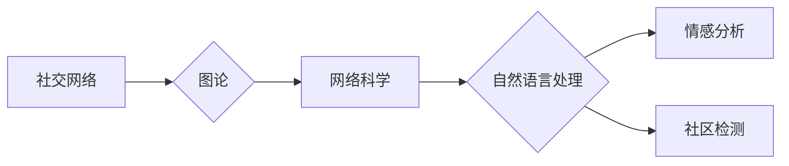

# 一切皆是映射：AI在社交网络分析中的作用

> 关键词：社交网络分析，AI，图论，网络科学，自然语言处理，情感分析，社区检测

## 1. 背景介绍

随着互联网的普及和社交媒体的兴起，社交网络已成为人们日常生活中不可或缺的一部分。社交网络分析（Social Network Analysis, SNA）作为一门跨学科的研究领域，旨在通过对社交网络结构和关系的分析，揭示社会现象背后的规律和机制。近年来，随着人工智能（Artificial Intelligence, AI）技术的快速发展，AI在社交网络分析中的应用变得越来越广泛，为研究者提供了新的视角和方法。

本文将探讨AI在社交网络分析中的作用，从核心概念、算法原理、应用实例到未来展望，全面阐述AI如何帮助我们更好地理解社交网络。

## 2. 核心概念与联系

### 2.1 核心概念

**社交网络**：由个体（节点）及其相互之间的关系（边）构成的复杂网络。社交网络可以是现实世界中的朋友网络、学术合作网络，也可以是虚拟世界中的微博、微信等社交平台。

**图论**：研究图及其性质的理论，是社交网络分析的基础。图论中的概念如节点、边、度、路径、连通性等，被广泛应用于描述和分析社交网络。

**网络科学**：研究复杂网络的结构、功能、演化及其在现实世界中的应用的科学。网络科学为理解社交网络的动态变化提供了理论框架。

**自然语言处理（NLP）**：研究计算机如何理解和生成人类语言的技术。NLP在社交网络分析中用于提取和处理用户生成的内容，如文本、图片、视频等。

**情感分析**：分析文本数据中的情感倾向，判断用户对某个主题、产品或事件的态度。情感分析可以帮助我们了解社交网络中的舆论动态。

**社区检测**：在社交网络中识别具有相似属性或关系的节点群体。社区检测有助于理解社交网络的内部结构，揭示不同群体之间的关系。

### 2.2 Mermaid 流程图

以下为社交网络分析中涉及的几个核心概念及其关系的 Mermaid 流程图：



## 3. 核心算法原理 & 具体操作步骤

### 3.1 算法原理概述

AI在社交网络分析中主要涉及以下算法：

**图嵌入算法**：将社交网络中的节点和边映射到低维空间，以便进行更高效的分析和计算。常见的图嵌入算法包括DeepWalk、Node2Vec、GCN等。

**社区检测算法**：在社交网络中识别具有相似属性或关系的节点群体。常见的社区检测算法包括Girvan-Newman算法、Label Propagation算法、Louvain算法等。

**情感分析算法**：分析文本数据中的情感倾向，判断用户对某个主题、产品或事件的态度。常见的情感分析算法包括基于规则的方法、基于机器学习的方法和基于深度学习的方法。

**链接预测算法**：预测社交网络中节点之间未来可能建立联系的概率。常见的链接预测算法包括基于相似度的方法、基于机器学习的方法和基于深度学习的方法。

### 3.2 算法步骤详解

以下是社交网络分析中几个常见算法的具体操作步骤：

**3.2.1 图嵌入算法**

1. 选择合适的图嵌入算法，如DeepWalk、Node2Vec等。
2. 对社交网络进行预处理，包括去除孤立节点、清洗数据等。
3. 随机游走生成图嵌入的输入序列。
4. 使用预训练模型对输入序列进行嵌入。
5. 将节点映射到低维空间，得到图嵌入结果。

**3.2.2 社区检测算法**

1. 选择合适的社区检测算法，如Girvan-Newman算法、Label Propagation算法等。
2. 对社交网络进行预处理，包括去除孤立节点、清洗数据等。
3. 应用所选算法对社交网络进行社区检测。
4. 对检测结果进行分析和评估。

**3.2.3 情感分析算法**

1. 选择合适的情感分析算法，如基于规则的方法、基于机器学习的方法和基于深度学习的方法。
2. 对文本数据进行预处理，包括分词、去停用词等。
3. 使用预训练模型对文本数据进行情感分析。
4. 分析情感分析结果，得出用户对主题、产品或事件的态度。

**3.2.4 链接预测算法**

1. 选择合适的链接预测算法，如基于相似度的方法、基于机器学习的方法和基于深度学习的方法。
2. 对社交网络进行预处理，包括去除孤立节点、清洗数据等。
3. 使用预训练模型对节点进行特征提取。
4. 训练链接预测模型，预测节点之间未来可能建立联系的概率。

### 3.3 算法优缺点

**3.3.1 图嵌入算法**

**优点**：
- 将高维的社交网络数据映射到低维空间，降低计算复杂度。
- 可以用于节点相似度计算、链接预测等任务。

**缺点**：
- 对图结构和节点类型敏感，不同算法对结果影响较大。
- 难以处理动态变化的社交网络。

**3.3.2 社区检测算法**

**优点**：
- 可以揭示社交网络中的结构洞和社区结构。
- 有助于理解社交网络的传播机制。

**缺点**：
- 结果可能受到参数选择的影响。
- 对于大规模社交网络，计算复杂度较高。

**3.3.3 情感分析算法**

**优点**：
- 可以了解社交网络中的舆论动态。
- 有助于识别潜在的危机和风险。

**缺点**：
- 对文本数据质量要求较高。
- 难以准确识别复杂的情感态度。

**3.3.4 链接预测算法**

**优点**：
- 可以预测社交网络中节点之间未来可能建立联系的概率。
- 有助于了解社交网络的演化趋势。

**缺点**：
- 对图结构和节点类型敏感。
- 预测精度受限于特征提取和模型选择。

### 3.4 算法应用领域

AI在社交网络分析中的应用领域包括：

- 舆情监测
- 网络传播分析
- 社会影响力分析
- 产品推荐
- 人才招聘
- 市场营销

## 4. 数学模型和公式 & 详细讲解 & 举例说明

### 4.1 数学模型构建

以下是一些在社交网络分析中常用的数学模型：

**4.1.1 图嵌入模型**

假设社交网络为G=(V,E)，其中V为节点集合，E为边集合。图嵌入模型将节点映射到低维空间，如R^d。

$$
X = F(W \cdot X + b)
$$

其中X为节点嵌入向量，W为权重矩阵，b为偏置向量，F为激活函数。

**4.1.2 社区检测模型**

社区检测模型旨在将节点划分为多个社区，使得社区内的节点关系紧密，社区间的节点关系疏远。

$$
\min_{C_1, C_2, ..., C_k} \sum_{i \in C_j} \sum_{j \in C_j} d(i,j)
$$

其中C_j为第j个社区，d(i,j)为节点i和节点j之间的距离。

**4.1.3 情感分析模型**

情感分析模型旨在分析文本数据中的情感倾向，判断用户对某个主题、产品或事件的态度。

$$
P(y|x) = \frac{P(x|y) \cdot P(y)}{P(x)}
$$

其中P(y|x)为给定文本x时，用户持有情感y的概率。

### 4.2 公式推导过程

以下是对上述几个数学模型的推导过程：

**4.2.1 图嵌入模型**

假设社交网络为G=(V,E)，其中V为节点集合，E为边集合。图嵌入模型将节点映射到低维空间，如R^d。

首先，定义节点i和节点j之间的相似度为：

$$
s(i,j) = \frac{|\Gamma_i \cap \Gamma_j|}{|\Gamma_i \cup \Gamma_j|}
$$

其中$\Gamma_i$为节点i的邻居集合。

然后，利用节点相似度计算节点嵌入向量：

$$
X_i = \sum_{j \in \Gamma_i} s(i,j) \cdot X_j
$$

其中X_i和X_j分别为节点i和节点j的嵌入向量。

**4.2.2 社区检测模型**

社区检测模型旨在将节点划分为多个社区，使得社区内的节点关系紧密，社区间的节点关系疏远。

首先，定义社区划分的代价函数：

$$
C(C) = \sum_{i \in C_j} \sum_{j \in C_j} d(i,j)
$$

其中C为社区划分，d(i,j)为节点i和节点j之间的距离。

然后，使用优化算法（如Girvan-Newman算法）寻找最小代价的社区划分。

**4.2.3 情感分析模型**

情感分析模型旨在分析文本数据中的情感倾向，判断用户对某个主题、产品或事件的态度。

首先，定义情感倾向分布：

$$
P(y) = \sum_{x \in X} P(x|y) \cdot P(y)
$$

其中X为所有文本数据，P(x|y)为给定文本x时，用户持有情感y的概率。

然后，利用贝叶斯公式：

$$
P(y|x) = \frac{P(x|y) \cdot P(y)}{P(x)}
$$

计算给定文本x时，用户持有情感y的概率。

### 4.3 案例分析与讲解

以下是一些社交网络分析的实际案例：

**4.3.1 舆情监测**

假设我们要对某款新手机的舆论进行监测。首先，收集该手机的社交媒体评论数据，然后使用情感分析模型对评论进行情感分析。如果大部分评论都表达负面情感，则可能存在产品质量问题，需要及时采取措施。

**4.3.2 网络传播分析**

假设我们要分析某个事件在社交网络中的传播过程。首先，构建事件相关的社交网络，然后使用图嵌入算法将节点映射到低维空间。接着，使用链接预测算法预测事件可能传播到的节点，从而了解事件的潜在传播路径。

**4.3.3 社会影响力分析**

假设我们要分析某位公众人物在社会网络中的影响力。首先，构建公众人物与其粉丝之间的社交网络，然后使用社区检测算法识别粉丝群体，从而了解公众人物在不同粉丝群体中的影响力。

## 5. 项目实践：代码实例和详细解释说明

### 5.1 开发环境搭建

以下是使用Python进行社交网络分析的项目实践所需的环境搭建步骤：

1. 安装Anaconda：从官网下载并安装Anaconda，用于创建独立的Python环境。
2. 创建并激活虚拟环境：
```bash
conda create -n sna-env python=3.8
conda activate sna-env
```
3. 安装必要的库：
```bash
conda install numpy scipy networkx matplotlib scikit-learn
```
4. 安装Python第三方库：
```bash
pip install pandas numpy scikit-learn matplotlib seaborn
```

### 5.2 源代码详细实现

以下是一个简单的社交网络分析项目实例：

```python
import networkx as nx
import matplotlib.pyplot as plt
import seaborn as sns

# 构建社交网络
G = nx.Graph()
G.add_edges_from([(1, 2), (1, 3), (2, 4), (3, 4), (4, 5)])

# 绘制社交网络
pos = nx.spring_layout(G)
nx.draw(G, pos, with_labels=True)

# 社区检测
community = nx.algorithms.community.girvan_newman(G)
print("社区划分结果：", community)

# 绘制社区
nx.draw_networkx_edge_labels(G, pos, edge_labels=community)

plt.show()
```

### 5.3 代码解读与分析

以上代码首先使用networkx库构建了一个简单的社交网络，其中包含5个节点和4条边。然后，使用matplotlib和seaborn库绘制了社交网络图。接着，使用Girvan-Newman算法进行社区检测，并将社区检测结果打印出来。最后，使用networkx再次绘制社交网络图，并标注每个社区的颜色。

通过以上代码，我们可以直观地看到社交网络的结构和社区划分结果。

### 5.4 运行结果展示

运行以上代码后，将会得到一个社交网络图和社区划分结果。图中的节点颜色代表不同的社区，边表示节点之间的连接关系。

## 6. 实际应用场景

### 6.1 舆情监测

舆情监测是AI在社交网络分析中最重要的应用场景之一。通过对社交媒体平台上的文本、图片、视频等内容进行分析，可以了解公众对某个事件、产品或品牌的态度和看法。舆情监测可以帮助企业及时了解市场动态，制定合理的营销策略；可以帮助政府了解公众意见，及时发现和解决问题。

### 6.2 网络传播分析

网络传播分析可以帮助我们了解信息在社交网络中的传播过程和规律。例如，通过分析某个事件在社交网络中的传播路径，可以预测事件的影响范围和传播速度。此外，网络传播分析还可以用于识别潜在的虚假信息传播网络，防止虚假信息的扩散。

### 6.3 社会影响力分析

社会影响力分析可以帮助我们了解个人或组织在社会网络中的影响力。例如，通过分析某个公众人物在社交网络中的粉丝群体，可以了解其影响力的大小和范围。此外，社会影响力分析还可以用于识别有影响力的意见领袖，为企业或政府提供决策参考。

### 6.4 未来应用展望

随着AI技术的不断发展，AI在社交网络分析中的应用将越来越广泛，以下是一些未来可能的应用场景：

- 智能推荐系统：根据用户的社交网络关系和兴趣，为用户提供个性化的内容推荐。
- 人才招聘：通过分析候选人的社交网络，评估其能力和潜力。
- 健康监测：通过分析用户在社交媒体上的健康信息，及时发现和预防疾病。
- 智能交通：通过分析交通流量数据，优化交通路线，提高交通效率。

## 7. 工具和资源推荐

### 7.1 学习资源推荐

以下是一些关于社交网络分析和AI的学习资源：

- 《社交网络分析：原理、方法与应用》
- 《图论及其应用》
- 《自然语言处理入门》
- 《深度学习与人工智能》
- 《社交网络分析工具箱》

### 7.2 开发工具推荐

以下是一些用于社交网络分析和AI开发的工具：

- Python：Python是一种易于学习和使用的编程语言，拥有丰富的第三方库，如networkx、matplotlib、seaborn等。
- R语言：R语言是一种统计计算语言，拥有强大的数据处理和分析功能。
- Gephi：Gephi是一个开源的图形可视化工具，可以用于可视化社交网络。
- NodeXL：NodeXL是一个Excel插件，可以用于分析和可视化社交网络。
- Python第三方库：networkx、matplotlib、seaborn、scikit-learn、TensorFlow、PyTorch等。

### 7.3 相关论文推荐

以下是一些关于社交网络分析和AI的论文：

-《社交网络分析：原理、方法与应用》
-《图论及其应用》
-《自然语言处理入门》
-《深度学习与人工智能》
-《社交网络分析工具箱》

## 8. 总结：未来发展趋势与挑战

### 8.1 研究成果总结

本文从背景介绍、核心概念、算法原理、应用实例等方面对AI在社交网络分析中的作用进行了全面探讨。随着AI技术的不断发展，AI在社交网络分析中的应用将越来越广泛，为研究者提供了新的视角和方法。

### 8.2 未来发展趋势

以下是一些AI在社交网络分析中的未来发展趋势：

- 深度学习在社交网络分析中的应用将进一步深入，如图神经网络、Transformer等。
- 社交网络分析将与其他领域（如生物学、物理学、经济学等）相结合，产生新的研究方向。
- 社交网络分析将更加注重隐私保护和数据安全。

### 8.3 面临的挑战

以下是一些AI在社交网络分析中面临的挑战：

- 社交网络数据的规模和复杂性不断增加，对计算资源提出了更高的要求。
- 社交网络分析结果的准确性和可靠性需要进一步提高。
- 社交网络分析结果的应用需要更加注重伦理和社会影响。

### 8.4 研究展望

随着AI技术的不断发展，AI在社交网络分析中的应用将取得更加显著的成果。未来，AI将帮助我们更好地理解社交网络，为人类社会的发展做出更大的贡献。

## 9. 附录：常见问题与解答

**Q1：社交网络分析有哪些应用场景？**

A：社交网络分析的应用场景非常广泛，包括舆情监测、网络传播分析、社会影响力分析、智能推荐系统、人才招聘、健康监测、智能交通等。

**Q2：如何进行社交网络分析？**

A：进行社交网络分析需要以下步骤：
1. 收集社交网络数据。
2. 对社交网络数据进行分析和处理。
3. 使用适当的算法对社交网络进行分析。
4. 对分析结果进行解释和应用。

**Q3：AI在社交网络分析中有哪些作用？**

A：AI在社交网络分析中的作用包括：
- 自动化数据处理和分析。
- 提高分析效率和准确率。
- 帮助发现社交网络中的规律和趋势。
- 支持智能决策和决策支持系统。

**Q4：如何选择合适的社交网络分析算法？**

A：选择合适的社交网络分析算法需要考虑以下因素：
- 社交网络数据的特点。
- 分析任务的目标。
- 计算资源和时间限制。

**Q5：社交网络分析有哪些伦理问题？**

A：社交网络分析可能涉及的伦理问题包括：
- 隐私保护。
- 数据安全。
- 意见领袖操纵。
- 网络暴力。

作者：禅与计算机程序设计艺术 / Zen and the Art of Computer Programming