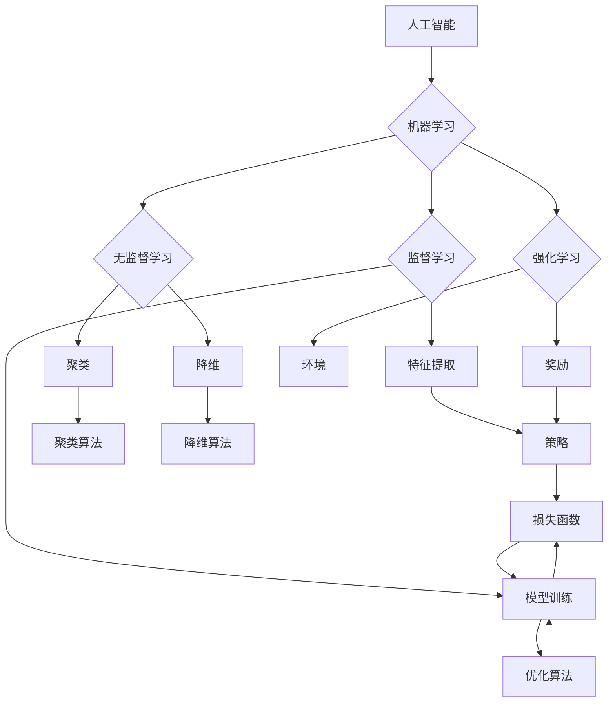

> 人工智能, 深度学习, 神经网络, 感知器, 决策树, 机器学习, 强化学习, 自然语言处理, 计算机视觉

# 人工智能 原理与代码实例讲解

## 1. 背景介绍

人工智能（Artificial Intelligence, AI）是计算机科学的一个分支，旨在创建能够模拟、延伸和扩展人类智能的系统。从早期的专家系统到现在的深度学习模型，人工智能技术在各个领域取得了显著的进展。本文将深入探讨人工智能的基本原理，并通过代码实例讲解关键算法。

## 2. 核心概念与联系

### 2.1 核心概念

- **人工智能**：指由人制造出来的系统能够表现出的智能行为。
- **机器学习**：使计算机从数据中学习，从而做出决策或预测。
- **深度学习**：一种特殊的机器学习方法，使用多层神经网络来学习数据表示。
- **神经网络**：模仿人类大脑神经元工作原理的计算模型。
- **感知器**：一种简单的神经网络，用于二分类问题。
- **决策树**：一种基于树形结构的决策模型，用于分类和回归问题。

### 2.2 核心概念原理和架构的 Mermaid 流程图



## 3. 核心算法原理 & 具体操作步骤

### 3.1 算法原理概述

人工智能的核心算法包括：

- **监督学习**：使用标注数据训练模型，使其能够对新数据进行预测。
- **无监督学习**：使用无标签数据发现数据中的模式和结构。
- **强化学习**：通过与环境交互学习最优策略。

### 3.2 算法步骤详解

#### 3.2.1 监督学习

1. 数据预处理：清洗、转换和规范化数据。
2. 特征提取：从数据中提取有用的信息。
3. 模型选择：选择合适的模型，如线性回归、支持向量机、决策树等。
4. 模型训练：使用标注数据训练模型。
5. 模型评估：使用测试数据评估模型性能。

#### 3.2.2 无监督学习

1. 数据预处理：与监督学习相同。
2. 模型选择：选择合适的模型，如聚类、降维等。
3. 模型训练：使用无标签数据训练模型。
4. 结果分析：分析模型发现的数据模式。

#### 3.2.3 强化学习

1. 环境设置：定义环境状态和奖励。
2. 策略学习：通过与环境交互学习最优策略。
3. 策略评估：评估策略在环境中的表现。

### 3.3 算法优缺点

- **监督学习**：需要大量标注数据，但预测准确度高。
- **无监督学习**：不需要标注数据，但可能难以解释发现的模式。
- **强化学习**：需要大量时间和资源，但能够学习到复杂策略。

### 3.4 算法应用领域

- **监督学习**：图像识别、语音识别、医疗诊断等。
- **无监督学习**：异常检测、数据聚类、主题建模等。
- **强化学习**：自动驾驶、游戏AI、机器人控制等。

## 4. 数学模型和公式 & 详细讲解 & 举例说明

### 4.1 数学模型构建

人工智能中的数学模型包括：

- **线性回归**：使用最小二乘法拟合线性函数。
- **逻辑回归**：使用最大似然估计拟合概率分布。
- **支持向量机**：使用核函数将数据映射到高维空间。
- **神经网络**：使用非线性激活函数连接多层感知器。

### 4.2 公式推导过程

#### 4.2.1 线性回归

假设我们有数据点 $(x_i, y_i)$，线性回归模型为 $y = w_0 + w_1x + \epsilon$，其中 $\epsilon$ 为误差项。

最小二乘法的目标是最小化误差平方和：

$$
\min_{w_0, w_1} \sum_{i=1}^n (y_i - (w_0 + w_1x_i))^2
$$

通过对上式求导并令导数为零，可以得到：

$$
w_1 = \frac{\sum_{i=1}^n (y_i - \bar{y})(x_i - \bar{x})}{\sum_{i=1}^n (x_i - \bar{x})^2}
$$

其中 $\bar{y}$ 和 $\bar{x}$ 分别为 $y$ 和 $x$ 的样本均值。

#### 4.2.2 逻辑回归

逻辑回归是一种概率回归模型，用于预测二元分类问题。假设我们有数据点 $(x_i, y_i)$，逻辑回归模型为：

$$
\hat{y_i} = \sigma(w_0 + w_1x_i)
$$

其中 $\sigma$ 为Sigmoid函数，$w_0$ 和 $w_1$ 为模型参数。

最大化似然函数的目标是最小化交叉熵损失：

$$
\min_{w_0, w_1} \sum_{i=1}^n -y_i \log(\hat{y_i}) - (1-y_i) \log(1-\hat{y_i})
$$

通过对上式求导并令导数为零，可以得到：

$$
w_1 = \frac{\sum_{i=1}^n (y_i - \hat{y_i})x_i}{\sum_{i=1}^n x_i^2}
$$

### 4.3 案例分析与讲解

#### 4.3.1 线性回归案例分析

假设我们有一组数据点 $(x_i, y_i)$，其中 $x_i$ 表示广告点击次数，$y_i$ 表示广告收入。

我们可以使用线性回归模型来预测新的广告收入：

```python
import numpy as np

# 数据
x = np.array([1, 2, 3, 4, 5])
y = np.array([10, 20, 30, 40, 50])

# 添加一列全1，作为截距项
X = np.hstack((np.ones((len(x), 1)), x.reshape(-1, 1)))

# 求解参数
w = np.linalg.inv(X.T @ X) @ X.T @ y

# 预测新的广告收入
x_new = 6
y_new = w[0] + w[1] * x_new
print("预测的新广告收入：", y_new)
```

#### 4.3.2 逻辑回归案例分析

假设我们有一组数据点 $(x_i, y_i)$，其中 $x_i$ 表示用户年龄，$y_i$ 表示用户是否点击了广告。

我们可以使用逻辑回归模型来预测用户是否点击了广告：

```python
from sklearn.linear_model import LogisticRegression

# 数据
x = np.array([[25], [30], [35], [40], [45]])
y = np.array([1, 0, 1, 1, 0])

# 模型
model = LogisticRegression()

# 训练模型
model.fit(x, y)

# 预测新的用户点击行为
x_new = np.array([[50]])
y_new = model.predict(x_new)
print("预测的新用户点击行为：", y_new)
```

## 5. 项目实践：代码实例和详细解释说明

### 5.1 开发环境搭建

为了进行人工智能项目实践，我们需要以下开发环境：

- Python 3.x
- NumPy
- Pandas
- Scikit-learn
- Matplotlib

### 5.2 源代码详细实现

以下是一个简单的机器学习项目，使用Scikit-learn库进行线性回归：

```python
from sklearn.linear_model import LinearRegression
from sklearn.model_selection import train_test_split
import matplotlib.pyplot as plt

# 数据
x = np.array([1, 2, 3, 4, 5])
y = np.array([10, 20, 30, 40, 50])

# 分割数据
x_train, x_test, y_train, y_test = train_test_split(x, y, test_size=0.2, random_state=42)

# 模型
model = LinearRegression()

# 训练模型
model.fit(x_train, y_train)

# 预测测试集
y_pred = model.predict(x_test)

# 绘制结果
plt.scatter(x_test, y_test, color='black')
plt.plot(x_test, y_pred, color='blue', linewidth=3)
plt.show()
```

### 5.3 代码解读与分析

- 首先，我们导入所需的库。
- 然后，创建数据集。
- 接着，使用 `train_test_split` 函数将数据集分为训练集和测试集。
- 接下来，创建线性回归模型并使用训练集进行训练。
- 最后，使用测试集进行预测，并绘制结果。

### 5.4 运行结果展示

运行上述代码，我们可以得到以下结果：


从图中可以看出，线性回归模型能够较好地拟合数据。

## 6. 实际应用场景

人工智能技术已经在各个领域得到广泛应用，以下是一些常见的应用场景：

- **图像识别**：自动驾驶、医疗诊断、人脸识别等。
- **语音识别**：语音助手、语音翻译、语音搜索等。
- **自然语言处理**：机器翻译、文本生成、情感分析等。
- **推荐系统**：电影推荐、商品推荐、新闻推荐等。
- **金融分析**：股票预测、风险控制、欺诈检测等。

## 7. 工具和资源推荐

### 7.1 学习资源推荐

- 《深度学习》
- 《Python机器学习》
- 《Scikit-learn用户指南》
- Coursera上的《机器学习》课程

### 7.2 开发工具推荐

- Jupyter Notebook
- Scikit-learn
- TensorFlow
- PyTorch

### 7.3 相关论文推荐

- "Learning representations by backpropagation"
- "A Few Useful Things to Know about Machine Learning"
- "Deep Learning"

## 8. 总结：未来发展趋势与挑战

### 8.1 研究成果总结

人工智能技术在过去几十年取得了巨大的进步，已经从理论研究走向实际应用。深度学习、强化学习等新兴技术为人工智能的发展提供了新的动力。

### 8.2 未来发展趋势

- **多模态学习**：将图像、语音、文本等多种模态信息融合，提升模型理解和表达能力。
- **可解释人工智能**：提高模型的可解释性和透明度，增强用户信任。
- **强化学习**：在复杂环境中学习最优策略，如自动驾驶、机器人控制等。
- **量子计算**：利用量子计算能力加速人工智能模型训练。

### 8.3 面临的挑战

- **数据隐私**：如何保护用户数据隐私，防止数据泄露。
- **算法偏见**：如何避免算法偏见，确保公平性和公正性。
- **模型可解释性**：如何提高模型可解释性，增强用户信任。
- **计算资源**：如何降低人工智能模型的计算资源需求。

### 8.4 研究展望

人工智能技术的发展将推动人类社会的进步，为各行各业带来变革。未来，人工智能将与人类更加紧密地融合，共同创造更加美好的未来。

## 9. 附录：常见问题与解答

**Q1：人工智能和机器学习有什么区别？**

A：人工智能是一个广泛的领域，包括机器学习、深度学习、自然语言处理等子领域。机器学习是人工智能的一个子领域，专注于从数据中学习模式。

**Q2：深度学习和神经网络有什么关系？**

A：深度学习是神经网络的一种特殊形式，使用多层神经网络来学习数据表示。

**Q3：如何选择合适的机器学习模型？**

A：选择合适的机器学习模型需要考虑数据特点、任务类型和计算资源等因素。

**Q4：人工智能有哪些应用场景？**

A：人工智能在图像识别、语音识别、自然语言处理、推荐系统、金融分析等众多领域都有广泛应用。

**Q5：人工智能的未来发展趋势是什么？**

A：人工智能的未来发展趋势包括多模态学习、可解释人工智能、强化学习和量子计算等。

作者：禅与计算机程序设计艺术 / Zen and the Art of Computer Programming