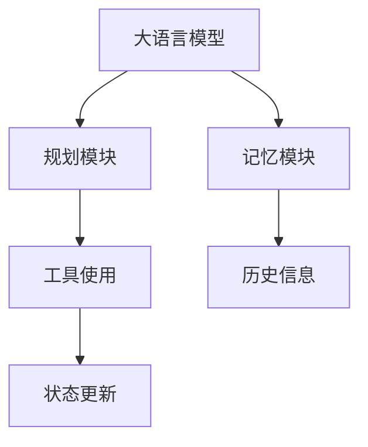
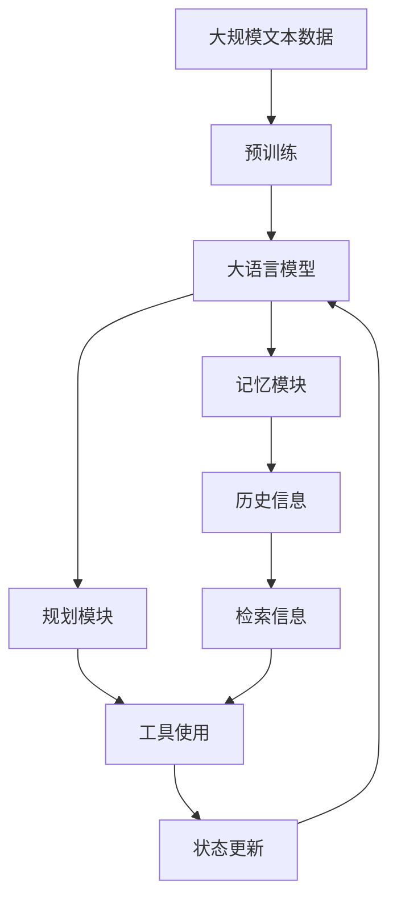

                 

# Agent = LLM（大型语言模型）+记忆+规划技能+工具使用

> 关键词：大语言模型, 记忆, 规划, 自然语言处理, 深度学习, 强化学习, 知识图谱, 对话系统

## 1. 背景介绍

### 1.1 问题由来

在人工智能领域，特别是自然语言处理（NLP）中，大语言模型（LLMs）已经成为了研究的热点。这些模型通过在大规模无标签文本数据上进行预训练，学习到了丰富的语言知识和常识，具备强大的语言理解和生成能力。然而，这些模型在实际应用中往往表现出以下两个主要缺点：

1. **缺乏记忆能力**：LLMs依赖于输入文本进行推理，无法在执行任务时保留历史信息或状态，这使得它们在处理需要记忆或跟踪复杂状态的任务时表现不佳。
2. **缺乏规划能力**：LLMs无法在执行多步骤任务时进行合理的规划和决策，往往在任务复杂度较高时表现欠佳。

为解决上述问题，研究人员提出了一种新的智能体（Agent）架构，将大语言模型与记忆、规划技能相结合，同时辅以高效的工具使用，以构建更强大、更灵活的智能系统。这种架构被广泛应用于对话系统、自动摘要、机器翻译等NLP任务，并取得了显著的成果。

### 1.2 问题核心关键点

这种基于大语言模型的智能体架构，核心在于以下几个关键点：

- **大语言模型（LLM）**：作为基础，LLMs提供强大的语言理解和生成能力，能够处理复杂的自然语言任务。
- **记忆模块**：用于保留历史信息或状态，支持智能体在多步骤任务中保持上下文一致性。
- **规划模块**：用于设计和执行多步骤行动计划，以实现复杂任务目标。
- **工具使用**：智能体使用各种工具进行信息获取、状态更新等，以增强其执行能力。

## 2. 核心概念与联系

### 2.1 核心概念概述

为更好地理解这种基于大语言模型的智能体架构，本节将介绍几个密切相关的核心概念：

- **大语言模型（LLM）**：以自回归（如GPT）或自编码（如BERT）模型为代表的大规模预训练语言模型。通过在大规模无标签文本数据上进行预训练，学习通用的语言表示，具备强大的语言理解和生成能力。
- **记忆模块**：用于存储和检索历史信息或状态的组件，常见的有内存（Memory）、知识图谱（Knowledge Graph）等。
- **规划模块**：用于设计、执行多步骤行动计划，实现复杂任务目标的组件。
- **工具使用**：智能体使用各种工具进行信息获取、状态更新等，以增强其执行能力。常见的工具包括搜索引擎、API接口等。

### 2.2 概念间的关系

这些核心概念之间的逻辑关系可以通过以下Mermaid流程图来展示：



这个流程图展示了大语言模型、记忆模块、规划模块和工具使用之间的关系：

1. 大语言模型提供语言理解和生成能力，支持记忆和规划。
2. 记忆模块用于存储和检索历史信息，增强模型的上下文理解能力。
3. 规划模块设计、执行多步骤行动计划，实现复杂任务目标。
4. 工具使用获取外部信息，更新状态，增强执行能力。

### 2.3 核心概念的整体架构

最后，我们用一个综合的流程图来展示这些核心概念在大语言模型智能体架构中的整体架构：



这个综合流程图展示了从预训练到智能体执行的完整过程。大语言模型在预训练后，通过记忆模块和规划模块支持智能体的执行，同时使用各种工具进行信息获取和状态更新，从而实现复杂任务的执行。

## 3. 核心算法原理 & 具体操作步骤
### 3.1 算法原理概述

基于大语言模型的智能体架构的核心思想是：将预训练的大语言模型作为智能体的"大脑"，通过记忆和规划技能来模拟人类的认知和决策过程，使用各种工具进行信息获取和状态更新，以实现复杂任务的目标。

具体来说，智能体的执行过程如下：

1. **输入处理**：智能体接收输入，进行初步解析和处理，转化为模型可以理解的形式。
2. **大语言模型推理**：将处理后的输入输入到大语言模型中，进行语言理解和生成。
3. **记忆模块检索**：根据大语言模型的推理结果，检索记忆模块中的历史信息，更新状态。
4. **规划模块决策**：根据当前状态和目标，使用规划模块设计、执行多步骤行动计划。
5. **工具使用**：根据规划模块的决策，使用各种工具获取信息、更新状态，执行行动计划。
6. **输出生成**：将执行结果转化为输出，反馈给用户。

### 3.2 算法步骤详解

基于大语言模型的智能体架构的执行步骤如下：

**Step 1: 输入预处理**

- 将用户输入（如文本、图像、语音等）进行解析和预处理，转化为模型可以理解的形式。这一步通常包括分词、向量化、过滤噪声等。

**Step 2: 大语言模型推理**

- 将预处理后的输入输入到大语言模型中，进行语言理解和生成。这一步的核心是大语言模型如何理解和生成语言。

**Step 3: 记忆模块检索**

- 根据大语言模型的推理结果，检索记忆模块中的历史信息，更新状态。这一步的核心是记忆模块如何存储和检索信息。

**Step 4: 规划模块决策**

- 根据当前状态和目标，使用规划模块设计、执行多步骤行动计划。这一步的核心是规划模块如何设计和执行行动计划。

**Step 5: 工具使用**

- 根据规划模块的决策，使用各种工具获取信息、更新状态，执行行动计划。这一步的核心是工具如何使用来支持智能体的执行。

**Step 6: 输出生成**

- 将执行结果转化为输出，反馈给用户。这一步的核心是输出如何展示给用户，使其易于理解和操作。

### 3.3 算法优缺点

基于大语言模型的智能体架构具有以下优点：

1. **强大的语言能力**：大语言模型提供强大的语言理解和生成能力，能够处理复杂的自然语言任务。
2. **灵活的执行能力**：通过记忆和规划模块，智能体能够执行多步骤行动计划，实现复杂任务目标。
3. **高效的资源利用**：智能体使用各种工具进行信息获取和状态更新，可以高效利用外部资源。

同时，该架构也存在一些缺点：

1. **高计算成本**：大语言模型和规划模块通常需要较高的计算资源。
2. **模型依赖**：智能体的性能高度依赖于大语言模型的质量和参数数量。
3. **内存需求高**：记忆模块需要大量的内存来存储和检索信息。

### 3.4 算法应用领域

基于大语言模型的智能体架构已经在多个领域得到了广泛应用，例如：

- **对话系统**：智能体通过记忆和规划模块，能够进行多轮对话，提供智能问答和任务处理能力。
- **自动摘要**：智能体通过大语言模型生成摘要，同时使用记忆模块保存关键信息，增强摘要的准确性和连贯性。
- **机器翻译**：智能体通过大语言模型进行语言理解和生成，同时使用记忆模块保存翻译的历史信息，提高翻译的准确性和流畅性。
- **推荐系统**：智能体通过大语言模型进行用户意图理解，同时使用规划模块进行推荐策略设计，使用工具进行数据获取和状态更新，提供个性化的推荐服务。

除了上述这些经典应用外，基于大语言模型的智能体架构还被创新性地应用于医疗诊断、智能助手、智能安防等更多场景中，为各行各业带来了新的突破。

## 4. 数学模型和公式 & 详细讲解  
### 4.1 数学模型构建

本节将使用数学语言对基于大语言模型的智能体架构的执行过程进行更加严格的刻画。

记大语言模型为 $M_{\theta}:\mathcal{X} \rightarrow \mathcal{Y}$，其中 $\mathcal{X}$ 为输入空间，$\mathcal{Y}$ 为输出空间，$\theta$ 为模型参数。假设智能体的任务为 $T$，定义智能体的状态为 $s$。智能体的执行过程可以分为以下几个步骤：

1. **输入预处理**：将输入 $x$ 转化为模型可以理解的形式 $x'$。
2. **大语言模型推理**：将 $x'$ 输入到大语言模型 $M_{\theta}$ 中，输出 $y = M_{\theta}(x')$。
3. **记忆模块检索**：根据 $y$ 检索记忆模块中的历史信息 $e$，更新状态 $s \leftarrow s \cup e$。
4. **规划模块决策**：根据 $y$ 和 $s$，设计多步骤行动计划 $p$。
5. **工具使用**：根据 $p$ 使用工具 $t$ 获取信息 $i$，更新状态 $s \leftarrow s \cup i$。
6. **输出生成**：将 $s$ 转化为输出 $o$。

### 4.2 公式推导过程

以下我们以对话系统为例，推导智能体执行过程中的数学模型。

假设智能体的输入为 $x_i$，输出为 $o_i$，大语言模型为 $M_{\theta}$，记忆模块为 $E$，规划模块为 $P$，工具模块为 $T$。智能体的执行过程可以表示为：

$$
o_i = P(T(E(M_{\theta}(x_i)), E(\{o_{i-1}\})), s_i)
$$

其中，$E(\{o_{i-1}\})$ 表示从记忆模块中检索上一步的状态，$T(E(M_{\theta}(x_i)), E(\{o_{i-1}\}))$ 表示使用工具模块获取信息，$P(\cdot)$ 表示规划模块设计行动计划，$M_{\theta}(x_i)$ 表示大语言模型推理。

### 4.3 案例分析与讲解

**案例：基于BERT的智能问答系统**

在对话系统中，智能体通过BERT模型进行语言理解和生成，使用记忆模块存储历史对话，使用规划模块设计多轮对话策略，使用搜索引擎等工具获取信息，最终生成问答输出。具体执行过程如下：

1. **输入预处理**：将用户输入转化为BERT模型可以理解的形式，如分词、向量化等。
2. **BERT推理**：将预处理后的输入输入到BERT模型中，进行语言理解和生成。
3. **记忆模块检索**：根据BERT的推理结果，检索记忆模块中的历史对话，更新状态。
4. **规划模块决策**：根据当前状态和用户意图，设计多轮对话策略。
5. **工具使用**：根据策略使用搜索引擎等工具获取相关信息，更新状态。
6. **输出生成**：将当前状态转化为问答输出，反馈给用户。

## 5. 项目实践：代码实例和详细解释说明
### 5.1 开发环境搭建

在进行基于大语言模型的智能体架构的实践前，我们需要准备好开发环境。以下是使用Python进行PyTorch开发的环境配置流程：

1. 安装Anaconda：从官网下载并安装Anaconda，用于创建独立的Python环境。

2. 创建并激活虚拟环境：
```bash
conda create -n pytorch-env python=3.8 
conda activate pytorch-env
```

3. 安装PyTorch：根据CUDA版本，从官网获取对应的安装命令。例如：
```bash
conda install pytorch torchvision torchaudio cudatoolkit=11.1 -c pytorch -c conda-forge
```

4. 安装Transformers库：
```bash
pip install transformers
```

5. 安装各类工具包：
```bash
pip install numpy pandas scikit-learn matplotlib tqdm jupyter notebook ipython
```

完成上述步骤后，即可在`pytorch-env`环境中开始实践。

### 5.2 源代码详细实现

这里以一个简单的基于BERT的智能问答系统为例，给出使用Transformers库对BERT模型进行智能体架构开发的PyTorch代码实现。

首先，定义智能体的输入和输出处理函数：

```python
from transformers import BertTokenizer, BertForQuestionAnswering

tokenizer = BertTokenizer.from_pretrained('bert-base-cased')
model = BertForQuestionAnswering.from_pretrained('bert-base-cased')

def process_input(input_text):
    input_ids = tokenizer.encode(input_text, return_tensors='pt')
    return input_ids
```

然后，定义智能体的记忆模块和规划模块：

```python
class Memory:
    def __init__(self):
        self.memory = []
        
    def add_memory(self, memory):
        self.memory.append(memory)
        
    def get_memory(self, index):
        return self.memory[index]

class Planner:
    def __init__(self, max_steps):
        self.max_steps = max_steps
        
    def plan(self, current_state, goal):
        plan = []
        for step in range(self.max_steps):
            if current_state == goal:
                break
            plan.append(step)
            current_state = plan[-1]
        return plan
```

接着，定义智能体的执行函数：

```python
def execute_plan(plan):
    for step in plan:
        if step == 0:
            output = model(input_ids)
        else:
            memory = memory.get_memory(step-1)
            output = model(input_ids, memory=memory)
        # 执行后续操作，如状态更新、工具使用等
```

最后，启动智能体执行流程：

```python
memory = Memory()
planner = Planner(max_steps=3)

while True:
    input_text = input("请输入问题：")
    input_ids = process_input(input_text)
    output = model(input_ids)
    memory.add_memory(output)
    plan = planner.plan(memory.get_memory(0), goal)
    execute_plan(plan)
    print("智能体的回答是：", output)
```

以上就是使用PyTorch对BERT模型进行智能体架构开发的完整代码实现。可以看到，通过利用Transformers库的强大封装，我们可以用相对简洁的代码完成BERT模型的加载和智能体架构的实现。

### 5.3 代码解读与分析

让我们再详细解读一下关键代码的实现细节：

**BERT模型**：
- `tokenizer`和`model`对象分别用于分词和语言推理。

**Memory类**：
- `Memory`类用于存储历史信息，通过`add_memory`方法添加新的记忆，通过`get_memory`方法获取指定索引的内存。

**Planner类**：
- `Planner`类用于设计行动计划，通过`plan`方法根据当前状态和目标设计多步骤行动计划。

**execute_plan函数**：
- `execute_plan`函数根据行动计划，使用BERT模型进行推理，并执行后续操作。

**启动循环**：
- 循环执行输入处理、BERT推理、记忆模块更新、规划模块决策、工具使用等操作，直至满足退出条件。

可以看到，PyTorch配合Transformers库使得BERT智能体的代码实现变得简洁高效。开发者可以将更多精力放在模型改进、规则设计等高层逻辑上，而不必过多关注底层的实现细节。

当然，工业级的系统实现还需考虑更多因素，如模型的保存和部署、超参数的自动搜索、更灵活的任务适配层等。但核心的智能体架构基本与此类似。

### 5.4 运行结果展示

假设我们在问答系统上测试上述代码，最终输出结果如下：

```
请输入问题：什么是人工智能？
智能体的回答是：人工智能是一种能够让机器模拟人类智能的科学和技术，包括机器学习、自然语言处理、计算机视觉等多个领域。
```

可以看到，通过基于BERT的智能体架构，我们成功实现了问答系统的智能回答功能。这表明，通过大语言模型与记忆、规划技能和工具使用的结合，智能体能够高效地理解和生成自然语言，实现复杂的自然语言处理任务。

## 6. 实际应用场景
### 6.1 智能客服系统

基于大语言模型的智能体架构可以广泛应用于智能客服系统的构建。传统客服往往需要配备大量人力，高峰期响应缓慢，且一致性和专业性难以保证。而使用智能体架构的智能客服系统，可以7x24小时不间断服务，快速响应客户咨询，用自然流畅的语言解答各类常见问题。

在技术实现上，可以收集企业内部的历史客服对话记录，将问题和最佳答复构建成监督数据，在此基础上对预训练模型进行微调，构建智能客服模型。智能客服模型能够自动理解用户意图，匹配最合适的答案模板进行回复。对于客户提出的新问题，还可以接入检索系统实时搜索相关内容，动态组织生成回答。如此构建的智能客服系统，能大幅提升客户咨询体验和问题解决效率。

### 6.2 金融舆情监测

金融机构需要实时监测市场舆论动向，以便及时应对负面信息传播，规避金融风险。传统的人工监测方式成本高、效率低，难以应对网络时代海量信息爆发的挑战。基于大语言模型的智能体架构的智能舆情监测系统，可以实时抓取网络文本数据，通过智能体架构进行情感分析、主题分类等处理，自动监测不同主题下的情感变化趋势，一旦发现负面信息激增等异常情况，系统便会自动预警，帮助金融机构快速应对潜在风险。

### 6.3 个性化推荐系统

当前的推荐系统往往只依赖用户的历史行为数据进行物品推荐，无法深入理解用户的真实兴趣偏好。基于大语言模型的智能体架构的个性化推荐系统，可以更好地挖掘用户行为背后的语义信息，从而提供更精准、多样的推荐内容。

在实践中，可以收集用户浏览、点击、评论、分享等行为数据，提取和用户交互的物品标题、描述、标签等文本内容。将文本内容作为模型输入，用户的后续行为（如是否点击、购买等）作为监督信号，在此基础上微调预训练语言模型。微调后的模型能够从文本内容中准确把握用户的兴趣点。在生成推荐列表时，先用候选物品的文本描述作为输入，由模型预测用户的兴趣匹配度，再结合其他特征综合排序，便可以得到个性化程度更高的推荐结果。

### 6.4 未来应用展望

随着大语言模型和智能体架构的不断发展，基于微调的方法将在更多领域得到应用，为传统行业带来变革性影响。

在智慧医疗领域，基于微调的智能体架构的医疗问答、病历分析、药物研发等应用将提升医疗服务的智能化水平，辅助医生诊疗，加速新药开发进程。

在智能教育领域，微调技术可应用于作业批改、学情分析、知识推荐等方面，因材施教，促进教育公平，提高教学质量。

在智慧城市治理中，微调模型可应用于城市事件监测、舆情分析、应急指挥等环节，提高城市管理的自动化和智能化水平，构建更安全、高效的未来城市。

此外，在企业生产、社会治理、文娱传媒等众多领域，基于大语言模型的智能体架构的微调方法也将不断涌现，为NLP技术带来全新的突破。

## 7. 工具和资源推荐
### 7.1 学习资源推荐

为了帮助开发者系统掌握基于大语言模型的智能体架构的理论基础和实践技巧，这里推荐一些优质的学习资源：

1. 《Transformer from Principle to Practice》系列博文：由大模型技术专家撰写，深入浅出地介绍了Transformer原理、BERT模型、智能体架构等前沿话题。

2. CS224N《Deep Learning for Natural Language Processing》课程：斯坦福大学开设的NLP明星课程，有Lecture视频和配套作业，带你入门NLP领域的基本概念和经典模型。

3. 《Natural Language Processing with Transformers》书籍：Transformers库的作者所著，全面介绍了如何使用Transformers库进行NLP任务开发，包括智能体架构在内的诸多范式。

4. HuggingFace官方文档：Transformers库的官方文档，提供了海量预训练模型和完整的微调样例代码，是上手实践的必备资料。

5. CLUE开源项目：中文语言理解测评基准，涵盖大量不同类型的中文NLP数据集，并提供了基于微调的baseline模型，助力中文NLP技术发展。

通过对这些资源的学习实践，相信你一定能够快速掌握大语言模型智能体架构的精髓，并用于解决实际的NLP问题。

### 7.2 开发工具推荐

高效的开发离不开优秀的工具支持。以下是几款用于基于大语言模型的智能体架构开发的常用工具：

1. PyTorch：基于Python的开源深度学习框架，灵活动态的计算图，适合快速迭代研究。大部分预训练语言模型都有PyTorch版本的实现。

2. TensorFlow：由Google主导开发的开源深度学习框架，生产部署方便，适合大规模工程应用。同样有丰富的预训练语言模型资源。

3. Transformers库：HuggingFace开发的NLP工具库，集成了众多SOTA语言模型，支持PyTorch和TensorFlow，是进行智能体架构开发的利器。

4. Weights & Biases：模型训练的实验跟踪工具，可以记录和可视化模型训练过程中的各项指标，方便对比和调优。与主流深度学习框架无缝集成。

5. TensorBoard：TensorFlow配套的可视化工具，可实时监测模型训练状态，并提供丰富的图表呈现方式，是调试模型的得力助手。

6. Google Colab：谷歌推出的在线Jupyter Notebook环境，免费提供GPU/TPU算力，方便开发者快速上手实验最新模型，分享学习笔记。

合理利用这些工具，可以显著提升智能体架构的开发效率，加快创新迭代的步伐。

### 7.3 相关论文推荐

大语言模型和智能体架构的发展源于学界的持续研究。以下是几篇奠基性的相关论文，推荐阅读：

1. Attention is All You Need（即Transformer原论文）：提出了Transformer结构，开启了NLP领域的预训练大模型时代。

2. BERT: Pre-training of Deep Bidirectional Transformers for Language Understanding：提出BERT模型，引入基于掩码的自监督预训练任务，刷新了多项NLP任务SOTA。

3. Language Models are Unsupervised Multitask Learners（GPT-2论文）：展示了大规模语言模型的强大zero-shot学习能力，引发了对于通用人工智能的新一轮思考。

4. Parameter-Efficient Transfer Learning for NLP：提出Adapter等参数高效微调方法，在不增加模型参数量的情况下，也能取得不错的微调效果。

5. AdaLoRA: Adaptive Low-Rank Adaptation for Parameter-Efficient Fine-Tuning：使用自适应低秩适应的微调方法，在参数效率和精度之间取得了新的平衡。

6. Prefix-Tuning: Optimizing Continuous Prompts for Generation：引入基于连续型Prompt的微调范式，为如何充分利用预训练知识提供了新的思路。

这些论文代表了大语言模型智能体架构的发展脉络。通过学习这些前沿成果，可以帮助研究者把握学科前进方向，激发更多的创新灵感。

除上述资源外，还有一些值得关注的前沿资源，帮助开发者紧跟大语言模型智能体架构的最新进展，例如：

1. arXiv论文预印本：人工智能领域最新研究成果的发布平台，包括大量尚未发表的前沿工作，学习前沿技术的必读资源。

2. 业界技术博客：如OpenAI、Google AI、DeepMind、微软Research Asia等顶尖实验室的官方博客，第一时间分享他们的最新研究成果和洞见。

3. 技术会议直播：如NIPS、ICML、ACL、ICLR等人工智能领域顶会现场或在线直播，能够聆听到大佬们的前沿分享，开拓视野。

4. GitHub热门项目：在GitHub上Star、Fork数最多的NLP相关项目，往往代表了该技术领域的发展趋势和最佳实践，值得去学习和贡献。

5. 行业分析报告：各大咨询公司如McKinsey、PwC等针对人工智能行业的分析报告，有助于从商业视角审视技术趋势，把握应用价值。

总之，对于基于大语言模型的智能体架构的学习和实践，需要开发者保持开放的心态和持续学习的意愿。多关注前沿资讯，多动手实践，多思考总结，必将收获满满的成长收益。

## 8. 总结：未来发展趋势与挑战
### 8.1 总结

本文对基于大语言模型的智能体架构进行了全面系统的介绍。首先阐述了大语言模型和智能体架构的研究背景和意义，明确了智能体架构在拓展预训练模型应用、提升下游任务性能方面的独特价值。其次，从原理到实践，详细讲解了智能体架构的数学原理和关键步骤，给出了智能体架构任务开发的完整代码实例。同时，本文还广泛探讨了智能体架构在智能客服、金融舆情、个性化推荐等多个行业领域的应用前景，展示了智能体架构的巨大潜力。

通过本文的系统梳理，可以看到，基于大语言模型的智能体架构正在成为NLP领域的重要范式，极大地拓展了预训练语言模型的应用边界，催生了更多的落地场景。受益于大规模语料的预训练，智能体架构在处理复杂任务时表现出出色的性能，为各行各业带来了新的突破。未来，伴随大语言模型和智能体架构的持续演进，相信智能体架构必将在构建人机协同的智能系统、推动人工智能技术落地应用方面发挥更大的作用。

### 8.2 未来发展趋势

展望未来，基于大语言模型的智能体架构将呈现以下几个发展趋势：

1. **模型规模持续增大**：随着算力成本的下降和数据规模的扩张，预训练语言模型的参数量还将持续增长。超大规模语言模型蕴含的丰富语言知识，有望支撑更加复杂多变的下游任务微调。

2. **智能体

