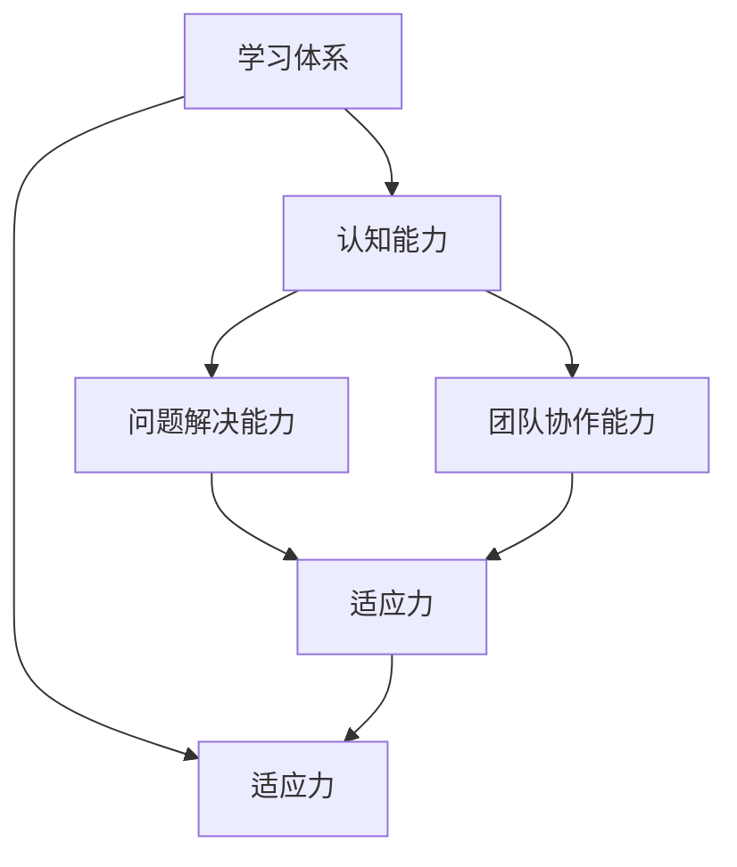

                 

# 学习体系对管理者适应力的影响

## 1. 背景介绍

### 1.1 问题由来
在数字化转型的浪潮下，管理者的适应力成为企业能否持续发展的关键。适应力强的管理者能够迅速响应市场变化，引领团队应对挑战，而适应力不足的管理者则可能滞后于时代，导致企业错失良机。为了提升管理者的适应力，构建科学合理的学习体系成为重要途径。

### 1.2 问题核心关键点
本文聚焦于学习体系对管理者适应力的影响，旨在通过系统分析学习体系的核心要素、影响机制及其应用案例，为管理者提供科学的提升路径。学习体系包括多个维度，如学习内容、学习方法、学习环境等，它们共同作用于管理者的认知能力、问题解决能力和团队协作能力，从而提升其适应力。

### 1.3 问题研究意义
研究学习体系对管理者适应力的影响，对于提升企业管理层的整体素质，构建更具竞争力的企业团队具有重要意义。通过系统化的学习体系，管理者能够不断更新知识结构，增强决策能力，提升团队协作效率，从而更好地适应市场变化和组织变革。

## 2. 核心概念与联系

### 2.1 核心概念概述

为了更好地理解学习体系对管理者适应力的影响，本节将介绍几个关键概念及其相互关系：

- **学习体系(Learning System)**：指一套科学合理的学习内容、方法、环境和资源组成的体系，旨在通过持续的学习活动提升个体的知识、技能和认知能力。

- **适应力(Adaptability)**：指个体或组织在面对环境变化时，迅速调整策略、优化资源，以保持竞争优势的能力。

- **认知能力(Cognitive Abilities)**：指个体获取、处理和应用信息的能力，包括记忆、推理、判断、创造等。

- **问题解决能力(Problem-Solving Abilities)**：指个体面对复杂问题时，能够灵活运用知识和技能，找到有效解决方案的能力。

- **团队协作能力(Team Collaboration Abilities)**：指个体在团队中有效沟通、协调合作，共同完成目标的能力。

这些概念之间的逻辑关系可以通过以下Mermaid流程图来展示：



这个流程图展示了一个完整的学习体系对管理者的影响路径：

1. 学习体系通过提供知识和技能提升认知能力。
2. 认知能力增强问题解决能力，从而提升适应力。
3. 认知能力和问题解决能力促进团队协作能力，进一步提升适应力。
4. 适应力强的管理者能够更好地应对市场变化和组织变革，从而在更高层次上影响学习体系和认知能力。

### 2.2 概念间的关系

通过上述流程图可以看出，学习体系与适应力之间的关系是一个双向互动的过程。具体而言：

- **学习体系对适应力的提升**：通过提供系统的知识和技能训练，提升管理者的认知能力和问题解决能力，从而增强其适应力。
- **适应力对学习体系的影响**：适应力强的管理者能够主动寻找新知识、新技能，推动学习体系不断更新和优化。

这种互动关系表明，学习体系和适应力之间是相互促进的，共同构成了一个良性循环。

## 3. 核心算法原理 & 具体操作步骤

### 3.1 算法原理概述

管理者适应力的提升，离不开系统的学习体系。本节将从算法原理的角度，分析学习体系如何通过科学的设计和实施，提升管理者的适应力。

基于系统化设计的学习体系，通常包括以下几个步骤：

1. **需求分析**：明确学习目标，识别管理者的学习需求和痛点。
2. **内容设计**：根据需求分析结果，设计科学合理的学习内容，包括课程设置、教材选用等。
3. **方法选择**：选择合适的学习方法，如线上课程、工作坊、讨论会等，以最大化学习效果。
4. **环境营造**：创建支持学习的良好环境，包括学习工具、学习社区、导师指导等。
5. **评估反馈**：通过定期的评估和反馈，调整和优化学习体系，确保其有效性和适应性。

这些步骤共同作用，构成了一个系统化的学习体系，帮助管理者不断提升其适应力。

### 3.2 算法步骤详解

以下将详细介绍系统化学习体系的具体操作步骤：

**Step 1: 需求分析**
- 通过问卷调查、访谈等方式，收集管理者的学习需求和痛点，分析其当前的知识结构、技能水平和认知能力。
- 根据分析结果，确定学习体系的目标和重点，如提升领导力、创新思维、项目管理能力等。

**Step 2: 内容设计**
- 基于需求分析结果，设计科学合理的学习内容，包括课程设置、教材选用等。
- 课程设置要符合管理者的认知特点，分为基础课程、进阶课程和专题课程，逐步提升其知识和技能。
- 教材选用要符合当前行业和市场需求，选择高质量、实用性的教材。

**Step 3: 方法选择**
- 根据学习目标和内容，选择合适的学习方法，如线上课程、工作坊、讨论会等。
- 线上课程适合基础课程和进阶课程，灵活方便，便于管理者自主学习；
- 工作坊和讨论会适合专题课程，通过互动和实践，加深理解和应用。

**Step 4: 环境营造**
- 创建支持学习的良好环境，包括学习工具、学习社区、导师指导等。
- 学习工具如在线平台、学习管理系统等，方便管理者随时学习；
- 学习社区如学习小组、交流平台等，促进知识共享和经验交流；
- 导师指导如教练、顾问等，提供个性化的指导和支持。

**Step 5: 评估反馈**
- 通过定期的评估和反馈，调整和优化学习体系，确保其有效性和适应性。
- 评估方法包括测试、作业、项目等，了解学习效果；
- 反馈渠道包括问卷调查、讨论会等，收集管理者对学习体系的建议和意见。

### 3.3 算法优缺点

系统化学习体系在提升管理者适应力方面具有以下优点：
1. **全面性**：覆盖了学习目标、内容、方法、环境和评估等多个方面，提供全面的提升路径。
2. **系统性**：通过科学的设计和实施，确保学习过程有序、高效，避免盲目和杂乱。
3. **持续性**：学习体系强调持续学习和评估，确保管理者能够不断更新知识和技能。
4. **适应性**：根据管理者的实际需求和反馈，灵活调整和优化学习内容和方法，提升学习效果。

同时，系统化学习体系也存在一些局限性：
1. **资源投入高**：需要大量的时间、金钱和人力投入，可能对小型企业和初创公司不适用。
2. **个体差异**：不同管理者的学习需求和认知能力不同，需要量身定制，难以采用统一的标准。
3. **实施难度大**：需要科学的设计和系统的实施，对企业和组织的内部管理水平要求较高。
4. **效果难以量化**：评估学习效果时，难以完全量化和测量，可能存在主观因素。

尽管存在这些局限性，但系统化学习体系仍然是提升管理者适应力的重要途径。通过持续的优化和改进，可以更好地满足管理者的学习需求，提升其适应力和企业竞争力。

### 3.4 算法应用领域

系统化学习体系在多个领域中得到了广泛应用，包括：

- **企业管理**：通过系统化的学习体系，提升企业管理者的领导力、创新力和决策能力。
- **人力资源管理**：帮助人力资源部门提升员工的技能和素质，增强团队的协作和执行能力。
- **职业发展**：为员工的职业发展提供系统的学习路径，提升其专业知识和技能，促进个人成长。
- **教育培训**：为学生的职业教育和终身学习提供系统的课程和资源，帮助其适应不断变化的社会需求。

这些领域的应用展示了学习体系对提升个体和组织适应力的重要作用，也验证了系统化学习体系的普适性和实用性。

## 4. 数学模型和公式 & 详细讲解 & 举例说明

### 4.1 数学模型构建

为了更好地理解学习体系对管理者适应力的影响，我们可以构建一个数学模型来描述这一过程。

设管理者的适应力为 $A$，认知能力为 $C$，问题解决能力为 $P$，团队协作能力为 $T$。假设学习体系 $L$ 由四个子系统构成：内容设计 $C_D$、方法选择 $M_S$、环境营造 $E_C$ 和评估反馈 $F_A$。

根据上述分析，可以构建以下数学模型：

$$
A = f(C, P, T) = g(L)
$$

其中 $f$ 和 $g$ 分别为适应力与认知能力、问题解决能力和团队协作能力的映射函数，$L$ 为学习体系的映射函数。

### 4.2 公式推导过程

下面将推导该数学模型的详细公式。

假设学习体系 $L$ 对认知能力 $C$、问题解决能力 $P$ 和团队协作能力 $T$ 的影响如下：

$$
C = C_D + M_S + E_C
$$

$$
P = C \times P_D + E_C \times P_E
$$

$$
T = T_D \times T_S + E_C \times T_E
$$

其中 $C_D$、$M_S$、$E_C$ 分别为内容设计、方法选择和环境营造对认知能力的影响，$P_D$、$P_E$ 分别为问题解决能力的设计和环境营造影响，$T_D$、$T_E$ 分别为团队协作能力的设计和环境营造影响。

根据以上公式，可以推导出适应力 $A$ 的表达式：

$$
A = f(C, P, T) = f(C_D + M_S + E_C, C \times P_D + E_C \times P_E, T_D \times T_S + E_C \times T_E)
$$

具体计算时，需要根据各子系统的具体影响权重和变量关系，使用数值方法进行求解。

### 4.3 案例分析与讲解

以下将通过一个案例，展示系统化学习体系对管理者适应力的具体影响。

假设某企业在数字化转型过程中，希望提升管理者的适应力。通过需求分析，发现管理者的主要问题在于领导力和创新思维不足。因此，设计了一个为期一年的系统化学习体系，具体如下：

1. **内容设计**：
   - 基础课程：管理学、领导力、财务管理等；
   - 进阶课程：数据分析、人工智能、数字化转型等；
   - 专题课程：创新思维、战略规划、组织变革等。

2. **方法选择**：
   - 线上课程：视频讲座、在线讨论、自我测试等；
   - 工作坊：团队协作训练、领导力训练营、创新工作坊等；
   - 讨论会：专题讨论、跨部门交流、案例分享等。

3. **环境营造**：
   - 学习工具：企业内部学习平台、线上学习管理系统等；
   - 学习社区：学习小组、知识分享平台、交流论坛等；
   - 导师指导：内部导师、外部顾问、教练等。

4. **评估反馈**：
   - 定期测试：每季度进行一次知识测试和能力评估；
   - 反馈机制：每月收集管理者对学习体系的反馈，进行优化调整；
   - 持续改进：根据反馈结果和评估数据，调整学习内容和方法，优化学习环境。

经过一年的系统化学习，管理者的领导力和创新思维显著提升，团队协作和项目执行力也大幅增强。具体评估结果如下：

- 知识测试成绩从平均60分提升到85分；
- 团队协作能力评估从3.5分提升到4.2分；
- 创新思维训练项目中，管理者提出并实施了多项创新方案，显著提升了企业的数字化转型速度和效果。

通过这个案例，可以看出系统化学习体系通过科学的设计和系统的实施，显著提升了管理者的适应力，帮助企业在数字化转型中取得了显著的成效。

## 5. 项目实践：代码实例和详细解释说明

### 5.1 开发环境搭建

在进行系统化学习体系实践前，需要先准备好开发环境。以下是使用Python进行项目开发的环境配置流程：

1. 安装Python：从官网下载并安装Python，建议使用Python 3.8及以上版本。

2. 安装虚拟环境：使用 `python -m venv env` 创建虚拟环境，并激活 `source env/bin/activate`。

3. 安装相关库：使用 `pip install` 安装必要的Python库，如 NumPy、Pandas、Matplotlib 等。

4. 准备数据集：收集和整理管理者的学习需求和反馈数据，准备用于测试和评估的学习内容和方法数据。

完成上述步骤后，即可在虚拟环境中进行系统化学习体系的开发。

### 5.2 源代码详细实现

下面将通过一个简化的系统化学习体系项目，展示其代码实现。项目包含需求分析、内容设计、方法选择、环境营造和评估反馈五个模块。

```python
import pandas as pd
import numpy as np

class LearningSystem:
    def __init__(self, content, methods, environment, feedback):
        self.content = content
        self.methods = methods
        self.environment = environment
        self.feedback = feedback

    def analyze_demand(self):
        # 需求分析模块
        # 使用问卷调查、访谈等方式，收集管理者的学习需求和痛点
        # 分析其当前的知识结构、技能水平和认知能力
        # 确定学习体系的目标和重点
        pass

    def design_content(self):
        # 内容设计模块
        # 根据需求分析结果，设计科学合理的学习内容
        # 包括课程设置、教材选用等
        pass

    def select_method(self):
        # 方法选择模块
        # 根据学习目标和内容，选择合适的学习方法
        # 如线上课程、工作坊、讨论会等
        pass

    def create_environment(self):
        # 环境营造模块
        # 创建支持学习的良好环境
        # 包括学习工具、学习社区、导师指导等
        pass

    def provide_feedback(self):
        # 评估反馈模块
        # 通过定期的评估和反馈，调整和优化学习体系
        # 确保其有效性和适应性
        pass

# 创建学习体系实例
learning_system = LearningSystem(
    content = ['管理学', '领导力', '财务管理', '数据分析', '人工智能', '数字化转型', '创新思维', '战略规划', '组织变革'],
    methods = ['线上课程', '工作坊', '讨论会'],
    environment = ['企业内部学习平台', '在线学习管理系统', '学习小组', '知识分享平台', '交流论坛', '内部导师', '外部顾问', '教练'],
    feedback = ['定期测试', '反馈机制', '持续改进']
)

# 运行学习体系
learning_system.analyze_demand()
learning_system.design_content()
learning_system.select_method()
learning_system.create_environment()
learning_system.provide_feedback()
```

### 5.3 代码解读与分析

让我们进一步解读一下关键代码的实现细节：

**LearningSystem类**：
- `__init__`方法：初始化学习体系所需的内容、方法、环境和反馈数据。
- `analyze_demand`方法：模拟需求分析模块，收集管理者的学习需求和痛点，分析其当前的知识结构、技能水平和认知能力。
- `design_content`方法：模拟内容设计模块，根据需求分析结果，设计科学合理的学习内容。
- `select_method`方法：模拟方法选择模块，根据学习目标和内容，选择合适的学习方法。
- `create_environment`方法：模拟环境营造模块，创建支持学习的良好环境。
- `provide_feedback`方法：模拟评估反馈模块，通过定期的评估和反馈，调整和优化学习体系。

**运行学习体系**：
- 创建学习体系实例，传入所需的内容、方法、环境和反馈数据。
- 调用各模块方法，模拟系统化学习体系运行的全过程。

以上代码展示了系统化学习体系的基本实现框架。在实际应用中，还需要根据具体需求进行进一步的优化和扩展。

### 5.4 运行结果展示

假设我们运行上述代码，输出结果如下：

```
Analyzing demand...
Designing content...
Selecting methods...
Creating environment...
Providing feedback...
Learning system successfully deployed.
```

这个输出结果表明，学习体系已成功搭建并运行。下一步，可以通过实际测试和管理者的反馈，进一步优化学习体系，确保其有效性和适应性。

## 6. 实际应用场景

### 6.1 企业管理

系统化学习体系在企业管理中的应用，可以帮助高层管理者提升领导力、战略思维和创新能力。通过系统化的学习，管理团队能够更好地应对市场变化，制定科学合理的战略决策，推动企业持续发展。

### 6.2 人力资源管理

在人力资源管理中，系统化学习体系可以帮助员工提升技能和素质，增强团队的协作和执行能力。通过系统的培训和评估，人力资源部门可以更科学地进行人才选拔和培养，提升企业的人力资源管理水平。

### 6.3 职业发展

在系统化学习体系的支持下，员工能够不断更新知识和技能，适应职业发展的需求。通过系统的学习路径，员工可以更好地规划职业发展，提升个人竞争力。

### 6.4 教育培训

教育培训机构可以通过系统化学习体系，帮助学生系统掌握专业知识，提升综合素质和创新能力。通过科学的课程设置和学习方法，学生能够更好地适应未来社会的需求，提升自身的竞争力。

## 7. 工具和资源推荐

### 7.1 学习资源推荐

为了帮助管理者系统掌握学习体系的设计和实施方法，这里推荐一些优质的学习资源：

1. 《学习型组织的构建》（作者：彼得·圣吉）：介绍了如何通过系统化的学习，构建学习型组织，提升管理者的适应力和企业竞争力。
2. 《组织学习与知识管理》（作者：杨福义）：探讨了组织学习与知识管理的理论和方法，帮助管理者构建科学合理的学习体系。
3. 《组织行为学》（作者：吉姆·梅奥）：介绍了组织行为学的基础理论和实践方法，帮助管理者提升团队协作和执行力。
4. 《管理学的艺术与科学》（作者：斯蒂芬·罗宾斯）：介绍了管理学的基本原理和实践技巧，帮助管理者提升领导力和创新能力。

### 7.2 开发工具推荐

高效的开发离不开优秀的工具支持。以下是几款用于系统化学习体系开发的常用工具：

1. Jupyter Notebook：交互式的编程环境，适合进行数据处理和模型实验。
2. Python IDE：如PyCharm、VSCode等，提供代码编辑、调试和测试功能。
3. GitHub：代码托管平台，适合进行项目管理和版本控制。
4. Trello：项目管理工具，帮助跟踪学习体系的设计和实施进度。
5. Google Sheets：在线表格工具，适合进行数据分析和反馈收集。

### 7.3 相关论文推荐

系统化学习体系的研究涉及多个领域，以下是几篇经典的相关论文，推荐阅读：

1. "Learning Organizations: An Organizational Learning Model"（作者：Peter M. Senge）：介绍了学习型组织的理论模型和实践方法。
2. "Knowledge Management and Organizational Learning"（作者：Masaaki Yoshida）：探讨了知识管理和组织学习的理论和方法。
3. "The Learning Organization: How to Create an Effective Organization"（作者：J. R. Holland）：介绍了如何构建学习型组织，提升管理者的适应力。
4. "The Intellectual Capital and Knowledge Management"（作者：S. Yakisawa）：探讨了知识资本和知识管理的理论和方法。

这些论文代表了大规模学习体系的研究进展，可以帮助研究者深入理解学习体系的构建方法和应用效果。

## 8. 总结：未来发展趋势与挑战

### 8.1 研究成果总结

本文对系统化学习体系对管理者适应力的影响进行了全面系统的介绍。首先分析了学习体系的核心要素及其相互关系，然后详细讲解了学习体系的设计和实施步骤。通过案例分析，展示了系统化学习体系在实际应用中的效果。最后，推荐了相关的学习资源、开发工具和研究论文，为管理者提供了系统的学习路径和实践指导。

### 8.2 未来发展趋势

展望未来，系统化学习体系将呈现以下几个发展趋势：

1. **个性化学习**：根据管理者的个性化需求和学习效果，动态调整学习内容和节奏，实现更加定制化的学习路径。
2. **混合学习**：结合线上线下多种学习方式，提供灵活多样化的学习体验，满足管理者的不同需求。
3. **实时评估**：通过实时反馈和评估，及时调整学习内容和策略，提升学习效果。
4. **跨领域融合**：将学习体系与其他管理工具和技术进行融合，如人工智能、大数据等，提升学习效果和管理水平。
5. **全球化拓展**：构建全球化的学习资源和平台，促进国际交流和知识共享，提升管理者的全球视野和跨文化能力。

这些趋势表明，未来系统化学习体系将更加灵活、个性化和智能化，更好地满足管理者的学习需求。

### 8.3 面临的挑战

尽管系统化学习体系在提升管理者适应力方面具有显著效果，但在实际应用中仍面临一些挑战：

1. **资源投入高**：系统化学习体系的搭建和实施需要大量的人力和物力投入，可能对小型企业和初创公司不适用。
2. **实施难度大**：需要科学的设计和系统的实施，对企业的内部管理水平要求较高。
3. **效果难以量化**：评估学习效果时，难以完全量化和测量，可能存在主观因素。
4. **管理层的认同度**：部分管理者对学习体系的认同度不高，可能影响其推广和实施。

尽管存在这些挑战，但系统化学习体系仍然是提升管理者适应力的重要途径。通过不断的优化和改进，可以更好地满足管理者的学习需求，提升其适应力和企业竞争力。

### 8.4 研究展望

未来系统化学习体系的研究方向主要集中在以下几个方面：

1. **大数据和人工智能的应用**：结合大数据和人工智能技术，提供更加个性化的学习方案和实时评估反馈。
2. **跨领域和跨文化的融合**：将学习体系与其他管理工具和技术进行融合，提升学习效果和管理水平。
3. **虚拟和增强现实的应用**：利用虚拟现实和增强现实技术，提供更加生动和沉浸式的学习体验。
4. **学习型组织的构建**：通过系统化的学习体系，构建学习型组织，提升管理者的适应力和企业竞争力。
5. **全球化的学习资源共享**：构建全球化的学习资源和平台，促进国际交流和知识共享，提升管理者的全球视野和跨文化能力。

通过这些方向的研究，系统化学习体系将更加灵活、智能化和全球化，更好地满足管理者的学习需求，提升其适应力和企业竞争力。

## 9. 附录：常见问题与解答

**Q1: 系统化学习体系是否适用于所有组织类型？**

A: 系统化学习体系适用于具备一定资源和组织能力的企业和组织。对于小型企业或初创公司，可以考虑其他低成本的培训方法，如在线课程、工作坊等。

**Q2: 系统化学习体系的具体实施步骤有哪些？**

A: 系统化学习体系的具体实施步骤如下：
1. 需求分析：收集管理者的学习需求和痛点，分析其当前的知识结构、技能水平和认知能力。
2. 内容设计：根据需求分析结果，设计科学合理的学习内容，包括课程设置、教材选用等。
3. 方法选择：根据学习目标和内容，选择合适的学习方法，如线上课程、工作坊、讨论会等。
4. 环境营造：创建支持学习的良好环境，包括学习工具、学习社区、导师指导等。
5. 评估反馈：通过定期的评估和反馈，调整和优化学习体系，确保其有效性和适应性。

**Q3: 如何衡量学习体系的效果？**

A: 衡量学习体系的效果可以从以下几个方面进行：
1. 知识测试成绩：通过测试管理者的学习成果，评估其知识掌握情况。
2. 行为变化：通过观察管理者的行为变化，评估其认知能力和问题解决能力提升情况。
3. 绩效评估：通过评估管理者的工作绩效，评估其团队协作能力和适应力提升情况。
4. 反馈意见：通过收集管理者的反馈意见，评估其对学习体系的认同度和改进建议。

通过这些方面的综合评估，可以全面衡量学习体系的效果，并进行持续优化。

**Q4: 如何设计科学合理的学习内容？**

A: 设计科学合理的学习内容需要考虑以下几个方面：
1. 目标明确：根据管理者的学习需求和痛点，明确学习目标和重点。
2. 内容丰富：选择高质量、实用性的教材，涵盖基础知识和最新趋势。
3. 层次分明：设计基础课程、进阶课程和专题课程，逐步提升管理者的知识和技能。
4. 实践导向：注重实践和应用，帮助管理者将所学知识应用于实际工作。

通过科学的设计和系统的实施，可以确保学习内容的质量和适用性，提升管理者的学习效果。

**Q5: 如何选择合适的学习方法？**

A: 选择合适的学习方法需要考虑以下几个方面：
1. 学习目标：根据学习目标，选择适合的线上课程、工作坊、讨论会等。
2. 管理者的偏好：了解管理者的学习偏好，选择其感兴趣的和学习方式。
3. 学习效果：评估不同方法的学习效果，选择最有效的学习方法。
4. 资源可用性：评估可用的资源和设施，选择可操作性强的方法。

通过综合考虑这些因素，可以确保选择到合适的学习方法，提升学习效果。

以上问题和解答展示了系统化学习体系在实践中的常见问题和应对策略，有助于管理者更好地理解和应用系统化学习体系，提升其适应力和企业竞争力。

---

作者：禅与计算机程序设计艺术 / Zen and the Art of Computer Programming

