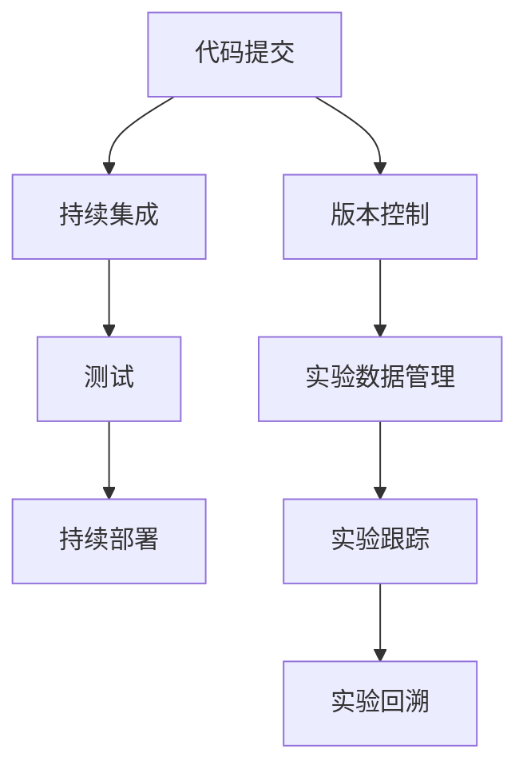
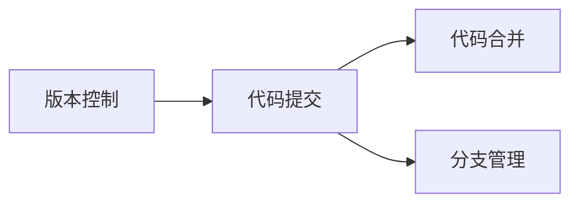
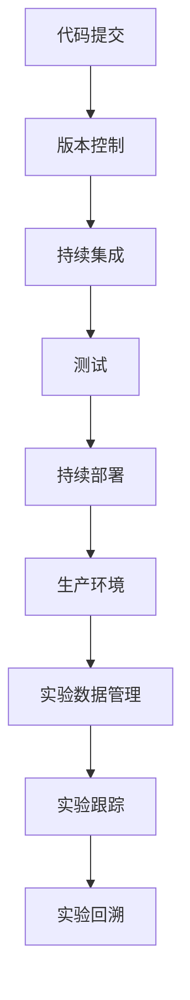

                 

# 实验跟踪与实验管理原理与代码实战案例讲解

> 关键词：实验跟踪,实验管理,Git,版本控制,CI/CD,测试驱动开发(TDD),持续集成,持续部署

## 1. 背景介绍

### 1.1 问题由来
随着软件项目的复杂度不断增加，传统的开发流程难以满足现代软件开发的需求。许多企业为了提升项目质量和开发效率，引入了各种先进的软件开发实践。实验跟踪与实验管理成为其中的关键环节，用于记录、管理和追踪软件开发过程中的一系列实验数据和结果，保证开发过程的透明性和可复现性。

实验跟踪与实验管理涉及软件开发过程中的各个环节，包括代码编写、测试、构建、部署、监控等。其目标是确保每次迭代都是可复现的，及时发现和解决问题，优化开发流程，提升产品质量和开发效率。

## 1.2 问题核心关键点
实验跟踪与实验管理的核心在于：

1. **数据记录与存储**：记录每次实验的详细数据，包括代码变更、测试结果、构建日志、部署信息等。
2. **实验追踪与回溯**：在实验数据中快速定位和追踪问题，以及进行版本回溯和实验重现。
3. **自动化与流水线**：实现从代码提交到最终上线的全自动化流程，包括代码评审、测试、构建、部署等步骤。
4. **持续集成与持续部署(CI/CD)**：通过自动化测试和部署，缩短开发周期，提升产品质量。
5. **敏捷开发与版本控制**：通过迭代开发和版本控制，实现快速迭代和代码管理。

## 1.3 问题研究意义
实验跟踪与实验管理对于提升软件开发效率和质量具有重要意义：

1. **提高开发效率**：通过自动化流程，减少手动操作，提升开发速度。
2. **提升代码质量**：通过自动化测试和代码评审，保证代码质量，减少错误和bug。
3. **优化开发流程**：通过实验数据追踪和回溯，优化开发流程，提升团队协作效率。
4. **保证产品可靠性**：通过持续集成和持续部署，确保每次迭代和发布都是可靠的。
5. **推动技术进步**：通过实验数据积累和分析，推动技术进步和改进。

## 2. 核心概念与联系

### 2.1 核心概念概述

为更好地理解实验跟踪与实验管理，本节将介绍几个密切相关的核心概念：

1. **版本控制**：用于记录软件项目的版本变化，包括代码提交、合并、分支等操作。版本控制工具如Git，帮助团队协同工作，管理代码变更。
2. **持续集成**：将代码提交到代码库后，自动构建和运行测试，验证代码的正确性。持续集成工具如Jenkins、GitLab CI等，用于自动化测试和构建流程。
3. **持续部署**：将经过测试的代码自动部署到生产环境。持续部署工具如GitLab CI、CircleCI等，实现从代码提交到部署的自动化流程。
4. **测试驱动开发(TDD)**：在编写代码前先编写测试用例，确保代码的正确性。测试驱动开发工具如JUnit、pytest等，用于编写和管理测试用例。
5. **实验数据管理**：记录和存储实验数据，包括代码变更、测试结果、构建日志等。实验数据管理工具如JIRA、Confluence等，用于管理和追踪实验数据。
6. **自动化流水线**：构建自动化流程，从代码提交到最终上线的全流程自动化管理。自动化流水线工具如Jenkins、GitLab CI等，用于实现自动化构建、测试和部署流程。

这些核心概念之间的逻辑关系可以通过以下Mermaid流程图来展示：



这个流程图展示了一连串实验跟踪与实验管理的关键流程：

1. 代码提交后，记录到版本控制工具中。
2. 代码提交触发持续集成流程，进行自动化测试。
3. 测试通过后，触发持续部署流程，将代码部署到生产环境。
4. 实验数据被记录和管理，用于实验跟踪和回溯。

这些核心概念共同构成了实验跟踪与实验管理的完整生态系统，帮助团队在软件开发过程中高效协作，提升开发效率和产品质量。

### 2.2 概念间的关系

这些核心概念之间存在着紧密的联系，形成了实验跟踪与实验管理的完整框架。下面我们通过几个Mermaid流程图来展示这些概念之间的关系。

#### 2.2.1 版本控制与代码提交



这个流程图展示了版本控制与代码提交的基本流程：代码提交到版本控制工具中，形成版本变更，通过代码合并和分支管理，实现代码的协同工作。

#### 2.2.2 持续集成与持续部署


这个流程图展示了从代码提交到持续部署的完整流程：代码提交到版本控制工具中，触发持续集成流程，进行自动化测试，测试通过后触发持续部署流程，将代码部署到生产环境。

#### 2.2.3 测试驱动开发与代码提交


这个流程图展示了测试驱动开发的流程：编写测试用例，编写代码，代码提交后触发持续集成流程，进行自动化测试。

### 2.3 核心概念的整体架构

最后，我们用一个综合的流程图来展示这些核心概念在大规模软件开发过程中的整体架构：



这个综合流程图展示了从代码提交到最终上线的完整流程，其中实验跟踪与实验管理作为重要组成部分，记录和追踪实验数据，帮助团队及时发现和解决问题。

## 3. 核心算法原理 & 具体操作步骤
### 3.1 算法原理概述

实验跟踪与实验管理涉及的核心算法原理主要包括：

1. **版本控制算法**：记录和管理代码变更，保证代码的完整性和可追溯性。
2. **持续集成算法**：自动化构建和测试流程，验证代码的正确性。
3. **持续部署算法**：自动化部署流程，将代码部署到生产环境。
4. **测试驱动开发算法**：在编写代码前编写测试用例，确保代码的正确性。
5. **实验数据管理算法**：记录和管理实验数据，用于实验跟踪和回溯。

这些算法原理的共同目标是实现从代码提交到最终上线的全自动化流程，提升开发效率和代码质量。

### 3.2 算法步骤详解

基于上述核心算法原理，实验跟踪与实验管理的具体操作步骤可以归纳为以下几步：

1. **代码提交与版本控制**：
   - 开发者将代码变更提交到版本控制工具（如Git）中，记录代码变更历史。
   - 触发持续集成流程，进行自动化构建和测试。

2. **持续集成与测试**：
   - 在持续集成流程中，进行代码构建、测试和代码评审。
   - 使用测试框架（如JUnit、pytest）编写和执行测试用例，验证代码的正确性。

3. **持续部署与生产环境**：
   - 测试通过后，触发持续部署流程，将代码部署到生产环境。
   - 使用持续部署工具（如Jenkins、GitLab CI）实现自动化部署流程。

4. **实验数据管理与实验跟踪**：
   - 记录每次实验的详细数据，包括代码变更、测试结果、构建日志等。
   - 使用实验数据管理工具（如JIRA、Confluence）记录和存储实验数据，用于实验跟踪和回溯。

5. **实验回溯与问题定位**：
   - 在出现问题时，通过实验数据管理工具快速定位问题。
   - 进行版本回溯，查看每次代码变更和测试结果，分析问题原因。

### 3.3 算法优缺点

实验跟踪与实验管理的主要优点包括：

1. **提高开发效率**：通过自动化流程，减少手动操作，提升开发速度。
2. **提升代码质量**：通过自动化测试和代码评审，保证代码质量，减少错误和bug。
3. **优化开发流程**：通过实验数据追踪和回溯，优化开发流程，提升团队协作效率。
4. **保证产品可靠性**：通过持续集成和持续部署，确保每次迭代和发布都是可靠的。

但同时，这些方法也存在一些缺点：

1. **学习成本较高**：新技术和新工具的使用需要一定的学习成本，团队需要花费时间和精力进行培训。
2. **资源消耗较大**：持续集成和持续部署需要大量的计算资源，尤其是在大项目中。
3. **复杂性较高**：实验跟踪与实验管理涉及多个环节，流程复杂，需要精心设计和维护。
4. **可能存在错误**：自动化流程虽然提升了效率，但也增加了出错的可能性，需要及时发现和修复。

### 3.4 算法应用领域

实验跟踪与实验管理在软件开发领域具有广泛的应用：

1. **企业级应用开发**：适用于企业级应用系统，如ERP、CRM、HR等。
2. **互联网产品开发**：适用于互联网产品开发，如社交网络、电商平台、在线广告等。
3. **移动应用开发**：适用于移动应用开发，如iOS、Android应用等。
4. **游戏开发**：适用于游戏开发，如PC游戏、手机游戏等。
5. **嵌入式系统开发**：适用于嵌入式系统开发，如汽车电子、物联网设备等。

## 4. 数学模型和公式 & 详细讲解 & 举例说明

### 4.1 数学模型构建

本节将使用数学语言对实验跟踪与实验管理的基本模型进行更加严格的刻画。

假设我们有一个软件开发项目，其版本控制工具为Git，持续集成工具为Jenkins，持续部署工具为Jenkins，测试框架为JUnit。项目开发过程中，我们记录每次代码提交的版本信息、测试结果、构建日志等，用于实验跟踪和回溯。

定义变量：
- $v_i$ 为第 $i$ 次代码提交的版本信息。
- $t_i$ 为第 $i$ 次测试的结果，可以是通过/失败。
- $b_i$ 为第 $i$ 次构建的日志信息。

### 4.2 公式推导过程

以持续集成为例，其基本模型为：

$$
t_i = f(v_i, b_i)
$$

其中 $f$ 为持续集成算法，根据版本信息和构建日志，判断测试是否通过。

对于每个版本 $v_i$，持续集成算法 $f$ 可以分解为以下几个步骤：

1. 代码构建：将代码变更提交到版本控制工具中，触发持续集成流程。
2. 测试执行：执行测试用例，验证代码的正确性。
3. 代码评审：进行代码评审，确保代码质量。
4. 测试结果输出：根据测试结果，输出 $t_i$。

### 4.3 案例分析与讲解

假设我们在Git项目中使用JUnit编写和执行测试用例，触发持续集成流程。测试用例的执行结果为 $t_i$，构建日志为 $b_i$。其基本模型可以表示为：

$$
t_i = \begin{cases}
\text{通过} & \text{如果测试用例执行成功} \\
\text{失败} & \text{如果测试用例执行失败}
\end{cases}
$$

其中，$b_i$ 表示测试执行时的构建日志，用于分析测试结果的原因。

## 5. 项目实践：代码实例和详细解释说明
### 5.1 开发环境搭建

在进行实验跟踪与实验管理实践前，我们需要准备好开发环境。以下是使用Git进行版本控制的环境配置流程：

1. 安装Git：从官网下载并安装Git。
2. 配置Git：使用 `git init` 命令初始化项目，设置Git用户名和邮箱。
3. 创建代码仓库：使用 `git remote add origin <repository_url>` 命令将本地仓库与远程仓库关联。

完成上述步骤后，即可在本地仓库中进行代码编写和提交。

### 5.2 源代码详细实现

下面我们以Jenkins持续集成为例，给出使用Git进行版本控制的PyTorch代码实现。

首先，定义持续集成的配置文件 `Jenkinsfile`：

```groovy
pipeline {
    agent any
    stages {
        stage('Build') {
            steps {
                echo '开始构建...'
                git branch: 'master', url: 'https://github.com/<username>/<repository>.git', credentialsId: 'your-jenkins-credentials-id'
                sh 'mvn clean install'
            }
        }
        stage('Test') {
            steps {
                echo '开始测试...'
                sh 'mvn test'
            }
        }
        stage('Deploy') {
            steps {
                echo '开始部署...'
                sh 'mvn deploy:deploy'
            }
        }
    }
}
```

然后，在Jenkins中配置持续集成流程：

1. 在Jenkins首页，创建新项目，选择 `Pipeline` 流水线。
2. 将 `Jenkinsfile` 配置文件作为项目的流水线脚本。
3. 配置构建、测试和部署的命令和参数。
4. 保存配置，运行持续集成流程。

### 5.3 代码解读与分析

让我们再详细解读一下关键代码的实现细节：

**Jenkinsfile**：
- `pipeline` 定义流水线，指定构建代理为 `any`，即在任意机器上运行。
- `stages` 定义流水线的三个阶段：构建、测试、部署。
- 每个阶段使用 `echo` 命令输出构建信息，使用 `git` 命令执行代码构建、测试和部署。

**Jenkins配置**：
- 在Jenkins首页创建新项目，选择 `Pipeline` 流水线。
- 将 `Jenkinsfile` 配置文件作为项目的流水线脚本。
- 配置构建、测试和部署的命令和参数，如 `mvn clean install` 表示执行Maven构建命令。
- 保存配置，运行持续集成流程。

**运行结果展示**：
- 在Jenkins的控制台或日志文件中，可以看到每个阶段的构建信息、测试结果和部署日志。
- 使用 `mvn deploy:deploy` 命令将代码部署到生产环境。

可以看到，通过Jenkins和Git的结合，我们可以实现从代码提交到最终上线的全自动化流程，大大提升了开发效率和代码质量。

## 6. 实际应用场景
### 6.1 持续集成系统

持续集成系统是实验跟踪与实验管理的核心组件，用于自动化构建和测试流程。持续集成系统可以广泛应用于各种软件开发项目，如企业级应用、互联网产品、移动应用、游戏开发等。

在企业级应用开发中，持续集成系统用于自动化构建和测试，确保每次迭代和发布都是可靠的。持续集成系统记录每次代码提交的详细日志，用于实验追踪和回溯，帮助团队快速定位和解决问题。

在互联网产品开发中，持续集成系统用于自动化测试和部署，提升产品上线速度和稳定性。持续集成系统记录每次测试的结果，分析测试失败的根本原因，优化测试用例。

在移动应用开发中，持续集成系统用于自动化构建和部署，快速推出新版本。持续集成系统记录每次构建的日志信息，分析构建失败的原因，优化构建流程。

在游戏开发中，持续集成系统用于自动化测试和部署，提升游戏发布的效率和质量。持续集成系统记录每次测试的结果，分析测试失败的原因，优化游戏开发流程。

### 6.2 持续部署系统

持续部署系统用于自动化部署流程，将代码部署到生产环境。持续部署系统可以广泛应用于各种软件开发项目，如企业级应用、互联网产品、移动应用、游戏开发等。

在企业级应用开发中，持续部署系统用于自动化部署代码，确保每次迭代和发布都是可靠的。持续部署系统记录每次部署的日志信息，用于实验追踪和回溯，帮助团队快速定位和解决问题。

在互联网产品开发中，持续部署系统用于自动化部署代码，提升产品上线速度和稳定性。持续部署系统记录每次部署的日志信息，分析部署失败的原因，优化部署流程。

在移动应用开发中，持续部署系统用于自动化部署代码，快速推出新版本。持续部署系统记录每次部署的日志信息，分析部署失败的原因，优化部署流程。

在游戏开发中，持续部署系统用于自动化部署代码，提升游戏发布的效率和质量。持续部署系统记录每次部署的日志信息，分析部署失败的原因，优化游戏开发流程。

### 6.3 测试驱动开发系统

测试驱动开发系统用于编写和执行测试用例，验证代码的正确性。测试驱动开发系统可以广泛应用于各种软件开发项目，如企业级应用、互联网产品、移动应用、游戏开发等。

在企业级应用开发中，测试驱动开发系统用于编写和执行测试用例，确保代码的正确性。测试驱动开发系统记录每次测试的结果，用于实验追踪和回溯，帮助团队快速定位和解决问题。

在互联网产品开发中，测试驱动开发系统用于编写和执行测试用例，提升产品上线速度和稳定性。测试驱动开发系统记录每次测试的结果，分析测试失败的原因，优化测试用例。

在移动应用开发中，测试驱动开发系统用于编写和执行测试用例，快速推出新版本。测试驱动开发系统记录每次测试的结果，分析测试失败的原因，优化测试流程。

在游戏开发中，测试驱动开发系统用于编写和执行测试用例，提升游戏发布的效率和质量。测试驱动开发系统记录每次测试的结果，分析测试失败的原因，优化游戏开发流程。

### 6.4 实验数据管理系统

实验数据管理系统用于记录和存储实验数据，包括代码变更、测试结果、构建日志等。实验数据管理系统可以广泛应用于各种软件开发项目，如企业级应用、互联网产品、移动应用、游戏开发等。

在企业级应用开发中，实验数据管理系统用于记录和存储每次实验的详细数据，用于实验跟踪和回溯，帮助团队快速定位和解决问题。

在互联网产品开发中，实验数据管理系统用于记录和存储每次实验的详细数据，分析实验结果，优化开发流程。

在移动应用开发中，实验数据管理系统用于记录和存储每次实验的详细数据，分析实验结果，优化开发流程。

在游戏开发中，实验数据管理系统用于记录和存储每次实验的详细数据，分析实验结果，优化游戏开发流程。

## 7. 工具和资源推荐
### 7.1 学习资源推荐

为了帮助开发者系统掌握实验跟踪与实验管理的技术基础和实践技巧，这里推荐一些优质的学习资源：

1. 《Git入门与实践》书籍：介绍Git的基本操作和高级用法，适合初学者和进阶者阅读。
2. 《持续集成与持续部署实践》书籍：深入讲解持续集成和持续部署的原理和实践，适合中级和高级开发者阅读。
3. 《测试驱动开发》书籍：介绍测试驱动开发的理念和实践，适合所有开发者阅读。
4. 《Jenkins官方文档》：Jenkins的官方文档，提供了全面的配置和管理指导，适合所有Jenkins用户阅读。
5. 《GitLab官方文档》：GitLab的官方文档，提供了全面的配置和管理指导，适合所有GitLab用户阅读。

通过这些资源的学习实践，相信你一定能够快速掌握实验跟踪与实验管理的精髓，并用于解决实际的软件开发问题。

### 7.2 开发工具推荐

高效的开发离不开优秀的工具支持。以下是几款用于实验跟踪与实验管理开发的常用工具：

1. Git：开源版本控制工具，广泛用于代码管理和协作。
2. Jenkins：开源持续集成工具，支持丰富的插件和扩展。
3. GitLab：开源持续集成和持续部署工具，提供全栈DevOps平台。
4. Maven：开源项目管理工具，用于构建和部署Java项目。
5. JUnit：开源测试框架，支持单元测试、集成测试和性能测试。
6. Docker：开源容器化工具，支持跨平台、跨环境的应用部署。

合理利用这些工具，可以显著提升实验跟踪与实验管理任务的开发效率，加快创新迭代的步伐。

### 7.3 相关论文推荐

实验跟踪与实验管理技术的发展源于学界的持续研究。以下是几篇奠基性的相关论文，推荐阅读：

1. "Continuous Integration: A discipline for simultaneous parallel programming"：Duke L. Clark，Rudi P. Grimm，Dorothy S. Walther，1994年。该论文定义了持续集成和持续部署的概念，奠定了持续集成技术的基础。
2. "Incremental Software Development: The Spiral Model"：Rational Software Corporation，1991年。该论文介绍了螺旋模型，一种基于持续集成和持续部署的软件开发方法。
3. "The Role of Software Testing in the Development Process"：P.H. McLean，1997年。该论文分析了软件测试在软件开发过程中的重要作用，强调了测试驱动开发的重要性。
4. "Automating Software Testing: Passing the Crisis Point"：J.B. Patterns，J.B. Harris，2003年。该论文介绍了自动化测试的概念和实践，推动了持续集成和持续部署的发展。
5. "Version Control with Git"：Eric R. Raymond，2009年。该论文介绍了Git的基本操作和原理，成为Git的入门指南。

这些论文代表了大规模软件开发中实验跟踪与实验管理技术的发展脉络。通过学习这些前沿成果，可以帮助研究者把握学科前进方向，激发更多的创新灵感。

除上述资源外，还有一些值得关注的前沿资源，帮助开发者紧跟实验跟踪与实验管理技术的最新进展，例如：

1. 开源社区：如GitHub、Jenkins、GitLab等，提供丰富的开源工具和代码资源。
2. 技术博客：如Git官方博客、Jenkins官方博客、GitLab官方博客等，分享最新的技术动态和最佳实践。
3. 技术会议：如DevOpsDays、Jenkins User Conference等，汇聚行业专家和开发者，交流经验和成果。
4. 在线课程：如Coursera、edX等平台的计算机科学课程，提供系统的实验跟踪与实验管理知识体系。
5. 技术报告：如Google、Microsoft等公司的技术报告，介绍最新的实验跟踪与实验管理技术。

总之，对于实验跟踪与实验管理技术的学习和实践，需要开发者保持开放的心态和持续学习的意愿。多关注前沿资讯，多动手实践，多思考总结，必将收获满满的成长收益。

## 8. 总结：未来发展趋势与挑战
### 8.1 总结

本文对实验跟踪与实验管理技术进行了全面系统的介绍。首先阐述了实验跟踪与实验管理的背景和意义，明确了其在软件开发过程中的重要作用。其次，从原理到实践，详细讲解了实验跟踪与实验管理的数学原理和关键步骤，给出了实验跟踪与实验管理任务开发的完整代码实例。同时，本文还广泛探讨了实验跟踪与实验管理在多个领域的应用前景，展示了其广阔的适用范围。最后，本文精选了实验跟踪与实验管理技术的各类学习资源，力求为读者提供全方位的技术指引。

通过本文的系统梳理，可以看到，实验跟踪与实验管理技术正在成为软件开发过程中的重要工具，助力企业提升开发效率和产品质量。未来，随着实验跟踪与实验管理技术的不断发展，将会有更多先进的工具和实践涌现，推动软件开发行业的进一步革新。

### 8.2 未来发展趋势

展望未来，实验跟踪与实验管理技术将呈现以下几个发展趋势：

1. **自动化与智能化**：实验跟踪与实验管理将进一步自动化和智能化，使用AI技术进行数据分析和预测，提升流程的自动化水平。
2. **跨平台与跨环境**：实验跟踪与实验管理将支持多种平台和环境，如云平台、边缘计算等，提升灵活性和可扩展性。
3. **大数据与机器学习**：实验跟踪与实验管理将利用大数据和机器学习技术，进行实验数据的分析和挖掘，提升实验结果的洞察力和决策支持。
4. **持续学习与自我优化**：实验跟踪与实验管理将具备持续学习的能力，根据历史数据进行自我优化，提升实验流程的效率和准确性。
5. **知识图谱与专家系统**：实验跟踪与实验管理将引入知识图谱和专家系统，将人类经验和知识融入实验流程，提升实验结果的可靠性。

这些趋势凸显了实验跟踪与实验管理技术的广阔前景。这些方向的探索发展，必将进一步提升软件开发的质量和效率，推动软件开发行业的持续创新。

### 8.3 面临的挑战

尽管实验跟踪与实验管理技术已经取得了显著成就，但在迈向更加智能化和自适应化应用的过程中，它仍面临着诸多挑战：

1. **复杂度增加**：随着项目规模的扩大，实验跟踪与实验管理流程的复杂度不断增加，需要更多的资源和时间进行维护。
2. **数据隐私与安全**：实验跟踪与实验管理涉及大量敏感数据，如代码、测试结果、构建日志等，数据隐私和安全问题亟需解决。
3. **性能瓶颈**：实验跟踪与实验管理流程中的各个环节，如代码构建、测试执行、部署部署等，都可能成为性能瓶颈，需要优化和改进。
4. **兼容性问题**：实验跟踪与实验管理工具和平台的多样性，带来了兼容性问题，需要建立统一的接口和标准。
5. **用户友好性不足**：实验跟踪与实验管理工具的用户界面和操作流程可能过于复杂，需要提升用户体验和易用性。

这些挑战需要技术开发者和业务用户共同面对和解决，以确保实验跟踪与实验管理技术能够持续进步和应用。

### 8.4 研究展望

面向未来，实验跟踪与实验管理技术需要在以下几个

