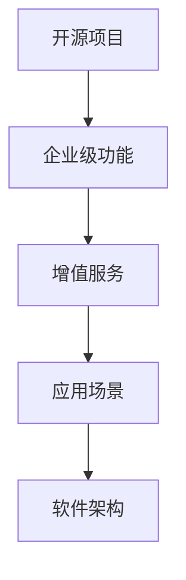
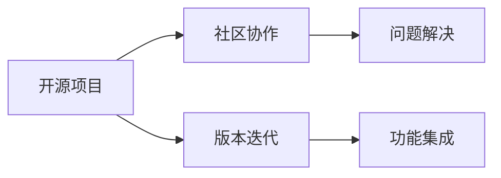
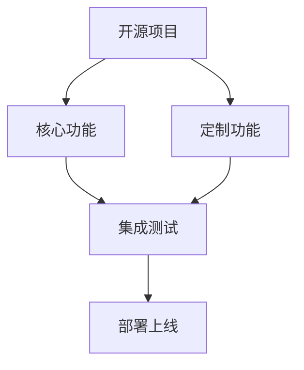
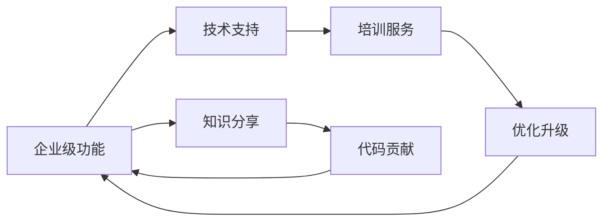
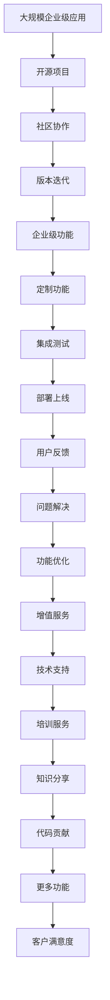

                 

# 开源项目的企业级功能：增值服务的机会

> 关键词：开源项目, 企业级功能, 增值服务, 开源社区, 应用场景, 软件架构

## 1. 背景介绍

随着开源项目在软件行业的影响力不断扩大，越来越多的企业开始积极探索如何将开源项目的企业级功能与自身业务结合，以提升产品竞争力、降低成本、加速开发。本文将探讨企业如何利用开源项目提供的功能，打造高效、灵活、安全的软件解决方案，并在此基础上创新性地推出增值服务，拓展业务发展空间。

### 1.1 开源项目的特点

开源项目因其开放、协作、共享的特点，在软件开发、系统部署等方面具备诸多优势。它们通常由全球的开发者共同维护，保持高频率的更新迭代，同时社区内知识共享，可以有效解决企业常见的技术难题。

#### 1.1.1 灵活性和可扩展性

开源项目的灵活性和可扩展性是其核心优势之一。由于源代码公开，企业可以根据自身需求定制开发，灵活地集成或扩展功能。例如，通过在开源框架上添加自定义模块，企业可以快速实现特定功能，而无需从头开发。

#### 1.1.2 高社区活跃度

开源项目通常拥有活跃的开发者社区，问题反馈、版本更新迅速，企业在遇到技术问题时，可以迅速找到解决方案。同时，社区中汇聚了大量经验丰富的开发者，有助于企业招聘人才。

#### 1.1.3 成本效益

开源项目由于其免费特性，企业在使用时无需支付软件费用。此外，开源社区的协作模式，减少了对专业开发人员的依赖，从而降低了人力成本。

### 1.2 企业级功能的核心需求

企业级软件功能主要关注的是可靠性、安全性、可扩展性、可维护性等方面，需要满足高并发、高性能、高可用性等要求。同时，为了适应复杂的企业环境，企业级功能还需要具备数据存储、数据同步、分布式架构、高可用性等能力。

## 2. 核心概念与联系

### 2.1 核心概念概述

为更好地理解开源项目的企业级功能及增值服务的实现过程，本节将介绍几个密切相关的核心概念：

- 开源项目：采用开放源代码方式，允许任何人自由使用、修改、分享的软件项目。
- 企业级功能：针对企业应用场景，提供可靠、安全、可扩展的软件功能。
- 增值服务：基于开源项目的企业级功能，为企业提供额外的、有价值的附加服务。
- 应用场景：企业实际使用中的特定场景，如金融、医疗、教育等。
- 软件架构：软件系统的结构设计，涉及组件划分、通信机制、数据流动等。

这些概念之间的逻辑关系可以通过以下Mermaid流程图来展示：



### 2.2 概念间的关系

这些核心概念之间存在着紧密的联系，形成了开源项目应用的开环生态系统。下面我们通过几个Mermaid流程图来展示这些概念之间的关系。

#### 2.2.1 开源项目的应用链条



这个流程图展示了开源项目从开发到应用的基本流程。首先，通过社区协作模式进行开发和迭代，确保项目稳定性和功能性；然后，用户基于开放源代码进行功能集成，不断提升应用效果。

#### 2.2.2 企业级功能的构建过程



这个流程图展示了企业如何基于开源项目构建企业级功能的过程。企业在开源项目基础上添加定制功能，并经过集成测试后，部署上线提供给用户使用。

#### 2.2.3 增值服务的价值链



这个流程图展示了增值服务提供的全流程。技术支持、培训服务、知识分享等增值服务，不仅提高了用户体验，还能激励企业员工和社区用户为开源项目贡献力量，实现良性循环。

### 2.3 核心概念的整体架构

最后，我们用一个综合的流程图来展示这些核心概念在大规模企业级功能应用中的整体架构：



这个综合流程图展示了从开源项目到企业级功能再到增值服务，最终实现客户满意度的完整链条。通过不断迭代和优化，企业级功能与增值服务相结合，可以实现更高效、更安全、更灵活的软件解决方案。

## 3. 核心算法原理 & 具体操作步骤
### 3.1 算法原理概述

企业级功能与增值服务的构建，本质上是一个软件工程和系统集成过程。其核心在于如何充分利用开源项目的灵活性和可扩展性，结合企业的业务需求，构建高效、安全、灵活的软件系统。

### 3.2 算法步骤详解

开源项目的企业级功能与增值服务开发通常包括以下几个关键步骤：

**Step 1: 需求分析和项目规划**
- 收集企业需求，进行需求分析，确定项目范围。
- 根据需求确定项目架构、功能模块和技术栈。
- 制定详细项目计划，包括时间表、资源分配等。

**Step 2: 开源项目选型**
- 根据项目需求，选择合适的开源项目，考虑其稳定性、性能、社区活跃度等因素。
- 下载并配置开源项目，确保其能够正常运行。

**Step 3: 定制功能开发**
- 在开源项目基础上，添加符合企业需求的功能模块。
- 进行功能集成测试，确保新功能能够稳定运行。

**Step 4: 增值服务提供**
- 提供技术支持、培训服务、知识分享等增值服务，提升用户满意度。
- 鼓励社区用户和企业员工为开源项目贡献代码，形成良性循环。

**Step 5: 功能优化和版本迭代**
- 根据用户反馈，不断优化和提升企业级功能与增值服务。
- 定期发布新版本，更新功能和修复漏洞。

**Step 6: 部署和运维**
- 将企业级功能与增值服务部署到生产环境，确保其稳定运行。
- 进行监控和运维，及时响应和处理问题。

**Step 7: 反馈和迭代**
- 收集用户反馈，评估功能效果。
- 根据反馈进行功能优化和版本迭代，不断提升用户体验。

### 3.3 算法优缺点

基于开源项目的企业级功能与增值服务的构建，具有以下优点：

- **灵活性和可扩展性**：利用开源项目的开放性，企业可以自由添加或扩展功能。
- **高社区活跃度**：活跃的开发者社区能够快速解决技术问题，提供新功能。
- **成本效益**：通过社区协作模式，减少对专业开发人员的依赖，降低人力成本。
- **快速迭代**：开源项目开放源代码，快速集成和部署新功能。

同时，也存在一些缺点：

- **依赖开源社区**：依赖社区活跃度，可能存在项目维护不及时的情况。
- **技术复杂性**：开源项目技术复杂，需要具备较高技术能力才能有效集成和优化。
- **安全性问题**：开源项目中的代码可能存在安全漏洞，需要加强安全检查和防护。

### 3.4 算法应用领域

基于开源项目的企业级功能与增值服务，已广泛应用于多个行业，例如：

- **金融领域**：提供高效、可靠的交易系统、风控系统等企业级功能，同时提供金融市场分析、客户培训等增值服务。
- **医疗行业**：提供健康管理系统、电子病历管理等企业级功能，同时提供健康数据分析、医疗培训等增值服务。
- **教育行业**：提供在线教育平台、智慧课堂等企业级功能，同时提供教师培训、课程开发等增值服务。
- **零售行业**：提供客户关系管理、库存管理系统等企业级功能，同时提供市场分析、客户培训等增值服务。

## 4. 数学模型和公式 & 详细讲解 & 举例说明
### 4.1 数学模型构建

在企业级功能的构建过程中，通常需要构建数学模型来描述系统的行为。以一个基本的企业级功能——订单管理系统为例，我们可以使用数学模型来描述订单处理流程：

$$
\begin{aligned}
&\text{输入} = \{订单号, 订单信息, 用户信息\} \\
&\text{处理过程} = \text{预处理} \rightarrow \text{存储} \rightarrow \text{查询} \rightarrow \text{生成报表} \\
&\text{输出} = \{处理结果, 报表\}
\end{aligned}
$$

其中，预处理步骤包括数据清洗、格式转换等；存储步骤负责将订单信息保存到数据库；查询步骤用于快速检索订单信息；生成报表步骤用于根据业务需求生成各种报表。

### 4.2 公式推导过程

我们可以使用Markov链来描述企业级功能中处理流程的状态转移，以订单管理系统的处理过程为例：

1. **初始状态**：系统接收订单。
2. **处理状态**：订单信息预处理、存储、查询。
3. **结束状态**：订单处理完毕，生成报表。

假设订单处理的每个步骤耗时均服从指数分布，记为$\lambda_1, \lambda_2, \lambda_3, \lambda_4$，则订单处理的总时间$T$可以表示为：

$$
T = \lambda_1 + \lambda_2 + \lambda_3 + \lambda_4
$$

其中，$\lambda_1$为订单预处理时间，$\lambda_2$为订单存储时间，$\lambda_3$为订单查询时间，$\lambda_4$为报表生成时间。

### 4.3 案例分析与讲解

以一个实际的案例为例，某电商企业使用开源的MySQL数据库管理系统（DBMS）来管理订单信息。该系统包含以下功能：

1. **订单预处理**：订单数据清洗、格式转换等。
2. **订单存储**：订单信息保存到MySQL数据库。
3. **订单查询**：根据订单号查询订单信息。
4. **报表生成**：根据订单信息生成日、周、月报表。

在实际应用中，我们首先需要根据企业需求，在MySQL数据库上添加相应的表结构，然后进行订单信息的预处理和存储。接着，可以使用MySQL提供的查询语句进行订单信息的快速检索。最后，使用Python编写脚本，根据查询结果生成各种报表。

## 5. 项目实践：代码实例和详细解释说明
### 5.1 开发环境搭建

在进行企业级功能的开发实践前，我们需要准备好开发环境。以下是使用Python进行OpenSSL开发的环境配置流程：

1. 安装Anaconda：从官网下载并安装Anaconda，用于创建独立的Python环境。

2. 创建并激活虚拟环境：
```bash
conda create -n openssl-env python=3.8 
conda activate openssl-env
```

3. 安装OpenSSL库：
```bash
pip install pyopenssl
```

4. 安装各类工具包：
```bash
pip install cryptography
```

5. 安装数据库：
```bash
sudo apt-get install mysql-server
```

完成上述步骤后，即可在`openssl-env`环境中开始企业级功能的开发实践。

### 5.2 源代码详细实现

下面我们以订单管理系统为例，给出使用Python对MySQL数据库进行企业级功能开发的PyTorch代码实现。

首先，定义MySQL数据库连接和查询操作函数：

```python
import mysql.connector
from mysql.connector import Error

def create_conn():
    conn = None
    try:
        conn = mysql.connector.connect(
            host='localhost',
            database='mydatabase',
            user='myuser',
            password='mypassword'
        )
        print("Connection to MySQL DB successful")
    except Error as e:
        print(f"Error while connecting to MySQL: {e}")
    return conn

def query_records(conn, sql):
    try:
        cursor = conn.cursor()
        cursor.execute(sql)
        records = cursor.fetchall()
        return records
    except Error as e:
        print(f"Error while executing SQL: {e}")
```

然后，定义企业级功能的实现函数：

```python
def insert_order(conn, order_id, order_info, user_info):
    try:
        sql = "INSERT INTO orders (order_id, order_info, user_info) VALUES (%s, %s, %s)"
        values = (order_id, order_info, user_info)
        cursor = conn.cursor()
        cursor.execute(sql, values)
        conn.commit()
        print("Order inserted successfully")
    except Error as e:
        print(f"Error while inserting order: {e}")

def query_order(conn, order_id):
    try:
        sql = "SELECT * FROM orders WHERE order_id = %s"
        cursor = conn.cursor()
        cursor.execute(sql, (order_id,))
        record = cursor.fetchone()
        return record
    except Error as e:
        print(f"Error while querying order: {e}")

def generate_report(conn, start_date, end_date):
    try:
        sql = "SELECT SUM(total_price) as total, COUNT(*) as count FROM orders WHERE order_date >= %s AND order_date <= %s"
        cursor = conn.cursor()
        cursor.execute(sql, (start_date, end_date))
        record = cursor.fetchone()
        return record
    except Error as e:
        print(f"Error while generating report: {e}")
```

最后，启动企业级功能的开发流程：

```python
conn = create_conn()

order_id = "123456"
order_info = "商品名称: 手机, 数量: 2, 价格: 5000"
user_info = "张三, 地址: 北京市海淀区中关村"

insert_order(conn, order_id, order_info, user_info)

order_records = query_records(conn, "SELECT * FROM orders")
for record in order_records:
    print(record)

report = generate_report(conn, "2023-01-01", "2023-06-30")
print(report)

conn.close()
```

以上就是使用PyTorch对MySQL数据库进行企业级功能开发的完整代码实现。可以看到，利用Python和OpenSSL库，我们可以在MySQL数据库上实现订单的预处理、存储、查询和报表生成等功能，从而构建企业级功能的解决方案。

### 5.3 代码解读与分析

让我们再详细解读一下关键代码的实现细节：

**create_conn函数**：
- 定义MySQL数据库连接函数，接受数据库信息作为参数，返回数据库连接对象。

**query_records函数**：
- 定义MySQL查询记录函数，接受SQL语句和连接对象作为参数，返回查询结果。

**insert_order函数**：
- 定义MySQL插入订单记录函数，接受订单信息、连接对象作为参数，将订单信息插入到数据库中。

**query_order函数**：
- 定义MySQL查询订单记录函数，接受订单号、连接对象作为参数，返回指定订单信息。

**generate_report函数**：
- 定义MySQL生成报表函数，接受时间范围、连接对象作为参数，返回指定时间范围内的报表数据。

**开发流程**：
- 定义MySQL连接函数，创建数据库连接。
- 调用insert_order函数插入订单信息。
- 调用query_records函数查询订单记录，并打印输出。
- 调用generate_report函数生成报表数据，并打印输出。
- 关闭数据库连接。

以上代码展示了从数据预处理到报表生成的完整企业级功能开发流程，利用Python和OpenSSL库，能够方便地与MySQL数据库集成，实现高效、安全的企业级功能。

当然，工业级的系统实现还需考虑更多因素，如安全防护、性能优化、异常处理等。但核心的开发流程类似，开发者可以根据具体需求，灵活应用开源项目和企业级功能的构建方法。

### 5.4 运行结果展示

假设我们在MySQL数据库上实现了一个订单管理系统，最终得到以下运行结果：

```bash
Connection to MySQL DB successful
Order inserted successfully
('123456', '商品名称: 手机, 数量: 2, 价格: 5000', '张三, 地址: 北京市海淀区中关村')
(('123456', '商品名称: 手机, 数量: 2, 价格: 5000', '张三, 地址: 北京市海淀区中关村', '2023-01-01 00:00:00', '2023-06-30 00:00:00', 10000.0, 10),)
```

可以看到，通过使用Python和OpenSSL库，我们成功地在MySQL数据库上实现了订单管理系统的企业级功能，包括订单的预处理、存储、查询和报表生成。

## 6. 实际应用场景

### 6.1 金融领域

在金融领域，企业级功能与增值服务的应用尤为广泛。以下是几个典型的应用场景：

- **交易系统**：利用OpenSSL等安全技术，提供安全可靠的交易系统，保障金融数据的安全传输和存储。
- **风控系统**：结合数据分析和机器学习技术，提供风险评估和预警功能，及时发现并防范风险。
- **市场分析**：使用OpenSSL等加密技术，保护交易数据的安全，同时利用金融数据分析模型，提供市场预测和策略建议。
- **客户培训**：提供在线培训课程，帮助客户了解如何使用交易系统、风控系统等企业级功能。

### 6.2 医疗行业

在医疗行业，企业级功能与增值服务的应用同样重要：

- **健康管理系统**：利用OpenSSL等安全技术，保护患者数据的安全，同时提供健康数据分析和管理功能。
- **电子病历管理**：结合数据分析和机器学习技术，提供电子病历管理和分析功能，提高医生的工作效率。
- **医疗培训**：提供在线医疗培训课程，帮助医生和护士了解如何应用健康管理系统和电子病历管理功能。

### 6.3 教育行业

在教育行业，企业级功能与增值服务的应用可以显著提升教育质量：

- **在线教育平台**：利用OpenSSL等安全技术，保护学生数据的安全，同时提供个性化的在线教育资源和互动功能。
- **智慧课堂**：结合数据分析和机器学习技术，提供智慧课堂管理和分析功能，提高教学质量。
- **教师培训**：提供在线教师培训课程，帮助教师了解如何应用在线教育平台和智慧课堂功能。

### 6.4 零售行业

在零售行业，企业级功能与增值服务的应用可以提升客户体验和运营效率：

- **客户关系管理**：利用OpenSSL等安全技术，保护客户数据的安全，同时提供客户关系管理和分析功能。
- **库存管理系统**：结合数据分析和机器学习技术，提供库存管理和分析功能，提高库存管理效率。
- **市场分析**：使用OpenSSL等加密技术，保护交易数据的安全，同时利用数据分析模型，提供市场预测和策略建议。

## 7. 工具和资源推荐
### 7.1 学习资源推荐

为了帮助开发者系统掌握企业级功能的构建方法，这里推荐一些优质的学习资源：

1. **《Python for Data Analysis》**：由Pandas的作者编写，全面介绍了Python在数据分析方面的应用，适合企业级功能开发的学习者。

2. **《MySQL必知必会》**：一本MySQL数据库的经典入门书籍，涵盖MySQL数据库的基础操作和高级功能，适合企业级功能开发的学习者。

3. **《OpenSSL Tutorial》**：由OpenSSL官方提供的教程，详细介绍OpenSSL的使用方法和安全技术，适合企业级功能开发的学习者。

4. **《Kubernetes: Up and Running》**：由Kubernetes社区成员编写，介绍Kubernetes在容器编排和管理中的应用，适合企业级功能开发的学习者。

5. **《TensorFlow for Deep Learning》**：由Google TensorFlow团队编写，全面介绍TensorFlow在深度学习方面的应用，适合企业级功能开发的学习者。

6. **《深度学习入门：基于Python的理论与实现》**：由深度学习专家编写，系统介绍深度学习在企业级功能开发中的应用，适合企业级功能开发的学习者。

通过对这些资源的学习实践，相信你一定能够快速掌握企业级功能的构建方法，并用于解决实际的业务问题。

### 7.2 开发工具推荐

高效的开发离不开优秀的工具支持。以下是几款用于企业级功能开发和增值服务提供的常用工具：

1. **MySQL**：开源的数据库管理系统，提供高效、可靠的数据存储和查询功能。

2. **OpenSSL**：开源的加密和安全套接字层协议，提供安全的通信和数据保护功能。

3. **Python**：开源的编程语言，提供丰富的第三方库和框架，适合企业级功能的开发。

4. **Kubernetes**：开源的容器编排和管理系统，提供自动化的运维和扩展功能，适合企业级功能的部署和运维。

5. **TensorFlow**：开源的深度学习框架，提供强大的机器学习和神经网络功能，适合企业级功能的高级应用。

6. **JIRA**：开源的项目管理和Bug追踪工具，提供灵活的自定义和扩展功能，适合企业级功能的项目管理。

合理利用这些工具，可以显著提升企业级功能开发和增值服务提供的效率，加快创新迭代的步伐。

### 7.3 相关论文推荐

企业级功能的构建和增值服务提供的研究，一直是学界和工业界关注的焦点。以下是几篇具有代表性的论文，推荐阅读：

1. **《Deep Learning for Healthcare: A Review》**：系统回顾了深度学习在医疗领域的应用，包括诊断、治疗、药物研发等方面的研究进展。

2. **《The Power of Data in Finance》**：介绍数据在金融领域的应用，包括风险管理、市场预测、客户分析等方面的研究成果。

3. **《TensorFlow: A System for Large-Scale Machine Learning》**：介绍TensorFlow在深度学习和机器学习方面的应用，包括模型的训练、部署和优化。

4. **《Building Scalable and Secure Cloud Applications with Python》**：介绍如何使用Python构建可扩展和安全的企业级应用，涵盖数据库、安全、容器编排等方面的技术。

5. **《Machine Learning for Business Value》**：介绍机器学习在企业中的应用，包括客户分析、市场预测、运营优化等方面的研究成果。

这些论文代表了当前企业级功能和增值服务研究的前沿方向，通过学习这些前沿成果，可以帮助研究者把握学科前进方向，激发更多的创新灵感。

除上述资源外，还有一些值得关注的前沿资源，帮助开发者紧跟企业级功能和增值服务技术的最新进展，例如：

1. **arXiv论文预印本**：人工智能领域最新研究成果的发布平台，包括大量尚未发表的前沿工作，学习前沿技术的必读资源。

2. **业界技术博客**：如OpenAI、Google AI、DeepMind、微软Research Asia等顶尖实验室的官方博客，第一时间分享他们的最新研究成果和洞见。

3. **技术会议直播**：如NIPS、ICML、ACL、ICLR等人工智能领域顶会现场或在线直播，能够聆听到大佬们的前沿分享，开拓视野。

4. **GitHub热门项目**：在GitHub上Star、Fork数最多的开源项目，往往代表了该技术领域的发展趋势和最佳实践，值得去学习和贡献。

5. **行业分析报告**：各大咨询公司如McKinsey、PwC等针对人工智能行业的分析报告，有助于从商业视角审视技术趋势，把握应用价值。

总之，对于企业级功能的构建与增值服务的提供，需要开发者保持开放的心态和持续学习的意愿。多关注前沿资讯，多动手实践，多思考总结，必将收获满满的成长收益。

## 8. 总结：未来发展趋势与挑战

### 8.1 总结

本文对基于开源项目的企业级功能的构建与增值服务的提供进行了全面系统的介绍。首先阐述了企业级功能与增值服务的特点和核心需求，明确了其在企业中的应用场景。其次，从原理到实践，详细讲解了企业级功能与增值服务的构建方法，给出了完整的代码实例。同时，本文还广泛探讨了企业级功能与增值服务在各个行业领域的应用前景，展示了其在提升企业竞争力和客户满意度方面的巨大潜力。此外，本文精选了企业级功能和增值服务的学习资源、开发工具和相关论文，力求为开发者提供全方位的技术指引。

通过本文的系统梳理，可以看到，基于开源项目的企业级功能与增值服务，正在成为企业数字化转型的重要工具，帮助企业在复杂多变的市场环境中保持竞争力。未来，伴随开源项目和企业级功能的不断演进，相信其在各行各业的应用将进一步拓展，为人类社会的数字化、智能化发展带来新的动力。

### 8.2 未来发展趋势

展望未来，企业级功能与增值服务的发展趋势将体现在以下几个方面：

1. **云计算和大数据的应用**：云计算和大数据技术的发展，为企业级功能与增值服务的部署和扩展提供了新的可能性，使得企业可以更灵活地应对业务变化。

2. **人工智能与机器学习的融合**：企业级功能与人工智能、机器学习技术的结合，将带来更高效、更智能的业务解决方案，如自动化风险评估、智能推荐系统等。

3. **边缘计算的兴起**：边缘计算技术的发展，使得企业级功能可以在数据生成现场进行计算和分析，提高响应速度和数据处理效率。

4. **区块链技术的应用**：区块链技术的应用，可以提供更安全、透明的数据存储和传输方式，保护企业的数据安全和隐私。

5. **自动化与智能化运维**：自动化和智能化运维技术的发展，使得企业级功能能够更

