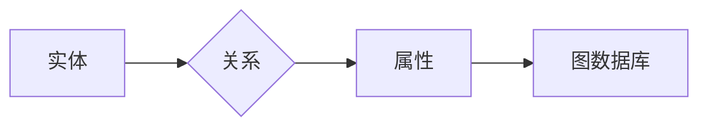

# 知识表示与知识图谱原理与代码实战案例讲解

> 关键词：知识表示，知识图谱，图数据库，实体，关系，语义网络，RDF，OWL，Neo4j，图算法

## 1. 背景介绍

随着信息技术的飞速发展，人类积累了海量的数据。如何有效地组织和利用这些数据，使其成为可理解和可操作的知识，成为了一个重要的问题。知识表示与知识图谱技术应运而生，它们提供了一种结构化的方法来表示和存储知识，为数据驱动的决策和智能系统的构建提供了强大的支持。

### 1.1 问题的由来

在传统的数据管理系统中，数据通常以表格形式存储，虽然方便了数据的检索和查询，但难以表达数据之间的复杂关系和语义。知识表示与知识图谱技术通过将数据转化为语义丰富的知识结构，使得数据的理解和应用变得更加智能。

### 1.2 研究现状

知识表示与知识图谱技术已经广泛应用于各个领域，包括但不限于：

- 智能搜索与推荐
- 语义搜索引擎
- 自然语言处理
- 医学信息学
- 金融风控
- 基因组学

### 1.3 研究意义

知识表示与知识图谱技术的研究和应用于以下方面具有重要意义：

- 提高数据的可用性和可理解性
- 支持智能决策和智能系统的构建
- 促进跨领域知识的整合和共享
- 为数据驱动的创新提供支持

### 1.4 本文结构

本文将分为以下几个部分：

- 介绍知识表示与知识图谱的核心概念和原理
- 讲解知识图谱的构建方法和图算法
- 通过代码实战案例展示知识图谱的应用
- 探讨知识图谱技术的未来发展趋势和挑战

## 2. 核心概念与联系

### 2.1 核心概念原理

知识表示与知识图谱的核心概念包括：

- **实体**：知识图谱中的基本元素，可以是任何有意义的对象，如人、地点、组织、概念等。
- **关系**：实体之间的关系，用于描述实体之间的相互作用或关联。
- **属性**：实体的属性或特征，如人的年龄、地点的纬度等。

知识图谱通常使用图数据库来存储和查询，其中图是由节点（实体）和边（关系）构成的。

### 2.2 核心概念架构的 Mermaid 流程图



## 3. 核心算法原理 & 具体操作步骤

### 3.1 算法原理概述

知识图谱构建的核心算法包括：

- **实体识别**：从非结构化数据中识别出实体。
- **关系抽取**：从文本中抽取实体之间的关系。
- **实体链接**：将文本中的实体与知识图谱中的实体进行匹配。
- **属性抽取**：从文本中抽取实体的属性。

### 3.2 算法步骤详解

1. **数据预处理**：清洗和标准化数据，为后续处理做准备。
2. **实体识别**：使用命名实体识别（NER）技术识别文本中的实体。
3. **关系抽取**：使用关系抽取技术从文本中抽取实体之间的关系。
4. **实体链接**：将抽取出的实体与知识图谱中的实体进行匹配。
5. **属性抽取**：使用属性抽取技术从文本中抽取实体的属性。
6. **知识图谱构建**：将实体、关系和属性存储到图数据库中。

### 3.3 算法优缺点

**优点**：

- 结构化表示，便于存储和查询。
- 提供语义丰富的知识表示。
- 支持复杂关系的表达。

**缺点**：

- 数据预处理复杂。
- 关系抽取和实体链接的准确性受文本质量影响。
- 知识图谱构建需要大量人工干预。

### 3.4 算法应用领域

知识图谱构建算法在以下领域有广泛应用：

- 智能搜索引擎
- 问答系统
- 语义分析
- 数据挖掘
- 智能推荐

## 4. 数学模型和公式 & 详细讲解 & 举例说明

### 4.1 数学模型构建

知识图谱的数学模型可以表示为：

$$
G = (V, E, P)
$$

其中：

- $V$ 是实体集合。
- $E$ 是关系集合。
- $P$ 是属性集合。

### 4.2 公式推导过程

知识图谱的构建过程可以通过以下步骤推导：

1. **实体识别**：使用NER技术将文本中的实体识别出来。
2. **关系抽取**：使用关系抽取技术从文本中抽取实体之间的关系。
3. **实体链接**：使用实体链接技术将实体与知识图谱中的实体进行匹配。
4. **属性抽取**：使用属性抽取技术从文本中抽取实体的属性。
5. **知识图谱构建**：将实体、关系和属性存储到图数据库中。

### 4.3 案例分析与讲解

假设我们有一个关于电影的简单知识图谱，包含以下实体和关系：

- 实体：电影、导演、演员、类型
- 关系：导演、演员、类型

以下是一个RDF（Resource Description Framework）表示的知识图谱示例：

```xml
<rdf:Description rdf:about="http://example.com/movie/Avatar">
  <director rdf:resource="http://example.com/person/James_Cameron"/>
  <actors rdf:resource="http://example.com/person/Sigourney_Weaver"/>
  <actors rdf:resource="http://example.com/person/Stephen_Lang"/>
  <genre rdf:resource="http://example.com/genre/Sci-Fi"/>
</rdf:Description>
```

## 5. 项目实践：代码实例和详细解释说明

### 5.1 开发环境搭建

为了进行知识图谱的实践，我们需要以下开发环境：

- Python编程语言
- 图数据库（如Neo4j）
- NLP库（如spaCy、NLTK）

### 5.2 源代码详细实现

以下是一个使用Python和Neo4j构建知识图谱的简单示例：

```python
from py2neo import Graph, Node, Relationship

# 连接到Neo4j数据库
graph = Graph("bolt://localhost:7687", auth=("neo4j", "password"))

# 创建实体节点
director = Node("Person", name="James Cameron")
actors = Node("Person", name="Sigourney Weaver")
actors2 = Node("Person", name="Stephen Lang")
genre = Node("Genre", name="Sci-Fi")

# 创建关系
director.create()
actors.create()
actors2.create()
genre.create()

# 添加关系
graph.create(Relationship(director, "DIRECTED", actors))
graph.create(Relationship(director, "DIRECTED", actors2))
graph.create(Relationship(actors, "ACTED_IN", genre))
graph.create(Relationship(actors2, "ACTED_IN", genre))

# 查询实体
director = graph.nodes.match("Person", name="James Cameron").first()
actors = graph.nodes.match("Person", name="Sigourney Weaver").first()
actors2 = graph.nodes.match("Person", name="Stephen Lang").first()
genre = graph.nodes.match("Genre", name="Sci-Fi").first()

# 打印查询结果
print(director.name)
print(actors.name)
print(actors2.name)
print(genre.name)
```

### 5.3 代码解读与分析

上述代码首先连接到Neo4j数据库，然后创建实体节点，包括导演、演员和类型。接着创建关系，将导演与演员关联起来，并将演员与类型关联起来。最后，查询并打印出实体的信息。

### 5.4 运行结果展示

运行上述代码后，Neo4j数据库将包含一个包含导演、演员和类型的关系图。可以通过Neo4j浏览器查看图的结构和内容。

## 6. 实际应用场景

知识图谱技术在以下领域有广泛的应用：

- **智能搜索引擎**：通过知识图谱，搜索引擎可以提供更加准确和相关的搜索结果。
- **问答系统**：知识图谱可以用于构建智能问答系统，回答用户的问题。
- **推荐系统**：知识图谱可以用于构建推荐系统，推荐用户可能感兴趣的内容。
- **知识发现**：知识图谱可以用于发现数据中的新模式和趋势。

### 6.4 未来应用展望

未来，知识图谱技术将在以下方面得到进一步发展：

- **多语言支持**：支持更多的语言，以构建多语言知识图谱。
- **跨领域融合**：将知识图谱应用于更多的领域，实现跨领域的知识整合。
- **知识自动化生成**：通过机器学习技术自动化生成知识图谱。
- **知识图谱可视化**：提供更加直观的知识图谱可视化工具。

## 7. 工具和资源推荐

### 7.1 学习资源推荐

- 《图数据库权威指南》
- 《图算法》
- 《知识图谱：原理、方法与应用》

### 7.2 开发工具推荐

- Neo4j
- RDF
- OWL
- Apache Jena

### 7.3 相关论文推荐

- "Linked Data: The Story So Far"
- "A Large-scale Knowledge Graph: YAGO 3"
- "Freebase: A Collaboratively Created Database for Machines to Read and Write"

## 8. 总结：未来发展趋势与挑战

### 8.1 研究成果总结

知识表示与知识图谱技术为数据驱动的决策和智能系统的构建提供了强大的支持。通过将数据转化为语义丰富的知识结构，知识图谱技术提高了数据的可用性和可理解性。

### 8.2 未来发展趋势

未来，知识图谱技术将在以下方面得到进一步发展：

- **多语言支持**
- **跨领域融合**
- **知识自动化生成**
- **知识图谱可视化**

### 8.3 面临的挑战

知识图谱技术面临的挑战包括：

- **数据质量**：知识图谱的质量取决于数据的质量。
- **知识表示**：如何有效地表示和存储知识是一个挑战。
- **推理能力**：如何从知识图谱中提取有用的知识是一个挑战。

### 8.4 研究展望

未来，知识图谱技术的研究将主要集中在以下方面：

- **知识自动获取**
- **知识推理**
- **知识融合**

## 9. 附录：常见问题与解答

**Q1：什么是知识表示？**

A：知识表示是人工智能领域的一个分支，它研究如何将知识表示为计算机可以理解和处理的形式。

**Q2：什么是知识图谱？**

A：知识图谱是一种结构化的知识表示方法，它使用实体、关系和属性来表示现实世界中的知识。

**Q3：知识图谱有哪些应用？**

A：知识图谱在智能搜索、问答系统、推荐系统、知识发现等领域有广泛应用。

**Q4：如何构建知识图谱？**

A：构建知识图谱通常包括实体识别、关系抽取、实体链接和属性抽取等步骤。

**Q5：知识图谱与数据库有什么区别？**

A：数据库用于存储和管理数据，而知识图谱用于存储和管理知识。知识图谱更注重语义和关系，而数据库更注重数据的结构。

---

作者：禅与计算机程序设计艺术 / Zen and the Art of Computer Programming