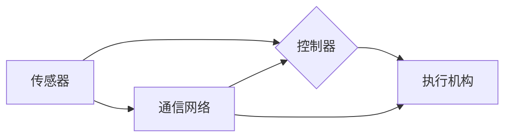

# 自动化领域的最新发展趋势

> 关键词：自动化，人工智能，机器学习，工业4.0，物联网，边缘计算，机器人，自动化控制，智能决策

## 1. 背景介绍

自动化技术自20世纪中叶诞生以来，已经经历了多次变革，从简单的机械自动化到电子自动化，再到今天的智能自动化。随着信息技术的飞速发展，人工智能、机器学习、物联网等技术的融合，自动化领域正迎来前所未有的发展机遇。本文将探讨自动化领域的最新发展趋势，分析其背后的技术原理和未来挑战。

### 1.1 自动化的起源与发展

自动化技术的起源可以追溯到古代的工匠机械，如水力织机、蒸汽机等。随着电力和电子技术的发展，自动化技术逐渐从机械驱动转向电子控制。20世纪中叶，计算机技术的兴起为自动化带来了革命性的变革，出现了可编程逻辑控制器(PLC)、机器人等自动化设备。

### 1.2 自动化技术的发展阶段

1. 第一阶段（20世纪50年代-70年代）：机械自动化阶段。以PLC的发明为代表，实现了生产线的自动化控制。
2. 第二阶段（20世纪80年代-90年代）：电子自动化阶段。计算机技术的应用使得自动化设备更加智能，如CNC机床、工业机器人等。
3. 第三阶段（21世纪初至今）：智能自动化阶段。人工智能、机器学习等技术的融合，使得自动化设备能够进行自主学习和决策。

### 1.3 自动化的意义

自动化技术的发展对人类社会产生了深远的影响，提高了生产效率、降低了生产成本、改善了产品质量，并在医疗、交通、能源等多个领域取得了显著的成果。

## 2. 核心概念与联系

### 2.1 核心概念原理

自动化领域的核心概念主要包括：

- 传感器：用于感知外部环境信息，如温度、压力、光线等。
- 控制器：根据传感器收集的信息，进行决策和指挥执行机构。
- 执行机构：根据控制器的指令，执行具体的动作，如开关、移动、旋转等。
- 通信网络：用于传感器、控制器和执行机构之间的数据传输。

### 2.2 架构的 Mermaid 流程图



## 3. 核心算法原理 & 具体操作步骤

### 3.1 算法原理概述

自动化系统中的核心算法主要包括：

- 控制算法：如PID控制、模糊控制、神经网络控制等，用于实现精确的控制系统。
- 机器学习算法：如监督学习、无监督学习、强化学习等，用于实现智能决策和自主学习。
- 物联网技术：如边缘计算、MQTT、CoAP等，用于实现设备之间的数据传输和通信。

### 3.2 算法步骤详解

1. **控制算法**：通过设定目标值和实际值，计算出控制器的输出，实现对执行机构的精确控制。
2. **机器学习算法**：通过收集数据，训练模型，使模型能够自主学习，并在新的环境下进行决策。
3. **物联网技术**：通过建立设备之间的通信网络，实现数据的高速传输和共享。

### 3.3 算法优缺点

- 控制算法：优点是稳定可靠，缺点是难以处理复杂问题和非线性系统。
- 机器学习算法：优点是能够处理复杂问题和非线性系统，缺点是训练数据量大，泛化能力有限。
- 物联网技术：优点是实现设备之间的高速通信，缺点是网络延迟和安全性问题。

### 3.4 算法应用领域

- 控制算法：广泛应用于工业控制、航空航天、汽车制造等领域。
- 机器学习算法：广泛应用于机器人、智能家居、无人驾驶等领域。
- 物联网技术：广泛应用于智能城市、智慧农业、智能医疗等领域。

## 4. 数学模型和公式 & 详细讲解 & 举例说明

### 4.1 数学模型构建

自动化系统的数学模型主要包括：

- 状态空间模型：描述系统状态和输入输出关系。
- 动态系统模型：描述系统动态变化过程。

### 4.2 公式推导过程

以状态空间模型为例，其数学表达式为：

$$
\begin{align*}
\dot{x} &= A\cdot x + B\cdot u \\
y &= C\cdot x + D\cdot u
\end{align*}
$$

其中，$x$ 为系统状态向量，$u$ 为输入向量，$y$ 为输出向量，$A$、$B$、$C$、$D$ 为系统参数。

### 4.3 案例分析与讲解

以PID控制算法为例，其数学表达式为：

$$
u = K_p \cdot e + K_i \cdot \int e \, dt + K_d \cdot \dot{e}
$$

其中，$e$ 为误差，$K_p$、$K_i$、$K_d$ 为PID参数。

PID控制算法通过调整参数，实现对系统的稳定控制。

## 5. 项目实践：代码实例和详细解释说明

### 5.1 开发环境搭建

1. 安装Python环境和相关库，如NumPy、SciPy、Matplotlib等。
2. 准备数据集，如控制系统的输入输出数据。

### 5.2 源代码详细实现

```python
import numpy as np
import matplotlib.pyplot as plt

def pid_control(error, kp, ki, kd, dt):
    de = error - de_last
    output = kp * error + ki * (error * dt) + kd * de
    de_last = error
    return output, de_last

# 初始化参数
kp = 1.0
ki = 0.1
kd = 0.01
de_last = 0.0
dt = 0.1

# 模拟控制系统
time = np.arange(0, 10, dt)
error = np.sin(time)
output = []
for e in error:
    output.append(pid_control(e, kp, ki, kd, dt)[0])

# 绘制结果
plt.plot(time, error, label='Error')
plt.plot(time, output, label='Output')
plt.legend()
plt.show()
```

### 5.3 代码解读与分析

该代码实现了简单的PID控制算法，通过模拟控制系统，展示了PID控制算法的原理和应用。

### 5.4 运行结果展示

运行代码后，可以得到误差和输出曲线，展示了PID控制算法对系统误差的调节效果。

## 6. 实际应用场景

### 6.1 工业自动化

工业自动化是自动化技术的传统应用领域，如PLC、机器人、自动生产线等。

### 6.2 智能家居

智能家居通过物联网技术，实现家庭设备的互联互通，如智能照明、智能安防、智能家电等。

### 6.3 智能交通

智能交通通过传感器、摄像头等设备，实现交通信号的智能控制和交通状态的实时监测。

### 6.4 智能医疗

智能医疗通过人工智能技术，实现疾病诊断、治疗方案推荐、健康管理等。

## 7. 工具和资源推荐

### 7.1 学习资源推荐

1. 《自动化原理与应用》
2. 《机器学习》
3. 《物联网技术》
4. 《Python编程：从入门到实践》

### 7.2 开发工具推荐

1. MATLAB
2. Python
3. ROS（机器人操作系统）
4. TensorFlow
5. PyTorch

### 7.3 相关论文推荐

1. 《深度强化学习》
2. 《物联网安全》
3. 《智能家居》
4. 《智能交通》
5. 《智能医疗》

## 8. 总结：未来发展趋势与挑战

### 8.1 研究成果总结

自动化领域近年来取得了显著的成果，人工智能、机器学习、物联网等技术的融合，使得自动化设备更加智能、高效、可靠。

### 8.2 未来发展趋势

1. 智能化：自动化设备将更加智能，能够自主学习和决策。
2. 网络化：自动化设备将通过物联网实现互联互通，形成智能网络。
3. 灵活性：自动化系统将更加灵活，适应不同的应用场景。
4. 智能化决策：自动化设备将具备更强的智能决策能力。

### 8.3 面临的挑战

1. 数据安全和隐私保护
2. 算法可靠性和可解释性
3. 硬件和软件的集成
4. 跨领域知识融合

### 8.4 研究展望

未来，自动化领域将继续朝着智能化、网络化、灵活化、智能化决策的方向发展。同时，需要克服数据安全、算法可靠、软硬件集成、跨领域知识融合等挑战，推动自动化技术更好地服务于人类社会。

## 9. 附录：常见问题与解答

**Q1：自动化技术是否会被人工智能取代？**

A：自动化技术和人工智能是相辅相成的。人工智能技术可以提升自动化设备的智能化水平，而自动化技术则可以为人工智能提供更加可靠和高效的执行平台。

**Q2：物联网技术对自动化有哪些影响？**

A：物联网技术使得自动化设备之间能够实现高速通信和互联互通，从而实现更复杂的自动化应用。

**Q3：如何确保自动化系统的安全性和可靠性？**

A：确保自动化系统的安全性和可靠性需要从硬件、软件、数据等多个层面进行综合考量，包括加强硬件防护、优化软件设计、数据加密等。

**Q4：自动化技术如何应用于人工智能领域？**

A：自动化技术可以应用于人工智能领域的硬件设备、实验平台、数据处理等方面，为人工智能研究提供更加可靠和高效的支撑。

**Q5：未来自动化技术将如何发展？**

A：未来自动化技术将朝着智能化、网络化、灵活化、智能化决策的方向发展，为人类社会带来更加便捷、高效、智能的生产和生活体验。

---

作者：禅与计算机程序设计艺术 / Zen and the Art of Computer Programming