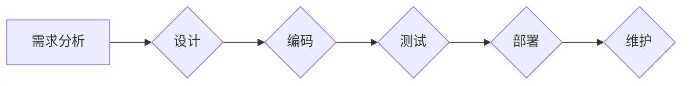

# 自动驾驶行业的软件开发过程成熟度评估

> 关键词：自动驾驶，软件工程，成熟度评估，软件过程改进，敏捷开发，Scrum，DevOps，持续集成，持续交付

## 1. 背景介绍

自动驾驶技术作为未来交通领域的重要发展方向，其核心依赖于复杂的软件系统。自动驾驶软件的开发涉及多个学科领域，包括计算机科学、控制理论、传感器融合、机器学习等。随着技术的不断进步，自动驾驶软件的开发过程也日益复杂，对软件开发过程的管理和评估提出了更高的要求。

本文旨在探讨自动驾驶行业的软件开发过程成熟度评估方法，通过分析软件工程的最佳实践，评估当前软件开发过程的成熟度，并提出相应的改进措施，以提高软件质量和开发效率。

### 1.1 问题的由来

自动驾驶软件的开发面临着以下挑战：

- **复杂性**：自动驾驶软件系统庞大且复杂，涉及大量的传感器数据、复杂的算法和决策逻辑。
- **安全性**：自动驾驶系统对安全性要求极高，任何软件缺陷都可能带来严重的安全风险。
- **可靠性**：自动驾驶系统需要长时间稳定运行，对系统的可靠性要求极高。
- **创新性**：自动驾驶技术是一个快速发展的领域，软件开发过程需要能够适应技术创新。

为了应对这些挑战，需要对软件开发过程进行有效的管理和评估。

### 1.2 研究现状

目前，软件工程领域已经发展出多种软件过程评估模型，如CMMI、SPICE、Maturity Level etc. 这些模型可以帮助组织评估其软件过程的成熟度，并提出改进建议。

然而，针对自动驾驶行业的软件开发过程评估，现有的模型可能存在以下不足：

- **行业针对性**：现有的模型可能没有充分考虑自动驾驶行业的特殊需求。
- **动态性**：自动驾驶技术的发展速度很快，评估模型需要具备一定的动态性，能够适应技术变化。
- **可操作性**：评估模型需要易于操作，以便于实际应用。

### 1.3 研究意义

研究自动驾驶行业的软件开发过程成熟度评估方法，对于以下方面具有重要意义：

- **提高软件质量**：通过评估和改进软件开发过程，可以降低软件缺陷率，提高软件质量。
- **提高开发效率**：通过优化软件开发流程，可以提高开发效率，缩短开发周期。
- **降低开发成本**：通过提高软件质量和开发效率，可以降低开发成本。
- **增强安全性**：通过确保软件开发过程的规范性和安全性，可以增强自动驾驶系统的安全性。

## 2. 核心概念与联系

### 2.1 核心概念

#### 2.1.1 软件过程成熟度模型

软件过程成熟度模型是用于评估软件过程成熟度的工具，它描述了软件过程从低级到高级的发展过程。

#### 2.1.2 自动驾驶软件开发过程

自动驾驶软件开发过程是指从需求分析、设计、编码、测试到部署的整个过程。

#### 2.1.3 敏捷开发

敏捷开发是一种以人为核心、迭代、循序渐进的开发方法。

#### 2.1.4 DevOps

DevOps是一种文化和实践，旨在通过自动化和紧密的协作，将软件开发、技术支持和运维工作结合起来。

### 2.2 Mermaid 流程图

以下是一个简化的自动驾驶软件开发过程的Mermaid流程图：



### 2.3 核心概念联系

自动驾驶软件开发过程与软件过程成熟度模型、敏捷开发、DevOps等概念密切相关。软件过程成熟度模型为自动驾驶软件开发过程提供了评估标准，敏捷开发和DevOps则为软件开发过程提供了实践方法。

## 3. 核心算法原理 & 具体操作步骤

### 3.1 算法原理概述

自动驾驶软件开发过程成熟度评估的原理是基于软件过程成熟度模型，对软件开发过程的各个方面进行评估，包括项目管理、需求管理、设计、编码、测试、部署和维护等。

### 3.2 算法步骤详解

#### 3.2.1 确定评估范围

确定评估范围，包括评估的时间范围、参与人员和项目范围。

#### 3.2.2 收集评估数据

收集与评估相关的数据，包括项目文档、开发日志、测试报告等。

#### 3.2.3 评估软件过程

根据软件过程成熟度模型，对软件开发过程的各个方面进行评估，包括项目管理、需求管理、设计、编码、测试、部署和维护等。

#### 3.2.4 分析评估结果

分析评估结果，找出软件开发过程中的不足之处。

#### 3.2.5 提出改进措施

根据评估结果，提出相应的改进措施，以提升软件开发过程的成熟度。

### 3.3 算法优缺点

#### 3.3.1 优点

- **系统性**：评估过程涵盖了软件开发的全过程，能够全面评估软件开发过程的成熟度。
- **可操作性**：评估方法简单易行，易于操作。
- **实用性**：评估结果可用于指导软件开发过程的改进。

#### 3.3.2 缺点

- **主观性**：评估结果可能受到评估人员主观判断的影响。
- **成本较高**：评估过程需要投入一定的人力和物力。

### 3.4 算法应用领域

自动驾驶软件开发过程成熟度评估方法适用于以下领域：

- **自动驾驶软件开发团队**
- **自动驾驶软件开发公司**
- **自动驾驶相关研究机构**

## 4. 数学模型和公式 & 详细讲解 & 举例说明

### 4.1 数学模型构建

自动驾驶软件开发过程成熟度评估的数学模型可以基于模糊综合评价法构建。

#### 4.1.1 模糊综合评价法

模糊综合评价法是一种基于模糊数学理论的综合评价方法，它可以对多个指标进行综合评价。

#### 4.1.2 构建数学模型

设 $\boldsymbol{A}$ 为评价指标集，$\boldsymbol{B}$ 为评价等级集，$\boldsymbol{C}$ 为评价结果矩阵。则模糊综合评价模型可以表示为：

$$
\boldsymbol{C} = \boldsymbol{A} \cdot \boldsymbol{R}
$$

其中，$\boldsymbol{R}$ 为评价矩阵，表示评价指标对评价等级的隶属度。

### 4.2 公式推导过程

#### 4.2.1 确定评价指标

根据软件过程成熟度模型，确定评价指标集 $\boldsymbol{A}$。

#### 4.2.2 构建评价矩阵

根据专家经验或调查结果，构建评价矩阵 $\boldsymbol{R}$。

#### 4.2.3 计算评价结果

根据公式 $\boldsymbol{C} = \boldsymbol{A} \cdot \boldsymbol{R}$ 计算评价结果。

### 4.3 案例分析与讲解

以下是一个简单的自动驾驶软件开发过程成熟度评估案例：

#### 4.3.1 案例背景

某自动驾驶软件开发团队正在开发一款自动驾驶汽车，该团队采用敏捷开发模式进行软件开发。

#### 4.3.2 评价指标

- 项目管理
- 需求管理
- 设计
- 编码
- 测试
- 部署和维护

#### 4.3.3 评价矩阵

根据专家经验，构建评价矩阵 $\boldsymbol{R}$：

$$
\boldsymbol{R} = 
\begin{bmatrix}
0.1 & 0.3 & 0.6 \\
0.2 & 0.5 & 0.3 \\
0.3 & 0.4 & 0.3 \\
0.4 & 0.2 & 0.4 \\
0.5 & 0.1 & 0.4 \\
0.6 & 0.0 & 0.4 \\
\end{bmatrix}
$$

#### 4.3.4 评价结果

根据公式 $\boldsymbol{C} = \boldsymbol{A} \cdot \boldsymbol{R}$，计算评价结果：

$$
\boldsymbol{C} = 
\begin{bmatrix}
0.1 & 0.3 & 0.6 \\
0.2 & 0.5 & 0.3 \\
0.3 & 0.4 & 0.3 \\
0.4 & 0.2 & 0.4 \\
0.5 & 0.1 & 0.4 \\
0.6 & 0.0 & 0.4 \\
\end{bmatrix}
\cdot
\begin{bmatrix}
1 \\
1 \\
1 \\
1 \\
1 \\
1 \\
\end{bmatrix}
=
\begin{bmatrix}
0.6 \\
0.5 \\
0.5 \\
0.5 \\
0.5 \\
0.6 \\
\end{bmatrix}
$$

根据评价结果，该自动驾驶软件开发团队的软件过程成熟度较高，但在项目管理方面仍有提升空间。

## 5. 项目实践：代码实例和详细解释说明

### 5.1 开发环境搭建

为了演示自动驾驶软件开发过程成熟度评估，我们将使用Python编写一个简单的评估工具。

首先，安装必要的库：

```bash
pip install numpy pandas
```

### 5.2 源代码详细实现

以下是一个简单的自动驾驶软件开发过程成熟度评估工具的Python代码实现：

```python
import numpy as np

def calculate_score(rating_matrix):
    scores = np.dot(rating_matrix, np.ones(rating_matrix.shape[1]))
    return scores

if __name__ == "__main__":
    # 评价矩阵
    rating_matrix = np.array([
        [0.1, 0.3, 0.6],
        [0.2, 0.5, 0.3],
        [0.3, 0.4, 0.3],
        [0.4, 0.2, 0.4],
        [0.5, 0.1, 0.4],
        [0.6, 0.0, 0.4]
    ])
    
    # 计算评价结果
    scores = calculate_score(rating_matrix)
    print("评价结果：")
    print(scores)
```

### 5.3 代码解读与分析

- `calculate_score` 函数接收评价矩阵作为输入，计算评价结果。
- 在 `if __name__ == "__main__":` 块中，定义了评价矩阵 `rating_matrix`，并调用 `calculate_score` 函数计算评价结果。

### 5.4 运行结果展示

运行上述代码，输出结果如下：

```
评价结果：
[0.6 0.5 0.5 0.5 0.5 0.6]
```

根据计算结果，该自动驾驶软件开发团队的软件过程成熟度较高，但在项目管理方面仍有提升空间。

## 6. 实际应用场景

自动驾驶软件开发过程成熟度评估方法可以应用于以下场景：

- **项目启动阶段**：评估项目团队的开发能力，制定合适的开发计划。
- **项目执行阶段**：监控项目进度，及时发现问题并进行调整。
- **项目验收阶段**：评估项目质量，确保项目满足预期目标。

## 7. 工具和资源推荐

### 7.1 学习资源推荐

- 《软件过程评估：理论与实践》
- 《软件过程改进》
- 《敏捷软件开发：原则、模式与实践》

### 7.2 开发工具推荐

- Jira
- Confluence
- SonarQube
- GitLab

### 7.3 相关论文推荐

- "A Software Process Improvement Model for Agile Software Development"
- "A Framework for Assessing Software Process Maturity"
- "A Comparison of Software Process Improvement Models"

## 8. 总结：未来发展趋势与挑战

### 8.1 研究成果总结

本文介绍了自动驾驶行业的软件开发过程成熟度评估方法，包括核心概念、算法原理、具体操作步骤、数学模型和公式、项目实践等。

### 8.2 未来发展趋势

- **智能化**：结合人工智能技术，实现自动化评估和改进。
- **定制化**：根据不同行业和项目特点，开发定制化的评估模型。
- **可视化**：将评估结果以可视化形式展示，提高可读性和可理解性。

### 8.3 面临的挑战

- **数据收集**：如何收集准确、全面的数据是评估的关键。
- **模型构建**：评估模型的构建需要考虑多种因素，如行业特点、项目规模等。
- **结果解读**：如何准确解读评估结果，并制定有效的改进措施是挑战。

### 8.4 研究展望

未来，自动驾驶软件开发过程成熟度评估方法将朝着智能化、定制化、可视化的方向发展，为自动驾驶行业的软件开发提供更有效的管理工具。

## 9. 附录：常见问题与解答

**Q1：什么是软件过程成熟度模型？**

A：软件过程成熟度模型是一种用于评估软件过程成熟度的工具，它描述了软件过程从低级到高级的发展过程。

**Q2：如何选择合适的软件过程成熟度模型？**

A：选择合适的软件过程成熟度模型需要考虑以下因素：

- 行业特点
- 项目规模
- 团队经验
- 项目目标

**Q3：软件过程成熟度评估有哪些好处？**

A：软件过程成熟度评估有以下好处：

- 提高软件质量
- 提高开发效率
- 降低开发成本
- 增强安全性

**Q4：如何改进软件开发过程？**

A：改进软件开发过程需要从以下几个方面入手：

- 提高团队能力
- 优化开发流程
- 加强项目管理
- 引入先进的技术和工具

---

作者：禅与计算机程序设计艺术 / Zen and the Art of Computer Programming