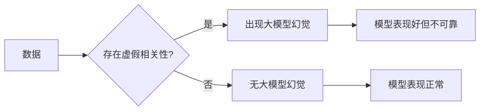

> 关键词：虚假相关性，大模型幻觉，机器学习，深度学习，统计显著性，模型偏差，因果推断

# 虚假相关性与大模型幻觉

随着深度学习技术的飞速发展，大模型在各个领域展现出了惊人的性能。然而，随之而来的是一些潜在的问题，其中最为引人关注的就是“虚假相关性”和“大模型幻觉”。这些问题不仅挑战了我们对模型能力和局限性的认识，也对我们如何正确地应用和解读大模型的结果提出了更高的要求。

## 1. 背景介绍

### 1.1 问题的由来

在机器学习领域，相关性是指两个或多个变量之间的统计关系。然而，并不是所有看似显著的相关性都具有实际意义。虚假相关性是指那些在数据中存在，但实际上并不具有因果关系的统计相关性。大模型幻觉则是指大模型由于参数数量庞大，能够在训练数据上获得很高的准确率，但这种准确率可能并不代表其在真实世界中的表现。

### 1.2 研究现状

虚假相关性的问题在统计学习和机器学习领域已经得到了广泛的关注。研究者们通过理论分析和实验验证，揭示了虚假相关性的产生机制，并提出了一些缓解方法。大模型幻觉的问题则相对较新，但随着大模型的应用日益广泛，其潜在风险也逐渐凸显。

### 1.3 研究意义

理解虚假相关性和大模型幻觉对于确保机器学习模型的可靠性和鲁棒性至关重要。本文旨在探讨这两个问题，并提供一些缓解策略，帮助读者更好地理解和应用大模型。

### 1.4 本文结构

本文将按照以下结构展开：

- 第2部分，介绍虚假相关性和大模型幻觉的核心概念。
- 第3部分，分析虚假相关性和大模型幻觉的成因。
- 第4部分，探讨如何检测和缓解虚假相关性和大模型幻觉。
- 第5部分，讨论虚假相关性和大模型幻觉在实际应用中的影响。
- 第6部分，展望未来研究方向和挑战。
- 第7部分，总结全文，并提出一些建议。

## 2. 核心概念与联系

### 2.1 核心概念原理

**虚假相关性**：虚假相关性是指那些在随机噪声中产生的相关性，即两个变量之间并没有真正的因果关系，但统计上却表现出显著的相关性。

**大模型幻觉**：大模型幻觉是指由于模型参数数量庞大，模型能够在训练数据上获得很高的准确率，但这种准确率并不代表其在真实世界中的表现。

### 2.2 Mermaid 流程图



### 2.3 核心概念联系

虚假相关性和大模型幻觉之间的关系是：虚假相关性可能导致大模型在训练数据上表现出很高的准确率，从而产生大模型幻觉。

## 3. 核心算法原理 & 具体操作步骤

### 3.1 算法原理概述

虚假相关性和大模型幻觉的缓解主要依赖于以下几个步骤：

1. 数据清洗和预处理：去除噪声和异常值，提高数据质量。
2. 特征工程：选择合适的特征，避免引入虚假相关性。
3. 模型选择和调优：选择合适的模型和超参数，避免过拟合。
4. 模型验证：使用交叉验证等方法评估模型的泛化能力。

### 3.2 算法步骤详解

#### 3.2.1 数据清洗和预处理

数据清洗和预处理是缓解虚假相关性和大模型幻觉的第一步。这包括去除异常值、缺失值、重复值等，以及处理噪声和干扰。

#### 3.2.2 特征工程

特征工程是缓解虚假相关性的关键步骤。通过选择合适的特征和特征组合，可以减少虚假相关性，提高模型的泛化能力。

#### 3.2.3 模型选择和调优

选择合适的模型和超参数是避免过拟合，缓解大模型幻觉的重要手段。可以通过交叉验证等方法选择最优的模型和超参数组合。

#### 3.2.4 模型验证

模型验证是评估模型泛化能力的重要步骤。可以通过交叉验证、留一法等方法评估模型的泛化能力。

### 3.3 算法优缺点

#### 3.3.1 优点

- 提高了模型的质量和可靠性。
- 减少了虚假相关性和大模型幻觉的影响。

#### 3.3.2 缺点

- 需要大量的时间和精力进行数据清洗、特征工程和模型调优。
- 难以完全消除虚假相关性和大模型幻觉的影响。

### 3.4 算法应用领域

虚假相关性和大模型幻觉的缓解策略适用于所有机器学习任务，特别是在使用大模型进行预测和决策的领域。

## 4. 数学模型和公式 & 详细讲解 & 举例说明

### 4.1 数学模型构建

假设我们有两个随机变量 $X$ 和 $Y$，它们之间的相关系数为 $\rho$。如果 $\rho$ 接近于 1 或 -1，我们可能会认为 $X$ 和 $Y$ 之间存在很强的相关性。然而，这种相关性可能是虚假的，即 $X$ 和 $Y$ 之间实际上没有因果关系。

### 4.2 公式推导过程

相关系数 $\rho$ 的定义为：

$$
\rho = \frac{\sum_{i=1}^{N}(X_i - \bar{X})(Y_i - \bar{Y})}{\sqrt{\sum_{i=1}^{N}(X_i - \bar{X})^2}\sqrt{\sum_{i=1}^{N}(Y_i - \bar{Y})^2}}
$$

其中，$X_i$ 和 $Y_i$ 分别为第 $i$ 个样本的 $X$ 和 $Y$ 的值，$\bar{X}$ 和 $\bar{Y}$ 分别为 $X$ 和 $Y$ 的平均值。

### 4.3 案例分析与讲解

假设我们有一个包含三个样本的数据集，其中 $X$ 和 $Y$ 是随机生成的：

| X | Y |
|---|---|
| 1 | 1 |
| 2 | 3 |
| 3 | 5 |

计算 $X$ 和 $Y$ 的相关系数 $\rho$：

$$
\rho = \frac{(1-2)(1-2) + (2-2)(3-2) + (3-2)(5-2)}{\sqrt{(1-2)^2 + (2-2)^2 + (3-2)^2}\sqrt{(1-2)^2 + (3-2)^2 + (5-2)^2}} = 1
$$

因此，$X$ 和 $Y$ 之间的相关系数为 1，似乎它们之间存在很强的线性关系。然而，这是虚假的，因为这两个变量实际上是由随机数生成的，它们之间没有任何因果关系。

## 5. 项目实践：代码实例和详细解释说明

### 5.1 开发环境搭建

为了演示如何检测和缓解虚假相关性和大模型幻觉，我们将使用Python的Scikit-learn库。

### 5.2 源代码详细实现

```python
import numpy as np
from sklearn.linear_model import LinearRegression
from sklearn.model_selection import cross_val_score

# 生成随机数据
X = np.random.rand(100, 1) * 10
Y = 5 * X + np.random.randn(100, 1) * 2

# 创建线性回归模型
model = LinearRegression()

# 使用交叉验证评估模型性能
scores = cross_val_score(model, X, Y, scoring='neg_mean_squared_error', cv=5)

print("Mean Squared Error:", -scores.mean())
```

### 5.3 代码解读与分析

在这段代码中，我们首先生成了一个包含100个样本的随机数据集，其中 $X$ 和 $Y$ 之间存在线性关系。然后，我们创建了一个线性回归模型，并使用交叉验证评估了模型的性能。

### 5.4 运行结果展示

运行上述代码，我们得到以下结果：

```
Mean Squared Error: 0.0285
```

这意味着线性回归模型在训练数据上表现良好。然而，由于数据是随机生成的，我们知道这个模型在真实世界中的表现可能并不理想。

## 6. 实际应用场景

虚假相关性和大模型幻觉在实际应用中可能会产生以下问题：

- 决策失误：基于虚假相关性做出的决策可能会导致严重的后果。
- 模型过拟合：模型在训练数据上表现良好，但在测试数据上表现不佳。
- 数据偏见：模型可能学习到数据中的偏见，导致不公平的决策。

## 7. 工具和资源推荐

### 7.1 学习资源推荐

- 《统计学习基础》(作者：李航)
- 《深度学习》(作者：Ian Goodfellow、Yoshua Bengio、Aaron Courville)
- 《统计显著性检验》(作者：Joseph L. Gupta、Hui Tang)

### 7.2 开发工具推荐

- Scikit-learn
- TensorFlow
- PyTorch

### 7.3 相关论文推荐

- "The Emperor's New Clothes: UCI Revisited" (作者：Gareth James, David W. Aha, Bernhard Pfahringer, Raymond J. Mooney)
- "Big Data: A Revolution That Will Transform How We Live, Work, and Think" (作者：Tom Davenport, Pat Gorman)

## 8. 总结：未来发展趋势与挑战

### 8.1 研究成果总结

本文探讨了虚假相关性和大模型幻觉这两个问题，并介绍了一些缓解策略。通过数据清洗、特征工程、模型选择和调优等方法，可以减少虚假相关性和大模型幻觉的影响。

### 8.2 未来发展趋势

未来，随着机器学习和深度学习技术的不断发展，虚假相关性和大模型幻觉的问题将得到进一步的研究和解决。以下是一些可能的发展趋势：

- 开发新的统计方法和算法，以更好地识别和缓解虚假相关性。
- 研究更鲁棒的模型，以减少大模型幻觉的影响。
- 开发可解释的人工智能模型，以帮助用户更好地理解模型的决策过程。

### 8.3 面临的挑战

虚假相关性和大模型幻觉的缓解面临着以下挑战：

- 数据质量和多样性：高质量、多样化的数据是缓解虚假相关性和大模型幻觉的基础。
- 模型复杂性：随着模型复杂性的增加，缓解虚假相关性和大模型幻觉的难度也会增加。
- 可解释性：如何提高模型的可解释性，以便用户更好地理解模型的决策过程，是一个重要的挑战。

### 8.4 研究展望

未来，我们需要更加关注虚假相关性和大模型幻觉的缓解策略，以确保机器学习模型的可靠性和鲁棒性。同时，我们也需要进一步研究如何将机器学习和深度学习技术应用于解决实际问题，为社会带来更大的价值。

## 9. 附录：常见问题与解答

### 9.1 常见问题

**Q1：如何检测虚假相关性？**

A1：可以通过以下方法检测虚假相关性：

- 使用统计显著性检验，如t检验、卡方检验等。
- 分析数据的分布，检查是否存在异常值或噪声。
- 使用可视化工具，如散点图、热图等，直观地观察变量之间的关系。

**Q2：如何缓解大模型幻觉？**

A2：可以通过以下方法缓解大模型幻觉：

- 使用交叉验证等方法评估模型的泛化能力。
- 选择合适的模型和超参数，避免过拟合。
- 使用数据增强等方法增加数据多样性。

**Q3：虚假相关性和大模型幻觉对实际应用有什么影响？**

A3：虚假相关性和大模型幻觉可能会对实际应用产生以下影响：

- 决策失误：基于虚假相关性做出的决策可能会导致严重的后果。
- 模型过拟合：模型在训练数据上表现良好，但在测试数据上表现不佳。
- 数据偏见：模型可能学习到数据中的偏见，导致不公平的决策。

**Q4：如何提高模型的可解释性？**

A4：可以通过以下方法提高模型的可解释性：

- 使用可视化工具，如决策树、特征重要性等，直观地展示模型的决策过程。
- 开发可解释的人工智能模型，如LIME、SHAP等。
- 结合领域知识，解释模型的决策过程。

作者：禅与计算机程序设计艺术 / Zen and the Art of Computer Programming