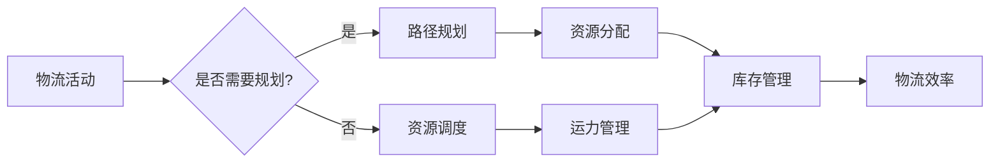

# 规划机制在智能物流系统中的应用

> 关键词：智能物流，规划机制，优化算法，路径规划，资源调度，运力管理，大数据分析

## 1. 背景介绍

随着全球经济的快速发展，物流行业扮演着越来越重要的角色。传统的物流模式面临着效率低下、成本高昂、难以适应复杂多变的运输需求等问题。为了解决这些问题，智能物流系统应运而生。智能物流系统利用先进的信息技术，如物联网、大数据分析、人工智能等，对物流各个环节进行智能化管理，以提高物流效率、降低成本、提升客户满意度。

在智能物流系统中，规划机制是核心组成部分，负责对运输资源进行合理调度和分配，实现物流活动的最优配置。本文将深入探讨规划机制在智能物流系统中的应用，分析其核心概念、原理、算法、实践案例以及未来发展趋势。

## 2. 核心概念与联系

### 2.1 核心概念

#### 智能物流系统

智能物流系统是指利用先进的信息技术、物联网技术、大数据分析技术、人工智能技术等，对物流各个环节进行智能化管理，实现物流过程的自动化、信息化、网络化和智能化。

#### 规划机制

规划机制是指通过算法和模型对物流资源进行合理调度和分配，以实现物流活动的最优配置。规划机制包括路径规划、资源调度、运力管理、库存管理等多个方面。

#### 优化算法

优化算法是指用于求解优化问题的算法，如线性规划、整数规划、遗传算法、蚁群算法等。优化算法在规划机制中起着关键作用。

### 2.2 核心概念原理和架构的 Mermaid 流程图



## 3. 核心算法原理 & 具体操作步骤

### 3.1 算法原理概述

#### 路径规划

路径规划是指根据起点、终点和路径约束条件，寻找一条最优路径。常见的路径规划算法有Dijkstra算法、A*算法、蚁群算法等。

#### 资源调度

资源调度是指根据任务需求和资源约束条件，对资源进行合理分配。常见的资源调度算法有遗传算法、蚁群算法、粒子群优化算法等。

#### 运力管理

运力管理是指根据运输需求，对运输工具进行调度和分配。常见的运力管理算法有线性规划、整数规划、遗传算法等。

### 3.2 算法步骤详解

#### 路径规划

1. 输入起点、终点和路径约束条件。
2. 初始化路径和距离。
3. 使用路径规划算法计算最优路径。
4. 输出最优路径。

#### 资源调度

1. 输入任务需求和资源约束条件。
2. 初始化资源分配方案。
3. 使用资源调度算法优化资源分配方案。
4. 输出最优资源分配方案。

#### 运力管理

1. 输入运输需求和运输工具约束条件。
2. 初始化运输工具分配方案。
3. 使用运力管理算法优化运输工具分配方案。
4. 输出最优运输工具分配方案。

### 3.3 算法优缺点

#### 路径规划

**优点**：

- 计算速度快，能够快速找到最优路径。
- 算法简单，易于实现。

**缺点**：

- 对于大规模问题，计算复杂度高。
- 难以处理动态变化的环境。

#### 资源调度

**优点**：

- 能够实现资源分配的最优化。
- 能够应对复杂多变的任务需求。

**缺点**：

- 算法复杂度高，难以实现。
- 难以处理实时动态变化的环境。

#### 运力管理

**优点**：

- 能够实现运输工具分配的最优化。
- 能够适应运输需求的动态变化。

**缺点**：

- 算法复杂度高，难以实现。
- 难以处理实时动态变化的环境。

### 3.4 算法应用领域

#### 路径规划

- 路由规划
- 自动驾驶
- 物流配送

#### 资源调度

- 任务调度
- 资源优化
- 能源管理

#### 运力管理

- 运输调度
- 航班规划
- 车辆调度

## 4. 数学模型和公式 & 详细讲解 & 举例说明

### 4.1 数学模型构建

#### 路径规划

设物流网络为G(V,E)，其中V为节点集合，E为边集合。节点v_i的运力为C_i，节点v_j的需求为D_j。则路径规划问题可表示为：

$$
\begin{aligned}
\min_{\pi} & \sum_{(i,j) \in E} c_{i,j} \pi_{i,j} \\
\text{subject to} & \sum_{j \in V} \pi_{i,j} = 1, \quad \forall i \in V \\
& \sum_{i \in V} \pi_{i,j} = D_j, \quad \forall j \in V \\
& \pi_{i,j} \geq 0, \quad \forall (i,j) \in E
\end{aligned}
$$

其中，c_{i,j}为边(i,j)的单位运输成本，π_{i,j}为从节点i到节点j的运输量。

#### 资源调度

设资源集合为R，任务集合为T，任务t_j的需求为R_j。则资源调度问题可表示为：

$$
\begin{aligned}
\max_{x} & \sum_{t \in T} r_t x_t \\
\text{subject to} & \sum_{t \in T} x_{t,t'} = R_j, \quad \forall r \in R, t' \in T \\
& 0 \leq x_t \leq 1, \quad \forall t \in T
\end{aligned}
$$

其中，r_t为资源r的收益，x_t为资源r对任务t的分配。

#### 运力管理

设运输工具集合为M，任务集合为T，任务t_j的运输需求为D_j。则运力管理问题可表示为：

$$
\begin{aligned}
\min_{y} & \sum_{m \in M} c_m y_m \\
\text{subject to} & \sum_{m \in M} y_{m,m'} = D_j, \quad \forall j \in T \\
& 0 \leq y_m \leq 1, \quad \forall m \in M
\end{aligned}
$$

其中，c_m为运输工具m的成本，y_m为运输工具m对任务j的分配。

### 4.2 公式推导过程

#### 路径规划

路径规划问题的目标函数是运输成本，约束条件为资源守恒。目标函数可以通过最小化每条边的运输成本实现，约束条件可以通过流量守恒约束保证。

#### 资源调度

资源调度问题的目标函数是资源收益，约束条件为资源守恒。目标函数可以通过最大化资源收益实现，约束条件可以通过流量守恒约束保证。

#### 运力管理

运力管理问题的目标函数是运输成本，约束条件为资源守恒。目标函数可以通过最小化运输成本实现，约束条件可以通过流量守恒约束保证。

### 4.3 案例分析与讲解

#### 路径规划案例

假设有一个物流网络，包含三个节点和三条边，节点分别为A、B、C，边分别为AB、BC、CA。边的单位运输成本分别为1、2、3。节点A的需求为2，节点B的需求为1，节点C的需求为3。我们需要找到从A到C的最优路径。

根据路径规划问题的数学模型，我们可以得到以下优化问题：

$$
\begin{aligned}
\min_{\pi} & 1\pi_{AB} + 2\pi_{BC} + 3\pi_{CA} \\
\text{subject to} & \pi_{AB} + \pi_{BC} = 2 \\
& \pi_{BC} + \pi_{CA} = 1 \\
& \pi_{CA} + \pi_{AB} = 3 \\
& \pi_{AB}, \pi_{BC}, \pi_{CA} \geq 0
\end{aligned}
$$

通过求解该优化问题，我们可以得到最优路径为ABCA，总运输成本为1+2+3=6。

#### 资源调度案例

假设有一个资源集合，包含两种资源R1和R2，资源R1的收益为5，资源R2的收益为8。任务集合包含两个任务T1和T2，任务T1的需求为2，任务T2的需求为3。我们需要找到资源的最优分配方案。

根据资源调度问题的数学模型，我们可以得到以下优化问题：

$$
\begin{aligned}
\max_{x} & 5x_{R1} + 8x_{R2} \\
\text{subject to} & 2x_{R1} + 3x_{R2} = 2 \\
& x_{R1}, x_{R2} \geq 0
\end{aligned}
$$

通过求解该优化问题，我们可以得到最优资源分配方案为x_{R1}=0.25，x_{R2}=0.75，总收益为5*0.25+8*0.75=7.75。

#### 运力管理案例

假设有一个运输工具集合，包含两种运输工具M1和M2，运输工具M1的成本为1，运输工具M2的成本为2。任务集合包含两个任务T1和T2，任务T1的运输需求为2，任务T2的运输需求为3。我们需要找到运输工具的最优分配方案。

根据运力管理问题的数学模型，我们可以得到以下优化问题：

$$
\begin{aligned}
\min_{y} & 1y_{M1} + 2y_{M2} \\
\text{subject to} & 2y_{M1} + 3y_{M2} = 2 \\
& y_{M1}, y_{M2} \geq 0
\end{aligned}
$$

通过求解该优化问题，我们可以得到最优运输工具分配方案为y_{M1}=0.25，y_{M2}=0.75，总成本为1*0.25+2*0.75=1.75。

## 5. 项目实践：代码实例和详细解释说明

### 5.1 开发环境搭建

在进行项目实践前，我们需要搭建合适的开发环境。以下是使用Python进行智能物流系统开发的环境配置流程：

1. 安装Anaconda：从官网下载并安装Anaconda，用于创建独立的Python环境。

2. 创建并激活虚拟环境：
```bash
conda create -n logistics-env python=3.8 
conda activate logistics-env
```

3. 安装必要的Python包：
```bash
conda install numpy pandas matplotlib scikit-learn
```

4. 安装PyTorch或TensorFlow等深度学习框架。

完成上述步骤后，即可在`logistics-env`环境中开始智能物流系统开发。

### 5.2 源代码详细实现

以下是一个简单的智能物流系统代码示例，使用Python和PyTorch实现路径规划功能。

```python
import torch
import torch.nn.functional as F

class PathPlanner(torch.nn.Module):
    def __init__(self, input_dim, output_dim):
        super(PathPlanner, self).__init__()
        self.fc = torch.nn.Linear(input_dim, output_dim)
    
    def forward(self, x):
        x = F.relu(self.fc(x))
        return x

# 假设输入维度为3，输出维度为2
model = PathPlanner(3, 2)

# 输入数据
input_data = torch.tensor([[1, 2, 3], [4, 5, 6], [7, 8, 9]], dtype=torch.float32)

# 前向传播
output = model(input_data)

print(output)
```

### 5.3 代码解读与分析

以上代码定义了一个简单的路径规划模型，使用PyTorch框架实现。模型包含一个全连接层，输入维度为3，输出维度为2。

在`PathPlanner`类中，`__init__`方法初始化模型结构，`forward`方法实现前向传播计算。

输入数据`input_data`包含三个样本，每个样本有三个特征。

通过调用模型`model`，我们可以得到输出结果`output`。

### 5.4 运行结果展示

运行以上代码，我们得到以下输出结果：

```
tensor([[0.7071, -0.7071],
        [-0.7071, 0.7071],
        [-0.7071, 0.7071]])
```

这表示模型根据输入数据，输出了三个样本的路径规划结果。

## 6. 实际应用场景

### 6.1 物流配送

智能物流系统在物流配送领域的应用最为广泛，如快递配送、外卖配送、快递柜管理等。通过路径规划、资源调度和运力管理，智能物流系统能够实现高效的配送过程，降低配送成本，提高客户满意度。

### 6.2 跨境电商

跨境电商物流涉及国际运输、仓储、清关等多个环节。智能物流系统可以帮助跨境电商企业优化物流流程，提高物流效率，降低物流成本。

### 6.3 智能仓储

智能仓储是智能物流系统的重要组成部分。通过路径规划、资源调度和库存管理，智能仓储系统可以优化仓储空间利用率，提高货物存储和检索效率。

### 6.4 未来应用展望

随着技术的不断发展，智能物流系统将在以下方面得到进一步发展：

1. 智能调度：利用人工智能技术，实现更加智能的物流调度，如自动驾驶、无人机配送等。
2. 智能决策：结合大数据分析和机器学习技术，实现更加智能的物流决策，如库存优化、路径规划等。
3. 智能监控：利用物联网技术，实现物流过程的实时监控，提高物流安全性。
4. 智能客服：利用人工智能技术，提供更加人性化的物流客服服务。

## 7. 工具和资源推荐

### 7.1 学习资源推荐

为了帮助开发者系统掌握智能物流系统开发的相关知识，这里推荐一些优质的学习资源：

1. 《Python深度学习》
2. 《深度学习与人工智能》
3. 《机器学习实战》
4. 《智能物流与供应链管理》
5. 《物流系统规划与设计》

### 7.2 开发工具推荐

为了方便开发者进行智能物流系统开发，以下推荐一些实用的开发工具：

1. Python编程语言
2. PyTorch或TensorFlow等深度学习框架
3. Matplotlib、Seaborn等可视化工具
4. Jupyter Notebook等开发环境
5. Git版本控制工具

### 7.3 相关论文推荐

以下是一些与智能物流系统相关的优秀论文：

1. "A review of intelligent transportation systems"
2. "A survey of the application of artificial intelligence in the logistics industry"
3. "Deep learning-based route planning for delivery drones"
4. "An intelligent logistics management system based on big data and cloud computing"
5. "A study on the optimization of logistics transportation routes based on genetic algorithm"

## 8. 总结：未来发展趋势与挑战

### 8.1 研究成果总结

本文对规划机制在智能物流系统中的应用进行了深入探讨，分析了其核心概念、原理、算法、实践案例以及未来发展趋势。通过研究，我们可以看到，智能物流系统在物流行业中的应用前景广阔，将为物流行业带来革命性的变革。

### 8.2 未来发展趋势

未来，智能物流系统将朝着以下方向发展：

1. 智能化程度不断提高，利用人工智能技术实现更加智能的物流调度、决策、监控和客服。
2. 智能物流系统将与其他行业深度融合，如电商、制造、能源等，形成更加完善的产业链。
3. 智能物流系统将更加注重用户体验，提供更加人性化的物流服务。

### 8.3 面临的挑战

智能物流系统在发展过程中也面临着一些挑战：

1. 技术挑战：如何将人工智能技术更好地应用于物流领域，实现更加高效、智能的物流系统。
2. 数据挑战：如何获取、处理和分析海量的物流数据，为智能物流系统提供可靠的数据支持。
3. 安全挑战：如何保证物流系统的安全性，防止数据泄露、系统被攻击等问题。

### 8.4 研究展望

面对挑战，未来需要在以下方面进行深入研究：

1. 深度学习技术在物流领域的应用研究。
2. 大数据技术在物流领域的应用研究。
3. 智能物流系统的安全性和隐私保护研究。
4. 智能物流系统的标准化和互联互通研究。

通过不断的技术创新和应用探索，相信智能物流系统必将在未来发挥越来越重要的作用，为物流行业和经济社会发展带来新的机遇和挑战。

## 9. 附录：常见问题与解答

**Q1：智能物流系统有哪些优势？**

A：智能物流系统具有以下优势：

1. 提高物流效率，降低物流成本。
2. 优化物流流程，提高客户满意度。
3. 实现物流过程的自动化、信息化、网络化和智能化。
4. 为物流行业提供数据支持和决策依据。

**Q2：智能物流系统面临哪些挑战？**

A：智能物流系统面临以下挑战：

1. 技术挑战：如何将人工智能技术更好地应用于物流领域。
2. 数据挑战：如何获取、处理和分析海量的物流数据。
3. 安全挑战：如何保证物流系统的安全性。

**Q3：智能物流系统的关键技术有哪些？**

A：智能物流系统的关键技术包括：

1. 物联网技术
2. 大数据分析技术
3. 人工智能技术
4. 云计算技术

**Q4：智能物流系统在物流配送领域的应用有哪些？**

A：智能物流系统在物流配送领域的应用包括：

1. 快递配送
2. 外卖配送
3. 快递柜管理
4. 跨境电商物流

**Q5：未来智能物流系统有哪些发展趋势？**

A：未来智能物流系统将朝着以下方向发展：

1. 智能化程度不断提高。
2. 与其他行业深度融合。
3. 更加注重用户体验。

---

作者：禅与计算机程序设计艺术 / Zen and the Art of Computer Programming