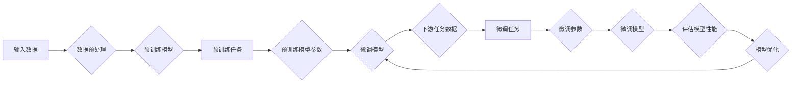

> 大规模语言模型，预训练，微调，迁移学习，自然语言处理，Transformer，BERT，GPT，模型优化，效率提升

## 1. 背景介绍

随着深度学习技术的飞速发展，大规模语言模型（Large Language Models，LLMs）如BERT、GPT-3等在自然语言处理（Natural Language Processing，NLP）领域取得了显著的成果。这些模型通过在海量文本数据上进行预训练，学习到了丰富的语言知识和上下文理解能力，为下游任务的解决方案提供了强大的支持。然而，如何高效地将这些预训练模型应用于特定的任务，实现模型微调（Fine-Tuning）的高效性和准确性，成为了当前研究的热点问题。

## 2. 核心概念与联系

### 2.1 核心概念

#### 预训练（Pre-training）
预训练是指在大规模无标注数据集上训练模型，使其学习到通用的语言表示和知识。常见的预训练任务包括语言建模、掩码语言模型等。

#### 微调（Fine-Tuning）
微调是在预训练模型的基础上，使用下游任务的有标签数据进一步训练模型，使其适应特定任务的需求。

#### 迁移学习（Transfer Learning）
迁移学习是指将一个任务学习到的知识迁移到另一个相关任务中，以减少训练数据量和计算成本。

#### 大规模语言模型（Large Language Model，LLM）
大规模语言模型是指参数量巨大、能够处理和理解复杂语言表达的深度学习模型。

### 2.2 架构流程图

以下是大规模语言模型微调的Mermaid流程图：



## 3. 核心算法原理 & 具体操作步骤

### 3.1 算法原理概述

大规模语言模型微调的原理是在预训练模型的基础上，通过调整模型参数来适应下游任务。具体操作步骤如下：

1. 使用预训练模型在无标注数据集上进行预训练，学习通用语言表示。
2. 将预训练模型应用于下游任务，并使用少量有标签数据进行微调。
3. 根据任务需求调整模型结构或参数，以提高模型在特定任务上的性能。
4. 在验证集上评估模型性能，并根据评估结果对模型进行优化。

### 3.2 算法步骤详解

1. **数据预处理**：对输入数据进行清洗、分词、编码等预处理操作，使其符合模型输入要求。
2. **预训练**：在大量无标注数据上对预训练模型进行训练，学习通用语言表示。
3. **微调**：使用少量有标签数据对预训练模型进行微调，调整模型参数以适应特定任务。
4. **模型优化**：根据任务需求调整模型结构或参数，提高模型性能。
5. **评估模型性能**：在验证集或测试集上评估模型性能，根据评估结果对模型进行优化。
6. **迭代优化**：重复步骤3-5，直至模型性能达到预期。

### 3.3 算法优缺点

#### 优点

- **高效性**：利用预训练模型的知识，在特定任务上微调模型，降低训练数据量和计算成本。
- **准确性**：在大量无标注数据上预训练的模型，能够学习到丰富的语言知识，提高模型在下游任务上的性能。
- **灵活性**：可以根据任务需求调整模型结构或参数，提高模型适应不同任务的能力。

#### 缺点

- **数据需求**：需要大量的有标签数据进行微调，成本较高。
- **计算资源**：微调过程需要大量的计算资源，对硬件要求较高。
- **过拟合**：在少量数据上微调可能导致模型过拟合，影响模型泛化能力。

### 3.4 算法应用领域

大规模语言模型微调广泛应用于以下NLP领域：

- 文本分类
- 命名实体识别
- 机器翻译
- 情感分析
- 文本摘要
- 对话系统
- 问答系统

## 4. 数学模型和公式 & 详细讲解 & 举例说明

### 4.1 数学模型构建

假设预训练模型为 $ M_{\theta} $，其中 $\theta$ 为预训练得到的模型参数。给定下游任务的标注数据集 $ D=\{(x_i, y_i)\}_{i=1}^N $，微调的目标是找到新的模型参数 $\hat{\theta}$，使得：

$$
\hat{\theta}=\mathop{\arg\min}_{\theta} \mathcal{L}(M_{\theta},D) 
$$

其中 $\mathcal{L}$ 为针对任务 $ T $ 设计的损失函数，用于衡量模型预测输出与真实标签之间的差异。

### 4.2 公式推导过程

以文本分类任务为例，假设模型 $ M_{\theta} $ 的输出为 $ \hat{y} $，真实标签为 $ y $，则交叉熵损失函数为：

$$
\ell(M_{\theta}(x),y) = -[y\log \hat{y} + (1-y)\log (1-\hat{y})]
$$

### 4.3 案例分析与讲解

以BERT模型在情感分析任务上的微调为例，介绍微调过程中的关键步骤：

1. **数据预处理**：对评论数据进行清洗、分词、编码等预处理操作。
2. **加载预训练模型**：使用预训练的BERT模型作为初始化参数。
3. **添加任务适配层**：在BERT模型的基础上添加线性分类器。
4. **微调**：使用情感标签数据对模型进行微调。
5. **评估模型性能**：在验证集上评估模型性能。

## 5. 项目实践：代码实例和详细解释说明

### 5.1 开发环境搭建

以下是使用PyTorch和Transformers库进行BERT微调的代码示例：

```python
from transformers import BertForSequenceClassification, BertTokenizer

model = BertForSequenceClassification.from_pretrained('bert-base-uncased')
tokenizer = BertTokenizer.from_pretrained('bert-base-uncased')
```

### 5.2 源代码详细实现

```python
# 数据预处理
def preprocess_data(texts, labels):
    encodings = tokenizer(texts, truncation=True, padding=True, return_tensors="pt")
    return encodings['input_ids'], encodings['attention_mask'], labels

# 微调模型
def train_model(model, optimizer, criterion, dataloader):
    model.train()
    for data in dataloader:
        inputs, targets = data
        optimizer.zero_grad()
        outputs = model(**inputs)
        loss = criterion(outputs.logits, targets)
        loss.backward()
        optimizer.step()
    return loss.item()

# 评估模型
def evaluate_model(model, dataloader):
    model.eval()
    total_loss = 0
    with torch.no_grad():
        for data in dataloader:
            inputs, targets = data
            outputs = model(**inputs)
            loss = criterion(outputs.logits, targets)
            total_loss += loss.item()
    return total_loss / len(dataloader)

# 训练和评估
model = BertForSequenceClassification.from_pretrained('bert-base-uncased')
optimizer = AdamW(model.parameters(), lr=2e-5)
criterion = nn.CrossEntropyLoss()
train_dataloader = DataLoader(train_dataset, batch_size=16, shuffle=True)
val_dataloader = DataLoader(val_dataset, batch_size=16, shuffle=False)
for epoch in range(3):
    loss = train_model(model, optimizer, criterion, train_dataloader)
    print(f"Epoch {epoch+1}, train loss: {loss:.4f}")
    val_loss = evaluate_model(model, val_dataloader)
    print(f"Epoch {epoch+1}, val loss: {val_loss:.4f}")
```

### 5.3 代码解读与分析

以上代码展示了使用PyTorch和Transformers库进行BERT微调的完整流程。首先，加载预训练的BERT模型和分词器。然后，定义预处理函数对数据进行编码。接下来，定义训练和评估函数，实现模型训练和评估过程。最后，在训练集上训练模型，并在验证集上评估模型性能。

## 6. 实际应用场景

### 6.1 文本分类

文本分类是将文本数据按照类别进行分类的过程。例如，将评论分类为正面、负面或中性，将新闻文本分类为主题类别等。

### 6.2 命名实体识别

命名实体识别（Named Entity Recognition，NER）是指识别文本中具有特定意义的实体，如人名、地名、机构名等。

### 6.3 机器翻译

机器翻译是将一种语言的文本自动翻译成另一种语言的过程。

### 6.4 情感分析

情感分析是指识别文本中的情感倾向，如正面、负面或中性。

### 6.5 文本摘要

文本摘要是指将长文本压缩成简短、精炼的摘要。

### 6.6 对话系统

对话系统是指与人类进行自然语言交互的系统，如聊天机器人、虚拟助手等。

## 7. 工具和资源推荐

### 7.1 学习资源推荐

- 《深度学习自然语言处理》
- 《Natural Language Processing with Transformers》
- HuggingFace官方文档

### 7.2 开发工具推荐

- PyTorch
- Transformers库
- Colab

### 7.3 相关论文推荐

- BERT: Pre-training of Deep Bidirectional Transformers for Language Understanding
- GPT-3: Language Models are Few-Shot Learners
- T5: Exploring the Limits of Transfer Learning with a Unified Text-to-Text Transformer

## 8. 总结：未来发展趋势与挑战

### 8.1 研究成果总结

大规模语言模型微调技术已经成为NLP领域的核心技术之一，为下游任务的解决方案提供了强大的支持。通过预训练和微调，模型能够学习到丰富的语言知识和上下文理解能力，提高模型在特定任务上的性能。

### 8.2 未来发展趋势

- **模型规模化**：随着计算能力的提升，未来模型规模将越来越大，参数量也将持续增长。
- **多模态融合**：将文本信息与其他模态信息（如图像、语音）进行融合，提高模型对现实世界的理解和建模能力。
- **知识增强**：将先验知识（如知识图谱、逻辑规则）与模型进行融合，提高模型的知识表示和推理能力。

### 8.3 面临的挑战

- **数据标注**：需要大量的有标签数据进行微调，成本较高。
- **计算资源**：微调过程需要大量的计算资源，对硬件要求较高。
- **模型可解释性**：模型决策过程难以解释，影响模型的可靠性和可信度。

### 8.4 研究展望

未来，大规模语言模型微调技术将朝着以下方向发展：

- **无监督和半监督微调**：降低对标注数据的依赖，提高模型的泛化能力。
- **参数高效微调**：降低模型参数量，提高模型的推理效率。
- **可解释性微调**：提高模型决策过程的可解释性，增强模型的可靠性和可信度。

## 9. 附录：常见问题与解答

**Q1：大规模语言模型微调需要多少数据？**

A：大规模语言模型微调需要少量有标签数据，通常在数千到数万条之间。数据量越多，模型性能越好。

**Q2：如何提高大规模语言模型微调的效率？**

A：提高微调效率的方法包括：
- 使用参数高效的微调方法，如Adapter、Prefix等。
- 使用混合精度训练，减少计算资源消耗。
- 使用分布式训练，提高并行计算能力。

**Q3：如何评估大规模语言模型微调的性能？**

A：评估模型性能的方法包括：
- 使用交叉熵损失函数评估分类任务的性能。
- 使用准确率、召回率、F1值等指标评估实体识别和关系抽取任务的性能。
- 使用BLEU、METEOR等指标评估机器翻译任务的性能。

**Q4：大规模语言模型微调是否会导致模型过拟合？**

A：是的，大规模语言模型微调可能会导致模型过拟合。为了避免过拟合，可以采用以下方法：
- 使用数据增强技术，扩充训练数据。
- 使用正则化技术，如Dropout、权重衰减等。
- 使用早停法，当验证集性能不再提升时停止训练。

**Q5：如何提高大规模语言模型微调的可解释性？**

A：提高模型可解释性的方法包括：
- 使用注意力机制可视化模型决策过程。
- 使用可解释AI工具分析模型决策。
- 将模型决策过程与先验知识进行结合。

作者：禅与计算机程序设计艺术 / Zen and the Art of Computer Programming