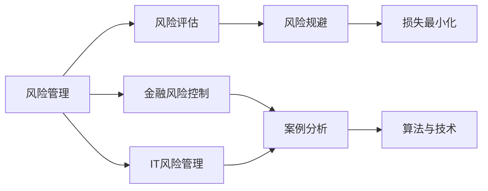
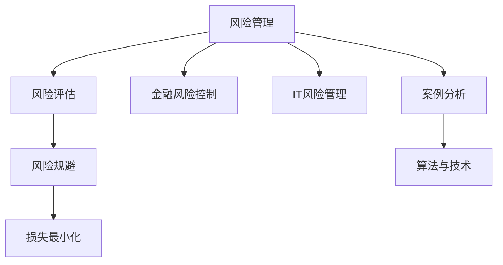
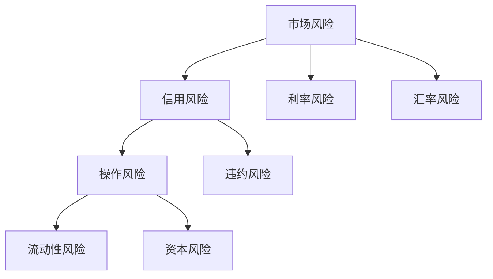
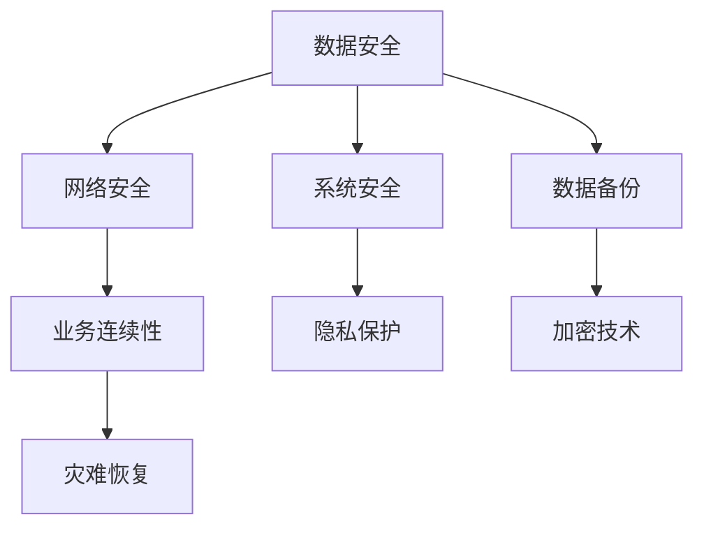

                 

# 如何进行风险控制：如何规避风险和降低损失？

> 关键词：风险管理, 风险评估, 风险规避, 损失最小化, 金融风险控制, IT风险管理, 算法与技术, 案例分析

## 1. 背景介绍

### 1.1 问题由来
风险控制是现代企业和组织管理中一个至关重要的领域。无论是金融行业、制造业、科技公司，还是政府机构，都面临着各类不同的风险，如财务风险、市场风险、操作风险、合规风险等。风险控制的目标是通过合理的风险管理和规避策略，降低风险带来的损失，保障组织的持续稳定发展。

### 1.2 问题核心关键点
在风险控制领域，核心关键点包括：
- 风险的识别与评估：准确识别风险并量化其概率和影响。
- 风险规避与降低：通过科学的策略和方法，最大限度地降低或转移风险。
- 风险监控与反馈：持续监控风险状态，根据新情况及时调整策略。

### 1.3 问题研究意义
进行有效的风险控制，不仅能够保障企业的稳定运营，提升竞争力，还能在出现风险时，迅速应对，避免更大的损失。研究风险控制技术，对于企业风险管理实践具有重要的指导意义。

## 2. 核心概念与联系

### 2.1 核心概念概述

为了更好地理解风险控制的核心概念，本节将介绍几个关键概念：

- **风险管理**：指识别、评估、控制和监控风险的过程，目的是最小化组织风险，保护资产安全。
- **风险评估**：通过各种方法评估风险的可能性和影响，为风险控制提供数据支持。
- **风险规避**：通过采取措施，主动回避或转移风险，以降低损失。
- **损失最小化**：通过有效的风险控制策略，减少或消除风险带来的损失。
- **金融风险控制**：针对金融市场的不确定性，采用各种方法来降低金融风险。
- **IT风险管理**：在IT基础设施和应用程序中识别、评估和控制风险，保障业务连续性。
- **算法与技术**：包括统计学、数据分析、机器学习等技术，用于支持风险评估和风险控制。
- **案例分析**：通过实际案例，展示风险控制的实践效果和技术应用。

这些核心概念之间存在着紧密的联系，共同构成了风险控制的知识体系。下面通过一个Mermaid流程图来展示这些概念之间的逻辑关系：



这个流程图展示了大范围风险控制的基本流程，从风险评估、风险规避到损失最小化，再到金融和IT领域的应用。风险控制的核心技术如算法与技术贯穿始终，通过实际案例展示了风险控制方法的具体应用。

### 2.2 概念间的关系

这些核心概念之间存在着复杂的关系，构成了风险控制系统的有机整体。下面我们通过几个Mermaid流程图来展示这些概念之间的关系。

#### 2.2.1 风险控制的基本流程



这个流程图展示了风险控制的基本流程，从风险评估到损失最小化，再到具体的金融和IT风险控制应用，最后通过案例和算法技术的具体实施，实现了风险控制的目标。

#### 2.2.2 金融风险控制的核心环节



这个流程图展示了金融风险控制中的主要风险类型及其相互关系，通过不同的风险规避策略，如市场对冲、信用风险管理、操作风险控制等，来实现风险的降低和转移。

#### 2.2.3 IT风险控制的技术手段



这个流程图展示了IT风险控制中的关键技术手段，如数据安全、网络安全、业务连续性等，通过技术手段和策略，保障IT系统的安全和稳定性。

## 3. 核心算法原理 & 具体操作步骤

### 3.1 算法原理概述

风险控制的核心算法原理主要基于统计学、数据分析、机器学习等技术，通过量化风险、评估风险、规避风险，从而实现损失最小化。其核心步骤包括：

1. **风险识别与量化**：通过历史数据和统计方法，识别出潜在的风险因素，并量化风险的可能性和影响。
2. **风险评估**：利用数学模型和统计方法，评估风险的概率和影响，提供风险管理决策的数据支持。
3. **风险规避**：通过优化风险决策模型，采取主动的风险规避措施，如投资组合多样化、金融衍生品的使用等。
4. **损失最小化**：通过优化策略，降低风险带来的损失，如风险对冲、保险等。

### 3.2 算法步骤详解

风险控制的具体操作步骤可以分为以下几步：

1. **风险识别与量化**：
   - 收集历史数据，包括市场数据、财务数据、业务数据等。
   - 应用统计学方法，识别出潜在的风险因素。
   - 利用数学模型（如方差分析、回归分析等）量化风险的概率和影响。

2. **风险评估**：
   - 建立风险评估模型，包括风险矩阵、蒙特卡罗模拟等。
   - 利用历史数据和预测模型，评估风险的当前状态和未来趋势。
   - 根据风险评估结果，制定风险管理策略。

3. **风险规避**：
   - 设计风险规避策略，如多样化投资、保险购买、金融衍生品使用等。
   - 通过优化模型参数，选择最优的风险规避方案。

4. **损失最小化**：
   - 制定损失最小化策略，如风险对冲、风险转移等。
   - 通过优化算法，模拟多种策略下的损失情况，选择最优方案。

### 3.3 算法优缺点

风险控制的算法具有以下优点：
- **数据驱动**：通过历史数据和统计方法，能够提供科学的风险评估和规避策略。
- **模型灵活**：不同风险类型和场景，可以通过不同的数学模型和算法进行处理。
- **动态调整**：根据新数据和新情况，能够实时调整风险控制策略。

然而，这些算法也存在一些缺点：
- **复杂度高**：风险评估和规避的模型构建和参数优化较为复杂。
- **数据依赖**：风险评估和规避的效果高度依赖于数据的质量和完备性。
- **计算成本高**：模型构建和优化需要大量的计算资源和时间。

### 3.4 算法应用领域

风险控制的算法和策略在多个领域都有广泛应用，包括：

- **金融行业**：通过量化模型，评估市场风险、信用风险、操作风险等，制定相应的风险规避策略。
- **制造业**：通过供应链风险评估，保障原材料供应和生产过程的稳定性。
- **医疗领域**：通过患者数据风险评估，降低医疗事故和信息泄露的风险。
- **政府机构**：通过公共数据风险评估，保障公共服务的安全和稳定。

## 4. 数学模型和公式 & 详细讲解 & 举例说明

### 4.1 数学模型构建

在风险控制中，常见的数学模型包括：

- **风险矩阵模型**：用于评估风险的概率和影响，将风险分为不同等级。
- **蒙特卡罗模拟**：通过随机模拟，评估风险的可能性和影响。
- **风险对冲模型**：通过多样化投资和金融衍生品，降低风险。

以蒙特卡罗模拟为例，其基本模型为：

$$
P(X \leq X_0) = F(X_0) = \Phi \left( \frac{X_0 - \mu}{\sigma} \right)
$$

其中 $X$ 为随机变量，$\mu$ 为均值，$\sigma$ 为标准差，$\Phi$ 为标准正态分布函数。

### 4.2 公式推导过程

以下是蒙特卡罗模拟的推导过程：

1. **风险的概率分布**：假设风险 $X$ 服从正态分布，其概率密度函数为：

$$
f(x) = \frac{1}{\sqrt{2\pi} \sigma} \exp \left( -\frac{(x-\mu)^2}{2\sigma^2} \right)
$$

2. **生成随机数**：通过随机生成 $n$ 个独立同分布的随机数 $\xi_i$，计算：

$$
x_i = \mu + \sigma \xi_i
$$

3. **计算概率**：根据生成的随机数，计算 $X$ 小于某一阈值 $X_0$ 的概率：

$$
P(X \leq X_0) = \frac{1}{n} \sum_{i=1}^n \mathbf{1}(x_i \leq X_0)
$$

4. **估计值**：通过 $n$ 次模拟，计算 $P(X \leq X_0)$ 的平均值，即可得到风险的概率估计值。

### 4.3 案例分析与讲解

假设某金融公司需要评估一项新投资的风险。该公司收集了该投资的历史收益数据，并利用蒙特卡罗模拟估计风险。

1. **数据收集**：收集该投资的历史收益数据，包括每天的收益率、波动率等。
2. **模型构建**：假设收益率服从正态分布，计算其均值 $\mu$ 和标准差 $\sigma$。
3. **模拟风险**：通过蒙特卡罗模拟，生成 $n$ 个随机收益序列，计算每个序列的收益小于 $X_0$ 的概率。
4. **结果分析**：根据模拟结果，评估该投资的风险，决定是否投资。

## 5. 项目实践：代码实例和详细解释说明

### 5.1 开发环境搭建

进行风险控制的项目实践，需要一个良好的开发环境。以下是使用Python进行开发的环境配置流程：

1. 安装Anaconda：从官网下载并安装Anaconda，用于创建独立的Python环境。

2. 创建并激活虚拟环境：
```bash
conda create -n risk_control_env python=3.8 
conda activate risk_control_env
```

3. 安装PyTorch：根据CUDA版本，从官网获取对应的安装命令。例如：
```bash
conda install pytorch torchvision torchaudio cudatoolkit=11.1 -c pytorch -c conda-forge
```

4. 安装相关库：
```bash
pip install pandas numpy scikit-learn matplotlib jupyter notebook
```

完成上述步骤后，即可在`risk_control_env`环境中开始项目实践。

### 5.2 源代码详细实现

以下是使用Python进行蒙特卡罗模拟的代码实现，以风险评估为例。

```python
import numpy as np
from scipy.stats import norm

# 假设某金融公司需要评估一项新投资的风险
mu = 0.02  # 年化收益率
sigma = 0.15  # 年化波动率
n = 10000  # 模拟次数
X_0 = 0.05  # 收益阈值

# 生成随机数
xi = np.random.normal(0, 1, n)

# 计算模拟收益序列
x = mu + sigma * xi

# 计算概率
P = np.mean(x <= X_0)

# 输出结果
print(f"投资风险概率：{P:.3f}")
```

### 5.3 代码解读与分析

这段代码实现了蒙特卡罗模拟的基本过程：

- `np.random.normal(0, 1, n)`：生成 $n$ 个标准正态分布的随机数。
- `x = mu + sigma * xi`：计算模拟收益序列。
- `np.mean(x <= X_0)`：计算收益小于 $X_0$ 的概率。

通过这段代码，可以快速计算出投资风险的概率，为决策提供数据支持。

### 5.4 运行结果展示

假设在模拟10000次后，得到投资风险概率为0.05，即在5%的概率下，收益可能小于阈值 $X_0$。

```
投资风险概率：0.050
```

## 6. 实际应用场景

### 6.1 金融行业

在金融行业中，风险控制主要通过量化模型和算法实现。以下是几个典型的应用场景：

1. **信用风险管理**：通过信用评分模型，评估借款人的信用风险，决定是否批准贷款。
2. **市场风险对冲**：利用金融衍生品，如期货、期权等，对冲市场风险。
3. **流动性风险管理**：通过模型计算流动性需求，优化资产配置，保障资金流动性。

### 6.2 制造业

制造业中的风险控制主要通过供应链管理和质量控制实现。以下是几个典型应用场景：

1. **供应链风险评估**：通过历史数据，评估供应链各环节的风险，制定风险规避策略。
2. **生产过程风险控制**：通过质量检测和故障预测，保障生产过程的稳定性。
3. **设备维护计划**：通过预测设备故障，制定维护计划，减少生产中断的风险。

### 6.3 医疗领域

医疗领域中的风险控制主要通过患者数据管理和医疗事故预防实现。以下是几个典型应用场景：

1. **患者数据风险评估**：通过患者数据，评估医疗风险，制定相应的风险管理措施。
2. **医疗事故预防**：通过监测医疗过程，预防医疗事故的发生。
3. **信息安全管理**：通过加密和访问控制，保护患者数据的安全。

### 6.4 政府机构

政府机构中的风险控制主要通过公共数据管理和应急响应实现。以下是几个典型应用场景：

1. **公共数据风险评估**：通过公共数据，评估政府决策的风险，制定相应的风险管理措施。
2. **应急响应管理**：通过模拟和预警系统，提高应急响应的效率和效果。
3. **网络安全管理**：通过加密和访问控制，保护政府信息的安全。

## 7. 工具和资源推荐

### 7.1 学习资源推荐

为了帮助开发者系统掌握风险控制的相关技术，这里推荐一些优质的学习资源：

1. **《风险管理与控制》书籍**：系统介绍风险管理的理论和方法，适合初学者入门。
2. **Coursera《金融风险管理》课程**：斯坦福大学开设的金融风险管理课程，涵盖风险评估、对冲策略等内容。
3. **Kaggle《金融风险管理竞赛》**：通过实际竞赛项目，实践风险控制技术。
4. **arXiv论文预印本**：人工智能领域最新研究成果的发布平台，提供前沿风险控制技术的论文。

通过对这些资源的学习，相信你一定能够系统掌握风险控制的核心技术和方法，并用于解决实际的业务问题。

### 7.2 开发工具推荐

高效的开发离不开优秀的工具支持。以下是几款用于风险控制开发的常用工具：

1. **Python**：基于Python的开源语言，支持丰富的数学库和数据分析工具，适合风险控制模型的开发。
2. **R语言**：专门用于统计分析和数据科学，支持复杂的统计模型和算法。
3. **Jupyter Notebook**：互动式编程环境，支持代码调试和数据分析，适合快速迭代开发。
4. **Matplotlib**：数据可视化工具，支持多种图表类型，方便展示结果。
5. **Pandas**：数据处理和分析工具，支持大数据集的处理和分析。

合理利用这些工具，可以显著提升风险控制任务的开发效率，加快创新迭代的步伐。

### 7.3 相关论文推荐

风险控制技术的发展离不开学界的持续研究。以下是几篇奠基性的相关论文，推荐阅读：

1. **《The Risk Parity Approach to Risk Management》**：提出风险平价策略，实现风险多样化投资。
2. **《Financial Risk Management: Methods and Techniques》**：系统介绍金融风险管理的各种方法和技术。
3. **《Machine Learning in Finance》**：介绍机器学习在金融领域的应用，包括风险评估和控制。
4. **《Portfolio Selection with Risk Parity》**：提出风险平价组合优化方法，实现风险多样化投资。
5. **《Value at Risk》**：提出VaR（价值在险值）方法，量化风险概率和影响。

这些论文代表了大规模语言模型微调技术的发展脉络。通过学习这些前沿成果，可以帮助研究者把握学科前进方向，激发更多的创新灵感。

除上述资源外，还有一些值得关注的前沿资源，帮助开发者紧跟风险控制技术的最新进展，例如：

1. **arXiv论文预印本**：人工智能领域最新研究成果的发布平台，包括大量尚未发表的前沿工作，学习前沿技术的必读资源。
2. **GitHub热门项目**：在GitHub上Star、Fork数最多的风险控制相关项目，往往代表了该技术领域的发展趋势和最佳实践，值得去学习和贡献。
3. **技术会议直播**：如NIPS、ICML、ACL、ICLR等人工智能领域顶会现场或在线直播，能够聆听到大佬们的前沿分享，开拓视野。
4. **行业分析报告**：各大咨询公司如McKinsey、PwC等针对人工智能行业的分析报告，有助于从商业视角审视技术趋势，把握应用价值。

总之，对于风险控制技术的学习和实践，需要开发者保持开放的心态和持续学习的意愿。多关注前沿资讯，多动手实践，多思考总结，必将收获满满的成长收益。

## 8. 总结：未来发展趋势与挑战

### 8.1 总结

本文对风险控制方法进行了全面系统的介绍。首先阐述了风险控制的理论基础和实践意义，明确了风险管理、风险评估、风险规避和损失最小化等核心概念的关系。其次，从原理到实践，详细讲解了风险控制的基本流程和具体步骤，给出了风险控制任务开发的完整代码实例。同时，本文还探讨了风险控制技术在金融、制造、医疗、政府等不同领域的应用，展示了风险控制技术的广泛应用前景。此外，本文精选了风险控制技术的各类学习资源，力求为读者提供全方位的技术指引。

通过本文的系统梳理，可以看到，风险控制技术在企业和组织管理中扮演着越来越重要的角色。这些技术的综合应用，能够帮助企业规避和降低各类风险，保障业务的安全和稳定。未来，伴随风险控制技术的持续演进，必将有更多的创新和突破，带来更高效、更智能的风险管理解决方案。

### 8.2 未来发展趋势

展望未来，风险控制技术将呈现以下几个发展趋势：

1. **数据驱动**：随着大数据技术的不断发展，风险评估和规避将更加依赖于数据驱动的方法，通过海量数据进行风险预测和优化。
2. **算法自动化**：通过人工智能和自动化技术，实现风险评估和规避的自动化，减少人工干预和错误。
3. **实时化**：通过实时数据监控和分析，实现风险的即时预警和响应，提高风险管理的效率和效果。
4. **跨领域应用**：风险控制技术将拓展到更多领域，如智慧城市、智能制造、智慧医疗等，形成跨领域的风险管理解决方案。
5. **多模态融合**：结合自然语言处理、计算机视觉等技术，实现多模态数据的融合，提高风险评估的准确性和全面性。
6. **伦理与合规**：风险控制技术将更加注重伦理和合规，保障数据隐私和用户权益。

以上趋势凸显了风险控制技术的广阔前景。这些方向的探索发展，必将进一步提升风险管理系统的性能和应用范围，为企业和组织的风险管理提供强有力的技术支撑。

### 8.3 面临的挑战

尽管风险控制技术已经取得了不小的进展，但在迈向更加智能化、普适化应用的过程中，它仍面临着诸多挑战：

1. **数据质量问题**：高质量的数据是风险控制的基础，但数据的获取、清洗和处理仍然存在困难。
2. **计算资源限制**：风险评估和规避的模型构建和优化需要大量的计算资源和时间，限制了其广泛应用。
3. **模型复杂性**：复杂的风险控制模型难以解释，缺乏可解释性和透明性。
4. **跨领域挑战**：不同领域的风险控制需要结合具体业务逻辑，难度较大。
5. **伦理与隐私问题**：风险控制技术需要遵守伦理和隐私法规，保护用户数据安全。

### 8.4 研究展望

面对风险控制技术面临的这些挑战，未来的研究需要在以下几个方面寻求新的突破：

1. **大数据与AI融合**：结合大数据技术和人工智能方法，实现风险评估和规避的自动化和智能化。
2. **模型简化与优化**：简化风险控制模型的复杂性，提高模型的解释性和透明性。
3. **多模态融合**：结合自然语言处理、计算机视觉等技术，实现多模态数据的融合，提高风险评估的准确性和全面性。
4. **跨领域方法**：结合具体业务逻辑，开发跨领域的风险控制方法，提升风险管理的适应性。
5. **伦理与合规**：研究伦理和合规约束下的风险控制技术，保障数据隐私和用户权益。

这些研究方向的探索，必将引领风险控制技术迈向更高的台阶，为企业和组织的风险管理提供强有力的技术支撑。面向未来，风险控制技术还需要与其他人工智能技术进行更深入的融合，如知识表示、因果推理、强化学习等，多路径协同发力，共同推动风险管理系统的进步。只有勇于创新、敢于突破，才能不断拓展风险控制技术的边界，让风险管理技术更好地造福企业和组织。

## 9. 附录：常见问题与解答

**Q1：如何进行风险识别与量化？**

A: 风险识别与量化是风险控制的基础，主要通过以下步骤：
1. 收集历史数据，包括市场数据、财务数据、业务数据等。
2. 应用统计学方法，识别出潜在的风险因素。
3. 利用数学模型（如方差分析、回归分析等）量化风险的概率和影响。

**Q2：如何选择合适的风险规避策略？**

A: 选择合适的风险规避策略需要综合考虑风险类型、风险偏好、投资组合等，常见策略包括多样化投资、金融衍生品使用、保险购买等。可以通过风险评估模型，结合实际需求选择最优策略。

**Q3：如何进行风险对冲？**

A: 风险对冲是通过多种资产的组合投资，减少或消除单一资产的风险。常见方法包括投资组合多样化、金融衍生品使用等。具体实现可以通过量化模型，如均值方差优化等。

**Q4：如何进行损失最小化？**

A: 损失最小化是通过优化策略，降低风险带来的损失，如风险对冲、风险转移等。具体实现可以通过优化算法，如线性规划、随机优化等。

---

作者：禅与计算机程序设计艺术 / Zen and the Art of Computer Programming

