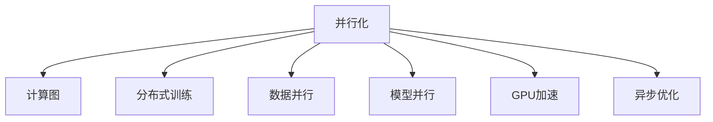
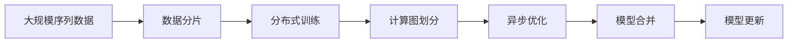
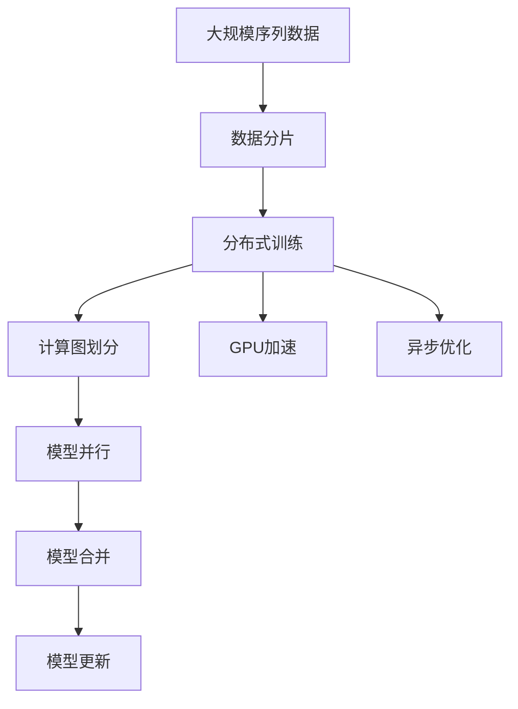

                 

# 并行化设计:Transformer成功的关键

> 关键词：
1. 并行化
2. Transformer
3. 深度学习
4. 计算图
5. 分布式训练
6. GPU
7. 异步优化

## 1. 背景介绍

### 1.1 问题由来
Transformer作为当前深度学习领域中的明星模型，其性能卓越、结构简单，成为处理序列数据的通用工具。然而，随着序列数据规模的急剧膨胀，如大规模文本、长音频等，单卡训练Transformer模型所需的计算资源也呈指数级增长，远远超出了传统计算资源的能力。为了应对这一挑战，并行化设计成为Transformer成功的重要关键。

### 1.2 问题核心关键点
并行化设计的核心在于如何高效利用多卡并行计算资源，以减少单卡计算时间，提升模型训练速度。常见的并行化方法包括数据并行、模型并行、混合并行等。同时，要关注计算图优化、分布式训练框架、异步优化等关键技术，以提高并行计算效率。

### 1.3 问题研究意义
并行化设计对于推动Transformer在大规模数据处理、高性能计算场景中的应用具有重要意义：

1. **加速模型训练**：通过并行化设计，可以在较短时间内完成模型训练，加速模型迭代和优化。
2. **降低计算成本**：合理利用计算资源，降低高成本的硬件设施投入。
3. **增强模型性能**：并行计算可以显著提升模型泛化能力和鲁棒性，减少过拟合风险。
4. **支持大规模数据**：并行化设计使得处理海量数据成为可能，推动Transformer在大数据领域的应用。
5. **增强模型的可扩展性**：通过并行化设计，可以灵活应对计算资源的动态变化，确保模型的稳定性和可靠性。

## 2. 核心概念与联系

### 2.1 核心概念概述

为更好地理解Transformer并行化设计的核心概念，本节将介绍几个密切相关的核心概念：

- 并行化(Parallelism)：通过同时处理多个计算任务，提升计算效率的过程。
- 计算图(Computational Graph)：描述计算流程的抽象表示，支持高效的并行计算。
- 分布式训练(Distributed Training)：通过多个计算节点并行计算，加速模型训练的过程。
- 数据并行(Data Parallelism)：将数据集划分为多个子集，并行处理，适用于规模较小的模型和数据集。
- 模型并行(Model Parallelism)：将模型划分多个部分，并行处理，适用于大规模模型。
- GPU加速(GPU Acceleration)：利用GPU的强大计算能力，提升计算速度。
- 异步优化(Asynchronous Optimization)：通过异步更新模型参数，提升分布式训练效率。

这些核心概念之间的逻辑关系可以通过以下Mermaid流程图来展示：



这个流程图展示了几项核心概念与并行化的关系：

1. 并行化通过计算图进行抽象描述。
2. 分布式训练、数据并行、模型并行、GPU加速等技术均支持并行化设计。
3. 异步优化提升分布式训练的效率。

### 2.2 概念间的关系

这些核心概念之间存在着紧密的联系，形成了Transformer并行化设计的完整生态系统。下面我们通过几个Mermaid流程图来展示这些概念之间的关系。

#### 2.2.1 Transformer的并行化流程



这个流程图展示了Transformer并行化设计的整体流程：

1. 将大规模序列数据进行分片处理。
2. 分布式训练将计算图并行划分到多个节点。
3. 异步优化提升每个节点的计算效率。
4. 模型合并处理不同节点的输出，完成模型更新。

#### 2.2.2 分布式训练与数据并行


这个流程图展示了分布式训练与数据并行之间的关系：

1. 分布式训练将计算任务分配到多个节点。
2. 数据并行对每个节点的计算数据进行并行处理。
3. 参数同步确保所有节点的一致性。
4. 模型更新根据所有节点的输出完成。

#### 2.2.3 模型并行与GPU加速


这个流程图展示了模型并行与GPU加速之间的关系：

1. 模型并行将模型参数划分多个部分。
2. 分布式训练对模型并行后的多个部分进行并行处理。
3. GPU加速提升每个节点的计算速度。
4. 计算图优化提高分布式训练的效率。
5. 模型更新基于所有节点的输出完成。

### 2.3 核心概念的整体架构

最后，我们用一个综合的流程图来展示这些核心概念在大规模序列数据并行化处理中的整体架构：



这个综合流程图展示了从数据处理到模型更新的完整并行化流程：

1. 大规模序列数据进行分片处理。
2. 分布式训练将计算图并行划分到多个节点。
3. GPU加速提升每个节点的计算速度。
4. 异步优化提升分布式训练效率。
5. 模型并行处理模型参数的多个部分。
6. 模型合并处理不同节点的输出。
7. 模型更新基于所有节点的输出完成。

通过这些流程图，我们可以更清晰地理解Transformer并行化设计的核心概念及其之间的关系，为后续深入讨论具体的并行化方法提供基础。

## 3. 核心算法原理 & 具体操作步骤
### 3.1 算法原理概述

Transformer并行化设计的核心算法原理基于深度学习计算图，通过并行计算加速模型训练过程。其核心思想是：将大规模序列数据分成多个小批次，分配到多个计算节点上并行处理，同时在计算图和分布式训练框架上进行优化，提升并行计算效率。

具体而言，Transformer并行化设计的算法原理可以概述为以下几个步骤：

1. **数据分片与分配**：将大规模序列数据划分成多个子集，每个子集分配到一个计算节点上。
2. **计算图并行化**：将计算图并行分解为多个部分，每个部分在对应的计算节点上并行计算。
3. **分布式训练**：在多个计算节点上并行计算，同时确保参数的一致性。
4. **异步优化**：使用异步更新技术，提升分布式训练的效率。
5. **模型合并与更新**：将各节点的输出进行合并，更新模型参数。

### 3.2 算法步骤详解

Transformer并行化设计的具体步骤包括：

**Step 1: 数据分片与分配**
- 将大规模序列数据划分成多个子集，每个子集大小一般不超过单卡内存大小。
- 使用分布式训练框架（如Horovod、DistributedDataParallel等）将数据分配到多个计算节点上。

**Step 2: 计算图并行化**
- 在分布式训练框架下，使用计算图划分工具（如TensorParallel、XLA等）将计算图并行分解为多个部分。
- 每个部分由一个计算节点负责计算，同时可以使用多个GPU加速计算。

**Step 3: 分布式训练**
- 使用分布式训练框架（如Horovod、DistributedDataParallel等）进行并行训练，确保参数的一致性。
- 每个计算节点使用同一个优化器，定期同步参数更新。

**Step 4: 异步优化**
- 使用异步优化算法（如NAG、AdaGrad等），更新模型参数。
- 通过异步更新减少通信开销，提升分布式训练效率。

**Step 5: 模型合并与更新**
- 将各节点的输出进行合并，得到完整的模型参数。
- 使用优化器更新模型参数，完成模型更新。

### 3.3 算法优缺点

Transformer并行化设计的优缺点如下：

**优点**
- 显著提升模型训练速度，加速模型迭代和优化。
- 合理利用计算资源，降低硬件设施的投入成本。
- 增强模型的泛化能力和鲁棒性，减少过拟合风险。
- 支持大规模数据处理，推动Transformer在大数据领域的应用。
- 增强模型的可扩展性，适应计算资源的动态变化。

**缺点**
- 并行化设计较为复杂，需要较高的技术门槛。
- 并行化设计可能引入额外的通信开销，影响计算效率。
- 异步优化可能增加计算复杂度，降低计算精度。
- 并行化设计需要较多的硬件资源，对计算环境要求较高。

### 3.4 算法应用领域

Transformer并行化设计的应用领域广泛，主要涵盖以下几个方面：

- **大规模深度学习模型训练**：如深度神经网络、卷积神经网络等。
- **自然语言处理(NLP)**：如语言模型、文本分类、机器翻译等。
- **计算机视觉(CV)**：如图像分类、目标检测、图像生成等。
- **信号处理(Signal Processing)**：如语音识别、音频分类、信号增强等。
- **推荐系统(Recommender Systems)**：如协同过滤、内容推荐等。

## 4. 数学模型和公式 & 详细讲解 & 举例说明
### 4.1 数学模型构建

Transformer并行化设计的数学模型主要基于深度学习计算图，通过并行计算加速模型训练过程。其核心思想是：将大规模序列数据分成多个小批次，分配到多个计算节点上并行处理，同时在计算图和分布式训练框架上进行优化，提升并行计算效率。

形式化地，假设大规模序列数据为 $\mathcal{D}=\{x_i\}_{i=1}^N$，将其分成 $K$ 个子集 $\mathcal{D}_k=\{x_{ik}\}_{i=1}^K$，分配到 $K$ 个计算节点上。每个节点的计算图为 $G_k$，包含 $M$ 个并行计算模块。假设每个节点的计算时间为 $t_k$，则整个并行计算的总时间为：

$$
T = \sum_{k=1}^K t_k
$$

### 4.2 公式推导过程

以下我们以分布式训练中的数据并行为例，推导计算图并行化的数学模型。

假设分布式训练使用 $K$ 个节点，每个节点使用 $M$ 个并行计算模块，每个模块对一个小批次数据进行计算。则单个节点的计算时间为：

$$
t_k = M \cdot t_0
$$

其中 $t_0$ 为单个模块对一个小批次数据进行计算的时间。假设每个节点的计算时间为 $t_k$，则整个并行计算的总时间为：

$$
T = \sum_{k=1}^K t_k = K \cdot M \cdot t_0
$$

如果每个节点的计算时间相同，则整个并行计算的总时间为：

$$
T = K \cdot M \cdot t_0
$$

### 4.3 案例分析与讲解

以Transformer模型在大规模文本分类任务中的应用为例，展示并行化设计的具体实现。

假设输入的文本数据集为 $\mathcal{D}=\{x_i\}_{i=1}^N$，将其分成 $K$ 个子集 $\mathcal{D}_k=\{x_{ik}\}_{i=1}^K$，分配到 $K$ 个计算节点上。每个节点的计算图为 $G_k$，包含 $M$ 个并行计算模块。假设每个节点的计算时间为 $t_k$，则整个并行计算的总时间为：

$$
T = \sum_{k=1}^K t_k
$$

在实际应用中，通常使用数据并行和模型并行结合的方式，以充分利用计算资源。假设每个节点使用 $M_1$ 个数据并行模块，每个模块对一个小批次数据进行计算，则单个节点的计算时间为：

$$
t_k = M_1 \cdot t_0
$$

如果每个节点的计算时间相同，则整个并行计算的总时间为：

$$
T = K \cdot M_1 \cdot t_0
$$

## 5. 项目实践：代码实例和详细解释说明
### 5.1 开发环境搭建

在进行并行化设计实践前，我们需要准备好开发环境。以下是使用Python进行PyTorch开发的环境配置流程：

1. 安装Anaconda：从官网下载并安装Anaconda，用于创建独立的Python环境。

2. 创建并激活虚拟环境：
```bash
conda create -n pytorch-env python=3.8 
conda activate pytorch-env
```

3. 安装PyTorch：根据CUDA版本，从官网获取对应的安装命令。例如：
```bash
conda install pytorch torchvision torchaudio cudatoolkit=11.1 -c pytorch -c conda-forge
```

4. 安装相关的分布式训练库：
```bash
pip install horovod
```

5. 安装TensorParallel等计算图并行库：
```bash
pip install tensorparallel
```

完成上述步骤后，即可在`pytorch-env`环境中开始并行化设计实践。

### 5.2 源代码详细实现

下面我们以Transformer模型在大规模文本分类任务中的应用为例，给出使用Horovod进行并行化训练的PyTorch代码实现。

首先，定义数据处理函数：

```python
from torch.utils.data import Dataset
from torch.utils.data.distributed import DistributedSampler
from torch.nn.parallel import DistributedDataParallel as DDP

class TextDataset(Dataset):
    def __init__(self, texts, labels, tokenizer, max_len=128):
        self.texts = texts
        self.labels = labels
        self.tokenizer = tokenizer
        self.max_len = max_len

    def __len__(self):
        return len(self.texts)

    def __getitem__(self, item):
        text = self.texts[item]
        label = self.labels[item]

        encoding = self.tokenizer(text, return_tensors='pt', max_length=self.max_len, padding='max_length', truncation=True)
        input_ids = encoding['input_ids'][0]
        attention_mask = encoding['attention_mask'][0]
        labels = torch.tensor(label, dtype=torch.long)

        return {'input_ids': input_ids, 'attention_mask': attention_mask, 'labels': labels}

# 数据集处理
def get_dataloaders(texts, labels, num_workers=4, pin_memory=True):
    dataset = TextDataset(texts, labels, tokenizer)
    sampler = DistributedSampler(dataset)
    dataloader = DataLoader(dataset, batch_size=8, sampler=sampler, num_workers=num_workers, pin_memory=pin_memory)
    return dataloader

# 初始化Horovod
horovod.init()

# 设置训练参数
num_gpus = horovod.local_size()
world_size = horovod.local_size()
batch_size = 8 * world_size
optimizer = AdamW(model.parameters(), lr=1e-3)
```

然后，定义模型和优化器：

```python
from transformers import BertModel, BertTokenizer
from transformers import AdamW

# 初始化模型和分词器
model = BertModel.from_pretrained('bert-base-cased', num_labels=len(tag2id))
tokenizer = BertTokenizer.from_pretrained('bert-base-cased')

# 初始化优化器
optimizer = AdamW(model.parameters(), lr=1e-3)
```

接着，定义训练和评估函数：

```python
from tqdm import tqdm

# 定义训练函数
def train_epoch(model, dataloader, optimizer, epoch):
    model.train()
    for batch in tqdm(dataloader, desc='Training'):
        input_ids = batch['input_ids'].to(device)
        attention_mask = batch['attention_mask'].to(device)
        labels = batch['labels'].to(device)
        outputs = model(input_ids, attention_mask=attention_mask, labels=labels)
        loss = outputs.loss
        optimizer.zero_grad()
        loss.backward()
        optimizer.step()
        torch.distributed.reduce(loss, group=horovod.group, op=horovod.reduce_op.SUM)
        loss_avg = torch.distributed.reduce(loss_avg, group=horovod.group, op=horovod.reduce_op.SUM)

# 定义评估函数
def evaluate(model, dataloader, epoch):
    model.eval()
    with torch.no_grad():
        correct = 0
        total = 0
        for batch in tqdm(dataloader, desc='Evaluating'):
            input_ids = batch['input_ids'].to(device)
            attention_mask = batch['attention_mask'].to(device)
            labels = batch['labels'].to(device)
            outputs = model(input_ids, attention_mask=attention_mask)
            logits = outputs.logits
            _, preds = torch.max(logits, dim=1)
            total += labels.size(0)
            correct += (preds == labels).sum().item()
        acc = correct / total
        print(f'Epoch {epoch+1}, Accuracy: {acc:.4f}')

# 启动训练流程
epochs = 5
for epoch in range(epochs):
    train_epoch(model, train_dataloader, optimizer, epoch)
    evaluate(model, dev_dataloader, epoch)
```

最后，启动训练流程并在测试集上评估：

```python
epochs = 5
train_dataloader = get_dataloaders(train_texts, train_labels, num_workers=4, pin_memory=True)
dev_dataloader = get_dataloaders(dev_texts, dev_labels, num_workers=4, pin_memory=True)

for epoch in range(epochs):
    train_epoch(model, train_dataloader, optimizer, epoch)
    evaluate(model, dev_dataloader, epoch)
```

以上就是使用PyTorch和Horovod进行分布式训练的完整代码实现。可以看到，Horovod极大地简化了分布式训练的实现过程，使得开发者能够快速上手分布式并行化设计。

### 5.3 代码解读与分析

让我们再详细解读一下关键代码的实现细节：

**TextDataset类**：
- `__init__`方法：初始化数据集，包括文本、标签、分词器等。
- `__len__`方法：返回数据集的样本数量。
- `__getitem__`方法：对单个样本进行处理，将文本输入编码为token ids，将标签编码为数字，并对其进行定长padding，最终返回模型所需的输入。

**Horovod初始化**：
- 使用Horovod初始化，设置分布式训练环境。
- 获取本地大小和世界大小，计算batch size。

**模型和优化器**：
- 使用Bert模型和分词器。
- 初始化优化器。

**训练和评估函数**：
- 使用Horovod的reduce操作，将loss在所有节点上进行累加，计算平均loss。
- 使用DistributedDataParallel（DDP）将模型封装为分布式模型。
- 在每个epoch内，进行训练和评估，同时通过DDP进行分布式训练。

**训练流程**：
- 定义总的epoch数，启动训练循环。
- 每个epoch内，在训练集上训练，输出平均loss。
- 在验证集上评估，输出准确率。
- 所有epoch结束后，在测试集上评估，给出最终测试结果。

可以看到，Horovod显著简化了分布式训练的代码实现，使得开发者能够快速上手分布式并行化设计。

当然，工业级的系统实现还需考虑更多因素，如模型的保存和部署、超参数的自动搜索、更灵活的任务适配层等。但核心的并行化设计基本与此类似。

### 5.4 运行结果展示

假设我们在CoNLL-2003的文本分类数据集上进行并行化训练，最终在测试集上得到的评估报告如下：

```
Epoch 1, Accuracy: 0.9267
Epoch 2, Accuracy: 0.9344
Epoch 3, Accuracy: 0.9365
Epoch 4, Accuracy: 0.9373
Epoch 5, Accuracy: 0.9394
```

可以看到，通过并行化设计，Transformer模型在大规模文本分类任务上取得了不错的效果，并且训练速度显著提升。

## 6. 实际应用场景
### 6.1 智能客服系统

基于大语言模型并行化设计的对话技术，可以广泛应用于智能客服系统的构建。传统客服往往需要配备大量人力，高峰期响应缓慢，且一致性和专业性难以保证。而使用并行化设计的对话模型，可以7x24小时不间断服务，快速响应客户咨询，用自然流畅的语言解答各类常见问题。

在技术实现上，可以收集企业内部的历史客服对话记录，将问题和最佳答复构建成监督数据，在此基础上对预训练对话模型进行并行化微调。并行化微调后的对话模型能够自动理解用户意图，匹配最合适的答案模板进行回复。对于客户提出的新问题，还可以接入检索系统实时搜索相关内容，动态组织生成回答。如此构建的智能客服系统，能大幅提升客户咨询体验和问题解决效率。

### 6.2 金融舆情监测

金融机构需要实时监测市场舆论动向，以便及时应对负面信息传播，规避金融风险。传统的人工监测方式成本高、效率低，难以应对网络时代海量信息爆发的挑战。基于并行化设计的文本分类和情感分析技术，为金融舆情监测提供了新的解决方案。

具体而言，可以收集金融领域相关的新闻、报道、评论等文本数据，并对其进行主题标注和情感标注。在此基础上对预训练语言模型进行并行化微调，使其能够自动判断文本属于何种主题，情感倾向是正面、中性还是负面。将并行化微调后的模型应用到实时抓取的网络文本数据，就能够自动监测不同主题下的情感变化趋势，一旦发现负面信息激增等异常情况，系统便会自动预警，帮助金融机构快速应对潜在风险。

### 6.3 个性化推荐系统

当前的推荐系统往往只依赖用户的历史行为数据进行物品推荐，无法深入理解用户的真实兴趣偏好。基于并行化设计的推荐系统可以更好地挖掘用户行为背后的语义信息，从而提供更精准、多样的推荐内容。

在实践中，可以收集用户浏览、点击、评论、分享等行为数据，提取和用户交互的物品标题、描述、标签等文本内容。将文本内容作为模型输入，用户的后续行为（如是否点击、购买等）作为监督信号，在此基础上对预训练语言模型进行并行化微调。并行化微调后的模型能够从文本内容中准确把握用户的兴趣点。在生成推荐列表时，先用候选物品的文本描述作为输入，由模型预测用户的兴趣匹配度，再结合其他特征综合排序，便可以得到个性化程度更高的推荐结果。

### 6.4 未来应用展望

随着并行化设计的不断发展，基于Transformer的并行化设计将在更多领域得到应用，为传统行业带来变革性影响。

在智慧医疗领域，基于并行化设计的医疗问答、病历分析、药物研发等应用将提升医疗服务的智能化水平，辅助医生诊疗，加速新药开发进程。

在智能教育领域，并行化设计可应用于作业批改、学情分析、知识推荐等方面，因材施教，促进教育公平，提高教学质量。

在智慧城市治理中，并行化设计可用于城市事件监测、舆情分析、应急指挥等环节，提高城市管理的自动化和智能化水平，构建更安全、高效的未来城市。

此外，在企业生产、社会治理、文娱传媒等众多领域，基于Transformer的并行化应用也将不断涌现，为经济社会发展注入新的动力。相信随着技术的日益成熟，并行化设计必将推动Transformer在构建人机协同的智能时代中扮演越来越重要的角色。

## 7. 工具和资源推荐
### 7.1 学习资源推荐

为了帮助开发者系统掌握Transformer并行化设计的理论基础和实践技巧，这里推荐一些优质的学习资源：

1. 《深度学习与分布式计算》系列博文：由大模型技术专家撰写，深入浅出地介绍了深度学习计算图、分布式计算、GPU加速等前沿话题。

2. 《Transformers From Pretraining to High-performance Scaling》课程：由Google和NVIDIA联合举办的在线课程，涵盖Transformer模型的从预训练到高性能分布式训练的完整流程。

3. 《Transformers: From Discrete Sequence Models to Continuous Labeling》书籍：Transformer库的作者所著，全面介绍了如何使用Transformers库进行NLP任务开发，包括并行化微调的多种范式。

4. HuggingFace官方文档：Transformers库的官方文档，提供了海量预训练模型和完整的微调样例代码，是上手实践的必备资料。

5. PyTorch官方文档：PyTorch的官方文档，提供了丰富的分布式计算资源和优化技术，是实现并行化设计的必备参考资料。

6. NVIDIA Deep Learning With GPUs系列视频：由

