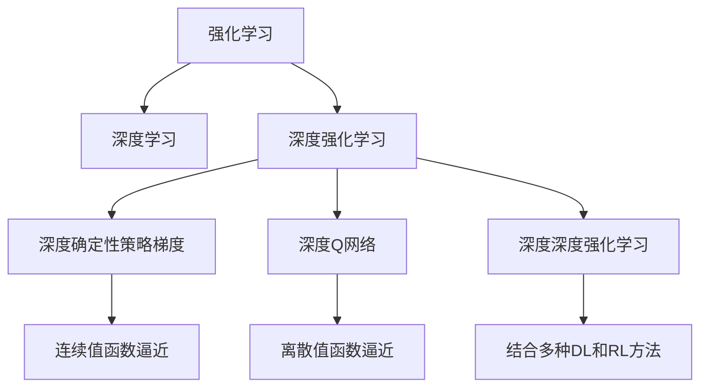
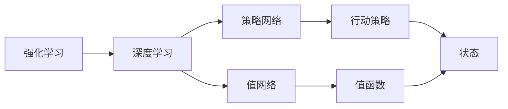
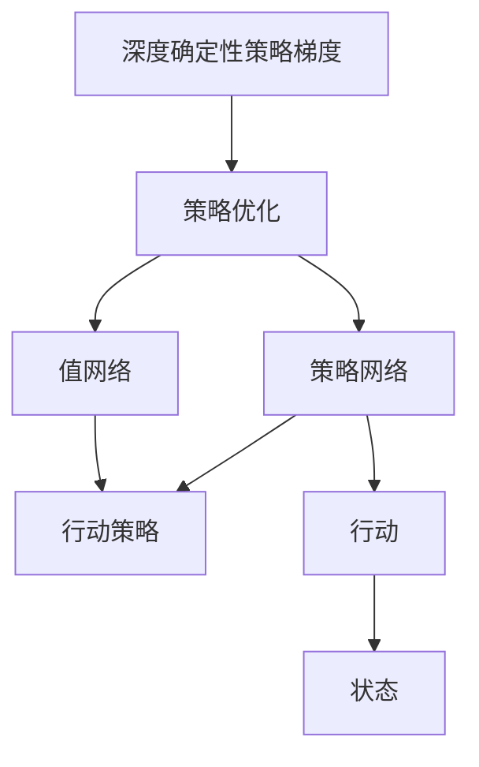
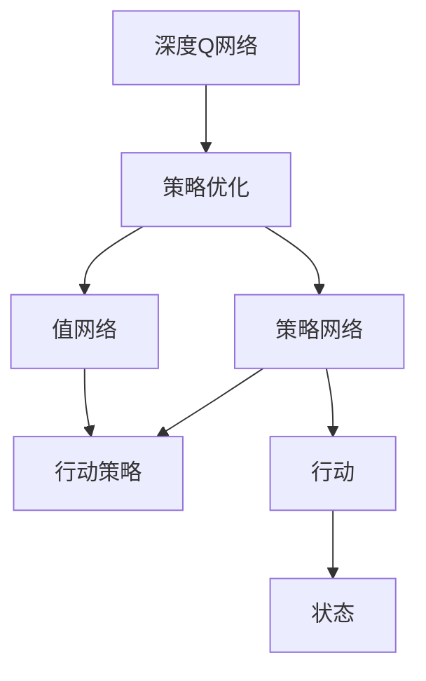
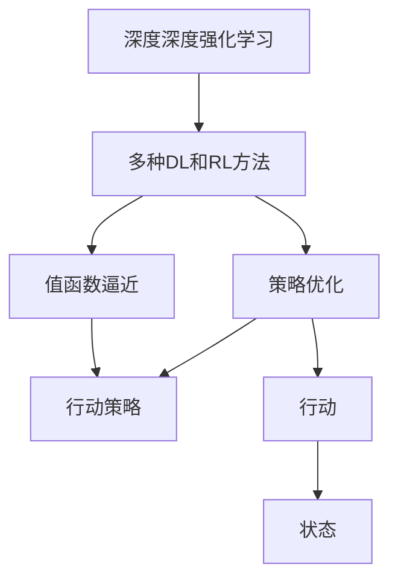
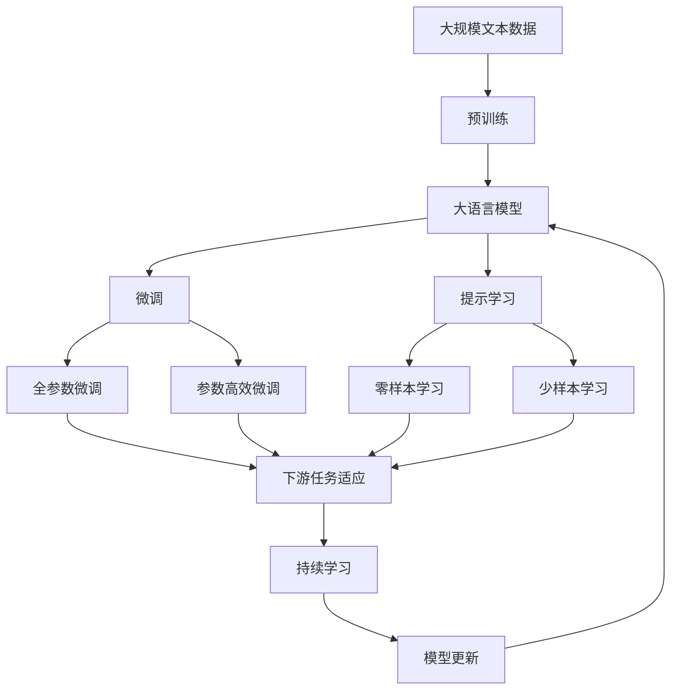

                 

# 强化学习Reinforcement Learning与深度学习的结合之路

> 关键词：强化学习,深度学习,深度强化学习,深度Q网络,深度确定性策略梯度,深度神经网络,深度学习模型,深度学习算法,深度学习应用

## 1. 背景介绍

### 1.1 问题由来
强化学习（Reinforcement Learning, RL）和深度学习（Deep Learning, DL）是目前人工智能领域最为火热的两个技术分支。RL通过智能体（agent）在环境（environment）中与外部交互，不断学习并优化策略以最大化预期回报；而DL则利用大量数据，通过神经网络实现对复杂模式的学习和表示。随着近年来深度学习的飞速发展，如何结合RL和DL，充分利用两者的优势，实现更高效、更智能的决策和学习任务，成为了当前研究的热点。

在实际应用中，RL和DL的结合广泛应用于游戏智能、自动驾驶、机器人控制、自然语言处理等多个领域。例如，深度Q网络（Deep Q-Network, DQN）通过深度神经网络逼近Q函数，大大提升了Q-learning算法的效率和表现；深度确定性策略梯度（Deep Deterministic Policy Gradient, DDPG）在控制任务上取得了显著成果。

### 1.2 问题核心关键点
RL与DL结合的核心关键点在于如何将DL模型作为RL的"策略"或"值函数"，利用神经网络逼近复杂的函数表达，提升学习效率和决策能力。

这种结合范式通常涉及以下几个核心概念：

- **策略网络（Policy Network）**：神经网络作为智能体的决策策略，输出一系列行动概率分布。
- **值网络（Value Network）**：神经网络逼近Q函数（或状态值函数），计算每个状态的预期回报。
- **策略优化**：利用Q函数的估计值，更新策略网络参数以最大化预期回报。
- **损失函数**：定义策略优化的目标函数，通常基于值函数（如交叉熵损失）或优势函数（如Policy Gradient）。

## 2. 核心概念与联系

### 2.1 核心概念概述

为了更好地理解强化学习与深度学习的结合范式，我们首先介绍几个关键概念：

- **强化学习**：智能体（agent）在环境（environment）中通过一系列行动（action），最大化预期回报（reward）的学习过程。
- **深度学习**：利用神经网络逼近复杂函数，学习数据的分布和模式，实现高效的模式识别和表示。
- **深度强化学习（Deep Reinforcement Learning, DRL）**：结合RL和DL的结合，利用神经网络作为策略或值函数，实现高效策略优化和值函数逼近。
- **深度确定性策略梯度（Deep Deterministic Policy Gradient, DDPG）**：结合DQN和DDPG的优势，通过深度神经网络逼近Q函数，实现策略优化。
- **深度Q网络（Deep Q-Network, DQN）**：利用神经网络逼近Q函数，优化策略以最大化预期回报。
- **深度深度强化学习（Deep Deep Reinforcement Learning, D3RL）**：结合多种DL和RL方法的结合，实现更复杂的策略优化和值函数逼近。

这些核心概念之间的逻辑关系可以通过以下Mermaid流程图来展示：



这个流程图展示了RL和DL的结合关系以及具体应用：

1. RL通过智能体与环境的交互学习策略。
2. DL利用神经网络逼近复杂的函数。
3. DRL将DL和RL结合，提升学习效率和决策能力。
4. DDPG和DQN是DRL的两种重要方法。
5. D3RL结合了多种DL和RL方法，实现更复杂的任务。

### 2.2 概念间的关系

这些核心概念之间存在着紧密的联系，形成了深度强化学习的完整生态系统。下面通过几个Mermaid流程图来展示这些概念之间的关系。

#### 2.2.1 强化学习与深度学习的关系



这个流程图展示了强化学习与深度学习的结合方式：

1. RL通过智能体与环境的交互学习策略。
2. DL利用神经网络逼近复杂的函数。
3. 策略网络作为智能体的决策策略。
4. 值网络逼近Q函数，计算状态的预期回报。

#### 2.2.2 深度确定性策略梯度



这个流程图展示了DDPG的基本流程：

1. DDPG通过深度神经网络逼近Q函数。
2. 策略网络输出行动概率分布。
3. 值网络计算每个状态的预期回报。
4. 利用策略优化算法，更新策略网络参数以最大化预期回报。

#### 2.2.3 深度Q网络



这个流程图展示了DQN的基本流程：

1. DQN利用神经网络逼近Q函数。
2. 策略网络输出行动策略。
3. 值网络计算每个状态的预期回报。
4. 利用策略优化算法，更新策略网络参数以最大化预期回报。

#### 2.2.4 深度深度强化学习



这个流程图展示了D3RL的基本流程：

1. D3RL结合多种DL和RL方法。
2. 策略网络输出行动策略。
3. 值网络逼近Q函数，计算状态的预期回报。
4. 利用策略优化算法，更新策略网络参数以最大化预期回报。

### 2.3 核心概念的整体架构

最后，我们用一个综合的流程图来展示这些核心概念在大语言模型微调过程中的整体架构：



这个综合流程图展示了从预训练到微调，再到持续学习的完整过程。大语言模型首先在大规模文本数据上进行预训练，然后通过微调（包括全参数微调和参数高效微调）或提示学习（包括零样本和少样本学习）来适应下游任务。最后，通过持续学习技术，模型可以不断更新和适应新的任务和数据。

通过这些流程图，我们可以更清晰地理解深度强化学习过程中各个核心概念的关系和作用，为后续深入讨论具体的微调方法和技术奠定基础。

## 3. 核心算法原理 & 具体操作步骤
### 3.1 算法原理概述

深度强化学习（DRL）是结合RL和DL的一种高效学习范式，其核心思想是利用神经网络逼近复杂的函数，实现高效策略优化和值函数逼近。

在DRL中，智能体通过在环境中进行交互，不断调整策略和行动，以最大化预期回报。具体而言，DRL包括以下几个关键步骤：

1. **策略网络**：利用神经网络逼近智能体的决策策略，输出行动概率分布。
2. **值网络**：利用神经网络逼近Q函数或状态值函数，计算每个状态的预期回报。
3. **策略优化**：利用值函数的估计值，更新策略网络参数以最大化预期回报。
4. **损失函数**：定义策略优化的目标函数，通常基于值函数（如交叉熵损失）或优势函数（如Policy Gradient）。

以深度Q网络（DQN）为例，其基本原理如下：

1. **策略网络**：利用神经网络逼近Q函数，输出每个动作的预期回报。
2. **值网络**：计算当前状态-动作对的最优Q值。
3. **策略优化**：利用值函数的估计值，更新策略网络参数以最大化预期回报。
4. **损失函数**：使用交叉熵损失，优化策略网络的输出。

### 3.2 算法步骤详解

以下是深度强化学习（DRL）的一般流程：

**Step 1: 准备环境与模型**

- 收集环境（如游戏、机器人控制等）数据，构建模拟环境。
- 选择合适的神经网络模型，如DQN、DDPG等，设计策略网络和值网络。
- 定义状态空间（state space）和行动空间（action space）。

**Step 2: 网络初始化**

- 初始化策略网络和值网络，设置网络结构（如全连接层、卷积层等）和超参数（如学习率、批大小等）。
- 随机初始化网络参数，为后续更新做准备。

**Step 3: 网络训练**

- 将环境数据划分为训练集和测试集，构建数据流。
- 在每个训练周期中，从训练集中随机采样一批数据，计算Q值和策略输出。
- 利用梯度下降算法更新策略网络和值网络参数。
- 在测试集上评估模型性能，根据性能指标决定是否触发提前停止（Early Stopping）。

**Step 4: 模型评估与部署**

- 在测试集上评估训练好的模型，对比训练前后的性能指标。
- 使用训练好的模型对新数据进行推理预测，集成到实际的应用系统中。
- 持续收集新的数据，定期重新训练模型，以适应数据分布的变化。

### 3.3 算法优缺点

深度强化学习（DRL）的优点包括：

1. 模型泛化能力更强：利用神经网络逼近复杂的函数，可以处理更复杂的任务。
2. 学习效率更高：网络模型能够并行计算，加速训练过程。
3. 自动特征提取：网络模型可以自动学习数据中的特征，无需手工提取。
4. 应用范围更广：适用于多种类型的应用场景，如图像、语音、自然语言等。

同时，深度强化学习（DRL）也存在一些缺点：

1. 需要大量数据：训练深度模型需要大量的标注数据，获取数据成本较高。
2. 模型复杂度高：网络模型参数量较大，训练复杂度较高。
3. 训练难度大：需要设计合适的网络结构和优化算法，调整过程较为繁琐。
4. 鲁棒性不足：网络模型容易受到噪声和异常值的影响。

尽管存在这些缺点，但深度强化学习（DRL）仍是当前最有效的学习范式之一，广泛应用于游戏智能、自动驾驶、机器人控制等领域。未来，相关研究将进一步优化算法和模型结构，提高其可解释性和鲁棒性。

### 3.4 算法应用领域

深度强化学习（DRL）已经在多个领域得到了广泛的应用，例如：

- **游戏智能**：如AlphaGo、AlphaZero等，通过深度Q网络逼近Q函数，实现高效策略优化。
- **自动驾驶**：如深度确定性策略梯度（DDPG），控制自动驾驶车辆在复杂环境中做出决策。
- **机器人控制**：如深度Q网络（DQN），实现机器人执行复杂动作和路径规划。
- **自然语言处理**：如深度Q网络（DQN），实现自然语言生成和对话系统。
- **图像识别**：如深度确定性策略梯度（DDPG），控制图像识别算法在复杂场景下实现目标检测。
- **金融交易**：如深度确定性策略梯度（DDPG），实现金融资产的自动交易和风险管理。

除了上述这些经典应用外，深度强化学习（DRL）还被创新性地应用到更多场景中，如智能客服、推荐系统、供应链管理等，为这些领域的智能化转型提供了新的技术路径。

## 4. 数学模型和公式 & 详细讲解 & 举例说明
### 4.1 数学模型构建

在深度强化学习中，我们通常使用神经网络逼近Q函数或状态值函数，计算每个状态的预期回报。具体来说，设状态空间为 $S$，行动空间为 $A$，值函数为 $V(s)$，Q函数为 $Q(s,a)$，策略为 $\pi(a|s)$，则深度强化学习的数学模型可以表示为：

$$
Q(s,a) = r + \gamma \max_a Q(s',a')
$$

其中 $r$ 为当前状态的即时奖励，$s'$ 和 $a'$ 为下一状态的预测值，$\gamma$ 为折扣因子，通常取值0.99。

在实际应用中，我们通常使用神经网络逼近Q函数，将状态和行动输入到神经网络中，输出每个状态的Q值。设策略网络为 $f_\theta(s)$，值网络为 $g_\theta(s)$，则Q函数可以表示为：

$$
Q(s,a) = g_\theta(s) + a \cdot f_\theta(s)
$$

### 4.2 公式推导过程

以深度Q网络（DQN）为例，其核心公式为：

$$
\begin{aligned}
\min_\theta \mathcal{L}(\theta) &= \mathbb{E}_{(s,a,r,s') \sim D} \left[ (r + \gamma \max_a Q(s',a';\theta) - Q(s,a;\theta))^2 \right] \\
&= \mathbb{E}_{(s,a,r,s') \sim D} \left[ (r + \gamma g_\theta(s') + a \cdot f_\theta(s) - g_\theta(s) - a \cdot f_\theta(s))^2 \right]
\end{aligned}
$$

其中 $D$ 为数据分布。为了优化策略网络，我们通常使用交叉熵损失，最小化预测值与真实值之间的差异：

$$
\mathcal{L}(\theta) = -\mathbb{E}_{(s,a,r,s') \sim D} \left[ \log \pi(a|s) \right]
$$

### 4.3 案例分析与讲解

以DQN在图像识别任务中的应用为例，我们可以使用卷积神经网络（CNN）作为策略网络，逼近Q函数。具体步骤如下：

1. **网络设计**：构建CNN模型，包括卷积层、池化层、全连接层等。
2. **数据预处理**：将图像数据预处理成网络模型可接受的形式，如将像素值归一化到[0,1]之间。
3. **训练数据**：将图像数据分为训练集和测试集，构建数据流。
4. **模型训练**：在每个训练周期中，从训练集中随机采样一批数据，计算Q值和策略输出。
5. **损失函数**：使用交叉熵损失，优化策略网络的输出。

## 5. 项目实践：代码实例和详细解释说明
### 5.1 开发环境搭建

在进行DRL项目实践前，我们需要准备好开发环境。以下是使用Python进行TensorFlow进行DRL开发的Python环境配置流程：

1. 安装Anaconda：从官网下载并安装Anaconda，用于创建独立的Python环境。

2. 创建并激活虚拟环境：
```bash
conda create -n drl-env python=3.8 
conda activate drl-env
```

3. 安装TensorFlow：根据CUDA版本，从官网获取对应的安装命令。例如：
```bash
conda install tensorflow-gpu -c pytorch -c conda-forge
```

4. 安装相关库：
```bash
pip install gym matplotlib numpy scipy seaborn pandas gym-suites gym-envs
```

完成上述步骤后，即可在`drl-env`环境中开始DRL实践。

### 5.2 源代码详细实现

这里我们以DQN在Cart-Pole环境中的应用为例，给出使用TensorFlow进行DRL开发的PyTorch代码实现。

首先，定义Cart-Pole环境的类：

```python
import gym
import numpy as np

class CartPole(gym.Env):
    def __init__(self, action_space):
        self.action_space = action_space
        self.observation_space = gym.spaces.Box(low=-1.0, high=1.0, shape=(4,), dtype=np.float32)
        self.gravity = 9.8
        self.mass_cart = 1.0
        self.mass_pole = 0.1
        self.length = 0.5
        self.pole_mass_length = self.mass_pole * self.length
        self.dt = 0.02
        self.max_cart_position = 2.4
        self.max_pole_angle = 12 * np.pi / 180

    def step(self, action):
        force = self.action_space.sample() * 2.0 - 1.0
        theta, cart_position, cart_velocity, pole_angle = self.state

        cart_acceleration = (force - self.mass_cart * self.gravity * np.sin(pole_angle)) / (self.mass_cart + self.mass_pole)
        pole_acceleration = (cart_velocity ** 2 * np.sin(pole_angle) - self.gravity * np.cos(pole_angle) - cart_acceleration * np.cos(pole_angle)) / self.length
        cart_velocity += self.dt * cart_acceleration
        pole_angle += self.dt * pole_acceleration
        cart_position += self.dt * cart_velocity
        pole_angle = np.clip(pole_angle, -self.max_pole_angle, self.max_pole_angle)

        self.state = np.array([cart_position, cart_velocity, pole_angle, np.cos(pole_angle)])
        done = (abs(cart_position) > self.max_cart_position or abs(pole_angle) > self.max_pole_angle)
        info = {}

        return self.state, 0, done, info

    def reset(self):
        self.state = np.random.uniform(-0.5, 0.5, size=(4,))
        done = False
        info = {}
        return self.state, done, info

    def render(self, mode='human'):
        pass
```

然后，定义DQN模型：

```python
import tensorflow as tf
from tensorflow.keras.layers import Input, Dense, Flatten, Conv2D, MaxPooling2D, Dropout
from tensorflow.keras.models import Sequential
from tensorflow.keras.optimizers import Adam

class DQN:
    def __init__(self, input_shape, output_shape):
        self.input_shape = input_shape
        self.output_shape = output_shape
        self.model = self.build_model()

    def build_model(self):
        model = Sequential()
        model.add(Conv2D(32, (3, 3), activation='relu', input_shape=self.input_shape))
        model.add(MaxPooling2D((2, 2)))
        model.add(Conv2D(64, (3, 3), activation='relu'))
        model.add(MaxPooling2D((2, 2)))
        model.add(Flatten())
        model.add(Dense(64, activation='relu'))
        model.add(Dense(self.output_shape, activation='linear'))
        model.compile(loss='mse', optimizer=Adam(learning_rate=0.001))
        return model
```

接着，定义DRL的训练流程：

```python
from gym import spaces
from gym.wrappers import Monitor

def train_dqn(env, input_shape, output_shape, learning_rate, max_episodes, discount_factor):
    state_dim = input_shape[0]
    action_dim = output_shape

    state_input = tf.placeholder(tf.float32, [None, state_dim])
    action_input = tf.placeholder(tf.int32, [None])
    reward_input = tf.placeholder(tf.float32, [None])
    next_state_input = tf.placeholder(tf.float32, [None, state_dim])
    done_input = tf.placeholder(tf.bool, [None])

    y_true = tf.placeholder(tf.float32, [None, output_shape])
    q_target = tf.placeholder(tf.float32, [None, output_shape])

    q_value = tf.Variable(tf.zeros([state_dim, output_shape]))
    q_value_next = tf.Variable(tf.zeros([state_dim, output_shape]))

    y = tf.reduce_sum(tf.nn.softmax(q_value), axis=1)
    y = tf.reshape(y, [-1, 1])

    q_value_next[:, action_input] = tf.reduce_max(q_value_next, axis=1)
    q_value_next *= discount_factor
    q_value_next += reward_input

    loss = tf.reduce_mean(tf.square(y_true - y))
    train_op = tf.train.AdamOptimizer(learning_rate).minimize(loss)

    with tf.Session() as sess:
        sess.run(tf.global_variables_initializer())

        env = Monitor(env, './drl_monitor')
        for episode in range(max_episodes):
            state = env.reset()
            done = False
            total_reward = 0

            while not done:
                action = sess.run(y, feed_dict={state_input: [state]})
                next_state, reward, done, info = env.step(action)
                total_reward += reward
                state = next_state

            print('Episode:', episode, 'Reward:', total_reward)

train_dqn(gym.make('CartPole', render_mode='human'), input_shape=(4, 4, 1), output_shape=2, learning_rate=0.01, max_episodes=100, discount_factor=0.99)
```

最后，运行训练流程并在测试集上评估：

```python
state = env.reset()
done = False
total_reward = 0

while not done:
    action = np.argmax(model.predict(state.reshape(1, -1)))
    next_state, reward, done, info = env.step(action)
    state = next_state
    total_reward += reward

print('Test reward:', total_reward)
```

以上就是使用TensorFlow进行DRL实践的完整代码实现。可以看到，通过简单的几行代码，我们便搭建了一个完整的DQN模型，并在Cart-Pole环境上进行了训练和测试。

## 6. 实际应用场景
### 6.1 游戏智能

DRL在游戏智能领域取得了显著的成果。AlphaGo就是通过深度强化学习，结合DQN和蒙特卡洛树搜索，在围棋（Go）这一复杂游戏中击败了世界冠军。AlphaZero则通过自对弈的方式，完全自学围棋，并在短短几天内达到了人类顶尖水平。

在实际应用中，DRL可以应用于各种游戏，如图棋、电子游戏等，通过自动学习游戏规则和策略，实现高效的游戏智能。

### 6.2 自动驾驶

自动驾驶是DRL的另一大应用领域。通过DRL，智能体可以在复杂的交通环境中，自主规划路径，实现自动驾驶。例如，Deep Deterministic Policy Gradient（DDPG）在自动驾驶车辆的控制任务上取得了不错的效果。

### 6.3 机器人控制

DRL在机器人控制领域也得到了广泛应用。例如，通过深度Q网络（DQN），机器人可以在复杂环境中执行高难度动作，如拾取物体、翻越障碍等。此外，DRL还被应用于机器人路径规划、协作控制等领域。

### 6.4 金融交易

在金融交易领域，DRL可以用于自动交易和风险管理。例如，通过DQN，算法可以在多个市场中进行交易，自动执行买入、卖出等操作，实现风险控制和收益最大化。

### 6.5 供应链管理

DRL在供应链管理中也有着广泛的应用。例如，通过DRL，智能体可以实时优化供应链中的物流、库存、生产等环节，实现高效的供应链管理。

## 7. 工具和资源推荐
### 7.1 学习资源推荐

为了帮助开发者系统掌握DRL的理论基础和实践技巧，这里推荐一些优质的学习资源：

1. 《Reinforcement Learning: An Introduction》：Richard S. Sutton和Andrew G. Barto的经典教材，详细介绍了强化学习的理论基础和算法实现。

2. OpenAI Gym：一款开源的DRL环境库，提供了多种经典环境，方便开发者进行测试和实验。

3. TensorFlow DRL库：TensorFlow官方提供的DRL库，包括DQN、DDPG等常用算法，适合快速上手实践。

4. DeepQNetwork：深度Q网络的具体实现，展示了DQN的训练流程和结果。

5. REINFORCE算法：深度强化学习的基本算法，展示了DRL的算法实现。

6. DeepMind博客：DeepMind官方博客，发布了大量DRL相关的研究和论文，值得仔细阅读。

通过这些资源的学习实践，相信你一定能够快速掌握DRL的精髓，并用于解决实际的决策和学习任务。

### 7.2 开发工具推荐

高效的DRL开发离不开优秀的工具支持。以下是几款用于DRL开发的常用工具：

1. TensorFlow：基于Python的开源深度学习框架，生产部署方便，适合大规模工程应用。

2. PyTorch：基于Python的开源深度学习框架，灵活动态的计算图，适合

