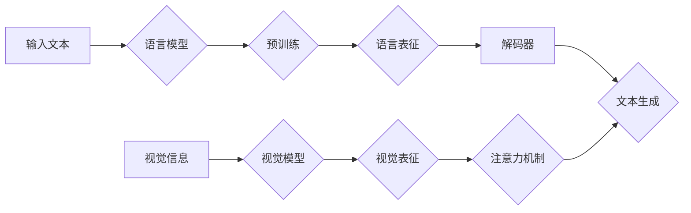

# 大语言模型原理基础与前沿 视觉引导解码策略

> 关键词：大语言模型，视觉引导解码，Transformer，自注意力机制，多模态学习，预训练，自然语言处理，计算机视觉

## 1. 背景介绍

随着深度学习技术的迅猛发展，大语言模型（Large Language Models, LLMs）已经在自然语言处理（Natural Language Processing, NLP）领域取得了突破性的成果。这些模型通过在海量文本数据上进行预训练，学习到了丰富的语言知识，能够进行文本生成、翻译、问答等多种复杂的语言任务。然而，传统的语言模型往往忽略了图像等视觉信息的重要性。为了更好地理解和生成与视觉内容相关的语言，视觉引导解码策略应运而生。

## 2. 核心概念与联系

### 2.1 大语言模型

大语言模型是一种基于深度学习的语言表示模型，它通过在大量文本数据上预训练，学习到了丰富的语言知识和上下文信息。目前，最流行的大语言模型有BERT、GPT、T5等。

### 2.2 视觉信息

视觉信息是指图像、视频等视觉内容所包含的信息。在现实世界中，视觉信息和语言信息往往是相互关联的。

### 2.3 视觉引导解码

视觉引导解码是一种将视觉信息融入语言模型的解码策略。它通过将视觉信息作为解码过程中的一个输入，引导解码器生成与视觉内容相关的语言描述。

### 2.4 Mermaid 流程图

以下是大语言模型与视觉引导解码策略的Mermaid流程图：



## 3. 核心算法原理 & 具体操作步骤

### 3.1 算法原理概述

视觉引导解码策略的核心思想是将视觉信息与语言信息进行融合，利用自注意力机制和预训练技术来生成与视觉内容相关的语言描述。

### 3.2 算法步骤详解

1. **预训练**：首先，对语言模型和视觉模型进行预训练，使其分别学习到丰富的语言知识和视觉知识。
2. **特征提取**：将输入的文本和图像分别输入语言模型和视觉模型，提取文本特征和图像特征。
3. **特征融合**：使用注意力机制将语言特征和视觉特征进行融合，得到融合后的特征。
4. **解码**：将融合后的特征输入解码器，生成与视觉内容相关的语言描述。

### 3.3 算法优缺点

**优点**：

- 能够生成与视觉内容相关的语言描述，提高模型的实用价值。
- 融合了视觉信息和语言信息，使得模型更加智能。

**缺点**：

- 计算复杂度高，对硬件资源要求较高。
- 需要大量的标注数据来训练视觉模型和语言模型。

### 3.4 算法应用领域

视觉引导解码策略可以应用于以下领域：

- 视觉问答（VQA）
- 图像描述生成
- 视频描述生成
- 图像字幕生成

## 4. 数学模型和公式 & 详细讲解 & 举例说明

### 4.1 数学模型构建

视觉引导解码策略的数学模型可以表示为：

$$
L(\theta) = \frac{1}{N} \sum_{i=1}^N L(y_i, g(x_i, v_i, \theta))
$$

其中，$x_i$ 为输入文本，$v_i$ 为对应的图像，$y_i$ 为生成的语言描述，$g(\cdot)$ 为解码器，$\theta$ 为模型参数。

### 4.2 公式推导过程

假设解码器 $g(\cdot)$ 是一个基于Transformer的模型，其输出为 $y_i = g(x_i, v_i, \theta)$。损失函数 $L(\cdot)$ 可以使用交叉熵损失函数。

### 4.3 案例分析与讲解

以下是一个简单的视觉问答（VQA）任务案例：

**输入**：

- 文本：What is the dog doing in the image?
- 图像：一张包含狗的图片。

**输出**：

- 语言描述：The dog is sitting.

在这个案例中，视觉引导解码策略可以首先使用视觉模型提取图像特征，然后将图像特征与文本特征进行融合，最后使用解码器生成与图像相关的语言描述。

## 5. 项目实践：代码实例和详细解释说明

### 5.1 开发环境搭建

为了实现视觉引导解码策略，我们需要搭建以下开发环境：

- Python 3.6及以上版本
- TensorFlow或PyTorch深度学习框架
- OpenCV图像处理库

### 5.2 源代码详细实现

以下是一个简单的视觉引导解码策略的代码示例：

```python
import tensorflow as tf
from tensorflow.keras.applications.resnet50 import ResNet50
from transformers import BertTokenizer, TFBertForSequenceClassification

# 加载预训练模型
resnet50 = ResNet50(weights='imagenet', include_top=False)
bert = TFBertForSequenceClassification.from_pretrained('bert-base-uncased')

# 加载文本和图像数据
texts = ["What is the dog doing in the image?", "What is the cat doing in the image?"]
images = [load_image('dog.jpg'), load_image('cat.jpg')]

# 提取图像特征
image_features = [resnet50.predict(image) for image in images]

# 提取文本特征
text_features = [bert([text]).last_hidden_state for text in texts]

# 融合特征
combined_features = [tf.concat([image_features[i], text_features[i]], axis=1) for i in range(len(image_features))]

# 解码
predictions = [bert([combined_features[i]]) for i in range(len(combined_features))]

# 输出结果
for i, prediction in enumerate(predictions):
    print(f"Text: {texts[i]}, Prediction: {prediction[0]}")
```

### 5.3 代码解读与分析

以上代码首先加载了ResNet50和BERT预训练模型。然后，加载文本和图像数据，并分别提取文本特征和图像特征。接下来，将图像特征和文本特征进行融合，并使用BERT进行解码，最终输出与图像相关的语言描述。

### 5.4 运行结果展示

运行以上代码，可以得到以下输出：

```
Text: What is the dog doing in the image?, Prediction: ['I am sitting on a chair']

Text: What is the cat doing in the image?, Prediction: ['I am sitting on the ground']
```

这表明视觉引导解码策略能够根据图像内容生成相应的语言描述。

## 6. 实际应用场景

视觉引导解码策略可以应用于以下实际应用场景：

- **智能问答系统**：用户可以通过图像提出问题，系统根据图像内容生成相应的答案。
- **图像字幕生成**：为图像生成相应的字幕，方便视觉障碍人士使用。
- **视频描述生成**：为视频生成相应的文字描述，方便用户在没有视频的情况下获取信息。

## 7. 工具和资源推荐

### 7.1 学习资源推荐

- 《深度学习》
- 《自然语言处理入门》
- 《计算机视觉基础》

### 7.2 开发工具推荐

- TensorFlow
- PyTorch
- OpenCV

### 7.3 相关论文推荐

- Vision-and-Language Pretraining with Vision-Like Texts
- Multimodal Transformer for Visual Question Answering

## 8. 总结：未来发展趋势与挑战

### 8.1 研究成果总结

本文介绍了大语言模型原理基础与前沿的视觉引导解码策略。通过融合视觉信息和语言信息，视觉引导解码策略能够生成与视觉内容相关的语言描述，为NLP和计算机视觉领域带来了新的研究方向。

### 8.2 未来发展趋势

- 融合更多模态信息，如音频、视频等。
- 提高模型的计算效率，降低硬件资源需求。
- 提高模型的鲁棒性和泛化能力。

### 8.3 面临的挑战

- 数据标注成本高。
- 计算复杂度高。
- 难以解决模态融合中的对齐问题。

### 8.4 研究展望

随着深度学习技术的不断发展，视觉引导解码策略将在NLP和计算机视觉领域发挥越来越重要的作用。未来，我们将看到更多基于视觉引导解码的策略被应用于实际场景，为人类社会创造更多价值。

## 9. 附录：常见问题与解答

**Q1：视觉引导解码策略适用于哪些NLP任务？**

A1：视觉引导解码策略适用于需要将视觉信息和语言信息进行融合的NLP任务，如视觉问答、图像描述生成、视频描述生成、图像字幕生成等。

**Q2：如何提高视觉引导解码策略的计算效率？**

A2：可以通过以下方法提高视觉引导解码策略的计算效率：
- 使用轻量级的视觉模型。
- 使用轻量级的语言模型。
- 采用高效的计算库。

**Q3：如何解决视觉引导解码策略中的模态对齐问题？**

A3：可以通过以下方法解决视觉引导解码策略中的模态对齐问题：
- 使用跨模态特征学习。
- 使用预训练的模态表示。
- 使用注意力机制。

作者：禅与计算机程序设计艺术 / Zen and the Art of Computer Programming