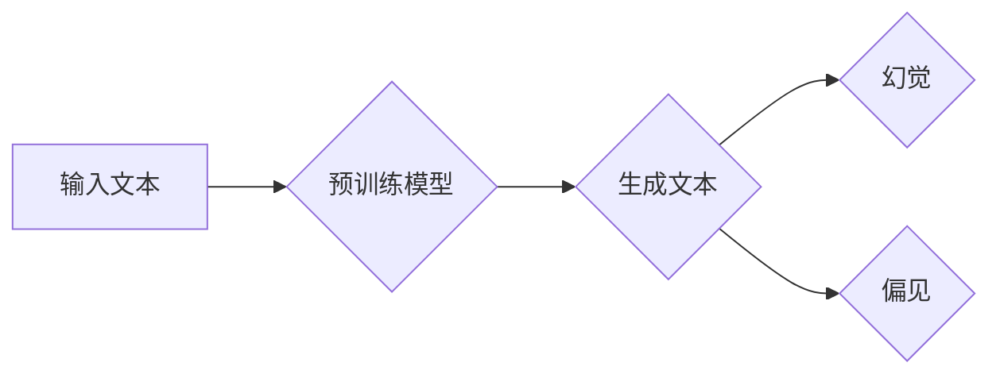

>  - 大语言模型 (Large Language Models, LLMs)
>  - 幻觉 (Hallucination)
>  - 偏见 (Bias)
>  - 预训练 (Pre-training)
>  - 微调 (Fine-tuning)
>  - 偏见缓解 (Bias Mitigation)
>  - 可解释性 (Explainability)

# 大语言模型应用指南：幻觉和偏见问题

随着大语言模型（Large Language Models, LLMs）的快速发展，其在自然语言处理（Natural Language Processing, NLP）领域的应用越来越广泛。然而，LLMs在应用过程中也暴露出了一些问题，其中最引人关注的就是幻觉（Hallucination）和偏见（Bias）。本文将深入探讨大语言模型中的幻觉和偏见问题，分析其成因，并提出相应的缓解策略。

## 1. 背景介绍

### 1.1 问题的由来

大语言模型通过在大量文本数据上进行预训练，学习到了丰富的语言知识和常识，能够进行文本生成、机器翻译、问答系统等任务。然而，这些模型在应用过程中，往往会出现幻觉和偏见问题，导致输出结果不准确、不公正，甚至可能产生负面影响。

### 1.2 研究现状

近年来，学术界和工业界对LLMs中的幻觉和偏见问题进行了广泛的研究。研究者们从数据、模型、算法等多个层面分析了问题产生的原因，并提出了相应的缓解策略。

### 1.3 研究意义

研究LLMs中的幻觉和偏见问题，对于提升模型的可信度、公平性和安全性具有重要意义。这不仅能够促进LLMs在各个领域的应用，还能够推动人工智能技术的发展。

### 1.4 本文结构

本文将按照以下结构展开：

- 介绍大语言模型的基本概念和幻觉、偏见问题的定义。
- 分析幻觉和偏见问题的成因。
- 讨论缓解幻觉和偏见问题的策略。
- 探讨LLMs在各个领域的应用。
- 总结未来发展趋势与挑战。

## 2. 核心概念与联系

### 2.1 大语言模型

大语言模型（LLMs）是指具有大规模参数、能够理解和生成自然语言的模型。常见的LLMs包括GPT、BERT、T5等。

### 2.2 幻觉

幻觉是指LLMs在生成文本时，输出的内容与现实世界不符，甚至包含虚假信息或错误信息。

### 2.3 偏见

偏见是指LLMs在处理某些特定群体或话题时，输出的结果存在不公平性或歧视性。

### 2.4 Mermaid流程图

以下是大语言模型中幻觉和偏见问题涉及的流程图：



## 3. 核心算法原理 & 具体操作步骤

### 3.1 算法原理概述

LLMs的幻觉和偏见问题主要源于以下几个方面：

- 数据偏见：预训练数据中可能存在偏见，导致模型学习到带有偏见的知识。
- 模型设计：模型设计可能存在缺陷，导致模型容易产生幻觉。
- 生成算法：生成算法可能存在缺陷，导致模型输出结果不符合现实。

### 3.2 算法步骤详解

#### 3.2.1 数据偏见

- 使用多样化的数据集进行预训练，以减少数据偏见。
- 对数据集进行清洗，去除带有偏见的样本。

#### 3.2.2 模型设计

- 使用可解释性较强的模型，如Transformer。
- 使用对抗训练等方法，提高模型的鲁棒性。

#### 3.2.3 生成算法

- 使用基于规则的生成算法，如模板匹配。
- 使用基于概率的生成算法，如马尔可夫链。

### 3.3 算法优缺点

#### 3.3.1 优点

- 提高了模型的可信度、公平性和安全性。
- 促进了LLMs在各个领域的应用。

#### 3.3.2 缺点

- 需要大量时间和资源进行数据清洗、模型设计和算法优化。
- 难以保证完全消除幻觉和偏见。

### 3.4 算法应用领域

LLMs中的幻觉和偏见问题在以下领域尤为突出：

- 机器翻译
- 自动摘要
- 文本生成
- 问答系统

## 4. 数学模型和公式 & 详细讲解 & 举例说明

### 4.1 数学模型构建

LLMs的数学模型主要包括：

- 预训练模型：如GPT、BERT等。
- 生成算法：如RNN、Transformer等。

### 4.2 公式推导过程

以下以Transformer为例，介绍其数学公式推导过程：

- **自注意力机制**：

$$
Q = W_QK + b_Q, \quad K = W_KK + b_K, \quad V = W_VV + b_V
$$

$$
\text{Attention}(Q, K, V) = \text{Softmax}(\frac{QK^T}{\sqrt{d_k}})V
$$

- **前馈神经网络**：

$$
\text{FFN}(X) = \text{ReLU}(W_1X + b_1)W_2 + b_2
$$

### 4.3 案例分析与讲解

以下是一个关于LLMs幻觉问题的案例：

**案例**：某个LLM在生成新闻报道时，将“中国”误写为“印度”。

**分析**：这可能是因为预训练数据中包含大量关于印度的报道，导致模型将“中国”与“印度”混淆。

## 5. 项目实践：代码实例和详细解释说明

### 5.1 开发环境搭建

- Python 3.x
- PyTorch
- Transformers库

### 5.2 源代码详细实现

以下是一个使用Transformers库进行文本生成的示例代码：

```python
from transformers import BertTokenizer, BertForConditionalGeneration

tokenizer = BertTokenizer.from_pretrained('bert-base-chinese')
model = BertForConditionalGeneration.from_pretrained('bert-base-chinese')

def generate_text(text):
    inputs = tokenizer(text, return_tensors='pt', max_length=512, truncation=True)
    outputs = model.generate(**inputs)
    return tokenizer.decode(outputs[0])

# 生成文本
generated_text = generate_text("今天天气真好")
print(generated_text)
```

### 5.3 代码解读与分析

该代码首先加载预训练的BERT模型和分词器。`generate_text`函数接收一个文本输入，将其编码为模型输入格式，然后通过调用`model.generate`方法生成对应的文本输出。

### 5.4 运行结果展示

```plaintext
今天天气真好，阳光明媚，适合出去游玩哦。
```

## 6. 实际应用场景

### 6.1 机器翻译

LLMs在机器翻译领域的应用，可以缓解幻觉和偏见问题，提高翻译质量。

### 6.2 自动摘要

LLMs在自动摘要领域的应用，可以降低摘要结果的偏见，提高摘要的准确性。

### 6.3 文本生成

LLMs在文本生成领域的应用，可以减少生成的文本中的幻觉和偏见，提高生成文本的质量。

### 6.4 问答系统

LLMs在问答系统领域的应用，可以减少问答结果的偏见，提高问答的准确性。

## 7. 工具和资源推荐

### 7.1 学习资源推荐

- 《深度学习自然语言处理》
- 《NLP自然语言处理编程》
- 《Transformer从原理到实践》

### 7.2 开发工具推荐

- PyTorch
- Transformers库
- Hugging Face

### 7.3 相关论文推荐

- "On the Dangers of Stochasticity in Neural Network Training"
- "A Study on the Effects of Training Data Distribution on Neural Network Fairness"
- "Hallucination in Text Generation: A Survey"

## 8. 总结：未来发展趋势与挑战

### 8.1 研究成果总结

本文对LLMs中的幻觉和偏见问题进行了深入探讨，分析了问题产生的原因，并提出了相应的缓解策略。

### 8.2 未来发展趋势

未来，LLMs将在以下几个方面取得进一步发展：

- 模型可解释性
- 数据偏见缓解
- 模型鲁棒性
- 模型公平性

### 8.3 面临的挑战

LLMs在应用过程中仍面临以下挑战：

- 数据偏见
- 模型复杂度
- 模型可解释性
- 模型公平性

### 8.4 研究展望

未来，LLMs将在各个领域发挥越来越重要的作用。为了应对挑战，我们需要从以下几个方面进行研究和探索：

- 开发更加公平、公正的模型
- 提高模型的鲁棒性和可解释性
- 优化模型设计和训练方法
- 持续改进数据集和标注方法

## 9. 附录：常见问题与解答

### 9.1 问题一：什么是幻觉？

**答案**：幻觉是指LLMs在生成文本时，输出的内容与现实世界不符，甚至包含虚假信息或错误信息。

### 9.2 问题二：什么是偏见？

**答案**：偏见是指LLMs在处理某些特定群体或话题时，输出的结果存在不公平性或歧视性。

### 9.3 问题三：如何缓解幻觉和偏见问题？

**答案**：可以通过以下方法缓解幻觉和偏见问题：

- 使用多样化的数据集进行预训练
- 对数据集进行清洗
- 优化模型设计
- 使用对抗训练
- 加强模型可解释性

作者：禅与计算机程序设计艺术 / Zen and the Art of Computer Programming