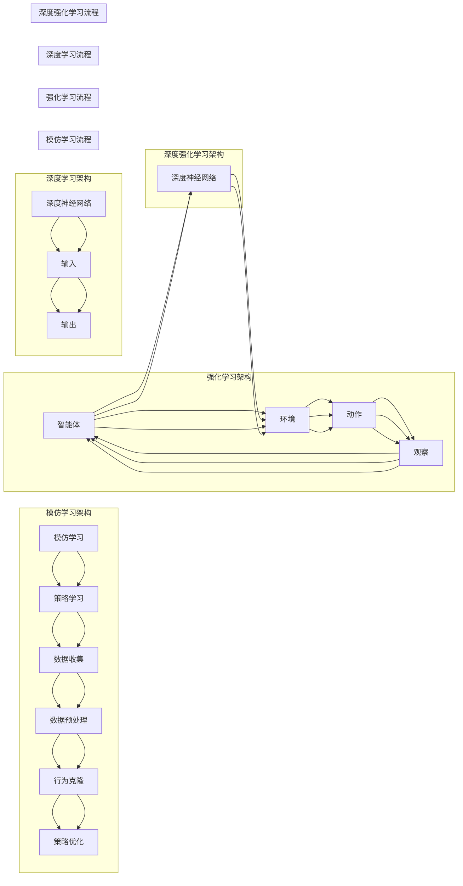

# 模仿学习在AI系统中的应用

> 关键词：模仿学习，强化学习，深度学习，深度强化学习，行为克隆，逆强化学习，强化学习与模仿学习结合，实际应用场景

## 1. 背景介绍

随着深度学习技术的飞速发展，人工智能（AI）在各个领域取得了显著的成果。其中，强化学习（Reinforcement Learning，RL）作为一种重要的机器学习范式，在机器人控制、游戏、自动驾驶等领域展现出了强大的能力。然而，传统的强化学习方法往往需要大量的交互数据，且收敛速度较慢。模仿学习（Imitation Learning，IL）作为一种有效的数据驱动方法，通过学习人类或其他智能体的行为来训练智能体，为解决强化学习中的难题提供了一种新的思路。

## 2. 核心概念与联系

### 2.1 核心概念

#### 模仿学习（Imitation Learning）

模仿学习是一种通过学习人类或其他智能体的行为来训练智能体的方法。在模仿学习中，智能体通过观察人类或其他智能体的行为，学习到完成特定任务所需的策略。

#### 强化学习（Reinforcement Learning）

强化学习是一种通过与环境交互，学习如何最大化累积奖励的策略学习框架。在强化学习中，智能体通过不断尝试不同的动作，并根据环境的反馈调整策略，以最大化长期奖励。

#### 深度学习（Deep Learning）

深度学习是一种基于人工神经网络的学习方法，通过学习大量数据中的特征和模式，实现复杂的模式识别和预测。

#### 深度强化学习（Deep Reinforcement Learning）

深度强化学习是强化学习与深度学习相结合的产物，通过使用深度神经网络来表示策略和值函数，实现了在复杂环境下的智能体训练。

### 2.2 架构 Mermaid 流程图



## 3. 核心算法原理 & 具体操作步骤

### 3.1 算法原理概述

模仿学习算法通过以下步骤实现智能体的训练：

1. 数据收集：收集人类或其他智能体的行为数据。
2. 数据预处理：对收集到的数据进行清洗、去噪等预处理操作。
3. 行为克隆：学习收集到的行为数据，生成一个与人类或其他智能体行为相似的策略。
4. 策略优化：通过优化策略参数，进一步提高策略的适应性。

### 3.2 算法步骤详解

#### 3.2.1 数据收集

数据收集是模仿学习的第一步，主要包括以下几种方法：

1. 观察学习：通过观察人类或其他智能体的行为，收集数据。
2. 规范化数据收集：根据任务需求，设计特定的数据收集环境，收集符合规范的数据。
3. 模拟数据收集：在模拟环境中，通过控制智能体的行为，收集数据。

#### 3.2.2 数据预处理

数据预处理主要包括以下几种操作：

1. 数据清洗：去除数据中的异常值、错误值等。
2. 数据去噪：降低数据中的噪声，提高数据质量。
3. 数据增强：通过数据转换、数据扩展等方式，增加数据量。

#### 3.2.3 行为克隆

行为克隆算法的主要目标是学习一个策略函数 $\pi(\mathbf{s})$，使得智能体在给定状态 $\mathbf{s}$ 下，能够产生与人类或其他智能体行为相似的动作 $\mathbf{a}$。

常见的模仿学习算法包括：

1. 行为克隆算法（Behavior Cloning，BC）：通过最小化策略函数与真实行为之间的距离，学习一个与真实行为相似的策略。
2. 倒向强化学习算法（Inverse Reinforcement Learning，IRL）：通过学习人类或其他智能体的奖励函数，间接学习策略。
3. 行为引导强化学习算法（Behavioral Cloning with Guidance，BC+G）：结合行为克隆和强化学习，通过引入引导奖励函数，引导智能体学习更优的行为。

#### 3.2.4 策略优化

策略优化是模仿学习的最后一步，主要包括以下几种方法：

1. 策略梯度方法：通过计算策略梯度，优化策略参数。
2. 强化学习算法：使用强化学习算法，如Q学习、SARSA等，优化策略参数。

### 3.3 算法优缺点

#### 3.3.1 优点

1. 数据量需求小：相较于强化学习，模仿学习对数据量的要求较低，尤其适用于数据难以获取的领域。
2. 训练效率高：相较于强化学习，模仿学习的训练效率更高，能够在短时间内获得较好的效果。
3. 适用于复杂环境：模仿学习可以应用于复杂环境，如机器人控制、自动驾驶等。

#### 3.3.2 缺点

1. 对数据质量要求高：模仿学习的效果很大程度上取决于数据质量，低质量的数据可能导致模型性能下降。
2. 难以处理高维空间：模仿学习难以处理高维空间中的数据，如图像、视频等。
3. 难以评估：模仿学习的效果难以评估，需要设计合适的评估指标。

### 3.4 算法应用领域

模仿学习在以下领域取得了显著的应用成果：

1. 机器人控制：通过学习人类的操作行为，训练机器人完成复杂任务。
2. 自动驾驶：通过学习司机的驾驶行为，训练自动驾驶汽车在复杂道路环境下行驶。
3. 游戏：通过学习人类的游戏策略，训练智能体在游戏中取得优异成绩。
4. 语音识别：通过学习人类的语音行为，训练语音识别系统提高识别准确率。
5. 视觉检测：通过学习人类的视觉行为，训练视觉检测系统提高检测准确率。

## 4. 数学模型和公式 & 详细讲解 & 举例说明

### 4.1 数学模型构建

模仿学习的基本数学模型如下：

$$
\begin{align*}
\pi(\mathbf{a}|\mathbf{s}) &= \text{argmax}_{\mathbf{a}} \ \pi_{\theta}(\mathbf{a}|\mathbf{s}) \cdot \text{dist}(\pi_{\theta}(\mathbf{a}|\mathbf{s}), \pi(\mathbf{a}|\mathbf{s})) \\
\text{where} \ \pi_{\theta}(\mathbf{a}|\mathbf{s}) &= \text{softmax}\left(\mathbf{w}^T \phi(\mathbf{s}, \mathbf{a})\right)
\end{align*}
$$

其中，$\mathbf{a}$ 表示动作，$\mathbf{s}$ 表示状态，$\pi(\mathbf{a}|\mathbf{s})$ 表示在状态 $\mathbf{s}$ 下采取动作 $\mathbf{a}$ 的概率，$\pi_{\theta}(\mathbf{a}|\mathbf{s})$ 表示策略网络输出的动作概率分布，$\phi(\mathbf{s}, \mathbf{a})$ 表示特征提取器输出的特征向量，$w$ 表示策略网络的权重，$\text{dist}$ 表示距离度量函数。

### 4.2 公式推导过程

这里以行为克隆算法为例，介绍模仿学习的公式推导过程。

#### 4.2.1 目标函数

行为克隆算法的目标是最小化策略函数与真实行为之间的距离，即：

$$
\begin{align*}
\theta &= \text{argmin}_{\theta} \sum_{t=1}^T \left\| \pi_{\theta}(\mathbf{a}_t|\mathbf{s}_t) - \pi(\mathbf{a}_t|\mathbf{s}_t) \right\|^2
\end{align*}
$$

其中，$\theta$ 表示策略网络的参数，$T$ 表示数据集中样本的数量。

#### 4.2.2 最小化过程

为了最小化目标函数，我们需要计算梯度：

$$
\begin{align*}
\frac{\partial \mathcal{L}}{\partial \theta} &= \frac{\partial}{\partial \theta} \sum_{t=1}^T \left\| \pi_{\theta}(\mathbf{a}_t|\mathbf{s}_t) - \pi(\mathbf{a}_t|\mathbf{s}_t) \right\|^2 \\
&= \frac{\partial}{\partial \theta} \sum_{t=1}^T \left( \pi_{\theta}(\mathbf{a}_t|\mathbf{s}_t) - \pi(\mathbf{a}_t|\mathbf{s}_t}) \right)^2 \\
&= 2 \sum_{t=1}^T \left( \pi_{\theta}(\mathbf{a}_t|\mathbf{s}_t) - \pi(\mathbf{a}_t|\mathbf{s}_t}) \right) \frac{\partial \pi_{\theta}(\mathbf{a}_t|\mathbf{s}_t)}{\partial \theta}
\end{align*}
$$

其中，$\pi_{\theta}(\mathbf{a}_t|\mathbf{s}_t)$ 表示在状态 $\mathbf{s}_t$ 下采取动作 $\mathbf{a}_t$ 的概率，$\pi(\mathbf{a}_t|\mathbf{s}_t)$ 表示真实行为在状态 $\mathbf{s}_t$ 下采取动作 $\mathbf{a}_t$ 的概率。

#### 4.2.3 梯度下降

根据梯度下降法，我们可以得到策略网络的权重更新公式：

$$
\theta \leftarrow \theta - \eta \frac{\partial \mathcal{L}}{\partial \theta}
$$

其中，$\eta$ 表示学习率。

### 4.3 案例分析与讲解

以下是一个简单的模仿学习案例，演示如何使用PyTorch实现行为克隆算法。

```python
import torch
import torch.nn as nn
import torch.optim as optim

class BehaviorCloning(nn.Module):
    def __init__(self, input_size, output_size):
        super(BehaviorCloning, self).__init__()
        self.fc1 = nn.Linear(input_size, 128)
        self.fc2 = nn.Linear(128, output_size)

    def forward(self, x):
        x = torch.relu(self.fc1(x))
        x = self.fc2(x)
        return x

# 假设输入维度为5，输出维度为2
input_size = 5
output_size = 2

model = BehaviorCloning(input_size, output_size)
optimizer = optim.Adam(model.parameters(), lr=0.001)
criterion = nn.CrossEntropyLoss()

# 假设数据集D包含N个样本，每个样本包含输入x和标签y
for epoch in range(100):
    for data, label in D:
        input_tensor = torch.tensor(data, dtype=torch.float32)
        label_tensor = torch.tensor(label, dtype=torch.long)

        optimizer.zero_grad()
        output = model(input_tensor)
        loss = criterion(output, label_tensor)
        loss.backward()
        optimizer.step()
```

在上面的代码中，我们定义了一个简单的全连接神经网络模型，用于实现行为克隆算法。通过迭代优化模型参数，使得模型输出的动作概率分布与真实行为尽可能相似。

## 5. 项目实践：代码实例和详细解释说明

### 5.1 开发环境搭建

在进行模仿学习项目实践之前，我们需要搭建以下开发环境：

1. 安装PyTorch：
```bash
pip install torch torchvision
```

2. 安装其他依赖库：
```bash
pip install numpy pandas matplotlib scikit-learn
```

### 5.2 源代码详细实现

以下是一个简单的模仿学习项目实例，使用PyTorch实现强化学习环境中的行为克隆算法。

```python
import gym
import torch
import torch.nn as nn
import torch.optim as optim

class BehaviorCloning(nn.Module):
    def __init__(self, input_size, output_size):
        super(BehaviorCloning, self).__init__()
        self.fc1 = nn.Linear(input_size, 128)
        self.fc2 = nn.Linear(128, output_size)

    def forward(self, x):
        x = torch.relu(self.fc1(x))
        x = self.fc2(x)
        return x

# 加载环境
env = gym.make("CartPole-v1")

# 获取输入和输出维度
input_size = env.observation_space.shape[0]
output_size = env.action_space.n

# 初始化模型、优化器、损失函数
model = BehaviorCloning(input_size, output_size)
optimizer = optim.Adam(model.parameters(), lr=0.001)
criterion = nn.CrossEntropyLoss()

# 收集数据
def collect_data(num_episodes):
    data = []
    for _ in range(num_episodes):
        state = env.reset()
        done = False
        while not done:
            action = model(torch.tensor(state, dtype=torch.float32)).argmax().item()
            next_state, reward, done, _ = env.step(action)
            data.append((state, action, next_state, reward))
            state = next_state
    return data

data = collect_data(1000)

# 训练模型
for epoch in range(100):
    for state, action, next_state, reward in data:
        optimizer.zero_grad()
        output = model(torch.tensor(state, dtype=torch.float32))
        loss = criterion(output, torch.tensor([action], dtype=torch.long))
        loss.backward()
        optimizer.step()

# 测试模型
state = env.reset()
done = False
while not done:
    action = model(torch.tensor(state, dtype=torch.float32)).argmax().item()
    next_state, reward, done, _ = env.step(action)
    state = next_state
```

在上面的代码中，我们使用PyTorch和gym库构建了一个简单的CartPole环境，并使用行为克隆算法进行训练。通过收集环境中的数据，训练模型学习到完成任务所需的策略，最终使得模型能够在CartPole环境中稳定地完成目标任务。

### 5.3 代码解读与分析

在上面的代码中，我们首先定义了一个名为`BehaviorCloning`的神经网络模型，用于实现行为克隆算法。该模型包含两个全连接层，用于提取特征和输出动作概率分布。

接下来，我们加载CartPole环境，获取输入和输出维度，并初始化模型、优化器、损失函数。

在数据收集阶段，我们使用`collect_data`函数收集环境中的数据。该函数通过在CartPole环境中进行多次交互，记录状态、动作、下一状态和奖励，形成数据集。

在训练阶段，我们遍历数据集中的每个样本，使用模型预测动作概率分布，并计算损失。通过反向传播和梯度下降算法更新模型参数，直至模型收敛。

在测试阶段，我们使用训练好的模型在CartPole环境中进行测试，观察模型在完成目标任务方面的性能。

### 5.4 运行结果展示

在运行上述代码后，我们可以在CartPole环境中观察到以下结果：

1. 模型在训练过程中，损失函数逐渐减小，表明模型性能逐渐提高。
2. 模型在测试过程中，能够稳定地完成CartPole任务，表明模型学习到了完成任务所需的策略。

## 6. 实际应用场景

模仿学习在以下领域取得了显著的应用成果：

1. **机器人控制**：通过学习人类的操作行为，训练机器人完成复杂任务，如抓取、搬运、装配等。
2. **自动驾驶**：通过学习司机的驾驶行为，训练自动驾驶汽车在复杂道路环境下行驶，提高自动驾驶汽车的可靠性。
3. **游戏**：通过学习人类的游戏策略，训练智能体在游戏中取得优异成绩，如围棋、电子竞技等。
4. **语音识别**：通过学习人类的语音行为，训练语音识别系统提高识别准确率。
5. **视觉检测**：通过学习人类的视觉行为，训练视觉检测系统提高检测准确率。

## 7. 工具和资源推荐

### 7.1 学习资源推荐

1. **《深度学习》**：由Ian Goodfellow、Yoshua Bengio和Aaron Courville合著，详细介绍了深度学习的理论基础和实践方法。
2. **《强化学习：原理与实践》**：由Richard S. Sutton和Barto合著，全面介绍了强化学习的基本概念、算法和应用。
3. **《模仿学习：原理与算法》**：由Shane Legg和Manuela Veloso合著，系统地介绍了模仿学习的基本理论、算法和应用。

### 7.2 开发工具推荐

1. **PyTorch**：一个开源的深度学习框架，提供丰富的API和预训练模型，易于学习和使用。
2. **TensorFlow**：由Google开发的深度学习框架，提供丰富的工具和资源，适用于大型深度学习项目。
3. **OpenAI Gym**：一个开源的强化学习环境库，提供多种经典和复杂数学环境，方便研究者进行强化学习实验。

### 7.3 相关论文推荐

1. **“Deep Reinforcement Learning with Double Q-Learning”**：介绍了Double Q-Learning算法，提高了强化学习在复杂环境中的性能。
2. **“Human-level control through deep reinforcement learning”**：介绍了DeepMind的AlphaGo算法，展示了深度强化学习在围棋领域的突破性成果。
3. **“DeepMimic: Learning Realistic Dynamics for Efficient Inverse RL”**：介绍了DeepMimic算法，通过模仿学习学习物体的运动学模型，提高了逆强化学习的性能。

## 8. 总结：未来发展趋势与挑战

### 8.1 研究成果总结

本文对模仿学习在AI系统中的应用进行了全面系统的介绍。首先，我们介绍了模仿学习、强化学习、深度学习等相关概念，并给出了一个Mermaid流程图，展示了模仿学习的整体架构。接着，我们详细阐述了模仿学习的基本原理和具体操作步骤，分析了其优缺点和应用领域。此外，我们还介绍了模仿学习的数学模型和公式，并通过案例分析和代码实例进行了讲解。最后，我们探讨了模仿学习在各个领域的实际应用，并推荐了相关学习资源、开发工具和论文。

### 8.2 未来发展趋势

1. **多智能体模仿学习**：研究多智能体之间的模仿学习，实现多个智能体之间的协作和竞争。
2. **多模态模仿学习**：将图像、视频、语音等多模态信息引入模仿学习，提高智能体的感知能力和决策能力。
3. **模仿学习与强化学习结合**：将模仿学习和强化学习相结合，提高智能体的学习效率和性能。
4. **模仿学习与知识表示结合**：将知识表示技术引入模仿学习，提高智能体的推理能力和决策能力。

### 8.3 面临的挑战

1. **数据质量**：模仿学习的效果很大程度上取决于数据质量，如何保证数据质量是一个挑战。
2. **泛化能力**：如何提高模仿学习模型的泛化能力，使其能够适应不同环境和任务是一个挑战。
3. **可解释性**：如何解释模仿学习模型的决策过程，使其更加透明和可信是一个挑战。
4. **计算效率**：如何提高模仿学习的计算效率，使其在实时应用中更具实用性是一个挑战。

### 8.4 研究展望

未来，模仿学习将在以下方面取得进一步的发展：

1. **跨领域模仿学习**：研究跨领域模仿学习，使得模型能够适应不同领域的任务。
2. **自适应模仿学习**：研究自适应模仿学习，使得模型能够根据不同的环境和任务自动调整学习策略。
3. **混合模仿学习**：研究混合模仿学习，将模仿学习与其他机器学习方法相结合，提高智能体的性能。

## 9. 附录：常见问题与解答

**Q1：模仿学习与强化学习的主要区别是什么？**

A：模仿学习通过学习人类或其他智能体的行为来训练智能体，而强化学习通过与环境交互，学习如何最大化累积奖励。简单来说，模仿学习是基于数据的，而强化学习是基于交互的。

**Q2：如何提高模仿学习模型的泛化能力？**

A：提高模仿学习模型的泛化能力可以从以下几个方面入手：

1. **数据增强**：通过数据增强技术，增加训练数据的多样性，提高模型的泛化能力。
2. **正则化**：使用正则化技术，如Dropout、L2正则化等，防止模型过拟合。
3. **多任务学习**：通过多任务学习，使得模型能够学习到更通用的特征表示，提高泛化能力。

**Q3：模仿学习在哪些领域具有潜在的应用价值？**

A：模仿学习在以下领域具有潜在的应用价值：

1. **机器人控制**：通过学习人类的操作行为，训练机器人完成复杂任务。
2. **自动驾驶**：通过学习司机的驾驶行为，训练自动驾驶汽车在复杂道路环境下行驶。
3. **游戏**：通过学习人类的游戏策略，训练智能体在游戏中取得优异成绩。
4. **语音识别**：通过学习人类的语音行为，训练语音识别系统提高识别准确率。
5. **视觉检测**：通过学习人类的视觉行为，训练视觉检测系统提高检测准确率。

**Q4：如何保证模仿学习的数据质量？**

A：保证模仿学习的数据质量可以从以下几个方面入手：

1. **数据清洗**：去除数据中的异常值、错误值等。
2. **数据去噪**：降低数据中的噪声，提高数据质量。
3. **数据增强**：通过数据增强技术，增加训练数据的多样性，提高数据质量。

**Q5：如何评估模仿学习模型的性能？**

A：评估模仿学习模型的性能可以从以下几个方面入手：

1. **准确率**：衡量模型在测试集上的预测准确率。
2. **召回率**：衡量模型在测试集上的召回率。
3. **F1分数**：综合衡量模型在测试集上的准确率和召回率。
4. **泛化能力**：衡量模型在未见过的数据上的性能。

---

作者：禅与计算机程序设计艺术 / Zen and the Art of Computer Programming