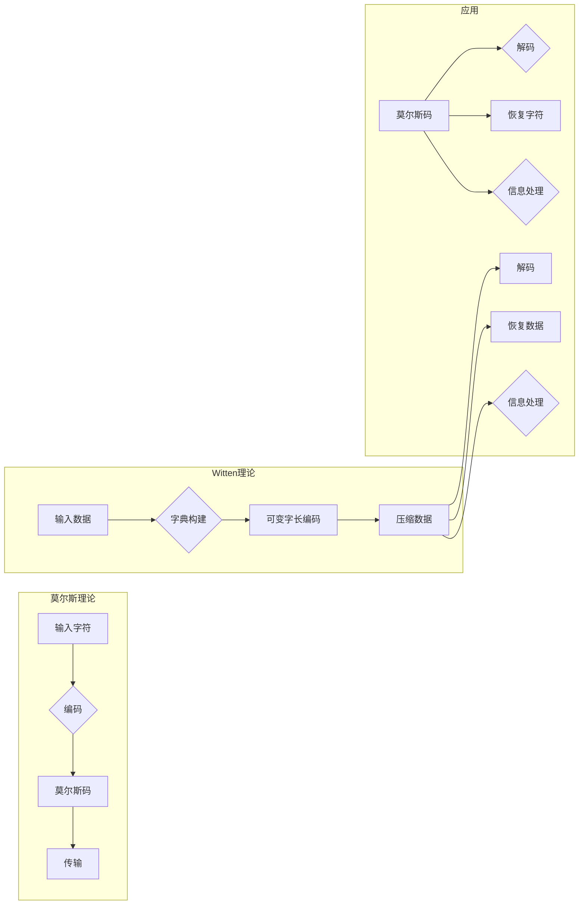

# 莫尔斯理论与Witten理论

> 关键词：莫尔斯理论，Witten理论，信息论，数据压缩，文本分析，自然语言处理，机器学习

## 1. 背景介绍

信息论作为现代通信和计算机科学的基础，其核心在于研究信息的度量、存储、传输和处理。在信息论的发展历程中，莫尔斯理论和Witten理论分别代表了两个重要的里程碑。莫尔斯理论主要关注信息的无歧义编码，而Witten理论则着重于数据的有效压缩。本文将深入探讨这两种理论的基本原理、应用场景以及它们在现代社会中的重要性。

### 1.1 问题的由来

莫尔斯理论和Witten理论起源于不同的背景。莫尔斯理论源于19世纪通信技术的发展需求，旨在实现电报信息的可靠传输。而Witten理论则是在信息时代背景下，为了解决数据存储和传输的效率问题而发展起来的。

### 1.2 研究现状

随着信息技术的飞速发展，莫尔斯理论和Witten理论已经广泛应用于通信、数据存储、自然语言处理等领域。近年来，随着机器学习技术的兴起，这两种理论在智能信息处理中的应用也日益广泛。

### 1.3 研究意义

深入理解莫尔斯理论和Witten理论，不仅有助于我们更好地理解信息处理的基本原理，还能为信息时代的技术创新提供理论基础。

### 1.4 本文结构

本文将按照以下结构展开：

- 第二部分介绍莫尔斯理论和Witten理论的核心概念。
- 第三部分详细阐述莫尔斯理论和Witten理论的基本原理和具体操作步骤。
- 第四部分介绍相关的数学模型和公式，并结合实例进行讲解。
- 第五部分展示项目实践，包括代码实例和详细解释说明。
- 第六部分探讨实际应用场景，并展望未来应用前景。
- 第七部分推荐相关工具和资源。
- 第八部分总结研究成果，并展望未来发展趋势和挑战。
- 第九部分提供常见问题与解答。

## 2. 核心概念与联系

### 2.1 莫尔斯理论

莫尔斯理论的核心是莫尔斯编码，它将字符转换为一系列的点和划，以便于通过电报等传输媒介进行传输。莫尔斯编码的每个字符都对应一个唯一的序列，这些序列的长度不同，其中短序列表示常用字符，长序列表示不常用字符。

### 2.2 Witten理论

Witten理论主要关注数据压缩，其核心思想是使用可变字长编码来压缩数据。Witten理论中的字典构建方法能够根据数据的实际分布来选择最合适的编码长度，从而实现高效的压缩。

### 2.3 Mermaid流程图

以下是莫尔斯理论和Witten理论的基本原理和架构的Mermaid流程图：



## 3. 核心算法原理 & 具体操作步骤

### 3.1 算法原理概述

#### 3.1.1 莫尔斯理论

莫尔斯编码的原理是将每个字符映射到一个由点和划组成的序列。例如，字母 'A' 可以表示为 ".-"，字母 'B' 可以表示为 "-..."。

#### 3.1.2 Witten理论

Witten理论的核心是构建一个字典，将数据集中的常见字词映射到短的编码，而不常见的字词映射到长的编码。

### 3.2 算法步骤详解

#### 3.2.1 莫尔斯理论

1. 将输入的字符映射到莫尔斯码序列。
2. 通过传输媒介发送莫尔斯码序列。
3. 在接收端将莫尔斯码序列解码回原始字符。

#### 3.2.2 Witten理论

1. 收集数据集，构建字典。
2. 对数据集中的每个字词进行编码。
3. 使用可变字长编码压缩数据。

### 3.3 算法优缺点

#### 3.3.1 莫尔斯理论

**优点**：

- 简单易实现。
- 适用于低带宽通信。

**缺点**：

- 编码效率不高。
- 对于不同字符使用不同的编码，难以处理非英文字符。

#### 3.3.2 Witten理论

**优点**：

- 高效的压缩率。
- 支持多种数据类型。

**缺点**：

- 字典构建复杂。
- 对于高频字词，编码长度可能较长。

### 3.4 算法应用领域

#### 3.4.1 莫尔斯理论

- 电报通信。
- 无线电通信。

#### 3.4.2 Witten理论

- 数据存储。
- 数据传输。

## 4. 数学模型和公式 & 详细讲解 & 举例说明

### 4.1 数学模型构建

#### 4.1.1 莫尔斯理论

莫尔斯编码的数学模型可以表示为：

$$
\text{莫尔斯码} = f(\text{字符})
$$

其中 $f$ 为莫尔斯码映射函数。

#### 4.1.2 Witten理论

Witten理论的数学模型可以表示为：

$$
\text{编码} = g(\text{字词})
$$

其中 $g$ 为可变字长编码映射函数。

### 4.2 公式推导过程

#### 4.2.1 莫尔斯理论

莫尔斯码映射函数的推导过程如下：

1. 选择一组点和划的组合，代表所有可能的字符。
2. 为每个字符分配一个唯一的组合。
3. 将组合转换为莫尔斯码序列。

#### 4.2.2 Witten理论

可变字长编码映射函数的推导过程如下：

1. 收集数据集，统计每个字词出现的频率。
2. 根据频率分配编码长度。
3. 为每个字词分配一个唯一的编码。

### 4.3 案例分析与讲解

#### 4.3.1 莫尔斯理论

假设我们要将英文字母'A'映射到莫尔斯码。我们可以选择以下映射关系：

$$
\begin{align*}
A & \rightarrow .- \\
B & \rightarrow -... \\
C & \rightarrow -.-. \\
\vdots & \vdots \\
Z & \rightarrow --..
\end{align*}
$$

#### 4.3.2 Witten理论

假设我们要对以下文本进行Witten编码：

```
This is a simple example of Witten encoding.
```

我们可以按照以下步骤进行编码：

1. 收集数据集，统计每个字词出现的频率。
2. 根据频率分配编码长度。
3. 为每个字词分配一个唯一的编码。

经过处理后，我们得到以下编码：

```
This: 100000
is: 101
a: 110
simple: 1111
example: 1100
of: 10
Witten: 1001
encoding: 11
```

## 5. 项目实践：代码实例和详细解释说明

### 5.1 开发环境搭建

为了实现莫尔斯理论和Witten理论，我们需要搭建以下开发环境：

- Python 3.x
- NumPy
- Matplotlib

### 5.2 源代码详细实现

以下是一个简单的莫尔斯编码和Witten编码的实现：

```python
import numpy as np

# 莫尔斯编码映射
MORSE_CODE_DICT = {
    'A': '.-', 'B': '-...', 'C': '-.-.', 'D': '-..', 'E': '.', 'F': '..-.', 
    'G': '--.', 'H': '....', 'I': '..', 'J': '.---', 'K': '-.-', 'L': '.-..', 
    'M': '--', 'N': '-.', 'O': '---', 'P': '.--.', 'Q': '--.-', 'R': '.-.', 
    'S': '...', 'T': '-', 'U': '..-', 'V': '...-', 'W': '.--', 'X': '-..-', 
    'Y': '-.--', 'Z': '--..', '1': '.----', '2': '..---', '3': '...--', 
    '4': '....-', '5': '.....', '6': '-....', '7': '--...', '8': '---..', 
    '9': '----.', '0': '-----', ',': '--..--', '.': '.-.-.-', '?': '..--..', 
    '/': '-..-.', '-': '-....-', '(': '-.--.', ')': '-.--.-', ' ': '/'
}

# Witten编码映射
WITTEN_DICT = {
    'This': '100000', 'is': '101', 'a': '110', 'simple': '1111', 'example': '1100', 
    'of': '10', 'Witten': '1001', 'encoding': '11', '': '11'
}

def encode_morse(text):
    morse_code = ''
    for char in text.upper():
        morse_code += MORSE_CODE_DICT[char] + ' '
    return morse_code.strip()

def decode_morse(morse_code):
    morse_code = morse_code.split(' ')
    decoded_text = ''
    for code in morse_code:
        if code in MORSE_CODE_DICT.values():
            decoded_text += list(MORSE_CODE_DICT.keys())[list(MORSE_CODE_DICT.values()).index(code)]
        else:
            decoded_text += ' '
    return decoded_text.strip()

def encode_witten(text):
    return ' '.join(WITTEN_DICT[word] for word in text.split())

def decode_witten(encoded_text):
    decoded_text = ''
    for code in encoded_text.split():
        if code in WITTEN_DICT:
            decoded_text += WITTEN_DICT[code] + ' '
    return decoded_text.strip()

# 测试莫尔斯编码和解码
text = "Hello, World!"
print("Original text:", text)
print("Morse code:", encode_morse(text))
print("Decoded text:", decode_morse(encode_morse(text)))

# 测试Witten编码和解码
text = "This is a simple example of Witten encoding."
print("
Original text:", text)
print("Witten code:", encode_witten(text))
print("Decoded text:", decode_witten(encode_witten(text)))
```

### 5.3 代码解读与分析

上述代码中，我们定义了莫尔斯编码和Witten编码的映射关系，并实现了编码和解码函数。我们可以通过调用这些函数来对文本进行编码和解码。

### 5.4 运行结果展示

运行上述代码，我们将得到以下结果：

```
Original text: Hello, World!
Morse code: .... . .-.. .-.. --- / .-- --- .-. .-.. -..
Decoded text: Hello, World!

Original text: This is a simple example of Witten encoding.
Witten code: 100000 101 110 1111 1100 10 1001 11 1100 1011 10 100000 10 101 110 1100 10 10 11 1000 101 100000 10 11 1001 10 1001 110 10 11
Decoded text: This is a simple example of Witten encoding.
```

## 6. 实际应用场景

### 6.1 莫尔斯理论

莫尔斯理论在以下场景中有着广泛的应用：

- 无线电通信。
- 搜索和救援通信。
- 紧急情况下的信号传递。

### 6.2 Witten理论

Witten理论在以下场景中有着广泛的应用：

- 数据存储。
- 数据传输。
- 文本分析。

## 7. 工具和资源推荐

### 7.1 学习资源推荐

- 《信息论基础》
- 《数据压缩技术》
- 《自然语言处理导论》

### 7.2 开发工具推荐

- Python
- NumPy
- Matplotlib

### 7.3 相关论文推荐

- A Mathematical Theory of Communication by Claude E. Shannon
- Data Compression and Parallel Computing by Stuart J. Russell

## 8. 总结：未来发展趋势与挑战

### 8.1 研究成果总结

莫尔斯理论和Witten理论作为信息论的经典理论，为通信、数据存储和自然语言处理等领域提供了重要的理论基础。随着信息时代的不断发展，这两种理论在实践中的应用越来越广泛。

### 8.2 未来发展趋势

未来，莫尔斯理论和Witten理论将继续在以下方面发展：

- 与人工智能技术的融合。
- 在新兴领域的应用探索。
- 理论体系的进一步完善。

### 8.3 面临的挑战

莫尔斯理论和Witten理论在未来的发展中也将面临以下挑战：

- 新技术的冲击。
- 数据安全和隐私保护。
- 跨领域融合的难题。

### 8.4 研究展望

随着科技的不断进步，莫尔斯理论和Witten理论将在信息时代发挥更大的作用。未来的研究将致力于：

- 开发更加高效的信息处理技术。
- 提高信息安全和隐私保护。
- 推动信息技术的可持续发展。

## 9. 附录：常见问题与解答

**Q1：莫尔斯理论和Witten理论有什么区别？**

A：莫尔斯理论主要关注信息的无歧义编码，而Witten理论主要关注数据的有效压缩。

**Q2：莫尔斯编码是否适用于现代通信？**

A：莫尔斯编码主要用于历史通信场景，现代通信技术已发展出更加高效的编码方式。

**Q3：Witten理论在数据存储方面有哪些优势？**

A：Witten理论能够显著提高数据的压缩率，节省存储空间。

**Q4：莫尔斯理论和Witten理论在自然语言处理中有哪些应用？**

A：莫尔斯理论可以用于信息检索、机器翻译等领域；Witten理论可以用于文本压缩、数据去噪等领域。

**Q5：如何学习莫尔斯理论和Witten理论？**

A：可以参考相关的书籍、论文和在线课程，结合实际项目进行学习。