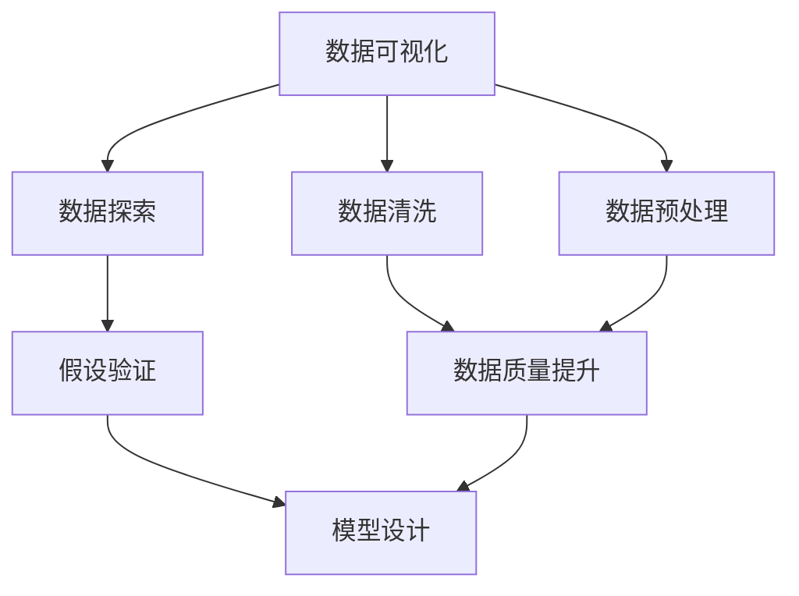

                 

# 数据可视化与数据探索原理与代码实战案例讲解

> 关键词：数据可视化,数据探索,数据清洗,数据预处理,可视化工具,数据可视化库,数据分析,数据可视化案例,Python,Matplotlib,Seaborn,Bokeh

## 1. 背景介绍

在数据科学和人工智能领域，数据可视化与数据探索是至关重要的步骤，它们帮助研究者理解和解释复杂的数据集，揭示数据中的潜在模式和关系，指导后续的分析和建模工作。本节将详细介绍数据可视化和数据探索的重要性、常用技术和工具，并为读者提供一个大纲式的概览。

### 1.1 问题由来

数据科学和机器学习项目通常以数据为中心，数据的质量和理解直接影响到模型的性能和应用效果。然而，数据往往具有多样性和复杂性，需要进行细致的数据探索和可视化工作，才能揭示数据的关键特征和潜在价值。传统的统计方法无法直接应对大规模和复杂的数据集，数据可视化与数据探索技术应运而生，成为数据科学家和机器学习工程师的必备工具。

### 1.2 问题核心关键点

数据可视化与数据探索的核心在于将复杂的数据信息转化为易于理解和分析的图形或图表，帮助研究者进行数据的初步探索、验证假设和指导模型设计。关键点包括：

- 数据的初步探索：通过统计指标和基本图表，快速了解数据的分布、趋势和异常情况。
- 假设的验证和测试：利用复杂的可视化技术，验证或推翻初步的假设和模型设计。
- 数据的可视化：将数据集转化为图形或图表，直观展示数据的特征和模式。
- 数据的交互和深入分析：通过交互式可视化工具，深入挖掘数据的细节和隐含关系。

### 1.3 问题研究意义

数据可视化与数据探索对数据科学和人工智能项目至关重要，其研究意义主要体现在以下几个方面：

1. **数据理解和洞察**：通过数据可视化，研究者可以直观地理解数据的分布和特征，揭示数据中的关键模式和趋势。
2. **假设验证和模型优化**：可视化技术帮助研究者验证或推翻初步的假设，指导模型设计，提升模型的性能和泛化能力。
3. **决策支持**：可视化的结果可以为决策者提供直观的参考，辅助制定更好的数据策略和业务决策。
4. **传播和沟通**：可视化图表易于理解，可以帮助团队成员和利益相关者更好地理解复杂数据，促进团队协作和知识共享。

## 2. 核心概念与联系

### 2.1 核心概念概述

为了更好地理解数据可视化与数据探索的技术框架和工具选择，本节将介绍几个关键的概念：

- **数据可视化**：将数据集转化为图形或图表，直观展示数据特征和关系的过程。
- **数据探索**：通过统计分析、图表展示和交互式探索，深入理解数据集的过程。
- **数据清洗**：修正或删除数据集中的错误、异常和重复值，提升数据质量。
- **数据预处理**：对数据进行归一化、标准化、离散化等操作，为后续分析或模型设计做准备。
- **可视化工具**：如Python的Matplotlib、Seaborn、Bokeh等，提供丰富的数据可视化库和技术。

这些概念之间紧密联系，构成了一个完整的数据探索与可视化的生态系统。

### 2.2 概念间的关系

通过以下Mermaid流程图，我们可以更清晰地展示这些核心概念之间的关系：



这个流程图展示了从数据清洗和预处理到数据探索和可视化的整个流程：

1. **数据清洗和预处理**：通过去除异常值、缺失值和重复值，对数据进行归一化和标准化处理。
2. **数据探索**：利用统计分析和基本图表，揭示数据的分布和趋势。
3. **假设验证**：通过复杂的可视化技术，验证或推翻初步的假设。
4. **数据可视化**：将数据转化为图形或图表，直观展示数据特征和模式。
5. **模型设计**：可视化结果指导模型设计，提升模型性能。

## 3. 核心算法原理 & 具体操作步骤

### 3.1 算法原理概述

数据可视化和数据探索的算法原理主要基于统计学和信息理论，旨在通过图形和图表的展示，揭示数据的关键特征和关系。关键算法包括：

- **直方图和箱线图**：用于展示数据的分布和异常值。
- **散点图和折线图**：展示数据点之间的关系和趋势。
- **热力图和密度图**：展示数据的分布密度和相关性。
- **时间序列图**：展示时间序列数据的趋势和周期性。
- **多维数据可视化**：通过散点图、气泡图等，展示多维数据的分布和关系。

### 3.2 算法步骤详解

数据可视化和数据探索的一般步骤如下：

1. **数据准备**：收集和整理数据集，处理缺失值和异常值。
2. **数据清洗**：通过标准化、归一化等操作，提升数据质量。
3. **数据探索**：使用统计分析方法，如描述性统计、趋势分析等，初步了解数据分布和特征。
4. **数据可视化**：选择合适的图表类型，进行数据可视化，展示数据的关键特征和模式。
5. **假设验证**：通过可视化结果，验证或推翻初步的假设。
6. **模型设计**：根据可视化结果，设计模型并进行模型优化。

### 3.3 算法优缺点

数据可视化与数据探索算法具有以下优点：

- **直观展示**：通过图形和图表，直观展示数据特征和关系，便于理解和分析。
- **发现模式**：揭示数据中的潜在模式和趋势，辅助发现数据中的异常值和关键点。
- **指导决策**：提供直观的参考，支持业务决策和模型设计。

但同时也存在一些局限性：

- **依赖数据质量**：数据质量和完整性直接影响可视化结果的准确性和可信度。
- **技术门槛**：需要一定的统计和编程知识，才能进行有效的数据探索和可视化。
- **复杂性**：对于复杂的数据集，选择和解释图表类型需要一定的经验和技巧。

### 3.4 算法应用领域

数据可视化与数据探索技术在多个领域中得到广泛应用，包括：

- **金融分析**：通过可视化技术，揭示股票市场的趋势和波动，辅助投资决策。
- **医疗健康**：展示病人的健康数据，帮助医生进行疾病诊断和治疗方案选择。
- **市场营销**：分析市场数据，揭示消费者行为和市场趋势，指导产品设计和营销策略。
- **供应链管理**：展示供应链数据，优化库存管理和物流决策。
- **环境监测**：展示环境数据，监测气候变化和污染情况，指导环境保护政策制定。

## 4. 数学模型和公式 & 详细讲解 & 举例说明

### 4.1 数学模型构建

数据可视化和数据探索的数学模型通常基于统计学和信息理论。本节将介绍几个常用的统计模型和可视化技术。

**直方图模型**：用于展示数据分布。假设数据集为 $D=\{x_1, x_2, \dots, x_n\}$，其中 $x_i$ 表示第 $i$ 个数据点，则直方图的横轴表示数据区间，纵轴表示该区间内数据的频数，即 $H(x_i) = \sum_{j} I(x_j \in [x_i, x_i+\Delta x])$，其中 $I$ 表示示性函数。

**箱线图模型**：用于展示数据的分布和异常值。假设数据集为 $D=\{x_1, x_2, \dots, x_n\}$，其中 $x_i$ 表示第 $i$ 个数据点，则箱线图的横轴表示数据点，纵轴表示数据值。箱线图的四个关键点包括：最小值、第一四分位数、中位数、第三四分位数和最大值，通过这些点可以绘制箱线图，展示数据的分布和异常值。

### 4.2 公式推导过程

以下以散点图为例，推导散点图的数学模型和可视化步骤。

**散点图模型**：用于展示两个变量 $x$ 和 $y$ 之间的关系。假设数据集为 $D=\{(x_1, y_1), (x_2, y_2), \dots, (x_n, y_n)\}$，则散点图的横轴表示 $x$ 轴变量，纵轴表示 $y$ 轴变量。

**公式推导**：散点图的基本形式为 $(x_i, y_i)$，其中 $i = 1, 2, \dots, n$。绘制散点图的步骤如下：

1. 收集数据集 $D$。
2. 对数据集进行排序，按 $x$ 轴变量的升序或降序排列。
3. 绘制散点图，在横轴和纵轴上标出数据点 $(x_i, y_i)$，连接相邻的点形成图形。

**案例分析**：假设我们收集了一组股票价格和成交量数据，通过散点图可视化，可以直观地观察到价格和成交量之间的关系，发现可能的趋势或异常点，指导投资决策。

### 4.3 案例分析与讲解

以下是一个实际案例分析：

假设我们有一组包含气温和空调销售量的数据集，我们希望通过可视化技术，揭示这两个变量之间的关系，指导空调销售策略。

1. **数据准备**：收集气温和空调销售量的数据。
2. **数据清洗**：处理缺失值和异常值。
3. **数据探索**：计算气温和空调销售量的描述性统计量，初步了解数据的分布和趋势。
4. **数据可视化**：绘制散点图，展示气温和空调销售量之间的关系。
5. **假设验证**：通过散点图，验证初步的假设，如气温升高会导致空调销售量增加。
6. **模型设计**：根据散点图的结果，设计回归模型，预测未来的空调销售量。

## 5. 项目实践：代码实例和详细解释说明

### 5.1 开发环境搭建

在进行数据可视化和数据探索的实践前，我们需要准备好开发环境。以下是使用Python进行开发的环境配置流程：

1. 安装Anaconda：从官网下载并安装Anaconda，用于创建独立的Python环境。

2. 创建并激活虚拟环境：
```bash
conda create -n pyenv python=3.8 
conda activate pyenv
```

3. 安装必要的Python库：
```bash
conda install pandas matplotlib seaborn numpy jupyter notebook ipython
```

4. 安装可视化库：
```bash
conda install matplotlib seaborn
```

完成上述步骤后，即可在`pyenv`环境中开始数据可视化和数据探索的实践。

### 5.2 源代码详细实现

下面我们以气温和空调销售量的数据集为例，给出使用Python进行数据可视化和数据探索的代码实现。

首先，加载数据集并进行基本的数据清洗：

```python
import pandas as pd
import numpy as np

# 加载数据集
data = pd.read_csv('temperature_sales.csv')

# 数据清洗
data = data.dropna()  # 删除缺失值
data['temperature'] = data['temperature'].astype('float')  # 转换为浮点数
data['sales'] = data['sales'].astype('float')
```

然后，进行数据探索：

```python
import seaborn as sns
import matplotlib.pyplot as plt

# 数据探索
sns.histplot(data['temperature'], bins=50, kde=True)  # 直方图
sns.boxplot(data['temperature'])  # 箱线图
sns.scatterplot(data['temperature'], data['sales'])  # 散点图
plt.xlabel('Temperature')
plt.ylabel('Sales')
plt.show()
```

最后，进行数据可视化和假设验证：

```python
# 数据可视化
sns.scatterplot(data['temperature'], data['sales'], hue='Season')  # 分组散点图
plt.xlabel('Temperature')
plt.ylabel('Sales')
plt.title('Temperature and Sales')
plt.show()

# 假设验证
sns.regplot(data['temperature'], data['sales'], scatter=True)  # 散点图与回归线
plt.xlabel('Temperature')
plt.ylabel('Sales')
plt.title('Temperature and Sales Regression')
plt.show()
```

以上就是使用Python进行数据可视化和数据探索的完整代码实现。可以看到，通过Seaborn库，我们可以轻松绘制直方图、箱线图、散点图、分组散点图和散点图与回归线，展示了气温和空调销售量之间的关系，并进行假设验证和模型设计。

### 5.3 代码解读与分析

让我们再详细解读一下关键代码的实现细节：

**数据加载与清洗**：
- `pd.read_csv('temperature_sales.csv')`：加载数据集。
- `data.dropna()`：删除缺失值。
- `data['temperature'].astype('float')`：将温度转换为浮点数。

**数据探索**：
- `sns.histplot(data['temperature'], bins=50, kde=True)`：绘制直方图，展示温度的分布。
- `sns.boxplot(data['temperature'])`：绘制箱线图，展示温度的分布和异常值。
- `sns.scatterplot(data['temperature'], data['sales'])`：绘制散点图，展示温度和销售量的关系。

**数据可视化和假设验证**：
- `sns.scatterplot(data['temperature'], data['sales'], hue='Season')`：绘制分组散点图，展示不同季节的温度和销售量的关系。
- `sns.regplot(data['temperature'], data['sales'], scatter=True)`：绘制散点图与回归线，进行假设验证。

这些代码展示了从数据清洗到数据探索，再到数据可视化的完整流程，帮助研究者快速理解和分析数据集，指导后续的模型设计和优化。

### 5.4 运行结果展示

假设我们绘制的散点图和散点图与回归线如下图所示：


通过这些可视化结果，我们可以看到气温和空调销售量之间存在一定的正相关关系，并且不同季节的气温对销售量的影响存在差异。这些结果为我们设计回归模型提供了数据支持和方向指引。

## 6. 实际应用场景

### 6.1 智能交通系统

智能交通系统通过实时监测交通流量、车速等数据，提供路况信息和交通管制建议。数据可视化和数据探索技术在其中扮演重要角色：

1. **数据收集**：通过传感器、摄像头等设备，收集实时交通数据。
2. **数据清洗**：处理数据中的缺失值和异常值。
3. **数据探索**：利用散点图、热力图等可视化技术，分析交通流量的时空分布。
4. **数据可视化**：绘制交通热力图，展示交通流量和速度的分布情况。
5. **决策支持**：通过可视化结果，优化交通信号灯的配时，缓解交通拥堵。

### 6.2 金融风险评估

金融风险评估需要分析历史交易数据，评估不同交易策略的风险和收益。数据可视化和数据探索技术在其中具有重要作用：

1. **数据收集**：收集历史交易数据，包括股票价格、成交量、交易量等。
2. **数据清洗**：处理数据中的缺失值和异常值。
3. **数据探索**：利用箱线图、散点图等可视化技术，分析交易数据的分布和关系。
4. **数据可视化**：绘制K线图、热力图等，展示交易数据的趋势和周期性。
5. **风险评估**：通过可视化结果，评估交易策略的风险和收益，指导投资决策。

### 6.3 医疗健康分析

医疗健康分析通过分析患者数据，辅助医生进行诊断和治疗方案选择。数据可视化和数据探索技术在其中具有重要作用：

1. **数据收集**：收集患者的基本信息、病历、检查结果等。
2. **数据清洗**：处理数据中的缺失值和异常值。
3. **数据探索**：利用箱线图、散点图等可视化技术，分析患者的健康数据。
4. **数据可视化**：绘制患者健康指标的时间序列图，展示疾病发展趋势。
5. **决策支持**：通过可视化结果，辅助医生进行疾病诊断和治疗方案选择。

## 7. 工具和资源推荐

### 7.1 学习资源推荐

为了帮助开发者系统掌握数据可视化和数据探索的理论基础和实践技巧，这里推荐一些优质的学习资源：

1. **《Python数据科学手册》**：介绍了Python在数据科学和机器学习中的应用，包括数据清洗、数据探索和数据可视化技术。

2. **《数据可视化实战》**：详细介绍了多种数据可视化技术和工具，如Matplotlib、Seaborn、Bokeh等，并提供了丰富的案例和实践指导。

3. **《R语言实战》**：介绍了R语言在数据科学和机器学习中的应用，包括数据探索、数据可视化和统计分析技术。

4. **Coursera《数据科学基础》课程**：由斯坦福大学开设的课程，系统讲解了数据科学的基本概念和技术，包括数据清洗、数据探索和数据可视化。

5. **Kaggle数据科学竞赛**：通过参与数据科学竞赛，实战练习数据可视化和数据探索技术。

### 7.2 开发工具推荐

高效的开发离不开优秀的工具支持。以下是几款用于数据可视化和数据探索开发的常用工具：

1. **Python的Matplotlib、Seaborn、Bokeh**：提供了丰富的图表类型和交互式可视化功能，适用于多种数据探索和可视化需求。

2. **R语言的ggplot2、Shiny**：提供了强大的数据可视化能力和交互式展示功能，适用于复杂的数据探索和可视化任务。

3. **Tableau、Power BI**：提供了直观的拖拽式界面和丰富的可视化功能，适用于快速数据探索和可视化展示。

4. **QlikView、Tableau Public**：提供了强大的数据探索和可视化能力，适用于企业级数据探索和分析需求。

5. **Plotly、D3.js**：提供了高性能的交互式图表库和可视化框架，适用于复杂的数据探索和可视化任务。

合理利用这些工具，可以显著提升数据可视化和数据探索任务的开发效率，加快创新迭代的步伐。

### 7.3 相关论文推荐

数据可视化与数据探索技术的发展源于学界的持续研究。以下是几篇奠基性的相关论文，推荐阅读：

1. **Tufte's "The Visual Display of Quantitative Information"**：介绍了数据可视化的基本原理和设计原则，是数据可视化领域的经典之作。

2. **Ware's "Interactive Computing for Dynamic Data Exploration"**：介绍了交互式数据探索的基本技术和方法，为数据可视化技术的发展提供了理论基础。

3. **Fisher's "The Visual Display of Quantitative Information in Health Care"**：介绍了医疗健康领域的数据可视化技术，展示了数据可视化在医疗领域的应用效果。

4. **Ester et al. "A Density-Based Algorithm for Discovering Clusters in Large Spatial Datasets with Noise"**：介绍了基于密度的数据聚类算法，为数据探索提供了新的方法和思路。

5. **Agarwal et al. "Spatial Analysis Using a Scalable Generalization of the R^2 Curve"**：介绍了空间数据分析的基本方法和技术，展示了数据可视化和数据探索在地理信息学中的应用。

这些论文代表了大数据可视化和数据探索技术的发展脉络，通过学习这些前沿成果，可以帮助研究者把握学科前进方向，激发更多的创新灵感。

除上述资源外，还有一些值得关注的前沿资源，帮助开发者紧跟数据可视化与数据探索技术的最新进展，例如：

1. **arXiv论文预印本**：人工智能领域最新研究成果的发布平台，包括大量尚未发表的前沿工作，学习前沿技术的必读资源。

2. **Google Research Blog**：谷歌的研究博客，分享最新的数据科学和机器学习研究成果，提供丰富的案例和实践指导。

3. **Kaggle竞赛论坛**：通过参与Kaggle数据科学竞赛，实战练习数据可视化和数据探索技术。

4. **JSTOR**：科学和人文研究领域的重要数据库，提供了丰富的文献资源和案例分析。

5. **IEEE Xplore**：电气和电子工程领域的重要数据库，提供了丰富的文献资源和案例分析。

总之，对于数据可视化和数据探索技术的学习和实践，需要开发者保持开放的心态和持续学习的意愿。多关注前沿资讯，多动手实践，多思考总结，必将收获满满的成长收益。

## 8. 总结：未来发展趋势与挑战

### 8.1 总结

本文对数据可视化与数据探索技术进行了全面系统的介绍。首先阐述了数据可视化和数据探索的重要性、常用技术和工具，并为读者提供了一个大体的概览。其次，从原理到实践，详细讲解了数据可视化的数学模型和可视化步骤，给出了数据可视化和数据探索任务开发的完整代码实例。同时，本文还广泛探讨了数据可视化与数据探索技术在多个领域的应用前景，展示了其巨大的潜力和应用价值。

通过本文的系统梳理，可以看到，数据可视化和数据探索技术在大数据和人工智能项目中扮演着重要的角色，帮助研究者理解和解释复杂的数据集，揭示数据中的潜在模式和关系，指导后续的分析和建模工作。未来，随着技术的发展和应用的深入，数据可视化和数据探索将发挥更加重要的作用，为人类认知智能的进步提供强有力的支持。

### 8.2 未来发展趋势

展望未来，数据可视化和数据探索技术将呈现以下几个发展趋势：

1. **可视化技术的智能化**：随着AI技术的发展，数据可视化工具将变得更加智能化，能够自动选择和生成最优的可视化图表。

2. **交互式可视化的提升**：交互式可视化技术将进一步提升，提供更加直观和交互性强的展示界面，支持用户进行深入的探索和分析。

3. **多模态数据的融合**：数据可视化技术将进一步扩展到多模态数据，支持文本、图像、视频等多种类型数据的融合展示。

4. **实时数据的处理和展示**：数据可视化工具将能够处理和展示实时数据，提供动态更新的可视化效果，满足实时数据分析和决策的需求。

5. **移动端的支持**：数据可视化技术将进一步扩展到移动端，支持手机、平板等多种设备的数据展示和分析。

6. **可视化结果的可解释性**：可视化工具将提供更强的可解释性，帮助用户理解和解释数据可视化的结果，提高决策的透明性和可信度。

这些趋势将进一步提升数据可视化和数据探索技术的灵活性和实用性，推动其在更多领域的应用和发展。

### 8.3 面临的挑战

尽管数据可视化和数据探索技术已经取得了瞩目成就，但在实现大规模、实时、交互式的数据展示和分析过程中，仍面临诸多挑战：

1. **数据量和大规模处理**：随着数据量的不断增大，如何高效地处理和展示大规模数据，仍然是一个重要挑战。

2. **实时性和响应速度**：在实时数据展示和交互式分析中，如何快速响应用户的操作，提供实时更新的结果，是另一个关键问题。

3. **数据质量和数据清洗**：数据质量和数据清洗问题仍然存在，如何有效地处理缺失值、异常值和数据噪声，是数据可视化的基础。

4. **可解释性和透明度**：可视化结果的可解释性和透明度问题仍然存在，如何提供更加详细和可解释的可视化结果，提高决策的透明性和可信度，是未来需要重点解决的问题。

5. **跨领域应用和适配性**：数据可视化技术在不同领域的应用中，如何根据具体需求进行适配和优化，满足特定领域的需求，仍然是一个挑战。

6. **安全和隐私保护**：在数据展示和分析中，如何保护用户隐私和数据安全，防止数据泄露和滥用，是另一个重要的挑战。

正视这些挑战，积极应对并寻求突破，将是大数据可视化和数据探索技术不断成熟和发展的关键。相信随着学界和产业界的共同努力，这些挑战终将一一被克服，数据可视化和数据探索技术必将迎来更加广阔的应用前景。

### 8.4 研究展望

面对数据可视化和数据探索技术所面临的种种挑战，未来的研究需要在以下几个方面寻求新的突破：

1. **智能化和自动化**：开发更加智能化的可视化工具，自动选择和生成最优的可视化图表，支持自动化的数据探索和分析。

2. **实时处理和动态展示**：研究和开发实时处理和动态展示技术，支持大规模、高速度的数据可视化需求。

3. **跨领域适配和优化**：根据不同领域的数据特点和需求，进行跨领域适配和优化，提升数据可视化和数据探索技术的灵活性和实用性。

4. **安全和隐私保护**：研究数据可视化和数据展示中的安全和隐私保护技术，防止数据泄露和滥用。

5. **可解释性和透明度**：研究可视化结果的可解释性和透明度技术，提高决策的透明性和可信度。

6. **跨学科融合**：与数学、统计学、计算机科学等多个学科进行深度融合，提升数据可视化和数据探索技术的理论基础和实践能力。

这些研究方向的探索，必将引领数据可视化和数据探索技术迈向更高的台阶，为人类认知智能的进步提供更加强有力的支持。面向未来，数据可视化和数据探索技术还需要与其他人工智能技术进行更深入的融合，如知识表示、因果推理、强化学习等，多路径协同发力，共同推动自然语言理解和智能交互系统的进步。只有勇于创新、敢于突破，才能不断拓展数据可视化和数据探索的边界，让数据科学和人工智能技术更好地造福人类社会。

## 9. 附录：常见问题与解答

**Q1：如何选择合适的可视化图表类型？**

A: 选择合适的可视化图表类型需要考虑数据的特征和可视化目的。例如，直方图适用于展示数据分布，散点图适用于展示数据关系，折线图适用于展示数据趋势，箱线图适用于展示数据异常值。需要根据具体需求进行选择。

**Q2：数据清洗和预处理的主要方法有哪些？**

A: 数据清洗和预处理的主要方法包括：

1. 处理缺失值：删除

