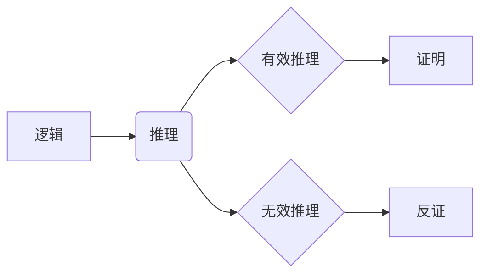
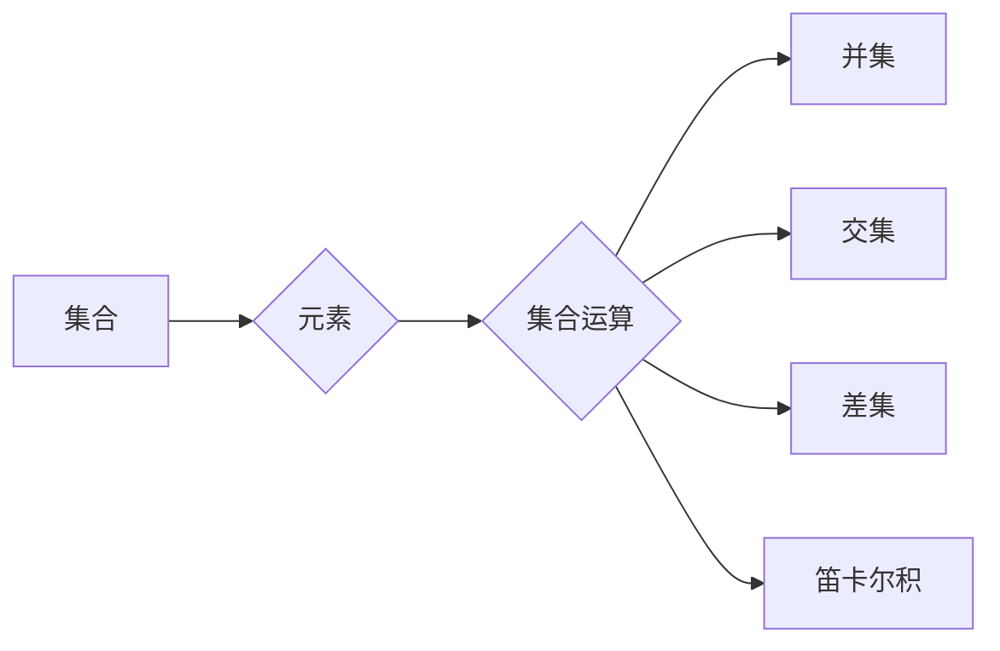
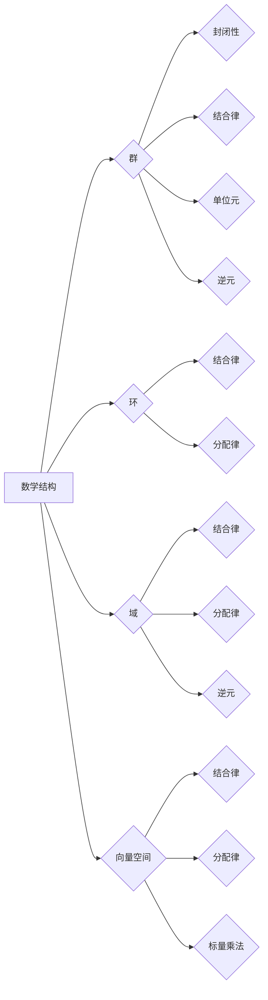

# 计算：第二部分 计算的数学基础 第 4 章 数学的基础

> 关键词：数学基础，逻辑，集合论，数学结构，公理化，符号语言

## 1. 背景介绍

数学是计算机科学的基础，它为我们提供了一种精确的描述、分析和解决问题的语言和工具。在本章中，我们将探讨数学的一些基本概念，如逻辑、集合论、数学结构等，这些都是构成更高级数学概念和计算机科学理论的基础。

## 2. 核心概念与联系

### 2.1 逻辑

逻辑是数学的基础，它研究的是推理的有效性。在计算机科学中，逻辑用于设计算法、证明程序的正确性以及构建形式化系统。

**Mermaid 流程图：**

### 2.2 集合论

集合论是数学的一个基本分支，它研究的是对象组成的集合。集合论中的概念和原理被广泛应用于计算机科学，例如在数据结构、算法分析等领域。

**Mermaid 流程图：**

### 2.3 数学结构

数学结构是指一组对象以及定义在这些对象上的运算。常见的数学结构包括群、环、域、向量空间等。

**Mermaid 流程图：**

## 3. 核心算法原理 & 具体操作步骤

### 3.1 算法原理概述

在数学基础中，算法可以理解为对问题的求解步骤。这些步骤必须是有限的、明确的，并且能够保证找到问题的解。

### 3.2 算法步骤详解

算法通常包括以下几个步骤：

1. **定义问题**：清晰地描述要解决的问题。
2. **分析问题**：理解问题的性质，确定解决问题的方法。
3. **设计算法**：根据问题的性质设计算法步骤。
4. **实现算法**：将算法步骤用程序语言实现。
5. **测试算法**：通过测试用例验证算法的正确性和效率。

### 3.3 算法优缺点

算法的优缺点取决于其设计、实现和应用场景。

- **优点**：算法能够精确地描述和解决问题，具有可重复性和可验证性。
- **缺点**：设计高效的算法可能需要复杂的理论分析和大量的实验。

### 3.4 算法应用领域

算法在计算机科学的各个领域都有广泛的应用，包括：

- **数据结构**：如数组、链表、树、图等。
- **算法分析**：如排序、搜索、动态规划等。
- **编译原理**：如词法分析、语法分析、代码生成等。
- **操作系统**：如进程管理、内存管理、文件系统等。

## 4. 数学模型和公式 & 详细讲解 & 举例说明

### 4.1 数学模型构建

数学模型是现实世界问题的数学抽象，它有助于我们理解和解决问题。

### 4.2 公式推导过程

以欧几里得平面上的点到直线的距离公式为例：

$$
d = \frac{|Ax_0 + By_0 + C|}{\sqrt{A^2 + B^2}}
$$

其中，$(x_0, y_0)$ 是点的坐标，$Ax + By + C = 0$ 是直线的方程。

### 4.3 案例分析与讲解

考虑一个简单的线性规划问题：最大化 $f(x) = x_1 + 2x_2$，约束条件为 $x_1 + x_2 \leq 4$，$x_1 - x_2 \geq 1$，$x_1, x_2 \geq 0$。

我们可以使用线性规划的方法来解决这个问题。首先，将问题转化为标准形式：

$$
\max f(x) = x_1 + 2x_2 \\
s.t. \\
x_1 + x_2 \leq 4 \\
-x_1 + x_2 \leq -1 \\
x_1, x_2 \geq 0
$$

然后，使用单纯形法或其他线性规划算法求解。

## 5. 项目实践：代码实例和详细解释说明

### 5.1 开发环境搭建

由于这是一个理论性较强的章节，我们不会涉及具体的代码实现。但是，理解数学模型和算法原理对于编写代码至关重要。

### 5.2 源代码详细实现

由于本章节内容抽象，不涉及具体的代码实现。

### 5.3 代码解读与分析

同样，由于内容抽象，不涉及具体的代码分析。

### 5.4 运行结果展示

由于不涉及代码实现，因此没有运行结果。

## 6. 实际应用场景

数学基础在计算机科学中的实际应用场景非常广泛，以下是一些例子：

- **机器学习**：在机器学习中，数学模型和算法用于特征提取、模型训练、预测和评估。
- **图形学**：在图形学中，数学用于计算物体之间的碰撞、光照、阴影等效果。
- **网络协议**：在网络协议中，数学用于加密、认证和路由算法。
- **经济学**：在经济学中，数学用于建模市场行为、预测经济趋势等。

## 7. 工具和资源推荐

### 7.1 学习资源推荐

- 《离散数学及其应用》
- 《线性代数及其应用》
- 《概率论与数理统计》
- 《算法导论》

### 7.2 开发工具推荐

- LaTeX：用于数学公式编辑。
- MATLAB：用于数学建模和计算。

### 7.3 相关论文推荐

- 《计算机程序的数学基础》
- 《计算：概念与方法》

## 8. 总结：未来发展趋势与挑战

### 8.1 研究成果总结

本章介绍了数学基础中的核心概念，如逻辑、集合论、数学结构等，并探讨了算法原理和应用。这些概念和原理是计算机科学的基础，对于理解和解决实际问题至关重要。

### 8.2 未来发展趋势

随着计算机科学的不断发展，数学基础在计算机科学中的应用将会更加广泛和深入。例如，在人工智能、大数据、量子计算等领域，数学基础将发挥越来越重要的作用。

### 8.3 面临的挑战

尽管数学基础在计算机科学中非常重要，但也面临着一些挑战，如：

- 理论与实践的脱节：数学理论往往比较抽象，难以直接应用于实际问题。
- 新技术的涌现：随着新技术的出现，数学基础需要不断更新和发展。

### 8.4 研究展望

为了应对这些挑战，我们需要：

- 加强数学与计算机科学的交叉研究。
- 鼓励理论研究和实际应用相结合。
- 推动数学基础教育的发展。

## 9. 附录：常见问题与解答

### 9.1 问题1：什么是数学基础？

答：数学基础是指构成更高级数学概念和计算机科学理论的基本概念和原理，如逻辑、集合论、数学结构等。

### 9.2 问题2：数学基础在计算机科学中有什么作用？

答：数学基础是计算机科学的基础，它为我们提供了一种精确的描述、分析和解决问题的语言和工具。

### 9.3 问题3：如何学习数学基础？

答：可以通过阅读相关书籍、参加课程、参与讨论等方式学习数学基础。

作者：禅与计算机程序设计艺术 / Zen and the Art of Computer Programming