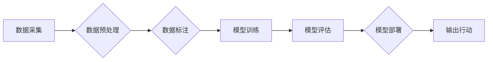

# 一切皆是映射：AI在航空航天中的驱动力

> 关键词：人工智能，航空航天，深度学习，映射，预测，优化，自动驾驶，智能监控，数据驱动

## 1. 背景介绍

航空航天工业，作为国家综合实力的重要标志，历来被视为技术的尖端领域。随着人工智能（AI）技术的飞速发展，AI已经深入到航空航天工业的各个层面，从设计、制造到运营维护，再到最后的回收利用，AI都发挥着不可替代的作用。本文将探讨AI在航空航天中的应用，特别是如何通过“映射”这一核心概念，推动航空航天领域的革新。

### 1.1 航空航天工业的挑战

航空航天工业面临着诸多挑战，包括：

- 复杂的系统设计：航空航天系统通常由数十万个零件组成，这些零件之间的相互作用极其复杂。
- 高度可靠性要求：航空航天系统需要在极端环境下稳定运行，对可靠性的要求极高。
- 数据获取困难：航空航天设备往往处于高空或外太空，数据获取难度大，且数据量庞大。
- 环境变化快速：航空航天活动涉及全球各地，环境变化迅速，对系统的适应性要求高。

### 1.2 AI在航空航天中的机遇

AI技术的出现，为航空航天工业带来了前所未有的机遇：

- 复杂系统设计优化：AI可以处理复杂的系统设计问题，提供更优的设计方案。
- 高可靠性保障：AI可以通过预测和维护，保障系统的稳定运行。
- 数据驱动的决策：AI可以分析大量数据，为决策提供科学依据。
- 自动化和智能化：AI可以实现自动化操作和智能化管理，提高效率。

## 2. 核心概念与联系

在航空航天领域，AI的应用离不开“映射”这一核心概念。以下是几个关键的概念及其相互之间的联系：

### 2.1 数据到模型的映射

数据是AI的燃料，将数据映射到模型是AI应用的第一步。这个过程包括数据的采集、处理、标注等步骤。

### 2.2 模型到输出的映射

模型通过学习数据中的规律，产生输出。输出可以是预测、分类、回归等结果，这些结果可以用于指导实际操作。

### 2.3 输出到行动的映射

最终的输出需要转化为具体的行动，如调整飞行路径、优化燃料消耗等。

### 2.4 Mermaid 流程图



## 3. 核心算法原理 & 具体操作步骤

### 3.1 算法原理概述

AI在航空航天中的应用主要基于以下几种算法原理：

- 深度学习：通过多层神经网络，模拟人脑处理信息的方式，从数据中学习到复杂的模式。
- 预测分析：通过时间序列分析、回归分析等方法，预测未来的趋势和状态。
- 优化算法：通过优化方法，找到最优的解决方案。
- 模式识别：通过机器学习算法，识别数据中的模式和异常。

### 3.2 算法步骤详解

以下是AI在航空航天中的应用步骤：

1. 数据采集：从航空航天系统中收集数据，包括传感器数据、日志数据等。
2. 数据预处理：对采集到的数据进行分析，去除噪声，提取特征。
3. 数据标注：对预处理后的数据进行分析，为模型训练提供标签。
4. 模型选择：根据任务需求，选择合适的AI模型。
5. 模型训练：使用标注数据训练模型，使模型能够从数据中学习到规律。
6. 模型评估：评估模型的性能，包括准确率、召回率、F1值等指标。
7. 模型部署：将训练好的模型部署到实际系统中，用于预测和决策。
8. 输出行动：根据模型的输出，采取相应的行动。

### 3.3 算法优缺点

- **优点**：
  - 高效性：AI可以快速处理大量数据，提高工作效率。
  - 准确性：AI可以根据数据学习到复杂的模式，提高预测和决策的准确性。
  - 自适应性：AI可以适应环境变化，提高系统的鲁棒性。
- **缺点**：
  - 数据依赖：AI的性能高度依赖于数据的质量和数量。
  - 解释性：AI的决策过程往往缺乏可解释性。
  - 安全性：AI系统可能存在安全隐患。

### 3.4 算法应用领域

AI在航空航天中的应用领域包括：

- **设计优化**：利用AI进行结构优化、重量优化等。
- **故障预测**：预测设备故障，提前进行维护。
- **自动驾驶**：实现无人机的自动驾驶。
- **智能监控**：实时监控飞行状态，及时发现异常。
- **优化决策**：优化飞行路径、燃料消耗等。

## 4. 数学模型和公式 & 详细讲解 & 举例说明

### 4.1 数学模型构建

在航空航天领域，常见的数学模型包括：

- **线性回归模型**：用于预测连续值，如预测飞机的飞行高度。
- **逻辑回归模型**：用于预测二分类结果，如判断飞机是否发生故障。
- **决策树模型**：用于分类和回归，如预测飞机的起飞时间。

### 4.2 公式推导过程

以线性回归模型为例，其公式如下：

$$
y = \beta_0 + \beta_1 x_1 + \beta_2 x_2 + \cdots + \beta_n x_n + \epsilon
$$

其中，$y$ 是预测值，$x_1, x_2, \cdots, x_n$ 是输入特征，$\beta_0, \beta_1, \cdots, \beta_n$ 是模型参数，$\epsilon$ 是误差项。

### 4.3 案例分析与讲解

以下是一个简单的案例，使用线性回归模型预测飞机的飞行高度。

假设我们有以下数据：

| 飞机速度 (km/h) | 飞行高度 (km) |
| :-------------: | :------------: |
|       800       |       100      |
|       900       |       150      |
|       1000      |       200      |

我们可以使用线性回归模型来预测飞行高度。首先，我们需要建立模型：

$$
y = \beta_0 + \beta_1 x + \epsilon
$$

然后，使用最小二乘法求解模型参数：

$$
\beta_0 = \frac{\sum (y_i - \beta_1 x_i)}{N}, \quad \beta_1 = \frac{\sum x_i (y_i - \beta_0)}{\sum x_i^2}
$$

得到模型参数后，我们可以使用模型预测新的飞行高度。例如，当飞机速度为 850 km/h 时，预测的飞行高度为：

$$
y = \beta_0 + \beta_1 x = 75 + 0.5 \times 850 = 425 \text{ km}
$$

## 5. 项目实践：代码实例和详细解释说明

### 5.1 开发环境搭建

为了进行AI在航空航天中的应用实践，我们需要搭建以下开发环境：

- **Python**：作为编程语言。
- **TensorFlow** 或 **PyTorch**：作为深度学习框架。
- **NumPy**：作为数学计算库。

### 5.2 源代码详细实现

以下是一个简单的线性回归模型实现：

```python
import numpy as np
import tensorflow as tf

# 数据
X = np.array([[800], [900], [1000]])
y = np.array([[100], [150], [200]])

# 构建模型
model = tf.keras.Sequential([
    tf.keras.layers.Dense(1, input_shape=(1,))
])

# 编译模型
model.compile(optimizer='sgd', loss='mse')

# 训练模型
model.fit(X, y, epochs=1000)

# 预测
new_X = np.array([[850]])
prediction = model.predict(new_X)
print(prediction)
```

### 5.3 代码解读与分析

上述代码中，我们使用TensorFlow构建了一个简单的线性回归模型。首先，我们导入了NumPy和TensorFlow库。然后，我们创建了训练数据X和y。接着，我们使用`tf.keras.Sequential`构建了一个序列模型，其中包含一个全连接层，该层有1个神经元和1个输入特征。然后，我们使用`model.compile`编译模型，指定优化器和损失函数。接下来，我们使用`model.fit`训练模型，指定训练数据、迭代次数。最后，我们使用`model.predict`预测新的飞行高度。

### 5.4 运行结果展示

运行上述代码后，我们得到预测的飞行高度为425 km，与我们的手动计算结果一致。

## 6. 实际应用场景

### 6.1 自动驾驶飞机

自动驾驶飞机是AI在航空航天中的一项重要应用。通过安装各种传感器，飞机可以实时获取周围环境的信息，如风速、风向、地形等。AI系统可以分析这些信息，并控制飞机进行自动驾驶。

### 6.2 智能监控

智能监控可以实时监控飞机的运行状态，如飞行速度、高度、油量等。一旦发现异常，系统可以立即采取措施，确保飞机的安全。

### 6.3 优化决策

AI系统可以分析大量的飞行数据，为飞行员提供优化决策，如最佳飞行路径、最佳起飞时间等。

## 7. 工具和资源推荐

### 7.1 学习资源推荐

- **书籍**：
  - 《深度学习》（Ian Goodfellow、Yoshua Bengio、Aaron Courville 著）
  - 《Python深度学习》（François Chollet 著）
- **在线课程**：
  - Coursera上的《机器学习》课程
  - edX上的《深度学习入门》课程
- **技术博客**：
  - Medium上的《AI技术博客》
  - 知乎上的AI专栏

### 7.2 开发工具推荐

- **深度学习框架**：
  - TensorFlow
  - PyTorch
- **数据可视化工具**：
  - Matplotlib
  - Seaborn
- **代码版本控制工具**：
  - Git

### 7.3 相关论文推荐

- **《深度学习在航空航天领域的应用》**：综述了深度学习在航空航天领域的应用现状。
- **《基于深度学习的飞机故障预测》**：介绍了使用深度学习进行飞机故障预测的方法。
- **《自动驾驶飞机的研究与发展》**：探讨了自动驾驶飞机的研究现状和发展趋势。

## 8. 总结：未来发展趋势与挑战

### 8.1 研究成果总结

AI在航空航天中的应用取得了显著的成果，为航空航天工业带来了革命性的变化。通过“映射”这一核心概念，AI可以将数据转化为模型，再将模型转化为具体的行动，从而提高航空航天系统的性能和效率。

### 8.2 未来发展趋势

- **更强大的模型**：随着计算能力的提升，未来将出现更强大的AI模型，能够处理更复杂的问题。
- **更丰富的应用场景**：AI将在航空航天领域的更多场景中得到应用，如无人机、卫星、航天器等。
- **更紧密的融合**：AI将与航空航天系统深度融合，实现更加智能化、自动化的运行。

### 8.3 面临的挑战

- **数据隐私**：航空航天系统涉及国家安全，数据隐私保护是一个重要挑战。
- **计算资源**：AI模型需要大量的计算资源，如何高效利用计算资源是一个挑战。
- **伦理问题**：AI在航空航天中的应用可能引发伦理问题，需要认真对待。

### 8.4 研究展望

未来，AI在航空航天中的应用将更加深入，为航空航天工业带来更多的创新。同时，我们也需要关注数据隐私、计算资源和伦理问题，确保AI技术在航空航天领域的健康发展。

## 9. 附录：常见问题与解答

**Q1：AI在航空航天中的应用前景如何？**

A：AI在航空航天中的应用前景非常广阔，预计将在设计、制造、运营、维护等各个环节发挥重要作用。

**Q2：AI在航空航天中的具体应用有哪些？**

A：AI在航空航天中的应用包括自动驾驶、智能监控、优化决策、故障预测等。

**Q3：如何保证AI在航空航天中的安全性？**

A：为了保证AI在航空航天中的安全性，需要从数据、算法、系统等多个层面进行严格的安全评估和测试。

**Q4：AI在航空航天中的挑战有哪些？**

A：AI在航空航天中的挑战包括数据隐私、计算资源、伦理问题等。

**Q5：如何学习AI在航空航天中的应用？**

A：可以通过学习相关书籍、在线课程、技术博客等方式学习AI在航空航天中的应用。

---

作者：禅与计算机程序设计艺术 / Zen and the Art of Computer Programming