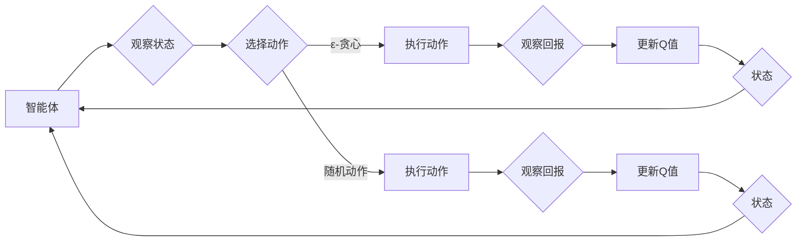

# 一切皆是映射：DQN中的探索策略：ϵ-贪心算法深度剖析

> 关键词：深度强化学习，DQN，探索-利用，ϵ-贪心算法，Q学习，强化学习，蒙特卡洛方法，ε-greedy，Q值函数，动态规划

## 1. 背景介绍

在深度强化学习（Deep Reinforcement Learning，DRL）领域，深度神经网络（Deep Neural Networks，DNN）与强化学习（Reinforcement Learning，RL）的结合开辟了智能决策的新天地。DQN（Deep Q-Network）作为DRL的代表性方法，通过深度神经网络来近似Q值函数，实现了在复杂环境中的智能决策。然而，DQN在探索未知状态和动作时面临着巨大的挑战，因为过度探索可能导致学习效率低下，而过度利用则可能导致错过最优策略。为了解决这个问题，探索策略（Exploration Strategy）应运而生。本文将深入剖析DQN中的一种经典探索策略——ϵ-贪心算法（ε-greedy），探讨其原理、实现和应用。

## 2. 核心概念与联系

### 2.1 核心概念

- **深度强化学习（DRL）**：结合深度学习和强化学习，使用深度神经网络来学习值函数或策略，实现智能体的自主决策。
- **强化学习（RL）**：智能体通过与环境的交互学习最优策略，以最大化累积奖励。
- **Q学习**：一种基于值函数的强化学习方法，通过学习Q值函数来选择动作。
- **Q值函数**：表示在某个状态下采取某个动作的期望回报。
- **探索-利用（Exploration-Exploitation）**：在强化学习中，探索新动作以发现潜在的更优策略，同时利用已知的最佳策略以最大化回报。
- **ε-贪心算法**：一种探索策略，在执行动作时以概率ε选择随机动作，以平衡探索和利用。

### 2.2 核心概念原理和架构的 Mermaid 流程图



在这个流程图中，智能体首先观察当前状态，然后根据ε-贪心算法选择动作。如果选择的是ε-贪心动作，智能体执行该动作并观察回报，然后更新Q值；如果选择的是随机动作，智能体同样执行动作并更新Q值。无论选择哪种动作，智能体都会根据新的状态重复这个过程。

## 3. 核心算法原理 & 具体操作步骤

### 3.1 算法原理概述

ε-贪心算法是一种平衡探索和利用的探索策略。在每次决策时，智能体以概率ε选择一个随机动作，以探索未知状态和动作；以1-ε的概率选择一个基于当前Q值函数的最大动作，以利用已知的最优策略。

### 3.2 算法步骤详解

1. 初始化Q值函数Q(s, a)为随机值。
2. 对于每个状态s，随机选择一个动作a，以概率ε。
3. 执行动作a，观察回报r和下一个状态s'。
4. 更新Q值函数：$$ Q(s, a) = Q(s, a) + \alpha [r + \gamma \max_{a'} Q(s', a') - Q(s, a)] $$
   其中，α是学习率，γ是折扣因子。
5. 返回到步骤2。

### 3.3 算法优缺点

**优点**：

- **平衡探索和利用**：ε-贪心算法能够有效地平衡探索和利用，避免过早地陷入局部最优。
- **简单易实现**：算法简单，易于理解和实现。

**缺点**：

- **收敛速度慢**：由于存在随机性，ε-贪心算法可能需要较长时间才能收敛到最优策略。
- **无法保证最优解**：ε-贪心算法不能保证收敛到全局最优解，只能找到近似的最优策略。

### 3.4 算法应用领域

ε-贪心算法广泛应用于各种强化学习任务，包括：

- **游戏**：如Atari游戏、Go游戏等。
- **机器人控制**：如自动驾驶、机器人导航等。
- **资源管理**：如电力调度、网络优化等。

## 4. 数学模型和公式 & 详细讲解 & 举例说明

### 4.1 数学模型构建

ε-贪心算法的核心是Q值函数的更新公式，如下所示：

$$
 Q(s, a) = Q(s, a) + \alpha [r + \gamma \max_{a'} Q(s', a') - Q(s, a)] 
$$

其中：

- $ Q(s, a) $ 是在状态s下采取动作a的Q值。
- $ r $ 是采取动作a后的即时回报。
- $ \gamma $ 是折扣因子，表示未来回报的重要性。
- $ \alpha $ 是学习率，控制Q值更新的步长。
- $ \max_{a'} Q(s', a') $ 是在下一个状态s'下采取所有可能动作的最大Q值。

### 4.2 公式推导过程

ε-贪心算法的推导基于以下假设：

- Q值函数是正确的，即 $ Q(s, a) $ 是在状态s下采取动作a的期望回报。
- 未来回报可以用 $ \gamma \max_{a'} Q(s', a') $ 来近似。

基于以上假设，可以推导出Q值函数的更新公式。

### 4.3 案例分析与讲解

假设一个简单的环境，智能体在一个一维线性的奖励函数中移动，目标是最大化累积奖励。智能体每次可以向左或向右移动，奖励函数如下：

$$
 r(s) = 
\begin{cases} 
1 & \text{if } s > 0 \\
-1 & \text{if } s < 0 \\
0 & \text{otherwise} 
\end{cases}
$$

其中，s是智能体的位置。

在这个环境中，我们可以使用ε-贪心算法来训练智能体。假设初始Q值函数为0，学习率为0.1，折扣因子为0.9。我们可以模拟智能体的训练过程：

1. 初始状态s为-5。
2. 以0.1的概率选择随机动作，以0.9的概率选择最大动作。
3. 执行动作后，智能体移动到新的状态。
4. 根据新的状态和动作更新Q值函数。

通过模拟多次训练过程，我们可以观察到Q值函数逐渐收敛到最优策略。

## 5. 项目实践：代码实例和详细解释说明

### 5.1 开发环境搭建

为了进行ε-贪心算法的实践，我们需要以下开发环境：

- Python 3.x
- TensorFlow或PyTorch
- Gym：用于构建和测试强化学习环境

### 5.2 源代码详细实现

以下是一个使用PyTorch和Gym实现ε-贪心算法的简单示例：

```python
import gym
import torch
import numpy as np

# 创建环境
env = gym.make('CartPole-v1')

# 初始化Q值函数
q_table = np.zeros((env.observation_space.n, env.action_space.n))

# 设置ε值和学习率
epsilon = 0.1
alpha = 0.1

# 训练过程
for episode in range(1000):
    state = env.reset()
    done = False
    
    while not done:
        # 根据ε-贪心算法选择动作
        if np.random.rand() < epsilon:
            action = env.action_space.sample()
        else:
            action = np.argmax(q_table[state])
        
        # 执行动作
        next_state, reward, done, _ = env.step(action)
        
        # 更新Q值函数
        q_table[state, action] = (1 - alpha) * q_table[state, action] + alpha * (reward + 0.9 * np.max(q_table[next_state]))
        
        state = next_state

# 关闭环境
env.close()
```

### 5.3 代码解读与分析

这段代码首先创建了CartPole环境，然后初始化了一个Q值函数，并设置了ε值和学习率。在训练过程中，智能体根据ε-贪心算法选择动作，并根据执行动作后的结果更新Q值函数。通过多次迭代，Q值函数逐渐收敛，智能体学会在CartPole环境中稳定地保持平衡。

### 5.4 运行结果展示

运行上述代码，智能体将在CartPole环境中逐渐学会保持平衡，最终能够稳定地完成任务。

## 6. 实际应用场景

ε-贪心算法在实际应用中具有广泛的应用场景，以下是一些例子：

- **自动驾驶**：智能车辆在复杂交通环境中，使用ε-贪心算法来选择最优行驶策略。
- **机器人控制**：机器人通过ε-贪心算法来学习在未知环境中导航和操作。
- **游戏AI**：在游戏AI中，ε-贪心算法可以帮助智能体选择最优动作，提高游戏水平。

## 7. 工具和资源推荐

### 7.1 学习资源推荐

- 《Reinforcement Learning: An Introduction》
- 《Deep Reinforcement Learning》
- 《Artificial Intelligence: A Modern Approach》

### 7.2 开发工具推荐

- TensorFlow
- PyTorch
- Gym

### 7.3 相关论文推荐

- “Playing Atari with Deep Reinforcement Learning” by Volodymyr Mnih et al.
- “Human-level control through deep reinforcement learning” by Volodymyr Mnih et al.

## 8. 总结：未来发展趋势与挑战

### 8.1 研究成果总结

本文深入剖析了DQN中的探索策略——ε-贪心算法，探讨了其原理、实现和应用。ε-贪心算法作为一种平衡探索和利用的探索策略，在强化学习领域得到了广泛的应用。

### 8.2 未来发展趋势

- **探索-利用算法的多样化**：未来会有更多探索-利用算法被提出，以适应不同的强化学习任务。
- **模型复杂度的降低**：为了提高计算效率，探索-利用算法的研究将朝着模型复杂度更低的方向发展。
- **与其他技术的融合**：探索-利用算法将与其他技术如多智能体系统、迁移学习等进行融合，以解决更复杂的问题。

### 8.3 面临的挑战

- **探索-利用算法的优化**：如何设计更有效的探索-利用算法，以平衡探索和利用，是当前的一个重要挑战。
- **大规模环境的适用性**：在大型和复杂的环境中，探索-利用算法的效率和稳定性是一个挑战。
- **模型的解释性**：探索-利用算法的决策过程通常缺乏解释性，如何提高模型的可解释性是一个挑战。

### 8.4 研究展望

随着深度学习和强化学习的不断发展，探索-利用算法将在未来发挥越来越重要的作用。通过不断优化探索-利用算法，我们将能够构建更智能、更高效的智能体，解决更多实际问题。

## 9. 附录：常见问题与解答

**Q1：ε-贪心算法在什么情况下更有效？**

A：ε-贪心算法在探索未知状态和动作时更有效。当智能体对环境了解不足时，ε-贪心算法可以帮助智能体发现潜在的更优策略。

**Q2：如何调整ε值和学习率？**

A：ε值和学习率的调整需要根据具体任务和环境进行调整。通常需要通过实验来找到最佳参数组合。

**Q3：ε-贪心算法是否适用于所有强化学习任务？**

A：ε-贪心算法适用于大多数强化学习任务，但在某些特定任务中可能需要其他探索-利用算法。

**Q4：如何评估探索-利用算法的性能？**

A：可以通过累积奖励、成功率等指标来评估探索-利用算法的性能。

**Q5：探索-利用算法与深度学习有何关系？**

A：探索-利用算法是强化学习的一部分，而深度学习是深度强化学习的一部分。两者结合起来可以实现更强大的智能体。

作者：禅与计算机程序设计艺术 / Zen and the Art of Computer Programming