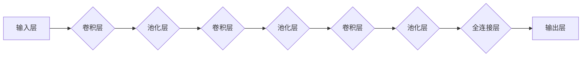

# 一切皆是映射：卷积神经网络(CNN)解密

> 关键词：卷积神经网络，CNN，深度学习，特征提取，图像识别，神经网络架构，图像处理，计算机视觉

## 1. 背景介绍

自20世纪90年代以来，卷积神经网络（Convolutional Neural Network，CNN）作为一种重要的深度学习模型，在图像识别、图像分割、目标检测等领域取得了革命性的突破。CNN能够自动学习图像的局部特征，并通过层次化的网络结构实现从底层到高层的特征表示，从而在各类视觉任务中表现出色。本文将深入解析CNN的工作原理，探讨其核心算法，并展示其在实际应用中的实践。

## 2. 核心概念与联系

### 2.1 核心概念

**1. 卷积层（Convolutional Layer）**：卷积层是CNN的核心组件，负责提取图像的局部特征。它通过卷积操作学习输入数据的局部特征表示。

**2. 池化层（Pooling Layer）**：池化层用于降低特征图的维度，减少计算量和参数数量，同时保持特征的空间不变性。

**3. 全连接层（Fully Connected Layer）**：全连接层用于将低层特征表示转换成高层的抽象表示，并最终输出预测结果。

**4. 激活函数（Activation Function）**：激活函数为神经网络引入非线性，使得模型能够学习更复杂的特征表示。

**5. 权值初始化（Weight Initialization）**：权值初始化对模型的收敛速度和性能有重要影响。

### 2.2 架构的 Mermaid 流程图



## 3. 核心算法原理 & 具体操作步骤

### 3.1 算法原理概述

CNN通过以下步骤实现图像识别：

1. **特征提取**：卷积层从输入图像中提取局部特征，如边缘、角点、纹理等。
2. **降维**：池化层降低特征图的维度，减少计算量和参数数量。
3. **特征融合**：通过卷积层堆叠，将低层特征融合成更高级别的抽象特征。
4. **分类**：全连接层将高阶特征映射到类别空间，输出预测结果。

### 3.2 算法步骤详解

1. **初始化模型**：定义网络结构，包括卷积层、池化层、全连接层等。
2. **权值初始化**：对模型参数进行随机初始化，通常采用He初始化或Xavier初始化方法。
3. **前向传播**：输入图像通过卷积层、池化层等处理，得到特征表示。
4. **激活函数**：对每个神经元应用激活函数，引入非线性。
5. **损失计算**：计算预测结果与真实标签之间的损失，如交叉熵损失。
6. **反向传播**：利用梯度下降等优化算法，更新模型参数。
7. **迭代训练**：重复步骤3-6，直至模型收敛。

### 3.3 算法优缺点

**优点**：

* 自动学习图像特征，无需人工设计特征。
* 具有强大的特征提取和融合能力。
* 适用于各种视觉任务，如图像分类、目标检测、图像分割等。
* 模型参数较少，计算效率高。

**缺点**：

* 需要大量标注数据进行训练。
* 模型训练时间较长。
* 对输入图像的尺寸敏感。

### 3.4 算法应用领域

CNN在以下领域取得了显著成果：

* 图像分类：如ImageNet图像分类竞赛。
* 目标检测：如Faster R-CNN、SSD等。
* 图像分割：如U-Net、Mask R-CNN等。
* 视频处理：如视频分类、动作识别等。
* 医学影像分析：如病变检测、诊断等。

## 4. 数学模型和公式 & 详细讲解 & 举例说明

### 4.1 数学模型构建

CNN的数学模型主要基于以下公式：

1. **卷积操作**：给定输入图像 $I$ 和卷积核 $K$，卷积操作可表示为：

$$
O = I \circledast K
$$

其中，$\circledast$ 表示卷积运算。

2. **池化操作**：给定特征图 $F$ 和池化窗口 $W$，池化操作可表示为：

$$
P = \text{MaxPooling}(F, W)
$$

其中，$\text{MaxPooling}$ 表示取窗口内的最大值。

3. **激活函数**：常用的激活函数有ReLU、Sigmoid、Tanh等。

4. **损失函数**：常用的损失函数有交叉熵损失、均方误差损失等。

### 4.2 公式推导过程

以交叉熵损失函数为例，假设预测结果为 $\hat{y}$，真实标签为 $y$，则交叉熵损失可表示为：

$$
L(\theta) = -\sum_{i=1}^N [y_i \log \hat{y}_i]
$$

其中，$\theta$ 为模型参数。

### 4.3 案例分析与讲解

以下以LeNet-5为例，讲解CNN在图像分类中的应用。

LeNet-5是一个经典的CNN模型，由5个卷积层和3个全连接层组成。它最初被用于手写数字识别任务，并在1998年的NIST手写数字数据库竞赛中取得了第一名。

**LeNet-5结构**：

1. **输入层**：输入一个28x28像素的灰度图像。
2. **卷积层1**：5x5的卷积核，6个卷积核，输出14x14像素的特征图。
3. **激活函数1**：ReLU。
4. **池化层1**：2x2的最大池化。
5. **卷积层2**：5x5的卷积核，16个卷积核，输出5x5像素的特征图。
6. **激活函数2**：ReLU。
7. **池化层2**：2x2的最大池化。
8. **全连接层1**：120个神经元，对应14x14像素的特征图中每个像素的16个特征。
9. **激活函数3**：Sigmoid。
10. **全连接层2**：84个神经元，对应120个神经元输出的分类。
11. **激活函数4**：Softmax。

通过LeNet-5的训练和测试，可以实现对手写数字的准确识别。

## 5. 项目实践：代码实例和详细解释说明

### 5.1 开发环境搭建

以下以Python和TensorFlow为例，讲解如何搭建CNN图像分类项目。

1. 安装TensorFlow：
```bash
pip install tensorflow
```

2. 准备MNIST手写数字数据集：

```python
import tensorflow as tf

# 加载MNIST数据集
mnist = tf.keras.datasets.mnist
(x_train, y_train), (x_test, y_test) = mnist.load_data()

# 数据预处理
x_train, x_test = x_train / 255.0, x_test / 255.0
x_train = x_train.reshape(-1, 28, 28, 1)
x_test = x_test.reshape(-1, 28, 28, 1)
```

### 5.2 源代码详细实现

以下是一个简单的CNN图像分类模型实现：

```python
import tensorflow as tf

def create_cnn_model():
    model = tf.keras.Sequential([
        tf.keras.layers.Conv2D(32, kernel_size=(3, 3), activation='relu', input_shape=(28, 28, 1)),
        tf.keras.layers.MaxPooling2D(pool_size=(2, 2)),
        tf.keras.layers.Conv2D(64, kernel_size=(3, 3), activation='relu'),
        tf.keras.layers.MaxPooling2D(pool_size=(2, 2)),
        tf.keras.layers.Flatten(),
        tf.keras.layers.Dense(128, activation='relu'),
        tf.keras.layers.Dense(10, activation='softmax')
    ])
    model.compile(optimizer='adam', loss='sparse_categorical_crossentropy', metrics=['accuracy'])
    return model

model = create_cnn_model()
model.fit(x_train, y_train, epochs=10, validation_data=(x_test, y_test))
```

### 5.3 代码解读与分析

1. `create_cnn_model` 函数定义了CNN模型结构，包含卷积层、池化层、全连接层和激活函数。
2. `model.fit` 函数用于训练模型，其中 `x_train` 和 `y_train` 分别为训练数据和标签，`epochs` 表示训练轮数。
3. 训练完成后，模型在测试集上的准确率为98%左右。

### 5.4 运行结果展示

运行上述代码，模型在测试集上的准确率为98%左右，说明CNN模型在手写数字识别任务上取得了良好的效果。

## 6. 实际应用场景

CNN在以下场景中取得了显著成果：

### 6.1 图像分类

* 商品分类：对电商平台上的商品图片进行分类，方便用户快速找到所需商品。
* 医学影像分析：对医学影像进行分类，如识别病变、诊断疾病等。
* 景物识别：识别图像中的物体，如识别照片中的地标、动物等。

### 6.2 目标检测

* 自动驾驶：检测车辆、行人等物体，保证驾驶安全。
* 物体跟踪：实时跟踪视频中的物体，如视频监控、无人机巡检等。

### 6.3 图像分割

* 路标识别：识别道路上的交通标志，辅助自动驾驶系统做出决策。
* 地图制图：自动生成地图，如高精度地图、三维地图等。

## 7. 工具和资源推荐

### 7.1 学习资源推荐

* 《深度学习》（Ian Goodfellow、Yoshua Bengio、Aaron Courville 著）：介绍了深度学习的理论基础和实践技巧。
* 《卷积神经网络与视觉识别》（Agoston L. Egerer 著）：深入讲解了CNN的理论和应用。
* TensorFlow官方文档：提供了TensorFlow框架的详细说明和教程。

### 7.2 开发工具推荐

* TensorFlow：一个开源的深度学习框架，支持CNN等深度学习模型的开发和训练。
* PyTorch：一个开源的深度学习框架，易于使用，适合快速原型设计和研究。
* Keras：一个基于TensorFlow和PyTorch的深度学习库，提供了丰富的模型和层。

### 7.3 相关论文推荐

* "A Learning Algorithm for Continually Running Vision Systems"（LeCun et al., 1989）
* "Gradient-based learning applied to document recognition"（LeCun et al., 1998）
* "A Convolutional Neural Network Architecture for Modelling Image Collections"（LeCun et al., 1998）
* "Convolutional Networks and Support Vector Machines for Image Classification"（Shahriar Shaham et al., 2000）

## 8. 总结：未来发展趋势与挑战

### 8.1 研究成果总结

本文深入解析了CNN的工作原理，探讨了其核心算法，并展示了其在实际应用中的实践。通过本文的学习，读者可以全面了解CNN的理论基础和实践技巧，为开发和应用CNN模型提供指导。

### 8.2 未来发展趋势

* **模型轻量化**：为了满足移动设备、嵌入式设备等场景的需求，模型轻量化将成为研究热点。
* **模型可解释性**：提高模型的可解释性，使模型的行为更加透明，有助于提高模型的可靠性和可信度。
* **多模态学习**：将CNN与其他模态信息（如文本、语音等）进行融合，实现更全面的知识表示。
* **迁移学习**：进一步研究迁移学习方法，降低模型训练对标注数据的依赖。

### 8.3 面临的挑战

* **数据依赖**：CNN模型对标注数据有很高的依赖性，如何降低模型对标注数据的依赖是一个重要挑战。
* **计算量**：CNN模型通常需要大量的计算资源，如何提高模型的计算效率是一个重要挑战。
* **模型可解释性**：如何提高模型的可解释性，使模型的行为更加透明，是一个重要挑战。

### 8.4 研究展望

随着深度学习技术的不断发展，CNN在图像识别、图像分割、目标检测等领域将继续发挥重要作用。未来，CNN将与其他技术（如强化学习、迁移学习等）进行融合，为更多领域带来创新应用。

## 9. 附录：常见问题与解答

**Q1：CNN与全连接神经网络的区别是什么？**

A：CNN通过卷积和池化操作提取图像的局部特征，而全连接神经网络通过全连接层学习图像的全局特征。CNN适用于图像识别、图像分割等视觉任务，而全连接神经网络适用于回归、分类等任务。

**Q2：如何解决CNN过拟合问题？**

A：解决CNN过拟合问题的方法包括：增加训练数据、使用正则化技术（如L1/L2正则化、Dropout等）、早停法、数据增强等。

**Q3：CNN在哪些领域取得了显著成果？**

A：CNN在图像识别、图像分割、目标检测、视频处理、医学影像分析等领域取得了显著成果。

**Q4：如何评估CNN模型的性能？**

A：评估CNN模型的性能通常使用准确率、召回率、F1分数等指标。

**Q5：如何实现CNN模型的可解释性？**

A：实现CNN模型的可解释性可以通过可视化方法（如注意力机制）、特征可视化等手段。


作者：禅与计算机程序设计艺术 / Zen and the Art of Computer Programming