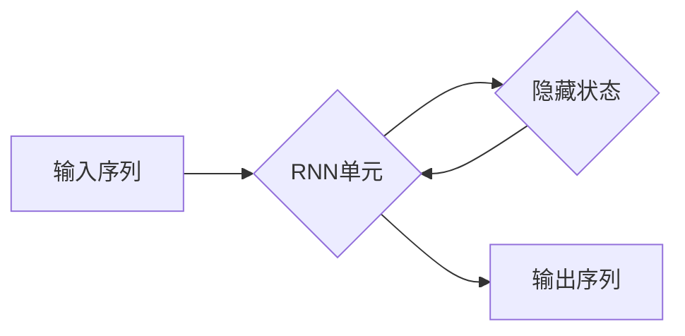

# 一切皆是映射：循环神经网络(RNNs)在时间序列分析中的作用

> 关键词：循环神经网络，RNN，时间序列分析，映射学习，递归模型，深度学习，序列到序列学习

## 1. 背景介绍

时间序列分析是数据科学和机器学习领域的一个重要分支，它涉及对随时间变化的数据进行建模和分析。从股票市场趋势到天气预测，从网络流量监控到生物医学信号处理，时间序列分析在各个领域都有着广泛的应用。然而，时间序列数据的特点——即数据的序列性和时序依赖性——给传统的统计方法带来了挑战。近年来，循环神经网络（Recurrent Neural Networks，RNNs）的出现为时间序列分析提供了一种强大的工具，它能够捕捉数据中的时间依赖性，并生成有意义的预测。

## 2. 核心概念与联系

### 2.1 循环神经网络（RNN）

循环神经网络是一种特殊的神经网络，它能够处理序列数据。RNN通过引入循环连接，使得网络能够“记住”之前的输入，从而在序列的每个时间步上更新其状态。



### 2.2 递归模型

RNN是递归模型的一种，它具有以下特点：

- **时间依赖性**：RNN能够处理序列数据，并且序列中的每个元素都依赖于之前的元素。
- **循环连接**：每个时间步的输出都会反馈到下一个时间步，形成循环。
- **记忆能力**：RNN能够“记住”之前的输入，这使得它在处理时间序列数据时非常有用。

### 2.3 深度学习与序列到序列学习

深度学习是一种多层神经网络，它能够学习复杂的数据表示。序列到序列学习是深度学习的一个分支，它专门处理序列数据，如图像到图像的转换或语言翻译。

## 3. 核心算法原理 & 具体操作步骤

### 3.1 算法原理概述

RNN的基本单元是循环单元，如LSTM（Long Short-Term Memory）或GRU（Gated Recurrent Unit）。这些单元通过门控机制来控制信息的流动，从而解决传统RNN在长序列数据上难以学习长期依赖性的问题。

### 3.2 算法步骤详解

1. **初始化**：给定初始状态和权重。
2. **前向传播**：在每个时间步上，将输入序列的当前元素输入到循环单元中，更新隐藏状态。
3. **后向传播**：计算损失，并通过梯度下降或其他优化算法更新权重。
4. **预测**：使用训练好的模型对新序列数据进行预测。

### 3.3 算法优缺点

**优点**：

- 能够处理任意长度的序列。
- 能够捕捉数据中的时间依赖性。

**缺点**：

- 训练不稳定，容易出现梯度消失或爆炸问题。
- 难以捕捉长期依赖性。

### 3.4 算法应用领域

- 股票市场预测
- 天气预测
- 语音识别
- 语言翻译
- 机器翻译
- 语音合成

## 4. 数学模型和公式 & 详细讲解 & 举例说明

### 4.1 数学模型构建

RNN的数学模型可以表示为：

$$
h_t = f(W_xh_{t-1} + W_uu_t + b_h)
$$

其中，$h_t$ 是第 $t$ 个时间步的隐藏状态，$u_t$ 是第 $t$ 个时间步的输入，$W_x$ 和 $W_u$ 是权重矩阵，$b_h$ 是偏置项。

### 4.2 公式推导过程

RNN的推导过程涉及到递归方程的求解，这里不进行详细推导。

### 4.3 案例分析与讲解

以时间序列预测为例，我们可以使用LSTM模型来预测股票价格。

1. **数据预处理**：将股票价格序列转换为LSTM模型可接受的格式。
2. **模型构建**：使用LSTM模型，并设置合适的参数。
3. **训练模型**：使用历史股价数据训练模型。
4. **预测未来股价**：使用训练好的模型预测未来股价。

## 5. 项目实践：代码实例和详细解释说明

### 5.1 开发环境搭建

- 安装Python、NumPy、TensorFlow等。

### 5.2 源代码详细实现

```python
import tensorflow as tf
from tensorflow.keras.models import Sequential
from tensorflow.keras.layers import LSTM, Dense

# 数据预处理
# ...

# 模型构建
model = Sequential([
    LSTM(50, activation='relu', input_shape=(X_train.shape[1], X_train.shape[2])),
    Dense(1)
])

# 训练模型
model.compile(optimizer='adam', loss='mean_squared_error')
model.fit(X_train, y_train, epochs=50, batch_size=32, validation_data=(X_val, y_val))

# 预测未来股价
predictions = model.predict(X_test)
```

### 5.3 代码解读与分析

上述代码展示了如何使用TensorFlow构建LSTM模型进行时间序列预测。首先，进行数据预处理，将股票价格序列转换为LSTM模型可接受的格式。然后，构建LSTM模型，并设置合适的参数。接着，使用历史股价数据训练模型。最后，使用训练好的模型预测未来股价。

## 6. 实际应用场景

### 6.1 股票市场预测

股票市场预测是RNN在时间序列分析中最常见的应用之一。通过分析历史股价数据，RNN可以预测未来的股价走势。

### 6.2 天气预测

天气预测是另一个常见的应用场景。RNN可以分析历史天气数据，预测未来的天气状况。

### 6.3 语音识别

语音识别是RNN的另一个重要应用。RNN可以分析语音信号，将其转换为文本。

## 7. 工具和资源推荐

### 7.1 学习资源推荐

- 《Deep Learning》
- 《Sequence Modeling with RNNs and LSTMs》
- TensorFlow官方文档

### 7.2 开发工具推荐

- TensorFlow
- PyTorch
- Keras

### 7.3 相关论文推荐

- "Long Short-Term Memory" by Sepp Hochreiter and Jürgen Schmidhuber
- "A Theoretically Grounded Application of Dropout in Recurrent Neural Networks" by Yarin Gal and Zoubin Ghahramani

## 8. 总结：未来发展趋势与挑战

### 8.1 研究成果总结

RNN在时间序列分析中取得了显著的成果，它能够有效地捕捉数据中的时间依赖性，并生成有意义的预测。

### 8.2 未来发展趋势

- 更高效的时间序列分析方法，如Transformer。
- 深度学习与其他机器学习方法的结合。
- 更好的模型解释性和可解释性。

### 8.3 面临的挑战

- 训练稳定性问题。
- 长期依赖性问题。
- 模型解释性问题。

### 8.4 研究展望

RNN在时间序列分析中的应用前景广阔，未来将会有更多的研究关注如何提高模型的性能和可解释性，以及如何将RNN与其他方法结合，以解决更复杂的时间序列分析问题。

## 9. 附录：常见问题与解答

**Q1：RNN和CNN有什么区别？**

A：RNN适用于序列数据，而CNN适用于图像数据。RNN能够处理序列中的时序依赖性，而CNN能够提取图像中的局部特征。

**Q2：为什么RNN会出现梯度消失或爆炸问题？**

A：梯度消失或爆炸问题是由于RNN中的链式求导导致的。在长序列数据中，梯度可能逐渐减小或增大，导致训练不稳定。

**Q3：如何解决RNN的梯度消失或爆炸问题？**

A：可以使用LSTM或GRU等门控循环单元，它们通过门控机制来控制信息的流动，从而解决梯度消失或爆炸问题。

**Q4：RNN在哪些领域有应用？**

A：RNN在时间序列分析、语音识别、语言翻译等领域有广泛的应用。

---

作者：禅与计算机程序设计艺术 / Zen and the Art of Computer Programming