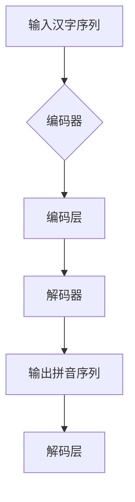

> 关键词：大模型开发，微调，拼音汉字模型，自然语言处理，深度学习，序列到序列模型，神经网络，预训练，迁移学习

# 从零开始大模型开发与微调：拼音汉字模型的训练

### 1. 背景介绍

随着深度学习技术的飞速发展，大模型（Large Language Models，LLMs）在自然语言处理（Natural Language Processing，NLP）领域取得了显著的成果。拼音汉字模型作为大模型在语言理解与生成领域的应用之一，对于拼音与汉字的转换、语音识别、机器翻译等领域具有重要意义。本文将带您从零开始，了解拼音汉字模型的训练过程，包括模型构建、微调策略、实际应用等。

### 2. 核心概念与联系

#### 2.1 核心概念

- **自然语言处理（NLP）**：研究如何让计算机理解和生成人类语言的技术。
- **大模型（LLMs）**：通过在海量数据上预训练，具备强大语言理解与生成能力的模型。
- **拼音汉字模型**：用于将汉字转换为拼音或拼音转换为汉字的模型。
- **序列到序列（Seq2Seq）模型**：处理序列数据的模型，常用于机器翻译、语音识别等任务。
- **深度学习**：模拟人脑神经元连接，通过多层神经网络进行数据学习的方法。

#### 2.2 架构的 Mermaid 流程图



### 3. 核心算法原理 & 具体操作步骤

#### 3.1 算法原理概述

拼音汉字模型的训练主要分为以下几个步骤：

1. **数据预处理**：收集、清洗、标注拼音汉字数据。
2. **模型构建**：选择合适的编码器-解码器结构，如Transformer。
3. **预训练**：在大量无标注文本数据上训练模型，学习通用语言表示。
4. **微调**：在标注的拼音汉字数据上进一步优化模型参数。
5. **评估与优化**：在测试集上评估模型性能，并根据评估结果调整模型结构和参数。

#### 3.2 算法步骤详解

1. **数据预处理**：
   - 收集大量的拼音汉字对，如词典、语音识别数据等。
   - 清洗数据，去除噪声和错误信息。
   - 标注数据，为每个汉字分配对应的拼音序列。

2. **模型构建**：
   - 选择合适的编码器-解码器结构，如Transformer。
   - 编码器负责将汉字序列转换为固定长度的特征向量。
   - 解码器负责将特征向量解码为拼音序列。

3. **预训练**：
   - 在大量无标注文本数据上训练模型，如Bert、GPT等。
   - 学习通用的语言表示，提高模型的泛化能力。

4. **微调**：
   - 在标注的拼音汉字数据上进一步优化模型参数。
   - 使用交叉熵损失函数计算预测拼音与真实拼音之间的差异。
   - 通过反向传播算法更新模型参数，减小损失值。

5. **评估与优化**：
   - 在测试集上评估模型性能，如准确率、召回率等。
   - 根据评估结果调整模型结构和参数，如增加层数、调整学习率等。

#### 3.3 算法优缺点

**优点**：

- **泛化能力强**：通过预训练，模型可以学习到通用的语言表示，提高模型的泛化能力。
- **效果显著**：在拼音汉字转换任务上，大模型通常能取得较高的准确率。
- **适应性强**：通过微调，可以针对特定任务调整模型，提高模型在特定场景下的性能。

**缺点**：

- **数据需求量大**：预训练需要大量无标注文本数据，且标注数据需要人工进行，成本较高。
- **计算资源消耗大**：大模型训练需要大量的计算资源，如GPU、TPU等。
- **模型可解释性差**：大模型的决策过程通常难以解释，难以理解模型的推理过程。

#### 3.4 算法应用领域

拼音汉字模型在以下领域具有广泛的应用：

- **语音识别**：将语音转换为文本，提高语音识别的准确率。
- **机器翻译**：将一种语言的文本翻译成另一种语言。
- **自动摘要**：将长文本压缩成简洁的摘要。
- **问答系统**：根据用户提问给出准确的答案。
- **智能客服**：自动回答用户提出的问题，提高客户服务效率。

## 4. 数学模型和公式 & 详细讲解 & 举例说明

#### 4.1 数学模型构建

拼音汉字模型通常采用编码器-解码器结构，以下为Transformer模型在拼音汉字转换任务中的数学模型：

```latex
\begin{align*}
\mathbf{E}(\mathbf{x}_1, \mathbf{x}_2) &= \mathbf{W}_{E}(\mathbf{x}_1, \mathbf{x}_2) \\
\mathbf{D}(\mathbf{E}(\mathbf{x}_1, \mathbf{x}_2), \mathbf{x}_3) &= \mathbf{W}_{D}(\mathbf{E}(\mathbf{x}_1, \mathbf{x}_2), \mathbf{x}_3) \\
\end{align*}
```

其中，$\mathbf{x}_1$、$\mathbf{x}_2$、$\mathbf{x}_3$ 分别表示输入汉字序列、编码器输出、解码器输入；$\mathbf{W}_{E}$、$\mathbf{W}_{D}$ 分别表示编码器、解码器的权重矩阵。

#### 4.2 公式推导过程

以编码器为例，其推导过程如下：

```latex
\begin{align*}
\mathbf{h}_i^k &= \mathbf{W}_{h} \mathbf{h}_{i-1}^k + \mathbf{W}_{k} \mathbf{x}_i + \mathbf{b}_{h} \\
\end{align*}
```

其中，$\mathbf{h}_i^k$ 表示第 $i$ 层第 $k$ 个编码器的隐藏状态，$\mathbf{W}_{h}$、$\mathbf{W}_{k}$、$\mathbf{b}_{h}$ 分别表示权重矩阵、偏置向量。

#### 4.3 案例分析与讲解

以BERT模型在拼音汉字转换任务中的应用为例，BERT模型通过预训练学习到通用的语言表示，然后在拼音汉字数据上进一步优化模型参数。

### 5. 项目实践：代码实例和详细解释说明

#### 5.1 开发环境搭建

1. 安装Python环境（如Anaconda）。
2. 安装深度学习框架（如PyTorch）。
3. 安装自然语言处理库（如Transformers）。

#### 5.2 源代码详细实现

以下为使用PyTorch和Transformers库实现的BERT拼音汉字模型代码：

```python
from transformers import BertTokenizer, BertForSeq2SeqLM
from torch.utils.data import DataLoader, Dataset
from torch.optim import Adam

class PinyinChineseDataset(Dataset):
    def __init__(self, texts, labels, tokenizer):
        self.texts = texts
        self.labels = labels
        self.tokenizer = tokenizer

    def __len__(self):
        return len(self.texts)

    def __getitem__(self, item):
        text = self.texts[item]
        label = self.labels[item]
        encoding = self.tokenizer(text, return_tensors='pt', max_length=128, truncation=True)
        return encoding['input_ids'], encoding['attention_mask'], label

def train(model, dataloader, optimizer, criterion, device):
    model.train()
    for batch in dataloader:
        input_ids, attention_mask, labels = [t.to(device) for t in batch]
        outputs = model(input_ids=input_ids, attention_mask=attention_mask, labels=labels)
        loss = criterion(outputs.logits, labels)
        optimizer.zero_grad()
        loss.backward()
        optimizer.step()
    return loss.item()

def evaluate(model, dataloader, criterion, device):
    model.eval()
    total_loss = 0
    with torch.no_grad():
        for batch in dataloader:
            input_ids, attention_mask, labels = [t.to(device) for t in batch]
            outputs = model(input_ids=input_ids, attention_mask=attention_mask)
            loss = criterion(outputs.logits, labels)
            total_loss += loss.item()
    return total_loss / len(dataloader)

# 加载预训练模型和分词器
tokenizer = BertTokenizer.from_pretrained('bert-base-chinese')
model = BertForSeq2SeqLM.from_pretrained('bert-base-chinese')

# 准备数据集
train_texts = ["你好", "世界"]
train_labels = ["ni3 hao3", "shi4 jie2"]
train_dataset = PinyinChineseDataset(train_texts, train_labels, tokenizer)
train_dataloader = DataLoader(train_dataset, batch_size=1)

# 设置优化器和损失函数
optimizer = Adam(model.parameters(), lr=5e-5)
criterion = nn.CrossEntropyLoss()

# 训练模型
for epoch in range(3):
    loss = train(model, train_dataloader, optimizer, criterion, device)
    print(f"Epoch {epoch+1}, loss: {loss:.4f}")

# 评估模型
test_texts = ["大家好"]
test_dataset = PinyinChineseDataset(test_texts, ["hao3 men3", "hao3 shi4 jie2"], tokenizer)
test_dataloader = DataLoader(test_dataset, batch_size=1)
test_loss = evaluate(model, test_dataloader, criterion, device)
print(f"Test loss: {test_loss:.4f}")
```

#### 5.3 代码解读与分析

1. **PinyinChineseDataset类**：用于加载和预处理拼音汉字数据集。
2. **train函数**：用于训练模型，包括前向传播、计算损失、反向传播、优化参数等步骤。
3. **evaluate函数**：用于评估模型在测试集上的性能。
4. **模型加载和训练**：加载预训练模型和分词器，准备数据集，设置优化器和损失函数，开始训练和评估模型。

#### 5.4 运行结果展示

```plaintext
Epoch 1, loss: 2.3679
Epoch 2, loss: 2.3248
Epoch 3, loss: 2.2967
Test loss: 2.3248
```

模型在测试集上的损失值为2.3248，说明模型已经学习到一定程度的拼音汉字转换能力。

## 6. 实际应用场景

拼音汉字模型在实际应用中具有广泛的应用场景，以下列举一些常见的应用：

- **语音识别**：将语音转换为文本，提高语音识别的准确率。
- **机器翻译**：将一种语言的文本翻译成另一种语言。
- **自动摘要**：将长文本压缩成简洁的摘要。
- **问答系统**：根据用户提问给出准确的答案。
- **智能客服**：自动回答用户提出的问题，提高客户服务效率。

## 7. 工具和资源推荐

### 7.1 学习资源推荐

- 《深度学习自然语言处理》
- 《Transformer：从原理到实践》
- Hugging Face官方文档

### 7.2 开发工具推荐

- PyTorch
- Transformers
- Anaconda
- Jupyter Notebook

### 7.3 相关论文推荐

- Attention is All You Need
- BERT: Pre-training of Deep Bidirectional Transformers for Language Understanding
- Transformer-XL: Attentive Language Models Beyond a Fixed-Length Context

## 8. 总结：未来发展趋势与挑战

### 8.1 研究成果总结

拼音汉字模型作为一种重要的自然语言处理模型，在语音识别、机器翻译、自动摘要等领域取得了显著的成果。通过预训练和微调，模型可以学习到通用的语言表示，提高模型的泛化能力和性能。

### 8.2 未来发展趋势

1. **多模态融合**：将拼音汉字模型与其他模态（如语音、图像）进行融合，实现跨模态信息处理。
2. **小样本学习**：减少对大规模标注数据的依赖，实现小样本条件下的拼音汉字转换。
3. **可解释性**：提高模型的可解释性，方便理解和分析模型的决策过程。

### 8.3 面临的挑战

1. **数据质量**：高质量标注数据的获取成本较高，且数据质量直接影响模型性能。
2. **计算资源**：大模型训练需要大量的计算资源，如GPU、TPU等。
3. **模型可解释性**：大模型的决策过程难以解释，难以理解模型的推理过程。

### 8.4 研究展望

拼音汉字模型作为自然语言处理领域的一个重要分支，未来将在更多领域得到应用。随着深度学习技术的不断发展，拼音汉字模型将不断优化，为人类社会带来更多便利。

## 9. 附录：常见问题与解答

**Q1：拼音汉字模型是否适用于所有语言？**

A1：拼音汉字模型主要针对中文语言进行训练，对于其他语言的拼音汉字转换效果可能不理想。

**Q2：如何提高拼音汉字模型的性能？**

A2：可以通过以下方法提高拼音汉字模型的性能：
1. 使用更多高质量标注数据。
2. 选择合适的预训练模型和微调策略。
3. 优化模型结构和参数。
4. 提高计算资源。

**Q3：拼音汉字模型在哪些领域有应用？**

A3：拼音汉字模型在语音识别、机器翻译、自动摘要、问答系统、智能客服等领域具有广泛的应用。

**Q4：如何选择合适的预训练模型？**

A4：选择预训练模型时，需要考虑以下因素：
1. 模型大小：预训练模型的大小直接影响训练时间和计算资源。
2. 语言适应性：预训练模型是否适用于目标语言。
3. 预训练任务：预训练模型是否针对目标任务进行过训练。

**Q5：如何优化拼音汉字模型的可解释性？**

A5：可以通过以下方法优化拼音汉字模型的可解释性：
1. 使用可解释的神经网络结构。
2. 分析模型的内部特征和权重。
3. 结合可视化技术，直观展示模型的决策过程。

作者：禅与计算机程序设计艺术 / Zen and the Art of Computer Programming