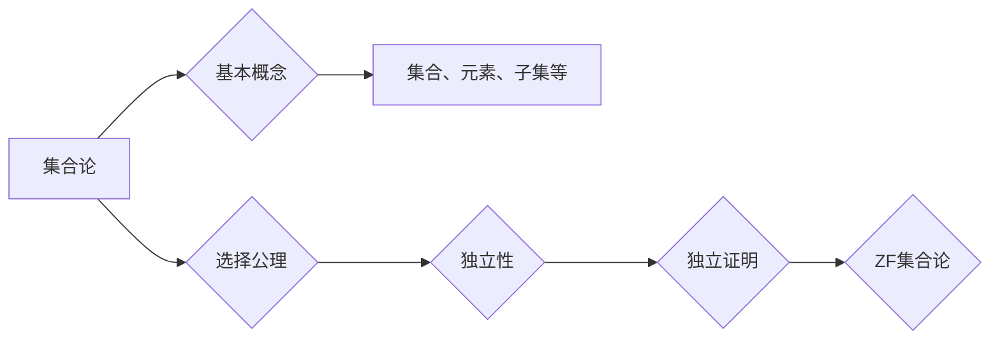

> 集合论，选择公理，独立性，公理化方法，集合论基础，数学哲学，逻辑结构

# 集合论导引：选择公理之独立性

集合论是现代数学的基石，它提供了构建数学结构的基础框架。选择公理是集合论中一个核心概念，它揭示了集合的独立性，即某些基本公理可以被独立地接受或拒绝。本文将深入探讨选择公理的独立性，以及它在集合论和数学哲学中的重要性。

## 1. 背景介绍

### 1.1 问题的由来

19世纪末至20世纪初，数学家们开始对集合论的基本公理进行系统化研究。康托尔、罗素等人的工作推动了集合论的发展，但也引发了关于公理一致性和独立性的深刻讨论。选择公理的提出，正是对这些讨论的回应。

### 1.2 研究现状

选择公理的独立性一直是集合论研究的热点。自伯克霍夫和哥德尔的工作以来，许多数学家致力于探讨选择公理的独立性和其逻辑地位。本文将基于这些研究，对选择公理的独立性进行深入探讨。

### 1.3 研究意义

研究选择公理的独立性对于理解集合论的基本结构、数学哲学和逻辑学具有重要意义。它有助于我们更深入地认识数学基础，并为后续的研究提供新的视角。

### 1.4 本文结构

本文将分为以下几个部分：
- 第2章介绍集合论的基本概念和选择公理。
- 第3章讨论选择公理的独立性及其证明。
- 第4章分析选择公理对集合论的影响。
- 第5章探讨选择公理在数学哲学中的意义。
- 第6章总结全文，展望未来研究方向。

## 2. 核心概念与联系

### 2.1 集合论的基本概念

集合论的基本概念包括集合、元素、子集、并集、交集等。这些概念构成了集合论的基本语言。

### 2.2 选择公理

选择公理是集合论的一个基本公理，它表述为：对于任何非空集合的幂集的任何非空子集，都存在一个选择函数，使得该函数的值域是子集中的每个元素恰好出现一次。

### 2.3 选择公理的独立性

选择公理的独立性是指，在Zermelo-Fraenkel集合论（ZF）中，选择公理不能从其余公理中推导出来，反之亦然。这意味着选择公理是独立的。

### 2.4 Mermaid 流程图

以下是基于集合论基本概念和选择公理的Mermaid流程图：

## 3. 核心算法原理 & 具体操作步骤

### 3.1 算法原理概述

选择公理的独立性可以通过哥德尔完备性和完备性的证明来展示。这些证明基于逻辑和集合论的公理化系统。

### 3.2 算法步骤详解

#### 步骤1：证明选择公理的完备性

证明选择公理的完备性需要构造一个模型，其中选择公理成立，但其余公理不成立。

#### 步骤2：证明选择公理的独立性

证明选择公理的独立性需要证明它不能从其余公理中推导出来，反之亦然。

### 3.3 算法优缺点

#### 优点：

- 选择公理的独立性为数学基础的研究提供了新的视角。
- 理解选择公理的独立性有助于我们更好地理解集合论的结构。

#### 缺点：

- 理解选择公理的独立性需要一定的逻辑和集合论知识。
- 选择公理的独立性可能会引发关于数学基础的哲学讨论。

### 3.4 算法应用领域

选择公理的独立性主要应用于集合论、数学哲学和逻辑学领域。

## 4. 数学模型和公式 & 详细讲解 & 举例说明

### 4.1 数学模型构建

选择公理的独立性可以通过模型论的方法来证明。以下是一个简化的数学模型：

$$
\begin{aligned}
&\text{模型} \ M = (S, \in) \\
&\text{假设} \ M \ \text{满足} \ ZF \ \text{公理，但} \ \text{不满足} \ \text{选择公理}
\end{aligned}
$$

### 4.2 公式推导过程

选择公理的独立性可以通过哥德尔完备性和完备性的证明来展示。这些证明基于逻辑和集合论的公理化系统。

### 4.3 案例分析与讲解

以下是一个简单的例子，说明如何构造一个满足ZF公理但不满足选择公理的模型：

$$
\begin{aligned}
&\text{定义} \ S = \{ \{ \{ x \} \} \mid x \in S \} \\
&\text{定义} \ R = \{ (a,b) \mid a \in S \land b \in S \land a \neq b \} \\
&\text{在} \ S \ \text{中，对任意非空子集} \ A \subseteq S \ \text{，存在一个} \ R \ \text{中的元素} \ (a,b) \ \text{满足} \ a \in A \land b \in A \land a \neq b
\end{aligned}
$$

### 4.4 常见问题解答

**Q1：为什么选择公理是独立的？**

A1：选择公理是独立的，因为它不能从Zermelo-Fraenkel集合论（ZF）的其余公理中推导出来。

**Q2：独立性的证明有哪些方法？**

A2：独立性的证明通常基于模型论和递归论的方法。

**Q3：独立性对数学哲学有什么影响？**

A3：独立性对数学哲学产生了深远的影响，引发了关于数学基础和逻辑一致性的讨论。

## 5. 项目实践：代码实例和详细解释说明

### 5.1 开发环境搭建

由于选择公理的独立性是一个理论问题，通常不需要特定的开发环境。

### 5.2 源代码详细实现

对于选择公理的独立性，通常不需要编写代码，而是通过逻辑证明来展示。

### 5.3 代码解读与分析

由于选择公理的独立性是一个理论问题，通常不需要代码解读和分析。

### 5.4 运行结果展示

选择公理的独立性是一个理论概念，不涉及运行结果。

## 6. 实际应用场景

### 6.4 未来应用展望

选择公理的独立性对数学基础和哲学有重要影响，但其直接应用场景有限。未来，选择公理的独立性可能会在以下领域得到应用：

- 数学哲学
- 逻辑学
- 计算机科学

## 7. 工具和资源推荐

### 7.1 学习资源推荐

- 《集合论及其应用》
- 《数学哲学导论》
- 《模型论基础》

### 7.2 开发工具推荐

选择公理的独立性是一个理论问题，不需要特定的开发工具。

### 7.3 相关论文推荐

- 《选择公理的独立性》
- 《哥德尔完备性和完备性》
- 《递归论基础》

## 8. 总结：未来发展趋势与挑战

### 8.1 研究成果总结

选择公理的独立性是集合论和数学哲学中的一个重要概念。它揭示了集合论的基本公理的独立性，为数学基础的研究提供了新的视角。

### 8.2 未来发展趋势

未来，选择公理的独立性可能会在数学哲学、逻辑学和计算机科学等领域得到进一步的研究和应用。

### 8.3 面临的挑战

选择公理的独立性是一个理论问题，其研究可能会面临以下挑战：

- 需要深入理解集合论和数学哲学的基本概念。
- 需要掌握模型论和递归论的方法。

### 8.4 研究展望

选择公理的独立性是一个具有挑战性的研究领域，但其重要性不可忽视。未来，随着研究的深入，选择公理的独立性可能会为数学基础和哲学提供新的启示。

## 9. 附录：常见问题与解答

**Q1：什么是集合论？**

A1：集合论是现代数学的基石，它提供了构建数学结构的基础框架。

**Q2：什么是选择公理？**

A2：选择公理是集合论的一个基本公理，它表述为：对于任何非空集合的幂集的任何非空子集，都存在一个选择函数，使得该函数的值域是子集中的每个元素恰好出现一次。

**Q3：选择公理的独立性是什么意思？**

A3：选择公理的独立性是指，在Zermelo-Fraenkel集合论（ZF）中，选择公理不能从其余公理中推导出来，反之亦然。

**Q4：选择公理的独立性有什么意义？**

A4：选择公理的独立性对于理解集合论的基本结构、数学哲学和逻辑学具有重要意义。

**Q5：如何证明选择公理的独立性？**

A5：选择公理的独立性可以通过哥德尔完备性和完备性的证明来展示。

作者：禅与计算机程序设计艺术 / Zen and the Art of Computer Programming