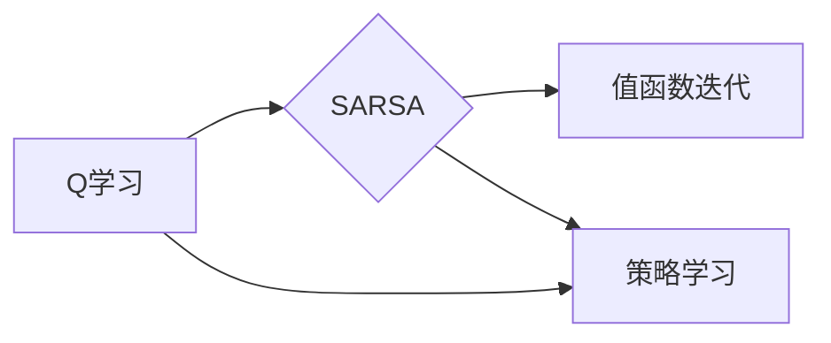

# SARSA算法(SARSA) - 原理与代码实例讲解

作者：禅与计算机程序设计艺术 / Zen and the Art of Computer Programming

## 关键词：

强化学习，SARSA算法，Q学习，值函数，策略，马尔可夫决策过程，迭代，探索，利用

---

## 1. 背景介绍

### 1.1 问题的由来

强化学习(Reinforcement Learning, RL)是机器学习的一个分支，它通过智能体与环境交互，学习如何做出最优决策。在现实世界中，许多决策问题都可以抽象为强化学习问题，例如游戏、自动驾驶、推荐系统等。

强化学习中的核心概念包括智能体(Agent)、环境(Environment)、状态(State)、动作(Action)、奖励(Reward)和策略(Policy)。智能体通过探索和利用环境，学习一个策略，以最大化累积奖励。

SARSA(Successor Feature Representation)算法是一种基于值函数的强化学习算法，它通过迭代更新值函数来学习策略。本文将详细介绍SARSA算法的原理、步骤、优缺点和应用场景。

### 1.2 研究现状

自从1950年代提出以来，强化学习已经发展出多种算法，包括Q学习、SARSA、深度强化学习等。这些算法在多个领域取得了显著的成果，例如AlphaGo、AlphaFold等。

SARSA算法作为一种经典的强化学习算法，在早期研究中取得了许多成功，但近年来，随着深度学习的发展，深度强化学习算法逐渐成为主流。然而，SARSA算法作为一种简单易懂的算法，仍然具有重要的理论和实践价值。

### 1.3 研究意义

SARSA算法的研究和实现对于以下方面具有重要意义：

1. **理论意义**：SARSA算法是强化学习的基础算法之一，深入理解SARSA算法有助于更好地理解强化学习的基本原理。
2. **实践意义**：SARSA算法可以应用于各种强化学习问题，例如游戏、机器人控制等，帮助智能体学习最优策略。
3. **教学意义**：SARSA算法的简单性和直观性使其成为强化学习教学的重要素材。

### 1.4 本文结构

本文将按照以下结构进行阐述：

- 第2部分，介绍强化学习的基础概念。
- 第3部分，详细讲解SARSA算法的原理和步骤。
- 第4部分，通过数学模型和公式推导SARSA算法。
- 第5部分，给出SARSA算法的代码实现示例。
- 第6部分，探讨SARSA算法在实际应用场景中的应用。
- 第7部分，推荐SARSA算法相关的学习资源、开发工具和参考文献。
- 第8部分，总结SARSA算法的未来发展趋势与挑战。
- 第9部分，提供SARSA算法的常见问题与解答。

---

## 2. 核心概念与联系

在介绍SARSA算法之前，我们需要先了解一些强化学习中的核心概念，包括：

- **智能体(Agent)**：智能体是执行动作、感知环境并学习最优策略的实体。
- **环境(Environment)**：环境是智能体所处的外部世界，它根据智能体的动作产生状态转移和奖励。
- **状态(State)**：状态是智能体在某个时间点所处的环境状态。
- **动作(Action)**：动作是智能体可以执行的行为。
- **奖励(Reward)**：奖励是环境对智能体动作的反馈。
- **策略(Policy)**：策略是智能体在给定状态下选择动作的规则。
- **值函数(Value Function)**：值函数表示智能体在某个状态下采取特定动作的期望奖励。
- **Q值函数(Q-Function)**：Q值函数是值函数在给定状态和动作上的具体数值。
- **迭代(Iteration)**：迭代是智能体与环境交互的次数。
- **探索(Exploration)**：探索是智能体尝试从未执行过的动作的行为。
- **利用(Exploitation)**：利用是智能体在已知信息中选择最优动作的行为。

SARSA算法是Q学习算法的一个变种，它们之间的联系如下：

- **Q学习**：Q学习是一种基于值函数的强化学习算法，它通过迭代更新Q值函数来学习策略。
- **SARSA**：SARSA是Q学习的一个变种，它使用实际观察到的奖励和下一个状态来更新Q值函数。

### 2.1 联系图



---

## 3. 核心算法原理 & 具体操作步骤

### 3.1 算法原理概述

SARSA算法通过迭代更新Q值函数来学习策略，其基本思想如下：

1. 初始化Q值函数：将Q值函数初始化为0或随机值。
2. 迭代更新Q值函数：在迭代过程中，智能体在当前状态执行动作，观察下一个状态和奖励，并根据Q值函数的更新规则更新Q值。

### 3.2 算法步骤详解

SARSA算法的具体步骤如下：

1. 初始化Q值函数：将Q值函数 $Q(s,a)$ 初始化为0或随机值。
2. 选择动作：在给定状态 $s$ 下，根据策略 $\pi(s)$ 选择动作 $a$。
3. 执行动作：智能体执行动作 $a$，观察下一个状态 $s'$ 和奖励 $r$。
4. 更新Q值函数：根据以下公式更新Q值函数：
   $$
 Q(s,a) \leftarrow Q(s,a) + \alpha [r + \gamma \max_{a'}Q(s',a') - Q(s,a)]
 $$
   其中，$\alpha$ 是学习率，$\gamma$ 是折扣因子。
5. 迭代：重复步骤2-4，直到满足停止条件。

### 3.3 算法优缺点

**优点**：

- SARSA算法是一种稳定的算法，它使用实际观察到的奖励和下一个状态来更新Q值函数，从而避免了一些随机性。
- SARSA算法可以应用于具有连续动作空间的强化学习问题。

**缺点**：

- SARSA算法需要大量的迭代来收敛，因为它依赖于实际观察到的奖励和下一个状态。
- SARSA算法在收敛速度方面可能不如Q学习算法。

### 3.4 算法应用领域

SARSA算法可以应用于各种强化学习问题，例如：

- **游戏**：例如，SARSA算法可以用于训练智能体玩电子游戏，例如Atari 2600游戏。
- **机器人控制**：例如，SARSA算法可以用于训练机器人进行移动、抓取等任务。
- **推荐系统**：例如，SARSA算法可以用于训练推荐系统，根据用户的历史行为推荐商品。

---

## 4. 数学模型和公式 & 详细讲解 & 举例说明

### 4.1 数学模型构建

SARSA算法的数学模型如下：

- **状态空间 $S$**：状态空间是所有可能状态集合的集合。
- **动作空间 $A$**：动作空间是所有可能动作集合的集合。
- **策略 $\pi(s)$**：策略是智能体在给定状态下选择动作的规则。
- **Q值函数 $Q(s,a)$**：Q值函数是值函数在给定状态和动作上的具体数值。
- **折扣因子 $\gamma$**：折扣因子是用于计算未来奖励的衰减系数。
- **学习率 $\alpha$**：学习率是用于控制更新步骤的大小。

### 4.2 公式推导过程

SARSA算法的公式推导过程如下：

1. **Q值函数的更新公式**：
   $$
 Q(s,a) \leftarrow Q(s,a) + \alpha [r + \gamma \max_{a'}Q(s',a') - Q(s,a)]
 $$
   其中，$\alpha$ 是学习率，$\gamma$ 是折扣因子，$r$ 是奖励，$s'$ 是下一个状态，$a'$ 是在下一个状态下选择的最优动作。

2. **最优动作的选择**：
   $$
 a' = \arg\max_{a'} Q(s',a')
 $$
   其中，$a'$ 是在下一个状态下选择的最优动作。

### 4.3 案例分析与讲解

以下是一个简单的SARSA算法案例，用于训练智能体在赌局中学习如何下注。

假设智能体面临以下赌局：

- 智能体可以选择下注“是”或“否”。
- 如果智能体下注“是”，智能体将赢得$10$美元的概率为$0.6$，否则将输掉$5$美元。
- 智能体的目标是在长期内最大化累积奖励。

智能体的策略可以用以下公式表示：

$$
 \pi(s) =
\begin{cases}
 P(a=是) = 0.6, & \text{if } s \text{ is "I feel lucky"} \
 P(a=否) = 0.4, & \text{if } s \text{ is "I feel unlucky"}
\end{cases}
$$

我们可以使用SARSA算法来训练智能体学习最优策略。以下是一个使用Python实现的SARSA算法示例：

```python
import random

# 初始化Q值函数
Q = {}

# 学习率
alpha = 0.1

# 折扣因子
gamma = 0.9

# 迭代次数
iterations = 10000

for _ in range(iterations):
    # 初始化状态
    s = random.choice(["I feel lucky", "I feel unlucky"])
    # 选择动作
    a = random.choices(["是", "否"], weights=[0.6, 0.4])[0]
    # 执行动作并观察下一个状态和奖励
    if a == "是":
        r = random.choices([10, -5], weights=[0.6, 0.4])[0]
        s' = random.choice(["I feel lucky", "I feel unlucky"])
    else:
        r = -5
        s' = random.choice(["I feel lucky", "I feel unlucky"])
    # 更新Q值函数
    Q[(s, a)] = Q.get((s, a), 0) + alpha * (r + gamma * max(Q.get((s', "是"), 0), Q.get((s', "否"), 0)) - Q.get((s, a), 0))

# 打印Q值函数
for (s, a), q in Q.items():
    print(f"Q({s}, {a}) = {q}")
```

### 4.4 常见问题解答

**Q1：SARSA算法和Q学习算法有什么区别？**

A：SARSA算法和Q学习算法都是基于值函数的强化学习算法，但它们之间存在以下区别：

- SARSA算法使用实际观察到的奖励和下一个状态来更新Q值函数，而Q学习算法使用预测的奖励和下一个状态来更新Q值函数。
- SARSA算法可以应用于具有连续动作空间的强化学习问题，而Q学习算法通常用于具有离散动作空间的强化学习问题。

**Q2：如何选择学习率和折扣因子？**

A：学习率和折扣因子的选择取决于具体的应用场景。以下是一些选择学习率和折扣因子的建议：

- 学习率：学习率决定了Q值函数更新的速度。学习率过大可能导致过拟合，学习率过小可能导致收敛速度慢。通常，学习率可以从一个较小的值开始，例如0.1，然后根据实验结果进行调整。
- 折扣因子：折扣因子表示未来奖励的衰减系数。折扣因子越接近1，未来奖励对未来决策的影响就越大。通常，折扣因子的值在0.8到1之间。

---

## 5. 项目实践：代码实例和详细解释说明

### 5.1 开发环境搭建

在进行SARSA算法项目实践之前，我们需要搭建以下开发环境：

1. Python 3.x
2. PyTorch
3. Gym

以下是在Ubuntu 20.04系统上搭建开发环境的步骤：

1. 安装Python 3.x和pip：

```bash
sudo apt update
sudo apt install python3 python3-pip
```

2. 安装PyTorch：

```bash
pip3 install torch torchvision torchaudio
```

3. 安装Gym：

```bash
pip3 install gym
```

### 5.2 源代码详细实现

以下是一个使用PyTorch实现SARSA算法的示例，该示例使用Gym环境中的CartPole游戏：

```python
import gym
import torch
import torch.nn as nn
import torch.optim as optim

# 创建CartPole游戏环境
env = gym.make("CartPole-v1")

# 定义神经网络模型
class SARSA(nn.Module):
    def __init__(self, input_size, action_size):
        super(SARSA, self).__init__()
        self.fc1 = nn.Linear(input_size, 24)
        self.fc2 = nn.Linear(24, action_size)

    def forward(self, x):
        x = torch.relu(self.fc1(x))
        x = self.fc2(x)
        return x

# 初始化模型
model = SARSA(env.observation_space.shape[0], env.action_space.n)

# 初始化优化器
optimizer = optim.Adam(model.parameters(), lr=0.01)

# 初始化学习率和折扣因子
alpha = 0.1
gamma = 0.9

# 迭代次数
iterations = 10000

# 训练模型
for i in range(iterations):
    # 初始化状态
    state = env.reset()
    state = torch.from_numpy(state).float().unsqueeze(0)

    done = False
    while not done:
        # 选择动作
        with torch.no_grad():
            actions = model(state)
            action = torch.argmax(actions).item()

        # 执行动作并观察下一个状态和奖励
        next_state, reward, done, _ = env.step(action)
        next_state = torch.from_numpy(next_state).float().unsqueeze(0)

        # 计算目标值
        target = reward + gamma * torch.max(model(next_state))

        # 更新Q值函数
        actions = model(state)
        actions[actions == action] = target
        optimizer.zero_grad()
        loss = nn.MSELoss()(actions, target)
        loss.backward()
        optimizer.step()

    # 打印训练进度
    if i % 100 == 0:
        print(f"Iteration {i}: {loss.item()}")

# 关闭游戏环境
env.close()
```

### 5.3 代码解读与分析

1. **导入库**：首先导入必要的库，包括gym、torch、torch.nn和torch.optim。
2. **创建环境**：使用Gym创建CartPole游戏环境。
3. **定义模型**：定义SARSA算法的网络模型，该模型包含两个全连接层。
4. **初始化模型和优化器**：初始化模型和优化器。
5. **初始化学习率和折扣因子**：初始化学习率和折扣因子。
6. **迭代训练**：在迭代训练过程中，智能体在环境中执行动作，观察下一个状态和奖励，并根据SARSA算法更新Q值函数。
7. **关闭游戏环境**：训练完成后，关闭游戏环境。

### 5.4 运行结果展示

在运行上述代码后，我们可以看到训练进度和损失函数的值。随着迭代次数的增加，损失函数的值应该逐渐减小，表明模型性能在不断提高。

---

## 6. 实际应用场景

### 6.1 游戏AI

SARSA算法可以应用于各种游戏AI，例如：

- 电子游戏：例如，SARSA算法可以用于训练智能体玩电子游戏，例如Atari 2600游戏。
-棋类游戏：例如，SARSA算法可以用于训练智能体玩国际象棋、围棋等棋类游戏。

### 6.2 机器人控制

SARSA算法可以应用于机器人控制，例如：

- 机器人路径规划：SARSA算法可以用于训练机器人进行路径规划，以避开障碍物。
- 机器人抓取：SARSA算法可以用于训练机器人进行抓取任务。

### 6.3 推荐系统

SARSA算法可以应用于推荐系统，例如：

- 商品推荐：SARSA算法可以用于根据用户的历史行为推荐商品。
- 电影推荐：SARSA算法可以用于根据用户的历史观看行为推荐电影。

---

## 7. 工具和资源推荐

### 7.1 学习资源推荐

以下是一些学习SARSA算法的资源：

1. 《Reinforcement Learning: An Introduction》
2. 《Deep Reinforcement Learning》
3. 《Reinforcement Learning with Python》

### 7.2 开发工具推荐

以下是一些用于实现SARSA算法的开发工具：

1. PyTorch
2. TensorFlow
3. Gym

### 7.3 相关论文推荐

以下是一些关于SARSA算法的论文：

1. "Reinforcement Learning: An Introduction" by Richard S. Sutton and Andrew G. Barto
2. "Q-Learning" by Volodymyr Mnih et al.
3. "Sarsa" by Richard S. Sutton and Andrew G. Barto

### 7.4 其他资源推荐

以下是一些其他关于SARSA算法的资源：

1. [SARSA算法教程](https://www.deeplearning.net/2019/02/05/sarsa.html)
2. [SARSA算法代码示例](https://github.com/llSourcell/sarsa)

---

## 8. 总结：未来发展趋势与挑战

### 8.1 研究成果总结

本文详细介绍了SARSA算法的原理、步骤、优缺点和应用场景。通过数学模型和公式推导，我们深入理解了SARSA算法的工作机制。通过代码实例，我们掌握了SARSA算法的实现方法。通过实际应用场景的探讨，我们了解了SARSA算法在各个领域的应用价值。

### 8.2 未来发展趋势

SARSA算法作为一种经典的强化学习算法，在未来发展趋势如下：

1. **与深度学习结合**：将SARSA算法与深度神经网络结合，构建深度强化学习模型，以解决更复杂的强化学习问题。
2. **多智能体强化学习**：研究多智能体SARSA算法，实现多个智能体之间的协同合作。
3. **强化学习与优化算法结合**：将SARSA算法与优化算法结合，以提高强化学习算法的效率和性能。

### 8.3 面临的挑战

SARSA算法在发展过程中也面临着以下挑战：

1. **收敛速度**：SARSA算法的收敛速度较慢，需要大量的迭代次数。
2. **稀疏奖励**：当奖励非常稀疏时，SARSA算法难以收敛。
3. **连续动作空间**：SARSA算法难以直接应用于连续动作空间的问题。

### 8.4 研究展望

为了解决SARSA算法的挑战，未来研究方向如下：

1. **改进算法**：研究更高效的SARSA算法，提高收敛速度和性能。
2. **探索与利用**：研究探索与利用之间的平衡，以避免过早陷入局部最优解。
3. **稀疏奖励**：研究适用于稀疏奖励的SARSA算法，提高其在稀疏奖励场景下的性能。

---

## 9. 附录：常见问题与解答

**Q1：SARSA算法和Q学习算法有什么区别？**

A：SARSA算法和Q学习算法都是基于值函数的强化学习算法，但它们之间存在以下区别：

- SARSA算法使用实际观察到的奖励和下一个状态来更新Q值函数，而Q学习算法使用预测的奖励和下一个状态来更新Q值函数。
- SARSA算法可以应用于具有连续动作空间的强化学习问题，而Q学习算法通常用于具有离散动作空间的强化学习问题。

**Q2：如何选择学习率和折扣因子？**

A：学习率和折扣因子的选择取决于具体的应用场景。以下是一些选择学习率和折扣因子的建议：

- 学习率：学习率决定了Q值函数更新的速度。学习率过大可能导致过拟合，学习率过小可能导致收敛速度慢。通常，学习率可以从一个较小的值开始，例如0.1，然后根据实验结果进行调整。
- 折扣因子：折扣因子表示未来奖励的衰减系数。折扣因子越接近1，未来奖励对未来决策的影响就越大。通常，折扣因子的值在0.8到1之间。

**Q3：SARSA算法如何处理连续动作空间的问题？**

A：SARSA算法可以通过以下方法处理连续动作空间的问题：

1. **动作量化**：将连续动作空间划分为离散的动作空间，然后使用SARSA算法进行训练。
2. **动作采样**：在连续动作空间中随机采样动作，然后使用SARSA算法进行训练。
3. **神经网络的输入输出**：将连续动作空间作为神经网络的输入输出，然后使用SARSA算法进行训练。

---

作者：禅与计算机程序设计艺术 / Zen and the Art of Computer Programming