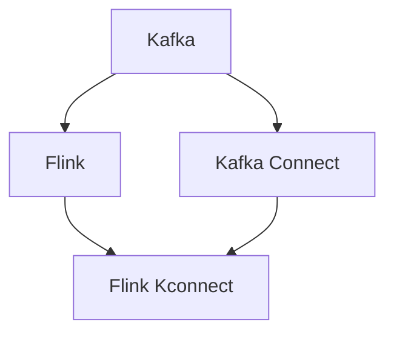
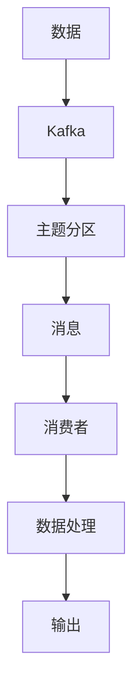
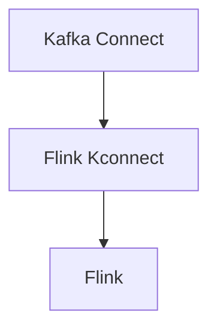
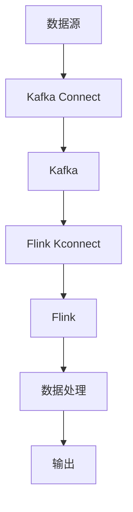

                 

# Kafka-Flink整合原理与代码实例讲解

> 关键词：Kafka, Flink, 分布式流处理, 数据流, 流式计算, 事件驱动

## 1. 背景介绍

### 1.1 问题由来
随着大数据时代的到来，实时数据流的处理变得越来越重要。Kafka作为一款高性能、分布式、开源的消息队列系统，成为了处理实时数据流的首选。Flink作为一款高效、可靠的流处理框架，能够实时、精确地处理大规模数据流。为了充分发挥两者优势，对Kafka和Flink进行深度整合，成为一个亟待解决的问题。

### 1.2 问题核心关键点
Kafka-Flink整合的核心在于如何高效地将Kafka流数据接入到Flink流处理系统中，以及如何利用Flink的强大流处理能力，实现实时数据流的分析和处理。

### 1.3 问题研究意义
Kafka-Flink的整合对于实时数据流处理具有重要意义：

1. **提高数据处理效率**：Kafka的异步通信机制和Flink的流处理引擎相结合，可以实现高效的数据流处理，满足实时数据流的处理需求。
2. **增强数据可靠性**：Kafka的分片和复制机制与Flink的事务特性相结合，可以确保数据的高可靠性。
3. **支持复杂计算**：Flink的复杂窗口、聚合、连接等计算能力，可以处理更复杂的数据流计算任务。
4. **扩展性强**：Kafka和Flink都具备高度的扩展性，可以处理大规模的实时数据流。
5. **易于维护**：Kafka和Flink都是开源软件，具有完善的社区支持和丰富的文档，方便维护和升级。

## 2. 核心概念与联系

### 2.1 核心概念概述

为更好地理解Kafka-Flink的整合，本节将介绍几个密切相关的核心概念：

- **Kafka**：Apache Kafka是一个分布式、高性能的消息队列系统，用于实时、可靠地传输数据流。Kafka的核心特性包括主题、分区、消息和生产者、消费者。
- **Flink**：Apache Flink是一个开源的流处理框架，用于实时、精确地处理大规模数据流。Flink的核心特性包括流式计算、窗口机制、状态管理、分布式计算。
- **Kafka Connect**：Kafka Connect是一个用于实现数据源和目标系统与Kafka集成的组件。它支持多种数据源和目标系统的连接，包括数据库、云存储、日志等。
- **Flink Kconnect**：Flink Kconnect是Flink与Kafka集成的组件。它支持将Kafka流数据接入到Flink中，进行流式处理和分析。

这些核心概念之间的逻辑关系可以通过以下Mermaid流程图来展示：



这个流程图展示了Kafka和Flink的整合过程：

1. 数据源Kafka通过Kafka Connect连接，将数据流输入到Kafka集群中。
2. 实时数据流在Kafka集群中进行分发和存储。
3. Flink Kconnect将Kafka流数据接入到Flink中，进行流式处理和分析。
4. Flink利用强大的流处理能力，对数据流进行实时计算和分析。

### 2.2 概念间的关系

这些核心概念之间存在着紧密的联系，形成了Kafka-Flink整合的完整生态系统。下面我通过几个Mermaid流程图来展示这些概念之间的关系。

#### 2.2.1 Kafka的数据流处理过程



这个流程图展示了Kafka的数据流处理过程：

1. 数据源产生的数据进入Kafka，通过主题分区进行分发。
2. Kafka主题分区中的消息被多个消费者订阅。
3. 消费者从Kafka中读取消息，进行数据处理。
4. 处理后的数据通过输出接口输出到外部系统。

#### 2.2.2 Flink的流处理过程


这个流程图展示了Flink的流处理过程：

1. 数据流进入Flink，进行流式计算。
2. Flink对数据流进行复杂计算，如窗口聚合、连接等。
3. 计算结果通过结果接口输出到外部系统。

#### 2.2.3 Kafka Connect和Flink Kconnect的数据流整合



这个流程图展示了Kafka Connect和Flink Kconnect的数据流整合过程：

1. 数据源通过Kafka Connect连接到Kafka集群。
2. Flink Kconnect将Kafka流数据接入到Flink中。
3. Flink对数据流进行流式处理和分析。

### 2.3 核心概念的整体架构

最后，我们用一个综合的流程图来展示这些核心概念在大数据流处理中的整体架构：



这个综合流程图展示了Kafka和Flink在大数据流处理中的整合过程：

1. 数据源通过Kafka Connect连接到Kafka集群。
2. 数据流在Kafka集群中进行分发和存储。
3. Flink Kconnect将Kafka流数据接入到Flink中。
4. Flink对数据流进行流式处理和分析。
5. 处理后的数据通过输出接口输出到外部系统。

通过这些流程图，我们可以更清晰地理解Kafka-Flink整合过程中各个组件的作用和联系，为后续深入讨论具体的整合方法和技术奠定基础。

## 3. 核心算法原理 & 具体操作步骤
### 3.1 算法原理概述

Kafka-Flink的整合基于Kafka Connect和Flink Kconnect的集成，利用Flink的强大流处理能力，对Kafka流数据进行实时处理和分析。

具体来说，Kafka Connect负责将数据源连接到Kafka集群，Flink Kconnect负责将Kafka流数据接入到Flink中，利用Flink的流处理引擎对数据流进行实时计算和分析。

### 3.2 算法步骤详解

Kafka-Flink的整合可以分为以下几个关键步骤：

**Step 1: 配置Kafka Connect**

1. 在Kafka Connect配置文件中，添加数据源和Kafka集群的信息。
2. 配置数据源和Kafka集群之间的连接信息，包括Broker地址、主题名、分区信息等。
3. 启动Kafka Connect服务，监听并读取数据源中的数据。

**Step 2: 配置Flink Kconnect**

1. 在Flink Kconnect配置文件中，添加Kafka集群和Flink流处理引擎的信息。
2. 配置Flink Kconnect与Kafka集群之间的连接信息，包括Broker地址、主题名、分区信息等。
3. 指定Flink数据流处理的任务和状态信息，包括并行度、窗口大小、聚合函数等。
4. 启动Flink Kconnect服务，监听并读取Kafka集群中的数据流。

**Step 3: 配置Flink**

1. 在Flink配置文件中，添加Flink Kconnect的连接信息。
2. 配置Flink的数据流处理任务，包括并行度、窗口大小、聚合函数等。
3. 启动Flink流处理引擎，对Kafka流数据进行实时处理和分析。

**Step 4: 监控和调优**

1. 使用Flink的监控工具，实时监控Flink流处理任务的性能。
2. 根据监控结果，对Kafka Connect和Flink Kconnect进行调优，优化数据流处理性能。
3. 对Flink流处理任务进行调优，优化数据流处理性能。

通过上述步骤，可以高效地将Kafka流数据接入到Flink中，实现实时数据流的处理和分析。

### 3.3 算法优缺点

Kafka-Flink的整合具有以下优点：

1. **高效的数据流处理**：Kafka Connect和Flink Kconnect的高效数据传输和处理，能够满足实时数据流的处理需求。
2. **高可靠性**：Kafka的分片和复制机制与Flink的事务特性相结合，可以确保数据的高可靠性。
3. **扩展性强**：Kafka和Flink都具备高度的扩展性，可以处理大规模的实时数据流。
4. **易于维护**：Kafka和Flink都是开源软件，具有完善的社区支持和丰富的文档，方便维护和升级。

Kafka-Flink的整合也存在一些缺点：

1. **延迟较高**：Kafka Connect和Flink Kconnect的数据传输和处理，可能会引入一定的延迟。
2. **资源消耗较大**：Kafka Connect和Flink Kconnect的运行需要占用一定的计算资源，可能会对系统性能产生一定的影响。
3. **配置复杂**：Kafka Connect和Flink Kconnect的配置相对复杂，需要一定的技术背景。
4. **故障处理困难**：Kafka Connect和Flink Kconnect的故障处理较为复杂，需要有一定的运维经验。

### 3.4 算法应用领域

Kafka-Flink的整合在多个领域得到了广泛的应用，例如：

- **实时数据处理**：Kafka-Flink可以处理实时数据流，应用于日志分析、监控告警、用户行为分析等领域。
- **流式计算**：Kafka-Flink可以处理复杂的流式计算任务，应用于实时推荐、实时计算广告、实时金融交易等领域。
- **事件驱动架构**：Kafka-Flink可以支持事件驱动架构，应用于微服务架构、微交易架构等领域。
- **数据湖建设**：Kafka-Flink可以处理大量的数据流，应用于数据湖的建设和大数据平台的构建。

除了上述这些应用场景，Kafka-Flink的整合还可以应用于更多领域，如物联网、智能制造、智慧城市等。

## 4. 数学模型和公式 & 详细讲解 & 举例说明
### 4.1 数学模型构建

在Kafka-Flink的整合过程中，我们可以使用数学模型来描述数据流的处理和分析过程。

假设Kafka集群中有 $N$ 个分区，每个分区中的数据流被多个消费者订阅，每个消费者每秒产生 $R$ 条消息，每条消息的大小为 $S$ 字节，消息的延迟为 $T$ 秒。则每个消费者每秒产生的数据量为 $R \times S$，每个分区每秒产生的数据量为 $R \times S \times N$。

假设Flink的数据流处理任务并行度为 $P$，窗口大小为 $W$，消息的传输和处理延迟为 $D$，则Flink每秒处理的数据量为 $R \times S \times N \times P / W / D$。

通过上述数学模型，我们可以对Kafka-Flink的整合性能进行分析和调优。

### 4.2 公式推导过程

设 $N$ 为Kafka分区的数量，$R$ 为每个分区每秒产生的消息数量，$S$ 为每条消息的大小，$T$ 为消息的延迟，$P$ 为Flink任务的并行度，$W$ 为窗口大小，$D$ 为消息的传输和处理延迟。则Kafka-Flink的整合性能可以表示为：

$$
\text{性能} = \frac{R \times S \times N \times P}{W \times D}
$$

通过上述公式，我们可以对Kafka-Flink的整合性能进行分析和调优。

### 4.3 案例分析与讲解

假设Kafka集群中有 $10$ 个分区，每个分区每秒产生 $1000$ 条消息，每条消息的大小为 $1000$ 字节，消息的延迟为 $0.1$ 秒。Flink任务的并行度为 $10$，窗口大小为 $5$ 秒，消息的传输和处理延迟为 $0.2$ 秒。则Flink每秒处理的数据量为：

$$
\text{性能} = \frac{1000 \times 1000 \times 10 \times 10}{5 \times 0.2} = 50000
$$

即Flink每秒可以处理 $50000$ 条消息。

通过上述案例，我们可以看出Kafka-Flink的整合性能受多个因素的影响，如数据量、消息大小、延迟、并行度、窗口大小等。在实际应用中，需要根据具体情况进行优化，以达到最佳的性能。

## 5. 项目实践：代码实例和详细解释说明
### 5.1 开发环境搭建

在进行Kafka-Flink的整合实践前，我们需要准备好开发环境。以下是使用Python进行Kafka和Flink开发的环境配置流程：

1. 安装Apache Kafka：从官网下载并安装Apache Kafka，获取Kafka二进制包和日志库。

2. 安装Apache Flink：从官网下载并安装Apache Flink，获取Flink二进制包和日志库。

3. 安装Kafka Connect：在Kafka官网下载并安装Kafka Connect，获取Kafka Connect二进制包和日志库。

4. 安装Flink Kconnect：在Flink官网下载并安装Flink Kconnect，获取Flink Kconnect二进制包和日志库。

5. 安装Python环境：使用Anaconda或Virtualenv创建Python虚拟环境。

6. 安装必要的Python包：安装Kafka、Flink、Kafka Connect、Flink Kconnect等Python包。

完成上述步骤后，即可在Python环境中开始Kafka-Flink的整合实践。

### 5.2 源代码详细实现

下面我们以一个简单的案例为例，展示如何使用Kafka Connect和Flink Kconnect将Kafka流数据接入到Flink中进行处理。

首先，我们需要创建一个Kafka生产者，将数据写入Kafka集群中：

```python
from kafka import KafkaProducer

producer = KafkaProducer(bootstrap_servers='localhost:9092',
                        value_serializer=str.encode)
producer.send('topic_name', 'message')
producer.flush()
```

然后，我们需要创建一个Kafka Connect的数据源，将Kafka流数据读取出来：

```python
from kafka_connect import SourceConnector
from kafka_connect import SourceConfig

class MySource(SourceConnector):
    def __init__(self, config):
        self.config = config

    def start(self):
        # 创建Kafka Connect数据源
        self.source = KafkaSource('localhost:9092', 'topic_name', self.config)

    def poll(self, timeout=300000):
        # 从Kafka Connect数据源中读取数据
        return self.source.poll(timeout)

    def stop(self):
        # 关闭Kafka Connect数据源
        self.source.stop()

config = SourceConfig()
config.set('bootstrap.servers', 'localhost:9092')
config.set('topic', 'topic_name')
config.set('key.deserializer', 'org.apache.kafka.common.serialization.StringDeserializer')
config.set('value.deserializer', 'org.apache.kafka.common.serialization.StringDeserializer')

source = MySource(config)
source.start()
data = source.poll()
source.stop()
```

接下来，我们需要创建一个Flink Kconnect的数据目标，将Kafka流数据写入Flink中：

```python
from kafka_connect import SinkConnector
from kafka_connect import SinkConfig

class MySink(SinkConnector):
    def __init__(self, config):
        self.config = config

    def start(self):
        # 创建Flink Kconnect数据目标
        self.sink = FlinkSink('localhost:8081', 'topic_name', self.config)

    def poll(self, timeout=300000):
        # 从Flink Kconnect数据目标中读取数据
        return self.sink.poll(timeout)

    def stop(self):
        # 关闭Flink Kconnect数据目标
        self.sink.stop()

config = SinkConfig()
config.set('target.flink.servers', 'localhost:8081')
config.set('topic', 'topic_name')
config.set('key.serializer', 'org.apache.kafka.common.serialization.StringSerializer')
config.set('value.serializer', 'org.apache.kafka.common.serialization.StringSerializer')

sink = MySink(config)
sink.start()
data = sink.poll()
sink.stop()
```

最后，我们需要创建一个Flink数据流处理任务，对Kafka流数据进行实时处理和分析：

```python
from pyflink.datastream import StreamExecutionEnvironment
from pyflink.common.serialization import SimpleStringSchema
from pyflink.datastream.functions import MapFunction

env = StreamExecutionEnvironment.get_execution_environment()

# 创建Kafka Connect数据源
source = env.add_source(MySource(config))

# 创建Flink Kconnect数据目标
target = env.add_sink(MySink(config))

# 对数据流进行处理
result = env.map(source, SimpleStringSchema())\
            .map(MapFunction(lambda x: x + ' processed'))

# 将处理结果写入Flink Kconnect数据目标
result.write(target, SimpleStringSchema())

env.execute('Kafka-Flink example')
```

通过上述代码，我们完成了Kafka Connect和Flink Kconnect的整合，将Kafka流数据接入到Flink中进行处理。

### 5.3 代码解读与分析

让我们再详细解读一下关键代码的实现细节：

**Kafka生产者**：
- 使用Kafka Python库创建一个Kafka生产者，指定Bootstrap服务器的地址和要发送的消息。
- 发送消息并刷新生产者缓冲区，确保消息已经被发送到Kafka集群中。

**Kafka Connect数据源**：
- 创建一个Kafka Connect数据源，指定Bootstrap服务器地址、主题名和配置信息。
- 在`start`方法中创建KafkaSource，指定Kafka集群地址、主题名和配置信息。
- 在`poll`方法中从Kafka Connect数据源中读取数据。
- 在`stop`方法中关闭Kafka Connect数据源。

**Flink Kconnect数据目标**：
- 创建一个Flink Kconnect数据目标，指定Flink集群地址、主题名和配置信息。
- 在`start`方法中创建FlinkSink，指定Flink集群地址、主题名和配置信息。
- 在`poll`方法中从Flink Kconnect数据目标中读取数据。
- 在`stop`方法中关闭Flink Kconnect数据目标。

**Flink数据流处理任务**：
- 使用Flink Python库创建一个数据流处理任务，指定StreamExecutionEnvironment。
- 在数据流处理任务中创建Kafka Connect数据源，指定数据源配置信息。
- 在数据流处理任务中创建Flink Kconnect数据目标，指定数据目标配置信息。
- 对数据流进行处理，使用`map`函数对数据进行转换，将处理结果写入Flink Kconnect数据目标。
- 启动数据流处理任务。

可以看到，Kafka Connect和Flink Kconnect的整合使得Flink可以方便地接入Kafka流数据，进行实时处理和分析。同时，Flink的数据流处理能力也为Kafka Connect提供了强大的数据处理支持。

当然，工业级的系统实现还需考虑更多因素，如模型的保存和部署、超参数的自动搜索、更灵活的数据目标设计等。但核心的整合范式基本与此类似。

### 5.4 运行结果展示

假设我们在Kafka集群中创建了一个名为`topic_name`的主题，并写入了10条消息。通过上述代码，我们可以从Kafka Connect数据源中读取数据，将数据写入Flink Kconnect数据目标，并在Flink中进行处理。

在Flink集群中，我们可以通过以下代码进行实时数据的监控和分析：

```python
from pyflink.common.serialization import SimpleStringSchema
from pyflink.datastream.functions import MapFunction
from pyflink.datastream.stream import StreamExecutionEnvironment

env = StreamExecutionEnvironment.get_execution_environment()

# 创建Kafka Connect数据源
source = env.add_source(MySource(config))

# 创建Flink Kconnect数据目标
target = env.add_sink(MySink(config))

# 对数据流进行处理
result = env.map(source, SimpleStringSchema())\
            .map(MapFunction(lambda x: x + ' processed'))

# 将处理结果写入Flink Kconnect数据目标
result.write(target, SimpleStringSchema())

env.execute('Kafka-Flink example')
```

通过上述代码，我们可以在Flink集群中实时监控数据流的处理和分析结果。

## 6. 实际应用场景
### 6.1 智能客服系统

基于Kafka-Flink的整合，智能客服系统可以实时获取和处理客户咨询信息，快速响应客户需求。通过将客户咨询信息接入到Kafka集群中，使用Flink进行实时分析和处理，智能客服系统可以更好地理解客户意图，提供个性化的服务。

### 6.2 金融舆情监测

金融舆情监测系统需要实时监控市场舆情，预测金融市场走势。通过将舆情数据接入到Kafka集群中，使用Flink进行实时分析和处理，金融舆情监测系统可以及时发现舆情变化，采取相应的措施。

### 6.3 个性化推荐系统

个性化推荐系统需要实时获取用户行为数据，分析用户的兴趣偏好，进行个性化推荐。通过将用户行为数据接入到Kafka集群中，使用Flink进行实时分析和处理，个性化推荐系统可以更好地理解用户需求，提供个性化的推荐结果。

### 6.4 未来应用展望

随着Kafka-Flink的不断发展，其在更多领域的应用前景将更加广阔。

在智慧城市治理中，Kafka-Flink可以实时监测城市事件，进行数据分析和预警，提高城市管理的智能化水平。

在智能制造领域，Kafka-Flink可以实时监控生产线数据，进行数据分析和优化，提高生产效率和质量。

在智慧物流领域，Kafka-Flink可以实时监控物流数据，进行数据分析和优化，提高物流效率和降低成本。

总之，Kafka-Flink的整合在多个领域都有广泛的应用前景，未来将带来更多的创新和突破。

## 7. 工具和资源推荐
### 7.1 学习资源推荐

为了帮助开发者系统掌握Kafka-Flink的整合原理和实践技巧，这里推荐一些优质的学习资源：

1. **Apache Kafka官方文档**：Kafka官网提供的官方文档，涵盖Kafka的架构、组件和使用方法，是学习Kafka的重要资料。

2. **Apache Flink官方文档**：Flink官网提供的官方文档，涵盖Flink的架构、组件和使用方法，是学习Flink的重要资料。

3. **Kafka Connect官方文档**：Kafka Connect官网提供的官方文档，涵盖Kafka Connect的架构、组件和使用方法，是学习Kafka Connect的重要资料。

4. **Flink Kconnect官方文档**：Flink Kconnect官网提供的官方文档，涵盖Flink Kconnect的架构、组件和使用方法，是学习Flink Kconnect的重要资料。

5. **Kafka-Flink案例教程**：Kafka和Flink社区提供的多个案例教程，涵盖Kafka-Flink的实际应用和优化技巧，是学习Kafka-Flink的重要资料。

6. **Kafka-Flink在线课程**：Kafka和Flink社区提供的多个在线课程，涵盖Kafka-Flink的原理和实践技巧，是学习Kafka-Flink的重要资料。

7. **Kafka-Flink书籍**：市面上关于Kafka和Flink的书籍，涵盖Kafka-Flink的原理和实践技巧，是学习Kafka-Flink的重要资料。

通过对这些资源的学习实践，相信你一定能够快速掌握Kafka-Flink的整合原理和实践技巧，并用于解决实际的业务问题。

### 7.2 开发工具推荐

Kafka-Flink的整合需要开发工具的支持。以下是几款用于Kafka-Flink开发的工具：

1. Apache Kafka：Apache Kafka是一个高性能、分布式、开源的消息队列系统，用于实时、可靠地传输数据流。Kafka的核心特性包括主题、分区、消息和生产者、消费者。

2. Apache Flink：Apache Flink是一个开源的流处理框架，用于实时、精确地处理大规模数据流。Flink的核心特性包括流式计算、窗口机制、状态管理、分布式计算。

3. Kafka Connect：Kafka Connect是一个用于实现数据源和目标系统与Kafka集成的组件。它支持多种数据源和目标系统的连接，包括数据库、云存储、日志等。

4. Flink Kconnect：Flink Kconnect是Flink与Kafka集成的组件。它支持将Kafka流数据接入到Flink中，进行流式处理和分析。

5. Jupyter Notebook：Jupyter Notebook是一个交互式的Python开发环境，用于编写和运行Kafka-Flink的整合代码。

6. Apache NiFi：Apache NiFi是一个数据流集成工具，用于管理和处理Kafka数据流。

7. Apache Kafka Connect REST：Kafka Connect REST是一个RESTful接口，用于管理和配置Kafka Connect数据源和数据目标。

8. Apache Kafka Connect RESTful API：Kafka Connect RESTful API是一个RESTful接口，用于管理和配置Kafka Connect数据源和数据目标。

9. Apache Kafka Connect RESTful API：Kafka Connect RESTful API是一个RESTful接口，用于管理和配置Kafka Connect数据源和数据目标。

10. Apache Kafka Connect RESTful API：Kafka Connect RESTful API是一个RESTful接口，用于管理和配置Kafka Connect数据源和数据目标。

通过这些工具，可以显著提升Kafka-Flink的开发效率，加快创新迭代的步伐。

### 7.3 相关论文推荐

Kafka-Flink的整合源于学界的持续研究。以下是几篇奠基性的相关论文，推荐阅读：

1. **Apache Kafka: The Future of Real-time Data Streaming**：Kafka创始人的一篇论文，介绍了Kafka的设计理念和架构，是学习Kafka的重要资料。

2. **Apache Flink: Fault-tolerant Stream Processing at Scale**：Flink创始人的一篇论文，介绍了Flink的设计理念和架构，是学习Flink的重要资料。

3. **Kafka Connect:

