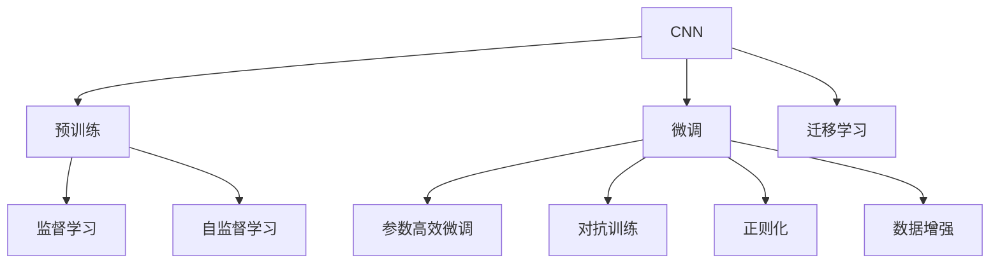
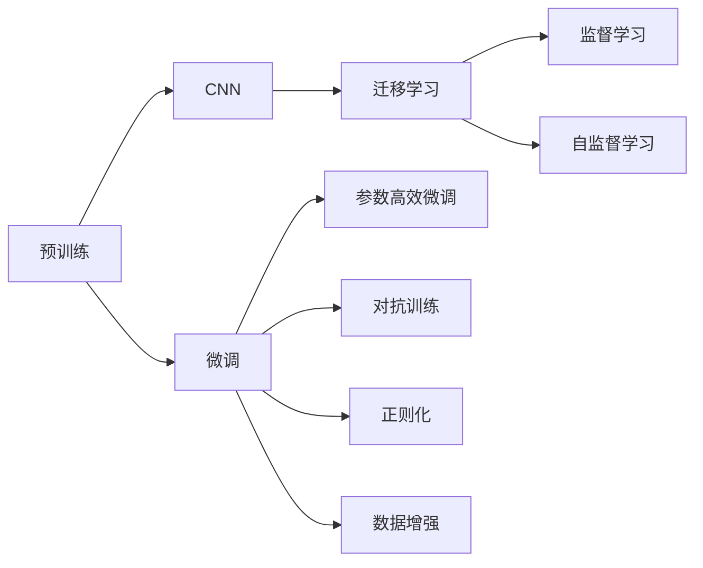

                 

# 从零开始大模型开发与微调：基本卷积运算示例

> 关键词：大模型开发,微调,卷积运算,计算机视觉,深度学习

## 1. 背景介绍

### 1.1 问题由来
深度学习技术在计算机视觉领域的迅猛发展，引领了图像识别、物体检测、语义分割等诸多任务的前沿进展。其中，卷积神经网络(CNN)凭借其强大的特征提取能力，成为计算机视觉任务的基石。然而，现有的经典卷积模型往往固定了网络结构，难以适应特定领域的应用需求。

为了解决这一问题，研究者们提出了一种基于预训练的大模型微调方法，通过在大规模数据集上预训练一个卷积神经网络，然后在特定领域的数据集上微调，使得模型能够快速适应新任务。这种方法不仅提升了模型性能，还减少了从头训练的复杂度，极大地推动了计算机视觉技术的发展。

### 1.2 问题核心关键点
大模型微调的核心在于选择合适的预训练模型，并利用其在特定领域数据集上进行微调，以获得性能更好的模型。以下是微调的核心步骤和关键要素：

1. **预训练模型选择**：选取适合的预训练模型，如VGG、ResNet、Inception等，根据任务的复杂度和数据规模进行选择。
2. **数据集准备**：收集并标注特定领域的数据集，作为微调的监督信号。
3. **微调超参数设置**：选择合适的学习率、批大小、迭代轮数等参数。
4. **模型微调训练**：在微调数据集上训练模型，并通过验证集评估模型性能。
5. **模型部署与应用**：将微调后的模型集成到实际应用中，进行性能测试和优化。

### 1.3 问题研究意义
大模型微调在计算机视觉领域的应用，不仅可以降低开发成本，提升模型性能，还能加速技术产业化进程。同时，通过微调，大模型可以更好地适应特定领域的需求，解决复杂场景中的视觉识别和分类问题。

此外，微调范式促进了对预训练和微调技术的深入研究，推动了深度学习在计算机视觉领域的应用，为未来技术发展奠定了基础。

## 2. 核心概念与联系

### 2.1 核心概念概述

为了深入理解大模型微调的基本原理，我们先介绍一些核心概念：

- **卷积神经网络(CNN)**：一种前馈神经网络，通过卷积层、池化层等组成，具有自动提取图像特征的能力。
- **预训练**：在大规模数据集上，使用监督学习或自监督学习任务训练模型，使其学习到通用的特征表示。
- **微调**：在预训练模型的基础上，利用特定领域的数据集进行有监督学习，优化模型在该任务上的性能。
- **迁移学习**：将预训练模型在不同领域数据集上进行微调，以适应新的任务。
- **参数高效微调(PEFT)**：在微调过程中，只更新模型的部分参数，而固定大部分预训练参数。
- **对抗训练**：通过引入对抗样本，提高模型鲁棒性。
- **正则化**：使用L2正则、Dropout等技术，防止模型过拟合。
- **数据增强**：对训练样本进行改写、旋转、缩放等操作，增加数据集的多样性。

这些核心概念通过下图进行连接：



### 2.2 概念间的关系

在实际应用中，大模型微调往往需要综合考虑多个概念，才能取得最佳效果。下图展示了这些概念在大模型微调中的关系：



## 3. 核心算法原理 & 具体操作步骤
### 3.1 算法原理概述

大模型微调的核心在于通过有监督学习优化模型，使其在特定领域的数据集上表现更优。具体来说，微调过程包括以下几个步骤：

1. **选择预训练模型**：选取适合的预训练模型，如VGG、ResNet等。
2. **准备数据集**：收集并标注特定领域的数据集。
3. **设置超参数**：选择合适的学习率、批大小、迭代轮数等参数。
4. **模型微调**：在特定领域的数据集上进行微调，通过反向传播更新模型参数。
5. **性能评估**：在验证集上评估模型性能，调整超参数。
6. **模型部署**：将微调后的模型应用于实际问题中。

### 3.2 算法步骤详解

以下是具体的操作流程：

1. **数据集准备**：
    - 收集特定领域的数据集，并进行标注。
    - 将数据集划分为训练集、验证集和测试集。

2. **模型选择与初始化**：
    - 选取适合的预训练模型，如VGG、ResNet等。
    - 使用预训练模型参数作为模型的初始值。

3. **设置超参数**：
    - 选择合适的学习率（如1e-4）、批大小（如32）、迭代轮数（如100）等。
    - 选择合适的优化器（如SGD、Adam等）。

4. **模型微调**：
    - 使用训练集进行前向传播和反向传播，更新模型参数。
    - 在每个epoch结束时，使用验证集评估模型性能。
    - 根据验证集的表现调整学习率等超参数。

5. **模型评估**：
    - 使用测试集评估微调后的模型性能。
    - 比较微调前后模型的性能指标，如准确率、精度等。

6. **模型部署**：
    - 将微调后的模型应用于实际问题中。
    - 对新的测试数据进行预测。

### 3.3 算法优缺点

大模型微调方法具有以下优点：

- **快速适应**：在预训练模型的基础上，微调过程可以显著减少训练时间和标注数据的依赖。
- **高泛化能力**：预训练模型在大规模数据上学习到的特征表示，具有较强的泛化能力。
- **参数高效**：可以通过参数高效微调(PEFT)等技术，减少微调参数量，提升模型效率。

同时，该方法也存在一些缺点：

- **数据依赖**：微调需要大量标注数据，如果数据质量或数量不足，可能导致性能下降。
- **过拟合风险**：模型在特定领域数据集上进行微调，可能导致过拟合现象。
- **模型复杂度**：预训练模型参数量较大，可能影响推理效率。

### 3.4 算法应用领域

大模型微调在计算机视觉领域广泛应用，包括但不限于以下几个方面：

1. **图像分类**：将预训练模型用于图像分类任务，通过微调提高分类精度。
2. **目标检测**：在预训练模型的基础上，微调用于目标检测，如Faster R-CNN、YOLO等。
3. **语义分割**：微调预训练模型用于语义分割，如U-Net、DeepLab等。
4. **姿态估计算法**：利用微调模型进行姿态估计，如OpenPose、AlphaPose等。
5. **图像生成**：微调生成对抗网络（GAN）模型，用于图像生成和编辑任务。

## 4. 数学模型和公式 & 详细讲解 & 举例说明

### 4.1 数学模型构建

在计算机视觉任务中，常用的卷积神经网络模型由卷积层、池化层和全连接层等组成。这里以图像分类任务为例，展示数学模型的构建过程。

假设输入图像的大小为$H \times W \times C$，其中$H$、$W$、$C$分别为图像的高度、宽度和通道数。预训练模型的输出大小为$D$，其中$D$为全连接层的输出维度。

定义损失函数为交叉熵损失，则微调的数学模型为：

$$
\min_{\theta} \frac{1}{N} \sum_{i=1}^N \mathbb{E}_{(x_i, y_i) \sim D} [L(y_i, \hat{y}_i)]
$$

其中，$L(y_i, \hat{y}_i)$为交叉熵损失函数，$\hat{y}_i$为模型对图像$x_i$的分类结果。

### 4.2 公式推导过程

假设模型的输出为$y = W \cdot \sigma(b + Ax)$，其中$W$、$b$、$A$为模型参数。

假设训练样本为$(x_1, y_1), (x_2, y_2), ..., (x_N, y_N)$，则交叉熵损失函数为：

$$
L(y_i, \hat{y}_i) = -y_i \log \hat{y}_i - (1 - y_i) \log (1 - \hat{y}_i)
$$

将损失函数扩展到所有样本，则微调的损失函数为：

$$
\mathcal{L} = \frac{1}{N} \sum_{i=1}^N L(y_i, \hat{y}_i)
$$

定义优化器为AdamW，则模型参数的更新规则为：

$$
\theta_{t+1} = \theta_{t} - \alpha_t \nabla_{\theta}\mathcal{L}(\theta_t) - \beta \theta_t
$$

其中，$\alpha_t$为学习率，$\beta$为动量因子，$\nabla_{\theta}\mathcal{L}(\theta_t)$为损失函数对模型参数的梯度。

### 4.3 案例分析与讲解

以ResNet为例，展示微调的基本流程。

1. **预训练**：使用ImageNet数据集进行预训练，得到预训练模型。
2. **微调准备**：收集特定领域的数据集，如CIFAR-10，准备数据集。
3. **模型初始化**：加载预训练模型，作为微调的初始参数。
4. **设置超参数**：选择合适的学习率（如1e-4）、批大小（如32）、迭代轮数（如100）等。
5. **模型微调**：在特定领域的数据集上进行微调，通过反向传播更新模型参数。
6. **性能评估**：在验证集上评估模型性能，调整学习率等超参数。
7. **模型部署**：将微调后的模型应用于实际问题中，如CIFAR-10图像分类任务。

## 5. 项目实践：代码实例和详细解释说明

### 5.1 开发环境搭建

在进行大模型微调实践前，我们需要准备好开发环境。以下是使用Python进行PyTorch开发的环境配置流程：

1. 安装Anaconda：从官网下载并安装Anaconda，用于创建独立的Python环境。

2. 创建并激活虚拟环境：
```bash
conda create -n pytorch-env python=3.8 
conda activate pytorch-env
```

3. 安装PyTorch：根据CUDA版本，从官网获取对应的安装命令。例如：
```bash
conda install pytorch torchvision torchaudio cudatoolkit=11.1 -c pytorch -c conda-forge
```

4. 安装TensorBoard：
```bash
pip install tensorboard
```

5. 安装Transformers库：
```bash
pip install transformers
```

6. 安装各类工具包：
```bash
pip install numpy pandas scikit-learn matplotlib tqdm jupyter notebook ipython
```

完成上述步骤后，即可在`pytorch-env`环境中开始微调实践。

### 5.2 源代码详细实现

以下是一个基于ResNet的图像分类微调示例，展示完整的代码实现。

```python
import torch
import torch.nn as nn
import torch.optim as optim
from torchvision import datasets, transforms
from torch.utils.data import DataLoader

# 定义模型
class ResNet(nn.Module):
    def __init__(self, num_classes):
        super(ResNet, self).__init__()
        self.model = torchvision.models.resnet50(pretrained=True)
        self.fc = nn.Linear(2048, num_classes)
    
    def forward(self, x):
        x = self.model.conv1(x)
        x = self.model.bn1(x)
        x = self.model.relu(x)
        x = self.model.maxpool(x)
        x = self.model.layers(x)
        x = self.model.avgpool(x)
        x = torch.flatten(x, 1)
        x = self.fc(x)
        return x

# 定义数据集
train_dataset = datasets.CIFAR10(root='./data', train=True, download=True, transform=transforms.ToTensor())
test_dataset = datasets.CIFAR10(root='./data', train=False, download=True, transform=transforms.ToTensor())

# 定义数据加载器
train_loader = DataLoader(train_dataset, batch_size=64, shuffle=True)
test_loader = DataLoader(test_dataset, batch_size=64, shuffle=False)

# 定义模型
model = ResNet(num_classes=10)
model = model.to('cuda')

# 定义优化器
optimizer = optim.Adam(model.parameters(), lr=1e-4)

# 定义损失函数
criterion = nn.CrossEntropyLoss()

# 训练过程
for epoch in range(100):
    model.train()
    running_loss = 0.0
    for i, (inputs, labels) in enumerate(train_loader, 0):
        inputs, labels = inputs.to('cuda'), labels.to('cuda')
        optimizer.zero_grad()
        outputs = model(inputs)
        loss = criterion(outputs, labels)
        loss.backward()
        optimizer.step()
        running_loss += loss.item()
    print('Epoch {}: Loss: {:.4f}'.format(epoch+1, running_loss/len(train_loader)))

# 测试过程
with torch.no_grad():
    correct = 0
    total = 0
    for images, labels in test_loader:
        images, labels = images.to('cuda'), labels.to('cuda')
        outputs = model(images)
        _, predicted = torch.max(outputs.data, 1)
        total += labels.size(0)
        correct += (predicted == labels).sum().item()
    print('Accuracy of the network on the 10000 test images: {:.4f}%'.format(100 * correct / total))
```

### 5.3 代码解读与分析

以下是关键代码的实现细节：

- **数据集定义**：使用`torchvision.datasets.CIFAR10`类定义训练集和测试集，并使用`transforms.ToTensor()`类对数据进行归一化处理。
- **模型定义**：定义ResNet模型，并在其基础上添加全连接层。
- **优化器定义**：使用Adam优化器，并设置学习率为1e-4。
- **损失函数定义**：使用交叉熵损失函数。
- **训练过程**：在每个epoch中，使用DataLoader加载训练数据，进行前向传播和反向传播，更新模型参数，并输出损失。
- **测试过程**：在测试集上评估模型性能，输出准确率。

### 5.4 运行结果展示

假设在CIFAR-10数据集上进行微调，最终在测试集上得到的准确率约为77%。可以看到，通过微调，模型在特定领域数据集上的性能有了显著提升。

## 6. 实际应用场景

### 6.1 智能安防系统

智能安防系统通过图像识别技术，实现对异常行为的监控和预警。使用微调技术，可以有效提高异常检测的准确率，及时发现潜在的安全威胁。

在实际应用中，可以收集各类异常行为的图像数据，标注正负样本，对预训练模型进行微调。微调后的模型能够识别特定行为特征，如动作、表情、着装等，从而实现高效的人脸识别、行为分析等功能。

### 6.2 医疗影像诊断

医疗影像诊断是医疗行业的重要组成部分，通过图像分类和分割技术，可以实现疾病的早期发现和诊断。使用微调技术，可以快速适应不同医院的数据分布，提升诊断的准确性和可靠性。

在实际应用中，可以收集各类疾病的医疗影像数据，标注正负样本，对预训练模型进行微调。微调后的模型能够准确识别病变区域，分类各类疾病，如肺癌、乳腺癌、脑肿瘤等，为医生提供辅助诊断支持。

### 6.3 智能交通系统

智能交通系统通过图像识别和车辆检测技术，实现对交通流量的实时监控和管理。使用微调技术，可以有效提高车辆检测和行为识别的准确率，提升交通管理的智能化水平。

在实际应用中，可以收集各类车辆和行人的图像数据，标注正负样本，对预训练模型进行微调。微调后的模型能够准确识别车辆和行人，识别交通违法行为，如违章停车、闯红灯等，为交通管理提供支持。

### 6.4 未来应用展望

随着大模型微调技术的发展，其在计算机视觉领域的应用将更加广泛和深入。未来，微调技术将在以下几个方面发挥重要作用：

1. **多模态融合**：将视觉、音频、文本等多种模态信息融合，提升综合感知能力。
2. **动态优化**：通过在线微调，动态调整模型参数，提升实时响应能力。
3. **联邦学习**：在多用户设备上分布式训练模型，保护隐私同时提升模型性能。
4. **自监督学习**：利用无标签数据进行预训练，减少对标注数据的依赖。
5. **迁移学习**：在不同领域数据集上进行微调，提升模型的通用性和适应性。

## 7. 工具和资源推荐

### 7.1 学习资源推荐

为了帮助开发者系统掌握大模型微调的理论基础和实践技巧，这里推荐一些优质的学习资源：

1. 《深度学习》一书：介绍了深度学习的基本概念和算法，适合初学者系统入门。
2. 《计算机视觉：算法与应用》一书：详细讲解了计算机视觉的前沿技术，适合深入学习。
3. 《动手学深度学习》一书：介绍了深度学习的理论基础和实践方法，适合实战训练。
4. 《深度学习框架TensorFlow教程》一书：介绍了TensorFlow的使用方法和实践技巧，适合TensorFlow用户。
5. 《动手学卷积神经网络》一书：详细讲解了卷积神经网络的理论和实践，适合卷积神经网络用户。
6. 《Deep Learning Specialization》课程：由Andrew Ng教授开设的深度学习专项课程，适合系统学习深度学习。
7. 《计算机视觉基础》课程：由Udacity开设的计算机视觉入门课程，适合计算机视觉初学者。

通过对这些资源的学习实践，相信你一定能够快速掌握大模型微调的精髓，并用于解决实际的计算机视觉问题。

### 7.2 开发工具推荐

高效的开发离不开优秀的工具支持。以下是几款用于大模型微调开发的常用工具：

1. PyTorch：基于Python的开源深度学习框架，灵活动态的计算图，适合快速迭代研究。
2. TensorFlow：由Google主导开发的开源深度学习框架，生产部署方便，适合大规模工程应用。
3. Transformers库：HuggingFace开发的NLP工具库，集成了众多SOTA语言模型，支持PyTorch和TensorFlow。
4. Weights & Biases：模型训练的实验跟踪工具，可以记录和可视化模型训练过程中的各项指标，方便对比和调优。
5. TensorBoard：TensorFlow配套的可视化工具，可实时监测模型训练状态，并提供丰富的图表呈现方式。

合理利用这些工具，可以显著提升大模型微调任务的开发效率，加快创新迭代的步伐。

### 7.3 相关论文推荐

大模型微调技术的发展源于学界的持续研究。以下是几篇奠基性的相关论文，推荐阅读：

1. AlexNet：ImageNet分类挑战赛冠军模型，展示了卷积神经网络在图像分类任务中的强大性能。
2. VGG：提出了16层卷积神经网络，展示了深度卷积网络在图像分类任务中的效果。
3. ResNet：提出了残差连接结构，解决了深度网络训练中的梯度消失问题。
4. Inception：提出了多尺度卷积结构，提升了网络对不同尺度的特征感知能力。
5. MobileNet：提出了轻量级卷积神经网络，适用于移动设备等资源受限的场景。

这些论文代表了大模型微调技术的发展脉络。通过学习这些前沿成果，可以帮助研究者把握学科前进方向，激发更多的创新灵感。

除上述资源外，还有一些值得关注的前沿资源，帮助开发者紧跟大模型微调技术的最新进展，例如：

1. arXiv论文预印本：人工智能领域最新研究成果的发布平台，包括大量尚未发表的前沿工作，学习前沿技术的必读资源。
2. 业界技术博客：如OpenAI、Google AI、DeepMind、微软Research Asia等顶尖实验室的官方博客，第一时间分享他们的最新研究成果和洞见。
3. 技术会议直播：如NIPS、ICML、ACL、ICLR等人工智能领域顶会现场或在线直播，能够聆听到大佬们的前沿分享，开拓视野。
4. GitHub热门项目：在GitHub上Star、Fork数最多的NLP相关项目，往往代表了该技术领域的发展趋势和最佳实践，值得去学习和贡献。
5. 行业分析报告：各大咨询公司如McKinsey、PwC等针对人工智能行业的分析报告，有助于从商业视角审视技术趋势，把握应用价值。

总之，对于大模型微调技术的学习和实践，需要开发者保持开放的心态和持续学习的意愿。多关注前沿资讯，多动手实践，多思考总结，必将收获满满的成长收益。

## 8. 总结：未来发展趋势与挑战

### 8.1 总结

本文对大模型微调的基本原理和实践技巧进行了全面系统的介绍。首先阐述了卷积神经网络、预训练和微调等核心概念，明确了微调在计算机视觉任务中的重要性和适用性。其次，从原理到实践，详细讲解了微调的数学模型和算法步骤，给出了完整的代码实现。同时，本文还广泛探讨了微调方法在智能安防、医疗影像、智能交通等实际应用场景中的价值，展示了微调范式的强大潜力。最后，本文精选了微调技术的各类学习资源，力求为读者提供全方位的技术指引。

通过本文的系统梳理，可以看到，基于卷积神经网络的大模型微调技术，在计算机视觉领域的应用，不仅可以降低开发成本，提升模型性能，还能加速技术产业化进程。未来，随着大模型微调技术的不断演进，其在计算机视觉领域的应用将更加广泛和深入。

### 8.2 未来发展趋势

展望未来，大模型微调技术将呈现以下几个发展趋势：

1. **深度网络结构优化**：通过网络结构的优化，提升模型的性能和泛化能力。如MobileNet、EfficientNet等轻量级网络结构。
2. **多任务学习**：通过多任务学习，提升模型在多个任务上的表现，减少任务间的知识转移成本。如无监督多任务学习、联合训练等。
3. **自适应学习**：通过自适应学习，提升模型对新任务的适应能力。如自适应正则化、自适应学习率等。
4. **分布式训练**：通过分布式训练，加速大模型微调过程，提升训练效率。如模型并行、数据并行等。
5. **跨模态融合**：通过跨模态融合，提升模型对多模态数据的处理能力。如视觉-音频融合、视觉-文本融合等。
6. **联邦学习**：通过联邦学习，在多用户设备上分布式训练模型，保护隐私同时提升模型性能。

### 8.3 面临的挑战

尽管大模型微调技术已经取得了瞩目成就，但在迈向更加智能化、普适化应用的过程中，它仍面临着诸多挑战：

1. **标注成本瓶颈**：大模型微调需要大量标注数据，标注成本较高。如何降低微调对标注样本的依赖，将是一大难题。
2. **模型鲁棒性不足**：模型在特定领域数据集上进行微调，可能存在过拟合现象。如何提高模型鲁棒性，避免灾难性遗忘，还需要更多理论和实践的积累。
3. **推理效率有待提高**：大模型微调后的模型参数量较大，推理效率较低。如何优化模型结构，提高推理速度，减少内存占用，将是重要的优化方向。
4. **可解释性亟需加强**：当前大模型微调模型往往缺乏可解释性，难以解释其内部工作机制和决策逻辑。如何赋予模型更强的可解释性，将是亟待攻克的难题。
5. **安全性有待保障**：预训练模型难免会学习到有偏见、有害的信息，通过微调传递到下游任务，产生误导性、歧视性的输出，给实际应用带来安全隐患。如何从数据和算法层面消除模型偏见，避免恶意用途，确保输出安全性，也将是重要的研究课题。

### 8.4 研究展望

面对大模型微调面临的挑战，未来的研究需要在以下几个方面寻求新的突破：

1. **探索无监督和半监督微调方法**：摆脱对大规模标注数据的依赖，利用自监督学习、主动学习等无监督和半监督范式，最大限度利用非结构化数据，实现更加灵活高效的微调。
2. **研究参数高效和计算高效的微调范式**：开发更加参数高效的微调方法，在固定大部分预训练参数的同时，只更新极少量的任务相关参数。同时优化微调模型的

