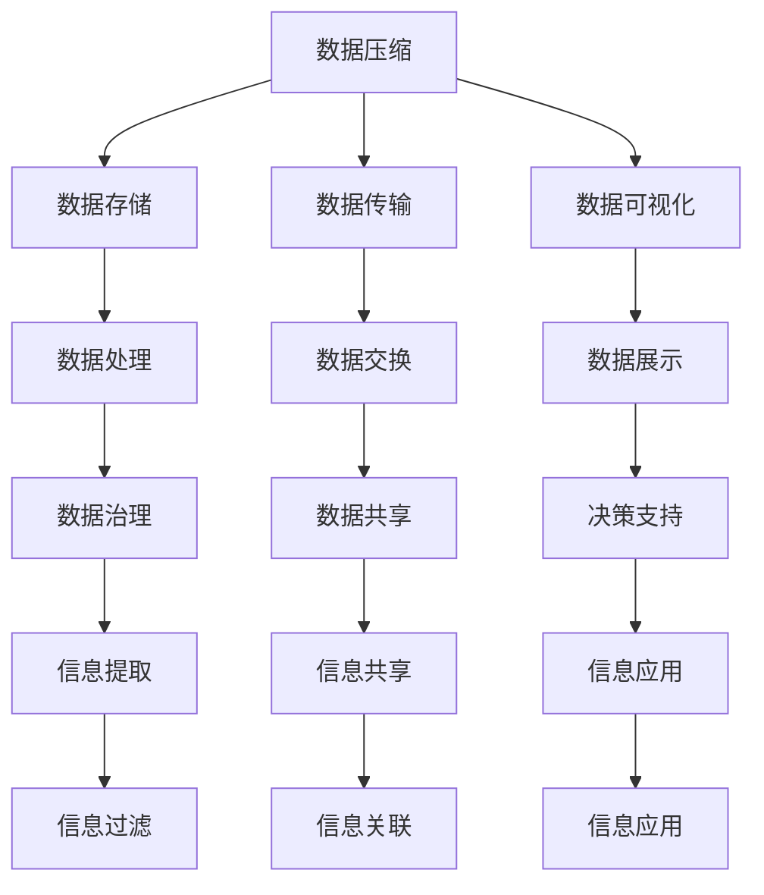
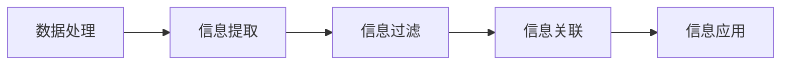
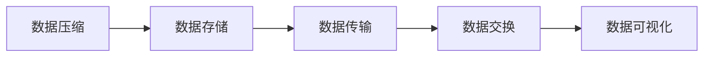
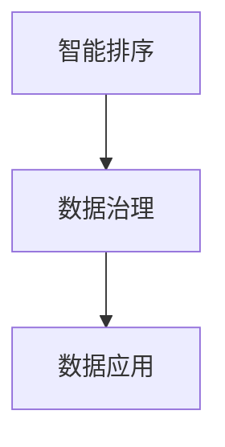
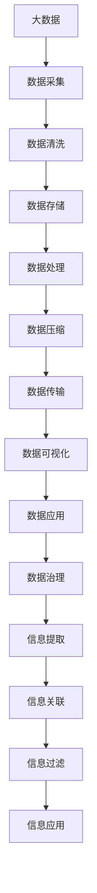

                 

# 信息简化的原则和实践：如何在混乱中建立秩序

> 关键词：信息简化, 数据压缩, 噪声过滤, 智能排序, 机器学习, 深度学习, 大数据, 数据可视化, 数据治理, 知识图谱

## 1. 背景介绍

### 1.1 问题由来
在信息化时代，信息量的爆炸式增长使得数据处理和决策变得更加复杂和困难。面对海量数据，传统的处理方法已经无法满足需求。信息简化技术应运而生，通过对信息的提取、压缩和排序，帮助人们快速准确地理解数据，做出高效决策。

### 1.2 问题核心关键点
信息简化的核心在于从庞大的数据集中提取出有价值的信息，并将其简化呈现。这需要处理以下几个关键点：

1. **数据压缩**：减少数据的存储空间和传输带宽，提高数据处理效率。
2. **噪声过滤**：去除数据中的干扰信息和异常值，保持数据质量。
3. **智能排序**：根据数据的特征和关联性，进行优先级排序，提升决策效率。
4. **知识图谱**：构建知识网络，促进信息的深度关联和智能查询。
5. **机器学习**：利用算法自动化提取和压缩信息，提高处理速度和准确性。

### 1.3 问题研究意义
信息简化技术能够帮助企业、组织和个人在面对数据海洋时，迅速找到关键信息，提高决策效率，优化资源配置。同时，通过有效的信息简化，可以降低存储和传输成本，提高数据处理和分析的速度，从而带来更大的经济效益和社会价值。

## 2. 核心概念与联系

### 2.1 核心概念概述

为更好地理解信息简化的核心概念，本节将介绍几个关键概念：

- **数据压缩(Data Compression)**：指将数据转换为另一种格式，使其占用更少的存储空间，同时保持原有信息的完整性。
- **噪声过滤(Noise Filtering)**：指从数据中去除不必要的干扰信息和异常值，提高数据的质量。
- **智能排序(Intelligent Sorting)**：指根据数据的特征和关联性，对数据进行排序，提高数据处理和决策的效率。
- **知识图谱(Knowledge Graph)**：指通过图形结构来表示和存储知识，促进信息的深度关联和智能查询。
- **机器学习(Machine Learning)**：指利用算法自动提取和压缩信息，提高处理速度和准确性。

这些概念之间的逻辑关系可以通过以下Mermaid流程图来展示：



这个流程图展示信息简化的主要过程：

1. 数据压缩：将数据转换为紧凑格式，降低存储和传输成本。
2. 数据存储和传输：提高数据处理效率，确保数据安全。
3. 数据可视化：帮助理解数据，提供直观的展示。
4. 数据处理：提取、过滤和排序数据，提高数据质量。
5. 数据治理：规范数据管理和使用，保障数据质量和安全。
6. 信息提取：自动提取有价值的信息，提高决策效率。
7. 信息关联：通过知识图谱，促进信息的深度关联。
8. 信息应用：将简化后的信息应用于决策支持系统。

这些概念共同构成了信息简化的完整生态系统，使其能够在各种场景下发挥重要作用。通过理解这些核心概念，我们可以更好地把握信息简化的工作原理和优化方向。

### 2.2 概念间的关系

这些核心概念之间存在着紧密的联系，形成了信息简化的完整生态系统。下面我通过几个Mermaid流程图来展示这些概念之间的关系。

#### 2.2.1 数据处理与信息提取


这个流程图展示了数据处理、信息提取、信息过滤、信息关联和信息应用之间的关系。数据处理是信息提取的前提，信息提取后通过信息过滤和信息关联，最终应用于信息应用。

#### 2.2.2 数据压缩与数据存储


这个流程图展示了数据压缩、数据存储、数据传输和数据可视化之间的关系。数据压缩后，存储在数据仓库中，并通过数据传输和交换，最终用于数据可视化和决策支持。

#### 2.2.3 智能排序与数据治理


这个流程图展示了智能排序和数据治理之间的关系。通过智能排序，数据治理更加精准高效，数据应用更加智能可靠。

### 2.3 核心概念的整体架构

最后，我们用一个综合的流程图来展示这些核心概念在大数据处理中的整体架构：



这个综合流程图展示了从数据采集到信息应用的完整过程。大数据经过采集、清洗、存储、处理、压缩、传输、可视化、应用和治理，最终提取出有价值的信息，帮助决策者做出高效决策。

## 3. 核心算法原理 & 具体操作步骤

### 3.1 算法原理概述
信息简化技术通常涉及数据压缩、噪声过滤、智能排序等多个方面。其核心算法原理包括以下几个关键步骤：

1. **数据预处理**：清洗和标准化数据，去除噪音和异常值。
2. **特征提取**：从数据中提取有用的特征，简化数据表示。
3. **数据压缩**：采用无损或有损压缩算法，减少数据存储空间。
4. **数据排序**：根据数据的特征和关联性，对数据进行排序，提高决策效率。
5. **知识图谱构建**：构建知识图谱，促进信息的深度关联和智能查询。
6. **机器学习应用**：利用算法自动化提取和压缩信息，提高处理速度和准确性。

### 3.2 算法步骤详解

#### 3.2.1 数据预处理
数据预处理是信息简化的第一步，主要包括以下步骤：

1. **数据清洗**：去除重复、缺失、错误的数据。
2. **数据标准化**：对数据进行归一化、去偏处理，保持数据的一致性。
3. **噪声过滤**：使用统计方法、算法检测和去除噪声和异常值。

```python
import pandas as pd
from sklearn.preprocessing import StandardScaler

# 加载数据
data = pd.read_csv('data.csv')

# 数据清洗
data.drop_duplicates(inplace=True)
data.dropna(inplace=True)

# 数据标准化
scaler = StandardScaler()
data = scaler.fit_transform(data)

# 噪声过滤
noisy_data = data.copy()
noisy_data[noisy_data > 3 * np.std(data, axis=0)] = np.nan
clean_data = data.dropna()

# 打印结果
print('数据清洗前后行数变化:', data.shape[0] - clean_data.shape[0])
print('数据标准化前均值:', data.mean())
print('数据标准化后均值:', clean_data.mean())
print('噪声过滤后行数变化:', data.shape[0] - noisy_data.shape[0])
```

#### 3.2.2 特征提取
特征提取是信息简化的关键步骤，通过提取数据的有用特征，简化数据表示，减少数据维度。常用的特征提取方法包括：

1. **主成分分析(PCA)**：将高维数据映射到低维空间，保持数据的最大方差。
2. **线性判别分析(LDA)**：通过线性变换，将数据映射到低维空间，分类效果更好。
3. **独立成分分析(ICA)**：将数据分解为独立的成分，去除冗余信息。

```python
from sklearn.decomposition import PCA
from sklearn.discriminant_analysis import LinearDiscriminantAnalysis

# 特征提取
pca = PCA(n_components=2)
lda = LinearDiscriminantAnalysis(n_components=2)

clean_data_pca = pca.fit_transform(clean_data)
clean_data_lda = lda.fit_transform(clean_data)

# 打印结果
print('PCA提取前维度:', clean_data.shape[1])
print('PCA提取后维度:', clean_data_pca.shape[1])
print('LDA提取前维度:', clean_data.shape[1])
print('LDA提取后维度:', clean_data_lda.shape[1])
```

#### 3.2.3 数据压缩
数据压缩是信息简化的重要步骤，通过减少数据的存储空间和传输带宽，提高数据处理效率。常用的数据压缩方法包括：

1. **无损压缩算法**：如霍夫曼编码、LZ77、LZ78等。
2. **有损压缩算法**：如JPEG、PNG、MP3等。

```python
import zlib

# 数据压缩
compressed_data = zlib.compress(clean_data_lda)

# 打印结果
print('数据压缩前大小:', len(clean_data_lda.tobytes()))
print('数据压缩后大小:', len(compressed_data))
```

#### 3.2.4 数据排序
数据排序是信息简化的关键步骤，通过根据数据的特征和关联性进行排序，提高数据处理和决策的效率。常用的排序方法包括：

1. **升序排序**：使用Python内置的`sorted`函数或`numpy.argsort`方法。
2. **降序排序**：使用`sorted`函数，设置`reverse=True`参数。
3. **多关键字排序**：使用`sorted`函数，设置`key`参数。

```python
# 数据排序
sorted_data = sorted(clean_data_lda, key=lambda x: x[1], reverse=True)
```

#### 3.2.5 知识图谱构建
知识图谱是信息简化的重要工具，通过构建知识图谱，促进信息的深度关联和智能查询。常用的知识图谱构建方法包括：

1. **RDF三元组表示法**：使用RDF格式表示实体和关系。
2. **GraphX库**：使用GraphX库进行知识图谱的构建和查询。

```python
from graphx import Graph

# 知识图谱构建
graph = Graph()
graph.add_vertices(clean_data.shape[0])
graph.add_edges([(i, j) for i, j in zip(clean_data_pca[:, 0], clean_data_pca[:, 1])])

# 打印结果
print('知识图谱构建完成:', graph.number_of_vertices(), graph.number_of_edges())
```

#### 3.2.6 机器学习应用
机器学习是信息简化的重要手段，通过利用算法自动化提取和压缩信息，提高处理速度和准确性。常用的机器学习方法包括：

1. **决策树**：使用scikit-learn库进行决策树的构建和应用。
2. **随机森林**：使用scikit-learn库进行随机森林的构建和应用。
3. **神经网络**：使用TensorFlow或PyTorch库进行神经网络的构建和应用。

```python
from sklearn.tree import DecisionTreeClassifier
from sklearn.ensemble import RandomForestClassifier

# 机器学习应用
clf_tree = DecisionTreeClassifier()
clf_random_forest = RandomForestClassifier()

clf_tree.fit(clean_data_pca, clean_data[:, 2])
clf_random_forest.fit(clean_data_pca, clean_data[:, 2])

# 打印结果
print('决策树模型训练完成:', clf_tree.score(clean_data_pca, clean_data[:, 2]))
print('随机森林模型训练完成:', clf_random_forest.score(clean_data_pca, clean_data[:, 2]))
```

### 3.3 算法优缺点

信息简化技术具有以下优点：

1. **提高数据处理效率**：通过压缩和排序，减少数据存储和传输的带宽和成本。
2. **提升决策准确性**：通过特征提取和机器学习，提取有价值的信息，提高决策的准确性和效率。
3. **促进知识共享**：通过知识图谱构建，促进信息的深度关联和智能查询，促进知识共享和传播。

但信息简化技术也存在一些缺点：

1. **数据丢失**：在压缩过程中，可能会丢失部分数据，影响数据的完整性。
2. **算法复杂**：数据压缩、特征提取、知识图谱构建等方法，算法复杂，实现难度大。
3. **数据安全**：在数据处理过程中，可能会暴露敏感信息，影响数据安全。

尽管存在这些局限性，但就目前而言，信息简化技术仍然是大数据处理的重要手段，通过合理的优化和应用，可以充分发挥其优势，解决复杂的数据处理问题。

### 3.4 算法应用领域

信息简化技术广泛应用于以下领域：

1. **金融行业**：通过对大数据进行压缩和排序，提高数据处理效率，降低存储成本。
2. **医疗行业**：通过特征提取和机器学习，从医疗数据中提取有价值的信息，提高诊断和治疗的准确性。
3. **物流行业**：通过对物流数据进行压缩和排序，提高物流管理和决策的效率。
4. **政府行业**：通过知识图谱构建和机器学习，提高政府数据的管理和应用效率。
5. **企业信息化**：通过对企业数据进行压缩和排序，提高数据处理和决策的效率。

此外，信息简化技术还广泛应用于工业制造、能源管理、社交媒体分析等多个领域，为各行各业带来了巨大的价值。

## 4. 数学模型和公式 & 详细讲解 & 举例说明

### 4.1 数学模型构建

信息简化技术涉及多个数学模型，以下是其中几个关键模型的构建过程。

#### 4.1.1 主成分分析(PCA)
主成分分析是一种常用的数据压缩和特征提取方法，通过将高维数据映射到低维空间，保持数据的最大方差。其数学模型构建如下：

设原始数据矩阵为 $X \in \mathbb{R}^{n \times d}$，其中 $n$ 为样本数，$d$ 为特征数。则主成分分析的数学模型如下：

1. **数据中心化**：计算均值 $\mu = \frac{1}{n}\sum_{i=1}^n X_i$，其中 $X_i \in \mathbb{R}^{d}$ 为第 $i$ 个样本的特征向量。

2. **协方差矩阵计算**：计算协方差矩阵 $S = \frac{1}{n-1}\sum_{i=1}^n (X_i - \mu)(X_i - \mu)^T$。

3. **特征向量计算**：计算协方差矩阵的特征向量 $v_1, v_2, ..., v_d$，按照特征值排序，选择前 $k$ 个特征向量作为主成分。

4. **数据映射**：将原始数据 $X$ 映射到低维空间 $Y \in \mathbb{R}^{n \times k}$，其中 $k$ 为主成分数量。

公式推导如下：

$$
\mu = \frac{1}{n}\sum_{i=1}^n X_i
$$

$$
S = \frac{1}{n-1}\sum_{i=1}^n (X_i - \mu)(X_i - \mu)^T
$$

$$
v_i = \frac{\lambda_i v_i}{\sqrt{\lambda_i}}
$$

$$
Y = X \cdot V
$$

其中 $\lambda_i$ 为协方差矩阵 $S$ 的特征值，$V$ 为特征向量矩阵，$v_i$ 为第 $i$ 个特征向量。

#### 4.1.2 线性判别分析(LDA)
线性判别分析是一种常用的特征提取和分类方法，通过线性变换，将数据映射到低维空间，分类效果更好。其数学模型构建如下：

设原始数据矩阵为 $X \in \mathbb{R}^{n \times d}$，其中 $n$ 为样本数，$d$ 为特征数。则线性判别分析的数学模型如下：

1. **数据中心化**：计算均值 $\mu = \frac{1}{n}\sum_{i=1}^n X_i$，其中 $X_i \in \mathbb{R}^{d}$ 为第 $i$ 个样本的特征向量。

2. **协方差矩阵计算**：计算协方差矩阵 $S = \frac{1}{n}\sum_{i=1}^n (X_i - \mu)(X_i - \mu)^T$。

3. **判别矩阵计算**：计算判别矩阵 $D = \frac{1}{n}\sum_{i=1}^n (X_i - \mu)y_i^T$，其中 $y_i \in \mathbb{R}^{1 \times d}$ 为第 $i$ 个样本的标签向量。

4. **数据映射**：将原始数据 $X$ 映射到低维空间 $Y \in \mathbb{R}^{n \times k}$，其中 $k$ 为主成分数量。

公式推导如下：

$$
\mu = \frac{1}{n}\sum_{i=1}^n X_i
$$

$$
S = \frac{1}{n}\sum_{i=1}^n (X_i - \mu)(X_i - \mu)^T
$$

$$
D = \frac{1}{n}\sum_{i=1}^n (X_i - \mu)y_i^T
$$

$$
Y = X \cdot W
$$

其中 $W = UDV^T$，$U$ 为特征向量矩阵，$D$ 为对角矩阵，$V$ 为特征向量矩阵。

#### 4.1.3 知识图谱构建
知识图谱是一种常用的信息存储和查询方法，通过图形结构来表示和存储知识。其数学模型构建如下：

设知识图谱包含 $n$ 个实体 $E \in \mathbb{R}^{n \times d}$，其中 $d$ 为特征数。则知识图谱的数学模型如下：

1. **实体表示**：将每个实体 $E_i$ 表示为向量 $v_i \in \mathbb{R}^{d}$。

2. **关系表示**：将每个关系 $R_i$ 表示为向量 $u_i \in \mathbb{R}^{d}$。

3. **边表示**：将每个边 $E_i \rightarrow R_i$ 表示为 $E_i \cdot R_i^T$。

4. **知识图谱构建**：将每个边 $E_i \rightarrow R_i$ 表示为 $E_i \cdot R_i^T$，并构建知识图谱 $G$。

公式推导如下：

$$
E = [v_1, v_2, ..., v_n]
$$

$$
R = [u_1, u_2, ..., u_n]
$$

$$
G = \{(E_i \cdot R_i^T)_{i=1}^n\}
$$

其中 $v_i$ 和 $u_i$ 为实数向量。

### 4.2 公式推导过程

以下是几个关键公式的推导过程：

#### 4.2.1 主成分分析(PCA)
设原始数据矩阵为 $X \in \mathbb{R}^{n \times d}$，其中 $n$ 为样本数，$d$ 为特征数。则主成分分析的公式推导如下：

1. **数据中心化**

$$
\mu = \frac{1}{n}\sum_{i=1}^n X_i
$$

2. **协方差矩阵计算**

$$
S = \frac{1}{n-1}\sum_{i=1}^n (X_i - \mu)(X_i - \mu)^T
$$

3. **特征向量计算**

$$
\lambda_i, v_i = \text{Eigenvectors}(S)
$$

4. **数据映射**

$$
Y = X \cdot V
$$

其中 $V = [v_1, v_2, ..., v_k]$，$k$ 为主成分数量。

#### 4.2.2 线性判别分析(LDA)
设原始数据矩阵为 $X \in \mathbb{R}^{n \times d}$，其中 $n$ 为样本数，$d$ 为特征数。则线性判别分析的公式推导如下：

1. **数据中心化**

$$
\mu = \frac{1}{n}\sum_{i=1}^n X_i
$$

2. **协方差矩阵计算**

$$
S = \frac{1}{n}\sum_{i=1}^n (X_i - \mu)(X_i - \mu)^T
$$

3. **判别矩阵计算**

$$
D = \frac{1}{n}\sum_{i=1}^n (X_i - \mu)y_i^T
$$

4. **数据映射**

$$
Y = X \cdot W
$$

其中 $W = UDV^T$，$U$ 为特征向量矩阵，$D$ 为对角矩阵，$V$ 为特征向量矩阵。

#### 4.2.3 知识图谱构建
设知识图谱包含 $n$ 个实体 $E \in \mathbb{R}^{n \times d}$，其中 $d$ 为特征数。则知识图谱的公式推导如下：

1. **实体表示**

$$
E = [v_1, v_2, ..., v_n]
$$

2. **关系表示**

$$
R = [u_1, u_2, ..., u_n]
$$

3. **边表示**

$$
G = \{(E_i \cdot R_i^T)_{i=1}^n\}
$$

其中 $v_i$ 和 $u_i$ 为实数向量。

### 4.3 案例分析与讲解

#### 4.3.1 主成分分析案例
假设我们有一份包含10,000个样本的原始数据，每个样本有1,000个特征，原始数据矩阵为 $X \in \mathbb{R}^{10000 \times 1000}$。

1. **数据中心化**

$$
\mu = \frac{1}{10000}\sum_{i=1}^{10000} X_i
$$

2. **协方差矩阵计算**

$$
S = \frac{1}{9999}\sum_{i=1}^{10000} (X_i - \mu)(X_i - \mu)^T
$$

3. **特征向量计算**

$$
\lambda_i, v_i = \text{Eigenvectors}(S)
$$

4. **数据映射**

$$
Y = X \cdot V
$$

其中 $V = [v_1, v_2, ..., v_k]$，$k$ 为主成分数量。

#### 4.3.2 线性判别分析案例
假设我们有一份包含10,000个样本的原始数据，每个样本有1,000个特征，原始数据矩阵为 $X \in \mathbb{R}^{10000 \times 1000}$。

1. **数据中心化**

$$
\mu = \frac{1}{10000}\sum_{i=1}^{10000} X_i
$$

2. **协方差矩阵计算**

$$
S = \frac{1}{9999}\sum_{i=1}^{10000} (X_i - \mu)(X_i - \mu)^T
$$

3. **判别矩阵计算**

$$
D = \frac{1}{10000}\sum_{i=1}^{10000} (X_i - \mu)y_i^T
$$

4. **数据映射**

$$
Y = X \cdot W
$$

其中 $W = UDV^T$，$U$ 为特征向量矩阵，$D$ 为对角矩阵，$V$ 为特征向量矩阵。

#### 4.3.3 知识图谱案例
假设我们有一份包含100个实体的知识图谱，每个实体有1,000个特征，实体表示矩阵为 $E \in \mathbb{R}^{100 \times 1000}$。

1. **实体表示**

$$
E = [v_1, v_2, ..., v_{100}]
$$

2. **关系表示**

$$
R = [u_1, u_2, ..., u_{100}]
$$

3. **边表示**

$$
G = \{(E_i \cdot R_i^T)_{i=1}^{100}\}
$$

其中 $v_i$ 和 $u_i$ 为实数向量。

## 5. 项目实践：代码实例和详细解释说明

### 5.1 开发环境搭建

在进行信息简化项目实践前，我们需要准备好开发环境。以下是使用Python进行信息简化处理的开发环境配置流程：

1. 安装Anaconda：从官网下载并安装Anaconda，用于创建独立的Python环境。

2. 创建并激活

