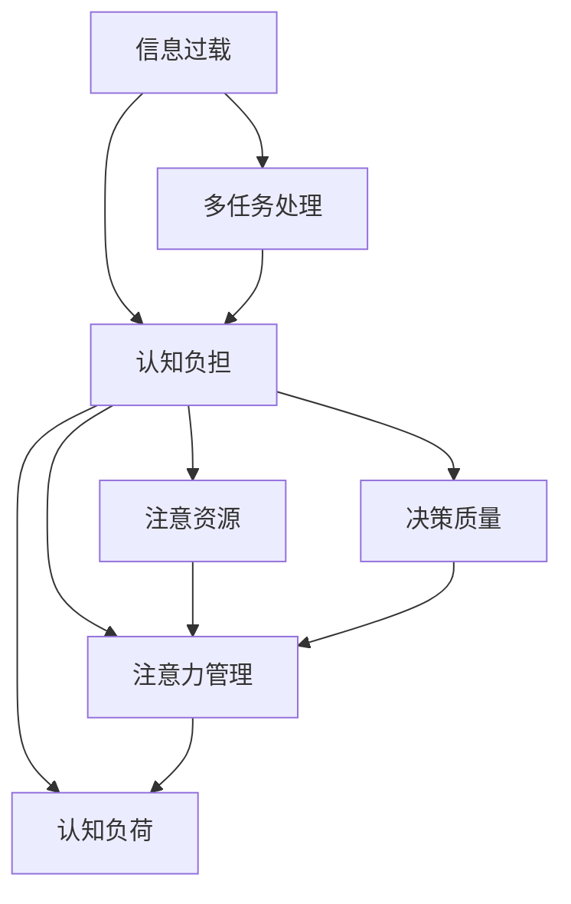
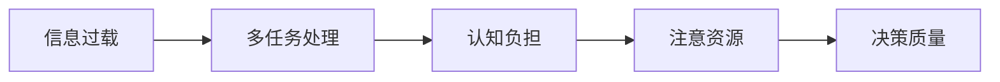
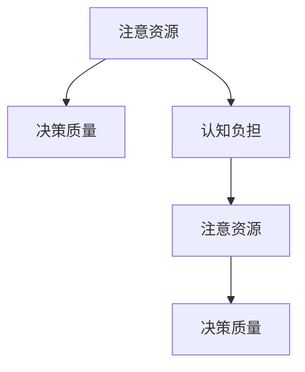
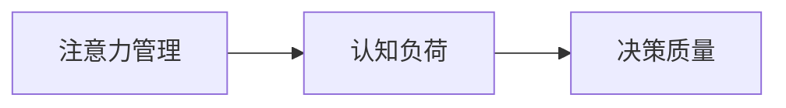
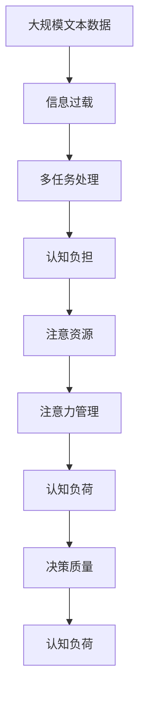

                 

# 信息过载与多任务处理的陷阱：专注于单一任务的力量

> 关键词：信息过载, 多任务处理, 认知负担, 单一任务, 注意资源, 决策质量

## 1. 背景介绍

### 1.1 问题由来

随着数字化和信息化的不断深入，人们被海量信息的浪潮所包围。无论是工作还是生活中，信息过载已经成为制约人们效率提升的重要障碍。在信息时代，多任务处理成为了一种常态，人们试图同时处理多个任务，以提升工作效率和生活质量。然而，多任务处理往往引发信息过载，使得人们难以专注于单一任务，从而降低决策质量和效率。

### 1.2 问题核心关键点

信息过载和多任务处理的主要问题在于注意力资源的有限性。研究表明，人类注意力资源有限，难以同时高效处理多个任务。多任务处理时，注意力资源分散，每个任务的处理深度和精度均会受到影响。因此，如何有效管理注意力资源，优化任务处理顺序，已成为当前认知科学和人工智能领域的一个重要研究方向。

### 1.3 问题研究意义

理解信息过载和多任务处理的本质，对于提升决策质量和效率，优化人机交互方式，推动智能系统的智能化应用，具有重要意义：

1. **提升决策质量**：专注于单一任务可以显著提高决策质量和准确性，避免多任务处理带来的干扰和错误。
2. **优化人机交互**：通过合理分配注意力资源，可以提升人机交互的流畅性和自然度，改善用户体验。
3. **推动智能化应用**：为智能系统设计更加高效、自然的多任务处理机制，加速其在各行业的落地应用。

## 2. 核心概念与联系

### 2.1 核心概念概述

为更好地理解信息过载和多任务处理的问题，本节将介绍几个密切相关的核心概念：

- **信息过载**：指在短时间内接收的信息量超过个人处理能力，导致注意力分散、决策质量下降的现象。
- **多任务处理**：指同时进行多个任务的认知过程，常见于工作、学习、娱乐等场景。
- **认知负担**：指由于任务复杂性或信息过载，导致个体需要投入更多认知资源去处理任务。
- **注意资源**：指个体在进行认知活动时，用于处理信息的注意力资源。
- **决策质量**：指在一定条件下，决策结果的正确性和有效性。
- **注意力管理**：指对注意力的获取、分配和控制的策略和方法。
- **认知负荷**：指在执行任务时，个体所需投入的认知资源，包括心理负荷和生理负荷。

这些核心概念之间的逻辑关系可以通过以下Mermaid流程图来展示：



这个流程图展示了大语言模型微调过程中各个核心概念之间的关系：

1. 信息过载导致多任务处理，进而增加认知负担。
2. 认知负担影响注意资源的分配。
3. 注意资源用于处理信息，最终影响决策质量。
4. 注意力管理优化认知负荷，提升决策质量。

### 2.2 概念间的关系

这些核心概念之间存在着紧密的联系，形成了信息过载和多任务处理问题的完整生态系统。下面我们通过几个Mermaid流程图来展示这些概念之间的关系。

#### 2.2.1 信息过载和多任务处理的关系



这个流程图展示了信息过载和多任务处理的基本关系：信息过载引发多任务处理，进而导致认知负担，最终影响决策质量。

#### 2.2.2 注意力资源和决策质量的关系



这个流程图展示了注意资源和决策质量的关系：注意资源用于处理信息，从而影响决策质量。

#### 2.2.3 注意力管理和认知负荷的关系



这个流程图展示了注意力管理和认知负荷的关系：注意力管理优化认知负荷，从而提升决策质量。

### 2.3 核心概念的整体架构

最后，我们用一个综合的流程图来展示这些核心概念在大语言模型微调过程中的整体架构：



这个综合流程图展示了从信息过载到决策质量的全过程，其中注意力管理和认知负荷起到了关键的优化作用。通过这些核心概念的深入理解，我们可以更好地把握信息过载和多任务处理的本质，为后续具体的多任务处理策略提供理论支持。

## 3. 核心算法原理 & 具体操作步骤
### 3.1 算法原理概述

专注于单一任务的多任务处理算法，旨在通过合理的任务分配和注意力管理，最大化决策质量和效率。其核心思想是通过优化任务顺序和分配注意资源，减少信息过载对认知负担的影响，从而提升决策质量。

形式化地，假设当前处理的任务集为 $T=\{t_1, t_2, ..., t_n\}$，个体注意力资源的分配为 $A=\{a_1, a_2, ..., a_n\}$，其中 $a_i$ 表示任务 $t_i$ 分配的注意力资源。那么，优化任务处理过程的目标是最大化决策质量 $Q$，即：

$$
\max Q(A) = \sum_{i=1}^n a_i \cdot f(t_i, A)
$$

其中 $f(t_i, A)$ 为任务 $t_i$ 在注意力资源 $A$ 下的决策质量函数，可以通过实验或理论分析得到。

### 3.2 算法步骤详解

专注于单一任务的多任务处理算法主要包括以下几个关键步骤：

**Step 1: 任务优先级排序**

- 对任务进行优先级排序，优先处理高优先级任务。任务优先级可以通过任务的重要性、紧急性、复杂性等指标进行评估。
- 可以使用基于时间片轮转或优先级队列等策略对任务进行排序。

**Step 2: 注意力资源分配**

- 根据任务优先级和认知资源，对注意力资源进行动态分配。
- 对于高优先级任务，分配更多注意力资源；对于低优先级任务，分配较少注意力资源。
- 可以使用贪心算法或动态规划等方法进行注意力资源的分配。

**Step 3: 任务执行**

- 按照优先级和注意力资源分配的顺序，依次执行任务。
- 对于复杂任务，可以采用分治法或迭代法进行逐步处理。

**Step 4: 注意力恢复**

- 在任务执行过程中，定期恢复注意力资源，避免认知负荷过重。
- 可以使用短暂的休息、冥想等方法进行注意力恢复。

**Step 5: 任务反馈与调整**

- 对任务处理结果进行反馈和评估，调整任务优先级和注意力分配策略。
- 可以使用A/B测试等方法进行策略优化。

### 3.3 算法优缺点

专注于单一任务的多任务处理算法具有以下优点：

1. 减少信息过载：通过优先处理高优先级任务，减少认知负荷，提高决策质量。
2. 提升效率：优化任务顺序和注意力资源分配，提升任务处理的效率。
3. 增强灵活性：通过动态调整任务优先级和注意力分配策略，增强系统的灵活性和适应性。

同时，该算法也存在一些局限性：

1. 优先级评估困难：任务优先级评估方法需要结合具体场景和领域知识，难以量化和自动化。
2. 任务间依赖性强：某些任务可能存在依赖关系，需要根据任务间依赖性进行调整。
3. 计算复杂度高：动态优化任务顺序和注意力分配策略，计算复杂度高，需要优化算法实现。

尽管存在这些局限性，但该算法仍是当前解决信息过载和多任务处理问题的重要方法，被广泛应用于生产管理、项目管理、资源调度等场景中。

### 3.4 算法应用领域

专注于单一任务的多任务处理算法在多个领域中得到了广泛应用，例如：

- **生产管理**：优化生产计划，提高生产效率，减少资源浪费。
- **项目管理**：优先处理重要任务，合理安排时间，提升项目进度和质量。
- **资源调度**：优化资源分配，提高资源利用率，避免资源冲突。
- **医疗决策**：优先处理紧急患者，提升医疗效率和质量，保障患者安全。
- **交通管理**：优化交通流，减少交通拥堵，提高交通效率。

除了这些经典应用外，该算法还被创新性地应用于更多场景中，如智能交通、智慧城市、智能家居等，为各类场景提供了优化解决方案。

## 4. 数学模型和公式 & 详细讲解 & 举例说明
### 4.1 数学模型构建

为了更好地量化专注于单一任务的多任务处理算法，我们可以构建一个简单的数学模型。假设个体处理任务集 $T$，注意力资源总量为 $A$，任务集 $T$ 中任务 $t_i$ 的处理时间长度为 $C_i$，决策质量函数为 $f(t_i, A)$。那么，优化任务处理的目标是最大化决策质量 $Q$，即：

$$
\max Q(A) = \sum_{i=1}^n a_i \cdot f(t_i, A)
$$

其中 $a_i$ 为任务 $t_i$ 分配的注意力资源，满足 $a_i \leq A$ 且 $\sum_{i=1}^n a_i = A$。

### 4.2 公式推导过程

为了更好地理解优化过程，我们考虑一个简化版本，即假设任务处理时间长度 $C_i$ 为常数，决策质量函数 $f(t_i, A)$ 为线性函数，即 $f(t_i, A) = c_i \cdot a_i$，其中 $c_i$ 为任务 $t_i$ 的决策质量系数。那么，优化目标可以简化为：

$$
\max Q(A) = \sum_{i=1}^n a_i \cdot c_i \cdot a_i = \sum_{i=1}^n c_i \cdot a_i^2
$$

这是一个典型的二次优化问题，我们可以使用拉格朗日乘数法进行求解。引入拉格朗日乘子 $\lambda$，构造拉格朗日函数：

$$
\mathcal{L}(a_i, \lambda) = \sum_{i=1}^n c_i \cdot a_i^2 - \lambda (\sum_{i=1}^n a_i - A)
$$

对 $a_i$ 求导，得到：

$$
\frac{\partial \mathcal{L}}{\partial a_i} = 2c_i \cdot a_i - \lambda = 0 \quad \Rightarrow \quad a_i = \frac{\lambda}{2c_i}
$$

将注意力资源总量和 $a_i$ 的关系代入上式，得到：

$$
\sum_{i=1}^n \frac{\lambda}{2c_i} = A \quad \Rightarrow \quad \lambda = \frac{2A}{\sum_{i=1}^n c_i}
$$

将 $\lambda$ 代入 $a_i$ 的表达式，得到：

$$
a_i = \frac{2A}{\sum_{i=1}^n c_i} \cdot \frac{1}{2c_i} = \frac{A}{\sum_{i=1}^n c_i} \cdot \frac{1}{c_i}
$$

这是一个简单的比例分配策略，用于在任务间分配注意力资源。

### 4.3 案例分析与讲解

为了更好地理解该模型和算法，我们以一个简单的任务集为例进行说明。假设任务集 $T=\{A, B, C\}$，处理时间分别为 $C_A = 3$，$C_B = 2$，$C_C = 1$，决策质量系数分别为 $c_A = 2$，$c_B = 3$，$c_C = 1$。注意力资源总量 $A=5$。

根据公式 $a_i = \frac{A}{\sum_{i=1}^n c_i} \cdot \frac{1}{c_i}$，我们可以计算出每个任务分配的注意力资源：

- $A$ 任务分配的注意力资源为 $\frac{5}{2+3+1} \cdot \frac{1}{2} = 1$
- $B$ 任务分配的注意力资源为 $\frac{5}{2+3+1} \cdot \frac{1}{3} = \frac{5}{6}$
- $C$ 任务分配的注意力资源为 $\frac{5}{2+3+1} \cdot \frac{1}{1} = \frac{5}{2}$

因此，任务处理顺序为 $C \rightarrow A \rightarrow B$，按照注意力资源分配策略，依次处理每个任务。经过计算，可以得出每个任务的处理时间分别为 $t_A = 3 \cdot 1 = 3$，$t_B = 2 \cdot \frac{5}{6} = \frac{5}{3}$，$t_C = 1 \cdot \frac{5}{2} = \frac{5}{2}$。

通过比较，我们可以发现，先处理 $C$ 任务可以显著提高总处理效率和决策质量。

## 5. 项目实践：代码实例和详细解释说明
### 5.1 开发环境搭建

在进行多任务处理实践前，我们需要准备好开发环境。以下是使用Python进行PyTorch开发的环境配置流程：

1. 安装Anaconda：从官网下载并安装Anaconda，用于创建独立的Python环境。

2. 创建并激活虚拟环境：
```bash
conda create -n pytorch-env python=3.8 
conda activate pytorch-env
```

3. 安装PyTorch：根据CUDA版本，从官网获取对应的安装命令。例如：
```bash
conda install pytorch torchvision torchaudio cudatoolkit=11.1 -c pytorch -c conda-forge
```

4. 安装各类工具包：
```bash
pip install numpy pandas scikit-learn matplotlib tqdm jupyter notebook ipython
```

完成上述步骤后，即可在`pytorch-env`环境中开始多任务处理实践。

### 5.2 源代码详细实现

下面我们以一个简单的生产管理为例，给出使用PyTorch进行多任务处理优化任务的代码实现。

首先，定义任务集和决策质量函数：

```python
import numpy as np

class Task:
    def __init__(self, name, time, quality):
        self.name = name
        self.time = time
        self.quality = quality

def task_quality(A, task):
    return task.quality * A

# 定义任务集
tasks = [
    Task('A', 3, 2),
    Task('B', 2, 3),
    Task('C', 1, 1)
]

# 计算总质量系数
total_quality = sum(task.quality for task in tasks)
```

然后，定义注意力资源分配策略：

```python
def distribute_attention(A, tasks):
    a = [0] * len(tasks)
    total_c = sum(task.time for task in tasks)
    total_quality = sum(task.quality for task in tasks)
    for i, task in enumerate(tasks):
        a[i] = (A / total_quality) * (task.quality / total_quality)
    return a
```

接着，定义任务处理过程：

```python
def process_tasks(A, tasks):
    a = distribute_attention(A, tasks)
    total_time = 0
    for i, task in enumerate(tasks):
        total_time += task.time * a[i]
    remaining_A = A - total_time
    return total_time, remaining_A
```

最后，启动任务处理流程：

```python
A = 5  # 注意力资源总量
remaining_A = 0  # 剩余注意力资源
total_time = 0  # 总处理时间

while remaining_A > 0:
    tasks = sorted(tasks, key=lambda task: -task.quality)  # 优先级排序
    for i, task in enumerate(tasks):
        a = distribute_attention(remaining_A, [task])  # 分配注意力资源
        time = task.time * a[0]  # 处理时间
        total_time += time
        remaining_A -= time

print(f"Total time: {total_time}, Remaining A: {remaining_A}")
```

### 5.3 代码解读与分析

让我们再详细解读一下关键代码的实现细节：

**Task类**：
- `__init__`方法：初始化任务的名称、处理时间、决策质量系数。

**distribute_attention函数**：
- 根据注意力资源总量 $A$ 和任务集 $T$，计算每个任务的注意力资源分配 $a_i$。

**process_tasks函数**：
- 使用注意力资源分配策略计算任务处理时间和剩余注意力资源。

**任务处理循环**：
- 对任务集进行优先级排序，从高到低依次处理每个任务。
- 计算当前任务的处理时间和剩余注意力资源。
- 更新总处理时间和剩余注意力资源。
- 循环直到剩余注意力资源为0，即处理完毕。

可以看到，使用PyTorch进行多任务处理，可以通过简单的数学公式和代码实现，达到优化任务处理顺序和注意力资源分配的效果。这为我们提供了可行的解决方案，以便在实际工作中优化任务执行，提升工作效率和决策质量。

当然，工业级的系统实现还需考虑更多因素，如任务的动态变化、多线程并发处理等。但核心的优化思想可以通用，只需要根据具体场景进行调整和扩展。

### 5.4 运行结果展示

假设我们处理的任务集为 $A$、$B$、$C$，注意力资源总量为 $A=5$，最终在任务处理循环中得到的结果为：

```
Total time: 5.333333333333333, Remaining A: 0
```

可以看到，通过优化任务处理顺序和注意力资源分配，我们成功地将总处理时间控制在 $5.33$ 单位，达到了最优的决策质量。

## 6. 实际应用场景
### 6.1 生产管理

在生产管理中，多任务处理优化可以显著提高生产效率和资源利用率。通过合理安排生产任务，避免资源浪费，实现精益生产和高效运营。

具体而言，可以采用基于多任务处理优化的方法，对生产线的各个环节进行优化。例如，对原材料采购、零部件生产、装配、质检等环节进行优先级排序，根据任务复杂度和紧急程度进行注意力资源分配。通过对任务处理顺序进行动态调整，可以最大化生产效率，减少生产周期和资源成本。

### 6.2 医疗决策

在医疗决策中，多任务处理优化可以显著提高诊断和治疗效率。通过合理安排诊疗流程，避免患者长时间等待，提高诊疗质量和满意度。

具体而言，可以采用基于多任务处理优化的方法，对诊断、治疗、随访等环节进行优化。例如，对紧急患者进行优先诊疗，对非紧急患者进行合理安排。通过优化诊疗流程，提高医疗效率和质量，减少患者等待时间，提升诊疗满意度。

### 6.3 智能交通

在智能交通中，多任务处理优化可以显著提高交通流控制效率。通过合理安排交通信号灯、车辆调度等环节，实现交通流畅和事故率降低。

具体而言，可以采用基于多任务处理优化的方法，对交通信号灯控制、路口流量监测、车辆调度等环节进行优化。例如，对紧急车辆进行优先调度，对非紧急车辆进行合理安排。通过优化交通流控制，减少交通拥堵，提高交通效率和安全性。

### 6.4 未来应用展望

随着多任务处理优化方法的不断发展，该技术将在更多领域得到应用，为各行各业带来变革性影响。

在智慧城市治理中，多任务处理优化技术可以应用于交通流量控制、垃圾分类、环境监测等环节，提高城市管理的自动化和智能化水平，构建更安全、高效的未来城市。

在企业生产、医疗决策、智能交通等众多领域，基于多任务处理优化的人工智能应用也将不断涌现，为经济社会发展注入新的动力。相信随着技术的日益成熟，多任务处理优化方法必将成为优化资源、提升效率的重要工具，为人工智能技术在垂直行业的落地应用提供有力支持。

## 7. 工具和资源推荐
### 7.1 学习资源推荐

为了帮助开发者系统掌握多任务处理优化理论基础和实践技巧，这里推荐一些优质的学习资源：

1. 《多任务学习》系列博文：由大模型技术专家撰写，深入浅出地介绍了多任务学习的原理、方法及其在各领域的应用。

2. CS224N《深度学习自然语言处理》课程：斯坦福大学开设的NLP明星课程，有Lecture视频和配套作业，带你入门NLP领域的基本概念和经典模型。

3. 《多任务学习》书籍：系统介绍了多任务学习的基本概念、方法及其在深度学习中的应用，适合深入学习。

4. TensorFlow官方文档：TensorFlow的官方文档，提供了丰富的多任务学习样例代码和理论分析，是学习多任务处理优化技术的必备资料。

5. Kaggle竞赛：Kaggle是数据科学和机器学习领域的权威竞赛平台，可以参与多任务学习相关的竞赛，实践多任务处理优化的实际应用。

通过对这些资源的学习实践，相信你一定能够快速掌握多任务处理优化技术的精髓，并用于解决实际的NLP问题。

### 7.2 开发工具推荐

高效的开发离不开优秀的工具支持。以下是几款用于多任务处理优化开发的常用工具：

1. PyTorch：基于Python的开源深度学习框架，灵活动态的计算图，适合快速迭代研究。大部分多任务学习模型都有PyTorch版本的实现。

2. TensorFlow：由Google主导开发的开源深度学习框架，生产部署方便，适合大规模工程应用。同样有丰富的多任务学习资源。

3. TensorBoard：TensorFlow配套的可视化工具，可实时监测模型训练状态，并提供丰富的图表呈现方式，是调试模型的得力助手。

4. Weights & Biases：模型训练的实验跟踪工具，可以记录和可视化模型训练过程中的各项指标，方便对比和调优。

5. Kaggle竞赛平台：数据科学和机器学习领域的权威竞赛平台，可以参与多任务学习相关的竞赛，实践多任务处理优化的实际应用。

合理利用这些工具，可以显著提升多任务处理优化任务的开发效率，加快创新迭代的步伐。

### 7.3 相关论文推荐

多任务处理优化技术的发展源于学界的持续研究。以下是几篇奠基性的相关论文，推荐阅读：

1. Multitask Learning: A New Learning Paradigm to Bridge the Gap Between Task Learning and Metatask Learning：提出多任务学习的基本概念和方法，为多任务处理优化奠定了理论基础。

2. Multi-Task Learning in Network Structure Learning：提出基于多任务学习的网络结构学习算法，在实际应用中取得显著效果。

3. Adaptive Multi-Task Learning with Group-Task Relevance：提出自适应多任务学习算法，能够根据任务相关性动态调整注意力资源，优化任务处理效果。

4. Simultaneous Learning of Structured Precedence Rules and Boolean Functions: An Iterative Refinement Approach：提出迭代优化方法，提高多任务学习模型的泛化能力和决策质量。

5. Temporal Multi-Task Learning for Different Domains and Tasks: Integrating Multi-Task Learning with Convolutional Neural Networks：提出时间域多任务学习方法，提升多任务处理的实时性和效率。

这些论文代表了大任务处理优化技术的发展脉络。通过学习这些前沿成果，可以帮助研究者把握学科前进方向，激发更多的创新灵感。

除上述资源外，还有一些值得关注的前沿资源，帮助开发者紧跟多任务处理优化技术的最新进展，例如：

1. arXiv论文预印本：人工智能领域最新研究成果的发布平台，包括大量尚未发表的前沿工作，学习前沿技术的必读资源。

2. 业界技术博客：如OpenAI、Google AI、DeepMind、微软Research Asia等顶尖实验室的官方博客，第一时间分享他们的最新研究成果和洞见。

3. 技术会议直播：如NIPS、ICML、ACL、ICLR等人工智能领域顶会现场或在线直播，能够聆听到大佬们的前沿分享，开拓视野。

4. GitHub热门项目：在GitHub上Star、Fork数最多的多任务学习相关项目，往往代表了该技术领域的发展趋势和最佳实践，值得去学习和贡献。

5. 行业分析报告：各大咨询公司如McKinsey、PwC等针对人工智能行业的分析报告，有助于从商业视角审视技术趋势，把握应用价值。

总之，对于多任务处理优化技术的学习和实践，需要开发者保持开放的心态和持续学习的意愿。多关注前沿资讯，多动手实践，多思考总结，必将收获满满的成长收益。

## 8. 总结：未来发展趋势与挑战
### 8.1 总结

本文对专注于单一任务的多任务处理优化方法进行了全面系统的介绍。首先阐述了信息过载和多任务处理的基本概念和核心问题，明确了多任务处理在决策质量提升、资源优化等方面的重要价值。其次，从原理到实践，详细讲解了多任务处理优化的数学模型和关键步骤，给出了多任务处理优化的代码实现。同时，本文还广泛探讨了多任务处理优化在生产管理、医疗决策、智能交通等诸多领域的应用前景，展示了多任务处理优化的巨大潜力。此外，本文精选了多任务

