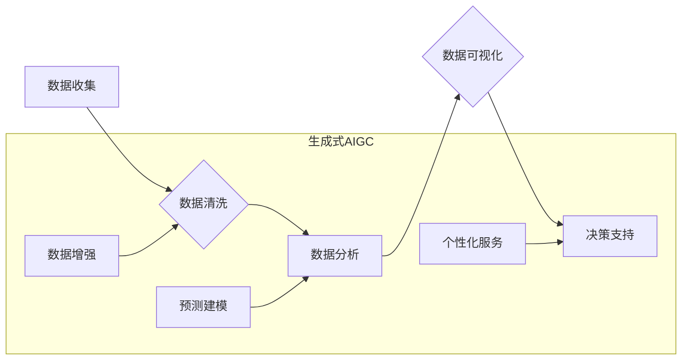

## 生成式AIGC：商业智能的未来方向

> 关键词：生成式AI、AIGC、商业智能、自然语言处理、深度学习、Transformer模型、数据分析、预测建模

### 1. 背景介绍

近年来，人工智能（AI）技术取得了飞速发展，其中生成式人工智能（Generative AI）作为其重要分支，展现出强大的潜力，正在深刻地改变着我们生活和工作方式。生成式AI能够根据输入数据生成新的、原创的内容，例如文本、图像、音频、视频等。

商业智能（Business Intelligence，BI）是利用数据分析技术，帮助企业更好地理解自身业务，做出更明智的决策。传统的BI主要依赖于数据挖掘和统计分析，而生成式AIGC的出现为BI带来了新的机遇和挑战。

### 2. 核心概念与联系

**2.1 生成式AI概述**

生成式AI是指能够根据已有的数据样本生成新数据的一种人工智能技术。它利用深度学习算法，特别是Transformer模型，学习数据中的模式和结构，并根据这些学习到的知识生成新的、类似于训练数据的内容。

**2.2 商业智能概述**

商业智能是指利用数据分析技术，帮助企业更好地理解自身业务，做出更明智的决策。它包括数据收集、数据清洗、数据分析、数据可视化等环节，最终目的是帮助企业提高效率、降低成本、提升竞争力。

**2.3 生成式AIGC与商业智能的联系**

生成式AIGC可以为商业智能提供以下方面的支持：

* **数据增强:** 生成式AI可以根据现有数据生成新的数据样本，丰富数据量，提高数据分析的准确性。
* **数据分析:** 生成式AI可以帮助企业从海量数据中提取关键信息，生成更直观的报表和图表，方便企业理解数据背后的含义。
* **预测建模:** 生成式AI可以根据历史数据预测未来的趋势，帮助企业做出更准确的决策。
* **个性化服务:** 生成式AI可以根据用户的需求生成个性化的内容，例如产品推荐、营销文案等，提升用户体验。

**2.4 Mermaid 流程图**



### 3. 核心算法原理 & 具体操作步骤

**3.1 算法原理概述**

生成式AIGC的核心算法主要基于深度学习，特别是Transformer模型。Transformer模型通过自注意力机制，能够捕捉文本中的长距离依赖关系，生成更流畅、更自然的文本。

**3.2 算法步骤详解**

1. **数据预处理:** 将原始数据进行清洗、格式化和编码，使其能够被模型理解。
2. **模型训练:** 使用训练数据训练Transformer模型，学习数据中的模式和结构。
3. **文本生成:** 根据输入的文本提示或条件，利用训练好的模型生成新的文本内容。
4. **文本后处理:** 对生成的文本进行语法检查、格式调整等操作，使其更加符合实际应用需求。

**3.3 算法优缺点**

**优点:**

* 生成能力强，能够生成高质量、原创的文本内容。
* 能够捕捉文本中的长距离依赖关系，生成更流畅、更自然的文本。
* 可应用于多种场景，例如文本摘要、机器翻译、对话系统等。

**缺点:**

* 训练数据量大，需要大量的计算资源和时间。
* 模型参数复杂，难以理解和调试。
* 容易受到训练数据的影响，可能生成带有偏见或错误的信息。

**3.4 算法应用领域**

* 文本生成：文章写作、故事创作、诗歌创作、广告文案生成等。
* 机器翻译：将一种语言翻译成另一种语言。
* 对话系统：开发聊天机器人、虚拟助手等。
* 代码生成：根据自然语言描述生成代码。
* 数据分析：生成数据报告、图表等，帮助企业理解数据。

### 4. 数学模型和公式 & 详细讲解 & 举例说明

**4.1 数学模型构建**

生成式AIGC模型通常基于Transformer架构，其核心是自注意力机制。自注意力机制可以计算每个词与其他词之间的相关性，从而捕捉文本中的长距离依赖关系。

**4.2 公式推导过程**

自注意力机制的计算过程可以概括为以下公式：

$$
Attention(Q, K, V) = softmax(\frac{QK^T}{\sqrt{d_k}})V
$$

其中：

* $Q$：查询矩阵
* $K$：键矩阵
* $V$：值矩阵
* $d_k$：键向量的维度
* $softmax$：softmax函数，用于归一化注意力权重

**4.3 案例分析与讲解**

假设我们有一个句子“我爱吃苹果”，我们想要计算“吃”这个词与其他词之间的注意力权重。

1. 将句子转换为词向量表示。
2. 计算查询矩阵 $Q$、键矩阵 $K$ 和值矩阵 $V$。
3. 使用公式计算注意力权重。
4. 将注意力权重与值矩阵相乘，得到最终的输出。

通过分析注意力权重，我们可以发现“吃”这个词与“我”和“苹果”这两个词的注意力权重较高，说明这些词与“吃”的语义关系密切。

### 5. 项目实践：代码实例和详细解释说明

**5.1 开发环境搭建**

* Python 3.7+
* TensorFlow 或 PyTorch 深度学习框架
* CUDA 和 cuDNN (可选，用于GPU加速)

**5.2 源代码详细实现**

```python
import tensorflow as tf

# 定义Transformer模型
class Transformer(tf.keras.Model):
    def __init__(self, vocab_size, embedding_dim, num_heads, num_layers):
        super(Transformer, self).__init__()
        self.embedding = tf.keras.layers.Embedding(vocab_size, embedding_dim)
        self.transformer_layers = tf.keras.layers.StackedRNNCells([
            tf.keras.layers.MultiHeadAttention(num_heads=num_heads, key_dim=embedding_dim)
            for _ in range(num_layers)
        ])
        self.dense = tf.keras.layers.Dense(vocab_size)

    def call(self, inputs):
        x = self.embedding(inputs)
        x = self.transformer_layers(x)
        x = self.dense(x)
        return x

# 实例化模型
model = Transformer(vocab_size=10000, embedding_dim=128, num_heads=8, num_layers=6)

# 训练模型
model.compile(optimizer='adam', loss='sparse_categorical_crossentropy', metrics=['accuracy'])
model.fit(train_data, train_labels, epochs=10)

# 生成文本
text = model.predict(input_text)
```

**5.3 代码解读与分析**

* 代码定义了一个Transformer模型，包含嵌入层、多头注意力层和全连接层。
* 模型使用Adam优化器，交叉熵损失函数和准确率指标进行训练。
* 训练完成后，可以使用模型生成新的文本内容。

**5.4 运行结果展示**

运行结果将显示模型在训练集上的准确率，以及模型生成的文本内容。

### 6. 实际应用场景

**6.1 文本摘要**

生成式AIGC可以自动生成文章、文档等文本的摘要，节省时间和精力。

**6.2 机器翻译**

生成式AIGC可以实现多种语言之间的机器翻译，打破语言障碍，促进国际交流。

**6.3 对话系统**

生成式AIGC可以用于开发聊天机器人、虚拟助手等，提供更智能、更自然的交互体验。

**6.4 个性化推荐**

生成式AIGC可以根据用户的兴趣爱好，生成个性化的产品推荐、内容推荐等，提升用户体验。

**6.5 数据分析报告**

生成式AIGC可以根据数据分析结果，自动生成报表、图表等，帮助企业更直观地理解数据。

**6.6 未来应用展望**

随着生成式AIGC技术的不断发展，其应用场景将更加广泛，例如：

* 自动生成代码
* 自动创作音乐、绘画等艺术作品
* 自动生成剧本、小说等文学作品
* 自动生成新闻报道、广告文案等

### 7. 工具和资源推荐

**7.1 学习资源推荐**

* **书籍:**

    * 《深度学习》
    * 《自然语言处理》
    * 《Transformer模型详解》

* **在线课程:**

    * Coursera: 深度学习
    * edX: 自然语言处理
    * fast.ai: 深度学习

**7.2 开发工具推荐**

* **TensorFlow:** 开源深度学习框架
* **PyTorch:** 开源深度学习框架
* **Hugging Face:** 提供预训练模型和工具

**7.3 相关论文推荐**

* 《Attention Is All You Need》
* 《BERT: Pre-training of Deep Bidirectional Transformers for Language Understanding》
* 《GPT-3: Language Models are Few-Shot Learners》

### 8. 总结：未来发展趋势与挑战

**8.1 研究成果总结**

近年来，生成式AIGC取得了显著进展，能够生成高质量、原创的文本内容，并应用于多种场景。

**8.2 未来发展趋势**

* 模型规模和能力将进一步提升，能够生成更复杂、更丰富的文本内容。
* 多模态生成将成为新的研究热点，例如文本-图像、文本-音频的联合生成。
* 生成式AIGC将更加个性化、定制化，能够根据用户的需求生成个性化的内容。

**8.3 面临的挑战**

* 数据安全和隐私保护
* 模型的可解释性和透明度
* 模型的公平性和避免偏见

**8.4 研究展望**

未来研究将重点关注以下方面：

* 开发更安全、更可靠的生成式AIGC模型
* 提高模型的可解释性和透明度
* 探索生成式AIGC在更多领域的应用

### 9. 附录：常见问题与解答

**9.1 如何选择合适的生成式AIGC模型？**

选择合适的模型取决于具体的应用场景和需求。例如，对于文本摘要任务，可以使用BERT等预训练模型；对于对话系统，可以使用GPT-3等生成式语言模型。

**9.2 如何训练自己的生成式AIGC模型？**

训练生成式AIGC模型需要大量的计算资源和数据。可以使用开源框架如TensorFlow或PyTorch进行训练。

**9.3 生成式AIGC模型的输出结果如何评估？**

生成式AIGC模型的输出结果可以根据多种指标进行评估，例如准确率、流畅度、多样性等。

**9.4 生成式AIGC模型存在哪些伦理问题？**

生成式AIGC模型可能存在数据安全、隐私保护、公平性等伦理问题，需要引起重视并进行相应的规制。


作者：禅与计算机程序设计艺术 / Zen and the Art of Computer Programming 
