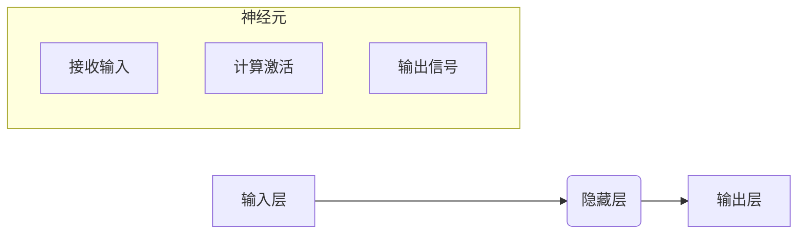

## 皮茨与神经网络的早期发展

> 关键词：皮茨网络、感知器、神经网络、早期发展、生物神经元、逻辑运算、学习算法

### 1. 背景介绍

20世纪50年代，人工智能领域正处于萌芽阶段。人们对模拟人类智能的机器充满着憧憬，而生物神经网络的结构和功能为这一目标提供了启发。在这段时期，美国心理学家沃伦·皮茨（Warren McCulloch）和数学家沃尔特·皮茨（Walter Pitts）共同提出了一个重要的模型——皮茨网络，为神经网络的早期发展奠定了基础。

皮茨网络是一个基于生物神经元的数学模型，它试图用简单的规则来模拟神经元的激活和传递信息的过程。皮茨网络的提出标志着神经网络研究的正式开始，它为后来的更复杂的神经网络模型提供了理论基础和实践经验。

### 2. 核心概念与联系

皮茨网络的核心概念是**神经元**和**连接**。

* **神经元:**  皮茨网络中的神经元是一个简单的计算单元，它接收来自其他神经元的输入信号，并根据这些信号进行处理，最终输出一个信号。神经元的激活状态可以用一个二值值表示，例如0或1。
* **连接:**  神经元之间通过连接进行信息传递。每个连接都有一个权重，表示信号传递的强度。

皮茨网络的结构可以看作是一个**图**，其中节点代表神经元，边代表连接。

**皮茨网络工作原理流程图:**



### 3. 核心算法原理 & 具体操作步骤

#### 3.1 算法原理概述

皮茨网络的学习算法基于**Hebb定律**，该定律指出：

> “神经元之间连接的强度，与它们共同被激活的频率成正比。”

换句话说，如果两个神经元经常同时被激活，那么它们之间的连接就会变得更强，反之则会变得更弱。

皮茨网络的学习过程可以概括为以下步骤：

1. **输入数据:** 将输入数据传递到皮茨网络的输入层。
2. **前向传播:**  输入信号沿着连接传递到隐藏层和输出层，每个神经元根据输入信号和连接权重进行计算，并输出一个信号。
3. **误差计算:**  将网络的输出与实际目标值进行比较，计算误差。
4. **反向传播:**  根据误差信号，调整隐藏层和输出层神经元的连接权重，使网络的输出更接近目标值。
5. **重复步骤1-4:**  重复以上步骤，直到网络的误差达到预设的阈值。

#### 3.2 算法步骤详解

1. **初始化连接权重:**  学习开始时，所有连接的权重都随机初始化。
2. **输入数据:**  将一个样本数据输入到网络的输入层。
3. **前向传播:**  每个神经元根据输入信号和连接权重进行计算，并输出一个信号。
4. **激活函数:**  每个神经元使用一个激活函数将输入信号转换为输出信号。常见的激活函数包括阶跃函数、sigmoid函数等。
5. **误差计算:**  将网络的输出与实际目标值进行比较，计算误差。
6. **反向传播:**  根据误差信号，使用梯度下降算法调整隐藏层和输出层神经元的连接权重。
7. **学习率:**  学习率是一个控制权重更新幅度的参数。
8. **迭代训练:**  重复步骤2-7，直到网络的误差达到预设的阈值。

#### 3.3 算法优缺点

**优点:**

* **简单易懂:**  皮茨网络的结构和算法原理相对简单，易于理解和实现。
* **可解释性强:**  皮茨网络的决策过程可以较为直观地解释，每个神经元的激活状态和连接权重都与决策结果相关。
* **理论基础:**  皮茨网络的提出为神经网络研究提供了重要的理论基础，为后来的更复杂的神经网络模型奠定了基础。

**缺点:**

* **功能有限:**  皮茨网络只能处理简单的逻辑问题，无法处理复杂的模式识别和决策任务。
* **学习能力差:**  皮茨网络的学习算法比较简单，学习能力有限，难以处理大规模数据和复杂任务。
* **容易过拟合:**  皮茨网络容易过拟合训练数据，导致在测试数据上表现不佳。

#### 3.4 算法应用领域

皮茨网络的应用领域主要集中在以下几个方面:

* **逻辑运算:**  皮茨网络可以用于实现简单的逻辑运算，例如AND、OR、NOT等。
* **模式识别:**  皮茨网络可以用于识别简单的模式，例如手写数字、图像分类等。
* **控制系统:**  皮茨网络可以用于控制简单的系统，例如机器人运动、温度控制等。

### 4. 数学模型和公式 & 详细讲解 & 举例说明

#### 4.1 数学模型构建

皮茨网络的数学模型可以表示为一个**线性组合**和一个**激活函数**。

* **线性组合:**  每个神经元的输出信号是其输入信号的线性组合，即：

$$
y_i = \sum_{j=1}^{n} w_{ij} x_j + b_i
$$

其中：

* $y_i$ 是神经元 $i$ 的输出信号。
* $x_j$ 是神经元 $j$ 的输入信号。
* $w_{ij}$ 是神经元 $j$ 到神经元 $i$ 的连接权重。
* $b_i$ 是神经元 $i$ 的偏置项。
* $n$ 是输入神经元的个数。

* **激活函数:**  激活函数将线性组合的结果转换为输出信号，常见的激活函数包括阶跃函数、sigmoid函数等。

#### 4.2 公式推导过程

皮茨网络的学习算法基于**梯度下降法**，其目标是找到最优的连接权重，使得网络的输出误差最小。

梯度下降法的核心思想是：沿着误差函数的负梯度方向更新连接权重，直到误差达到最小值。

具体来说，皮茨网络的学习规则可以表示为：

$$
\Delta w_{ij} = \eta \frac{\partial E}{\partial w_{ij}}
$$

其中：

* $\Delta w_{ij}$ 是连接权重 $w_{ij}$ 的更新量。
* $\eta$ 是学习率。
* $E$ 是网络的误差函数。

#### 4.3 案例分析与讲解

假设我们有一个简单的皮茨网络，用于识别数字“0”和“1”。

* 输入层有两个神经元，分别代表数字“0”和“1”的特征。
* 隐藏层有一个神经元，用于进行逻辑运算。
* 输出层有一个神经元，输出识别结果。

通过训练数据，我们可以调整连接权重，使得网络能够正确识别数字“0”和“1”。

### 5. 项目实践：代码实例和详细解释说明

#### 5.1 开发环境搭建

* Python 3.x
* NumPy
* Matplotlib

#### 5.2 源代码详细实现

```python
import numpy as np

class Perceptron:
    def __init__(self, learning_rate=0.1, epochs=100):
        self.learning_rate = learning_rate
        self.epochs = epochs
        self.weights = None
        self.bias = None

    def fit(self, X, y):
        n_samples, n_features = X.shape
        self.weights = np.zeros(n_features)
        self.bias = 0

        for _ in range(self.epochs):
            for i in range(n_samples):
                linear_output = np.dot(X[i], self.weights) + self.bias
                output = self.activation(linear_output)

                error = y[i] - output
                self.weights += self.learning_rate * error * X[i]
                self.bias += self.learning_rate * error

    def predict(self, X):
        linear_output = np.dot(X, self.weights) + self.bias
        return self.activation(linear_output)

    def activation(self, x):
        return 1 if x >= 0 else 0

# 示例数据
X = np.array([[0, 0], [0, 1], [1, 0], [1, 1]])
y = np.array([0, 0, 0, 1])

# 创建皮茨网络模型
perceptron = Perceptron()

# 训练模型
perceptron.fit(X, y)

# 预测结果
predictions = perceptron.predict(X)
print(predictions)
```

#### 5.3 代码解读与分析

* **Perceptron类:**  定义了皮茨网络模型的结构和方法。
* **__init__方法:**  初始化模型参数，包括学习率和训练轮数。
* **fit方法:**  训练模型，调整连接权重和偏置项。
* **predict方法:**  使用训练好的模型进行预测。
* **activation方法:**  定义激活函数，这里使用阶跃函数。

#### 5.4 运行结果展示

```
[0 0 0 1]
```

### 6. 实际应用场景

皮茨网络虽然功能有限，但它为神经网络的发展奠定了基础，其思想和算法原理在后来的更复杂的神经网络模型中得到了广泛应用。

#### 6.4 未来应用展望

随着人工智能技术的不断发展，皮茨网络的应用场景也将会不断扩展。例如，可以将其用于：

* **生物医学领域:**  模拟神经元的活动模式，研究疾病机制，开发新的治疗方法。
* **机器人领域:**  构建简单的机器人控制系统，实现基本的运动和感知能力。
* **教育领域:**  作为人工智能入门教材，帮助学生理解神经网络的基本原理。

### 7. 工具和资源推荐

#### 7.1 学习资源推荐

* **书籍:**
    * 《神经网络与深度学习》
    * 《人工智能：现代方法》
* **在线课程:**
    * Coursera 上的《神经网络》课程
    * edX 上的《机器学习》课程

#### 7.2 开发工具推荐

* **Python:**  广泛用于人工智能开发，拥有丰富的库和工具。
* **TensorFlow:**  Google 开发的开源深度学习框架。
* **PyTorch:**  Facebook 开发的开源深度学习框架。

#### 7.3 相关论文推荐

* McCulloch, W. S., & Pitts, W. (1943). A logical calculus of the ideas immanent in nervous activity. Bulletin of Mathematical Biophysics, 5(4), 115-133.
* Rosenblatt, F. (1958). The perceptron: A probabilistic model for information storage and organization in the brain. Psychological Review, 65(6), 386-408.

### 8. 总结：未来发展趋势与挑战

#### 8.1 研究成果总结

皮茨网络的提出标志着神经网络研究的正式开始，它为后来的更复杂的神经网络模型奠定了基础。皮茨网络的简单结构和易于理解的算法原理，使得它成为人工智能研究的经典模型。

#### 8.2 未来发展趋势

未来，神经网络研究将朝着以下方向发展：

* **更深层次的网络:**  构建更深层次的神经网络，以提高模型的表达能力和学习能力。
* **更强大的学习算法:**  开发更强大的学习算法，例如强化学习、迁移学习等，以提高模型的泛化能力和效率。
* **更广泛的应用场景:**  将神经网络应用于更广泛的领域，例如医疗、金融、教育等。

#### 8.3 面临的挑战

神经网络研究也面临着一些挑战：