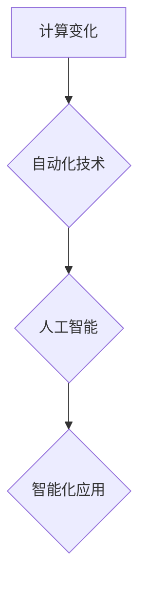

## 计算变化与自动化技术的融合

> 关键词：计算变化、自动化技术、机器学习、深度学习、人工智能、流程自动化、软件开发

## 1. 背景介绍

在当今数字时代，计算能力的飞速发展和自动化技术的不断进步，正在深刻地改变着我们生活的方方面面。从智能手机到自动驾驶汽车，从个性化推荐到医疗诊断，自动化技术已经渗透到我们生活的方方面面，并正在以指数级速度发展。

计算变化是指计算能力的不断提升和应用范围的不断扩展。随着摩尔定律的持续发展，计算机处理器性能不断提高，存储容量不断扩大，网络带宽不断提升。这些计算能力的提升为自动化技术的应用提供了强大的基础。

自动化技术是指利用计算机和软件系统自动执行重复性任务或复杂流程，以提高效率、降低成本和减少人为错误。自动化技术涵盖了广泛的领域，包括流程自动化、代码自动化、测试自动化、部署自动化等。

## 2. 核心概念与联系

**2.1 核心概念**

* **计算变化:** 指的是计算能力的不断提升和应用范围的不断扩展。
* **自动化技术:** 指的是利用计算机和软件系统自动执行重复性任务或复杂流程，以提高效率、降低成本和减少人为错误。
* **机器学习:** 一种人工智能技术，使计算机能够从数据中学习，并根据学习到的知识进行预测或决策。
* **深度学习:** 一种机器学习的子集，利用多层神经网络来模拟人类大脑的学习过程。

**2.2 联系**

计算变化和自动化技术的融合，推动了人工智能的快速发展。

* **计算能力的提升**为机器学习和深度学习算法的训练提供了强大的支持。
* **自动化技术的应用**使得人工智能技术能够应用于更广泛的领域，并实现更智能化的自动化。

**2.3 流程图**



## 3. 核心算法原理 & 具体操作步骤

**3.1 算法原理概述**

机器学习算法的核心原理是通过学习数据中的模式和规律，建立数学模型，并利用这个模型对新的数据进行预测或分类。常见的机器学习算法包括：

* **监督学习:** 利用标记数据训练模型，例如分类和回归问题。
* **无监督学习:** 利用未标记数据发现数据中的隐藏模式，例如聚类和降维。
* **强化学习:** 通过试错学习，在环境中获得最大奖励。

**3.2 算法步骤详解**

1. **数据收集和预处理:** 收集相关数据，并进行清洗、转换和特征工程等预处理操作。
2. **模型选择:** 根据具体问题选择合适的机器学习算法。
3. **模型训练:** 利用训练数据训练模型，并调整模型参数以获得最佳性能。
4. **模型评估:** 利用测试数据评估模型的性能，并进行调优。
5. **模型部署:** 将训练好的模型部署到实际应用场景中。

**3.3 算法优缺点**

* **优点:**

    * 自动化学习，无需人工编程。
    * 能够处理复杂数据，发现隐藏模式。
    * 性能不断提升，应用范围不断扩展。

* **缺点:**

    * 需要大量数据进行训练。
    * 模型解释性较差，难以理解模型决策过程。
    * 容易受到数据偏差的影响。

**3.4 算法应用领域**

* **图像识别:** 人脸识别、物体检测、图像分类。
* **自然语言处理:** 文本分类、情感分析、机器翻译。
* **推荐系统:** 商品推荐、内容推荐、用户画像。
* **医疗诊断:** 疾病预测、影像分析、药物研发。
* **金融风险控制:** 欺诈检测、信用评分、投资决策。

## 4. 数学模型和公式 & 详细讲解 & 举例说明

**4.1 数学模型构建**

机器学习算法通常使用数学模型来表示数据之间的关系。常见的数学模型包括线性回归、逻辑回归、支持向量机、决策树等。

**4.2 公式推导过程**

例如，线性回归模型的目标是找到一条直线，将输入特征与输出标签关联起来。模型的公式如下：

$$y = w_0 + w_1x_1 + w_2x_2 +... + w_nx_n$$

其中：

* $y$ 是输出标签
* $w_0, w_1, w_2,..., w_n$ 是模型参数
* $x_1, x_2,..., x_n$ 是输入特征

模型参数可以通过最小化预测误差来训练。

**4.3 案例分析与讲解**

假设我们有一个数据集，包含房屋面积和房屋价格的信息。我们可以使用线性回归模型来预测房屋价格。

* 输入特征：房屋面积
* 输出标签：房屋价格

通过训练模型，我们可以得到一个线性回归方程，例如：

$$价格 = 5000 + 100 * 面积$$

这个方程表示，房屋面积每增加1平方米，房屋价格就会增加100元。

## 5. 项目实践：代码实例和详细解释说明

**5.1 开发环境搭建**

* Python 3.x
* TensorFlow 或 PyTorch 等深度学习框架
* Jupyter Notebook 或 VS Code 等代码编辑器

**5.2 源代码详细实现**

```python
import tensorflow as tf

# 定义模型
model = tf.keras.models.Sequential([
    tf.keras.layers.Dense(64, activation='relu', input_shape=(1,)),
    tf.keras.layers.Dense(1)
])

# 编译模型
model.compile(optimizer='adam', loss='mean_squared_error')

# 训练模型
model.fit(x_train, y_train, epochs=100)

# 评估模型
loss = model.evaluate(x_test, y_test)
print('Loss:', loss)

# 预测
predictions = model.predict(x_new)
print('Predictions:', predictions)
```

**5.3 代码解读与分析**

* 代码首先定义了一个简单的深度学习模型，包含两层全连接神经网络。
* 然后，模型被编译，指定了优化器、损失函数和指标。
* 接着，模型被训练，使用训练数据进行迭代优化。
* 最后，模型被评估，并使用测试数据计算损失值。

**5.4 运行结果展示**

运行结果将显示模型的训练过程和评估结果，例如损失值、准确率等。

## 6. 实际应用场景

**6.1 自动化流程**

* **软件开发:** 自动化代码生成、测试、部署等流程，提高开发效率。
* **IT运维:** 自动化服务器监控、故障处理、系统升级等流程，降低运维成本。
* **业务流程:** 自动化客户服务、订单处理、财务报账等流程，提高业务效率。

**6.2 智能化应用**

* **智能客服:** 利用自然语言处理技术，自动回复客户咨询，提高客户服务效率。
* **智能推荐:** 利用机器学习算法，根据用户行为和偏好，推荐个性化内容和产品。
* **智能决策:** 利用数据分析和机器学习，辅助企业决策，提高决策效率。

**6.3 未来应用展望**

* **更智能的自动化:** 利用更先进的机器学习算法，实现更智能化的自动化，例如自主学习、自适应调整等。
* **更广泛的应用场景:** 自动化技术将应用于更多领域，例如医疗、教育、交通等。
* **更深入的人机交互:** 自动化技术将推动人机交互的深入发展，例如自然语言交互、情感识别等。

## 7. 工具和资源推荐

**7.1 学习资源推荐**

* **书籍:**
    * 《深度学习》
    * 《机器学习实战》
    * 《Python机器学习》
* **在线课程:**
    * Coursera
    * edX
    * Udacity

**7.2 开发工具推荐**

* **Python:** 
    * TensorFlow
    * PyTorch
    * scikit-learn
* **云平台:**
    * AWS
    * Azure
    * Google Cloud

**7.3 相关论文推荐**

* **AlphaGo论文:** https://arxiv.org/abs/1607.02886
* **BERT论文:** https://arxiv.org/abs/1810.04805

## 8. 总结：未来发展趋势与挑战

**8.1 研究成果总结**

计算变化和自动化技术的融合，推动了人工智能的快速发展，取得了显著成果。

* **算法性能提升:** 机器学习算法的性能不断提升，能够处理更复杂的数据，解决更实际的问题。
* **应用范围扩展:** 自动化技术应用于越来越广泛的领域，例如医疗、教育、交通等。
* **技术生态繁荣:** 深度学习框架、云平台、开源工具等技术生态不断完善。

**8.2 未来发展趋势**

* **更智能的自动化:** 利用更先进的机器学习算法，实现更智能化的自动化，例如自主学习、自适应调整等。
* **更广泛的应用场景:** 自动化技术将应用于更多领域，例如医疗、教育、交通等。
* **更深入的人机交互:** 自动化技术将推动人机交互的深入发展，例如自然语言交互、情感识别等。

**8.3 面临的挑战**

* **数据安全和隐私:** 自动化技术依赖大量数据，如何保障数据安全和隐私是一个重要挑战。
* **算法解释性和可信度:** 许多机器学习算法的决策过程难以解释，如何提高算法的解释性和可信度是一个关键问题。
* **伦理和社会影响:** 自动化技术可能带来一些伦理和社会问题，例如就业替代、算法偏见等，需要认真思考和应对。

**8.4 研究展望**

未来，我们将继续探索计算变化和自动化技术的融合，开发更智能、更安全、更可信的自动化技术，并将其应用于更多领域，为人类社会带来更多福祉。

## 9. 附录：常见问题与解答

**9.1 如何选择合适的机器学习算法？**

选择合适的机器学习算法取决于具体问题类型和数据特点。

* **分类问题:** 使用逻辑回归、支持向量机、决策树等算法。
* **回归问题:** 使用线性回归、支持向量机、神经网络等算法。
* **聚类问题:** 使用k-means聚类、层次聚类等算法。

**9.2 如何评估机器学习模型的性能？**

常用的评估指标包括准确率、召回率、F1-score、AUC等。

**9.3 如何防止机器学习模型的过拟合？**

过拟合是指模型在训练数据上表现很好，但在测试数据上表现较差。

* 使用正则化技术，例如L1正则化、L2正则化。
* 使用交叉验证技术，将数据分成多个子集，分别用于训练和测试模型。
* 使用Dropout技术，随机丢弃一部分神经网络层中的节点。

作者：禅与计算机程序设计艺术 / Zen and the Art of Computer Programming


