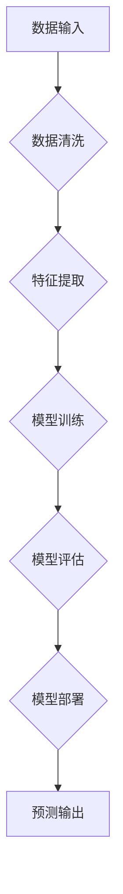

## 计算领域的自动化发展趋势

> 关键词：自动化、机器学习、人工智能、软件开发、DevOps、流程自动化、数据分析、云计算

### 1. 背景介绍

计算领域正经历着前所未有的自动化浪潮。从软件开发到数据分析，从基础设施管理到业务流程，自动化技术正在改变着我们工作的方式，提高效率，降低成本，并释放出人类创造力的潜力。

这一趋势的驱动因素多种多样：

* **数据爆炸:**  海量数据的产生和积累催生了对自动化数据处理和分析的需求。
* **人工成本上升:**  随着劳动力成本的不断攀升，自动化成为降低运营成本的有效手段。
* **技术进步:**  机器学习、人工智能等技术的快速发展为自动化提供了强大的技术支撑。
* **需求多样化:**  用户对个性化、定制化服务的需求不断增长，自动化可以帮助企业快速响应和满足这些需求。

### 2. 核心概念与联系

**2.1 自动化概念**

自动化是指利用技术手段，使系统或流程能够自动执行预先定义的任务，减少或消除人工干预。

**2.2 机器学习与人工智能**

机器学习是人工智能的一个分支，它通过算法训练模型，使模型能够从数据中学习，并做出预测或决策。人工智能则更广泛，涵盖了机器学习、自然语言处理、计算机视觉等多个领域。

**2.3 软件开发自动化**

软件开发自动化是指利用工具和技术，自动化软件开发过程中的各个环节，例如代码构建、测试、部署等。

**2.4 DevOps**

DevOps是一种软件开发和运维的文化和实践，它强调协作、自动化和持续交付。

**2.5 流程自动化**

流程自动化是指利用软件工具，自动化业务流程中的重复性任务，例如审批流程、报销流程等。

**2.6  自动化流程图**



### 3. 核心算法原理 & 具体操作步骤

**3.1 算法原理概述**

机器学习算法的核心是通过训练模型，使模型能够从数据中学习规律，并进行预测或决策。常见的机器学习算法包括：

* **监督学习:**  利用标记数据训练模型，例如分类、回归等。
* **无监督学习:**  利用未标记数据发现数据中的潜在结构，例如聚类、降维等。
* **强化学习:**  通过试错学习，使模型在特定环境中获得最大奖励。

**3.2 算法步骤详解**

1. **数据收集和预处理:**  收集相关数据，并进行清洗、转换、特征工程等预处理工作。
2. **模型选择:**  根据具体任务选择合适的机器学习算法。
3. **模型训练:**  利用训练数据训练模型，调整模型参数，使模型能够准确预测或决策。
4. **模型评估:**  利用测试数据评估模型的性能，例如准确率、召回率、F1-score等。
5. **模型部署:**  将训练好的模型部署到实际应用环境中。

**3.3 算法优缺点**

* **优点:**  能够自动学习数据规律，提高预测精度，自动化程度高。
* **缺点:**  需要大量数据进行训练，模型解释性较差，容易受到数据偏差的影响。

**3.4 算法应用领域**

* **图像识别:**  人脸识别、物体检测、图像分类等。
* **自然语言处理:**  文本分类、情感分析、机器翻译等。
* **推荐系统:**  商品推荐、内容推荐、用户画像等。
* **预测分析:**  销售预测、风险评估、故障预测等。

### 4. 数学模型和公式 & 详细讲解 & 举例说明

**4.1 数学模型构建**

机器学习算法通常基于数学模型，例如线性回归、逻辑回归、支持向量机等。这些模型通过数学公式来描述数据之间的关系。

**4.2 公式推导过程**

例如，线性回归模型的目标是找到一条直线，使得这条直线与数据点之间的误差最小。

**线性回归模型公式:**

$$y = w_0 + w_1x_1 + w_2x_2 +... + w_nx_n + \epsilon$$

其中:

* $y$ 是预测值
* $w_0, w_1, w_2,..., w_n$ 是模型参数
* $x_1, x_2,..., x_n$ 是输入特征
* $\epsilon$ 是误差项

**4.3 案例分析与讲解**

假设我们想要预测房价，输入特征包括房屋面积、房间数量、地理位置等。我们可以使用线性回归模型来建立房价预测模型。

通过训练数据，我们可以找到最佳的模型参数，使得模型能够准确预测房价。

**4.4  公式应用场景**

线性回归模型广泛应用于预测分析、市场营销、金融等领域。

### 5. 项目实践：代码实例和详细解释说明

**5.1 开发环境搭建**

* Python 3.x
* TensorFlow 或 PyTorch 等深度学习框架
* Jupyter Notebook 或 VS Code 等代码编辑器

**5.2 源代码详细实现**

```python
import tensorflow as tf

# 定义模型
model = tf.keras.models.Sequential([
    tf.keras.layers.Dense(64, activation='relu', input_shape=(4,)),
    tf.keras.layers.Dense(1)
])

# 编译模型
model.compile(optimizer='adam', loss='mse')

# 训练模型
model.fit(X_train, y_train, epochs=10)

# 评估模型
loss = model.evaluate(X_test, y_test)
print('Loss:', loss)

# 预测房价
new_house = [[100, 2, 1, '市中心']]
prediction = model.predict(new_house)
print('预测房价:', prediction)
```

**5.3 代码解读与分析**

* 代码首先定义了一个简单的线性回归模型，包含两个全连接层。
* 然后，模型被编译，指定了优化器、损失函数等参数。
* 接着，模型使用训练数据进行训练，训练过程会不断调整模型参数，使得模型能够更好地拟合数据。
* 最后，模型的性能被评估，并使用训练好的模型预测新的房价。

**5.4 运行结果展示**

运行结果会显示模型的训练损失和预测结果。

### 6. 实际应用场景

**6.1 软件开发自动化**

* **代码构建:**  自动化构建代码，生成可执行文件或部署包。
* **代码测试:**  自动化执行单元测试、集成测试等，提高测试覆盖率和效率。
* **代码部署:**  自动化部署代码到测试环境、生产环境等，简化部署流程。

**6.2 DevOps**

* **持续集成:**  将代码变更频繁集成到主分支，并自动构建和测试。
* **持续交付:**  将经过测试的代码自动部署到生产环境。
* **监控和报警:**  自动化监控系统运行状态，并自动报警异常情况。

**6.3 流程自动化**

* **审批流程:**  自动化审批流程，提高审批效率和透明度。
* **报销流程:**  自动化报销流程，简化报销步骤。
* **客户服务流程:**  自动化客户服务流程，提高客户服务效率。

**6.4 未来应用展望**

自动化技术将继续深入各个领域，例如：

* **智能制造:**  自动化生产线，提高生产效率和产品质量。
* **智慧城市:**  自动化城市管理，提高城市运行效率和居民生活质量。
* **医疗保健:**  自动化医疗诊断和治疗，提高医疗效率和患者体验。

### 7. 工具和资源推荐

**7.1 学习资源推荐**

* **书籍:**  《Python机器学习实战》、《深度学习》
* **在线课程:**  Coursera、edX、Udacity 等平台提供丰富的机器学习和人工智能课程。
* **博客和论坛:**  机器学习和人工智能领域有很多优秀的博客和论坛，例如机器之心、AI 算法等。

**7.2 开发工具推荐**

* **Python:**  机器学习和人工智能开发的常用语言。
* **TensorFlow:**  开源深度学习框架。
* **PyTorch:**  开源深度学习框架。
* **Jupyter Notebook:**  交互式代码编辑器和笔记本。

**7.3 相关论文推荐**

* **《ImageNet Classification with Deep Convolutional Neural Networks》**
* **《Attention Is All You Need》**
* **《Generative Adversarial Networks》**

### 8. 总结：未来发展趋势与挑战

**8.1 研究成果总结**

近年来，自动化技术取得了长足进步，在各个领域都取得了显著的应用成果。

**8.2 未来发展趋势**

* **更智能的自动化:**  利用人工智能技术，使自动化系统更加智能，能够自主学习和决策。
* **更广泛的应用:**  自动化技术将应用到更多领域，例如医疗保健、教育、金融等。
* **更安全的自动化:**  确保自动化系统安全可靠，防止被恶意攻击或滥用。

**8.3 面临的挑战**

* **数据质量:**  自动化系统依赖于高质量的数据，数据质量问题会影响自动化系统的性能。
* **模型解释性:**  一些机器学习模型的决策过程难以解释，这可能会导致信任问题。
* **伦理问题:**  自动化技术可能会带来一些伦理问题，例如算法偏见、工作岗位替代等。

**8.4 研究展望**

未来，自动化技术将继续发展，并对我们的生活产生更深远的影响。我们需要加强对自动化技术的研究，解决其面临的挑战，并确保其能够安全、可靠、公平地应用于各个领域。

### 9. 附录：常见问题与解答

**9.1 如何选择合适的自动化工具？**

选择自动化工具需要根据具体需求和场景进行评估。

**9.2 如何保证自动化系统的安全可靠？**

需要采取多种措施保证自动化系统的安全可靠，例如：

* 使用安全的开发工具和框架。
* 进行代码审查和安全测试。
* 监控自动化系统的运行状态，并及时修复漏洞。

**9.3 自动化技术会取代人类工作吗？**

自动化技术会改变一些工作方式，但不会完全取代人类工作。人类仍然需要发挥创造力、解决问题和进行决策等方面的优势。


作者：禅与计算机程序设计艺术 / Zen and the Art of Computer Programming 
