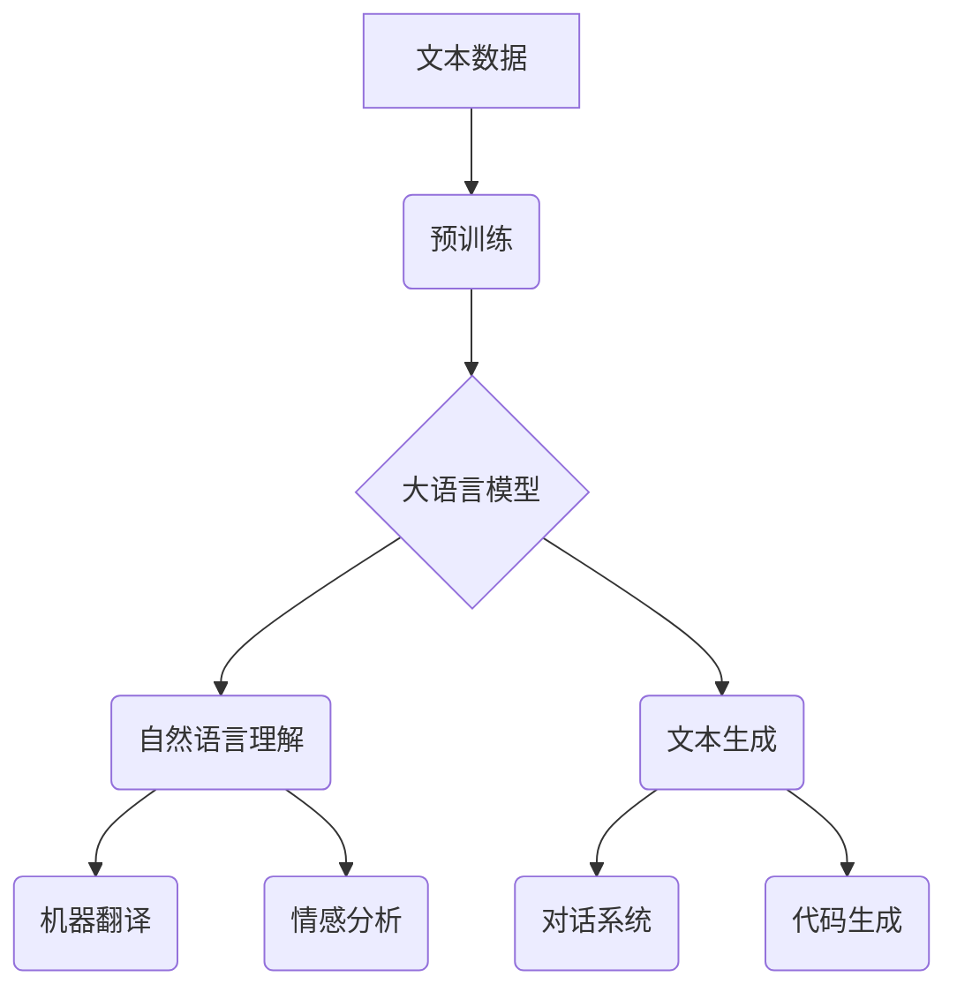

## 语言与思维的关系：大模型的挑战

> 关键词：大语言模型、自然语言处理、人工智能、思维模拟、认知科学、语言生成

### 1. 背景介绍

近年来，人工智能领域取得了令人瞩目的进展，其中大语言模型（Large Language Models，LLMs）的出现尤为引人注目。这些模型通过训练海量文本数据，能够生成逼真的文本、翻译语言、编写代码甚至进行逻辑推理。LLMs 的强大能力引发了人们对语言与思维关系的深刻思考。

传统人工智能系统主要依赖于明确的规则和程序设计，而 LLMs 则更像人类大脑，通过学习模式和关系来理解和生成语言。这使得 LLMs 在许多任务上表现出超越传统方法的优势，但也带来了新的挑战。

### 2. 核心概念与联系

**2.1  大语言模型 (LLMs)**

大语言模型是一种基于深度学习的统计模型，能够处理和生成文本。它们通常由 Transformer 架构构成，并通过大量的文本数据进行预训练。预训练过程使得 LLMs 掌握了语言的语法、语义和上下文关系，从而能够在各种自然语言处理任务中表现出色。

**2.2  自然语言处理 (NLP)**

自然语言处理是人工智能的一个分支，旨在使计算机能够理解、处理和生成人类语言。NLP 任务包括文本分类、情感分析、机器翻译、问答系统等。LLMs 在 NLP 领域取得了突破性进展，为许多任务提供了更准确、更自然的人机交互体验。

**2.3  思维模拟**

思维模拟是指试图通过计算机程序模拟人类的思维过程。尽管人类思维的复杂性至今仍未完全理解，但 LLMs 的出现为思维模拟提供了新的思路。通过学习语言的模式和关系，LLMs 能够展现出一些类似人类思维的能力，例如推理、逻辑判断和创意生成。

**2.4  认知科学**

认知科学研究人类的认知过程，包括感知、记忆、语言、推理和决策等。LLMs 的发展为认知科学提供了新的工具和视角，可以帮助研究人员更好地理解人类思维的机制。

**Mermaid 流程图**



### 3. 核心算法原理 & 具体操作步骤

**3.1  算法原理概述**

LLMs 的核心算法是 Transformer 架构，它是一种基于注意力机制的深度神经网络。注意力机制允许模型关注输入序列中与当前任务最相关的部分，从而提高学习效率和准确性。

**3.2  算法步骤详解**

1. **词嵌入:** 将文本中的每个词转换为向量表示，以便模型能够理解词语的语义信息。
2. **编码器:** 使用多层 Transformer 块对输入序列进行编码，提取文本的语义特征。
3. **解码器:** 使用多层 Transformer 块对编码后的信息进行解码，生成目标文本序列。
4. **损失函数:** 使用交叉熵损失函数衡量模型预测结果与真实结果之间的差异。
5. **反向传播:** 使用梯度下降算法更新模型参数，降低损失函数的值。

**3.3  算法优缺点**

**优点:**

* 能够处理长序列文本，捕捉长距离依赖关系。
* 训练效率高，能够在海量数据上进行高效学习。
* 表现出色于各种自然语言处理任务。

**缺点:**

* 参数量巨大，需要大量的计算资源进行训练和部署。
* 容易受到训练数据偏差的影响，可能生成带有偏见或错误的信息。
* 缺乏对真实世界知识的理解，难以解决需要逻辑推理和常识判断的任务。

**3.4  算法应用领域**

* 机器翻译
* 文本摘要
* 问答系统
* 对话机器人
* 代码生成
* 内容创作

### 4. 数学模型和公式 & 详细讲解 & 举例说明

**4.1  数学模型构建**

LLMs 的数学模型基于 Transformer 架构，主要包括编码器和解码器两个部分。

* **编码器:** 使用多层 Transformer 块对输入序列进行编码，每个 Transformer 块包含多头注意力机制和前馈神经网络。
* **解码器:** 使用多层 Transformer 块对编码后的信息进行解码，生成目标文本序列。

**4.2  公式推导过程**

Transformer 架构的核心是注意力机制，其计算公式如下：

$$
Attention(Q, K, V) = softmax(\frac{QK^T}{\sqrt{d_k}})V
$$

其中：

* $Q$：查询矩阵
* $K$：键矩阵
* $V$：值矩阵
* $d_k$：键向量的维度
* $softmax$：softmax 函数

**4.3  案例分析与讲解**

例如，在机器翻译任务中，输入序列为源语言文本，输出序列为目标语言文本。编码器将源语言文本编码为语义向量，解码器则根据编码后的信息生成目标语言文本。

### 5. 项目实践：代码实例和详细解释说明

**5.1  开发环境搭建**

使用 Python 语言和深度学习框架 TensorFlow 或 PyTorch 进行开发。

**5.2  源代码详细实现**

```python
# 使用 TensorFlow 实现一个简单的 Transformer 模型
import tensorflow as tf

# 定义编码器层
class EncoderLayer(tf.keras.layers.Layer):
    def __init__(self, d_model, num_heads, dff):
        super(EncoderLayer, self).__init__()
        self.mha = tf.keras.layers.MultiHeadAttention(num_heads=num_heads, key_dim=d_model)
        self.ffn = tf.keras.layers.Dense(dff, activation='relu')

    def call(self, inputs, mask):
        attn_output = self.mha(inputs, inputs, inputs, mask=mask)
        ffn_output = self.ffn(attn_output)
        return ffn_output

# 定义解码器层
class DecoderLayer(tf.keras.layers.Layer):
    def __init__(self, d_model, num_heads, dff):
        super(DecoderLayer, self).__init__()
        self.mha1 = tf.keras.layers.MultiHeadAttention(num_heads=num_heads, key_dim=d_model)
        self.mha2 = tf.keras.layers.MultiHeadAttention(num_heads=num_heads, key_dim=d_model)
        self.ffn = tf.keras.layers.Dense(dff, activation='relu')

    def call(self, inputs, encoder_outputs, mask):
        attn1_output = self.mha1(inputs, inputs, inputs, mask=mask)
        attn2_output = self.mha2(attn1_output, encoder_outputs, encoder_outputs, mask=mask)
        ffn_output = self.ffn(attn2_output)
        return ffn_output

# 定义 Transformer 模型
class Transformer(tf.keras.Model):
    def __init__(self, vocab_size, d_model, num_heads, dff, num_layers):
        super(Transformer, self).__init__()
        self.embedding = tf.keras.layers.Embedding(vocab_size, d_model)
        self.encoder = tf.keras.Sequential([
            EncoderLayer(d_model, num_heads, dff) for _ in range(num_layers)
        ])
        self.decoder = tf.keras.Sequential([
            DecoderLayer(d_model, num_heads, dff) for _ in range(num_layers)
        ])
        self.fc_out = tf.keras.layers.Dense(vocab_size)

    def call(self, inputs, encoder_inputs, mask):
        # Embedding
        x = self.embedding(inputs)
        encoder_outputs = self.encoder(encoder_inputs, mask)
        # Decoder
        decoder_outputs = self.decoder(x, encoder_outputs, mask)
        # Output
        outputs = self.fc_out(decoder_outputs)
        return outputs
```

**5.3  代码解读与分析**

代码实现了一个简单的 Transformer 模型，包括嵌入层、编码器、解码器和输出层。

* 嵌入层将文本词语转换为向量表示。
* 编码器将输入序列编码为语义向量。
* 解码器根据编码后的信息生成目标序列。
* 输出层将解码后的向量转换为目标词语。

**5.4  运行结果展示**

训练模型后，可以将其用于机器翻译、文本摘要等任务。

### 6. 实际应用场景

**6.1  聊天机器人**

LLMs 可以用于构建更智能、更自然的聊天机器人，能够理解用户意图并提供更精准的回复。

**6.2  内容创作**

LLMs 可以辅助内容创作，例如生成文章、故事、诗歌等，提高创作效率和灵感。

**6.3  代码生成**

LLMs 可以根据自然语言描述生成代码，降低程序员的工作负担，提高开发效率。

**6.4  未来应用展望**

LLMs 的应用场景还在不断扩展，未来可能在教育、医疗、法律等领域发挥重要作用。

### 7. 工具和资源推荐

**7.1  学习资源推荐**

* **书籍:**

    * 《深度学习》
    * 《自然语言处理》

* **在线课程:**

    * Coursera: 自然语言处理
    * edX: 深度学习

**7.2  开发工具推荐**

* **TensorFlow:** 开源深度学习框架
* **PyTorch:** 开源深度学习框架
* **Hugging Face:** 提供预训练 LLMs 和开发工具

**7.3  相关论文推荐**

* 《Attention Is All You Need》
* 《BERT: Pre-training of Deep Bidirectional Transformers for Language Understanding》

### 8. 总结：未来发展趋势与挑战

**8.1  研究成果总结**

LLMs 在自然语言处理领域取得了显著进展，展现出强大的语言理解和生成能力。

**8.2  未来发展趋势**

* 模型规模进一步扩大，性能进一步提升。
* 探索新的模型架构和训练方法。
* 增强 LLMs 对真实世界知识的理解。
* 开发更安全、更可靠的 LLMs。

**8.3  面临的挑战**

* 数据偏差和公平性问题。
* 计算资源需求高。
* 缺乏对人类思维的深刻理解。
* 伦理和社会影响问题。

**8.4  研究展望**

未来研究将继续探索 LLMs 的潜力，使其能够更好地理解和模拟人类思维，为人类社会带来更多福祉。

### 9. 附录：常见问题与解答

**9.1  LLMs 是否能够真正理解语言？**

LLMs 能够表现出类似人类理解语言的能力，但它们并不真正理解语言的含义。它们只是通过学习语言模式和关系来生成符合语法和语义的文本。

**9.2  LLMs 是否会产生虚假信息？**

LLMs 可能会生成虚假信息，因为它们是基于训练数据学习的，而训练数据可能包含错误或偏见的信息。

**9.3  如何确保 LLMs 的安全性和可靠性？**

需要采取多种措施来确保 LLMs 的安全性和可靠性，例如：

* 使用高质量的训练数据。
* 开发安全的训练方法。
* 进行严格的测试和评估。
* 建立伦理规范和监管机制。


作者：禅与计算机程序设计艺术 / Zen and the Art of Computer Programming 
