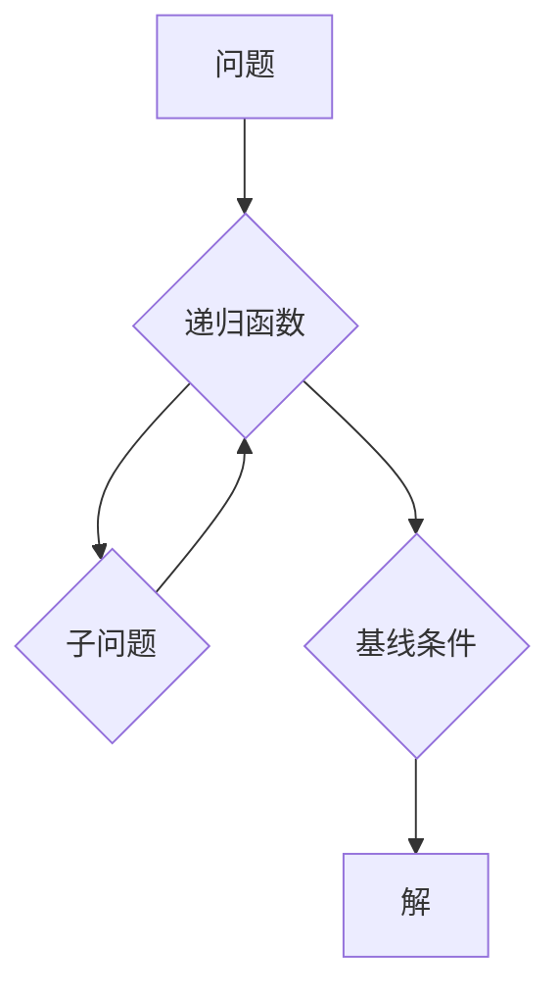

## 递归函数与可计算性理论

> 关键词：递归函数、可计算性、图灵机、递归、函数、算法、复杂度、理论计算机科学

## 1. 背景介绍

在计算机科学领域，算法是解决问题的核心。而递归函数作为一种强大的算法设计模式，在解决许多复杂问题时展现出独特的优势。它通过将问题分解成自身规模较小的子问题，并重复解决这些子问题，最终达到解决原问题的目的。

递归函数的概念源于数学领域，最早由数学家艾萨克·巴罗在19世纪提出。它在计算机科学中得到了广泛应用，尤其是在数据结构、人工智能、编译器设计等领域。

可计算性理论是计算机科学的一个重要分支，它研究哪些问题可以用算法解决。图灵机作为一种抽象的计算模型，被认为是所有可计算函数的通用模型。

## 2. 核心概念与联系

### 2.1 递归函数

递归函数是一种定义自身的方法，它通过将问题分解成自身规模较小的子问题，并重复解决这些子问题，最终达到解决原问题的目的。

**特点：**

* **自引用:** 函数在自身定义中被引用。
* **基线条件:** 终止递归的条件，避免无限循环。

**结构:**

```
function f(x):
  if base_case(x):
    return result
  else:
    return f(smaller_x)
```

### 2.2 可计算性

可计算性是指一个问题是否可以用算法解决。一个问题是可计算的，如果存在一个算法可以确定性地给出问题的解。

### 2.3 图灵机

图灵机是一种抽象的计算模型，它由一个无限长的带、一个读写头和一个状态机组成。图灵机可以模拟任何算法，因此被认为是所有可计算函数的通用模型。

**Mermaid 流程图:**



## 3. 核心算法原理 & 具体操作步骤

### 3.1 算法原理概述

递归算法的核心原理是将一个复杂问题分解成若干个相同或相似的子问题，然后递归地解决这些子问题，最终得到原问题的解。

**优点:**

* **简洁优雅:** 递归算法可以以简洁的代码实现复杂逻辑。
* **易于理解:** 递归算法的结构与数学归纳法类似，易于理解和分析。

**缺点:**

* **效率问题:** 递归算法可能会导致重复计算，降低效率。
* **栈溢出:** 递归深度过深可能会导致栈溢出错误。

### 3.2 算法步骤详解

1. **定义递归函数:** 
   * 函数名
   * 输入参数
   * 返回值类型
   * 函数体

2. **设置基线条件:** 
   * 终止递归的条件，避免无限循环。

3. **递归调用:** 
   * 将问题分解成自身规模较小的子问题，并递归地调用函数解决这些子问题。

4. **组合子结果:** 
   * 将子问题的解组合起来，得到原问题的解。

### 3.3 算法优缺点

**优点:**

* **简洁优雅:** 递归算法可以以简洁的代码实现复杂逻辑。
* **易于理解:** 递归算法的结构与数学归纳法类似，易于理解和分析。

**缺点:**

* **效率问题:** 递归算法可能会导致重复计算，降低效率。
* **栈溢出:** 递归深度过深可能会导致栈溢出错误。

### 3.4 算法应用领域

* **数据结构:** 树、图的遍历和操作
* **人工智能:** 搜索算法、决策树
* **编译器设计:** 语法分析、代码生成
* **数学计算:** 阶乘、斐波那契数列

## 4. 数学模型和公式 & 详细讲解 & 举例说明

### 4.1 数学模型构建

递归函数可以抽象为一个数学模型，其中：

* **状态:** 函数的当前执行状态。
* **转换函数:** 将当前状态转换为下一个状态的函数。
* **终止条件:** 结束递归的条件。

### 4.2 公式推导过程

**斐波那契数列:**

$$F(n) = \begin{cases}
0 & \text{if } n = 0 \\
1 & \text{if } n = 1 \\
F(n-1) + F(n-2) & \text{if } n > 1
\end{cases}$$

**推导过程:**

* **基线条件:** 当n=0或n=1时，F(n)分别为0和1。
* **递归关系:** 当n>1时，F(n)等于前两个斐波那契数的和。

### 4.3 案例分析与讲解

**阶乘:**

阶乘函数的递归定义为：

$$n! = \begin{cases}
1 & \text{if } n = 0 \\
n \times (n-1)! & \text{if } n > 0
\end{cases}$$

**分析:**

* 基线条件: 当n=0时，0! = 1。
* 递归关系: 当n>0时，n! 等于 n 与 (n-1)! 的乘积。

**举例:**

计算5!

* 5! = 5 * 4!
* 4! = 4 * 3!
* 3! = 3 * 2!
* 2! = 2 * 1!
* 1! = 1 * 0!
* 0! = 1

因此，5! = 5 * 4 * 3 * 2 * 1 = 120。

## 5. 项目实践：代码实例和详细解释说明

### 5.1 开发环境搭建

* 语言: Python
* IDE: VS Code

### 5.2 源代码详细实现

```python
def factorial(n):
  if n == 0:
    return 1
  else:
    return n * factorial(n-1)

# 计算5!
result = factorial(5)
print(f"5! = {result}")
```

### 5.3 代码解读与分析

* 函数 `factorial(n)` 计算 n 的阶乘。
* `if n == 0:` 是基线条件，当 n 为 0 时，返回 1。
* `else:` 是递归关系，当 n 大于 0 时，返回 n 与 `factorial(n-1)` 的乘积。
* `result = factorial(5)` 调用函数计算 5 的阶乘。
* `print(f"5! = {result}")` 打印结果。

### 5.4 运行结果展示

```
5! = 120
```

## 6. 实际应用场景

* **组合数学:** 计算排列组合数。
* **概率论:** 计算事件发生的概率。
* **数据分析:** 计算数据集中元素的重复次数。

### 6.4 未来应用展望

* **人工智能:** 在机器学习算法中，递归函数可以用于构建复杂的决策树和神经网络。
* **量子计算:** 递归函数可以用于设计量子算法，解决传统计算机难以解决的问题。

## 7. 工具和资源推荐

### 7.1 学习资源推荐

* **书籍:**
    * 《算法导论》
    * 《深入理解计算机系统》
* **在线课程:**
    * Coursera: 算法与数据结构
    * edX: 计算机科学导论

### 7.2 开发工具推荐

* **Python:** 
    * VS Code
    * PyCharm
* **其他语言:**
    * Java: Eclipse, IntelliJ IDEA
    * C++: Visual Studio, CLion

### 7.3 相关论文推荐

* **图灵机:** Alan Turing, On Computable Numbers, with an Application to the Entscheidungsproblem (1936)
* **递归函数:** John McCarthy, Recursive Functions of Symbolic Expressions and Their Computation by Machine, Part I (1960)

## 8. 总结：未来发展趋势与挑战

### 8.1 研究成果总结

递归函数是计算机科学中一个重要的概念，它为解决复杂问题提供了强大的工具。

### 8.2 未来发展趋势

* **更有效的递归算法:** 研究更有效的递归算法，提高效率和减少重复计算。
* **递归函数在量子计算中的应用:** 探索递归函数在量子计算中的应用，解决传统计算机难以解决的问题。

### 8.3 面临的挑战

* **栈溢出问题:** 深度递归可能会导致栈溢出错误，需要找到解决方法。
* **可读性和维护性:** 复杂的递归函数可能难以理解和维护，需要关注代码的可读性和可维护性。

### 8.4 研究展望

* **递归函数的理论研究:** 深入研究递归函数的理论性质，探索其更广泛的应用领域。
* **递归函数的实际应用:** 将递归函数应用于更实际的场景，例如人工智能、数据科学等领域。

## 9. 附录：常见问题与解答

* **什么是递归？** 递归是一种函数自调用自身的方法，用于解决问题分解成自身规模较小的子问题。
* **递归函数的基线条件是什么？** 基线条件是终止递归的条件，避免无限循环。
* **递归函数的优点和缺点是什么？** 优点: 简洁优雅，易于理解。缺点: 效率问题，栈溢出问题。


作者：禅与计算机程序设计艺术 / Zen and the Art of Computer Programming 
