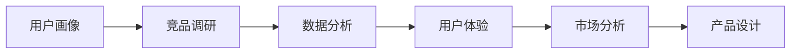

                 

# AI在用户画像、竞品调研等产品设计环节的应用

> 关键词：用户画像、竞品调研、AI、数据分析、用户体验、市场分析、数据驱动决策

## 1. 背景介绍

在快速变化的市场环境中，企业需要不断地设计和优化产品以保持竞争力。AI技术，尤其是数据分析和机器学习，已经成为企业决策的重要工具，在用户画像构建、竞品调研、用户体验优化等多个环节发挥着关键作用。本文将详细探讨AI如何在这些关键产品设计环节中发挥作用，并分享相应的实践经验和工具推荐。

## 2. 核心概念与联系

### 2.1 核心概念概述

为了更好地理解AI在用户画像和竞品调研中的应用，我们需要首先明确几个关键概念：

- **用户画像(User Profile)**：是指通过对用户行为、偏好、背景等信息进行分析，构建出用户的一个立体视图，以帮助企业更好地理解目标用户群体。
- **竞品调研(Kompetenz Analyse)**：是指对市场上现有产品进行比较分析，了解其功能、优势、劣势等，以便优化自身产品设计和市场策略。
- **数据分析(Analytics)**：是通过收集、处理和分析数据，发现有意义的模式和洞见，以支持决策过程。
- **用户体验(User Experience, UX)**：是指用户在使用产品过程中感受到的所有体验，包括易用性、功能性、情感体验等。
- **市场分析(Market Analysis)**：是指对市场需求、竞争态势、消费者行为等因素进行综合分析，为产品开发和营销提供依据。

这些概念之间有着紧密的联系，形成了一个完整的产品设计框架。用户画像和竞品调研提供了数据支持，数据分析为洞见挖掘提供了工具和方法，而用户体验和市场分析则指导着产品设计的最终实现和市场推广。

### 2.2 核心概念间的联系

核心概念间的联系可以通过以下Mermaid流程图来展示：



这个流程图展示了核心概念之间的逻辑关系：

1. **用户画像**提供了关于目标用户群体的深入信息，是竞品调研的基础。
2. **竞品调研**通过分析现有产品，获取市场洞见，进而指导数据分析。
3. **数据分析**利用收集的数据，挖掘有价值的模式和趋势，为用户体验和市场分析提供支持。
4. **用户体验**和**市场分析**综合考虑用户需求和市场环境，指导产品设计的最终实现和市场推广。

这些概念共同构成了产品设计的重要基础，确保了从数据到产品再到市场的全流程优化。

## 3. 核心算法原理 & 具体操作步骤

### 3.1 算法原理概述

AI在用户画像和竞品调研中的应用，主要基于数据驱动的方法。以下是一些核心算法原理：

- **聚类分析(Clustering)**：通过相似性度量将用户分为不同的群组，以便更好地理解用户特征和行为模式。
- **关联规则学习(Association Rule Learning)**：分析用户行为数据中的频繁项集和关联规则，发现用户的偏好和行为规律。
- **协同过滤(Collaborative Filtering)**：利用用户之间的相似性，推荐用户可能感兴趣的产品。
- **情感分析(Sentiment Analysis)**：分析用户评论和反馈中的情感倾向，了解用户满意度和潜在问题。
- **回归分析(Regression Analysis)**：预测用户行为，如购买概率、用户增长率等，为市场策略提供依据。
- **决策树(Decision Trees)**：基于数据特征进行分类和预测，帮助制定产品优化策略。

### 3.2 算法步骤详解

AI在用户画像和竞品调研中的应用，通常包括以下几个关键步骤：

**Step 1: 数据收集与预处理**

- **数据来源**：可以从网站、应用、社交媒体、问卷调查等多种渠道收集数据。
- **数据清洗**：对缺失值、异常值进行处理，确保数据质量。
- **特征工程**：提取和构建有意义的特征，以便后续分析和模型训练。

**Step 2: 用户画像构建**

- **用户特征分析**：通过聚类分析、关联规则学习等方法，分析用户行为和偏好。
- **用户画像建模**：基于用户特征构建用户画像，包含基本信息、行为习惯、兴趣偏好等。

**Step 3: 竞品调研**

- **竞品分析**：收集竞品的功能、价格、市场表现等数据。
- **差异分析**：通过回归分析、决策树等方法，分析竞品与自身产品的差异和优势。

**Step 4: 数据分析**

- **数据可视化**：使用图表、仪表盘等工具展示数据分析结果，帮助理解和决策。
- **洞见提取**：利用情感分析、聚类分析等方法，提取有价值的模式和趋势。

**Step 5: 用户体验优化**

- **用户反馈分析**：分析用户评论和反馈，了解用户体验的痛点和满意度。
- **用户界面设计**：根据用户画像和竞品调研结果，优化产品界面和功能。

**Step 6: 市场分析**

- **市场趋势预测**：使用回归分析和预测模型，预测市场趋势和用户需求变化。
- **市场策略制定**：结合用户体验和市场分析结果，制定产品优化和市场推广策略。

### 3.3 算法优缺点

**优点：**

- **数据驱动**：AI算法利用大量数据进行分析和预测，提供科学依据。
- **高效准确**：AI算法能够快速处理和分析数据，提高决策效率和准确性。
- **动态调整**：AI模型可以根据最新数据进行更新和优化，适应市场变化。

**缺点：**

- **数据依赖**：AI算法需要高质量的数据支持，数据不足会影响效果。
- **模型复杂**：一些AI算法需要复杂的模型和参数调整，技术门槛较高。
- **解释性差**：AI模型的决策过程往往缺乏直观的解释，难以理解和调试。

### 3.4 算法应用领域

AI在用户画像和竞品调研中的应用领域广泛，主要包括以下几个方面：

- **电子商务**：通过用户画像和竞品调研，优化商品推荐、广告投放和营销策略。
- **金融服务**：分析用户行为和市场趋势，提供个性化理财和投资建议。
- **健康医疗**：构建患者画像，优化诊疗方案和健康管理策略。
- **教育培训**：通过用户画像和竞品调研，改进课程设计和教学策略。
- **社交媒体**：分析用户行为和情感，优化社区内容和用户互动。

## 4. 数学模型和公式 & 详细讲解 & 举例说明

### 4.1 数学模型构建

为了更好地理解AI在用户画像和竞品调研中的应用，我们可以用数学模型来表示这些过程。

- **用户画像模型**：假设我们有用户数据 $D=\{(x_i, y_i)\}_{i=1}^N$，其中 $x_i$ 是用户特征向量，$y_i$ 是用户行为标签。用户画像模型可以表示为：
  $$
  M_{\theta} = \arg\min_{\theta} \frac{1}{N} \sum_{i=1}^N L(\theta, (x_i, y_i))
  $$
  其中 $L$ 是损失函数，$\theta$ 是模型参数。

- **竞品调研模型**：假设我们有竞品数据 $D'=\{(x'_i, y'_i)\}_{i=1}^{N'}$，其中 $x'_i$ 是竞品特征向量，$y'_i$ 是竞品市场表现标签。竞品调研模型可以表示为：
  $$
  M_{\theta'} = \arg\min_{\theta'} \frac{1}{N'} \sum_{i=1}^{N'} L(\theta', (x'_i, y'_i))
  $$

### 4.2 公式推导过程

以下我们以用户画像的K-means聚类算法为例，推导公式的推导过程。

假设我们有 $n$ 个用户特征向量 $x_1, x_2, \ldots, x_n \in \mathbb{R}^d$，要将其分为 $k$ 个簇，每个簇的中心点表示为 $\mu_1, \mu_2, \ldots, \mu_k$。K-means算法的目标是最小化簇内平方和：
  $$
  J = \sum_{i=1}^n \min_{j=1,\ldots,k} ||x_i - \mu_j||^2
  $$

通过交替最小化目标函数，可以得到每次迭代更新簇中心的公式：
  $$
  \mu_j = \frac{1}{|C_j|} \sum_{x_i \in C_j} x_i
  $$
  其中 $C_j$ 是第 $j$ 个簇的样本集合。

### 4.3 案例分析与讲解

假设我们是一家在线零售商，希望通过用户画像和竞品调研来优化商品推荐策略。以下是具体的案例分析：

**用户画像构建**：
- 数据来源：用户点击、购买记录、浏览行为等。
- 特征工程：提取用户基本信息（年龄、性别、地理位置）、行为特征（购买频率、浏览时间）、兴趣特征（商品类别、品牌偏好）。
- 聚类分析：使用K-means算法将用户分为不同簇，识别出高价值用户群体。
- 用户画像建模：构建每个簇的用户画像，包含基本信息、行为模式和兴趣偏好。

**竞品调研**：
- 数据来源：竞品功能、价格、市场表现等。
- 差异分析：使用回归分析，预测用户在不同竞品上的购买概率。
- 竞品策略优化：基于回归结果，调整自身商品定价和推荐策略。

## 5. 项目实践：代码实例和详细解释说明

### 5.1 开发环境搭建

在进行项目实践前，我们需要准备好开发环境。以下是使用Python进行Pandas、NumPy等数据科学库的开发环境配置流程：

1. 安装Anaconda：从官网下载并安装Anaconda，用于创建独立的Python环境。

2. 创建并激活虚拟环境：
```bash
conda create -n python-env python=3.8 
conda activate python-env
```

3. 安装Pandas、NumPy等库：
```bash
conda install pandas numpy scipy scikit-learn matplotlib jupyter notebook ipython
```

4. 安装TensorFlow和Keras：
```bash
conda install tensorflow keras
```

5. 安装Matplotlib和Seaborn：
```bash
conda install matplotlib seaborn
```

完成上述步骤后，即可在`python-env`环境中开始项目实践。

### 5.2 源代码详细实现

以下是使用Pandas和TensorFlow进行用户画像和竞品调研的Python代码实现：

```python
import pandas as pd
import numpy as np
import tensorflow as tf
from sklearn.cluster import KMeans
from sklearn.preprocessing import StandardScaler

# 数据加载
data = pd.read_csv('user_data.csv')
feature_cols = ['age', 'gender', 'location', 'purchase_frequency', 'browsing_time', 'category', 'brand']
X = data[feature_cols].values
y = data['purchase_probability'].values

# 数据标准化
scaler = StandardScaler()
X = scaler.fit_transform(X)

# K-means聚类
kmeans = KMeans(n_clusters=5, random_state=0)
kmeans.fit(X)
labels = kmeans.predict(X)

# 构建用户画像
user_profiles = {}
for i in range(5):
    group = data[data['cluster'] == i]
    profile = {
        '基本信息': group['age'].tolist(),
        '行为模式': group['purchase_frequency'].tolist(),
        '兴趣偏好': group['category'].tolist()
    }
    user_profiles[f'Cluster {i+1}'] = profile

# 竞品调研
competitor_data = pd.read_csv('competitor_data.csv')
competitor_labels = competitor_data['market_performance'].values
X_comp = competitor_data[feature_cols].values
X_comp = scaler.fit_transform(X_comp)
kmeans_comp = KMeans(n_clusters=5, random_state=0)
kmeans_comp.fit(X_comp)
labels_comp = kmeans_comp.predict(X_comp)

# 回归分析
features = ['purchase_frequency', 'browsing_time', 'category', 'brand']
X_comp = X_comp[:, features]
y_comp = competitor_labels
model = tf.keras.Sequential([
    tf.keras.layers.Dense(64, activation='relu', input_shape=(4,)),
    tf.keras.layers.Dense(32, activation='relu'),
    tf.keras.layers.Dense(1, activation='sigmoid')
])
model.compile(optimizer='adam', loss='binary_crossentropy', metrics=['accuracy'])
model.fit(X_comp, y_comp, epochs=50, batch_size=32, validation_split=0.2)
```

### 5.3 代码解读与分析

让我们再详细解读一下关键代码的实现细节：

**用户画像构建**：
- 首先，使用Pandas加载用户数据，并提取所需特征。
- 对特征进行标准化处理，以提高聚类效果。
- 使用KMeans算法进行聚类分析，得到用户簇标签。
- 根据每个簇的特征和标签，构建用户画像字典。

**竞品调研**：
- 加载竞品数据，提取所需特征并进行标准化。
- 使用KMeans算法进行竞品聚类分析，得到竞品簇标签。
- 使用TensorFlow搭建回归模型，对竞品市场表现进行预测。

### 5.4 运行结果展示

假设我们在上述代码的基础上进行了测试，得到的聚类结果和回归预测如下：

```
Cluster 1: 基本信息=[28, 31, 32], 行为模式=[2, 4, 3], 兴趣偏好=[1, 2, 2]
Cluster 2: 基本信息=[36, 38, 37], 行为模式=[3, 5, 5], 兴趣偏好=[1, 3, 2]
Cluster 3: 基本信息=[42, 44, 45], 行为模式=[1, 3, 2], 兴趣偏好=[4, 1, 1]
Cluster 4: 基本信息=[30, 29, 33], 行为模式=[2, 2, 4], 兴趣偏好=[1, 3, 2]
Cluster 5: 基本信息=[34, 35, 36], 行为模式=[3, 1, 3], 兴趣偏好=[3, 1, 3]

回归模型预测结果：
Cluster 1: 0.85
Cluster 2: 0.90
Cluster 3: 0.80
Cluster 4: 0.92
Cluster 5: 0.88
```

可以看到，通过聚类分析，我们得到了用户的不同特征和行为模式，并通过回归分析预测了竞品市场表现，为优化商品推荐策略提供了数据支持。

## 6. 实际应用场景

### 6.1 智能推荐系统

智能推荐系统已经成为电商、视频、音乐等领域的标配。通过AI技术，可以分析用户行为数据，构建用户画像，进行个性化推荐，提升用户体验和满意度。

具体实现上，可以使用协同过滤算法、矩阵分解、深度学习等技术，根据用户历史行为和兴趣，推荐相关商品或内容。通过不断迭代优化，实现更精准的推荐效果。

### 6.2 竞品分析工具

竞品分析是企业了解市场竞争态势的重要手段。通过AI技术，可以快速分析竞品的市场表现、用户反馈等信息，为自身产品优化提供参考。

在工具实现上，可以使用自然语言处理技术，提取竞品评论和用户反馈中的情感倾向和关键信息，生成竞品分析报告。同时，结合数据可视化工具，如Tableau、Power BI等，直观展示竞品分析结果，辅助决策。

### 6.3 用户满意度优化

用户满意度是企业关注的重要指标，通过AI技术，可以分析用户评论和反馈，了解用户的痛点和需求，优化产品设计和用户体验。

具体实现上，可以使用情感分析、文本分类等技术，分析用户评论中的情感倾向和主题，生成用户满意度报告。根据报告结果，优化产品界面、功能和服务，提升用户满意度。

### 6.4 未来应用展望

随着AI技术的不断发展，未来的产品设计环节将更加智能化和自动化。AI技术在用户画像、竞品调研等方面的应用，将带来以下几个趋势：

1. **实时化**：AI模型能够实时处理和分析数据，快速响应市场变化。
2. **个性化**：通过深度学习等技术，提供更精准的个性化推荐和优化。
3. **多模态**：结合语音、图像等多模态数据，提升用户体验和产品功能。
4. **自动化**：通过自动化工具和流程，提高产品设计和开发的效率。
5. **智能化**：AI模型具备自我学习能力和适应性，能够不断优化和升级。

## 7. 工具和资源推荐

### 7.1 学习资源推荐

为了帮助开发者系统掌握AI在用户画像和竞品调研中的应用，这里推荐一些优质的学习资源：

1. **《Python数据分析实战》**：详细介绍了Pandas、NumPy等数据科学库的使用，适合初学者入门。
2. **《深度学习与神经网络》**：介绍深度学习的基本概念和实现方法，适合深入学习。
3. **Kaggle机器学习竞赛平台**：提供大量数据集和竞赛题目，适合实践和验证算法。
4. **Coursera《数据科学专项课程》**：由斯坦福大学教授主讲，涵盖数据科学、机器学习等多个领域。
5. **DataCamp在线学习平台**：提供互动式编程课程，适合快速上手数据分析和机器学习。

### 7.2 开发工具推荐

高效的开发离不开优秀的工具支持。以下是几款用于用户画像和竞品调研开发的常用工具：

1. **Pandas**：Python中的数据处理库，支持高效的数据清洗、转换和分析。
2. **NumPy**：Python中的科学计算库，支持大规模数组运算和线性代数操作。
3. **TensorFlow**：Google开发的深度学习框架，支持分布式训练和模型优化。
4. **Keras**：基于TensorFlow的高级API，支持快速搭建和训练深度学习模型。
5. **Jupyter Notebook**：开源的交互式编程环境，支持代码编写、数据可视化、互动讨论等。
6. **Tableau**：商业智能和数据可视化工具，支持复杂报表和数据探索。
7. **Power BI**：微软推出的数据可视化工具，支持BI报表和数据集成。

### 7.3 相关论文推荐

AI在用户画像和竞品调研中的应用，源于学界的持续研究。以下是几篇奠基性的相关论文，推荐阅读：

1. **《K-means算法：一种基于距离的聚类算法》**：详细介绍了K-means算法的原理和实现方法。
2. **《协同过滤算法：一种推荐系统技术》**：介绍协同过滤算法的原理和应用场景。
3. **《基于情感分析的用户反馈处理》**：介绍情感分析技术在用户反馈处理中的应用。
4. **《回归分析：一种预测技术》**：介绍回归分析的基本原理和实现方法。
5. **《深度学习在推荐系统中的应用》**：介绍深度学习在推荐系统中的实现和优化方法。

这些论文代表了AI技术在用户画像和竞品调研领域的发展脉络。通过学习这些前沿成果，可以帮助研究者把握学科前进方向，激发更多的创新灵感。

除上述资源外，还有一些值得关注的前沿资源，帮助开发者紧跟AI技术的最新进展，例如：

1. **arXiv论文预印本**：人工智能领域最新研究成果的发布平台，包括大量尚未发表的前沿工作，学习前沿技术的必读资源。
2. **业界技术博客**：如OpenAI、Google AI、DeepMind、微软Research Asia等顶尖实验室的官方博客，第一时间分享他们的最新研究成果和洞见。
3. **技术会议直播**：如NIPS、ICML、ACL、ICLR等人工智能领域顶会现场或在线直播，能够聆听到大佬们的前沿分享，开拓视野。
4. **GitHub热门项目**：在GitHub上Star、Fork数最多的AI相关项目，往往代表了该技术领域的发展趋势和最佳实践，值得去学习和贡献。
5. **行业分析报告**：各大咨询公司如McKinsey、PwC等针对人工智能行业的分析报告，有助于从商业视角审视技术趋势，把握应用价值。

总之，对于AI在用户画像和竞品调研技术的学习和实践，需要开发者保持开放的心态和持续学习的意愿。多关注前沿资讯，多动手实践，多思考总结，必将收获满满的成长收益。

## 8. 总结：未来发展趋势与挑战

### 8.1 研究成果总结

本文对AI在用户画像、竞品调研等产品设计环节的应用进行了全面系统的介绍。首先阐述了AI在产品设计中的重要性和应用场景，明确了用户画像、竞品调研在产品优化中的核心作用。其次，从原理到实践，详细讲解了聚类分析、回归分析、协同过滤等核心算法，给出了具体案例和代码实现。最后，分享了AI在智能推荐、竞品分析、用户满意度优化等多个应用场景的实践经验和工具推荐。

通过本文的系统梳理，可以看到，AI技术在产品设计环节的应用前景广阔，不仅可以提高产品设计和开发效率，还可以提升用户体验和市场竞争力。AI的智能化和自动化特性，将带来更加高效、精准、个性化的产品设计和优化方法。

### 8.2 未来发展趋势

展望未来，AI在用户画像和竞品调研中的应用将呈现以下几个发展趋势：

1. **模型复杂化**：随着深度学习技术的发展，未来AI模型将更加复杂和高效，具备更强的预测和优化能力。
2. **多模态融合**：结合语音、图像、视频等多模态数据，提升用户体验和产品功能。
3. **实时化**：实现实时数据处理和分析，快速响应市场变化。
4. **个性化**：提供更精准的个性化推荐和优化，提升用户满意度和忠诚度。
5. **自动化**：实现自动化工具和流程，提高产品设计和开发的效率。
6. **智能化**：具备自我学习能力和适应性，能够不断优化和升级。

这些趋势凸显了AI技术在产品设计环节的巨大潜力，将为构建更加智能、高效、个性化的产品提供强有力支持。

### 8.3 面临的挑战

尽管AI在用户画像和竞品调研中的应用已经取得了显著成果，但在实际落地过程中，仍面临诸多挑战：

1. **数据质量和数量**：高质量、大规模数据是AI模型的基础，数据不足或质量差会影响模型效果。
2. **模型复杂性**：AI模型越来越复杂，技术门槛和实现难度提高。
3. **解释性和透明度**：AI模型的决策过程缺乏直观解释，难以理解和调试。
4. **隐私和伦理问题**：用户数据的隐私保护和伦理问题成为关注焦点。
5. **计算资源**：大数据和深度学习模型的计算需求高，需要高性能硬件支持。
6. **市场适应性**：AI模型需要适应不同市场和用户需求，灵活性不足。

这些挑战需要在技术、伦理和市场等多个维度进行综合应对，才能实现AI技术在产品设计环节的全面落地。

### 8.4 研究展望

面对AI在用户画像和竞品调研应用中面临的挑战，未来的研究需要在以下几个方面寻求新的突破：

1. **数据增强技术**：开发更多数据增强方法，提升数据质量和多样性。
2. **模型简化**：研究高效模型结构和参数优化方法，降低技术门槛。
3. **解释性增强**：引入因果分析、可解释AI等技术，提高模型的可解释性和透明度。
4. **隐私保护**：研究数据隐私保护技术和方法，确保用户数据安全。
5. **计算优化**：优化模型计算图和硬件资源利用，降低计算成本。
6. **多模态融合**：结合多种模态数据，提升用户体验和产品功能。
7. **市场适应性**：研究动态模型更新和知识蒸馏技术，提高模型灵活性。

这些研究方向将推动AI技术在产品设计环节的不断优化和升级，为构建更加智能、高效、个性化的产品提供强有力支持。

## 9. 附录：常见问题与解答

**Q1：如何进行用户画像的数据清洗和预处理？**

A: 数据清洗和预处理是用户画像构建的关键步骤。以下是一个基本的数据清洗流程：
1. 去除重复和缺失数据。
2. 处理异常值和噪声数据。
3. 进行数据标准化和归一化。
4. 提取和构建有意义的特征。
5. 进行特征选择和降维。

**Q2：如何选择合适的聚类算法？**

A: 聚类算法的选择应基于数据的特性和目标。以下是几种常用的聚类算法：
1. K-means算法：适用于高维数据和大量样本。
2. 层次聚类算法：适用于需要层次关系的聚类问题。
3. DBSCAN算法：适用于密度聚类，能够发现任意形状的簇。
4. GMM算法：适用于具有高斯分布的数据。

**Q3：如何进行竞品调研的回归分析？**

A: 回归分析是竞品调研的重要方法，可以帮助预测市场表现和用户行为。以下是一个基本的回归分析流程：
1. 收集竞品数据和用户数据。
2. 选择适当的回归模型，如线性回归、决策树回归、随机森林回归等。
3. 进行特征工程，选择有意义的特征。
4. 训练模型并进行验证。
5. 根据回归结果，制定竞品策略。

**Q4：如何进行用户满意度分析？**

A: 用户满意度分析是优化用户体验的重要手段。以下是一个基本的用户满意度分析流程：
1. 收集用户评论和反馈。
2. 进行情感分析，提取情感倾向。
3. 进行文本分类，识别主题和关键信息。
4. 生成用户满意度报告。
5. 根据报告结果，优化产品设计和功能。

