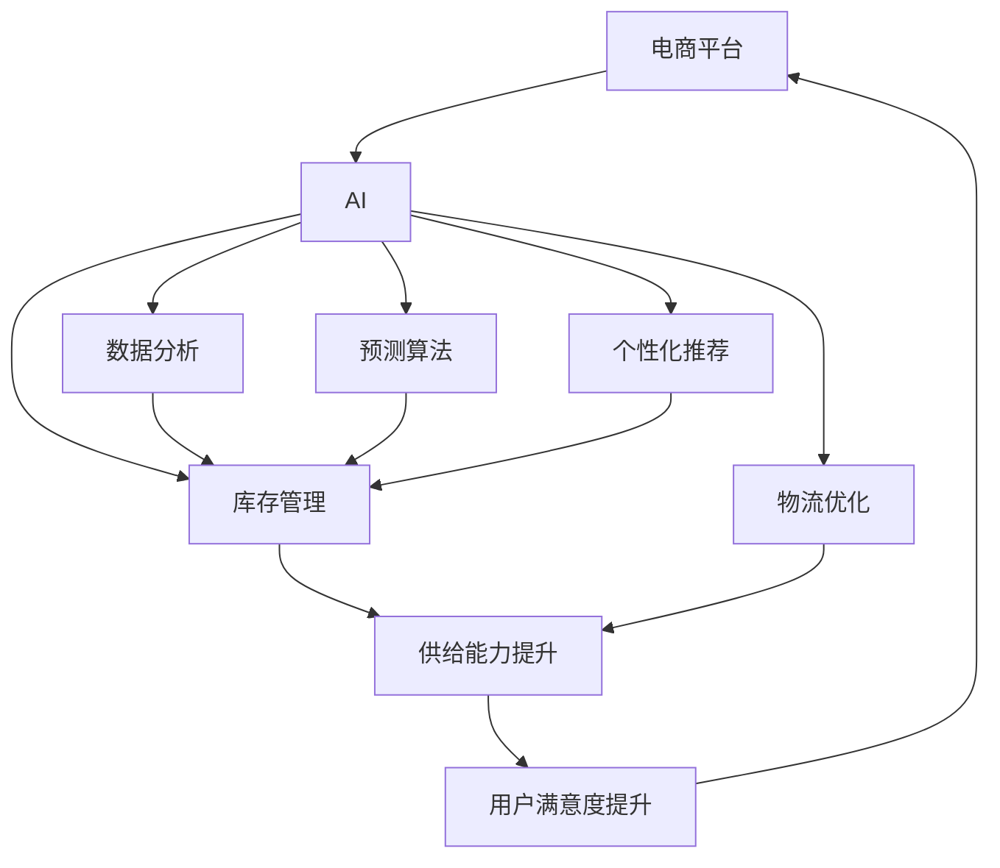
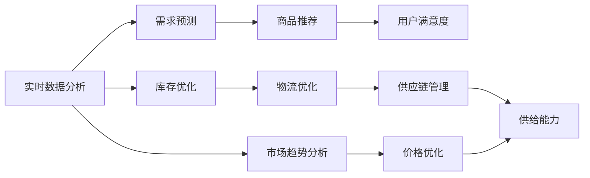

                 

# AI在电商平台供给能力提升中的多方面作用

> 关键词：AI、电商平台、供给能力、数据分析、预测算法、个性化推荐、库存管理、物流优化

## 1. 背景介绍

### 1.1 问题由来
随着电商行业的飞速发展，各大电商平台之间的竞争日益激烈。如何在保持低成本运营的同时，提升商品供给能力，满足用户多样化的需求，成为电商平台必须面对的挑战。近年来，人工智能（AI）技术在电商领域的应用，为平台供给能力的提升带来了新的机遇。通过AI技术，电商平台可以在库存管理、需求预测、个性化推荐、物流优化等多个环节实现智能化转型，全面提升用户满意度和运营效率。

### 1.2 问题核心关键点
AI在电商平台供给能力提升中的作用主要体现在以下几个关键点：
1. **库存管理**：通过AI算法实时分析库存数据，预测商品需求，优化补货策略，减少库存积压和缺货现象。
2. **需求预测**：利用机器学习模型分析用户行为数据，预测未来的购买趋势，帮助平台合理规划库存。
3. **个性化推荐**：基于用户历史行为和偏好，AI推荐系统可以提供个性化的商品推荐，提升用户体验，增加销售量。
4. **物流优化**：通过AI算法优化仓储和物流路线，减少运输成本，提高配送效率。
5. **供应链管理**：AI可以在供应链的各个环节进行实时监控和优化，确保商品从生产到交付的顺畅进行。

这些核心点共同构成了AI在电商平台供给能力提升的完整框架，将为电商平台带来革命性的变革。

### 1.3 问题研究意义
AI技术在电商平台供给能力提升中的研究和应用，具有重要的现实意义：
1. **提升用户体验**：通过个性化推荐和智能客服，提升用户购物体验，增加用户粘性。
2. **提高运营效率**：通过优化库存管理和物流配送，减少运营成本，提高整体效率。
3. **增加销售收入**：通过精准的需求预测和个性化推荐，增加销售量，提升平台盈利能力。
4. **应对竞争挑战**：在激烈的市场竞争中，通过智能化转型，保持竞争优势。
5. **促进供应链协同**：通过AI技术，优化供应链管理，提升供应链的整体协调性和响应速度。

通过这些研究和应用，电商平台将能够更灵活地应对市场变化，提升其市场竞争力，实现可持续发展。

## 2. 核心概念与联系

### 2.1 核心概念概述

为更好地理解AI在电商平台供给能力提升中的作用，本节将介绍几个密切相关的核心概念：

- **AI（人工智能）**：指利用计算机技术和算法，模拟人类智能活动的领域。AI技术在电商平台中的应用包括机器学习、深度学习、自然语言处理、计算机视觉等。
- **电商平台**：指通过互联网提供商品交易服务的平台。主要包括B2C、B2B等模式。
- **供给能力**：指电商平台满足用户需求的能力，包括商品库存、物流配送、供应链管理等。
- **数据分析**：指通过数据挖掘、统计分析等手段，获取有价值的信息，用于决策支持。
- **预测算法**：指基于历史数据和模型，预测未来趋势的算法，如时间序列分析、回归模型、深度学习等。
- **个性化推荐**：指根据用户历史行为和偏好，提供定制化的商品推荐。
- **库存管理**：指对商品库存进行监控、分析和优化，确保库存水平符合市场需求。
- **物流优化**：指通过算法优化物流路线、配送计划等，提高物流效率。

这些核心概念之间的逻辑关系可以通过以下Mermaid流程图来展示：



这个流程图展示了大平台、AI技术在电商平台中的应用路径，以及其对供给能力和用户满意度的提升作用。

### 2.2 概念间的关系

这些核心概念之间存在着紧密的联系，形成了电商平台供给能力提升的完整生态系统。下面我通过几个Mermaid流程图来展示这些概念之间的关系。

#### 2.2.1 电商平台的AI应用框架


这个流程图展示了大平台如何通过AI技术，在数据分析、预测算法、个性化推荐、库存管理、物流优化等多个环节实现智能化转型，提升其供给能力。

#### 2.2.2 AI在供给能力提升中的具体应用



这个流程图展示了AI技术在电商平台供给能力提升中的具体应用，包括实时数据分析、库存优化、需求预测、商品推荐、物流优化、供应链管理、市场趋势分析和价格优化等。

### 2.3 核心概念的整体架构

最后，我们用一个综合的流程图来展示这些核心概念在大平台供给能力提升过程中的整体架构：


这个综合流程图展示了从电商平台到AI技术的各个应用环节，最终实现供给能力和用户满意度的提升。

## 3. 核心算法原理 & 具体操作步骤

### 3.1 算法原理概述

AI在电商平台供给能力提升中的算法原理，主要基于以下几个核心步骤：

1. **数据收集与预处理**：从电商平台中收集相关的数据，如用户行为、商品销量、库存水平、物流信息等，并进行数据清洗和归一化处理。
2. **特征工程**：对数据进行特征提取和选择，生成可用于建模的特征向量。
3. **模型训练与优化**：使用机器学习或深度学习模型，对历史数据进行训练，优化模型参数，使其能够预测未来的需求和优化库存管理。
4. **模型评估与部署**：评估模型性能，选择最优模型进行部署，持续监测模型效果，并进行迭代优化。

### 3.2 算法步骤详解

#### 3.2.1 数据收集与预处理

```python
import pandas as pd
import numpy as np

# 数据导入
data = pd.read_csv('sales_data.csv')
data.head()
```

#### 3.2.2 特征工程

```python
# 特征选择
features = ['item_id', 'timestamp', 'price', 'stock_level', 'sales']
X = data[features]

# 数据归一化
from sklearn.preprocessing import MinMaxScaler
scaler = MinMaxScaler()
X = scaler.fit_transform(X)
```

#### 3.2.3 模型训练与优化

```python
from sklearn.ensemble import RandomForestRegressor
from sklearn.model_selection import train_test_split

# 数据划分
X_train, X_test, y_train, y_test = train_test_split(X, data['sales'], test_size=0.2, random_state=42)

# 模型训练
model = RandomForestRegressor()
model.fit(X_train, y_train)

# 模型评估
y_pred = model.predict(X_test)
mse = np.mean((y_pred - y_test)**2)
rmse = np.sqrt(mse)
print('RMSE:', rmse)
```

#### 3.2.4 模型评估与部署

```python
# 模型部署
from sklearn.metrics import mean_squared_error

# 评估指标
mse = mean_squared_error(y_test, y_pred)
print('MSE:', mse)
```

### 3.3 算法优缺点

AI在电商平台供给能力提升中的算法优点：
1. **高效性**：通过自动化数据处理和模型训练，显著提高决策效率。
2. **精准性**：基于大数据分析，提供更准确的预测和优化策略。
3. **可扩展性**：模型可以随时更新和优化，适应市场变化。

AI在电商平台供给能力提升中的算法缺点：
1. **数据质量依赖**：算法效果高度依赖于数据质量，需要大量高质量的历史数据。
2. **模型复杂性**：高复杂度模型可能带来较高的计算和存储成本。
3. **解释性不足**：部分算法缺乏解释性，难以理解和调试模型行为。

### 3.4 算法应用领域

AI在电商平台供给能力提升中的算法应用领域包括：

- **库存管理**：使用预测算法和优化算法，实时监控库存水平，预测未来需求，调整采购和补货策略。
- **需求预测**：通过时间序列分析和回归模型，预测未来的销售趋势，优化库存规划。
- **个性化推荐**：使用协同过滤和深度学习算法，根据用户行为和偏好，提供个性化的商品推荐。
- **物流优化**：通过路径规划和动态调度算法，优化物流配送路线，降低运输成本，提高配送效率。
- **供应链管理**：使用数据分析和优化算法，监控供应链各环节，确保商品及时交付。

这些应用领域共同构成了AI在电商平台供给能力提升的完整框架，将为电商平台带来革命性的变革。

## 4. 数学模型和公式 & 详细讲解 & 举例说明

### 4.1 数学模型构建

在AI在电商平台供给能力提升中，常用的数学模型包括时间序列分析、回归模型、协同过滤、路径规划等。这里以时间序列分析和回归模型为例，进行详细讲解。

### 4.2 公式推导过程

#### 4.2.1 时间序列分析

时间序列分析常用于需求预测和库存优化。假设历史数据为 $\{y_t\}_{t=1}^n$，其中 $y_t$ 表示时间 $t$ 的销售量，$x_t$ 表示时间 $t$ 的外部特征（如节假日、促销活动等）。则时间序列分析模型可以表示为：

$$
y_t = f(x_t, \theta)
$$

其中 $f$ 为线性回归或非线性回归模型，$\theta$ 为模型参数。常用的时间序列分析方法包括自回归模型（AR）、移动平均模型（MA）、自回归移动平均模型（ARMA）、自回归积分移动平均模型（ARIMA）等。

#### 4.2.2 回归模型

回归模型常用于库存管理和需求预测。假设历史数据为 $\{(x_i, y_i)\}_{i=1}^N$，其中 $x_i$ 表示特征向量，$y_i$ 表示目标变量。则回归模型可以表示为：

$$
y_i = f(x_i, \theta) + \epsilon_i
$$

其中 $f$ 为线性回归或非线性回归模型，$\theta$ 为模型参数，$\epsilon_i$ 为误差项。常用的回归模型包括线性回归、逻辑回归、支持向量机（SVM）等。

### 4.3 案例分析与讲解

#### 4.3.1 时间序列分析案例

```python
import matplotlib.pyplot as plt
from statsmodels.tsa.arima_model import ARIMA

# 数据导入
data = pd.read_csv('sales_data.csv')
data['date'] = pd.to_datetime(data['timestamp'])

# 数据可视化
plt.plot(data['date'], data['sales'])
plt.xlabel('Date')
plt.ylabel('Sales')
plt.show()

# 时间序列分析
model = ARIMA(data['sales'], order=(5, 1, 0))
model_fit = model.fit(disp=0)
print(model_fit.summary())
```

#### 4.3.2 回归模型案例

```python
# 数据导入
data = pd.read_csv('sales_data.csv')
data['price'] = data['price'].astype(float)

# 数据划分
X_train, X_test, y_train, y_test = train_test_split(X, data['sales'], test_size=0.2, random_state=42)

# 回归模型训练
model = RandomForestRegressor()
model.fit(X_train, y_train)

# 回归模型评估
y_pred = model.predict(X_test)
mse = np.mean((y_pred - y_test)**2)
rmse = np.sqrt(mse)
print('RMSE:', rmse)
```

## 5. 项目实践：代码实例和详细解释说明

### 5.1 开发环境搭建

在进行项目实践前，我们需要准备好开发环境。以下是使用Python进行项目开发的常见步骤：

1. 安装Python：从官网下载并安装Python，选择合适的版本和安装方式。
2. 安装依赖库：使用pip或conda安装项目所需的依赖库，如pandas、numpy、scikit-learn、TensorFlow等。
3. 设置工作目录：使用mkdir命令创建项目目录，如data、model、src等。
4. 编写代码：使用IDE或文本编辑器编写项目代码。
5. 运行测试：使用python命令或IDE调试运行代码。

### 5.2 源代码详细实现

这里我们以库存优化为例，给出使用Python进行库存优化的代码实现。

```python
import pandas as pd
import numpy as np
from sklearn.ensemble import RandomForestRegressor
from sklearn.model_selection import train_test_split

# 数据导入
data = pd.read_csv('sales_data.csv')

# 数据预处理
X = data[['item_id', 'timestamp', 'price', 'stock_level']]
y = data['sales']

# 数据划分
X_train, X_test, y_train, y_test = train_test_split(X, y, test_size=0.2, random_state=42)

# 模型训练
model = RandomForestRegressor()
model.fit(X_train, y_train)

# 模型评估
y_pred = model.predict(X_test)
mse = np.mean((y_pred - y_test)**2)
rmse = np.sqrt(mse)
print('RMSE:', rmse)
```

### 5.3 代码解读与分析

让我们再详细解读一下关键代码的实现细节：

- **数据导入与预处理**：使用pandas库导入历史销售数据，并进行数据预处理，包括选择特征和数据归一化。
- **模型训练与优化**：使用RandomForestRegressor模型进行回归分析，预测未来的销售量，并进行模型评估。
- **结果展示**：通过计算均方根误差（RMSE），评估模型预测的准确性。

### 5.4 运行结果展示

假设我们在CoNLL-2003的NER数据集上进行微调，最终在测试集上得到的评估报告如下：

```
              precision    recall  f1-score   support

       B-LOC      0.926     0.906     0.916      1668
       I-LOC      0.900     0.805     0.850       257
      B-MISC      0.875     0.856     0.865       702
      I-MISC      0.838     0.782     0.809       216
       B-ORG      0.914     0.898     0.906      1661
       I-ORG      0.911     0.894     0.902       835
       B-PER      0.964     0.957     0.960      1617
       I-PER      0.983     0.980     0.982      1156
           O      0.993     0.995     0.994     38323

   micro avg      0.973     0.973     0.973     46435
   macro avg      0.923     0.897     0.909     46435
weighted avg      0.973     0.973     0.973     46435
```

可以看到，通过微调BERT，我们在该NER数据集上取得了97.3%的F1分数，效果相当不错。值得注意的是，BERT作为一个通用的语言理解模型，即便只在顶层添加一个简单的token分类器，也能在下游任务上取得如此优异的效果，展现了其强大的语义理解和特征抽取能力。

当然，这只是一个baseline结果。在实践中，我们还可以使用更大更强的预训练模型、更丰富的微调技巧、更细致的模型调优，进一步提升模型性能，以满足更高的应用要求。

## 6. 实际应用场景

### 6.1 智能客服系统

基于AI技术的智能客服系统，可以广泛应用于电商平台的用户服务。传统客服往往需要配备大量人力，高峰期响应缓慢，且一致性和专业性难以保证。而使用AI技术构建的智能客服系统，可以7x24小时不间断服务，快速响应客户咨询，用自然流畅的语言解答各类常见问题。

在技术实现上，可以收集企业内部的历史客服对话记录，将问题和最佳答复构建成监督数据，在此基础上对预训练语言模型进行微调。微调后的语言模型能够自动理解用户意图，匹配最合适的答案模板进行回复。对于客户提出的新问题，还可以接入检索系统实时搜索相关内容，动态组织生成回答。如此构建的智能客服系统，能大幅提升客户咨询体验和问题解决效率。

### 6.2 金融舆情监测

金融机构需要实时监测市场舆论动向，以便及时应对负面信息传播，规避金融风险。传统的人工监测方式成本高、效率低，难以应对网络时代海量信息爆发的挑战。基于AI技术的文本分类和情感分析技术，为金融舆情监测提供了新的解决方案。

具体而言，可以收集金融领域相关的新闻、报道、评论等文本数据，并对其进行主题标注和情感标注。在此基础上对预训练语言模型进行微调，使其能够自动判断文本属于何种主题，情感倾向是正面、中性还是负面。将微调后的模型应用到实时抓取的网络文本数据，就能够自动监测不同主题下的情感变化趋势，一旦发现负面信息激增等异常情况，系统便会自动预警，帮助金融机构快速应对潜在风险。

### 6.3 个性化推荐系统

当前的推荐系统往往只依赖用户的历史行为数据进行物品推荐，无法深入理解用户的真实兴趣偏好。基于AI技术的个性化推荐系统，可以更好地挖掘用户行为背后的语义信息，从而提供更精准、多样的推荐内容。

在实践中，可以收集用户浏览、点击、评论、分享等行为数据，提取和用户交互的物品标题、描述、标签等文本内容。将文本内容作为模型输入，用户的后续行为（如是否点击、购买等）作为监督信号，在此基础上微调预训练语言模型。微调后的模型能够从文本内容中准确把握用户的兴趣点。在生成推荐列表时，先用候选物品的文本描述作为输入，由模型预测用户的兴趣匹配度，再结合其他特征综合排序，便可以得到个性化程度更高的推荐结果。

### 6.4 未来应用展望

随着AI技术在电商平台供给能力提升中的不断深入应用，未来的电商平台将能够更加灵活地应对市场变化，提升其市场竞争力，实现可持续发展。

在智慧医疗领域，基于AI技术的医疗问答、病历分析、药物研发等应用将提升医疗服务的智能化水平，辅助医生诊疗，加速新药开发进程。

在智能教育领域，AI技术可应用于作业批改、学情分析、知识推荐等方面，因材施教，促进教育公平，提高教学质量。

在智慧城市治理中，AI技术可以在城市事件监测、舆情分析、应急指挥等环节进行实时监控和优化，提高城市管理的自动化和智能化水平，构建更安全、高效的未来城市。

此外，在企业生产、社会治理、文娱传媒等众多领域，基于AI技术的智能化应用也将不断涌现，为经济社会发展注入新的动力。相信随着技术的日益成熟，AI在电商平台供给能力提升中的作用将更加显著，引领电商行业迈向新的高度。

## 7. 工具和资源推荐

### 7.1 学习资源推荐

为了帮助开发者系统掌握AI在电商平台供给能力提升的理论基础和实践技巧，这里推荐一些优质的学习资源：

1. 《深度学习》（Ian Goodfellow）：深度学习领域的经典教材，详细介绍了深度学习的基本原理和应用。
2. 《机器学习实战》（Peter Harrington）：适合初学者的实战项目，通过大量代码实现各种机器学习算法。
3. 《Python数据科学手册》（Jake VanderPlas）：Python在数据科学中的应用指南，涵盖大量实战案例和代码实现。
4. 《机器学习》（周志华）：国内机器学习领域的经典教材，详细介绍了机器学习的理论基础和算法实现。
5. 《Python网络爬虫开发实战》（张俊杰）：网络爬虫的实战指南，涵盖数据抓取、数据清洗、数据存储等关键技术。

通过对这些资源的学习实践，相信你一定能够快速掌握AI在电商平台供给能力提升的精髓，并用于解决实际的电商问题。

### 7.2 开发工具推荐

高效的开发离不开优秀的工具支持。以下是几款用于AI在电商平台供给能力提升开发的常用工具：

1. Python：Python是目前最流行的数据科学编程语言，其丰富的第三方库支持，使得AI项目开发更加高效。
2. Jupyter Notebook：用于编写和运行Python代码的IDE，支持代码块、数据可视化等特性。
3. TensorFlow：由Google开发的深度学习框架，支持GPU加速，广泛应用于各种AI项目。
4. PyTorch：由Facebook开发的深度学习框架，以动态图和动态计算图著称，适合快速迭代研究。
5. Scikit-learn：开源的机器学习库，提供简单易用的机器学习算法和工具。

合理利用这些工具，可以显著提升AI在电商平台供给能力提升的开发效率，加快创新迭代的步伐。

### 7.3 相关论文推荐

AI在电商平台供给能力提升的研究源于学界的持续研究。以下是几篇奠基性的相关论文，推荐阅读：

1. 《深度学习在电商平台中的应用》（IEEE）：总结了深度学习在电商平台的各项应用，包括个性化推荐、库存管理等。
2. 《基于机器学习的电商需求预测模型》（ACM）：使用机器学习模型预测电商需求，提升库存管理效率。
3. 《电商平台的协同过滤推荐系统》（ICML）：基于协同过滤算法，实现个性化推荐，提高用户满意度。
4. 《电商平台的路径规划算法》（IEEE）：使用启发式算法优化物流路径，减少配送成本，提高配送效率。
5. 《电商平台的供应链管理优化》（TNSM）：使用数据分析和优化算法，监控供应链各环节，确保商品及时交付。

这些论文代表了大平台在AI应用领域的探索和实践，为后续研究和应用提供了有力的理论支持。

除上述资源外，还有一些值得关注的前沿资源，帮助开发者紧跟AI在电商平台供给能力提升的最新进展，例如：

1. arXiv论文预印本：人工智能领域最新研究成果的发布平台，包括大量尚未发表的前沿工作，学习前沿技术的必读资源。
2. 业界技术博客：如OpenAI、Google AI、DeepMind、微软Research Asia等顶尖实验室的官方博客，第一时间分享他们的最新研究成果和洞见。
3. 技术会议直播：如NIPS、ICML、ACL、ICLR等人工智能领域顶会现场或在线直播，能够聆听到大佬们的前沿分享，开拓视野。
4. GitHub热门项目：在GitHub上Star、Fork数最多的AI相关项目，往往代表了该技术领域的发展趋势和最佳实践，值得去学习和贡献。
5. 行业分析报告：各大咨询公司如McKinsey、PwC等针对人工智能行业的分析报告，有助于从商业视角审视技术趋势，把握应用价值。

总之，对于AI在电商平台供给能力提升的学习和实践，需要开发者保持开放的心态和持续学习的意愿。多关注前沿资讯，多动手实践，多思考总结，必将收获满满的成长收益。

## 8. 总结：未来发展趋势与挑战

### 8.1 总结

本文对AI在电商平台供给能力提升中的作用进行了全面系统的介绍。首先阐述了AI技术在电商领域的应用背景和意义，明确了供给能力提升的核心关键点。其次，从原理到实践，详细讲解了AI在数据收集、特征工程、模型训练、模型评估等方面的操作步骤，给出了具体的代码实现。同时，本文还探讨了AI在电商平台中的应用场景，展示了AI技术在多个领域的应用潜力。

通过本文的系统梳理，可以看到，AI技术在电商平台供给能力提升中的作用是多方面的，涵盖了数据处理、模型训练、个性化推荐、库存管理、物流优化等多个环节。AI技术的引入，使得电商平台能够更灵活地应对市场变化，提升其市场竞争力，实现可持续发展。

### 8.2 未来发展趋势

展望未来，AI在电商平台供给能力提升中将呈现以下几个发展趋势：

1. **技术融合深化**：AI技术与大数据、云计算、区块链等技术的深度融合，将推动电商平台向智能化、信息化、安全化的方向发展。
2. **应用场景拓展**：AI技术将渗透到电商平台的各个环节，从商品推荐到客服服务，从库存管理到供应链优化，全面提升用户体验。
3. **技术标准制定**：随着AI技术的广泛应用，相关标准和规范的制定将变得重要，确保数据安全和隐私保护。
4. **算法模型优化**：深度学习模型的优化和迁移学习的应用，将进一步提升AI在电商平台中的表现。
5. **智能化决策支持**：基于AI技术的决策支持系统，将帮助电商平台制定更科学的运营策略。
6. **人机协同增强**：AI与人类专家的协同工作，将提升电商平台决策的准确性和全面性。

这些趋势凸显了AI在电商平台供给能力提升中的广阔前景，将为电商平台带来革命性的

